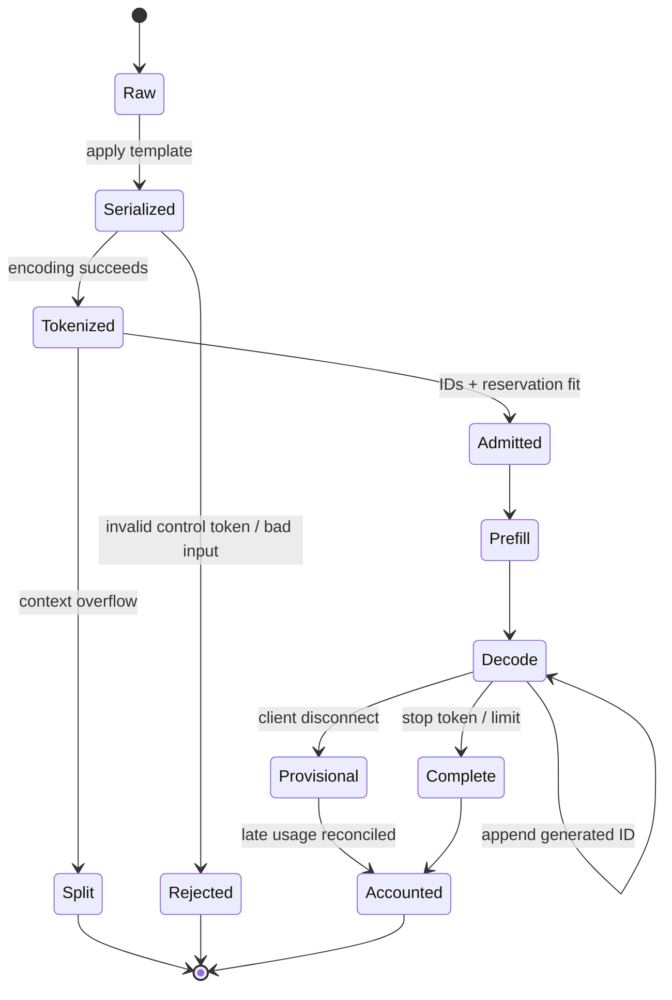

# Tokens and tokenizers

Status: durable

Sources: [OpenAI — January 14, 2026: partnership with Cerebras](https://openai.com/index/cerebras-partnership/); [OpenAI tiktoken README](https://github.com/openai/tiktoken); [Hugging Face Transformers — chat templates](https://huggingface.co/docs/transformers/chat_templating); [Hugging Face Tokenizers — ByteFallback](https://huggingface.co/docs/tokenizers/api/decoders); [OpenAI Cookbook — counting tokens with tiktoken](https://github.com/openai/openai-cookbook/blob/main/examples/How_to_count_tokens_with_tiktoken.ipynb)

## In one sentence

A tokenizer turns serialized text into model-specific integer IDs, and those IDs determine what a model can see, how much prefill work it performs, what can be cached, and how usage is accounted for.

## Background: what existed before

Traditional text software could measure characters, bytes, words, or lines. Those units are convenient for editors and databases, but a transformer does not consume a paragraph as a paragraph. It consumes a finite sequence of IDs. The model has an embedding row for each vocabulary ID, and the sequence length controls attention work and the amount of context available for generation.

Early language systems often used word-level vocabularies. A word vocabulary gives a clean interpretation to `market` and `markets`, but its unknown-word problem is severe: a new product code, typo, name, or inflected form has no row unless the vocabulary has been rebuilt. Character-level vocabularies avoid unknown words but make every common sentence much longer. Longer sequences increase memory and computation, and a character often carries too little linguistic information by itself.

Subword tokenization is the compromise. Byte-pair encoding (BPE) begins with small units and repeatedly merges frequent adjacent pairs according to learned merge ranks. Common pieces become compact tokens; rare words can be represented as several pieces. OpenAI’s `tiktoken` README describes BPE as reversible, applicable to arbitrary text, and useful because recurring subwords give the model reusable patterns. The exact vocabulary and merge table are part of a model interface, not an implementation detail that can be swapped without testing.

## What changed and why now

January 2026 made the systems consequence unusually visible. In its January 14 announcement, OpenAI described a Cerebras partnership intended to add 750 MW of ultra-low-latency AI compute, with capacity arriving in phases through 2028. The announcement connects faster inference to real-time interaction and longer outputs. That is a serving change, not a new tokenization algorithm, but it makes token boundaries operationally important: a high-output-rate path still has to tokenize the prompt, serialize chat correctly, reserve context, and account for every generated ID.

The January lesson is therefore a chain, not a vocabulary glossary: Unicode text becomes bytes; a pre-tokenizer or regular expression finds pieces; a vocabulary and merge ranks map pieces to IDs; a chat template adds role and control tokens; the model performs a prompt (prefill) pass and then autoregressive decode; usage and cache identity are derived from the exact serialized prefix. A mistake early in that chain can look like a latency, quality, or billing incident later.

## Engineering consequence

Pin the tokenizer, vocabulary, special-token policy, and chat template as one release artifact. Count the fully serialized request before admission, reserve output capacity, and persist the encoding/template versions with usage. A tokenizer change is a model-interface change: replay representative prompts, compare IDs and counts, and keep an explicit rollback path before exposing it to production traffic.

## Impact on current processing and architecture

Treat tokenization as a versioned boundary in the inference path:

```mermaid
flowchart LR
  T[Unicode text and messages] --> N[Normalization / serialization]
  N --> C[Chat template and control tokens]
  C --> E[Tokenizer: bytes, pieces, IDs]
  E --> A[Admission: context and output reservation]
  A --> P[Prefill: prompt attention state]
  P --> D[Decode: one new token at a time]
  D --> U[Usage, cache key, and response]
  classDef text fill:#fee2e2,stroke:#dc2626,color:#450a0a
  classDef transform fill:#dbeafe,stroke:#2563eb,color:#172554
  classDef model fill:#fef3c7,stroke:#d97706,color:#451a0a
  classDef output fill:#dcfce7,stroke:#16a34a,color:#14532d
  class T text
  class N,C,E,A transform
  class P,D model
  class U output
```



The important data contract is the serialized sequence, not the list of visible messages. A chat API may receive `{role: "user", content: "hello"}`, but the model sees a template-specific sequence containing role markers, separators, end-of-turn tokens, and perhaps a generation prompt. Hugging Face documents `apply_chat_template` for this conversion and warns that adding special tokens a second time can duplicate them and hurt performance. Counting the message strings before applying the template undercounts the actual input.

Prefill processes the entire input sequence and constructs the attention state used by decoding. Decode appends generated IDs one step at a time. A faster serving system can reduce decode time, but a longer tokenized prompt still costs prefill time and consumes context. A token budget should include input IDs, tool or schema definitions, reserved output IDs, and any provider envelope. Use `input + reserve <= context_limit` as an admission invariant, with a documented safety margin for serialization differences.

## Real-world applications and constraints

For a coding assistant, token count controls how much source can fit around the cursor. A character limit is misleading: indentation, punctuation, Unicode identifiers, and repeated code fragments have different tokenization behavior. The editor should count the exact prompt envelope, reserve enough output for a patch, and use a parent job ID when a large file must be split. A split is a semantic operation; silently dropping the beginning of a function can produce a syntactically valid but unsafe suggestion.

For an invoice extractor, OCR output may contain combining marks, unusual spaces, and currency symbols. The service should preserve the source bytes for audit, normalize only according to its model contract, and count after adding extraction instructions and the output schema. Tokenization does not validate the invoice. It only establishes the sequence the model receives; arithmetic and SKU checks remain separate.

For a multilingual support product, measure token-count distributions by language and script. `tiktoken` states that a token is about four bytes on average in practice, but that is an intuition, not a per-request guarantee. A byte-heavy identifier, emoji sequence, or non-Latin string can have a very different ratio. Capacity planning should use observed p50 and p99 counts and include the provider’s exact encoding rather than multiplying an English average.

For real-time voice or coding interaction, January’s low-latency serving announcement makes time-to-first-token and output rate visible product properties. The tokenizer is on the critical path before prefill, and the decode loop emits token IDs that are later decoded into bytes and text. A system that advertises a high output rate still needs to report prompt length, prefill latency, decode throughput, and client delivery separately. OpenAI’s announcement is evidence of an infrastructure direction and stated rollout, not proof that every route or user receives a particular rate.

## Mental model: bytes, pieces, IDs, and states

Think of an encoding as three coupled tables and one algorithm:

1. A pre-tokenization rule divides text into candidate pieces. In `tiktoken`, a regular-expression pattern is used before the native BPE operation.
2. UTF-8 turns each piece into bytes. Byte-level schemes make arbitrary input representable even when a complete word is absent from the vocabulary.
3. Merge ranks repeatedly choose the highest-priority available adjacent pair. The result is a sequence of byte strings, each looked up in the mergeable vocabulary.
4. Special tokens are reserved IDs for protocol or model-control events. They are not ordinary text. `tiktoken` deliberately treats disallowed special-token strings cautiously so an accidental string cannot silently become a control token.

Byte fallback is a related strategy used by some SentencePiece/LLaMA-style tokenizers. Hugging Face’s `ByteFallback` decoder recognizes tokens such as `<0x61>`, reconstructs bytes, and attempts UTF-8 decoding. Fallback preserves coverage for unknown characters, but it can lengthen rare text and produce a replacement character when bytes cannot form valid UTF-8. Do not assume that “byte-level BPE,” “byte fallback,” and “Unicode normalization” are interchangeable; they are different points in the pipeline.

The state machine is equally useful:



The state machine prevents common category errors. A tokenizer rejection is not a model refusal. A context overflow is not a provider outage. A client disconnect after the first token is not proof that no output was generated. Billing closes only after final usage is reconciled, especially for streaming.

## Chat templates and special tokens

A chat template is executable serialization logic, often stored as a Jinja template with the tokenizer. It decides how roles and content become the sequence used during training and inference. Hugging Face’s documentation shows `system`, `user`, and `assistant` messages, and explains `add_generation_prompt=True`: it appends the marker that tells a causal language model that an assistant response should begin. Without the marker, a model can continue the user turn or choose an unexpected continuation.

Training and inference need different endings. During training, examples normally include the complete assistant response and do not add a new-generation marker. During inference, the final user message usually needs a marker for the next assistant turn. `continue_final_message` is another distinct operation: it removes an end marker so generation continues an existing assistant prefix, which is useful for prefilling a JSON object. Combining it with `add_generation_prompt` is contradictory because one starts a new assistant message while the other continues the current one.

The failure mode is easy to reproduce: serialize a conversation, tokenize it, then serialize it again after a template edit. The visible messages may be identical while role markers, end tokens, or whitespace differ. The model can see a different prompt, the cache misses, and token counts change. Store a template version and a serialized-prefix digest beside every request. If a model repository ships a tokenizer with a chat template, load and test that template rather than inventing a wrapper in application code.

## Token accounting, caching, and low-latency inference

The OpenAI Cookbook explains why token counts are useful for checking whether text is too long and estimating API cost, while noting that different model encodings produce different counts. A production ledger should separate input tokens, cached-input tokens where the provider reports them, reserved output, actual output, and retry attempts. The local count is an admission estimate; the provider usage event is the billing reconciliation. Never multiply characters by a fixed constant and call that an invoice.

Cache identity must use the exact canonical prefix that was tokenized. A human-level hash of message objects can be wrong if dictionary order, whitespace, template version, special-token policy, or tool schema changes serialization. A safe key includes model snapshot, encoding/template version, tenant scope, and canonical bytes or a digest of those bytes. Prefix reuse can save prefill work, while KV caching retains attention state for decode; neither is semantic memory and neither authorizes reuse across tenants.

January’s Cerebras announcement highlights hardware and serving capacity aimed at low latency. The tokenizer still determines the length of the prefill sequence, and the chat template still determines what enters that sequence. A useful latency trace therefore has serialization time, tokenization time, input-token count, prefill/TTFT, decode tokens per second, and final usage. That trace can tell whether a “slow model” is actually receiving a huge tool schema or a prompt whose prefix stopped matching the cache.

## Limits and failure modes

Tokenizers are deterministic only relative to a pinned encoding and serialization contract. Unicode normalization can change identifiers; lone surrogates or invalid bytes can trigger replacement behavior; special-token text can be rejected or interpreted as a control event depending on allow/deny settings. A vocabulary optimized for one language or workload can be inefficient for another. A count cannot predict answer quality, and a lower count is not automatically a better prompt.

The most expensive failures are often boundary failures: counting messages before applying the chat template, adding special tokens twice, using a tokenizer from a different model family, truncating the wrong end of a conversation, or closing usage accounting on a disconnect. Test exact serialized bytes, not only rendered UI text. Keep a previous tokenizer/template version for rollback, and make overflow explicit as `context_exceeded`, `split_required`, or `summary_required`.

Byte fallback improves representational coverage but can expand rare text. Decoding arbitrary token bytes as Unicode can be lossy if invalid UTF-8 is replaced. Special tokens can unlock model behavior, so accepting them as ordinary user text without an explicit policy can create an unintended protocol boundary. These are tokenizer and serialization concerns, so they belong in encoding compatibility tests and template fixtures.

## Runnable low-cost example

This dependency-free program implements a tiny educational BPE merge loop. It is not a production tokenizer, but it makes vocabulary and merge rank behavior visible. It also demonstrates why a ledger must retain the encoding version.

```python
from dataclasses import dataclass

@dataclass
class TinyBPE:
    # Lower rank means “merge this pair first”.
    merges: dict[tuple[str, str], str]
    version: str = "toy-v1"

    def encode(self, text: str) -> list[str]:
        pieces = list(text.encode("utf-8"))
        pieces = [f"{b:02x}" for b in pieces]
        while True:
            adjacent = set(zip(pieces, pieces[1:]))
            candidates = [(rank, pair) for rank, pair in
                          enumerate(self.merges) if pair in adjacent]
            if not candidates:
                break
            pair = min(candidates)[1]
            merged = self.merges[pair]
            out, i = [], 0
            while i < len(pieces):
                if i + 1 < len(pieces) and (pieces[i], pieces[i + 1]) == pair:
                    out.append(merged); i += 2
                else:
                    out.append(pieces[i]); i += 1
            pieces = out
        return pieces

enc = TinyBPE({("68", "65"): "he", ("6c", "6c"): "ll"})
for s in ("hello", "hé", "বাংলা"):
    ids = enc.encode(s)
    print(enc.version, repr(s), ids, "count=", len(ids))
```

The toy vocabulary has only two merges, so most bytes stay separate. Real encodings have large mergeable vocabularies, special-token maps, and optimized native implementations. The useful lesson is that the same visible string can produce different lengths under different merge tables.

## Mini exercise (15–30 min)

Extend the program with a `decode()` method that joins hexadecimal byte pieces and decodes UTF-8 with `errors="strict"`. Add a third merge for a common ASCII fragment, then compare counts for English, code, an emoji, and a non-Latin string. Create a second encoding version with one merge removed. Write a small ledger containing text label, encoding version, token count, and whether the text fits a limit of 12 IDs. For a real provider, repeat the experiment with its official tokenizer and compare false accepts and false rejects; do not use the toy count for billing.

## Build it locally

1. Create a directory and save the Python example as `toy_bpe.py`; run it with Python 3.11 or newer.
2. Add `decode()` and assert that ordinary ASCII round-trips exactly; keep a failing fixture for invalid UTF-8 bytes.
3. Add a message list and a small `render_chat(messages, add_generation_prompt)` function that visibly inserts role and end markers before calling `encode()`.
4. Record `template_version`, `encoding_version`, `input_ids`, `reserved_output`, and `context_limit` in a JSON fixture; count only after rendering the chat envelope.
5. Install `tiktoken` in a disposable virtual environment if network access is available, compare `encoding_for_model()` with the toy encoder, and document that model/encoding mapping as a source-backed fact rather than copying a hard-coded count.
6. Add an overflow test, a special-token test, and a cache-key test whose digest changes when the template version changes.

## Interview Q&A

**Q: Why are subwords used instead of words or characters?** A: Word vocabularies have an unknown-word problem, while character sequences are long. Subwords provide reusable frequent fragments while retaining a way to represent rare text.

**Q: What does BPE actually learn?** A: A vocabulary of byte or text pieces and an ordered set of adjacent-pair merges. Encoding applies those merges to produce piece IDs; the model then looks up vectors for those IDs.

**Q: What is byte fallback?** A: A strategy in which unknown characters can be represented as byte tokens, such as `<0x61>`, and later reconstructed as bytes. It improves coverage but can increase sequence length and may replace invalid UTF-8 on decode.

**Q: Why count after applying a chat template?** A: Roles, separators, end markers, generation prompts, and tool schemas are part of the model input. Counting only visible message content underestimates context use.

**Q: What is the difference between prefill and decode?** A: Prefill processes the complete input sequence and builds attention state. Decode generates new IDs autoregressively, usually appending one position per step and reusing prior state.

**Q: Can a tokenizer change without changing the model?** A: The encoding is part of the model interface. Changing its vocabulary, merge ranks, special tokens, or chat template changes the IDs presented to the same weights and requires compatibility testing.

**Q: How should an overflow be handled?** A: Return an explicit state, then split, summarize, route to an approved larger context, or ask the caller to narrow the request. Silent truncation makes the evidence and instruction set unknowable.

**Q: What does January’s Cerebras announcement prove?** A: It is a January 14 source-backed announcement of a planned low-latency compute partnership and phased capacity. It supports discussing serving latency as a current systems concern; it does not establish a universal token rate or quality guarantee.

## Glossary

- **BPE:** Byte-pair encoding, a learned sequence of adjacent-pair merges.
- **Byte fallback:** Representing an unknown character with tokens for its raw bytes.
- **Vocabulary:** The mapping from token pieces or special strings to integer IDs.
- **Merge rank:** The priority that decides which adjacent BPE pair is merged first.
- **Special token:** A reserved ID used for a protocol or model-control event.
- **Chat template:** Serialization logic mapping role/content messages to a model sequence.
- **Prefill:** Processing the complete input prompt before new-token generation.
- **Decode:** Autoregressive generation of new token IDs.
- **Context window:** The model’s maximum input-plus-output token capacity.
- **Canonical serialization:** Deterministic bytes used for counting, caching, and replay.

## References

- [OpenAI — OpenAI partners with Cerebras (January 14, 2026)](https://openai.com/index/cerebras-partnership/)
- [OpenAI — tiktoken README and BPE explanation](https://github.com/openai/tiktoken)
- [OpenAI Cookbook — How to count tokens with tiktoken](https://github.com/openai/openai-cookbook/blob/main/examples/How_to_count_tokens_with_tiktoken.ipynb)
- [Hugging Face Transformers — Chat templates](https://huggingface.co/docs/transformers/chat_templating)
- [Hugging Face Tokenizers — ByteFallback decoder](https://huggingface.co/docs/tokenizers/api/decoders)
- [OpenAI tokenizer tool](https://platform.openai.com/tokenizer)

## Claim ledger

| Claim | Source | Fact or inference |
|---|---|---|
| OpenAI announced a January 14, 2026 Cerebras partnership, described 750 MW of planned ultra-low-latency compute, and said capacity would arrive in phases through 2028. | [OpenAI January announcement](https://openai.com/index/cerebras-partnership/) | Fact, scoped to the announcement |
| Faster serving makes prompt length, prefill, decode rate, and first-token timing useful operational measurements. | [OpenAI January announcement](https://openai.com/index/cerebras-partnership/) | Engineering inference |
| `tiktoken` describes BPE as reversible, usable on arbitrary text, and based on reusable subword pieces. | [tiktoken README](https://github.com/openai/tiktoken) | Fact, scoped to the implementation/documentation |
| A tokenizer’s vocabulary, merge ranks, special tokens, and chat template are compatibility inputs to a model call. | [tiktoken README](https://github.com/openai/tiktoken), [Hugging Face chat templates](https://huggingface.co/docs/transformers/chat_templating) | Engineering inference |
| Hugging Face documents byte-fallback decoding and warns that chat-template special tokens must not be duplicated. | [ByteFallback docs](https://huggingface.co/docs/tokenizers/api/decoders), [chat-template docs](https://huggingface.co/docs/transformers/chat_templating) | Fact, scoped to those libraries |
| Counting after serialization and reconciling provider usage are appropriate production controls. | [OpenAI Cookbook](https://github.com/openai/openai-cookbook/blob/main/examples/How_to_count_tokens_with_tiktoken.ipynb) | Engineering inference |
| The toy BPE program demonstrates algorithmic ideas but does not reproduce provider token IDs, latency, pricing, or model quality. | This lesson’s code and cited tokenizer documentation | Inference and limitation |
