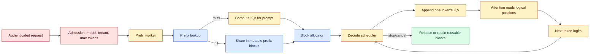
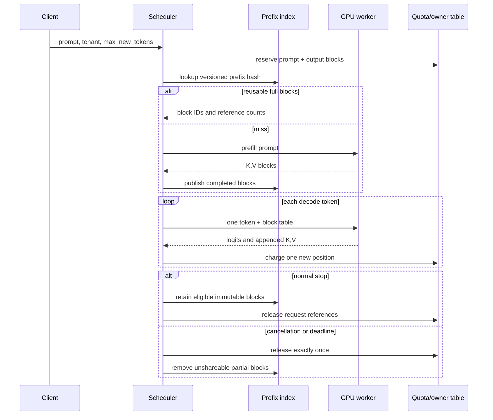

# KV caching
Status: durable
Sources: [Hugging Face — Cache strategies](https://huggingface.co/docs/transformers/kv_cache), [Hugging Face — Caching explanation](https://huggingface.co/docs/transformers/main/cache_explanation), [Kwon et al. — PagedAttention (2023)](https://arxiv.org/abs/2309.06180), [vLLM — Automatic Prefix Caching](https://docs.vllm.ai/en/v0.14.1/design/prefix_caching/), [NVIDIA TensorRT-LLM — KV cache system](https://nvidia.github.io/TensorRT-LLM/features/kvcache.html)

## In one sentence

A transformer KV cache keeps each decoder layer’s already-computed key and value vectors so the next token can attend to the prefix without recomputing that prefix, trading repeated matrix work for memory, allocation, and correctness obligations.

## Prerequisites

You should be comfortable with matrix multiplication, softmax, tensor dimensions, GPU memory measured in bytes, and an autoregressive decoder that predicts one token from earlier tokens. You do not need to know CUDA. The examples use a decoder-only transformer; encoder–decoder models additionally have encoder outputs and cross-attention state, so their cache contract is different. “Token,” “position,” “layer,” “query head,” and “KV head” are used in their usual transformer-serving sense and are defined again in the glossary.

## Background: what existed before

The prerequisite is causal self-attention. A decoder-only transformer maps a token sequence to queries (`Q`), keys (`K`), and values (`V`) in every attention layer. For a batch of size `B`, sequence length `T`, attention heads `H`, and head dimension `D`, a conventional representation is `[B, H, T, D]` for each of `K` and `V`. Attention is

```text
softmax(Q Kᵀ / √D + causal_mask) V
```

The causal mask prevents position `t` from seeing positions greater than `t`. Once position `t` has been processed, future tokens cannot alter that position’s key or value in a decoder-only model. Hugging Face’s [cache explanation](https://huggingface.co/docs/transformers/main/cache_explanation) therefore describes the past `K` and `V` tensors as reusable state: on a later forward pass, the current `K` and `V` are appended to the past tensors, and the query attends over the combined length. The attention mask and position information must describe that combined sequence; a cache is not merely a list of token IDs.

Before caching, a simple generation loop passed the entire sequence back through every layer to produce each new token. If the prompt has `P` tokens and generation produces `G` tokens, the loop performs work over lengths `P`, `P+1`, …, `P+G-1`. It also repeatedly materializes keys and values for positions that have not changed. This is correct but wasteful. The cache changes the loop: a prefill pass processes the prompt once, then each decode step sends only the newly generated token (plus its position) through the model while reading the saved `K,V` state.

This distinction explains two latency measures that are often confused. Time to first token (TTFT) includes tokenization, queueing, and prefill. Time per output token (TPOT), or its reciprocal decode tokens/second, is dominated by repeatedly reading the growing cache and running the one-token forward path. KV caching usually attacks repeated decode computation; it does not make a long prompt’s first prefill free. Prefix caching can attack TTFT when multiple requests share an exact prefix.

The cache is request-time numerical state, not semantic memory. It does not encode a durable fact that can be searched later, and it is not valid after changing weights, an adapter, rotary-position configuration, tokenizer interpretation, or any other condition that changes the computation. Treating it as conversation storage is a category error: a chat database can retain messages, while a KV cache is a model-specific intermediate representation for an active or reusable inference computation.

## What changed and why now

The basic optimization is old, but modern serving makes cache management a first-class systems problem. [Hugging Face’s cache-strategy documentation](https://huggingface.co/docs/transformers/kv_cache) exposes multiple cache implementations: `DynamicCache` grows as generation proceeds, `StaticCache` preallocates a maximum length to enable compilation, and quantized or offloaded variants trade numerical format or transfer time for lower GPU residency. The documentation explicitly presents these as trade-offs, not universally superior choices.

The 2023 [PagedAttention paper](https://arxiv.org/abs/2309.06180) identifies the serving bottleneck behind those choices: a large batch of variable-length requests makes contiguous KV allocation fragment memory and leaves unused capacity in each request’s reserved region. Its PagedAttention design divides KV state into blocks, maps logical token positions to physical blocks, and lets a request grow without requiring one contiguous allocation. The paper’s vLLM evaluation reports 2–4× throughput improvements at comparable latency against the systems it measured; that is a result for its benchmark and implementation, not a guarantee for every model or workload.

Modern runtimes add two important extensions. First, blocks can be shared when requests have an identical prefix, reducing both prefill work and duplicated memory. [vLLM’s automatic-prefix-caching design](https://docs.vllm.ai/en/v0.14.1/design/prefix_caching/) uses hashes of blocks and their prefix context to locate reusable KV blocks. [TensorRT-LLM’s KV-cache system](https://nvidia.github.io/TensorRT-LLM/features/kvcache.html) documents a similar block pool and radix search structure, with reuse and prioritized LRU eviction. Second, cache state can be quantized, offloaded to host memory, or restricted by a sliding attention window. Every extension shifts a different bottleneck: arithmetic precision, PCIe/NVLink transfer, allocator metadata, or the amount of context visible to a layer.

## Impact on current processing and architecture

At model level, one generation request has two phases:

1. **Prefill:** process the prompt, write one key and value vector for each prompt position in each layer, and produce logits for the next token.
2. **Decode:** select a token, process that token, append its layer-wise `K,V`, and repeat until stop, cancellation, or a token limit.

For a standard multi-head attention model, a useful byte estimate is:

```text
KV bytes = 2 × layers × tokens × KV_heads × head_dim × bytes_per_element
```

The first `2` is for keys and values. With grouped-query attention (GQA) or multi-query attention (MQA), `KV_heads` is smaller than the number of query heads, so the cache is smaller even though the query projection still has more heads. Example: 32 layers, 8 KV heads, head dimension 128, 4,096 active tokens, and BF16 (2 bytes) requires `2×32×4096×8×128×2 = 536,870,912` bytes, about 512 MiB, for one sequence. The estimate excludes allocator metadata, padding, temporary activations, and implementation-specific layout. Four such sequences consume about 2 GiB just for KV state.

The cache grows with active tokens, so concurrency and context length compete for the same GPU budget. A server that admits requests using only model-weight size can OOM during a long decode burst. Admission control should reserve enough blocks for the prompt and an output ceiling, or deliberately support preemption/offload with a documented latency cost. Cancellation must release every block exactly once; otherwise free capacity declines after apparently successful requests and the incident looks like a model leak.

### Architecture diagram: logical and physical cache state



In a contiguous cache, each layer commonly sees an array indexed by sequence position. In a paged cache, the logical sequence is unchanged, but a block table translates logical block `i` to a physical allocation. Attention kernels gather the right physical blocks. This is analogous to virtual memory only at the allocation abstraction: it does not make GPU memory infinite, and it adds block-table traversal and kernel complexity.

### Sequence diagram: prefill, decode, eviction, and cancellation



## Mental model: a typed, versioned state machine

Represent a cache handle as more than a pointer:

```text
(model_fingerprint, attention_config, tokenizer_revision,
 tenant_scope, request_id, logical_length, block_table)
```

The model fingerprint covers weights and adapter choice. Attention configuration covers head layout, rotary-position settings, sliding-window policy, and cache dtype. The scope identifies who may read or reference the state. `logical_length` prevents a decoder from treating uninitialized padding as valid context. The block table maps positions to storage.

The safe transitions are `EMPTY → PREFILLING → DECODING → COMPLETE` or `… → CANCELLED`. A reusable prefix enters a distinct `REUSABLE` state only after its producer has completed the work that makes the blocks immutable. A partial block may be copied for a child request; it should not be concurrently mutated by two owners. This is why a prefix-cache hit is not simply “same first characters”: it is a match over token IDs and the computation context that produced the block.

## Memory math and shape details

For a decoder with `L` layers, `Hq` query heads, `Hkv` key/value heads, and `D` dimensions per head, a token contributes `2 × L × Hkv × D` elements to the cache. MHA has `Hkv = Hq`; MQA has one KV head; GQA has an intermediate number. Cache layouts vary—some runtimes group layers inside a block, others keep a per-layer pool—so the formula predicts capacity, not an API tensor stride.

The batch dimension needs care. A dynamic cache can be viewed as `[B, Hkv, T, D]` per layer when all sequences share a length, but serving requests have different `T`. Padding every sequence to the largest `T` wastes capacity and causes attention to mask useless positions. Paged allocation stores only occupied token slots plus the final partially filled block. If block size is `b`, a sequence of `T` tokens uses `ceil(T/b)` blocks; internal slack is less than `b` tokens per sequence before sharing. Smaller blocks reduce slack and make prefix matches more likely, while increasing block-table entries and potentially reducing kernel efficiency.

Static allocation has a different shape. A `[B,Hkv,Tmax,D]` cache makes addresses predictable and can help `torch.compile`, but a short request still carries masked slots up to `Tmax`. Hugging Face calls this a memory/compute trade-off. Dynamic allocation avoids that upfront waste but can make shapes change and complicate compilation. Offloading keeps some layers’ cache on CPU and transfers them as layers execute; it can prevent GPU OOM while adding transfer latency. Quantization reduces bytes per element but requires a supported kernel and a quality check for the target model and prompts.

## Prefix caching, sharing, and eviction

Prefix caching is most valuable for repeated, immutable prefixes: a system prompt, a tool schema, or a large document header. The match must be token-exact, not merely text-similar. A changed system instruction, tokenizer version, adapter, position scheme, or tool definition can change the resulting vectors. Cache keys should include a runtime version and a tenant/public-scope policy. A public product policy may permit sharing a truly public system prompt; a private user document should remain in that user’s namespace even if its token sequence coincidentally matches another user’s.

The reuse lifecycle matters. TensorRT-LLM notes that a computed state becomes reusable only after the producing request terminates, and that only full blocks can be shared without copying; a partial match may require a private copy. It also documents prioritized LRU: when a blank block is needed, lower-priority reusable blocks are evicted first. This means a high cache-hit ratio is not a promise. A long output reservation can evict a frequently used system prompt, and a larger block can improve kernel efficiency while lowering the probability of a match near a boundary.

Do not evict live blocks. Use reference counts or ownership records: a block is evictable only when no active request points to it and policy allows its contents to be discarded. On cancellation, remove the request’s references, then reclaim blocks that have no other references. If a cache is offloaded to CPU, apply the same lifecycle and tenant deletion policy to the host copy. “Out of GPU memory” is not permission to silently reuse another tenant’s bytes.

## Latency, throughput, cost, and production metrics

KV caching changes the bottleneck rather than eliminating it. Prefill is often compute-heavy and can be batched efficiently; decode is often memory-bandwidth-heavy because each token reads many cached vectors. A cache hit can lower TTFT and prefill FLOPs, while a cache miss still pays lookup and bookkeeping overhead. Paging can raise throughput by fitting more active sequences, but block-table operations and fragmentation at the block level remain. Offload may increase capacity at the expense of TPOT. Quantization may cut memory and increase concurrency while changing output quality.

Measure at least:

- TTFT split into queue, prefix-lookup, prefill, and first-decode components.
- TPOT or decode tokens/second, with p50, p95, and p99 by request length.
- Prompt tokens, generated tokens, active sequences, reserved blocks, occupied slots, and internal block slack.
- Prefix lookup requests, exact hit tokens, copied partial blocks, reuse age, and eviction count by reason.
- GPU memory high-water mark, allocator failure count, offload bytes, transfer time, and cache dtype.
- Cancellation release latency and blocks whose reference count is nonzero after request completion.
- Cost per input/output token and cost per successful response, because cache misses and retries alter the denominator.

Compare cold and warm paths using the same prompts, model fingerprint, output policy, and concurrency. Averages can conceal a long-tail regression: a smaller block may improve hit rate but make p99 scheduler overhead worse; a high hit ratio can coexist with low savings if hits are tiny partial blocks. Keep a cache-disabled replay path to detect stale or incorrectly keyed state. The expected result is not necessarily byte-identical across kernels and dtypes, but it should satisfy the application’s numerical and behavioral tolerance.

## Real-world applications and constraints

In a chat server, the stable system prompt and conversation prefix can be reused within a session. New user text invalidates the suffix, so only the exact shared prefix is reusable. A strict retention timer and per-user quota bound privacy and memory risk. In code completion, editor requests often share a file prefix while the cursor moves; the cache key must include the file revision and language/tool configuration, or old source can leak into a completion. In retrieval-augmented generation, a shared policy and instruction prefix may be cacheable, but retrieved passages are request-specific unless their scope is explicitly public.

Batch summarization benefits less from cross-request prefix reuse when every document is unique, but paged allocation can still improve packing of variable documents. A streaming assistant values TTFT and predictable TPOT; an offline batch route may accept offload or lower-priority eviction for higher total throughput. Multi-tenant providers should isolate cache indexes, enforce memory quotas, and make deletion observable. Security review should include timing and error behavior: a tenant must not learn that another tenant has a matching private prefix from hit/miss latency or cache occupancy.

## What changed this month

January 2026 uses KV caching as a durable systems concept rather than claiming a new January release. The source-backed progression is: Hugging Face documents cache APIs and static/dynamic/offloaded choices; PagedAttention explains block-level allocation for variable-length serving; vLLM and TensorRT-LLM document prefix reuse, block sharing, and eviction. The month’s engineering lesson is to connect the tensor invariant to admission, scheduling, observability, and tenant isolation. Statements about a particular runtime remain release-specific; the design recommendations below are inferences to validate in the deployment’s own benchmark.

## Engineering consequence

Make cache state an explicit dependency of the decoder, with a versioned key and owner. Reserve capacity before prefill, charge every appended token, and release on every terminal path. Keep a cold path for correctness comparison. Roll out prefix reuse behind a metric and a kill switch; start with public or single-tenant prefixes, then test private multi-tenant traffic. A useful launch gate is not “cache hit rate above X” alone: require TTFT improvement, no cross-owner references, bounded p99 allocator latency, no post-completion live blocks, and acceptable output agreement against the cold path.

## Limits and failure modes

1. **Wrong cache key:** The text matches but model, adapter, position encoding, tokenizer, or cache dtype differs. Result: incorrect logits. Include all computation-affecting inputs in the fingerprint.
2. **Prefix collision or weak hash policy:** Distinct token/context sequences map to one reusable entry. Verify full metadata and, where required, token IDs before reuse.
3. **Cross-tenant exposure:** A shared index or block table references private state. Enforce scope checks before lookup and reference creation; test denial paths, not only successful hits.
4. **Reference leak:** A cancelled request leaves blocks pinned. Make release idempotent and periodically reconcile references against active requests.
5. **Evicting a live block:** Reusing storage while a decode kernel still reads it creates corruption. Evict only after synchronization and ownership checks.
6. **Fragmentation and slack:** Blocks are too large, or static caches are oversized. Track occupied slots versus reserved slots and benchmark block sizes.
7. **OOM during growth:** The prompt fits but the output reservation does not. Admit against a max-output policy, preempt safely, or return a typed capacity error.
8. **Sliding-window mismatch:** A layer may intentionally discard states outside its window; treating that cache as full attention changes behavior. Follow the model’s attention contract.
9. **Offload surprise:** CPU copies avoid OOM but add transfer latency and may violate retention/deletion expectations. Account for both locations.
10. **Numerical drift:** Quantized KV state can alter logits. Evaluate task quality and stopping behavior, not only memory savings.

## Mini exercise (15–30 min)

Use the simulator below with `layers=32`, `kv_heads=8`, `head_dim=128`, `dtype_bytes=2`, `page_tokens=16`, and a 2,048-page pool. Create two tenants with prompts of 1,024 and 3,000 tokens. First calculate the byte estimate; then show that the second request cannot be admitted if its maximum output would exceed the pool. Add a completed shared prefix for tenant `public` and verify that a private tenant cannot claim it. Finally cancel the long request twice and assert that free pages increase only once.

## Runnable low-cost example

Save as `kv_cache_lab.py`; it uses only the Python standard library.

```python
from dataclasses import dataclass, field
from math import ceil

def kv_bytes(layers, tokens, kv_heads, head_dim, dtype_bytes):
    return 2 * layers * tokens * kv_heads * head_dim * dtype_bytes

@dataclass
class Block:
    owner: str | None = None
    refs: set[str] = field(default_factory=set)
    reusable: bool = False

class CachePool:
    def __init__(self, block_count, page_tokens):
        self.page_tokens = page_tokens
        self.blocks = [Block() for _ in range(block_count)]
        self.allocations = {}

    @property
    def free(self):
        # An unreferenced reusable block remains occupied by its cached prefix.
        return sum(not b.refs and not b.reusable and b.owner is None
                   for b in self.blocks)

    def reserve(self, request_id, tenant, tokens):
        need = ceil(tokens / self.page_tokens)
        if need > self.free:
            raise MemoryError(f"need {need} blocks, only {self.free} free")
        chosen = [i for i, b in enumerate(self.blocks)
                  if not b.refs and not b.reusable and b.owner is None][:need]
        for i in chosen:
            self.blocks[i].owner = tenant
            self.blocks[i].reusable = False
            self.blocks[i].refs.add(request_id)
        self.allocations[request_id] = chosen
        return chosen

    def complete(self, request_id, make_reusable=False):
        for i in self.allocations.pop(request_id, []):
            block = self.blocks[i]
            block.refs.discard(request_id)
            if block.refs:
                continue
            # A consumer releases its reference without destroying a shared
            # reusable prefix owned by an earlier completed request.
            if block.reusable:
                continue
            block.reusable = make_reusable
            if not block.reusable:
                block.owner = None

    def cancel(self, request_id):
        # Idempotent: a second cancellation has no effect.
        self.complete(request_id, make_reusable=False)

    def share_public_prefix(self, request_id, prefix_ids):
        for i in prefix_ids:
            block = self.blocks[i]
            if block.owner != "public" or not block.reusable:
                raise PermissionError("prefix is not public and reusable")
            block.refs.add(request_id)
            self.allocations.setdefault(request_id, []).append(i)

if __name__ == "__main__":
    print("one sequence:", kv_bytes(32, 4096, 8, 128, 2) / 2**20, "MiB")
    pool = CachePool(block_count=8, page_tokens=16)
    first = pool.reserve("r1", "public", 32)
    pool.complete("r1", make_reusable=True)
    pool.share_public_prefix("r2", first)
    print("free after shared prefix:", pool.free)
    pool.cancel("r2")
    pool.cancel("r2")
    print("free after idempotent cancel:", pool.free)
```

This models allocation, ownership, public-prefix reference counting, and idempotent cancellation. It intentionally does not implement attention kernels, GPU synchronization, hashing, eviction policy, or numerical equivalence. Those omissions are useful boundaries for an exercise: a page counter can prove a release invariant, but it cannot prove that a production kernel read the right key and value rows.

## Build it locally

1. Create a virtual environment if desired; no third-party package is required.
2. Run `python kv_cache_lab.py` and record the 512 MiB estimate for the example configuration.
3. Change `page_tokens` to 8, 16, and 128; calculate reserved blocks for several sequence lengths and compare internal slack.
4. Add a `prefix_key` containing model fingerprint, token tuple, adapter, and tenant scope. Refuse reuse when any field differs.
5. Add an LRU list for reusable blocks and evict only blocks with an empty `refs` set.
6. Add counters for `prefill_tokens`, `decode_tokens`, `hit_tokens`, `evictions`, and `release_errors`; export them as plain text.
7. Write tests for duplicate cancellation, a private-prefix denial, an over-capacity reservation, and a model-version mismatch.
8. For a framework experiment, run the same fixed prompt with Hugging Face `use_cache=True` and `use_cache=False`, then compare TTFT, TPOT, peak memory, and generated-token agreement. Pin the model revision and do not treat one laptop measurement as a serving benchmark.

## Interview Q&A

**Q: What exactly is cached?**  A: Per decoder layer, the key and value vectors for positions already processed. Query vectors are produced for the current step and are not retained as the same reusable history.

**Q: Why does decode become roughly linear in context length?**  A: Each new query still attends to all visible past keys and values, so one step reads a growing sequence; caching removes recomputation of past projections, not the need to read the context.

**Q: What is the difference between prefill and decode?**  A: Prefill processes many prompt tokens and creates initial KV state; decode repeatedly processes one newly selected token while appending its state.

**Q: Why use pages instead of one contiguous tensor?**  A: Variable-length requests would otherwise require costly moves or over-reservation. Pages improve packing and permit block sharing, at the cost of metadata and more complex kernels.

**Q: When is prefix reuse safe?**  A: When token IDs and every computation-affecting context—weights, adapter, positions, attention policy, dtype, and scope—match, and the blocks are immutable and authorized for the requester.

**Q: Is a high hit rate enough to prove value?**  A: No. Measure hit tokens, saved prefill time, lookup overhead, p99 latency, memory pressure, and output correctness. Tiny hits can inflate the ratio without saving meaningful work.

**Q: Why can GQA lower KV memory?**  A: Keys and values are stored for `Hkv` groups, not every query head. Fewer KV heads reduce the multiplicative term in the byte formula.

**Q: What should cancellation test?**  A: Exactly-once release, no live references after completion, no reuse of partial mutable blocks, and no ability for a later request to read released contents.

**Q: When would static cache be preferable?**  A: When predictable shapes and compilation materially improve a workload with similar lengths, and the extra reserved/masked capacity fits the memory budget.

**Q: Does offloading eliminate the cache cost?**  A: No. It exchanges scarce GPU memory for host memory and transfer time; measure the latency and bandwidth path.

## Glossary

- **KV cache:** Stored key and value vectors from previous positions in decoder attention.
- **Prefill:** Initial forward pass over the prompt that populates the cache.
- **Decode:** Autoregressive generation of subsequent tokens using existing KV state.
- **TTFT:** Time to first generated token, including queueing and prefill.
- **TPOT:** Time per output token after the first token.
- **MHA:** Multi-head attention, where query and KV heads have the same count.
- **MQA:** Multi-query attention, where many query heads share one KV head.
- **GQA:** Grouped-query attention, where groups of query heads share KV heads.
- **PagedAttention:** Block-addressed attention/cache design introduced for variable-length serving by Kwon et al.
- **Prefix caching:** Reusing KV blocks for an exact, compatible prompt prefix.
- **Block table:** Mapping from logical token blocks to physical KV-cache blocks.
- **Internal slack:** Unused token slots reserved in a partially filled block.
- **Eviction:** Removing an unreferenced reusable block to make capacity available.
- **Offloading:** Moving some KV state from GPU memory to host memory.
- **Cache fingerprint:** Version and configuration metadata required to prove state compatibility.

## References

1. Hugging Face, “Cache strategies,” including dynamic, static, quantized, offloaded, and prefix-prefill cache examples: [transformers documentation](https://huggingface.co/docs/transformers/kv_cache).
2. Hugging Face, “Caching,” including attention shapes, cache positions, masks, and the `[batch, heads, seq_len, head_dim]` layout: [transformers documentation](https://huggingface.co/docs/transformers/main/cache_explanation).
3. Woosuk Kwon et al., “Efficient Memory Management for Large Language Model Serving with PagedAttention,” 2023: [arXiv paper](https://arxiv.org/abs/2309.06180).
4. vLLM team, “Automatic Prefix Caching,” describing block hashes and prefix lookup: [vLLM design documentation](https://docs.vllm.ai/en/latest/design/v1/automatic_prefix_caching.html).
5. NVIDIA, “KV Cache System,” describing block pools, reuse, radix search, and prioritized eviction in TensorRT-LLM: [TensorRT-LLM documentation](https://nvidia.github.io/TensorRT-LLM/features/kvcache.html).
6. NVIDIA, “KV cache reuse,” including full-block sharing, block-size trade-offs, reuse timing, and LRU behavior: [TensorRT-LLM documentation](https://nvidia.github.io/TensorRT-LLM/latest/legacy/advanced/kv-cache-reuse.html).

## Claim ledger

| Claim | Source | Fact or inference |
|---|---|---|
| Causal decoder attention can reuse past keys and values because future positions do not change those past projections. | [Hugging Face caching explanation](https://huggingface.co/docs/transformers/main/cache_explanation) | Fact, scoped to the documented causal-attention model |
| Cache tensors are commonly represented per layer with shape `[batch_size, num_heads, seq_len, head_dim]`. | [Hugging Face caching explanation](https://huggingface.co/docs/transformers/main/cache_explanation) | Fact about the documented reference layout; runtimes may pack or transpose it |
| Dynamic, static, quantized, and offloaded caches make different memory, compilation, and transfer trade-offs. | [Hugging Face cache strategies](https://huggingface.co/docs/transformers/kv_cache) | Fact about the documented implementations |
| The KV byte estimate is `2 × layers × tokens × KV_heads × head_dim × bytes`. | [Hugging Face caching explanation](https://huggingface.co/docs/transformers/main/cache_explanation) and the attention-shape definition | Inference derived from storing K and V for every layer and token |
| PagedAttention addresses fragmentation and variable-length KV allocation with block-based management. | [PagedAttention paper](https://arxiv.org/abs/2309.06180) | Fact reported by the paper |
| The paper reports 2–4× throughput improvement for vLLM at similar latency on its evaluated baselines. | [PagedAttention paper](https://arxiv.org/abs/2309.06180) | Fact limited to that paper’s benchmarks, models, and comparison systems |
| Prefix reuse requires exact compatible context, not text similarity alone. | [vLLM automatic prefix caching](https://docs.vllm.ai/en/v0.14.1/design/prefix_caching/), [TensorRT-LLM reuse](https://nvidia.github.io/TensorRT-LLM/latest/legacy/advanced/kv-cache-reuse.html) | Engineering inference from token/block hashing and runtime compatibility requirements |
| Only immutable, authorized, unreferenced blocks should be shared or evicted. | [TensorRT-LLM KV cache system](https://nvidia.github.io/TensorRT-LLM/features/kvcache.html) | Engineering inference from documented reference sharing and eviction behavior |
| Block size trades matching opportunity and internal slack against metadata and kernel efficiency. | [TensorRT-LLM KV cache reuse](https://nvidia.github.io/TensorRT-LLM/latest/legacy/advanced/kv-cache-reuse.html) | Fact for the documented runtime, generalized as a systems trade-off |
| Cache hit rate alone is insufficient; production value requires latency, memory, cost, and correctness measurements. | All sources plus the simulator’s stated limits | Engineering inference; validate with a deployment-specific benchmark |
| Tenant namespaces, deletion, and timing-isolation requirements are necessary controls for private prefix reuse. | Runtime documentation establishes reuse mechanics; privacy control is not promised by those sources | Engineering inference and deployment requirement |
