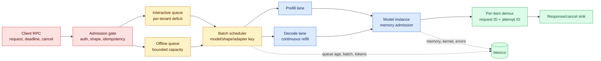
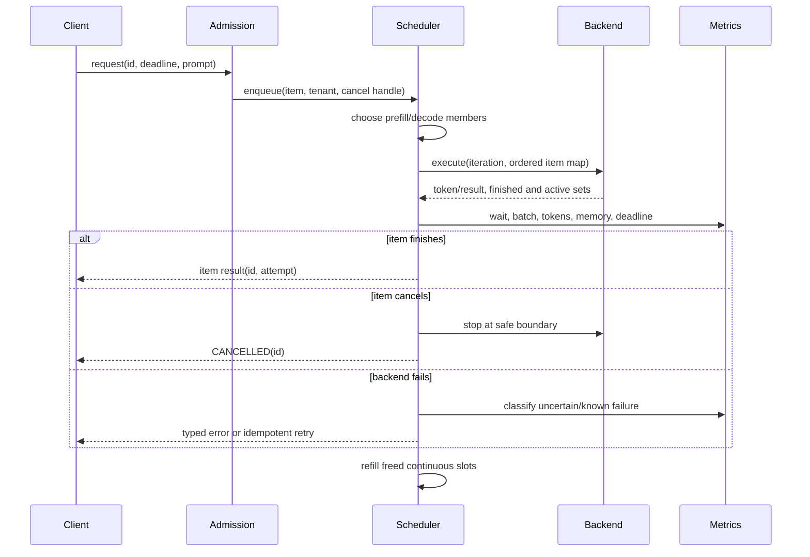

# Dynamic and Continuous Batching
Status: durable
Sources: [NVIDIA Triton batchers — dynamic, sequence, and iterative batching](https://docs.nvidia.com/deeplearning/triton-inference-server/user-guide/docs/user_guide/batcher.html); [NVIDIA Triton model configuration](https://docs.nvidia.com/deeplearning/triton-inference-server/user-guide/docs/user_guide/model_configuration.html); [NVIDIA Triton request cancellation](https://docs.nvidia.com/deeplearning/triton-inference-server/user-guide/docs/user_guide/request_cancellation.html); [NVIDIA Triton metrics](https://docs.nvidia.com/deeplearning/triton-inference-server/user-guide/docs/user_guide/metrics.html)

## In one sentence

Batching is a scheduling contract: Triton waits briefly to assemble compatible requests, runs them together, and must still account for every request's deadline, output, cancellation, and failure independently.

## Why an SDE2 should care

An accelerator is a queueing system with expensive setup and enormous parallel capacity. Sending one request at a time often pays launch, memory-transfer, and kernel overhead repeatedly. Sending a batch can amortize that work, but the request that arrived first now waits for neighbors and may be held behind a long computation. The optimization therefore crosses API, model shape, scheduler, memory, and operations boundaries. A design that reports only GPU utilization is incomplete: a customer experiences arrival-to-first-token or arrival-to-final-result latency, not utilization.

The important distinction is between *dynamic batching* and *continuous (also called inflight or iteration-level) batching*. Dynamic batching creates one batch from requests waiting in a queue and executes it as one model call. It is a natural fit for stateless classifiers, embeddings, and fixed-shape image models. Continuous batching reconsiders membership at each generation iteration. A sequence that emitted its last token releases its slot, and a waiting request can enter the next iteration while other sequences continue decoding. It is a different scheduling loop, not a larger JSON payload.

## Prerequisites: the pieces you need first

You should be comfortable with an RPC request and response, a FIFO queue, a deadline, and a histogram such as p50/p95/p99 latency. A *tensor shape* describes the dimensions sent to a model; the batch dimension is usually the first dimension. *Padding* adds filler positions so differently sized inputs can share a tensor, and padding is wasted computation when the model performs work on those fillers. A *token* is a model input or generated unit of text. In generation, *prefill* processes the prompt and builds attention state; *decode* repeatedly predicts one or more next tokens using that state. A request can therefore be cheap at admission but hold GPU memory for many decode iterations.

One more prerequisite is correlation. A server may reorder, filter, cancel, or complete members independently. Every item needs a request ID, attempt ID, tenant, model version, arrival time, deadline, and cancellation state. A numeric position in a tensor is not a durable identity: after one member is rejected, position 2 in the output is no longer necessarily request 2.

## Background: what existed before

The historical baseline was single-request execution: a client called the model, the worker copied its tensors, executed one kernel graph, and returned one result. This made reasoning simple but left parallel hardware underfilled at low request rates. A second baseline, *static batching*, collected exactly N requests or relied on an upstream job to construct a batch. Static batching is efficient for a known offline dataset but awkward for interactive traffic: the first request can wait indefinitely when fewer than N peers arrive, and one slow or failed item complicates the whole job.

Frameworks then added a server-side batch queue. A dynamic batcher can launch a partial batch when it reaches a size limit or a bounded wait expires. The scheduler owns the wait and keeps the client API item-oriented. This is the baseline described by Triton: a dynamic batcher combines inference requests for a stateless model, distributes formed batches to configured model instances, and exposes controls for preferred sizes, delay, queue size, priorities, and timeouts. These are release-specific capabilities of Triton; their resulting latency or cost depends on a particular backend and workload.

Autoregressive generation exposed a new problem. A static generation batch runs a prompt stage and then repeatedly decodes all sequences together. A short answer finishes early but its slot may remain padded while a long answer continues. A continuous scheduler treats each iteration as a scheduling opportunity. Triton's documented iterative-sequence mode lets a backend yield an in-flight request after one iteration; Triton reschedules unfinished requests and mixes them with new ones. The documentation describes this as continuous, iteration-level, or inflight batching and notes that it can release slots as requests complete. The exact memory layout and token scheduling policy remain backend-specific.

## What Triton actually changes

Triton starts with a model configuration. A model that supports a batch dimension declares `max_batch_size` greater than zero; a model that cannot batch must use zero. The dynamic batcher is enabled with `dynamic_batching { }`. With default settings, Triton forms the largest available batch up to the maximum and does not intentionally wait. This detail matters: enabling dynamic batching does not automatically mean “wait for eight requests.” It means “batch what is available, subject to the model limit.”

The following is a deliberately small configuration sketch for an embedding-like, stateless model. It is not a promise that batch size 8 is optimal.

```protobuf
name: "ticket_encoder"
platform: "onnxruntime_onnx"
max_batch_size: 8
input [
  { name: "INPUT_IDS" data_type: TYPE_INT32 dims: [ -1 ] }
]
output [
  { name: "EMBEDDING" data_type: TYPE_FP32 dims: [ 768 ] }
]
dynamic_batching {
  max_queue_delay_microseconds: 2000
  preserve_ordering: true
  priority_levels: 2
  default_priority_level: 1
  default_queue_policy {
    max_queue_size: 512
  }
}
```

There are several traps in this snippet. The input is variable length, so the backend must support the shape and the server may need ragged input or padding. `preserve_ordering` is a response-order contract, not a fairness policy; it can make a fast response wait behind an earlier response. Priority levels let higher-priority requests bypass lower-priority ones, but they can starve low priority without an aging or capacity rule. `max_queue_size` is a memory and backpressure boundary, not a throughput target. The 2 ms delay is a maximum additional scheduler wait when a preferred or maximum batch is unavailable; it should be measured against the request's remaining deadline.

Triton documents `preferred_batch_size` but recommends avoiding it for most models; it is most useful when a model, such as one with TensorRT optimization profiles, has a materially faster execution at particular sizes. A preferred size should therefore be justified by a benchmark, not by the pleasing number 8. Triton also supports custom batching strategies for more complex inclusion decisions. Such a strategy can enforce compatibility constraints (for example, modality or adapter) but moves logic into native code and increases the test and rollout burden.

## Dynamic versus continuous execution

For an embedding request, the lifecycle is usually `admit → wait → pad/pack → execute → split outputs → respond`. The model call has a single completion point. If one member fails validation, the scheduler can omit it and preserve the mapping for the other outputs. The batcher's fairness unit is still one request even though the accelerator receives one tensor.

For a text-generation request, the lifecycle is closer to `admit → prefill → decode repeatedly → stop/cancel → respond`. Prefill consumes a prompt's tokens and creates key-value attention state. Decode consumes one step (or a backend-defined group of steps) for each active sequence. A continuous scheduler should avoid letting a new, very long prompt monopolize every decode turn, but a decode-heavy batch should not prevent new prompts from ever entering. There is no universally correct ratio: the choice depends on the service's time-to-first-token (TTFT), time-between-tokens (TBT), final latency, and memory SLOs.

The source documents the scheduler mechanism, not a particular prefill/decode policy. A useful engineering design is to maintain separate ready queues for prefill and decode and let the scheduler reserve a bounded portion of each iteration for decode. For example, a 16-slot worker might admit at most two prefills per round while preserving 14 slots for active decodes, then adjust the reservation from queue age and TTFT. This prevents an arrival burst of long prompts from starving people already watching a response. It can reduce peak prefill throughput, so the trade-off must be measured rather than assumed.

Memory is the second constraint. Each active generation sequence owns attention state, and a continuous scheduler cannot admit a request merely because an arithmetic slot is empty. It needs enough free memory blocks for the prompt and a forecast of decode growth, or it needs a policy to evict, pause, or reject. A safe admission check is `resident_state + estimated_prompt_state + reserve ≤ memory_budget`. The estimate is intentionally conservative; if it is wrong, an out-of-memory failure can terminate unrelated members. Track memory-block pressure separately from batch size.

## Queueing, tail latency, and fairness

For request `i`, a useful decomposition is:

```text
end_to_end_i = network_in + admission_wait_i + batch_wait_i
              + prefill_i + decode_i + serialization_i + network_out
```

Batching changes `batch_wait_i`, and continuous batching changes the relationship between `prefill_i` and `decode_i`. Under light traffic, a 2 ms queue delay can dominate all model work. Under a burst, waiting for the maximum batch may add little delay because the queue fills immediately. Under overload, queueing grows nonlinearly: once arrivals approach service capacity, a small increase in arrival rate can push p95 and p99 far beyond the mean. This is why a benchmark at one steady request rate is not enough.

Use deadlines as admission inputs. If a request has 3 ms remaining and the configured delay is 5 ms, do not blindly wait; flush it, route it to a latency lane, or return a typed deadline-exceeded response. A queue timeout must be distinguishable from model failure, client cancellation, and overload. Otherwise a retrying client can amplify load and hide the original cause.

Fairness requires more than FIFO. A single global queue allows a tenant submitting a large export to consume every batch slot. Separate interactive and offline queues, or use priority levels plus per-tenant token/request quotas. Weighted fair scheduling is a reasonable inference: give each tenant a deficit budget measured in requests or estimated tokens, then select the eligible tenant with the largest deficit while respecting deadlines. Refill deficits over time so an idle tenant can burst briefly, and cap any one tenant's resident sequences. Measure queue age and deadline misses by tenant and route. Aggregate p95 can look healthy while one small tenant is consistently starved.

`preserve_ordering` and fairness solve different problems. Preserving arrival order may be required by a legacy client, but it can reintroduce head-of-line blocking at the response layer. If responses are independent, return each with its request ID and allow out-of-order completion. If ordered streaming is required, document the buffering cost and set a maximum reorder window. The invariant is correlation, not incidental tensor position.

## Cancellation and partial completion

Cancellation is a capacity feature. Triton's request-cancellation documentation explains that long-running requests can become unnecessary, that core checks cancelled requests at critical points in dynamic or sequence batching, and that backend cooperation is required once work has reached execution. It lists TensorRT-LLM, vLLM, and Python backends as supporting early termination at the time of writing, with Python models responsible for checking cancellation. Treat this as a capability matrix to verify for the deployed backend, not as a universal property of Triton.

There are three states to handle:

1. **Queued cancellation:** remove the item before it enters a batch, release its input buffer, and emit `cancelled_before_execute`.
2. **In-flight cancellation:** mark the item cancelled, let the backend observe it at a safe iteration boundary, and stop its decode or sequence. Other members continue if the backend supports independent termination.
3. **Post-compute cancellation:** computation may already be committed. Suppress delivery to the caller, but record compute waste and do not pretend that cancellation rolled back an external side effect.

The batch result must be itemized. If members A, B, and C enter one execution and B cancels, return A and C with their own IDs, mark B cancelled, and record a batch attempt ID. If the entire execution fails after an uncertain device error, retry only with an idempotency key and an explicit policy for whether the model call is safe to repeat. A callback or tool invocation inside a model pipeline needs a receipt check before replay; batching does not make a side effect transactional.

## Autoscaling without chasing queue noise

Autoscaling is an inference from the queueing model, not a behavior promised by Triton dynamic batching. Scaling on GPU utilization alone is unsafe: a heavily utilized worker may have healthy latency because batches are full, while a lightly utilized worker may be serving a latency-sensitive stream with mostly decode work. Scale signals should include runnable queue depth, oldest eligible request age, TTFT/TBT, active sequences, memory pressure, batch occupancy, and deadline-miss rate.

Use two time constants. A fast signal protects an interactive SLO: if oldest age or predicted deadline misses rises for several windows, add capacity or reduce the batching delay. A slow signal protects cost: if queues are empty, active sequences remain below a floor, and utilization is low for a cooldown period, remove a replica. Hysteresis prevents a burst from causing scale-out followed by immediate scale-in. Warm-up matters because loading weights and compiling kernels can be slower than a request's deadline. Keep a warm floor for interactive traffic and allow offline workers to scale toward zero.

Capacity planning should use *tokens per second* or another work unit in addition to requests per second. Ten 20-token generations are not equivalent to ten 4,000-token generations. A scheduler can estimate demand as prompt tokens plus expected output tokens, but the estimate is uncertain; record actual usage and feed it back into the policy. Route long-context requests to a lane with an explicit budget, otherwise one request can consume memory and produce a tail-latency incident for every tenant.

## Architecture and data flow



The model/shape/adapter key is important: combining requests with incompatible dimensions, quantization, modality, or adapter state forces padding or an invalid invocation. Admission owns permission and quotas; the scheduler owns placement and timing; the backend owns model execution and cancellation checks; the demultiplexer owns correlation. Keeping those responsibilities visible makes incidents diagnosable.

## Sequence and failure flow



The `finished and active sets` are what make continuous batching different from a static generation batch. The backend returns enough state for Triton to release completed requests and reschedule the rest. A failure path must not shift output indices or retry a completed member as if it were pending.

## Metrics and an operating playbook

Record a histogram for scheduler wait, not only end-to-end latency. At minimum, break it down by model version, route, batch key, tenant, priority, and request work estimate. Useful counters and gauges include:

- `batch_requests_total` and `batch_size` distribution, including partial flushes;
- `queue_wait_seconds`, `oldest_queue_age_seconds`, and queue rejection/timeout counts;
- prefill TTFT, decode TBT, final latency, generated tokens, and cancelled tokens;
- padding ratio or ragged-token ratio, active sequence count, and memory-block reservation failures;
- per-tenant share, weighted wait, deadline misses, and priority starvation age;
- item-level success, cancellation, validation failure, backend error, and uncertain retry;
- GPU/accelerator utilization, host-to-device time, model execution time, and cost per request or token.

Triton's metrics documentation and built-in count metrics can expose server-level observations, but application labels such as tenant and deadline class must be added carefully. High-cardinality raw request IDs do not belong in a metric label; keep IDs in sampled traces or structured logs with retention controls. A trace should connect admission, queue entry, flush, each generation iteration when sampled, cancellation, and response. Redact prompt contents by default.

Tune one control at a time. Establish a no-batching baseline, then compare max batch size, queue delay, and instance count under empty, steady, bursty, mixed-length, cancellation-heavy, and overload traffic. Accept a change only if throughput or cost improves without violating protected p95/p99 and fairness slices. If the queue grows while utilization is low, investigate shape incompatibility, memory admission, or a slow downstream sink before adding replicas.

## Real-world application: support-ticket summarization

Imagine a helpdesk that summarizes new tickets interactively and summarizes a historical export overnight. Both use one encoder-decoder model, but their contracts differ. Interactive calls have a 500 ms p95 final-result target and can be cancelled when an agent closes a ticket. Offline work can wait minutes and should maximize tokens per dollar.

Create two bounded routes. The interactive route uses a small delay, a per-tenant quota, and a reserved worker floor. The offline route uses a larger batch limit, lower priority, and a queue cap that returns work to a durable job system when full. Group by model version, tokenizer, and input-shape bucket. Carry `ticket_id`, `request_id`, and `attempt_id` through demux; never rely on list position. If the interactive request cancels while queued, remove it. If it cancels during decoding, stop at the next backend-safe boundary and release memory.

The first canary compares batching disabled, dynamic batching only, and continuous generation where supported. Watch accepted summaries for semantic regressions separately from scheduler performance. A useful outcome dashboard shows interactive p50/p95/p99, oldest queue age, offline completion rate, tenant fairness, GPU cost per ticket, cancellation waste, and memory admission failures. A 20% utilization increase is not a success if the p99 doubles or offline jobs starve an interactive tenant. This application is an engineering design example; Triton does not guarantee summary quality, SLOs, or the suitability of a particular batch size.

## Limits and failure modes

**Shape fragmentation.** A queue that mixes token lengths, modalities, or adapters may form many tiny batches. Bucket by compatible shape and measure the cost of padding; do not hide fragmentation behind an average batch size.

**Head-of-line blocking.** One long prompt, long decode, or ordered response can delay short requests. Use separate lanes, continuous refill, deadline-aware selection, and an explicit policy for ordered clients.

**Memory oversubscription.** A vacant compute slot is not necessarily a safe generation slot. Reserve state memory, cap context and output length, and return a typed resource-exhausted response before allocating unbounded buffers.

**Priority starvation.** Priority queues improve urgent latency but can leave low-priority work forever pending. Add aging, a minimum service share, or a separate offline capacity pool, and monitor starvation age.

**Cancellation illusion.** Marking an RPC cancelled does not undo work already running or an external side effect. Verify backend support and report compute waste. For sequences, understand whether cancelling one request also cancels related sequence requests.

**Partial failure and retries.** A device error can leave commit status uncertain. Preserve item-level attempts, use idempotency keys, and reconcile receipts before replay. Never retry an entire batch merely because one member failed validation.

**Autoscaling oscillation.** Queue bursts, GPU warm-up, and cooldowns can cause scale thrash. Use hysteresis, a warm floor, and load tests that include startup time.

**Metric blindness.** Aggregate utilization and average latency conceal tenant and tail behavior. Keep per-class histograms and a bounded-cardinality event stream for detailed diagnosis.

## Runnable low-cost example

The following dependency-free simulator models a *dynamic* batcher, not a GPU. It flushes when three compatible items are available or when the oldest item has waited 4 ms. It also enforces an interactive deadline, skips cancelled items, and keeps an output map. Save it as `batch_sim.py`.

```python
from dataclasses import dataclass

@dataclass
class Item:
    id: str
    arrival_ms: int
    tenant: str
    work_ms: int
    deadline_ms: int
    cancelled: bool = False

def simulate(items, max_batch=3, max_wait_ms=4):
    waiting, done = [], []
    now = 0
    for item in sorted(items, key=lambda x: x.arrival_ms):
        now = max(now, item.arrival_ms)
        waiting.append(item)

        while waiting:
            oldest = waiting[0]
            full = len(waiting) >= max_batch
            expired = now - oldest.arrival_ms >= max_wait_ms
            if not (full or expired):
                break

            batch = waiting[:max_batch]
            waiting = waiting[max_batch:]
            active = [x for x in batch if not x.cancelled]
            if not active:
                continue
            flush_ms = now
            for x in active:
                wait = flush_ms - x.arrival_ms
                status = "deadline_missed" if flush_ms > x.deadline_ms else "ok"
                done.append({"id": x.id, "tenant": x.tenant,
                             "batch": len(active), "wait_ms": wait,
                             "status": status})
            now += max(x.work_ms for x in active)

    # A real worker would flush or expire these when the input stream ends.
    while waiting:
        now = max(now, waiting[0].arrival_ms + max_wait_ms)
        batch = waiting[:max_batch]
        waiting = waiting[max_batch:]
        active = [x for x in batch if not x.cancelled]
        if not active:
            continue
        flush_ms = now
        for x in active:
            wait = flush_ms - x.arrival_ms
            status = "deadline_missed" if flush_ms > x.deadline_ms else "ok"
            done.append({"id": x.id, "tenant": x.tenant,
                         "batch": len(active), "wait_ms": wait,
                         "status": status})
        now += max(x.work_ms for x in active)
    return done

items = [
    Item("a", 0, "clinic", 3, 6),
    Item("b", 1, "clinic", 2, 7),
    Item("c", 5, "archive", 8, 30, cancelled=True),
    Item("d", 6, "clinic", 1, 10),
    Item("e", 7, "clinic", 1, 12),
]
for row in simulate(items):
    print(row)
```

The simulator intentionally uses the slowest active member as a batch service time, illustrating a straggler. It is not a Triton client and does not model prefill, decode state, padding, or concurrent model instances. Those omissions are useful: add them as exercises instead of mistaking a toy for a capacity result.

## Build it locally

1. Create a virtual environment if desired, save the example as `batch_sim.py`, and run `python batch_sim.py` with Python 3.10 or newer.
2. Add a `flush_ms` field and print p50 and p95 wait for 2 ms, 4 ms, and 8 ms maximum waits. Use an in-memory list; no package installation is required.
3. Add a shape key and refuse to put different keys in one batch. Report the number of partial flushes and the percentage of padded positions.
4. Split the input into interactive and archive queues. Give archive a lower service share and prove with a test that archive arrivals cannot consume all interactive slots.
5. Replace `work_ms` with `prompt_tokens` and `output_tokens`. Simulate a prefill queue and a decode queue, then reserve one decode turn whenever active sequences exist.
6. Add cancellation both before flush and during a decode iteration. Verify that other IDs remain correlated and that cancelled work is counted as waste rather than as success.
7. Run burst tests (for example, 100 arrivals at time 0) and compare throughput, oldest age, p95 wait, deadline misses, and fairness by tenant. Choose a policy from the measurements, not from utilization alone.

## Mini exercise (15–30 min)

Use arrivals at 0, 1, 2, 9, 10, and 11 ms with work times 1, 1, 12, 1, 1, and 1 ms. Compare `max_batch=3` with a 2 ms and 8 ms maximum wait. For each item, calculate queue wait, completion time, and whether a long item raises another item's tail. Then add one archive tenant that sends eight arrivals at time 0 and one interactive request at time 1. Design either two queues or a weighted policy that keeps the interactive request within its deadline. Finally, add a cancelled item to the first batch and show that its neighbors retain their IDs. A strong answer reports assumptions, not just a single average.

## Interview Q&A

**Q: What does Triton's dynamic batcher optimize?** It combines compatible inference requests at the server and can improve throughput. Its controls include maximum/preferred batch behavior, bounded queue delay, queue policy, priorities, and ordering. The resulting SLO is workload- and backend-dependent.

**Q: Why is “larger batch” not always faster?** Larger batches can improve arithmetic utilization, but they increase queue wait, memory use, padding, and straggler exposure. The right objective is cost or throughput subject to p95/p99 and fairness constraints.

**Q: When is dynamic batching appropriate?** It is documented for stateless models. Use shape and state compatibility as admission constraints; use Triton's sequence batching for stateful request sequences rather than pretending independent calls are interchangeable.

**Q: What is continuous batching?** It forms batches at iteration boundaries, releases completed requests, and refills freed slots with new or still-active requests. Triton exposes this through iterative sequences when the backend breaks work into iterations.

**Q: Why separate prefill and decode?** Prefill may consume many prompt tokens in one burst, while decode needs regular turns to protect token streaming. A scheduler that lets unlimited prefills enter can starve active decodes; a scheduler that never admits prefills leaves capacity idle. The ratio is an SLO policy to benchmark.

**Q: Does `preserve_ordering` provide fairness?** No. It preserves response order. Fairness requires quotas, priority semantics, aging, or weighted selection and must be measured per tenant.

**Q: What happens when a member cancels?** If it is queued, drop it and release buffers. If it is in flight, core and backend support determine when execution can stop. Return a cancellation for that item, keep other members correlated, and account for already-spent compute.

**Q: Which autoscaling signal would you choose?** A protected interactive service needs oldest eligible queue age, deadline-miss prediction, TTFT/TBT, active sequences, and memory pressure. GPU utilization is useful context but insufficient by itself.

**Q: How do you make retries safe after a batch error?** Assign an item-level attempt and idempotency key, classify known versus uncertain completion, and reconcile any downstream receipt before replay. Do not assume a batch is atomic.

## Glossary

- **Batch:** A group of compatible requests presented to one model execution.
- **Dynamic batching:** Server-side formation of a batch from waiting requests within size and queue-delay rules.
- **Static batching:** A caller- or job-formed fixed group that executes together.
- **Continuous/inflight batching:** Re-forming membership at each generation iteration as sequences finish and new work arrives.
- **Prefill:** Processing the input prompt and constructing attention state before generation.
- **Decode:** Repeated next-token computation for an active generation sequence.
- **TTFT:** Time to first token; arrival through scheduling and prefill to the first streamed token.
- **TBT:** Time between tokens during decode.
- **Padding:** Filler input positions used to make shapes compatible; it may be wasted work.
- **Straggler:** A slow member that extends a batch's completion time.
- **Head-of-line blocking:** A request at the front delaying unrelated requests behind it.
- **Backpressure:** A bounded queue, rejection, or signal that prevents producers from overwhelming service.
- **Idempotency key:** A stable operation key allowing safe deduplication or receipt lookup across retries.
- **Fairness:** A policy and measurement of each tenant's service share and waiting experience.

## References

- [NVIDIA Triton batchers](https://docs.nvidia.com/deeplearning/triton-inference-server/user-guide/docs/user_guide/batcher.html) — dynamic batcher controls, priority/queue policy, iterative sequences, and continuous/inflight batching.
- [NVIDIA Triton model configuration](https://docs.nvidia.com/deeplearning/triton-inference-server/user-guide/docs/user_guide/model_configuration.html) — `max_batch_size`, tensor shapes, ragged input, and transaction policy.
- [NVIDIA Triton request cancellation](https://docs.nvidia.com/deeplearning/triton-inference-server/user-guide/docs/user_guide/request_cancellation.html) — cancellation points and backend responsibilities.
- [NVIDIA Triton metrics](https://docs.nvidia.com/deeplearning/triton-inference-server/user-guide/docs/user_guide/metrics.html) — server metrics surface and instrumentation context.
- [NVIDIA Triton GenAI performance analyzer](https://docs.nvidia.com/deeplearning/triton-inference-server/user-guide/docs/user_guide/genai_perf_analyzer.html) — a starting point for comparing latency and throughput under load.

## Claim ledger

## What changed

The important shift is from waiting for a fixed batch to forming compatible work continuously. A scheduler can admit a short request without waiting for a long generation to finish, provided it preserves per-request state and output correlation. This changes the unit of capacity planning from requests per second to tokens, active sequences, queue age, and memory. It also makes admission policy part of model serving rather than an incidental web-server setting.

## Impact on current processing

Batching changes the request path: admission places work in a bounded queue, the scheduler chooses compatible members, prefill and decode consume different resources, and streaming must multiplex results without crossing request boundaries. Measure queue wait separately from compute time. A throughput improvement is not useful if it causes interactive deadlines to fail or if a long prompt monopolizes memory needed by many short requests.

## Real-world applications

Interactive chat, document extraction, and offline embedding jobs have different batching contracts. Chat needs low time to first token and cancellation; extraction can trade wait for throughput; embeddings can use large static batches. Separate queues and quotas prevent a nightly backfill from consuming the slots reserved for user traffic. Cost, fairness, memory pressure, and retry behavior belong in the design review.

## Mental model

View a batch as a temporary shared conveyor belt. Requests share a kernel invocation, but each still has its own deadline, cancellation state, tenant, and output stream. The conveyor can accept a new parcel only when its shape, memory, and policy fit. When one parcel is slow, the scheduler should measure the straggler rather than pretending the whole batch is one atomic request.

## Engineering consequence

Implement item-level tracing, bounded admission, cancellation propagation, and output correlation before tuning batch size. Keep a non-batched fallback for incompatible shapes and a protected queue for urgent work. Run load tests with mixed prompt lengths, cancellations, retries, and tenant weights; report p50 and tail latency alongside tokens per second and GPU memory.

| Claim | Source | Fact or inference |
|---|---|---|
| Triton dynamic batching combines inference requests on the server and is intended for stateless models. | [Triton batchers](https://docs.nvidia.com/deeplearning/triton-inference-server/user-guide/docs/user_guide/batcher.html) | Fact, scoped to the cited Triton documentation |
| Dynamic batching exposes preferred sizes, maximum queue delay, queue size, priorities, timeouts, and response-order controls. | [Triton batchers](https://docs.nvidia.com/deeplearning/triton-inference-server/user-guide/docs/user_guide/batcher.html) | Fact, scoped to the documented configuration |
| Triton forms requests in receive order within a priority level and can preserve response order when configured. | [Triton batchers](https://docs.nvidia.com/deeplearning/triton-inference-server/user-guide/docs/user_guide/batcher.html) | Fact, scoped to source behavior |
| Triton iterative sequences can reschedule unfinished requests and mix them with new requests at later iterations. | [Triton batchers](https://docs.nvidia.com/deeplearning/triton-inference-server/user-guide/docs/user_guide/batcher.html) | Fact, scoped to supported iterative-sequence backends |
| Continuous/inflight batching can reuse slots as generation requests finish. | [Triton batchers](https://docs.nvidia.com/deeplearning/triton-inference-server/user-guide/docs/user_guide/batcher.html) | Fact describing the documented mechanism; benefit is workload-dependent |
| Triton core checks cancellation at critical points, while backend support determines early termination after dispatch. | [Triton request cancellation](https://docs.nvidia.com/deeplearning/triton-inference-server/user-guide/docs/user_guide/request_cancellation.html) | Fact; release/backend scope must be verified at deployment |
| A separate prefill/decode scheduler, tenant quotas, aging, and weighted fairness are appropriate controls. | Triton behavior plus queueing reasoning | Engineering inference; validate against local SLOs |
| Oldest queue age, TTFT/TBT, memory pressure, deadline misses, and per-tenant wait are better autoscaling inputs than utilization alone. | Queueing model and operational reasoning | Engineering inference, not a Triton guarantee |
| Item-level IDs, attempts, cancellation states, and receipt reconciliation prevent output shifts and unsafe retries. | Batch failure analysis | Engineering inference and design recommendation |
| The Python simulator demonstrates scheduling mechanics but establishes no accelerator throughput, model quality, or production reliability. | This lesson's code | Limitation/inference |
