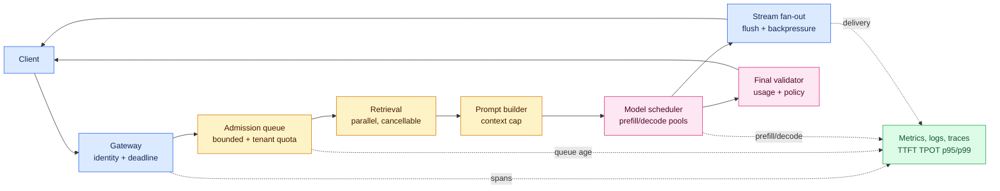
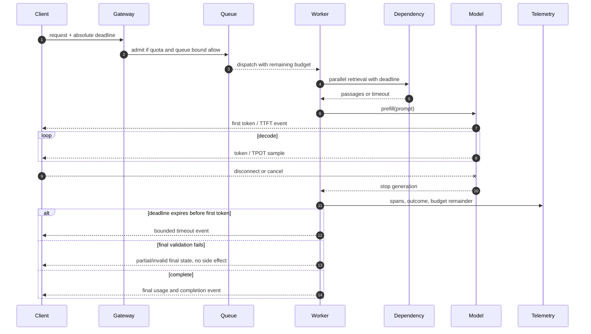

# Latency Budgets for Streaming AI Systems
Status: emerging
Sources: [Google Cloud Well-Architected Framework — Performance optimization pillar (last reviewed 2024-12-06)](https://cloud.google.com/architecture/framework/performance-optimization)

## In one sentence

A latency budget is a deadline-backed allocation of time across admission, queueing, prefill, decode, dependencies, and delivery, with separate user-facing SLOs for time-to-first-token (TTFT) and time-per-output-token (TPOT).

## Why this is a system-design problem

“The model is slow” is not an actionable diagnosis. A user-visible response travels through a client, DNS and network setup, an API gateway, authentication, rate limiting, a request queue, prompt construction, retrieval, model scheduling, GPU execution, token streaming, serialization, and the client renderer. Each stage can be fast in isolation and still miss the product deadline in combination. The latency budget gives every stage an explicit allowance and gives the owner a way to decide what happens when an allowance is spent.

This lesson applies the performance-optimization loop in the Google Cloud Well-Architected Framework to an interactive language-model route. The source recommends defining granular performance requirements before design, using elastic and scalable designs, promoting modularity, and continuously monitoring and improving with logs, traces, metrics, and alerts. Those are source facts. TTFT/TPOT definitions, the numerical example, and the architecture below are engineering interpretations for a streaming inference service, not guarantees made by Google Cloud.

The intended audience is a computer-science student or SDE2 who can read an HTTP handler and a queue worker but may not yet have operated a streaming model endpoint. The central habit is to make a latency claim falsifiable: name the route, traffic shape, percentile, model version, region, input and output limits, and whether the measurement ends at the server or at the user interface.

## Prerequisites: the small amount of theory that matters

You need five ideas.

1. A **monotonic clock** measures elapsed duration without jumping when wall-clock time is synchronized. In Python, `time.perf_counter()` is appropriate for a local duration.
2. A **percentile** is a rank statistic. p95 means 95% of observations are no slower than that value; the slowest 5% are slower. p99 exposes an even smaller but often operationally important tail. A percentile is not the same as an average.
3. A **deadline** is an absolute instant by which the request must finish or return a bounded degraded result. Passing “timeout 200 ms” independently to every downstream call allows the total request to run much longer than 200 ms; passing one deadline lets each stage calculate its remaining time.
4. A **stream** delivers incremental events before the final response. A client seeing a token has evidence of progress, not proof that the answer is complete, safe, or validated.
5. A **queue** absorbs short bursts by making work wait. Queueing can protect a worker, but it consumes the request’s latency budget and becomes dangerous when arrival rate approaches service capacity.

## Background: from one response-time number to two user contracts

Traditional request/response services commonly exposed one metric: elapsed time from request arrival to the complete HTTP body. That baseline is useful for a database lookup or a small JSON response, but it is a poor description of autoregressive generation. A model first processes the entire input context, then generates output one token at a time. A large prompt can make the first token late even if generation is fast; a long answer can make completion late even if the first token arrives quickly.

**Time to first token (TTFT)** is the elapsed time from the service’s chosen admission point until the first visible output token or stream event. State the admission point explicitly. “At gateway receipt” includes queueing; “at model dispatch” hides queueing and is useful only for a compute sub-span. Product TTFT should normally include the work a user waits through: gateway, policy checks, retrieval, model queue, prefill, and the network path to the first event.

**Time per output token (TPOT)** is the interval between successive generated tokens, generally measured after the first token. It is a decode-rate metric. Some teams report tokens per second instead (`1 / TPOT`), but TPOT is easier to budget in milliseconds. Report both the mean inter-token interval and a tail percentile because a stream that pauses for 900 ms every few tokens feels broken even if its average rate looks good.

**Completion latency** is the time until the final token and any final framing or validation. A useful approximation is:

```text
completion ≈ TTFT + (number_of_output_tokens - 1) × TPOT + finalization
```

The equation is an engineering model, not a promise. Batch scheduling, speculative decoding, network buffering, tool calls, and client backpressure can make intervals vary. Still, it explains why a chat product can meet a 700 ms TTFT target while missing a 4-second completion target for 500-token answers.

### Prefill and decode are different workloads

**Prefill** processes the input prompt (system instructions, conversation history, retrieved passages, and user message) and builds the internal state needed for generation. Its cost grows with input tokens and is often compute-heavy. It sits before TTFT.

**Decode** generates output autoregressively. Each new token depends on previous output, so the work is sequential for one request even when a GPU executes many requests together. Decode duration grows with output length and is reflected in TPOT and completion latency. A scheduler can batch requests to improve hardware utilization, but waiting to form a batch increases TTFT. A smaller output cap reduces completion time and cost but may harm answer quality.

Before streaming models became common, one could optimize only complete-response latency. Streaming makes the trade-off visible: optimize prefill and admission for TTFT, then optimize decode scheduling and token delivery for TPOT. These metrics should never be collapsed into one “latency” dashboard.

## What changed and why now

The relevant change is not a particular model release. It is an operational boundary: modern interactive AI makes partial output observable, so performance requirements must be granular. The Google Cloud source explicitly frames performance as an ongoing cycle: define requirements, design and deploy, monitor and analyze, then optimize and repeat. It also calls out the performance/cost trade-off and notes that autoscaling can protect predictable performance under load while removing unused capacity at low load.

For an AI service, that guidance means a requirement such as “p95 under two seconds” is incomplete. A useful requirement says: “For `chat-short` in Phoenix, with up to 2,000 input tokens and 128 output tokens, p95 TTFT ≤ 800 ms, p95 TPOT ≤ 80 ms, p95 completion ≤ 6 s, and stream-abort rate < 1% at 40 requests/s.” A separate batch route might have a 60-second completion SLO and prioritize throughput and cost. The route, shape, percentile, and load are part of the requirement.

## End-to-end budget: allocate time from the outside inward

Assume a chat route has a 2,500 ms p95 completion target. Start with the customer-visible contract and reserve explicit slices:

| Stage | p95 allowance | What the span must include |
|---|---:|---|
| Client-to-edge and gateway admission | 180 ms | network, TLS reuse/miss, auth, rate limit |
| Request queue | 220 ms | time waiting for a model worker, not compute |
| Retrieval and prompt assembly | 260 ms | vector/database calls, filtering, serialization |
| Model prefill to first token | 520 ms | scheduler wait after admission plus prefill |
| Decode for 24-token median answer | 1,000 ms | TPOT × output tokens |
| Final framing and delivery | 120 ms | final event, usage metadata, client flush |
| Safety margin | 200 ms | jitter, clocking error, rollout variance |
| **Total** | **2,500 ms** | **the route-level p95 target** |

This table does not claim these values are universal. It is a negotiation artifact. If retrieval regularly consumes 450 ms, the owner must shorten retrieval, reduce model time, raise the deadline, or change the product contract. Quietly borrowing from the decode slice makes the next regression hard to attribute.

Use one absolute deadline, such as `deadline_ns`, in the request context. Each stage records start and end times and checks the remainder before making a dependency call. A retry is legal only if the operation is idempotent, the remaining time exceeds a bounded retry allowance, and the retry will not amplify overload. A timeout that expires after a retry is not evidence that the original dependency was healthy; it may be evidence that the retry consumed the budget.

Budgeting at p95 does not imply every component can use its own p95 and be added exactly. Percentiles do not add linearly, and correlated tails can be worse than the sum of independent estimates. Start with stage histograms and a conservative reserve, then validate the whole route under representative concurrency. Track the same request ID across spans so a slow end-to-end sample can be attributed to its actual path.

## Architecture and data flow



The bounded queue is deliberately before expensive retrieval. If the model has no capacity, rejecting early preserves the latency contract and avoids doing retrieval work that cannot be delivered. A route may choose a small “fast lane” queue for short interactive requests and a separate batch queue, but fairness and tenant quotas must prevent a high-volume tenant from consuming all capacity.

Retrieval should run in parallel only when dependencies are independent and the combined deadline is understood. Parallel calls reduce the critical path but increase concurrent load and can make a tail event more likely. The prompt builder enforces a context cap; blindly adding documents can move cost from retrieval into prefill and TTFT.

The stream fan-out sends progress and token events, flushes deliberately, and propagates cancellation. Final validation owns the distinction between a partial stream and a completed answer. If an application can trigger an external action, it must not interpret the first token as authorization to act.

## Sequence and failure flow



The critical failure path is cancellation. A browser tab can disappear after receiving a useful first sentence. If the gateway notices the disconnect but the worker keeps decoding, the service spends GPU time on an answer nobody can consume. Cancellation should be best effort with a measured propagation time, and the dashboard should distinguish “client disconnected” from “server failed.” A stream that ends without a final event is partial, even if its text looks grammatical.

## Measuring the right things

At minimum, emit these timestamps using a monotonic source: gateway receipt, queue admission, worker dispatch, retrieval start/end, prefill start, first byte flushed, first token acknowledged if measurable, each token flush, final token, final validation, and connection close. “Acknowledged by the client” can be difficult across the public internet, so document whether TTFT ends at server flush, edge flush, or a browser measurement.

Use histograms rather than averages for TTFT, TPOT, queue wait, prefill duration, decode duration, completion, and cancellation propagation. Dimensions should include route, model revision, region, input-token bucket, output-token bucket, queue class, and tenant tier. Avoid unbounded labels such as raw prompt or request ID in a metrics backend; put correlation IDs in traces and sample payloads only under explicit privacy controls.

Percentiles answer different questions:

- p50 tells whether a typical warm request changed.
- p95 is a useful SLO boundary for a meaningful tail and often catches contention before an outage.
- p99 reveals rare queue spikes, cold starts, long contexts, noisy neighbors, and network outliers.

Do not compute a global p95 by averaging per-instance p95 values. Aggregate histogram buckets or raw observations over a clearly defined window. Also do not compare a p95 from 20 synthetic requests with a p95 from millions of production requests as if their confidence were equal.

An SLO needs an eligible population and a failure rule. Example: “99% of eligible `chat-short` requests in a 30-day window have TTFT ≤ 800 ms and completion ≤ 2,500 ms at the gateway boundary.” A request that is rejected for quota may be a capacity or admission metric, not an SLO success. Define this before an incident. Pair latency SLOs with quality and availability: a fast empty answer is not a successful response if retrieval was required.

## Trade-offs and overload controls

The Google Cloud source describes performance and cost as a trade-off and recommends elasticity. In this route, capacity is not free: warm model replicas, reserved accelerators, larger memory for long contexts, and redundant regions all cost money. Autoscaling down aggressively saves cost but causes cold-start TTFT; scaling up on CPU alone can miss GPU queue pressure. Scale on signals that map to the budget: queue age, queued tokens, active sequences, GPU utilization, and observed TTFT, with cooldowns to avoid oscillation.

Useful controls, ordered from least disruptive to most visible, include:

1. Flush a status event early while the model is preparing, if the client can represent it honestly.
2. Cap retrieved passages and output tokens for the interactive class.
3. Route short prompts to a smaller or already-warm model, with an explicit quality check.
4. Shed optional tools or rerankers when their remaining budget is too small.
5. Reject new work when bounded queues exceed the admission threshold, returning retry-after guidance.
6. Fall back to a cached, clearly labeled answer only when freshness and authorization permit it.

Each control changes capability or quality. A fast fallback should be measured as a separate outcome, not hidden inside “success.” A queue is not a substitute for capacity: Little’s Law (`in-flight work = arrival rate × average time in system`) makes the feedback visible. At 40 requests/s and 0.5 s average service time, approximately 20 requests are in flight; at 40 requests/s and 5 s under overload, approximately 200 are in flight, requiring memory and increasing queue delay further.

Batching has a similar trade-off. Dynamic batching increases accelerator utilization by combining compatible requests, reducing cost per token. It also adds a batch-formation wait and can let a long request delay short ones. Use a maximum batch wait tied to the TTFT slice, and separate latency-sensitive and throughput-sensitive queues. Measure batch wait as its own span rather than reporting it as “model time.”

## Load testing and autoscaling experiment

A credible test varies arrival rate, prompt-token distribution, output length, cache warmth, dependency latency, cancellations, and tenant mix. Start below saturation, step the rate upward, hold each step long enough for queues to reach steady state, then step down to observe recovery. Record p50/p95/p99 TTFT, TPOT, completion, queue age, rejection rate, GPU utilization, cost per completed request, and quality checks. Include a canary route and a control route so a model or scheduler change has a baseline.

Test three distinct overloads: retrieval slow but model healthy; model queue saturated but retrieval fast; and client disconnects during decode. If all three produce the same generic timeout, the operator cannot choose the right mitigation. Test a cold-start event and a scale-down event as well. Autoscaling is successful only if p95 returns inside the SLO without an unstable sawtooth of replica counts or a cost runaway.

For a local test, substitute a deterministic worker that sleeps for prefill and decode. This is not a model benchmark; it tests budget arithmetic, queue policy, cancellation, and percentile reporting. For a real endpoint, pin the model revision and tokenizer, record hardware and region, and do not use customer prompts. A load test that violates a provider’s terms or sends personal data is not an engineering success.

## Runnable low-cost example

Save as `latency_budget_probe.py` and run with Python 3.11 or newer. It uses only the standard library, simulates prefill/decode, carries one deadline through the stages, and reports p50/p95 without pretending that twenty samples establish a production SLO.

```python
from __future__ import annotations

import statistics
import time
from dataclasses import dataclass


@dataclass
class Result:
    ttft_ms: float | None
    completion_ms: float
    outcome: str


def percentile(values: list[float], p: float) -> float:
    ordered = sorted(values)
    if not ordered:
        return float("nan")
    rank = (len(ordered) - 1) * p
    low, high = int(rank), min(int(rank) + 1, len(ordered) - 1)
    return ordered[low] + (ordered[high] - ordered[low]) * (rank - low)


def run_once(retrieval_ms: int, prefill_ms: int = 35,
             decode_ms: int = 18, output_tokens: int = 8,
             budget_ms: int = 400) -> Result:
    started = time.perf_counter()
    deadline = started + budget_ms / 1000

    time.sleep(retrieval_ms / 1000)
    if time.perf_counter() >= deadline:
        return Result(None, (time.perf_counter() - started) * 1000,
                      "ttft_exceeded")
    time.sleep(prefill_ms / 1000)
    first_token_at = time.perf_counter()
    if first_token_at >= deadline:
        return Result(None, (first_token_at - started) * 1000, "ttft_exceeded")

    for _ in range(output_tokens - 1):
        if time.perf_counter() + decode_ms / 1000 >= deadline:
            return Result((first_token_at - started) * 1000,
                          (time.perf_counter() - started) * 1000,
                          "completion_exceeded")
        time.sleep(decode_ms / 1000)
    return Result((first_token_at - started) * 1000,
                  (time.perf_counter() - started) * 1000, "complete")


if __name__ == "__main__":
    results = [run_once(retrieval_ms=(i % 3) * 45) for i in range(30)]
    for name in ("ttft_ms", "completion_ms"):
        values = [getattr(r, name) for r in results if getattr(r, name) is not None]
        print(name, "p50=%.1f p95=%.1f mean=%.1f" % (
            percentile(values, .50), percentile(values, .95), statistics.mean(values)))
    print({outcome: sum(r.outcome == outcome for r in results)
           for outcome in sorted({r.outcome for r in results})})
```

The deliberate `retrieval_ms` pattern produces three workload classes. Change `budget_ms`, `output_tokens`, or `decode_ms` and observe which failure state appears. The code measures server-side simulated milestones; it does not measure network delivery, GPU scheduling, browser rendering, or model quality.

## Mini exercise (20–30 min)

1. Run the probe and record p50/p95 TTFT and completion for the 400 ms budget.
2. Change the retrieval pattern to 0, 100, and 250 ms. Explain why TTFT changes while TPOT does not.
3. Add a `queue_ms` argument before retrieval. At what queue delay does the p95 TTFT target fail even though prefill is unchanged?
4. Add a cancellation probability after the first token and return `client_cancelled`; verify that the simulated worker does not run the remaining decode sleeps.
5. Create two classes: `interactive` with a 400 ms budget and eight tokens, and `batch` with a 2,000 ms budget and 40 tokens. Compare completion p95, then write down the quality or throughput cost of each constraint.
6. Sketch an autoscaler rule using queue age and active sequences. State a scale-up threshold, cooldown, and a metric that prevents scaling on a single noisy sample.

## Build it locally: numbered implementation path

1. **Choose the contract.** Write route-specific limits for input tokens, output tokens, TTFT, TPOT, completion, and eligible traffic. Include the measurement boundary and percentile.
2. **Create the request context.** Carry request ID, tenant, model revision, queue class, and one absolute deadline. Reject malformed or already-expired requests at admission.
3. **Instrument spans.** Record queue wait, retrieval, prompt assembly, prefill, first flush, each decode interval, finalization, and cancellation propagation. Use monotonic durations.
4. **Split queues.** Keep interactive and batch work separate, bound both, and enforce per-tenant quotas. Return an explicit overload result instead of allowing unbounded waiting.
5. **Implement streaming state.** Define `started`, `token`, `partial`, `complete`, `cancelled`, and `deadline_exceeded` events. Require a final event before a downstream side effect.
6. **Propagate cancellation.** When the client closes the stream, cancel retrieval and decode tasks, and measure how long workers take to stop.
7. **Build dashboards.** Add histograms and p50/p95/p99 views broken down by route, model, region, input/output bucket, and queue class. Keep high-cardinality IDs in traces.
8. **Run the load matrix.** Vary rate, context length, output length, dependency delay, cold starts, and disconnects. Capture rejection and quality outcomes alongside latency.
9. **Tune elasticity.** Scale from queue age, queued tokens, active sequences, GPU pressure, and TTFT trend; set stabilization windows and a maximum replica budget.
10. **Close the loop.** After a deployment, compare the canary against the baseline. If the p95 budget or quality guardrail regresses, roll back the model, scheduler, prompt limit, or autoscaling change that caused it.

## Limits and failure modes

The first token is not the final answer. A service can meet TTFT by emitting a generic acknowledgement and then stall, or by streaming unsafe text before a validator finishes. Label partial streams and keep action authorization behind final validation. Likewise, a low p50 can coexist with a disastrous p99 when long contexts share a queue with short chats.

Percentile budgets can hide a protected population. Segment by tenant tier, region, language, prompt size, and route. A global p95 can improve while a long-document route regresses. Small samples make tails unstable, and adding retries can make an availability chart look better while increasing latency and load. Count retries, queue rejections, cancellations, and degraded fallbacks as first-class outcomes.

Autoscaling has delay: metrics are sampled, a decision is made, a replica starts, and the scheduler warms weights. Scale on leading indicators such as queue age or queued tokens, but cap growth and test the cost impact. A larger pool may reduce queueing while increasing cross-zone network time or model memory pressure. A cache can lower TTFT but risks stale or cross-tenant data if its key omits authorization scope.

Finally, performance is not correctness. A deadline-exceeded response, a stale cache hit, a partial generation, and a policy denial must have different types even if all are delivered quickly. This separation is the practical safety boundary for an SDE2 designing a streaming route.

## Interview Q&A

**Q: Why are TTFT and TPOT separate SLOs?**
A: Prefill and queueing determine when progress starts; decode determines how smoothly and quickly output continues. A system can satisfy one and fail the other.

**Q: Why does an absolute deadline beat independent 200 ms timeouts?**
A: Independent timeouts can spend 200 ms in retrieval, another 200 ms in a retry, and another 200 ms in generation. An absolute deadline lets every stage see the same remaining budget.

**Q: Does p95 TTFT ≤ 800 ms mean every component gets an 800 ms timeout?**
A: No. It is a route-level percentile target. Components need smaller allocations plus reserve, and their percentiles cannot simply be added as if independent.

**Q: When does batching hurt?**
A: When batch-formation wait or head-of-line blocking consumes more TTFT than the utilization gain saves. Separate interactive and throughput queues and measure batch wait.

**Q: What should autoscaling watch for a GPU-backed endpoint?**
A: Queue age, queued tokens, active sequences, GPU pressure, and TTFT trend are usually more meaningful than CPU alone. Validate the signals against cost and recovery time.

**Q: Is a first streamed token a successful response?**
A: Only as a progress event. Completion requires the final event and any required validation. A client disconnect or deadline can leave a partial result.

**Q: How would you investigate a p99 regression with stable p50?**
A: Break down traces by queue class, prompt/output length, region, model revision, cold/warm state, and dependency timing. Look first for contention, long-context outliers, retries, and scaling lag.

## Glossary

- **Admission:** The gateway decision to accept, reject, or defer work after identity, quota, and deadline checks.
- **Decode:** Autoregressive generation of output tokens after prefill.
- **Deadline:** An absolute time by which work must stop or return a bounded result.
- **Latency budget:** The total allowed elapsed time and its allocation across stages.
- **p50/p95/p99:** Percentiles describing the median, high tail, and extreme tail of observations.
- **Prefill:** Processing the input context before the first generated token.
- **Queue wait:** Time spent waiting for a worker or batch slot, distinct from compute time.
- **SLO:** A service-level objective, a measurable reliability or performance target over a defined population and window.
- **Streaming:** Delivering incremental events before a final response.
- **TPOT:** Time per output token, usually the interval between generated tokens after the first.
- **TTFT:** Time to first token, from a documented admission boundary to the first visible token/event.

## References

- [Google Cloud Well-Architected Framework: Performance optimization pillar](https://cloud.google.com/architecture/framework/performance-optimization) — source for granular requirements, elasticity, modular design, monitoring, continuous optimization, and performance/cost trade-offs.
- [January 2026 lesson map](README.md)

## Claim ledger

## Impact on current processing

An end-to-end deadline must be propagated as an absolute deadline, not recreated as a fresh timeout at every hop. The gateway reserves time for admission, retrieval, model prefill, decode, validation, and serialization. Each dependency receives the remaining budget and returns a bounded result or an explicit timeout state. This prevents a slow retrieval call from consuming the entire window while the model and validator still appear healthy in isolation.

## Real-world applications

Voice assistants prioritize time to first audio, search assistants prioritize a useful partial answer, and batch document processing prioritizes throughput. A single budget cannot describe all three. Define route-specific objectives, protect high-value traffic from queue buildup, and decide whether partial output is safe for the application. Include retries, cold starts, streaming disconnects, and provider throttling in the budget rather than treating them as rare exceptions.

## Mental model

Treat latency as a relay race with one shared finish line. A runner that spends the baton’s time cannot hand the next stage an imaginary full allowance. Percentiles describe populations, so a p95 stage value is not a promise that every request or every stage will fit the route target. Trace the same request across the relay and reserve slack for variance.

## Engineering consequence

Store deadline, route, queue class, model revision, and stage timestamps in every trace. Reject work that cannot meet its deadline instead of accepting it into an unbounded queue. Tune batch wait and output limits against tail latency, then verify with representative long-context and dependency-failure cases. A budget is useful only when the system can enforce cancellation and report which stage consumed it.

| Claim | Source | Fact or inference |
|---|---|---|
| Performance optimization should define granular requirements before design, use elastic and scalable patterns, monitor with logs/traces/metrics/alerts, and continuously reassess. | [Google Cloud performance optimization pillar](https://cloud.google.com/architecture/framework/performance-optimization) | Fact, scoped to the source |
| Performance and cost can trade off; autoscaling can support predictable performance during load and remove unused resources during low load. | [Google Cloud performance optimization pillar](https://cloud.google.com/architecture/framework/performance-optimization) | Fact, scoped to the source |
| TTFT, TPOT, prefill, decode, and one deadline are the right decomposition for the streaming route described here. | [Google Cloud performance optimization pillar](https://cloud.google.com/architecture/framework/performance-optimization) | Engineering inference |
| Separate queues, cancellation propagation, percentile histograms, and model-aware autoscaling are appropriate controls. | [Google Cloud performance optimization pillar](https://cloud.google.com/architecture/framework/performance-optimization) | Engineering inference |
| The numerical budget table, Python simulator, and SLO examples establish a provider-independent production guarantee. | — | False; they are teaching fixtures and must be validated locally |
| A streamed first token is progress rather than proof of validated completion. | — | Engineering design rule |
