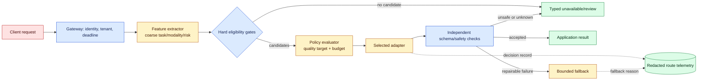
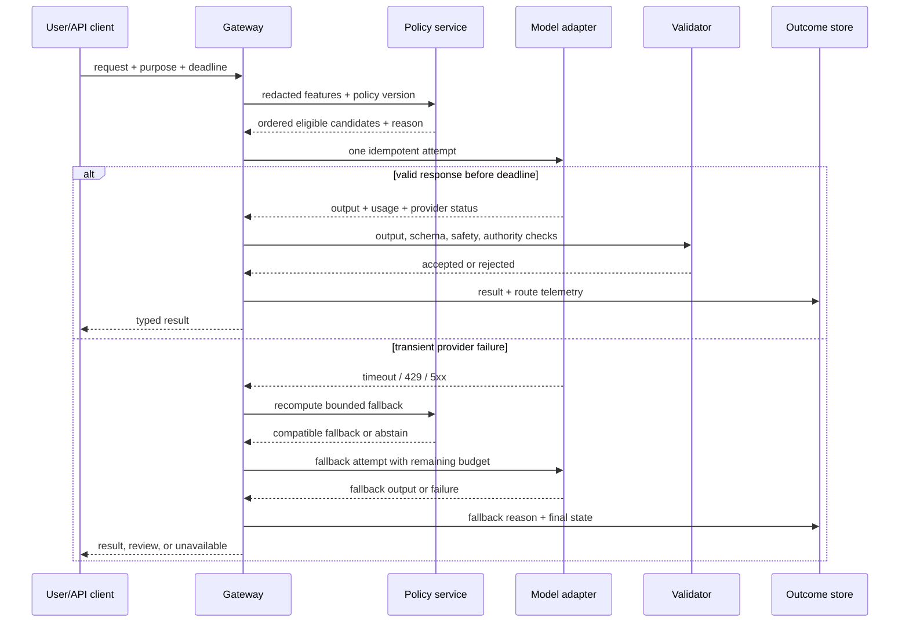

# Model routing: choose the smallest model that still earns trust
Status: durable
Sources: [OpenAI, “Model selection” — accessed 2026-08-29](https://developers.openai.com/api/docs/guides/model-selection)

## In one sentence

Model routing is a measured policy that admits a request, filters models by capability and risk, and selects the least expensive and fastest eligible path that still meets a task-specific quality target.

## Why this is a system-design problem

“Which model should I call?” sounds like a configuration question. In a production service it is a control-plane question. The answer changes with the task, input modality, language, user tier, data classification, deadline, provider health, and the consequence of an error. A router therefore sits between an application and model adapters. It is responsible for making a decision that is explainable, reproducible, observable, and safe to reverse.

The source for this lesson is OpenAI’s model-selection guide. Its central sequencing rule is unusually useful for design reviews: optimize accuracy until the use case reaches its target; only then optimize cost and latency while preserving that accuracy. The guide recommends a clear accuracy target, an evaluation dataset, starting with the most capable available model, logging responses, and then comparing a smaller model or distilling behavior into one. It also names retrieval-augmented generation (RAG), fine-tuning, fewer requests, fewer tokens, and shorter outputs as levers. The guide’s fake-news example illustrates the workflow with a zero-shot frontier model, a few-shot variant, and a fine-tuned smaller model.

That advice is a model-selection workflow, not a ready-made gateway. The gateway, eligibility gates, fallback contract, telemetry schema, tenant boundaries, and rollback policy below are engineering inferences that turn the workflow into an operable service. Keeping that distinction matters: a vendor guide can tell us how to compare candidates, but it cannot establish that a route is compliant for our data or safe for our business decision.

## Prerequisites: a short foundation

You should know what an API request and response are, how a p95 latency SLO differs from an average, and why a retry can increase load. A **model adapter** is a small interface that translates a common application contract into one model’s API and translates the result back. A **policy gate** is a deterministic check that can remove a candidate before any quality score is considered. An **evaluation set** is a fixed, labeled collection of representative inputs and expected outcomes. A **fallback** is a predeclared alternative path after a selected path fails; it is not permission to ignore the original constraints.

Two distinctions prevent common routing mistakes:

1. **Capability is not reliability.** A model may support vision, tool calls, a context length, or structured output and still time out or produce poor answers. Feature support is eligibility evidence, not a quality guarantee.
2. **A route is not authority.** The router can choose a model from an allowlist. It must not decide that a caller may see another tenant’s document, approve a payment, or bypass a review step.

## Background: the single-model baseline

Before routing, teams commonly put one model name in application code. This baseline has attractive properties: one prompt format, one set of token accounting rules, one dashboard, and predictable integration behavior. It is often the right first production step because the team can learn the task before it adds a control plane.

The baseline has three hidden costs. First, every easy request pays the frontier model’s price and capacity cost. Second, a model upgrade changes every workload simultaneously, making quality regressions hard to localize. Third, the application has no explicit representation of why a request required a particular capability. A customer-support classifier, a long-document synthesis task, and a tool-using account workflow may all share one endpoint despite having different error budgets.

Static “small for simple, large for complex” rules improve cost but can create a worse baseline if “complex” is defined by intuition. A long prompt is not necessarily hard; a short request about an irreversible action can be high risk. Routing starts with a workload contract and evidence, not with a ranking of model brand names.

## What changed in the source and why it matters

OpenAI’s guide makes model choice an optimization loop rather than a one-time benchmark. The prescribed order is:

1. Define what “good enough” means for this use case.
2. Build a dataset that records the input, model result, expected result, and correctness.
3. Start with the most capable model to establish the attainable quality target.
4. Log prompt/completion pairs so they can support evaluation, few-shot examples, or fine-tuning (“prompt baking” in the guide).
5. Compare a smaller model in zero- or few-shot form, or distill behavior into a smaller model.
6. Reduce requests and tokens only while the quality target remains true.

The guide also calls out a practical exception: if cost or latency is non-negotiable, set those thresholds before testing and eliminate candidates that exceed them. That exception changes the feasible set; it does not justify selecting a cheap model without measuring whether it meets the remaining quality requirement.

The historical example is instructive but release-specific. It reports 84.5% accuracy for a GPT-4o zero-shot classifier, 91.5% for GPT-4o with five examples, and 91.5% for a fine-tuned GPT-4o-mini model; the table reports $1.72, $11.92, and $0.21 per 1,000 records respectively, with sub-second average latency. Treat those numbers as facts about the guide’s experiment, not as a current price promise or a forecast for our workload. The durable lesson is the experimental shape: a prompt can buy quality by spending tokens, while a tuned smaller model can preserve quality at lower serving cost when the labeled data and task are suitable.

## A routing policy has ordered dimensions

A useful policy evaluates dimensions in an order that protects hard constraints. Let a request carry:

```text
task = classify | extract | answer | summarize | tool_plan
modality = text | image | audio | mixed
sensitivity = public | internal | confidential | regulated
deadline_ms = user-visible budget for this attempt
quality_target = minimum accepted score for this task
```

The router can enrich these fields with estimated input tokens, expected output size, language, tool requirements, and an ambiguity signal. Do not place raw confidential text in the decision record. Compute features in the request’s trust boundary and retain only coarse values or salted identifiers needed for operations.

### 1. Eligibility is a hard filter

Build a candidate registry with explicit facts: model identifier and pinned version, modalities, maximum context, structured-output support, tool protocol, approved regions, data-retention mode, tenant allowlist, and operational state. Filter by identity, purpose, residency, modality, context capacity, schema, and deadline. A model that cannot receive the image or cannot return the required JSON is not “lower quality”; it is ineligible.

Eligibility should be deterministic and independently testable. Keep it outside an uncertain classifier. If a request is classified as regulated, the classifier may suggest a high-risk route, but a policy gate still verifies the candidate’s region and provider status. This order prevents an apparently confident classifier from creating a data-boundary violation.

### 2. Capability is a contract, not a score

For each eligible candidate, compare task capability: can it follow the instruction, handle the language and modality, invoke the required tools, fit the context, and emit the schema? Adapters should advertise protocol differences. For example, a “JSON capable” flag is insufficient if one adapter names a tool-call field differently or silently truncates a long input. Contract tests should exercise the exact prompt envelope and validate the parsed response.

### 3. Quality comes from the evaluation set

Quality is task-specific. A classifier can use accuracy or macro-F1; extraction can use field-level exact match; answer generation may use rubric scoring plus citation checks; tool planning needs action-validity and no-unsafe-call rates. Include difficult, ambiguous, multilingual, and high-impact cases. Keep a protected slice whose labels and examples are not tuned against every week; otherwise the router can “improve” by overfitting the public set.

OpenAI’s guide says to start with the most capable model to optimize for the target. In routing terms, use that candidate to establish an upper-bound reference and collect useful examples. Then test whether a cheaper candidate holds the target on the same split. Never compare a small model on easy traffic with a large model on the full distribution and call the result a win.

### 4. Cost and latency are constrained utility

A route’s price is more than input and output token rates. Include router classification, retrieval, moderation, retries, failed tool calls, human review, and the cost of a wrong answer. If a small model is 30% cheaper but doubles correction work, the workflow may cost more. Similarly, average latency hides queueing and tail behavior; set a p95 or p99 deadline for interactive traffic and a separate throughput goal for batch traffic.

A simple selection objective is useful after hard gates:

```text
choose argmin(cost + λ_latency * p95_latency + λ_review * review_rate)
subject to quality >= target and risk_error <= budget
```

This equation is a design aid, not a claim that quality and risk can always be reduced to one scalar. For a high-impact action, risk is normally a gate or an explicit human-review branch. Weights and thresholds belong in a versioned policy, with an owner and an expiration date.

## Architecture: policy, adapters, and evidence



The gateway owns identity and deadline. The feature extractor sees only the minimum request representation and emits bounded categories. The eligibility gate is the last place where residency and permission constraints are checked before a model receives data. The policy evaluator uses an evaluation-backed route table; it does not infer authorization. An adapter isolates provider-specific request and response formats. Independent validation catches malformed structured output, forbidden action arguments, or missing citations before the application consumes the result.

The decision record is deliberately separate from the prompt and completion. It contains request ID, tenant pseudonym, policy version, candidate IDs, selected model version, feature categories, route reason, fallback reason, latency, token counts, estimated and billed cost, validation result, and outcome label when one arrives. A secure, short-lived link can connect the record to a restricted trace for debugging. Default telemetry should not become a second copy of customer secrets.

## Sequence and failure flow



A retry is not automatically a fallback. Retry the same request only when the error is plausibly transient, the operation is idempotent, and enough deadline remains. A switch to another model can change behavior, tool support, context limits, or data residency. Re-run eligibility and carry the remaining budget; do not blindly replay a prompt to every endpoint.

Fallback states should be typed: `retry_same`, `switch_compatible`, `queue_for_review`, and `unavailable`. The user-facing contract can remain stable while the internal state records what happened. For example, a support draft can fall back from a tuned small classifier to its reference model if the schema contract is preserved. A payment authorization planner should abstain if the alternate model cannot satisfy the tool and review contract. A provider outage must not silently turn a regulated request into an unapproved cross-region call.

## Multi-model data boundaries

Every extra model is an extra data processor and failure surface. Create a candidate registry that maps model version to provider, region, retention mode, encryption path, and allowed data classes. The route decision must happen after tenant and purpose checks and before prompt assembly for the selected provider. For a confidential request, do not construct a prompt containing secrets and then “decide” to send it to a disallowed model.

Use field-level minimization. A language classifier may need a short redacted prefix, while the answer model needs retrieved passages. A quality judge in a shadow experiment may need the output but not the original account number. Hash or bucket identifiers in metrics, and use separate access controls for raw traces, labels, and aggregate dashboards. Retention should be shorter for prompts and completions than for route counters. Deletion workflows must remove derived traces and evaluation artifacts that contain copied user text.

Shadow traffic needs special care. Sending production prompts to a candidate that cannot receive that tenant’s data is not made safe by hiding its output. Prefer sanitized fixtures or an approved shadow boundary. If a shadow model is eligible, record that it was non-serving and exclude its latency from the user’s SLO while including its provider cost. A canary changes the serving route for a sampled cohort and therefore needs a rollback switch, protected slices, and an owner.

## Evaluation and experiment design

Start with one task, one contract, and one baseline. Split the labeled set into development, holdout, and protected slices. Freeze policy and model versions in each run. Report quality, cost, p95 latency, fallback rate, refusal or safety-block rate, schema-valid rate, and human-correction rate. Report confidence intervals or sample counts when the set is small; a one-point improvement on 40 examples is not a routing breakthrough.

The source’s fake-news sequence suggests three useful experiments, adapted here without inheriting its release-specific numbers:

* **Reference run:** use the strongest eligible model and a clear prompt. This estimates attainable task quality and exposes ambiguous labels.
* **Prompt run:** test zero-shot and few-shot variants. Count prompt tokens; few-shot quality can be purchased with a large, recurring input cost.
* **Compression run:** test a smaller model, possibly fine-tuned on reviewed examples from the reference run. Check whether errors move to a harmful slice, not only whether aggregate accuracy stays constant.

For live routing, use shadow first, canary second, and full rollout last. Shadow computes disagreement and cost without changing responses. Canary changes a small, predeclared cohort; halt if quality drops below the floor, p95 exceeds its budget, unsafe tool calls rise, or fallback volume indicates provider pressure. Keep a fixed baseline cohort where feasible. A router itself can drift if traffic mix changes, so monitor route proportions and feature distributions. If the “easy” route grows because a classifier became overconfident, aggregate quality may look better while difficult cases are misassigned.

## Telemetry that can answer “why this model?”

Emit one route decision event and one outcome event rather than a giant log line with secrets. Useful fields include:

| Field | Why it exists |
| --- | --- |
| `request_id`, `tenant_bucket`, `task`, `policy_version` | Reproduce a decision without exposing identity |
| `candidate_set`, `selected_model`, `adapter_version` | Attribute behavior to the route and integration |
| `eligibility_rejections[]` | Detect missing capabilities, residency, or quota |
| `reason_code`, `fallback_code`, `attempt` | Explain cost and failure paths |
| `input_tokens`, `output_tokens`, `latency_ms`, `provider_status` | Measure operational economics |
| `quality_label`, `schema_valid`, `human_correction` | Connect serving to usefulness |

Dashboards should slice by task, language, tenant tier, model version, and sensitivity class. Alert on invariant violations: a regulated request routed outside its allowlist, a route without a policy version, a fallback that changed schema, or an output accepted without validation. Cost anomalies deserve a route-level view because a retry storm can hide behind a normal average cost per successful request.

## Runnable example: a deterministic, redacted router

This dependency-free Python program demonstrates ordered gates, a scored choice, and a typed fallback. It intentionally does not call a model or pretend to measure quality. Run it locally as a policy unit test and extend it with real evaluation results.

```python
from dataclasses import dataclass

@dataclass(frozen=True)
class Request:
    task: str
    modality: str
    sensitivity: str
    region: str
    deadline_ms: int
    quality_target: float

@dataclass(frozen=True)
class Model:
    name: str
    tasks: frozenset
    modalities: frozenset
    sensitivities: frozenset
    regions: frozenset
    max_quality: float
    p95_ms: int
    cost_micros: int

MODELS = (
    Model("small-classifier-v3", frozenset({"classify"}),
          frozenset({"text"}), frozenset({"public", "internal", "confidential"}),
          frozenset({"us", "eu"}), .90, 180, 12),
    Model("general-reference-v2", frozenset({"classify", "answer"}),
          frozenset({"text", "image"}),
          frozenset({"public", "internal", "confidential"}),
          frozenset({"us"}), .97, 850, 90),
)

def route(req: Request):
    # Hard gates happen before any cost/quality ranking.
    eligible = [m for m in MODELS
                if req.task in m.tasks
                and req.modality in m.modalities
                and req.sensitivity in m.sensitivities
                and req.region in m.regions
                and m.p95_ms <= req.deadline_ms
                and m.max_quality >= req.quality_target]
    if not eligible:
        return {"state": "unavailable", "reason": "no_eligible_model"}

    selected = min(eligible, key=lambda m: (m.cost_micros, m.p95_ms, m.name))
    return {"state": "selected", "model": selected.name,
            "policy_version": "routing-demo-1",
            "reason": "lowest_cost_after_quality_and_deadline_gates"}

def fallback(req: Request, failed_model: str):
    decision = route(req)
    if decision.get("model") == failed_model:
        # In production, remove the failed candidate and re-run the gates.
        safer = [m for m in MODELS if m.name != failed_model]
        for m in sorted(safer, key=lambda x: (x.cost_micros, x.p95_ms, x.name)):
            if (req.task in m.tasks and req.modality in m.modalities
                    and req.sensitivity in m.sensitivities
                    and req.region in m.regions
                    and m.p95_ms <= req.deadline_ms
                    and m.max_quality >= req.quality_target):
                return {"state": "fallback", "model": m.name,
                        "reason": "selected_model_unavailable"}
        return {"state": "unavailable", "reason": "no_compatible_fallback"}
    return decision

if __name__ == "__main__":
    request = Request("classify", "text", "confidential", "eu", 500, .88)
    first = route(request)
    print(first)
    print(fallback(request, first.get("model", "")))
```

Expected behavior is selection of the small EU-compatible classifier, followed by an unavailable result when that same candidate is declared failed: the reference model is US-only and cannot receive the request. Change `region` to `us` and `quality_target` to `.95` to see the reference model become eligible. Those outcomes test policy logic, not provider quality or compliance.

## Numbered local implementation steps

1. Choose one task and write its output schema, consequence of error, target quality statistic, p95 deadline, and per-request budget.
2. Assemble at least 100 labeled examples, including ambiguous and high-impact cases; keep a holdout and protected slice.
3. Create a registry for each candidate’s capabilities, context limit, regions, tool/schema contract, price card, and operational owner.
4. Implement deterministic eligibility gates and unit-test every rejection reason, including tenant and region mismatches.
5. Run the strongest eligible model as a reference; save redacted prompt/completion pairs under the evaluation data policy.
6. Compare zero-shot, few-shot, smaller, and—when data and task fit—fine-tuned variants on the same splits.
7. Add adapters and independent output validation. Reject malformed or unauthorized outputs before application side effects.
8. Emit route and outcome events, then build dashboards for quality, p95, cost, fallback, correction, and protected-slice performance.
9. Shadow a candidate with sanitized or approved data. Canary only after disagreement, cost, and safety thresholds are explicit.
10. Document rollback: policy version to restore, route to disable, owner to page, and behavior when no candidate is eligible.

## Real-world applications and constraints

For an internal help desk, a small model can classify routine requests, while a larger model handles ambiguous troubleshooting with retrieved runbooks. The hard constraint is that retrieval results carry the employee’s authorization; a model route must not broaden document access. Measure first-contact resolution, correction, escalation, latency, and cost by category.

For invoice extraction, modality and schema capability are eligibility gates. A cheap text model cannot process a scanned image without OCR, and OCR introduces another error surface and cost. A high-value invoice may require a second-pass validator or human review even when the extraction model is confident. Evaluate field-level correctness and financial impact, not only whole-document accuracy.

For a voice assistant, the deadline and modality dominate. A slower reasoning model may be excellent offline but fail an interactive turn budget. Route short acknowledgements to a low-latency path and queue non-urgent summaries, while preserving transcript retention and consent boundaries. Do not treat a streaming timeout as permission to send audio to a model that the user did not authorize.

For a coding assistant, capability includes repository context, tool calls, and patch schema. A smaller model may draft a harmless comment; a change that modifies deployment configuration should require stronger validation and possibly review. Track compile/test outcomes and rollback incidents, not just preference scores.

## Limits and failure modes

**Misclassification:** a learned difficulty classifier routes a subtle case to the cheap model. Use conservative thresholds, an uncertainty band, and a reference or review route for ambiguous cases. Re-label incidents into the protected set.

**Selection bias:** the expensive model receives hard traffic, so its observed accuracy looks worse or better for reasons unrelated to capability. Evaluate every candidate on the same frozen examples and report route mix.

**Cost illusion:** few-shot prompts, retries, retrieval, and human corrections erase token savings. Attribute all attempt costs to the original request and report cost per accepted outcome.

**Latency illusion:** a fast model behind a congested provider or queue misses the deadline. Track queue time, time to first token, completion time, and p95/p99 by route. Include router overhead.

**Schema drift:** an alternate model returns a superficially valid object with different semantics. Version schemas, run contract tests, and reject fields or enum values outside the contract.

**Fallback cascade:** repeated attempts amplify load and duplicate side effects. Cap attempts, preserve idempotency keys, and query external receipts before replaying a tool call.

**Data leakage:** shadow or fallback candidates have different residency or retention properties. Apply the same eligibility gates to every attempt and log policy violations as security incidents.

**Policy ossification:** a route table optimized for last quarter’s traffic becomes wrong after a product change. Expire thresholds, schedule reevaluation, and watch feature and label drift.

**False precision:** a scalar utility score hides a catastrophic tail. Keep hard risk gates and human review for consequential decisions; do not average away a protected-slice failure.

## Mini exercise (25–30 min)

Design a router for a multilingual benefits-help application. It supports text and image uploads, has US and EU tenants, a 700 ms p95 interactive budget, and two model candidates: a low-cost text classifier available in both regions with estimated quality .91 and p95 250 ms, and a multimodal answer model available only in the US with estimated quality .97 and p95 650 ms. The quality target is .90 for routine classification and .95 for an answer that could change a user’s benefit action.

1. Write the request features and the hard eligibility gates.
2. Draw the route matrix for four cases: EU text classification, EU image upload, US text answer, and US answer with a 500 ms deadline.
3. Choose route and fallback states; identify where the system must abstain.
4. Define six telemetry fields that exclude raw benefits details.
5. Propose a shadow experiment and two rollback thresholds.

The key insight is that “best model” has no global answer. An EU image request may have no eligible direct candidate and should use an approved OCR-plus-classifier pipeline or return review, not silently cross the region boundary. A US answer under 500 ms cannot use the multimodal candidate’s p95 budget even if its quality is higher; the product must change the deadline, change the workflow, or abstain.

## Interview Q&A

**Q: Why optimize accuracy before cost and latency?**
A: The source’s sequence protects the usefulness target: a cheaper answer that fails the task is not an optimization. The exception is a hard cost or latency ceiling, which should remove infeasible candidates before quality comparison.

**Q: What belongs in eligibility rather than a weighted score?**
A: Authorization, region, modality, context capacity, required tools/schema, and hard deadline. A candidate that violates one should not win because it is cheap or capable.

**Q: Why start with the most capable model?**
A: It provides a reference for attainable quality and produces examples that can inform evaluation, few-shot prompting, or distillation. It does not mean the frontier model should serve every request forever.

**Q: How can few-shot prompting increase total cost?**
A: The examples add input tokens to every request. Measure quality and full per-request cost; a fine-tuned smaller model may preserve behavior with a shorter prompt.

**Q: Is fallback just retrying with another model?**
A: No. A fallback must re-check compatibility, preserve the output and authority contract, respect remaining deadline and data boundaries, and record why it happened. Otherwise abstain.

**Q: What would you evaluate per route?**
A: Task quality, schema validity, safety or refusal outcomes, p95 latency, token and total cost, retry/fallback rate, human correction, and protected-slice performance. Aggregate quality alone hides route failure.

**Q: How do you shadow a model safely?**
A: Use sanitized fixtures or an explicitly approved candidate and tenant boundary. Shadow output must not trigger side effects; its cost is real, but its latency is not the serving SLO.

**Q: What makes a routing decision reproducible?**
A: Versioned feature extraction, candidate registry, policy, model and adapter IDs, deterministic tie-break rules, and a redacted decision record. Store enough information to explain the route without storing secrets by default.

## Glossary

* **Adapter:** Provider-specific client that implements a shared application contract.
* **Canary:** Small serving cohort used to test a changed route before broad rollout.
* **Distillation:** Training a smaller model to imitate useful behavior from a stronger reference model.
* **Eligibility:** Hard checks that determine whether a candidate may receive a request.
* **Few-shot:** Prompting with a small number of labeled examples.
* **Holdout:** Evaluation examples not used to tune prompts or model parameters.
* **Policy version:** Immutable identifier for the rules and thresholds that made a decision.
* **Protected slice:** High-impact or representative subset monitored separately from aggregate metrics.
* **Shadow:** Non-serving execution used to compare a candidate without changing the user result.
* **Utility:** A decision aid combining quality constraints with cost, latency, and review terms.

## Claim ledger

## Impact on current processing

Routing becomes a policy decision before inference. The router must normalize the request, classify data sensitivity and task type, filter ineligible candidates, and select a model whose adapter satisfies the output and latency contract. A fallback repeats those checks with the remaining deadline and authority; it is not a blind retry. Record model, adapter, policy, features, and reason codes so a route can be reproduced without storing sensitive payloads.

## Mental model

Think of routing as an air-traffic controller. A cheap model may handle a clear short flight, while a sensitive or uncertain flight needs a different runway, more inspection, or a safe refusal. The controller does not change the aircraft’s permissions because the pilot sounds confident. Eligibility is a hard gate; utility ranks only candidates that already meet safety and compatibility requirements.

## Engineering consequence

Maintain a candidate registry with capability, data-region, cost, latency, and deprecation metadata. Evaluate routes on protected slices, structured validity, correction rate, and total cost per accepted outcome. Shadow candidates without allowing side effects, then canary with rollback thresholds. Keep an explicit abstain route when no candidate satisfies the contract.

## Build it locally

```python
def choose(request, candidates):
    eligible = [c for c in candidates if c['region'] == request['region'] and c['max_tokens'] >= request['tokens']]
    return min(eligible, key=lambda c: (c['cost'], c['latency'])) if eligible else {'state': 'unavailable'}

print(choose({'region': 'eu', 'tokens': 100}, [
    {'name': 'small', 'region': 'eu', 'max_tokens': 200, 'cost': 1, 'latency': 2},
    {'name': 'other-region', 'region': 'us', 'max_tokens': 500, 'cost': 0, 'latency': 1},
]))
```

1. Save the snippet as `route.py` and run `python3 route.py`.
2. Add a sensitivity field and exclude candidates without the required boundary.
3. Add a remaining-deadline check and an explicit abstention result.
4. Log a redacted decision record and test a fallback after a simulated timeout.

| Claim | Source | Fact or inference |
| --- | --- | --- |
| The model-selection guide recommends optimizing accuracy first, then cost and latency. | [OpenAI model selection](https://developers.openai.com/api/docs/guides/model-selection) | Fact, source guidance |
| The guide recommends a clear accuracy target and an evaluation dataset containing inputs, expected outcomes, model results, and correctness. | [OpenAI model selection](https://developers.openai.com/api/docs/guides/model-selection) | Fact, source guidance |
| The guide recommends beginning with the most capable model and logging responses for distillation or future examples. | [OpenAI model selection](https://developers.openai.com/api/docs/guides/model-selection) | Fact, source guidance |
| RAG and fine-tuning are named as ways to improve accuracy, consistency, or behavior. | [OpenAI model selection](https://developers.openai.com/api/docs/guides/model-selection) | Fact, scoped to source |
| Fewer requests, fewer tokens, shorter outputs, and smaller models are cost/latency levers. | [OpenAI model selection](https://developers.openai.com/api/docs/guides/model-selection) | Fact, source guidance |
| The guide’s historical example reports 84.5%, 91.5%, and 91.5% accuracy and $1.72, $11.92, and $0.21 per 1,000 records for its three experiments. | [OpenAI model selection](https://developers.openai.com/api/docs/guides/model-selection) | Fact, release/example-specific; not a current price claim |
| Hard eligibility gates, adapters, typed fallbacks, redacted route telemetry, and multi-model data-boundary controls are required production design elements. | OpenAI guide plus system-design reasoning | Inference; validate for the deployment |
| A cheap model can cost more per accepted outcome when retries, review, or corrections increase. | OpenAI guide’s cost/quality framing plus workflow reasoning | Inference |
| Shadow-before-canary and protected-slice rollback thresholds reduce routing rollout risk. | OpenAI guide plus experiment-design reasoning | Inference; not a vendor guarantee |

## References

1. [OpenAI — Model selection](https://developers.openai.com/api/docs/guides/model-selection), primary source for the accuracy-first, then cost/latency workflow and historical classifier example.
2. [OpenAI — Accuracy optimization](https://developers.openai.com/api/docs/guides/accuracy-optimization), related primary guidance for evaluation and quality improvement.
3. [OpenAI — Latency optimization](https://developers.openai.com/api/docs/guides/latency-optimization), related primary guidance for reducing request and token latency.
