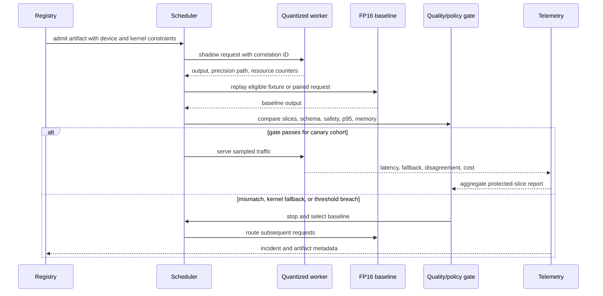

# Quantization
Status: durable
Sources: [Dettmers et al., “LLM.int8(): 8-bit Matrix Multiplication for Transformers at Scale” — 2022-08-15](https://arxiv.org/abs/2208.07339); [Xiao et al., “SmoothQuant” — 2022-11-18](https://arxiv.org/abs/2211.10438); [Frantar et al., “GPTQ” — 2022-10-31](https://arxiv.org/abs/2210.17323); [Lin et al., “AWQ” — 2023-06-01](https://arxiv.org/abs/2306.00978); [Jacob et al., “Quantization and Training of Neural Networks for Efficient Integer-Arithmetic-Only Inference” — 2018](https://arxiv.org/abs/1712.05877)

## In one sentence

Quantization replaces floating-point weights, activations, or caches with a smaller numeric representation, and the engineering problem is to choose where approximation is acceptable while ensuring the target kernels actually make the service cheaper and faster.

## Background: what existed before

The normal deployment path for a transformer was a full-precision checkpoint, commonly FP32 during training and FP16 or BF16 during inference. A parameter stored in FP16 consumes two bytes. A 70-billion-parameter model therefore needs roughly 140 GB just for weights, before temporary activations, allocator fragmentation, runtime metadata, and the key/value (KV) cache for active sequences. Sharding such a model across several accelerators adds communication and scheduling complexity. Even when arithmetic units can multiply quickly, reading weights from memory can dominate a decode step: every generated token repeatedly streams large matrices through the memory hierarchy.

Quantization is not ordinary file compression. A compressed archive reconstructs the original bytes; a quantized tensor reconstructs an approximation. The representation usually stores an integer `q`, a scale `s`, and sometimes a zero-point `z`. An affine example is `x ≈ s * (q - z)`, while symmetric quantization uses `x ≈ s * q`. With `b` bits, the integer has at most `2^b` levels (fewer after reserving a sign or zero). A scale estimated from a range maps those levels back to real values. Rounding introduces error, clipping loses values outside the selected range, and the error propagates through later layers.

Three facts make a model different from a spreadsheet. First, weight distributions vary by layer and channel. Second, activations depend on the prompt, sequence position, language, and decoding path; a calibration set is therefore a measurement instrument, not a fixed property of the checkpoint. Third, a quantized matrix is useful only when the serving stack has a kernel for its layout, bit width, batch shape, and accumulation type. A nominal “4-bit model” can still perform much of its work in FP16 and can be slower than an 8-bit model if it must unpack values on every call.

## Prerequisites: a foundational primer

You need basic linear algebra (a matrix multiply produces a weighted sum), floating-point versus integer ranges, and the idea of a tensor axis. You should know that transformer linear layers repeatedly compute `Y = XW`, that activations are intermediate values produced for a particular input, and that weights are learned parameters reused across requests. For operations, know p50/p95 latency, throughput, peak device memory, batching, and a model registry. No CUDA experience is required for the runnable example, but production work requires checking the exact accelerator, driver, runtime, and kernel implementation.

## What changed and why now: from “smaller numbers” to a family of methods

Earlier neural-network quantization focused on convolutional models with relatively predictable activation ranges. The LLM.int8() paper made a source-specific observation about large transformers: a small number of hidden dimensions can contain systematic outlier values, and treating every product identically in INT8 can damage quality. Its procedure performs vector-wise quantization for the bulk of the matrix multiplication while splitting outlier feature dimensions into a higher-precision path. The paper reports that this made inference of models up to 175B parameters possible with approximately half the weight memory while preserving the evaluated performance. The important idea is not “INT8 is lossless”; it is that a mixed path can protect exceptional dimensions without paying FP16 cost for every value.

Subsequent primary sources explore different points on the quality–hardware frontier. SmoothQuant moves quantization difficulty from activations to weights using an equivalent per-channel transformation, enabling W8A8 (8-bit weights and 8-bit activations) in its evaluated models. GPTQ uses approximate second-order information to perform one-shot, weight-only post-training quantization (PTQ) down to 3–4 bits. AWQ uses activation statistics to identify salient channels and applies a mathematically equivalent scaling transformation before hardware-friendly low-bit weight quantization. These are not interchangeable product claims: each source has a method, model set, kernel path, and benchmark protocol that must be reproduced before generalizing.

The practical shift is from asking “what bit width should we use?” to designing a precision policy. A policy states which tensors use which format, how scales are stored, which kernels are allowed, which quality slices are protected, and what happens when hardware support is absent. Quantization becomes a model artifact plus a release contract, not a flag hidden in a serving command.

## What changed this month

January’s learning map treats quantization as a deployment boundary rather than a standalone compression trick. The source anchor is LLM.int8(), whose outlier-aware path explains why a uniform INT8 operation can be the wrong system design for a large transformer. SmoothQuant, GPTQ, and AWQ are included as adjacent primary sources so a learner can compare activation-aware, second-order-informed, and hardware-oriented PTQ choices. These papers predate this issue; “this month” describes the lesson’s focus and does not imply that one of them was released in January 2026.

## Mental model: a budgeted approximation

Think of each tensor as having a limited error budget. If the tensor contains a narrow, common distribution, a shared scale wastes few levels and low precision may be fine. If one outlier sets the range for thousands of small values, a single scale makes those small values collapse toward zero. Granularity is the lever:

* **Per-tensor:** one scale for the entire tensor. Metadata is minimal, but unrelated channels share one range.
* **Per-channel:** one scale for each output or input channel, depending on the kernel’s convention. More metadata and better local range fitting.
* **Group-wise:** one scale for a fixed group of weights, such as 32, 64, or 128 contiguous values. It trades accuracy for fewer scales and more regular packing than per-weight scales.
* **Per-token or per-row activation:** scales are estimated for each runtime row or token. This follows changing inputs but adds reductions and synchronization to the critical path.

Precision also has a placement dimension. W4A16 means 4-bit weights and 16-bit activations; it primarily saves weight storage and bandwidth. W8A8 quantizes both operands and can use integer matrix-multiply hardware, but activation outliers and runtime scale handling are harder. A quantized KV cache can reduce long-context memory pressure, yet cache error compounds over many attention steps and must be evaluated separately. Accumulators are often wider than operands: an INT8 product may accumulate into INT32 before conversion. The accumulator type is part of correctness, not an implementation footnote.

The rough weight-memory estimate is:

`bytes ≈ parameters × bits / 8 + scale_metadata + packing_overhead`.

For 70B weights, FP16 is about 140 GB, INT8 about 70 GB, and INT4 about 35 GB before metadata. This estimate says nothing about KV cache, activations, replicated shards, or whether the accelerator can execute the packed format. It is a capacity estimate, not a latency promise.

## Engineering consequence

Treat precision as part of the model’s API and supply-chain identity. A serving request should resolve to a complete artifact manifest, and an inference response should make the selected precision path, kernel, model version, and fallback status observable. The release gate belongs outside the quantizer: validators compare candidate and baseline behavior, an owner approves the protected slices, and a scheduler can return to the known-good artifact. This is an engineering inference from the hardware- and workload-dependent source results, not a guarantee provided by any cited paper.

## Topic-specific design notes

Do sensitivity analysis before choosing a uniform format. Quantize one layer or tensor family at a time, measure the change in logits and task behavior, and rank the layers that consume the error budget fastest. Embeddings, normalization-adjacent projections, and output heads may deserve a different format from large feed-forward matrices; that choice should be measured, recorded, and reflected in the memory estimate. A mixed-precision artifact is not a failure to standardize when it is the smallest policy that meets quality and kernel constraints.

Keep the numeric contract visible across boundaries. A tokenizer change can alter activation ranges; a kernel update can change rounding; a scheduler change can alter batch size and therefore the memory path. Put these dependencies in the evaluation record and compare them together. Quantization is a system property of checkpoint, calibration, runtime, device, and traffic shape—not a property of a `.safetensors` file alone.

## PTQ and QAT: choosing when the model learns about the approximation

**Post-training quantization (PTQ)** starts with an existing checkpoint. A calibration pass observes representative activations, chooses ranges or channel scales, and writes a quantized artifact. Simple PTQ can be completed without backpropagation. GPTQ-style methods use a small calibration corpus and a layer-wise error objective; AWQ uses activation-informed scaling; SmoothQuant transforms the model before W8A8 quantization. PTQ is attractive when the original training run is unavailable, the model must be released quickly, or the target is many downstream checkpoints. Its risk is that the calibration data and objective may not expose the behaviors that matter to your application.

**Quantization-aware training (QAT)** inserts fake-quantization operations during training or fine-tuning. Forward passes round values as if they were quantized, while gradients use a straight-through approximation because rounding is not differentiable. The optimizer can move weights away from fragile decision boundaries and learn ranges that tolerate the target format. QAT can recover quality at aggressive precision, but it costs training compute, requires a representative training or fine-tuning set, and can make the resulting checkpoint specific to the chosen bit width, granularity, and backend. The Jacob et al. integer-arithmetic work is an early primary reference for training with quantized behavior in the loop.

Choose PTQ first when a read-only or draft task has a strong FP16 baseline and a few thousand representative examples can be labeled or replayed. Consider QAT when PTQ fails on a high-value slice, the model is still being fine-tuned, or the business can pay for a controlled training run. Do not call a QAT checkpoint “the same model” as its baseline without recording the fine-tuning data and objective. For either path, retain the original checkpoint and a machine-readable manifest.

## Calibration is a data contract

Calibration estimates the scales, clipping thresholds, salient channels, or reconstruction statistics used by a quantizer. It must represent the input distribution that drives the production tensor ranges, not merely be large. Include prompt templates, system messages, languages, typical and maximum context lengths, code or numeric content, tool-call schemas, and refusals if those are part of the product. Keep a held-out evaluation set separate: using the same examples to choose scales and declare success gives an optimistic result.

Track calibration data by immutable identifier, version, owner, retention class, and permitted purpose. Store summary statistics where possible rather than raw customer text. A calibration run should emit the model hash, quantizer version, bit width, axis convention, group size, clipping rule, random seed, framework, device, and software versions. If a new language or prompt template changes activation ranges, that is a reason to recalibrate and re-evaluate—not a reason to silently overwrite the previous artifact.

Outliers require an explicit decision. Clipping an extreme activation can improve resolution for ordinary values but may erase a rare feature. LLM.int8() protects exceptional feature dimensions with a higher-precision matrix multiplication. SmoothQuant instead migrates range difficulty to weights before quantization. Per-channel scales can isolate variation, while group-wise scales make the packed kernel simpler. Every option changes memory, metadata, and kernel behavior. Calibration should compare them on the same held-out examples and record the choice.

## Architecture and data flow: from checkpoint to serving kernel

```mermaid
flowchart LR
  A[FP16/BF16 checkpoint] --> B[Calibration corpus]
  B --> C[Range and salience statistics]
  A --> D[PTQ or QAT transform]
  C --> D
  D --> E[Quantized artifact + scales]
  E --> F[Kernel compatibility test]
  F --> G[Offline quality and resource gate]
  G --> H[Registry: immutable version]
  H --> I[Canary scheduler]
  I --> J[Serving adapter]
  J --> K[Validator, telemetry, rollback]
  classDef source fill:#fee2e2,stroke:#dc2626,color:#450a0a
  classDef measure fill:#e0e7ff,stroke:#4f46e5,color:#1e1b4b
  classDef transform fill:#fef3c7,stroke:#d97706,color:#451a03
  classDef gate fill:#dbeafe,stroke:#2563eb,color:#172554
  classDef serve fill:#dcfce7,stroke:#16a34a,color:#14532d
  class A,B source
  class C measure
  class D,E transform
  class F,G,H gate
  class I,J,K serve
```



The registry entry must identify more than `model_name` and `bits`. Include base checkpoint digest, quantization method, QAT/PTQ mode, weight and activation formats, granularity and group size, scale dtype, accumulation dtype, packed layout, kernel library and version, supported devices, calibration ID, evaluation report, and rollback artifact. The scheduler uses the artifact’s measured peak memory and concurrency envelope rather than multiplying parameter count by a hopeful number. The adapter exposes a typed status for kernel-not-found, out-of-memory, timeout, and quality-gate failure; it must not silently fall back to a slow implementation while claiming the same SLO.

## Sequence and failure flow: a safe rollout



Shadowing is not automatically safe: it still processes data, so use approved tenant boundaries or sanitized fixtures. Paired evaluation is strongest when the baseline and candidate receive the same tokenized input and decoding settings. For generative output, exact string equality is too strict; compare token-level logit divergence where available, task labels, structured validity, protected entities, tool-call decisions, and human correction. Keep a fixed baseline cohort during canary so traffic drift does not masquerade as an improvement.

## Kernel economics: when arithmetic is not the bottleneck

A low-bit artifact has to cross several implementation boundaries. Weights may be packed two INT4 values per byte, with group scales stored in FP16. At runtime, a fused kernel loads packed weights, unpacks or uses bit-aware instructions, applies scales, multiplies against FP16 or INT8 activations, and accumulates into a wider type. If the kernel is fused and aligned with the device’s tensor cores, lower memory traffic can improve throughput. If not, a graph compiler may insert dequantize, cast, transpose, and repack operators. The model then pays extra memory traffic and launch overhead.

Benchmark prefill and decode separately. Prefill has large matrix multiplications and benefits from batching; decode repeatedly processes a small number of new tokens and may be memory-bound. Measure cold start, warm steady state, batch sizes, sequence lengths, concurrency, and KV-cache growth. Report time to first token, inter-token latency, tokens per second, peak memory, host-to-device traffic, and accelerator utilization. A quantizer that reduces model memory but increases per-token latency can still be useful for an offline batch job, but not for an interactive voice assistant.

Check layout assumptions explicitly. Per-channel scale axes differ between frameworks, and a transpose can turn a correct scale into a wrong model. Group size must match the kernel; a 64-value group packed for a 128-value kernel may force conversion or fail at load time. Test numerical parity for a single linear layer before testing an entire model. Also test serialization and reload: a process that works only while an in-memory FP16 tensor remains resident has not delivered the intended memory reduction.

## Accuracy evaluation: protect behavior, not just perplexity

Start with a full-precision or BF16 reference whose software stack is pinned. Evaluate the same tokenizer, prompt formatting, decoding parameters, stop conditions, and maximum context. Use at least four views:

1. **Numerical:** layer output mean absolute error, cosine similarity, logit difference, and perplexity on a held-out corpus. These diagnose where error enters but are not product quality.
2. **Task:** exact match or calibrated accuracy for classification, pass rate for code tests, retrieval answer correctness, and structured-field validity for extraction.
3. **Behavioral:** refusal and policy fixtures, tool-call arguments, citation or evidence requirements, multilingual cases, long-context retrieval, and adversarial inputs.
4. **Operational:** p50/p95/p99 latency, throughput, peak memory, startup time, error rate, fallback rate, energy or cost per accepted result, and reviewer correction rate.

Slice every metric by language, input length, domain, customer tier, model route, and risk level. Quantization error can be concentrated in a small number of prompts even when average perplexity is unchanged. For generated text, use paired seeds and multiple samples where stochastic decoding is part of production. Report sample counts and confidence intervals; a one-point improvement on 40 examples is not evidence of a safe release. Set hard floors for high-impact slices and a budget for aggregate degradation. A model that is 20% cheaper but causes an extra manual review on every financial document may increase total cost.

## Real-world applications and constraints

For an on-device meeting-note assistant, W4A16 may fit a model in memory and avoid uploading audio. The protected set should include names, dates, numbers, action owners, and opt-out language. A small transcription difference may be tolerable, but an incorrect date sent to a calendar is not. Keep extraction read-only until fields pass deterministic checks and the user confirms consequential actions.

For a high-throughput document classifier, W8A8 can be attractive if the accelerator has an efficient INT8 GEMM and activation ranges are stable. Calibration should cover document templates and OCR noise. The system should route unknown templates to the FP16 baseline or review rather than clipping them into a confident class. For a 70B chat model, weight-only 4-bit quantization may make a single-device deployment possible, but KV-cache memory can still dominate long conversations. Quantizing weights does not solve every capacity problem.

For a safety or authorization model, optimize conservatively. If an INT8 score crosses a threshold differently from FP16, the effect may be a permit or denial, not a slightly different sentence. Keep the decision boundary in higher precision, use a two-model disagreement route, or require a review state. This is an engineering inference: the papers establish quantization techniques and measured results for their tasks, not the safety of an arbitrary policy classifier.

## Limits and failure modes

* **Calibration mismatch:** Production prompts have longer contexts, new languages, or different tool schemas. Symptoms include tail-quality regressions and changed refusal rates. Fix with representative and protected calibration/evaluation slices; do not merely increase the number of generic samples.
* **Outlier destruction:** One scale is dominated by rare values, collapsing ordinary values. Compare per-channel, group-wise, clipping, outlier splitting, SmoothQuant-style scaling, or selective higher precision.
* **Granularity/layout error:** A transposed per-channel axis or wrong group size produces plausible but incorrect outputs. Add layer-level golden vectors and verify scales after serialization.
* **Kernel fallback:** The loader accepts the artifact but inserts dequantization or runs on the CPU. Alert on the actual precision path, kernel name, device utilization, and host traffic.
* **Accumulator overflow or saturation:** Narrow accumulators and poorly chosen zero-points can corrupt large dot products. Inspect accumulator dtype, clipping counters, and extreme-input tests.
* **Quality cliff at a few layers:** Uniform 4-bit treatment can damage sensitive projections or embeddings. Use mixed precision and sensitivity sweeps; document exceptions because they affect memory estimates.
* **KV-cache drift:** Long generation compounds small errors. Evaluate context length and inter-token behavior, and keep cache precision independent in the manifest.
* **Artifact ambiguity:** A file named `model-int4.bin` hides method, group size, scales, and kernel assumptions. Reject registry entries without complete provenance.
* **Rollback failure:** The baseline may have been garbage-collected or require different tokenizer/configuration. Keep a tested, warmable baseline and exercise rollback during the canary.
* **False savings:** Lower storage does not lower total cost if repacking, extra replicas, reviewer corrections, or fallback traffic rises. Calculate cost per accepted outcome.

## Runnable low-cost example: compare tensor and group scales

Save the following as `quant_demo.py` and run it with Python 3. It uses only the standard library. The example is deliberately small: it demonstrates clipping, symmetric quantization, per-tensor versus group scales, and a held-out error report. It does not model a transformer, a real kernel, or task accuracy.

```python
from statistics import mean

def quantize(values, bits=4, group_size=None, clip=None):
    levels = (1 << (bits - 1)) - 1
    work = list(values)
    if clip is not None:
        work = [max(-clip, min(clip, x)) for x in work]
    groups = [work] if group_size is None else [
        work[i:i + group_size] for i in range(0, len(work), group_size)
    ]
    restored, scales = [], []
    for group in groups:
        scale = max(abs(x) for x in group) / levels or 1.0
        q = [max(-levels, min(levels, round(x / scale))) for x in group]
        restored.extend(scale * n for n in q)
        scales.append(scale)
    return restored, scales

def mae(actual, predicted):
    return mean(abs(a - b) for a, b in zip(actual, predicted))

def restore_with_scales(values, scales, bits=4, group_size=None):
    levels = (1 << (bits - 1)) - 1
    groups = [values] if group_size is None else [
        values[i:i + group_size] for i in range(0, len(values), group_size)
    ]
    restored = []
    for scale, group in zip(scales, groups):
        q = [max(-levels, min(levels, round(x / scale))) for x in group]
        restored.extend(scale * n for n in q)
    return restored

weights = [0.02, -0.04, 0.07, 0.11, -0.09, 0.13, 4.0, -0.12]
held_out = [0.03, -0.05, 0.08, 0.10, -0.10, 0.12, 3.5, -0.11]
for name, group, clip in [("tensor", None, None), ("groups", 4, None),
                          ("clipped-groups", 4, 1.0)]:
    restored, scales = quantize(weights, bits=4, group_size=group, clip=clip)
    held_restored = restore_with_scales(held_out, scales, bits=4,
                                        group_size=group)
    print(name, "scales=", [round(s, 3) for s in scales],
          "weight_mae=", round(mae(weights, restored), 4),
          "held_out_mae=", round(mae(held_out, held_restored), 4))
```

Extend it by quantizing the held-out vector with scales learned from `weights`, then print errors for the small values separately from the outlier. That distinction mirrors production evaluation: a low average error can conceal a catastrophic error on a rare, important feature. Try 8 bits, group sizes 2/4/8, and a clipping threshold chosen only from a calibration split. Explain why a threshold selected after looking at `held_out` would invalidate the comparison.

## Mini exercise (20–30 minutes)

Build a tiny linear classifier with fixed weights and two classes. Produce predictions with FP32 weights, then use the demo’s per-tensor, per-group, and clipped-group 4-bit weights. Create three slices: ordinary points, points near the decision boundary, and points containing an outlier feature. Report classification accuracy, maximum logit change, and mean absolute weight error for each slice. Add a fake QAT loop that updates weights with a straight-through rounded forward pass, and record whether it improves the boundary slice without harming the ordinary slice. Finally, write a release decision with explicit thresholds for quality, p95 latency (a measured placeholder is acceptable), and rollback. The goal is to connect a numeric approximation to a system gate, not to reproduce a research benchmark.

## Build it locally: numbered implementation path

1. Freeze a reference checkpoint, tokenizer, runtime, device type, and evaluation command. Compute a digest for every artifact.
2. Assemble a calibration corpus from approved, production-shaped examples. Keep a separate held-out set and protected high-risk fixtures.
3. Implement one baseline PTQ configuration: symmetric weight-only INT8 with documented axis and scale dtype. Verify a single-layer reconstruction before a full model.
4. Add per-channel and group-wise configurations. Compare scale count, serialized size, reconstruction error, and the model’s task slices.
5. Add an activation-aware option only if the runtime can execute it. Record W4A16, W8A8, or another exact operand/accumulator combination in the manifest.
6. Build or select the target kernel and test supported group sizes, batch shapes, context lengths, and serialization reload. Fail closed on fallback.
7. Benchmark prefill, decode, cold start, concurrency, peak memory, and KV-cache growth. Store raw measurements with device and software metadata.
8. Run paired baseline/candidate evaluation, including structured validity, refusals, tool calls, long context, multilingual prompts, and high-impact slices.
9. Register the candidate only if quality floors and resource budgets pass. Keep a warm, tested FP16/BF16 rollback artifact.
10. Shadow approved traffic, then canary a small cohort with route-level dashboards and an automatic stop switch. Roll back on a protected-slice breach, kernel fallback, error-rate increase, or cost regression.
11. After launch, sample corrections and incidents, add new failure cases to the held-out suite, and recalibrate only through a new immutable artifact.

## Interview Q&A

**Q: What is the difference between PTQ and QAT?** PTQ quantizes an already-trained checkpoint using calibration and perhaps reconstruction; QAT exposes the model to fake-quantized values during training or fine-tuning so it can adapt to the approximation.

**Q: Why does per-channel quantization usually help?** Channels often have different ranges. Separate scales prevent one large channel from consuming the representational range needed by smaller channels, at the cost of metadata and kernel complexity.

**Q: Why can W4A16 save memory but fail to speed up decoding?** It reduces weight storage, but the kernel may spend time unpacking and dequantizing weights, while decode is often memory-bound and batch sizes are small. Hardware and fusion determine speed.

**Q: Why are activation outliers difficult?** Activations vary with runtime inputs and can make a shared scale coarse for ordinary values. LLM.int8() isolates exceptional dimensions; SmoothQuant migrates some difficulty to weights. Neither is a universal guarantee.

**Q: What should calibration data contain?** The prompt shapes, languages, lengths, domains, tools, and rare high-impact cases that produce production-like ranges. Keep a separate held-out set for honest evaluation.

**Q: Is perplexity enough to approve a quantized model?** No. Add task accuracy, structured validity, refusal/tool behavior, protected slices, latency, memory, fallback rate, and correction cost. A small average loss change can hide a severe application regression.

**Q: Why retain an FP16/BF16 artifact?** A quantized failure may be rare, hardware-specific, or discovered after launch. A tested baseline provides a reversible route while the quantized artifact is investigated.

## Glossary

* **Activation:** An intermediate tensor produced while processing an input.
* **Accumulator:** The wider numeric type used to sum products from a matrix multiplication.
* **Calibration:** Measuring representative data to select ranges, scales, clipping, or salience.
* **Granularity:** The scope at which scales are shared: tensor, channel, token, or group.
* **Group-wise quantization:** One scale for a fixed contiguous group of weights.
* **Kernel:** Hardware-specific implementation of an operation such as quantized GEMM.
* **PTQ:** Post-training quantization of an existing checkpoint.
* **QAT:** Quantization-aware training with quantized behavior simulated during optimization.
* **Scale:** A factor mapping an integer level back to a real value.
* **W4A16/W8A8:** Shorthand for weight/activation bit widths.

## References

* [LLM.int8(): 8-bit Matrix Multiplication for Transformers at Scale](https://arxiv.org/abs/2208.07339) — outlier-aware mixed-precision INT8 matrix multiplication.
* [SmoothQuant: Accurate and Efficient Post-Training Quantization for Large Language Models](https://arxiv.org/abs/2211.10438) — activation smoothing and W8A8 PTQ.
* [GPTQ: Accurate Post-Training Quantization for Generative Pre-trained Transformers](https://arxiv.org/abs/2210.17323) — one-shot second-order-informed weight quantization.
* [AWQ: Activation-aware Weight Quantization for LLM Compression and Acceleration](https://arxiv.org/abs/2306.00978) — activation-informed, hardware-friendly low-bit weight quantization.
* [Quantization and Training of Neural Networks for Efficient Integer-Arithmetic-Only Inference](https://arxiv.org/abs/1712.05877) — foundational QAT and integer-inference treatment.
* [January 2026 lesson map](README.md)

## Claim ledger

## Impact on current processing

Quantization changes the artifact, runtime kernels, memory layout, calibration contract, and observability needed for inference. A lower-bit checkpoint may fit on a smaller accelerator, but the serving stack must load the intended scales, select compatible kernels, and preserve accumulator precision. Compare the same prompts and generation settings against a floating-point baseline, and inspect structured outputs and refusal behavior rather than relying on perplexity alone.

| Claim | Source | Fact or inference |
|---|---|---|
| LLM.int8() uses vector-wise quantization and a higher-precision path for outlier feature dimensions. | [LLM.int8()](https://arxiv.org/abs/2208.07339) | Fact, scoped to the paper’s method |
| The LLM.int8() paper reports inference at up to 175B parameters with reduced memory and no performance degradation on its evaluated setup. | [LLM.int8()](https://arxiv.org/abs/2208.07339) | Fact, scoped to reported experiments; not a universal guarantee |
| SmoothQuant migrates quantization difficulty from activations to weights and evaluates W8A8 PTQ. | [SmoothQuant](https://arxiv.org/abs/2211.10438) | Fact, scoped to the paper |
| GPTQ and AWQ represent distinct calibration/reconstruction choices for low-bit weight-only PTQ. | [GPTQ](https://arxiv.org/abs/2210.17323), [AWQ](https://arxiv.org/abs/2306.00978) | Fact about the cited methods |
| PTQ should be preferred for a quick, reversible deployment experiment, while QAT is justified when PTQ misses protected slices. | [LLM.int8()](https://arxiv.org/abs/2208.07339), [QAT reference](https://arxiv.org/abs/1712.05877) | Engineering inference |
| Kernel support, batching, KV-cache growth, and dequantization can determine whether lower precision improves latency or cost. | [LLM.int8()](https://arxiv.org/abs/2208.07339), [SmoothQuant](https://arxiv.org/abs/2211.10438) | Engineering inference from the hardware-dependent methods and measurements |
| A quantized policy or tool decision needs independent validation and a rollback path. | Quantization methods above | Engineering inference; the cited papers do not establish application safety |
| The Python program demonstrates scale and granularity error but does not establish transformer accuracy or kernel performance. | This lesson’s code | Explicit limitation |
