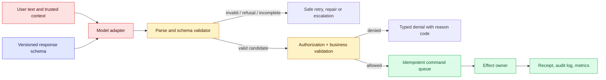
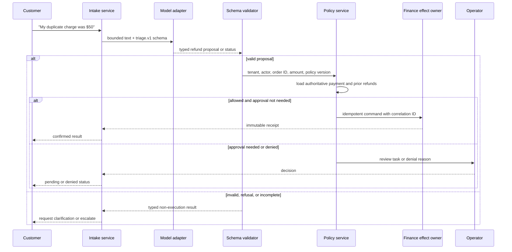

# Structured output

Status: durable
Sources: [JSON Schema — What is JSON Schema?](https://json-schema.org/overview/what-is-jsonschema); [OpenAI — Structured model outputs](https://developers.openai.com/api/docs/guides/structured-outputs); [Model Context Protocol — Tools specification](https://modelcontextprotocol.io/specification/2025-06-18/server/tools)

## In one sentence

Structured output turns a model response into data with an explicit shape, but a schema proves only that the data has that shape—not that its facts are true, its proposed action is authorized, or its source text is safe to execute.

## Background: what existed before

Early language-model integrations treated a completion as a paragraph. A person could notice that a support answer omitted an order number or used the wrong status, but an application needs a dependable boundary: an object with fields that downstream code can read. Teams initially used delimiter conventions—“return `name | priority | summary`”—and then regular expressions. Those conventions fail in ordinary ways: a user message contains the delimiter, the model changes a heading, a quote includes a newline, or an optional field appears in an unexpected place. The parser either rejects a useful answer or, worse, guesses and sends a wrong value to a database or UI.

JSON made the boundary less fragile because its object, array, string, number, Boolean, and `null` types have a standard syntax. But **valid JSON** is still a very weak contract. `{ "priority": "very urgent" }` parses successfully even if the application only understands `low`, `normal`, and `high`. `{ "email": "probably@example" }` is syntactically valid but may not be an acceptable address. An object may omit a required key, add a key that an old consumer ignores, or use an identifier belonging to another tenant. Parsing answers “can I read these bytes as JSON?” It does not answer “may this state transition occur?”

JSON Schema is a declarative language for describing a JSON instance’s structure and constraints. The JSON Schema project explains that a validator checks an instance against a schema; the schema is not itself the validator. This distinction is useful for systems design. The schema is a versioned contract, the validator is a component that enforces part of that contract, and the policy service remains a separate component that decides what is allowed. A model can help produce a candidate object; it must not become the authority that interprets its own candidate.

## Prerequisites: a foundational primer

You need to recognize a JSON object such as `{ "status": "draft" }`, an array such as `["a", "b"]`, and the difference between a type and a value. You should also know the basic client/server pattern: a browser sends a request, a service validates it, a database stores state, and another component may perform an external effect such as sending an email. For production work, add HTTP status codes, authentication, authorization, idempotency keys, logs, and tests to that mental model.

A **schema** is a contract for data shape. `type: "string"` says the value is a JSON string. `enum: ["low", "high"]` restricts it to a small vocabulary. `required` makes a key mandatory. `additionalProperties: false` rejects accidental keys in an object. These features reduce ambiguity at an interface. A **semantic rule** is different: “the requester owns this ticket,” “the refund is below the permitted amount,” and “the referenced policy is current” require live state or a business policy, not just a JSON shape.

## What changed and why now

The model interface has moved from “display this text” toward “produce a typed proposal for another program.” That shift matters because an output can now drive a UI, populate a record, select a workflow branch, or form arguments to a tool. The OpenAI Structured Outputs guide distinguishes a structured response for application output from function calling for connecting a model to tools and data. It further says that JSON mode can ensure valid JSON, whereas Structured Outputs provides schema adherence for its supported subset. Those are provider-specific feature statements, not a claim that a schema makes an application correct.

The interface ecosystem has converged on this idea. MCP tool definitions include a name, description, and `inputSchema`; an optional `outputSchema` can describe structured results. The MCP specification says tool annotations should be considered untrusted unless they come from trusted servers, and recommends a human ability to deny tool invocations. That is an important operational lesson: a well-formed `arguments` object is not a permission grant.

The engineering change is therefore not merely better parsing. A schema can be a shared language among prompt author, model adapter, UI, queue consumer, policy engine, and auditor. It enables generated client types, fixtures, contract tests, and clearer incident records. It also creates a sharper failure mode: when a typed object looks authoritative, a team may forget that every string in it was derived from untrusted input or probabilistic generation.

## What changed this month

January’s learning map places structured output before function calling because reliable data boundaries precede reliable actions. The direct sources are durable specifications and vendor documentation rather than a January-only release. This lesson does **not** claim that JSON Schema, MCP, or any provider feature was created in January 2026. The month supplies the curriculum sequence; the source facts are labeled in the claim ledger.

## Mental model: three gates, not one

Use three separate gates:

1. **Generation constraint:** ask the model for a named schema or typed response. This reduces format drift.
2. **Syntax and shape validation:** parse bytes and validate required fields, enums, ranges, and unknown keys.
3. **Semantic authorization and execution:** load authoritative state, check identity and policy, require approvals where needed, execute idempotently, and record an audit event.

Conflating these gates is a common design error. Suppose a model returns `{ "action": "issue_refund", "amount_cents": 5000 }`. A strict schema can ensure that `amount_cents` is an integer in a permitted numeric range. It cannot establish that an order exists, that it belongs to the caller, that a prior refund has not occurred, that the amount matches a payment, or that a manager approved an exception. Those questions require a capability, authenticated principal, current transaction state, and business rules.



The model adapter should report which model, prompt version, schema version, and generation status produced the candidate. The validator should return machine-readable failures such as `missing_required_field` or `invalid_enum`, without exposing sensitive prompt text to an end user. The authorizer should return a policy decision and a policy version. The effect owner, not the model process, owns the credential for a payment processor or production database.

## Impact on current processing and architecture

A typed boundary changes where work happens. Before structured output, every consumer tends to own a slightly different parser and recovery prompt. A UI strips headings, a queue worker looks for a magic word, and an analytics job guesses which sentence was a category. After the boundary is explicit, the model adapter owns conversion from generated tokens to a candidate object, while consumers receive a stable versioned event. This reduces duplicated parsing logic and makes failures measurable: `schema_invalid` is different from `policy_denied`, which is different from `effect_timeout`.

It also affects throughput and latency. A constrained output path may add setup cost or restrict the range of next tokens; a post-generation validator adds CPU work; an authorization lookup adds network latency. Those costs are usually worth modeling explicitly because they replace unbounded retries and expensive downstream repairs. Put a timeout and size budget around validation, cap nested object depth, and pass only the fields needed to each downstream component. In a streaming UI, do not render a proposal as committed state until it passes the application gate. Stream display text separately from an execution object when users need fast feedback.

The data model becomes part of deployment configuration. Store schema files beside code, give them owners, test them in continuous integration, and include their version or digest in traces. A request record should be sufficient to replay a failure using sanitized fixtures: input class, schema version, model and prompt revision, validator result, policy result, and downstream receipt. That replay record helps distinguish a regression in generation from a server that changed business policy.

## Engineering consequence

Treat the response schema as a production interface with an owner and a release process. Put its source file, examples, and compatibility fixtures in the same change set as the producer and consumer code. In continuous integration, run a valid fixture plus a fixture for each rejected case; in a staged rollout, deploy tolerant readers before writers that emit a new optional field. Alert on a sudden rise in `invalid_candidate`, `unknown_key`, or `policy_denied`, but keep those metrics separate: the first normally points to generation or contract drift, while the second may be expected protection working as designed.

For effects, make the validated object an input to a narrow command API rather than a generic instruction channel. The command handler should revalidate the object, bind it to the authenticated tenant and actor, and return a durable receipt keyed by the idempotency key. That arrangement means an adapter can be retried or replaced without granting it direct payment, deployment, or database credentials. It also makes incident response practical: a trace tells an engineer whether to fix the schema, prompt, validator, policy, or effect owner instead of blaming an opaque "AI failure."

## Real-world applications and constraints

Structured output is useful for extraction—turning an invoice into fields—because a reviewer or workflow can work with defined keys. It is useful for classification and routing because an enum maps directly to a queue. It is useful for UI composition because components can display a title, answer, citations, and an escalation state separately. It is useful for tool proposals because a tool’s arguments can be validated before the server acts. In each case, make the schema reflect a low-blast-radius proposal, not an open-ended command language.

Constraints differ by domain. A medical summary needs provenance, a clinician workflow, and regulatory review; a schema cannot establish medical correctness. A financial workflow needs current account state, limits, separation of duties, and reconciled receipts. A coding assistant may return a patch plan as structured data, but a sandbox, code review, tests, and protected-branch policy still control changes. A customer-support system needs tenant isolation and retention rules for raw prompts. The common pattern is a typed interface surrounded by domain-specific evidence and permissions.

## Designing a schema that survives change

Start with the smallest object that supports one consumer. A large “universal answer” schema often becomes a dumping ground with dozens of nullable fields. A support-triage UI might need only `category`, `urgency`, `summary`, and `needs_human_review`. It should not receive a speculative account identifier that it cannot safely use.

Make field names concrete. `refund_requested` is easier to interpret than `flag`. Use an enum when the consumer has a closed set of branches. Use strings for genuinely open-ended language. Bound values that control resource use: a free-form `summary` should have a practical maximum length; an array of citations should have a maximum item count. Require identifiers to follow an application-owned pattern, then resolve them against the database rather than trusting their spelling.

Prefer additive, backward-compatible changes. A consumer that reads schema `triage.v1` should not suddenly receive a required `confidence` field unless its version negotiation and rollout support it. Add an optional field, teach consumers to ignore or use it deliberately, collect telemetry, then make it required in `v2` when appropriate. Never silently reinterpret an enum value. If `high` once meant “respond in four hours,” changing it to mean “freeze account” is a breaking semantic change even though the JSON validates.

`additionalProperties: false` is valuable at a security-sensitive boundary because it catches misspellings and surprise fields. It also means producers and consumers must coordinate releases. Keep the raw model response only when retention policy allows it; store a redacted validation record by default. A schema name and content digest in every event make later debugging possible when a deployment changes a field.

## Schema validity, data quality, and safety

Schemas are excellent at structural questions. They can reject a string where an integer is required, an unexpected action name, malformed nested shape, a missing required key, or an array that exceeds a declared limit. They do not determine whether a summary accurately represents a customer request. They do not sanitize text for HTML, SQL, shell arguments, or a downstream prompt. Treat strings as data and use the destination’s established escaping or parameterization mechanism.

Likewise, a `confidence: 0.95` field has no calibrated meaning merely because it is a number between zero and one. If it affects routing, evaluate it against a held-out labeled set and track calibration by slice. A model’s typed `citations` array can contain irrelevant or fabricated references; fetch each source through a trusted retrieval layer and verify both identity and entailment before presenting a high-stakes claim. A structured `tool_call` remains a proposal until policy checks it.

Refusals and incomplete results are part of the output contract. The OpenAI guide notes that a response may be incomplete at a token limit or refused for safety reasons. Build an explicit result union in your application, for example `completed`, `refused`, `incomplete`, and `invalid_candidate`, rather than mapping every failure to `null`. A user interface can then truthfully ask for a shorter input, explain that a human review is needed, or preserve a draft without pretending that an action happened.

## Sequence: a refund proposal that does not become a refund by accident



An idempotency key belongs to the command, not to the natural-language request. If a timeout occurs after the effect owner accepts a refund, a retry must retrieve the same receipt rather than issue a second refund. Attach tenant ID, authenticated actor, request ID, schema version, model version, and policy version to the audit record. Do not let the model supply those authoritative values from prose.

## Build it locally

The following Python example is deliberately small: it validates a candidate produced by any source. It is not a full JSON Schema implementation. Production systems should use a maintained validator compatible with the schema dialect you select, test it against your exact version, and keep policy checks outside it.

Save it as `validate_triage.py`, then run `python3 validate_triage.py`. It uses only the Python standard library.

```python
import json

ALLOWED_CATEGORIES = {"billing", "technical", "account"}
ALLOWED_URGENCIES = {"low", "normal", "high"}
EXPECTED_KEYS = {"category", "urgency", "summary", "needs_human_review"}

def validate_triage(value):
    if not isinstance(value, dict):
        return {"ok": False, "code": "not_object"}
    keys = set(value)
    if keys - EXPECTED_KEYS:
        return {"ok": False, "code": "unknown_key"}
    if keys != EXPECTED_KEYS:
        return {"ok": False, "code": "missing_required_key"}
    if value["category"] not in ALLOWED_CATEGORIES:
        return {"ok": False, "code": "bad_category"}
    if value["urgency"] not in ALLOWED_URGENCIES:
        return {"ok": False, "code": "bad_urgency"}
    if not isinstance(value["summary"], str) or not 1 <= len(value["summary"]) <= 280:
        return {"ok": False, "code": "bad_summary"}
    if not isinstance(value["needs_human_review"], bool):
        return {"ok": False, "code": "bad_review_flag"}
    return {"ok": True, "value": value}

def authorize(candidate, actor):
    if not actor["can_read_tickets"]:
        return {"allowed": False, "reason": "missing_ticket_permission"}
    if candidate["urgency"] == "high" or candidate["needs_human_review"]:
        return {"allowed": False, "reason": "queue_for_human_review"}
    return {"allowed": True}

candidate = json.loads(
    '{"category":"billing","urgency":"normal",'
    '"summary":"Customer reports a duplicate charge.",'
    '"needs_human_review":false}'
)
parsed = validate_triage(candidate)
print(parsed)
print(authorize(parsed["value"], {"can_read_tickets": True}) if parsed["ok"] else "not authorized")
```

Change `urgency` to `"urgent"`, add a `refund_amount` key, or remove `needs_human_review` and observe the validation failure. Then change the actor permission. The important observation is that a successful validator result and a successful authorization result are different outcomes.

## Local implementation steps

1. Pick one downstream consumer and write its input object in a schema file with a stable name such as `ticket-triage.v1.json`.
2. Add explicit `required`, `enum`, bounds, and unknown-field behavior. Describe every field in language a reviewer can understand.
3. Generate or write typed adapters at the producer and consumer. Validate at both trust boundaries; never rely on TypeScript types alone at runtime.
4. Define result states for completed, refused, incomplete, invalid, and policy-denied responses. Make the UI distinguish them.
5. Create fixtures for valid objects, every enum, missing keys, extra keys, maximum-size text, prompt-injection-like text, and stale identifiers.
6. Put business authorization behind the validator. Load canonical state by authenticated tenant and ID; do not authorize from a model-created label.
7. Send side effects through an idempotent command handler, with a correlation ID and a durable receipt.
8. Canary the schema/model combination. Track parse rate, schema failure rate, semantic rejection rate, human-overturn rate, latency, and downstream errors by schema and model version.

## Failure modes and operational controls

**Format success, task failure.** The model produces the exact fields but selects the wrong category. Control it with labeled evaluation fixtures and human sampling, not a looser schema.

**Unsafe expansion.** A producer adds `is_admin: true` or a consumer ignores a misspelled high-risk field. Reject unexpected fields at boundaries and version contracts deliberately.

**Schema subset mismatch.** A provider’s constrained-decoding implementation may support only part of a JSON Schema dialect. The OpenAI guide explicitly documents a supported subset and errors for unsupported strict schemas. Compile or preflight schemas in CI against the actual provider and runtime.

**Truncation and refusal.** A partial object or refusal is not a malformed success. Preserve status, avoid automatic action, and make retry conditions explicit.

**Prompt injection through structured strings.** `summary`, `url`, and `tool_result` fields can contain adversarial text. Keep model-visible data bounded, treat retrieved text as untrusted, and never convert a string directly into code, a credential, or an authorization decision.

**False confidence.** An enum makes branches predictable; it does not make the branch correct. Pair contract tests with outcome metrics and error review.

## Mini exercise (20–30 minutes)

Design `deployment-proposal.v1` for an internal release assistant. Include `service`, `environment`, `change_summary`, `rollback_plan`, and `requires_approval`. Decide which are open text and which have enums or bounds. Write five invalid fixtures: an extra `execute_now` key, an unsupported environment, a 20,000-character summary, a missing rollback plan, and a valid-looking request for a service the caller does not own. Identify which failures belong to the schema validator and which require the authorization service. Finally, add an idempotency key to the execution command and describe what a retry returns.

## Interview Q&A

**Why is JSON mode insufficient for an API contract?** It ensures parseable JSON, but not required keys, known enum values, bounds, or your application’s semantics. A schema adds structural constraints; policy and domain checks remain separate.

**Should a model be allowed to call a refund API after producing a valid schema?** Only through a policy-enforced workflow. The server must authenticate the actor, load the canonical order, check authorization and limits, apply approvals, and execute idempotently.

**Where should validation happen?** At every trust boundary that accepts the object: after generation, before queueing, and at the effect owner. Defense in depth matters because another producer or a replay may bypass an earlier layer.

**How do you version schemas without breaking consumers?** Give contracts stable names and versions, make additive changes first, deploy readers before writers, measure adoption, and use an explicit breaking version for changed meanings or required fields.

**What would you monitor?** Structured-generation status, parse and schema failures, semantic rejection, latency, retries, human overrides, action success, duplicate-prevention events, and these metrics split by model, prompt, schema, tenant class, and release.

## Glossary

- **Structured output:** model output requested in a machine-readable, declared shape.
- **JSON Schema:** declarative vocabulary for JSON structure and constraints.
- **Constrained decoding:** generation restricted toward an allowed output grammar or schema.
- **Contract test:** a test that checks producer and consumer agreement on an interface.
- **Semantic validation:** checking meaning against authoritative state and rules.
- **Authorization:** deciding whether an authenticated principal may perform an operation.
- **Idempotency key:** a stable key that makes repeating one command return the same result rather than repeat its effect.
- **Schema evolution:** managed change to a data contract across producers and consumers.

## References

- [JSON Schema: What is JSON Schema?](https://json-schema.org/overview/what-is-jsonschema)
- [OpenAI: Structured model outputs](https://developers.openai.com/api/docs/guides/structured-outputs)
- [Model Context Protocol: Tools](https://modelcontextprotocol.io/specification/2025-06-18/server/tools)
- [January 2026 learning map](README.md)

## Claim ledger

| Claim | Source | Fact or inference |
|---|---|---|
| JSON Schema is a declarative language for defining JSON structure and constraints, and a validator checks an instance against a schema. | [JSON Schema overview](https://json-schema.org/overview/what-is-jsonschema) | Fact |
| OpenAI distinguishes structured response formats from function calling, and describes JSON mode as valid JSON without schema adherence. | [OpenAI Structured Outputs guide](https://developers.openai.com/api/docs/guides/structured-outputs) | Fact |
| MCP tools have named schemas; tool definitions include `inputSchema`, may include `outputSchema`, and tool annotations are not automatically trustworthy. | [MCP Tools specification](https://modelcontextprotocol.io/specification/2025-06-18/server/tools) | Fact |
| Schema validation, domain authorization, and idempotent effect execution should be distinct gates. | Systems-design reasoning based on the interface boundaries above | Inference |
| A strict response shape reduces format ambiguity but cannot establish factual correctness, safety, or permission. | Systems-design reasoning | Inference |
