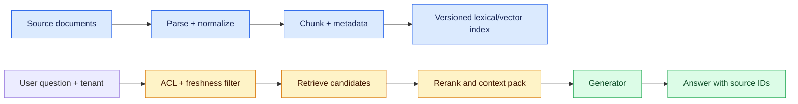
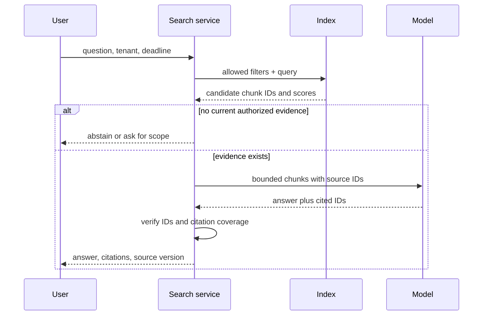

# Retrieval-augmented generation
Status: watch
Sources: [Lewis et al. RAG paper](https://arxiv.org/abs/2005.11401)

## In one sentence
RAG retrieves external passages and supplies them as context so answers can be grounded in an indexed corpus.

## Background: what existed before
Parametric-only models had stale knowledge and no direct citation path.

## What changed and why now
RAG separates retrieval from generation, allowing corpus updates without retraining. This month's focus is rag as an operable system boundary: its measurements and controls determine whether the capability survives contact with real traffic.

## Impact on current processing and architecture
Enforce document ACLs at retrieval time, cite passage IDs, and measure recall and answer faithfulness. A production path should carry version, tenant, latency, cost, and failure metadata beside the model result.

## Real-world applications and constraints
Use it for policy, support, and internal knowledge where source provenance matters. Start with reversible, low-risk workloads; define SLOs, access controls, and an owner before expanding.

## Mental model
A RAG request is retrieve, assemble, generate, and validate; retrieval failure is distinct from generation failure. Model the concept as a state transition with explicit inputs, outputs, authority, and failure handling.

## Prerequisites: a foundational primer

Know document parsing, chunking, metadata filters, embeddings, lexical search, reranking, citations, ACLs, and freshness. Retrieval supplies evidence; generation still needs checking.

## What changed this month
The January 2026 learning map places retrieval-augmented generation alongside low-latency inference, adoption, and scientific collaboration. The linked source is the primary technical or governance reference for the concept; this lesson labels system-design implications as inferences.

## Engineering consequence

Attach tenant, ACL, source version, effective date, page anchor, and deletion lineage to every chunk. Filter authorization and freshness before exposing context, and preserve citation IDs through answer validation.

## Topic-specific design notes
A production RAG trace has query rewrite, embedding, candidate retrieval, ACL filter, reranking, context packing, generation, and citation validation. Apply authorization before exposing text to the model; filtering after generation is too late. Chunk boundaries should preserve definitions and headings, while metadata carries tenant, timestamp, source, and sensitivity. Evaluate retrieval recall on labeled queries separately from answer faithfulness. On index updates, use versioned snapshots and dual-read or canary migration to avoid mixing incompatible embeddings. If evidence conflicts, surface the conflict or abstain instead of selecting the most fluent passage.

## Topic-specific exercise and interview prompts
Create three documents with tenant metadata and retrieve by a keyword, then filter unauthorized records before formatting context. Add a stale-document flag and make the answer cite IDs.

What is retrieval recall? A: The fraction of relevant items returned in the candidate set. Why ACL before generation? A: The model cannot reliably unsee unauthorized content.

## Limits and failure modes

A chunk can lose its table header; a stale policy can outrank a current one; an injection in a retrieved page can become an instruction. Rebuild on update/delete, label passages as data, and test no-answer and conflict paths.

## Mini exercise (15–30 min)

Create conflicting policy passages with different dates and tenants. Implement pre-ranking ACL filtering, top-k limits, and an abstention when no authorized evidence matches.

## Retrieval-augmented generation as an evidence pipeline

Retrieval-augmented generation (RAG) joins a retriever with a generator. The retriever selects passages from an external corpus; the generator conditions on those passages while composing an answer. The architecture separates changing knowledge from model weights, but it does not make the answer automatically correct. Retrieval can miss the needed passage, rank a stale policy first, or return text containing an instruction aimed at the model. Generation can misread, overgeneralize, or cite a passage that does not entail the claim.

Ingestion is part of correctness. Parse documents with stable IDs, preserve headings and page anchors, normalize only what search requires, and attach tenant, access scope, effective date, and source version. Chunking should respect semantic boundaries: splitting a table row from its header may make a numerically accurate fragment misleading. Re-index updates and deletions, and retain lineage from passage to source object. An embedding index without ACL filters is a data leak waiting to happen; apply authorization before ranking or at least before exposing content, and test both paths.

At query time, rewrite or expand the question only within the user's permissions, retrieve a candidate set, filter stale or unauthorized records, and rerank for relevance. A context assembler should cap tokens, deduplicate overlapping chunks, and retain citation IDs. If evidence is insufficient, return an abstention or ask a narrower question. The prompt should mark passages as data and require claims to point to citation IDs; this reduces confusion but is not an authorization mechanism. A post-answer checker can verify that cited IDs exist and quoted spans are present.

Evaluate retrieval and generation separately. Recall@k asks whether the needed evidence appears; answer accuracy asks whether the final response uses it. Build fixtures with conflicting policy versions, access boundaries, ambiguous names, and “no answer” cases. Measure citation coverage, unsupported-claim rate, stale-source rate, latency, and cost. A larger top-k can improve recall while overflowing context and increasing irrelevant confident prose.

An internal benefits assistant illustrates operational constraints. A policy document has an effective date and employee eligibility scope. Retrieval filters by employee region and date, the answer cites section anchors, and a policy conflict becomes review-required. The index is rebuilt after an HR update, while old answers retain the source version they used. This provenance allows a correction without pretending that every historical answer should change retroactively.

## Ingestion and retrieval are different services



Ingestion has a different failure surface from question answering. A parser can omit a table header, a deletion can leave stale chunks in an index, and a metadata migration can leave new documents unsearchable. Give the source object a stable ID, and give every chunk a chunk ID, source version, location anchor, tenant or scope, effective date, and ingestion timestamp. When a source changes, create a new version and either remove or mark superseded chunks; a citation must resolve to the exact version the user saw.

At query time, authorization narrows the candidate corpus before text is returned to the model. Ranking then decides which allowed chunks are relevant. Context packing is a resource-allocation step: a fixed token budget must cover the user question, instructions, and evidence. Prefer a diverse set of non-overlapping chunks with their anchors over ten near-identical chunks. If no allowed evidence clears the retrieval threshold, return an abstention. A fluent answer without evidence is not a graceful fallback for a knowledge product.

## Retrieval failure is observable before generation failure



The original RAG paper compares two formulations: one uses the same retrieved passages for an entire generated sequence and another can use different passages at token positions. Modern production systems need not replicate either formulation to benefit from the central separation: retrieval is a measurable evidence stage, while generation is a separate interpretation stage. Record candidate IDs, scores, filters, reranker version, packed IDs, and final cited IDs in a trace. That lets an engineer tell whether a wrong answer resulted from missing evidence, bad ranking, context truncation, or unsupported generation.

Use a labeled evaluation set with a required source or “no answer” label. First measure recall@k: did the correct source reach the candidate set? Then measure context recall: did it survive reranking and packing? Finally inspect whether the answer's claims are supported by its cited chunks. Increasing `k` may improve early recall while harming the final answer if irrelevant chunks consume the context budget. A low answer score with high retrieval recall calls for generation or citation work; low retrieval recall calls for corpus, chunking, query, or ranking work.

## Operating constraints and failure modes

An internal policy assistant is a useful boundary case. It may answer “What is the parental-leave policy for an employee in Arizona?” only after filtering for the employee's organization, region, and policy effective date. If two current documents disagree, the correct outcome can be `conflicting_sources`, not a forced answer. If the index is unavailable, distinguish `retrieval_unavailable` from `no_matching_evidence`; the first is an operational outage and the second is an evidence result.

Retrieved text is untrusted content. A document can contain a prompt injection, stale instruction, or private datum that was accidentally indexed. Delimit retrieved passages as data, restrict the allowed corpus independently of prompt instructions, and do not let a model-followed instruction change the filter or tool permissions. A citation validator can prove that IDs were supplied; it cannot prove that a generated conclusion logically follows the passage. High-stakes answers need review or deterministic domain checks in addition to retrieval.

## Chunking and freshness decisions

Chunking determines what retrieval is capable of finding. Fixed-size token windows are simple and work tolerably for prose, but can separate a definition from its qualifier or split a table from its header. Structure-aware chunking preserves sections, headings, lists, and table context, often improving citations because the returned passage carries enough meaning to stand alone. Overlap between neighboring chunks reduces boundary loss but creates duplicate candidates and wastes context budget. There is no universal chunk size: evaluate candidate policies against the documents and questions the product actually serves.

Do not confuse an embedding with the source of truth. An embedding is a numeric representation used for approximate similarity; the original document and its metadata remain authoritative. Keep the text, source object ID, version, access policy, and effective date together in a durable document store. The index can be rebuilt from that store. This matters for deletion requests and incident response: deleting only a source file while leaving its chunks and vectors searchable creates a ghost record, while deleting vectors without a lineage record makes it hard to prove what was exposed.

Freshness is also a ranking signal, not merely a nightly maintenance job. Some content—an employee handbook or product specification—may have an explicit effective date. Other content—an incident channel or support note—may age quickly but still contain useful historical context. Model this distinction in metadata and query policy. A current policy question can exclude superseded versions; a “what happened last quarter?” question needs them. Never make the generator infer currency from prose alone when the system has version data.

For rollout, build a small gold set before tuning. Each item should contain a user role, question, expected source IDs, whether an answer should be withheld, and notes about version or access constraints. Replay it when changing the parser, chunker, embedding model, index, reranker, or prompt. Log p50 and p95 separately for index lookup, reranking, document fetch, and generation, because a quality improvement that pushes interactive requests past their deadline may require an asynchronous route or a cheaper first-stage retriever. Store only the diagnostic data permitted by retention policy; a retrieval trace can itself reveal what a user was investigating.

When an answer is corrected, preserve the old retrieval trace and create a regression item. The correction may reveal a parser defect, a missing synonym, an ACL mistake, a ranking failure, or a claim the generator made beyond the supplied evidence. Each category has a different owner and fix; treating all of them as “hallucination” prevents useful diagnosis and leaves the production defect unresolved for the next user.

## Runnable low-cost example

```python
from dataclasses import dataclass

@dataclass
class Passage:
    text: str; tenant: str; source: str; score: float

def retrieve(passages, tenant, query_terms):
    allowed = [p for p in passages if p.tenant == tenant]
    ranked = sorted(allowed, key=lambda p: (sum(t in p.text.lower() for t in query_terms), p.score), reverse=True)
    return ranked[:2]

hits = retrieve([Passage("refund policy", "acme", "p1", .8), Passage("secret", "other", "p2", .99)], "acme", ["refund"])
assert [p.source for p in hits] == ["p1"]
print(hits)
```

The retrieval sketch uses term overlap instead of embeddings or a real index. It demonstrates tenant filtering and source identity, not relevance or grounded-answer accuracy.

## Mini exercise (15–30 min)

Create five passages with tenant, version, and effective-date metadata. Implement ACL filtering before ranking, a top-k cap, and an abstention when no passage contains the required term. Add a conflicting-version test and preserve source IDs in the answer object.

## Build it locally

1. Save `rag_filter.py` with five passages, tenants, and effective dates.
2. Filter ACL and freshness before ranking candidates.
3. Cap context and retain page/source IDs in the result.
4. Add a conflicting-version fixture that returns review-required.
5. Measure recall and unsupported claims separately on a labeled set.

## Interview Q&A

**Q: Does RAG eliminate hallucinations?** A: No; it supplies evidence, while retrieval and generation can still fail.
**Q: Where should ACL filtering happen?** A: As an enforced retrieval/data boundary, not only as a prompt instruction.
**Q: Why evaluate retrieval separately?** A: A bad answer may result from missing evidence or from misuse of present evidence.
**Q: What should an abstention say?** A: That the authorized corpus did not provide enough evidence, with a next step.

## Glossary

- **RAG:** Retrieval-augmented generation using external passages at query time.
- **Chunk:** An indexed segment of a source document.
- **Reranking:** A second relevance ordering over retrieved candidates.
- **Grounding:** Linking a generated claim to available evidence.

## References

[Lewis et al. RAG paper](https://arxiv.org/abs/2005.11401)
- [January 2026 lesson map](README.md)

## Claim ledger

| Claim | Source | Fact or inference |
|---|---|---|
| The RAG paper combines a pretrained sequence-to-sequence model with a non-parametric memory accessed through dense retrieval. | [Lewis et al. RAG paper](https://arxiv.org/abs/2005.11401) | Fact, scoped to source |
| The architecture, metrics, and failure handling in this lesson are suitable engineering consequences to test locally. | [Lewis et al. RAG paper](https://arxiv.org/abs/2005.11401) | Inference |
| The Python example illustrates a boundary and does not establish provider-scale reliability or safety. | [Lewis et al. RAG paper](https://arxiv.org/abs/2005.11401) | Inference |
