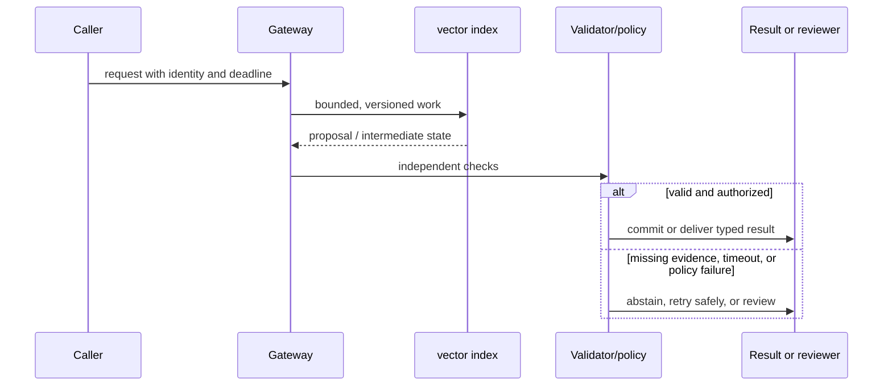

# Embeddings
Status: emerging
Sources: [Sentence-BERT paper](https://arxiv.org/abs/1908.10084)

## In one sentence
An embedding maps an item to a vector where a distance function approximates task-relevant similarity.

## Background: what existed before
Keyword search matched literal terms but missed paraphrases and semantic relations.

## What changed and why now
Dense representations enable nearest-neighbor search, clustering, and recommendations. This month's focus is embeddings as an operable system boundary: its measurements and controls determine whether the capability survives contact with real traffic.

## Impact on current processing and architecture
Choose a model and metric together, normalize consistently, and monitor drift and false neighbors. A production path should carry version, tenant, latency, cost, and failure metadata beside the model result.

## Real-world applications and constraints
Use vector search as candidate generation, then rerank and apply ACLs and deterministic filters. Start with reversible, low-risk workloads; define SLOs, access controls, and an owner before expanding.

## Mental model
An embedding is a learned representation, not a truth score or permission decision. Model the concept as a state transition with explicit inputs, outputs, authority, and failure handling.

## Prerequisites: a foundational primer

Know vectors, normalization, similarity metrics, nearest-neighbor indexes, lexical search, recall@k, and model-version compatibility. Geometry is task-specific rather than universal meaning.

## What changed this month
The January 2026 learning map places embeddings alongside low-latency inference, adoption, and scientific collaboration. The linked source is the primary technical or governance reference for the concept; this lesson labels system-design implications as inferences.

## Engineering consequence

Store embedding model, normalization, language, source commit, tenant ACL, and index generation with each vector. Compare ANN recall with an exact baseline and remove vectors during source deletion.

## Topic-specific design notes
Embedding systems have an offline and online contract: model version, normalization, dimensionality, distance metric, language coverage, and index build. Mixing vectors from incompatible models makes distances meaningless. Approximate nearest-neighbor indexes trade recall for memory and query latency; reranking can recover precision at additional cost. Store source IDs and ACL metadata beside vectors, not only in a separate eventually consistent table. Monitor nearest-neighbor distributions and query-language mix for drift. Embeddings support candidate discovery; deterministic filters and a second-stage ranker should decide eligibility.

## Topic-specific exercise and interview prompts
Compute cosine similarity for two normalized vectors and a threshold. Add a third vector showing that a high similarity is only a retrieval signal, not a permission decision.

Why normalize? A: It makes dot product equivalent to cosine similarity. Why rerank? A: First-stage vector similarity is a coarse candidate score.

## Limits and failure modes

Model mismatch makes scores incomparable; boilerplate creates false neighbors; stale segments return deleted content. Use dual-write or rebuild for model changes and combine lexical identifiers with vector ranking.

## Mini exercise (15–30 min)

Build an exact nearest-neighbor baseline for ten vectors, add tenant filtering, and simulate an approximate search that inspects half the candidates. Calculate recall@3.

## Embedding geometry behind a search decision

An embedding maps text or another object to a vector so related items can be compared geometrically. Sentence-BERT showed how siamese and triplet-style training can make sentence representations useful for semantic similarity. In production, an embedding is not a universal meaning coordinate: its geometry reflects training data, pooling, normalization, language, and task. Choosing cosine similarity, dot product, or Euclidean distance changes the index and score interpretation.

The pipeline has two model invocations with different lifecycle concerns. Ingestion embeds a document version and stores the vector with source ID, tenant, ACL, language, and embedding-model version. Query time embeds the question with the compatible model and searches a tenant-filtered index. Mixing models or normalization conventions can make scores incomparable. When the model changes, dual-write or rebuild the index; do not silently compare old document vectors with new query vectors and infer that a lower score means irrelevance.

Approximate nearest-neighbor indexes trade exact recall for memory and latency. HNSW uses a graph whose construction and search parameters affect recall; inverted-file approaches partition the space and probe selected cells. The right setting depends on corpus size, update frequency, and latency SLO. Measure recall against an exact small index, p95 query time, memory, build time, and stale-vector rate. A high cosine score can still be a false friend when two documents share boilerplate or when a rare identifier is important.

Hybrid retrieval often combines vector similarity with lexical matching, filters, and a reranker. Exact terms such as ticket IDs and drug codes benefit from lexical search; semantic paraphrases benefit from embeddings. Normalize scores before combining and keep explainable features in the result. Privacy review must include vectors: nearest-neighbor queries can reveal membership or source information, and deletion must remove vectors and index segments. Access filters should be tested with adversarial queries, not assumed from metadata.

For a code-search service, embeddings retrieve semantically similar functions, while a lexical index catches exact API names. A result includes repository commit, path, language, and ACL. The assistant cites those identifiers and declines when all candidates are from an inaccessible repository. Offline recall tests use real developer queries and hard negatives; online metrics include accepted suggestions and edits, not click-through alone. Geometry is a tool in a larger evidence system.

## Impact on current data processing

The data path is `request → vector index → validator/policy → outcome`. The `vector plus model/version metadata` is versioned and scoped to its owner; it is not treated as a durable memory or permission. Admission records the input shape and deadline, processing emits typed intermediate state, and the final result carries provenance and a reason code. This makes a change measurable at the boundary where dense vectors become an application decision.

Operationally, keep the concept-specific resource bounded. Measure the signal that matters for dense vectors alongside p95 latency, error class, cost, and downstream correction. Under overload or missing evidence, return a typed degraded state or queue for review. Retrying must preserve idempotency and correlation. Any cache, index, trace, or derived artifact inherits tenant isolation and retention rules. These are engineering inferences from the source, not guarantees supplied by it.

## Architecture and data flow

```mermaid
flowchart LR
  A[Caller / source data] --> B[Admission and identity]
  B --> C[vector index]
  C --> D[Independent validation]
  D --> E[Scoped result or review]
  E --> F[Outcome telemetry]
  classDef source fill:#fee2e2,stroke:#dc2626,color:#450a0a
  classDef gate fill:#dbeafe,stroke:#2563eb,color:#172554
  classDef work fill:#fef3c7,stroke:#d97706,color:#451a03
  classDef result fill:#dcfce7,stroke:#16a34a,color:#14532d
  class A source
  class B,D gate
  class C work
  class E,F result
```



The source or caller remains outside the worker's trust assumptions. Admission attaches tenant, purpose, deadline, and version; the worker transforms dense vectors; validation checks invariants that generated or approximate computation cannot establish. Only the final policy transition can produce a side effect. Telemetry records identifiers and measurements without copying sensitive payloads by default.

## Sequence and failure flow



Model mismatch makes scores incomparable; boilerplate creates false neighbors; stale segments return deleted content. Use dual-write or rebuild for model changes and combine lexical identifiers with vector ranking.

## Design walkthrough: operating dense vectors safely

Take one realistic request and follow it through the system. The caller supplies an identity, purpose, input, and deadline; admission validates those fields before allocating work. The vector index receives only the fields needed for its computation and emits a proposal, measurement, or transformed state. It does not get ambient credentials, an unbounded queue, or permission to redefine the contract. The gateway stores the vector plus model/version metadata identifier and the versions that produced it, then invokes checks owned by code outside the probabilistic or approximate step.

A code-search service uses vectors for paraphrases and lexical matches for exact API names. Results include repository commit and ACL; inaccessible repositories never appear as nearest neighbors.

Now follow a difficult request. An unusually large dense vectors value may exhaust memory or context; a rare language, malformed record, stale source, or cancelled client may invalidate assumptions. Admission should reject or split before expensive work, and the reason must be observable. If a dependency times out, preserve the deadline and return an unavailable state rather than retrying forever. If work may have reached an external system, query its receipt before replay. These transitions are different from model uncertainty and should have different metrics and runbooks.

Multi-tenant operation adds a second axis. Namespaces, ACL filters, quotas, and deletion jobs apply to the vector plus model/version metadata as well as to the visible answer. A cache key, vector, trace, queue item, or temporary file must carry an owner or an explicit public scope. Test a request that has a valid shape but another tenant's identifier; the expected behavior is a denial, not an empty lookup that leaks timing. Test revocation between planning and execution. The worker should observe the new policy at the side-effect boundary.

Capacity planning should use production-shaped distributions. Measure short and long inputs, cold and warm workers, concurrent tenants, cancellations, and retries. Report p50 and p95 or p99 latency, memory, queue age, cost, and accepted outcome rate. For dense vectors, add a domain metric: page or token fit, cache-page pressure, batch wait, evidence recall, field validity, review agreement, or conversion. Averages hide the cases that drive support tickets. A canary is successful only when protected slices remain inside their thresholds.

Finally, make a change record. State what the source actually establishes, what this integration infers, which baseline was used, and what would trigger rollback. Pin the model or library, schema, policy, and data versions. Keep a small reproducible fixture and a separate protected case. At launch, sample outcomes and inspect corrections; after launch, add every incident to the regression set. The owner should be able to answer what the system saw, which decision it made, why it was allowed, and how to undo it without searching through raw customer payloads.

## Real-world application and trade-off analysis

The strongest use case is one in which dense vectors are expensive or difficult to manage manually and the consequence of a wrong result is bounded. Start with read-only or draft work, then add a reviewed transition. Estimate total cost, including retrieval, model work, retries, storage, reviewer time, and corrections. Latency targets should be stated separately for interactive and batch routes. A cheaper or faster implementation is not an improvement if it moves errors into a high-cost downstream queue.

ANN parameters trade build time, memory, latency, and recall. A highly relevant semantic hit may miss a rare identifier, while lexical-only search misses paraphrases; hybrid ranking adds tuning and explainability work.

## Limits and failure modes specific to this concept

Watch for malformed inputs, version drift, resource exhaustion, cross-tenant state, stale artifacts, and silent degraded paths. Test the boundary conditions that are unique to dense vectors: unusually large or rare values, cancellations, duplicate requests, partial dependencies, and adversarial content. A passing happy-path demo says little about tail behavior. Define an escalation owner and rollback artifact before enabling the feature. If the source describes a capability, label it as a fact; claims about production quality, safety, or value are inferences requiring local evidence.

## Runnable low-cost example

```python
import math

def cosine(a, b):
    dot = sum(x*y for x,y in zip(a,b)); na = math.sqrt(sum(x*x for x in a)); nb = math.sqrt(sum(y*y for y in b))
    return dot / (na * nb) if na and nb else 0.0

q = [1, 0, 1]; docs = {"near": [1, .1, .9], "far": [-1, 0, 0]}
print(sorted(((cosine(q,v), k) for k,v in docs.items()), reverse=True))
```

The cosine function illustrates score ordering only. It does not implement HNSW/IVF, calibration, privacy defenses, or an application relevance judgment.

## Mini exercise (15–30 min)

Build an exact nearest-neighbor baseline for ten vectors, then simulate an approximate index by inspecting only half the candidates. Calculate recall@3, add tenant filters, and demonstrate how an embedding-model version mismatch changes the contract.

## Build it locally

1. Save `vector_search.py` with exact cosine ranking and source IDs.
2. Add model-version and tenant metadata to every vector.
3. Compare full-candidate recall@3 with a half-candidate approximation.
4. Add a lexical exact-ID candidate and combine rankings.
5. Delete a source and assert no index result can return its vector.

## Interview Q&A

**Q: Does a high similarity prove relevance?** A: No; it is a model- and metric-dependent ranking signal.
**Q: Why store model version?** A: Vector geometry and score distributions change across embedding models.
**Q: When is lexical search useful?** A: Exact identifiers, codes, and rare terms can be poorly represented geometrically.
**Q: What is recall@k?** A: The fraction of known relevant items found among the top k results.

## Glossary

- **Embedding:** A learned vector representation of an object.
- **Cosine similarity:** The angle-based similarity between two nonzero vectors.
- **ANN:** Approximate nearest-neighbor search trading some recall for speed.
- **Hard negative:** A non-relevant item that looks similar and tests ranking quality.

## References

[Sentence-BERT paper](https://arxiv.org/abs/1908.10084)
- [January 2026 lesson map](README.md)

## Claim ledger

| Claim | Source | Fact or inference |
|---|---|---|
| Sentence-BERT uses siamese and triplet network structures to derive sentence embeddings suitable for similarity search. | [Sentence-BERT paper](https://arxiv.org/abs/1908.10084) | Fact, scoped to source |
| The architecture, metrics, and failure handling in this lesson are suitable engineering consequences to test locally. | [Sentence-BERT paper](https://arxiv.org/abs/1908.10084) | Inference |
| The Python example illustrates a boundary and does not establish provider-scale reliability or safety. | [Sentence-BERT paper](https://arxiv.org/abs/1908.10084) | Inference |
