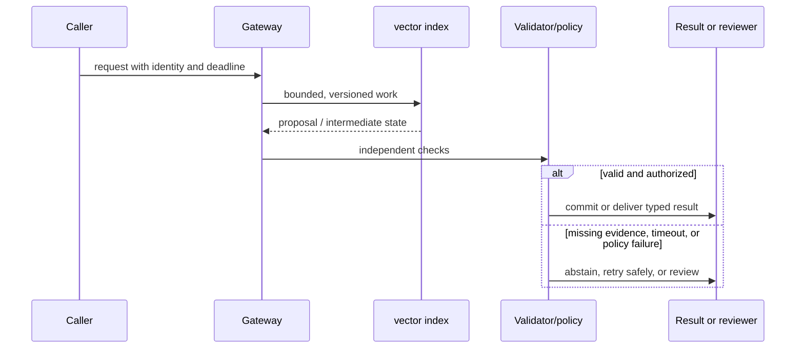

# Embeddings
Status: emerging
Sources: [Sentence-BERT paper](https://arxiv.org/abs/1908.10084)

## In one sentence
An embedding maps an item to a vector where a distance function approximates task-relevant similarity.

## Background: what existed before
Keyword search matched literal terms but missed paraphrases and semantic relations.

## What changed and why now
Dense representations enable nearest-neighbor search, clustering, and recommendations. This month's focus is embeddings as an operable system boundary: its measurements and controls determine whether the capability survives contact with real traffic.

## Impact on current processing and architecture
Choose a model and metric together, normalize consistently, and monitor drift and false neighbors. A production path should carry version, tenant, latency, cost, and failure metadata beside the model result.

## Real-world applications and constraints
Use vector search as candidate generation, then rerank and apply ACLs and deterministic filters. Start with reversible, low-risk workloads; define SLOs, access controls, and an owner before expanding.

## Mental model
An embedding is a learned representation, not a truth score or permission decision. Model the concept as a state transition with explicit inputs, outputs, authority, and failure handling.

## Prerequisites: a foundational primer

Know vectors, normalization, similarity metrics, nearest-neighbor indexes, lexical search, recall@k, and model-version compatibility. Geometry is task-specific rather than universal meaning.

## What changed this month
The January 2026 learning map places embeddings alongside low-latency inference, adoption, and scientific collaboration. The linked source is the primary technical or governance reference for the concept; this lesson labels system-design implications as inferences.

## Engineering consequence

Store embedding model, normalization, language, source commit, tenant ACL, and index generation with each vector. Compare ANN recall with an exact baseline and remove vectors during source deletion.

## Topic-specific design notes
Embedding systems have an offline and online contract: model version, normalization, dimensionality, distance metric, language coverage, and index build. Mixing vectors from incompatible models makes distances meaningless. Approximate nearest-neighbor indexes trade recall for memory and query latency; reranking can recover precision at additional cost. Store source IDs and ACL metadata beside vectors, not only in a separate eventually consistent table. Monitor nearest-neighbor distributions and query-language mix for drift. Embeddings support candidate discovery; deterministic filters and a second-stage ranker should decide eligibility.

## Topic-specific exercise and interview prompts
Compute cosine similarity for two normalized vectors and a threshold. Add a third vector showing that a high similarity is only a retrieval signal, not a permission decision.

Why normalize? A: It makes dot product equivalent to cosine similarity. Why rerank? A: First-stage vector similarity is a coarse candidate score.

## Limits and failure modes

Model mismatch makes scores incomparable; boilerplate creates false neighbors; stale segments return deleted content. Use dual-write or rebuild for model changes and combine lexical identifiers with vector ranking.

## Mini exercise (15–30 min)

Embedding retrieval is also a data-contract problem. Store the embedding model, preprocessing version, tenant, source ID, and creation time beside each vector. When the model changes, old and new vectors may inhabit different geometries even if their dimensions match. A dual-read migration can compare recall and cost before switching, while a hard version filter prevents silent mixed-index ranking. Deletions must reach the vector index, caches, backups, and derived summaries; otherwise a successful source-row delete can still leave discoverable information.

Build an exact nearest-neighbor baseline for ten vectors, add tenant filtering, and simulate an approximate search that inspects half the candidates. Calculate recall@3.

## Embedding geometry behind a search decision

An embedding maps text or another object to a vector so related items can be compared geometrically. Sentence-BERT showed how siamese and triplet-style training can make sentence representations useful for semantic similarity. In production, an embedding is not a universal meaning coordinate: its geometry reflects training data, pooling, normalization, language, and task. Choosing cosine similarity, dot product, or Euclidean distance changes the index and score interpretation.

The pipeline has two model invocations with different lifecycle concerns. Ingestion embeds a document version and stores the vector with source ID, tenant, ACL, language, and embedding-model version. Query time embeds the question with the compatible model and searches a tenant-filtered index. Mixing models or normalization conventions can make scores incomparable. When the model changes, dual-write or rebuild the index; do not silently compare old document vectors with new query vectors and infer that a lower score means irrelevance.

Approximate nearest-neighbor indexes trade exact recall for memory and latency. HNSW uses a graph whose construction and search parameters affect recall; inverted-file approaches partition the space and probe selected cells. The right setting depends on corpus size, update frequency, and latency SLO. Measure recall against an exact small index, p95 query time, memory, build time, and stale-vector rate. A high cosine score can still be a false friend when two documents share boilerplate or when a rare identifier is important.

Hybrid retrieval often combines vector similarity with lexical matching, filters, and a reranker. Exact terms such as ticket IDs and drug codes benefit from lexical search; semantic paraphrases benefit from embeddings. Normalize scores before combining and keep explainable features in the result. Privacy review must include vectors: nearest-neighbor queries can reveal membership or source information, and deletion must remove vectors and index segments. Access filters should be tested with adversarial queries, not assumed from metadata.

For a code-search service, embeddings retrieve semantically similar functions, while a lexical index catches exact API names. A result includes repository commit, path, language, and ACL. The assistant cites those identifiers and declines when all candidates are from an inaccessible repository. Offline recall tests use real developer queries and hard negatives; online metrics include accepted suggestions and edits, not click-through alone. Geometry is a tool in a larger evidence system.

## Impact on current data processing

The retrieval path is `request → embedding model → filtered index → reranker → evidence outcome`. Vectors are derived data with a model, preprocessing, source snapshot, and tenant scope; a nearest-neighbor score is neither authorization nor proof of relevance. Admission records query shape and deadline, filtering removes inaccessible records before presentation, and the result carries document IDs, scores, freshness, and index version. This makes migration and relevance changes measurable at the retrieval boundary.

Operationally, bound vector dimensions, batch size, index memory, and query fan-out. Measure recall, filtered-result rate, score margin, index freshness, p95 latency, storage, and downstream correction by model version and tenant. If the index is unavailable or no candidate clears the calibrated threshold, return `unverified` or queue for review rather than inventing evidence. Rebuilds and retries need idempotent jobs and correlation IDs. These integration controls are engineering inferences, not guarantees supplied by an embedding source.

## Architecture and data flow

```mermaid
flowchart LR
  A[Caller / source data] --> B[Admission and identity]
  B --> C[vector index]
  C --> D[Independent validation]
  D --> E[Scoped result or review]
  E --> F[Outcome telemetry]
  classDef source fill:#fee2e2,stroke:#dc2626,color:#450a0a
  classDef gate fill:#dbeafe,stroke:#2563eb,color:#172554
  classDef work fill:#fef3c7,stroke:#d97706,color:#451a03
  classDef result fill:#dcfce7,stroke:#16a34a,color:#14532d
  class A source
  class B,D gate
  class C work
  class E,F result
```



The caller and source documents remain outside the vector worker’s trust assumptions. Admission attaches tenant, purpose, deadline, and embedding version; the worker computes and searches vectors; authorization filtering and freshness checks validate invariants that similarity cannot establish. Only a separately authorized application stage can turn evidence into a side effect. Telemetry records query, index, and result identifiers without copying sensitive payloads by default.

## Sequence and failure flow



Model mismatch makes scores incomparable; boilerplate creates false neighbors; stale segments return deleted content. Use dual-write or rebuild for model changes and combine lexical identifiers with vector ranking.

## Design walkthrough: operating dense vectors safely

For a code-search request, begin with the repository commit, caller identity, and allowed project scope. Chunking should preserve symbol boundaries where possible, while metadata records path, language, commit, and ACL. The embedding worker receives only authorized text and emits a vector tied to that metadata. Retrieval filters by authorization before ranking, not after a result has already exposed a filename. Exact symbol names still need lexical search because a semantically similar paragraph is not a substitute for a unique API identifier.

A difficult retrieval case should be observable as a retrieval state. A language or domain absent from calibration data may produce low or misleading similarity. A malformed document may create an empty or extreme vector. A deleted source may remain in an old segment or cache. Return reasons such as `no_candidates`, `stale_index`, `filtered_by_acl`, and `invalid_vector` rather than quietly returning an empty answer. These states tell the application whether to broaden search, rebuild an index, request clarification, or abstain.

Multi-tenant vector search requires isolation at every representation. Namespace keys, row-level filters, index partitions, caches, traces, and deletion workers all need tenant scope. Test a valid query whose requested tenant differs from authenticated identity and expect a denial. Test revocation after indexing and verify that the result is filtered immediately or the index is marked unavailable. A vector can reveal information about its source even when the original text is not returned, so access and retention policies apply to derived representations.

Capacity planning should use production-shaped embeddings and queries. Measure dimension, index build time, memory, cache pressure, queue age, query latency, recall, and cost across short and long documents, cold and warm workers, concurrent tenants, cancellations, and retries. A canary should compare protected retrieval slices and downstream correction rate, not only average nearest-neighbor latency. If an embedding-model update changes score distribution, use a versioned dual-read or rebuild and keep old and new results distinguishable during migration.

Close the change with an embedding-specific record. State the source’s actual claim, the local baseline, model and preprocessing versions, index parameters, ACL policy, deletion status, and rollback trigger. Keep a reproducible fixture containing paraphrases, exact identifiers, hard negatives, stale documents, and cross-tenant attempts. After launch, sample retrieved evidence and inspect corrections; every incident involving leakage, stale content, or poor recall should become a governed regression case.

The retrieval contract also needs a decision about abstention. If the top score is below a validated threshold, if the margin between candidates is narrow, or if the source is stale, return uncertainty to the answer generator. Do not fill the gap with a plausible completion. A hybrid result can include lexical matches, semantic matches, source dates, and access decisions so a reviewer can understand why evidence was selected. Tune these thresholds on a protected set and monitor changes after re-indexing.

Embedding migrations deserve a staged plan. Build the new index from a frozen source snapshot, compare recall and filtered-result behavior, and run deletion and authorization tests before switching traffic. During dual-read, keep candidate rankings labeled by model version and avoid combining scores without calibration. Retire the old index only after queues, caches, and downstream answer traces no longer depend on it. This is a retrieval-specific release boundary, not merely a storage replacement.

## Real-world application and trade-off analysis

Embeddings are most useful when a corpus contains paraphrases, varied vocabulary, or multilingual expressions that exact term matching cannot connect. A support search can retrieve “refund pending” when the user asks why money has not arrived, but that semantic match still needs tenant filtering, freshness checks, and a source link. Start with read-only retrieval and measure whether selected passages improve resolution; only then allow retrieved context to influence an external action. Include index build, vector storage, reranking, and re-embedding costs in the operating budget.

ANN parameters trade build time, memory, latency, and recall. A highly relevant semantic hit may miss a rare identifier, while lexical-only search misses paraphrases; hybrid ranking adds tuning and explainability work.

## Limits and failure modes specific to this concept

Vector systems fail in ways that ordinary text tests miss. Test near-duplicate documents, short queries, identifier-heavy strings, language and script changes, zero or malformed vectors, deleted records, stale indexes, and filters that remove the highest-scoring neighbors. Check recall against a labeled set and verify that authorization is applied before results are exposed. Watch for embedding drift after a model or preprocessing change, approximate-nearest-neighbor recall loss under load, and score thresholds that no longer mean the same thing after re-indexing. Treat safety and usefulness as local measurements, not consequences of having a similarity score.

## Runnable low-cost example

```python
import math

def cosine(a, b):
    dot = sum(x*y for x,y in zip(a,b)); na = math.sqrt(sum(x*x for x in a)); nb = math.sqrt(sum(y*y for y in b))
    return dot / (na * nb) if na and nb else 0.0

q = [1, 0, 1]; docs = {"near": [1, .1, .9], "far": [-1, 0, 0]}
print(sorted(((cosine(q,v), k) for k,v in docs.items()), reverse=True))
```

The cosine function illustrates score ordering only. It does not implement HNSW/IVF, calibration, privacy defenses, or an application relevance judgment.

## Mini exercise (15–30 min)

Build an exact nearest-neighbor baseline for ten vectors, then simulate an approximate index by inspecting only half the candidates. Calculate recall@3, add tenant filters, and demonstrate how an embedding-model version mismatch changes the contract.

## Build it locally

1. Save `vector_search.py` with exact cosine ranking and source IDs.
2. Add model-version and tenant metadata to every vector.
3. Compare full-candidate recall@3 with a half-candidate approximation.
4. Add a lexical exact-ID candidate and combine rankings.
5. Delete a source and assert no index result can return its vector.

## Interview Q&A

**Q: Does a high similarity prove relevance?** A: No; it is a model- and metric-dependent ranking signal.
**Q: Why store model version?** A: Vector geometry and score distributions change across embedding models.
**Q: When is lexical search useful?** A: Exact identifiers, codes, and rare terms can be poorly represented geometrically.
**Q: What is recall@k?** A: The fraction of known relevant items found among the top k results.

## Glossary

- **Embedding:** A learned vector representation of an object.
- **Cosine similarity:** The angle-based similarity between two nonzero vectors.
- **ANN:** Approximate nearest-neighbor search trading some recall for speed.
- **Hard negative:** A non-relevant item that looks similar and tests ranking quality.

## References

[Sentence-BERT paper](https://arxiv.org/abs/1908.10084)
- [January 2026 lesson map](README.md)

## Claim ledger

| Claim | Source | Fact or inference |
|---|---|---|
| Sentence-BERT uses siamese and triplet network structures to derive sentence embeddings suitable for similarity search. | [Sentence-BERT paper](https://arxiv.org/abs/1908.10084) | Fact, scoped to source |
| The architecture, metrics, and failure handling in this lesson are suitable engineering consequences to test locally. | [Sentence-BERT paper](https://arxiv.org/abs/1908.10084) | Inference |
| The Python example illustrates a boundary and does not establish provider-scale reliability or safety. | [Sentence-BERT paper](https://arxiv.org/abs/1908.10084) | Inference |
