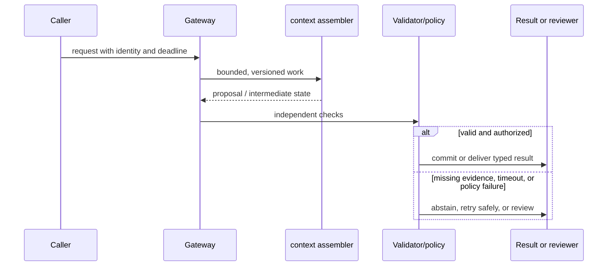

# Context engineering
Status: durable
Sources: [Anthropic effective context engineering](https://www.anthropic.com/engineering/effective-context-engineering-for-ai-agents)

## In one sentence
Context engineering assembles bounded, ordered evidence and instructions for a model call.

## Background: what existed before
Prompting treated a request as one string, often exceeding context or mixing trusted and untrusted text.

## What changed and why now
Modern systems budget context across policies, retrieved evidence, state, and user input. This month's focus is context engineering as an operable system boundary: its measurements and controls determine whether the capability survives contact with real traffic.

## Impact on current processing and architecture
Label provenance, prioritize evidence, trim stale state, and test ordering and truncation behavior. A production path should carry version, tenant, latency, cost, and failure metadata beside the model result.

## Real-world applications and constraints
Use a context builder that emits a manifest and deterministic sections before inference. Start with reversible, low-risk workloads; define SLOs, access controls, and an owner before expanding.

## Mental model
Context is an input data structure with sources, authority, and token limits—not an unlimited scratchpad. Model the concept as a state transition with explicit inputs, outputs, authority, and failure handling.

## Prerequisites: a foundational primer

Know token budgets, instruction precedence, retrieval metadata, summarization loss, redaction, and deterministic serialization. Context is a bounded working set, not a transcript dump.

## What changed this month
The January 2026 learning map places context engineering alongside low-latency inference, adoption, and scientific collaboration. The linked source is the primary technical or governance reference for the concept; this lesson labels system-design implications as inferences.

## Engineering consequence

Emit a context manifest listing block IDs, order, authority, freshness, token estimates, ACL decision, and omission reason. Assemble policy and task constraints before untrusted evidence and validate the manifest before inference.

## Topic-specific design notes
A context builder should emit named sections with authority and freshness: system policy, task, trusted state, retrieved evidence, tool results, and user content. Keep untrusted text data-delimited and never interpolate it into an instruction template. Use a token budget allocator that reserves space for the answer and critical policy before optional history. Summarization must preserve identifiers, decisions, and uncertainty; stale summaries need expiry. Log a redacted manifest containing section names, versions, and token counts so a regression can be explained without retaining sensitive text.

## Topic-specific exercise and interview prompts
Build a context assembler with a fixed 40-token budget and priority-ranked sections. Show which section is dropped when the budget is exceeded; add a test that user text cannot alter the policy section.

What is context provenance? A: Metadata showing source, authority, and freshness. Why reserve output space? A: Otherwise truncation can remove the completion or required refusal.

## Limits and failure modes

A summary can remove a critical number; stale memory can override a correction; a retrieved instruction can cross an authority boundary. Prefer omission with a reason or abstention over silent truncation, and make corrections versioned.

## Mini exercise (15–30 min)

Context assembly is a stateful preprocessing stage with its own observability. Emit a manifest containing block IDs, authority, source version, freshness, estimated tokens, and omission reasons. This makes a bad answer diagnosable: the evidence may have been missing, stale, truncated, or placed below an instruction with the wrong precedence. Test correction and deletion paths because a summary that survives after its source is withdrawn is both a quality defect and a governance concern. Keep secrets and unrelated tenant material outside the model-visible working set.

Create policy, evidence, history, and tool-result blocks with authority and freshness. Assemble under a fixed budget and prove a low-authority block cannot reorder policy.

## Context as a bounded working set

Context engineering is the deliberate construction of the model's working set: instructions, conversation state, retrieved evidence, tool results, and output requirements. More text is not automatically more capability. A model has finite attention and a fixed budget; irrelevant or contradictory material consumes tokens and makes the answer harder to audit. Treat context as an intermediate data structure with owners, ordering, provenance, and a size limit.

Begin with a task contract. Identify what the model must decide, what evidence is authoritative, what is merely a hint, and what must never be exposed. Assemble blocks in a deterministic order, for example policy, task input, scoped evidence, and response schema. Give each block an ID and source timestamp. Conversation memory should be summarized with a version and allow the user to correct it; silently carrying an old preference is a state bug. Tool results need bounded fields and explicit “untrusted result” labels.

Compression has different semantics. A summary can preserve goals while losing exact numbers, a retrieval filter can remove irrelevant documents while preserving citations, and truncation can destroy a required constraint. Choose the operation based on the block's role. Measure how often a compressed context changes the accepted outcome, not only how many tokens it saves. A context manifest makes a failed answer reproducible: it records block IDs, lengths, ordering, policy version, and omitted candidates without storing every sensitive byte.

The assembler is a policy boundary. It applies tenant ACLs, redaction, freshness windows, and token budgets before the model call. It must not allow a retrieved document to override the system's authority hierarchy. A conflict detector can flag two policy versions, but a model should not resolve a legal conflict by preference. If required evidence cannot fit, return a bounded “needs narrower scope” state or route to a long-context path with its own review.

For an incident triage assistant, context includes alert metadata, the latest runbook section, recent changes, and a compact history. The assembler excludes unrelated incidents and redacts credentials from logs. The answer cites runbook IDs and marks suggestions as proposals. Engineers can inspect the manifest when a recommendation was based on an obsolete runbook. This turns prompt design from ad hoc string concatenation into a testable data pipeline.

## Impact on current data processing

The working-set path is `request → authority filter → retrievers → ranker/compressor → context manifest → model`. The manifest names each included and omitted block, its source version, trust tier, token cost, and reason for selection. It is an input artifact, not durable memory or permission. Admission records tenant, task, deadline, and budget; the assembler emits a bounded state; downstream validation checks citations and policy before any action. This makes omissions and ordering decisions observable.

Operationally, bound context tokens, retrieval calls, compression time, and source fan-out. Measure source coverage, authority conflicts, freshness, omitted-required-blocks, assembly latency, p95 model latency, token cost, and correction rate by task and tenant. If a required policy block cannot fit, return `insufficient_context` or request a narrower scope; do not silently replace it with a lower-trust summary. Retries preserve manifest IDs and correlation, while caches inherit source version, tenant, and deletion rules. These controls are engineering inferences, not guarantees supplied by the source.

## Architecture and data flow

```mermaid
flowchart LR
  A[Caller / source data] --> B[Admission and identity]
  B --> C[context assembler]
  C --> D[Independent validation]
  D --> E[Scoped result or review]
  E --> F[Outcome telemetry]
  classDef source fill:#fee2e2,stroke:#dc2626,color:#450a0a
  classDef gate fill:#dbeafe,stroke:#2563eb,color:#172554
  classDef work fill:#fef3c7,stroke:#d97706,color:#451a03
  classDef result fill:#dcfce7,stroke:#16a34a,color:#14532d
  class A source
  class B,D gate
  class C work
  class E,F result
```



The caller, retrieved pages, and historical summaries remain outside the assembler’s authority assumptions. Admission attaches tenant, purpose, deadline, and policy version; retrieval applies access and freshness filters; the assembler orders evidence by authority and task need; validation checks required citations and action permissions. Only a separately authorized transition can cause a side effect. Telemetry records manifest and source identifiers without copying sensitive payloads by default.

## Sequence and failure flow



A summary can remove a critical number; stale memory can override a correction; a retrieved instruction can cross an authority boundary. Prefer omission with a reason or abstention over silent truncation, and make corrections versioned.

## Design walkthrough: operating ordered evidence blocks safely

For an incident assistant, assemble a small working set: the active alert, current service state, relevant runbook section, recent deployment, and source identifiers. Assign each block an authority, freshness, tenant scope, and token estimate. The assistant should cite included blocks and state what was omitted. A responder can then tell whether a recommendation rests on current evidence or an old summary.

Context selection is a ranking problem with constraints. Retrieval score alone cannot decide precedence because a low-scoring policy block may outrank a highly similar user note. Apply authorization and freshness before ranking, reserve space for non-negotiable instructions, and record the inclusion order. If a required block cannot fit, narrow the task, use an approved larger context, or abstain rather than silently truncating it.

Consider a difficult request with conflicting evidence. One document says a service is healthy, while a newer alert says its error rate is rising. The assembler should retain both timestamps and mark the conflict; it should not choose the fluent paragraph. A corrected memory should invalidate descendants that relied on the old value. These are context-state transitions and should be measurable independently from model uncertainty.

Tenant isolation applies to context manifests, caches, summaries, vector results, traces, and temporary files. Derive tenant from authenticated state, filter before prompt construction, and test a request whose valid resource ID belongs to another tenant. A denial is different from an empty result because timing and audit behavior can reveal that a lookup occurred. Recheck permissions when a long-running run refreshes context.

Capacity planning should measure token budget, assembly latency, retrieval calls, cache hit rate, source freshness, and omission rate across short and long tasks. Add context metrics such as evidence recall, conflict detection, manifest reproducibility, and correction survival. A canary is useful only when protected prompts retain required policy and source blocks; a better average answer can hide a missing exception.

Close each context change with a manifest that records model, prompt template, source versions, filters, ranking, compression, token budget, policy, and omitted-block reasons. Pin the manifest for replay and keep a protected correction case. After launch, inspect answers whose manifests differ or whose users correct a source. The owner should be able to reconstruct what entered the model call without exposing unrelated raw customer content.

Context quality should be tested with counterfactuals. Remove one required block, swap a current policy for an older version, insert an untrusted instruction into retrieved text, and exceed the token budget. The expected behavior is a visible omission or refusal with a reason, not a confident answer. Also test a correction: when a source changes, the next manifest should point to the new version and prevent a stale cached summary from silently returning.

## Real-world application and trade-off analysis

### Budgeting the working set

Treat the context window as a budgeted working set rather than an unlimited mailbox. Reserve space for the current request, system policy, tool instructions, retrieved evidence, intermediate state, and the expected response. If a tool can return an unexpectedly large payload, enforce its limit before concatenation; truncating after the model has already seen the payload is too late. Record which blocks were admitted, compressed, evicted, or rejected, together with their versions and reasons. This makes a quality regression diagnosable: the model may have received the right document but lost the exception paragraph during packing. A useful local test varies evidence order and budget, then checks whether required constraints survive summarization. When a required block cannot fit, return `context_budget_exceeded` or ask the user to narrow scope instead of silently dropping policy.

Context engineering pays off when the model must act on several sources with different authority, freshness, or purpose. An incident assistant may need the current runbook, service ownership, recent alerts, and a prior postmortem, while excluding an obsolete procedure. Begin with a read-only answer and expose the assembled sources; only add tool actions after omission and conflict behavior are measured. Budget retrieval, ranking, compression, cache misses, and review time alongside model tokens.

More context can improve recall while increasing latency and distraction. Compression saves tokens but risks semantic loss; retrieval filtering preserves provenance but may omit a needed exception.

## Limits and failure modes specific to this concept

The main failure is not merely a full context; it is a context with the wrong ordering or authority. Test missing blocks, contradictory policies, stale summaries, duplicate evidence, prompt injection in a retrieved page, and compression that removes a qualifier. Track source coverage, freshness, conflict detection, omitted-block reasons, token utilization, and correction rate by task. Enforce tenant and access filters before assembly, and make an unavailable source visible rather than silently substituting a lower-trust document. A longer prompt is not evidence of a better working set.

## Runnable low-cost example

```python
def assemble(blocks, limit):
    chosen, used = [], 0
    for block in blocks:
        if used + block["tokens"] > limit: continue
        chosen.append(block); used += block["tokens"]
    return {"blocks": [b["id"] for b in chosen], "tokens": used}

print(assemble([{"id":"policy","tokens":8},{"id":"evidence","tokens":20},{"id":"history","tokens":15}], 30))
```

The assembler is a list-and-budget demonstration. It does not measure model attention, summarize text, or provide security isolation by itself.

## Mini exercise (15–30 min)

Create blocks with authority, freshness, token estimate, and ACL fields. Assemble a 40-token context, omit stale evidence, and emit a manifest of included and omitted IDs. Add a test proving a low-authority block cannot reorder the policy block.

## Build it locally

1. Save `context_manifest.py` with four blocks and explicit authority.
2. Apply freshness and ACL filters before token budgeting.
3. Emit included and omitted IDs with reasons.
4. Add a precedence test where evidence attempts to change policy order.
5. Replay an answer after a history correction and compare manifests.

## Interview Q&A

**Q: Why is more context harmful?** A: It consumes capacity, adds distractions, and increases conflicts and latency.
**Q: What belongs in a manifest?** A: Block IDs, order, versions, sizes, policy decisions, and omission reasons.
**Q: How should memory be corrected?** A: Version summaries and expose a correction or deletion path.
**Q: What happens when evidence cannot fit?** A: Narrow the task, use an approved larger-context route, or abstain explicitly.

## Glossary

- **Working set:** The bounded information supplied for one computation.
- **Context manifest:** Metadata describing which blocks entered a model call.
- **Authority:** The precedence a block has in resolving instructions or evidence.
- **Compression:** Reducing context while attempting to preserve task-relevant information.

## References

[Anthropic effective context engineering](https://www.anthropic.com/engineering/effective-context-engineering-for-ai-agents)
- [January 2026 lesson map](README.md)

## Claim ledger

| Claim | Source | Fact or inference |
|---|---|---|
| Anthropic defines good context engineering as selecting the smallest high-signal token set that supports a desired outcome. | [Anthropic effective context engineering](https://www.anthropic.com/engineering/effective-context-engineering-for-ai-agents) | Source guidance |
| The architecture, metrics, and failure handling in this lesson are suitable engineering consequences to test locally. | [Anthropic effective context engineering](https://www.anthropic.com/engineering/effective-context-engineering-for-ai-agents) | Inference |
| The Python example illustrates a boundary and does not establish provider-scale reliability or safety. | [Anthropic effective context engineering](https://www.anthropic.com/engineering/effective-context-engineering-for-ai-agents) | Inference |
