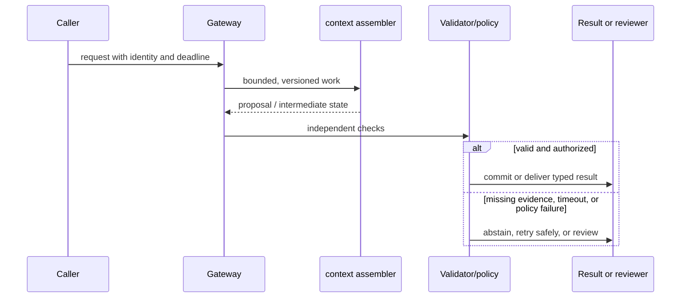

# Context engineering
Status: durable
Sources: [Anthropic effective context engineering](https://www.anthropic.com/engineering/effective-context-engineering-for-ai-agents)

## In one sentence
Context engineering assembles bounded, ordered evidence and instructions for a model call.

## Background: what existed before
Prompting treated a request as one string, often exceeding context or mixing trusted and untrusted text.

## What changed and why now
Modern systems budget context across policies, retrieved evidence, state, and user input. This month's focus is context engineering as an operable system boundary: its measurements and controls determine whether the capability survives contact with real traffic.

## Impact on current processing and architecture
Label provenance, prioritize evidence, trim stale state, and test ordering and truncation behavior. A production path should carry version, tenant, latency, cost, and failure metadata beside the model result.

## Real-world applications and constraints
Use a context builder that emits a manifest and deterministic sections before inference. Start with reversible, low-risk workloads; define SLOs, access controls, and an owner before expanding.

## Mental model
Context is an input data structure with sources, authority, and token limits—not an unlimited scratchpad. Model the concept as a state transition with explicit inputs, outputs, authority, and failure handling.

## Prerequisites: a foundational primer

Know token budgets, instruction precedence, retrieval metadata, summarization loss, redaction, and deterministic serialization. Context is a bounded working set, not a transcript dump.

## What changed this month
The January 2026 learning map places context engineering alongside low-latency inference, adoption, and scientific collaboration. The linked source is the primary technical or governance reference for the concept; this lesson labels system-design implications as inferences.

## Engineering consequence

Emit a context manifest listing block IDs, order, authority, freshness, token estimates, ACL decision, and omission reason. Assemble policy and task constraints before untrusted evidence and validate the manifest before inference.

## Topic-specific design notes
A context builder should emit named sections with authority and freshness: system policy, task, trusted state, retrieved evidence, tool results, and user content. Keep untrusted text data-delimited and never interpolate it into an instruction template. Use a token budget allocator that reserves space for the answer and critical policy before optional history. Summarization must preserve identifiers, decisions, and uncertainty; stale summaries need expiry. Log a redacted manifest containing section names, versions, and token counts so a regression can be explained without retaining sensitive text.

## Topic-specific exercise and interview prompts
Build a context assembler with a fixed 40-token budget and priority-ranked sections. Show which section is dropped when the budget is exceeded; add a test that user text cannot alter the policy section.

What is context provenance? A: Metadata showing source, authority, and freshness. Why reserve output space? A: Otherwise truncation can remove the completion or required refusal.

## Limits and failure modes

A summary can remove a critical number; stale memory can override a correction; a retrieved instruction can cross an authority boundary. Prefer omission with a reason or abstention over silent truncation, and make corrections versioned.

## Mini exercise (15–30 min)

Create policy, evidence, history, and tool-result blocks with authority and freshness. Assemble under a fixed budget and prove a low-authority block cannot reorder policy.

## Context as a bounded working set

Context engineering is the deliberate construction of the model's working set: instructions, conversation state, retrieved evidence, tool results, and output requirements. More text is not automatically more capability. A model has finite attention and a fixed budget; irrelevant or contradictory material consumes tokens and makes the answer harder to audit. Treat context as an intermediate data structure with owners, ordering, provenance, and a size limit.

Begin with a task contract. Identify what the model must decide, what evidence is authoritative, what is merely a hint, and what must never be exposed. Assemble blocks in a deterministic order, for example policy, task input, scoped evidence, and response schema. Give each block an ID and source timestamp. Conversation memory should be summarized with a version and allow the user to correct it; silently carrying an old preference is a state bug. Tool results need bounded fields and explicit “untrusted result” labels.

Compression has different semantics. A summary can preserve goals while losing exact numbers, a retrieval filter can remove irrelevant documents while preserving citations, and truncation can destroy a required constraint. Choose the operation based on the block's role. Measure how often a compressed context changes the accepted outcome, not only how many tokens it saves. A context manifest makes a failed answer reproducible: it records block IDs, lengths, ordering, policy version, and omitted candidates without storing every sensitive byte.

The assembler is a policy boundary. It applies tenant ACLs, redaction, freshness windows, and token budgets before the model call. It must not allow a retrieved document to override the system's authority hierarchy. A conflict detector can flag two policy versions, but a model should not resolve a legal conflict by preference. If required evidence cannot fit, return a bounded “needs narrower scope” state or route to a long-context path with its own review.

For an incident triage assistant, context includes alert metadata, the latest runbook section, recent changes, and a compact history. The assembler excludes unrelated incidents and redacts credentials from logs. The answer cites runbook IDs and marks suggestions as proposals. Engineers can inspect the manifest when a recommendation was based on an obsolete runbook. This turns prompt design from ad hoc string concatenation into a testable data pipeline.

## Impact on current data processing

The data path is `request → context assembler → validator/policy → outcome`. The `context manifest` is versioned and scoped to its owner; it is not treated as a durable memory or permission. Admission records the input shape and deadline, processing emits typed intermediate state, and the final result carries provenance and a reason code. This makes a change measurable at the boundary where ordered evidence blocks become an application decision.

Operationally, keep the concept-specific resource bounded. Measure the signal that matters for ordered evidence blocks alongside p95 latency, error class, cost, and downstream correction. Under overload or missing evidence, return a typed degraded state or queue for review. Retrying must preserve idempotency and correlation. Any cache, index, trace, or derived artifact inherits tenant isolation and retention rules. These are engineering inferences from the source, not guarantees supplied by it.

## Architecture and data flow

```mermaid
flowchart LR
  A[Caller / source data] --> B[Admission and identity]
  B --> C[context assembler]
  C --> D[Independent validation]
  D --> E[Scoped result or review]
  E --> F[Outcome telemetry]
  classDef source fill:#fee2e2,stroke:#dc2626,color:#450a0a
  classDef gate fill:#dbeafe,stroke:#2563eb,color:#172554
  classDef work fill:#fef3c7,stroke:#d97706,color:#451a03
  classDef result fill:#dcfce7,stroke:#16a34a,color:#14532d
  class A source
  class B,D gate
  class C work
  class E,F result
```



The source or caller remains outside the worker's trust assumptions. Admission attaches tenant, purpose, deadline, and version; the worker transforms ordered evidence blocks; validation checks invariants that generated or approximate computation cannot establish. Only the final policy transition can produce a side effect. Telemetry records identifiers and measurements without copying sensitive payloads by default.

## Sequence and failure flow



A summary can remove a critical number; stale memory can override a correction; a retrieved instruction can cross an authority boundary. Prefer omission with a reason or abstention over silent truncation, and make corrections versioned.

## Design walkthrough: operating ordered evidence blocks safely

Take one realistic request and follow it through the system. The caller supplies an identity, purpose, input, and deadline; admission validates those fields before allocating work. The context assembler receives only the fields needed for its computation and emits a proposal, measurement, or transformed state. It does not get ambient credentials, an unbounded queue, or permission to redefine the contract. The gateway stores the context manifest identifier and the versions that produced it, then invokes checks owned by code outside the probabilistic or approximate step.

An incident assistant includes the active alert, current runbook section, and recent changes while excluding unrelated logs and credentials. Its recommendation cites the manifest's source IDs and marks omitted evidence.

Now follow a difficult request. An unusually large ordered evidence blocks value may exhaust memory or context; a rare language, malformed record, stale source, or cancelled client may invalidate assumptions. Admission should reject or split before expensive work, and the reason must be observable. If a dependency times out, preserve the deadline and return an unavailable state rather than retrying forever. If work may have reached an external system, query its receipt before replay. These transitions are different from model uncertainty and should have different metrics and runbooks.

Multi-tenant operation adds a second axis. Namespaces, ACL filters, quotas, and deletion jobs apply to the context manifest as well as to the visible answer. A cache key, vector, trace, queue item, or temporary file must carry an owner or an explicit public scope. Test a request that has a valid shape but another tenant's identifier; the expected behavior is a denial, not an empty lookup that leaks timing. Test revocation between planning and execution. The worker should observe the new policy at the side-effect boundary.

Capacity planning should use production-shaped distributions. Measure short and long inputs, cold and warm workers, concurrent tenants, cancellations, and retries. Report p50 and p95 or p99 latency, memory, queue age, cost, and accepted outcome rate. For ordered evidence blocks, add a domain metric: page or token fit, cache-page pressure, batch wait, evidence recall, field validity, review agreement, or conversion. Averages hide the cases that drive support tickets. A canary is successful only when protected slices remain inside their thresholds.

Finally, make a change record. State what the source actually establishes, what this integration infers, which baseline was used, and what would trigger rollback. Pin the model or library, schema, policy, and data versions. Keep a small reproducible fixture and a separate protected case. At launch, sample outcomes and inspect corrections; after launch, add every incident to the regression set. The owner should be able to answer what the system saw, which decision it made, why it was allowed, and how to undo it without searching through raw customer payloads.

## Real-world application and trade-off analysis

The strongest use case is one in which ordered evidence blocks are expensive or difficult to manage manually and the consequence of a wrong result is bounded. Start with read-only or draft work, then add a reviewed transition. Estimate total cost, including retrieval, model work, retries, storage, reviewer time, and corrections. Latency targets should be stated separately for interactive and batch routes. A cheaper or faster implementation is not an improvement if it moves errors into a high-cost downstream queue.

More context can improve recall while increasing latency and distraction. Compression saves tokens but risks semantic loss; retrieval filtering preserves provenance but may omit a needed exception.

## Limits and failure modes specific to this concept

Watch for malformed inputs, version drift, resource exhaustion, cross-tenant state, stale artifacts, and silent degraded paths. Test the boundary conditions that are unique to ordered evidence blocks: unusually large or rare values, cancellations, duplicate requests, partial dependencies, and adversarial content. A passing happy-path demo says little about tail behavior. Define an escalation owner and rollback artifact before enabling the feature. If the source describes a capability, label it as a fact; claims about production quality, safety, or value are inferences requiring local evidence.

## Runnable low-cost example

```python
def assemble(blocks, limit):
    chosen, used = [], 0
    for block in blocks:
        if used + block["tokens"] > limit: continue
        chosen.append(block); used += block["tokens"]
    return {"blocks": [b["id"] for b in chosen], "tokens": used}

print(assemble([{"id":"policy","tokens":8},{"id":"evidence","tokens":20},{"id":"history","tokens":15}], 30))
```

The assembler is a list-and-budget demonstration. It does not measure model attention, summarize text, or provide security isolation by itself.

## Mini exercise (15–30 min)

Create blocks with authority, freshness, token estimate, and ACL fields. Assemble a 40-token context, omit stale evidence, and emit a manifest of included and omitted IDs. Add a test proving a low-authority block cannot reorder the policy block.

## Build it locally

1. Save `context_manifest.py` with four blocks and explicit authority.
2. Apply freshness and ACL filters before token budgeting.
3. Emit included and omitted IDs with reasons.
4. Add a precedence test where evidence attempts to change policy order.
5. Replay an answer after a history correction and compare manifests.

## Interview Q&A

**Q: Why is more context harmful?** A: It consumes capacity, adds distractions, and increases conflicts and latency.
**Q: What belongs in a manifest?** A: Block IDs, order, versions, sizes, policy decisions, and omission reasons.
**Q: How should memory be corrected?** A: Version summaries and expose a correction or deletion path.
**Q: What happens when evidence cannot fit?** A: Narrow the task, use an approved larger-context route, or abstain explicitly.

## Glossary

- **Working set:** The bounded information supplied for one computation.
- **Context manifest:** Metadata describing which blocks entered a model call.
- **Authority:** The precedence a block has in resolving instructions or evidence.
- **Compression:** Reducing context while attempting to preserve task-relevant information.

## References

[Anthropic effective context engineering](https://www.anthropic.com/engineering/effective-context-engineering-for-ai-agents)
- [January 2026 lesson map](README.md)

## Claim ledger

| Claim | Source | Fact or inference |
|---|---|---|
| Anthropic defines good context engineering as selecting the smallest high-signal token set that supports a desired outcome. | [Anthropic effective context engineering](https://www.anthropic.com/engineering/effective-context-engineering-for-ai-agents) | Source guidance |
| The architecture, metrics, and failure handling in this lesson are suitable engineering consequences to test locally. | [Anthropic effective context engineering](https://www.anthropic.com/engineering/effective-context-engineering-for-ai-agents) | Inference |
| The Python example illustrates a boundary and does not establish provider-scale reliability or safety. | [Anthropic effective context engineering](https://www.anthropic.com/engineering/effective-context-engineering-for-ai-agents) | Inference |
