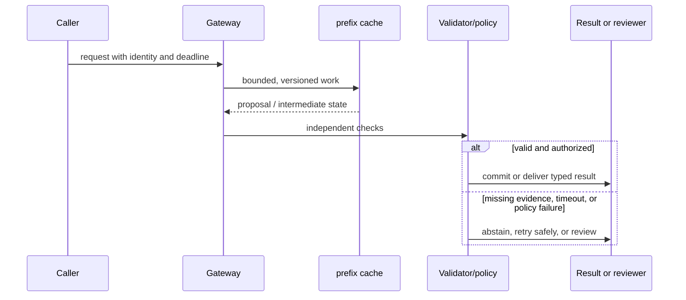

# Prompt caching
Status: watch
Sources: [OpenAI prompt caching](https://platform.openai.com/docs/guides/prompt-caching)

## In one sentence
Prompt caching reuses computation for identical stable prefixes, reducing repeated work and often latency.

## Background: what existed before
Every request recomputed shared system instructions and long documents.

## What changed and why now
Providers can cache a prefix when requests share exact tokenized content and compatible settings. This month's focus is prompt caching as an operable system boundary: its measurements and controls determine whether the capability survives contact with real traffic.

## Impact on current processing and architecture
Place stable content first, measure hit rates, and avoid putting tenant secrets in shared cache keys. A production path should carry version, tenant, latency, cost, and failure metadata beside the model result.

## Real-world applications and constraints
Cache long policies or schemas, with TTL and tenant isolation appropriate to the provider. Start with reversible, low-risk workloads; define SLOs, access controls, and an owner before expanding.

## Mental model
A cache key is derived from an exact prefix and model configuration; semantic similarity is insufficient. Model the concept as a state transition with explicit inputs, outputs, authority, and failure handling.

## Prerequisites: a foundational primer

Know canonical serialization, prefix identity, TTLs, tenant isolation, cache accounting, and invalidation. A cache hit reuses computation, not authorization or a response.

## What changed this month
The January 2026 learning map places prompt caching alongside low-latency inference, adoption, and scientific collaboration. The linked source is the primary technical or governance reference for the concept; this lesson labels system-design implications as inferences.

## Engineering consequence

Record cache namespace, canonical-prefix digest, model/version settings, hit/miss, cached and uncached tokens, TTL, and eviction reason. Keep volatile user data after stable policy/schema content and delete entries with their source.

## Topic-specific design notes
Caching requires canonicalization and an explicit privacy scope. Put stable policy, tool schemas, and long reference material before user-specific content; keep timestamps and request IDs out of the stable prefix. Measure hit rate, saved tokens, TTFT, and invalidation causes by model and tenant. A provider cache is not a durable application store: it may expire, be unavailable, or have provider-specific retention behavior. Never infer that a cache hit means semantic equivalence; exact token-prefix compatibility is the contract. Include cache policy in cost forecasts and incident runbooks.

## Topic-specific exercise and interview prompts
Create a prefix key from a stable policy and a dynamic question. Count hits for repeated policy and misses after a one-character policy edit; discuss tenant scoping.

What invalidates a prefix? A: Any token-level change or incompatible request setting. Why avoid secrets in shared prefixes? A: Cache scope and retention may not match tenant confidentiality requirements.

## Limits and failure modes

Whitespace or schema order can cause misses; a global key can leak cross-tenant content; a stale prefix can preserve old policy. Version namespaces, restrict payload logging, and continue uncached when the cache is unavailable.

## Mini exercise (15–30 min)

Generate keys for two tenants and two prompt versions, measure front-loaded timestamps versus suffix timestamps, and test TTL expiry after policy deletion.

## Stable prefixes and cache economics

Prompt caching reuses computation for an identical prompt prefix across requests. The economic intuition is straightforward: a stable system instruction, policy text, or long document need not be processed from scratch for every call. The operational detail is exact identity. Providers may define a minimum prefix length, expiration, and cache accounting; an application must treat those as release-specific behavior and measure actual hit rates. A cache key should include canonical bytes, model snapshot, tokenizer or serialization version, tenant scope, and any setting that changes compatibility.

Put stable content first and volatile content later. Tool schemas, policy blocks, and a fixed assistant role may be cacheable; timestamps, request IDs, user text, and changing retrieved passages are not. Reordering a schema or adding whitespace can invalidate a prefix even when a human sees no semantic change. Canonical serialization reduces accidental misses, but it must not merge tenants or erase a policy distinction. A cache hit is a performance event, not permission to reuse a response: the model still processes the uncached suffix and the gateway still authorizes the request.

Cache locality interacts with privacy and eviction. A global cache can save work while creating cross-tenant timing or content risks. Namespace entries, set a TTL, bound memory, and delete entries when a source policy requires it. Estimate hit rate by prefix class and report cached-input tokens, uncached tokens, latency, and cost. A low hit rate may indicate volatile content is placed too early; a high hit rate on sensitive data may indicate an unsafe scope. Never log full keys if they contain customer text; log a keyed digest and component versions.

Streaming and failure semantics matter. If a provider reports usage only at completion, a cancelled stream can leave billing and cache metrics provisional. A deployment that changes the system prompt should use a new namespace or version rather than accidentally mixing old and new prefixes. If the cache service is unavailable, the request should continue uncached within its budget or return a typed overload state; correctness must not depend on a cache hit.

An enterprise policy assistant can cache a versioned 30-page policy prefix while appending employee question and retrieved case details. When the policy changes, the prefix version changes and old answers retain their source ID. The cache reduces repeated prefill work, but eligibility checks run per request. This is the useful separation: computation may be reused, while authorization and volatile evidence remain fresh.

## Impact on current data processing

The serving path is `request → eligibility check → prefix lookup → volatile suffix → model → outcome`. A cache key binds exact prefix bytes to model route, tokenizer assumptions, policy revision, tenant scope, and expiry; the hit record is evidence about reuse, not permission or durable memory. Admission records request budget and deadline, while the live suffix supplies current identity, query, and retrieved records. Validation happens after the complete prompt is assembled, so a cache hit cannot bypass current policy.

Operationally, bound prefix size, entry count, resident memory, TTL, and lookup time. Measure hit and miss reasons, saved prefill tokens, time to first token, eviction, invalidation lag, p95 latency, cost, and correction by route and tenant. If a cache service is down, bypass it within the request budget; if the live policy or source version is uncertain, return an uncached or unavailable state. Invalidation and retries need idempotent keys, receipts, and deletion coverage. These controls are engineering inferences, not guarantees supplied by the caching source.

## Architecture and data flow

```mermaid
flowchart LR
  A[Caller / source data] --> B[Admission and identity]
  B --> C[prefix cache]
  C --> D[Independent validation]
  D --> E[Scoped result or review]
  E --> F[Outcome telemetry]
  classDef source fill:#fee2e2,stroke:#dc2626,color:#450a0a
  classDef gate fill:#dbeafe,stroke:#2563eb,color:#172554
  classDef work fill:#fef3c7,stroke:#d97706,color:#451a03
  classDef result fill:#dcfce7,stroke:#16a34a,color:#14532d
  class A source
  class B,D gate
  class C work
  class E,F result
```



The caller and volatile evidence remain outside the cache worker’s trust assumptions. Admission attaches tenant, purpose, deadline, and cache namespace; the lookup reuses only an exact eligible prefix; suffix assembly supplies current authorization and task data; validation checks invariants that reuse cannot establish. Only a separate policy transition can produce a side effect. Telemetry records key version, hit reason, and outcome identifiers without copying sensitive prompt text by default.

## Sequence and failure flow



Whitespace or schema order can cause misses; a global key can leak cross-tenant content; a stale prefix can preserve old policy. Version namespaces, restrict payload logging, and continue uncached when the cache is unavailable.

## Design walkthrough: operating cacheable prompt prefixes safely

For a benefits assistant, cache only the stable, approved policy prefix and append employee-specific questions after authorization. The key must include policy version, locale, model contract, and tenant or an explicitly public scope. A policy update creates a new namespace; it must not rely on eventual eviction to prevent an old rule from being used. Record hit and miss decisions without retaining sensitive employee text by default.

Cache eligibility is a contract. The prefix must be byte-stable after rendering, and changes in whitespace, ordering, tool definitions, policy, or source version can make reuse invalid. Define which fields are stable and which are request-specific. A cache hit should return the expected prefix identity and version so downstream traces can explain why it was used. If the cache is unavailable, bypass it without changing authorization or output validation.

Privacy and tenancy are part of cache design. A globally keyed entry can leak one customer’s policy or retrieved facts into another request. Use tenant-aware namespaces, access checks before lookup, and deletion propagation across memory, disk, replicas, and provider-managed caches. Test a revoked user and a cross-tenant key collision. The expected result is a miss or denial, not a successful hit with a plausible response.

Capacity planning should compare saved prefill work with memory, storage, invalidation, and miss overhead. Measure hit ratio by route and tenant, prefix tokens, time to first token, cache age, eviction, memory pressure, queue delay, and cost per accepted response. Long prefixes may improve reuse while increasing invalidation blast radius. A canary should verify both economics and correctness on protected policy and privacy cases.

Close a cache change with its key schema, namespace policy, stable-field definition, source and model versions, invalidation trigger, retention rule, and rollback path. Keep fixtures that change one field at a time and show whether the key should hit or miss. During rollout, sample hit payload identity and inspect corrected answers. An operational owner should be able to explain a hit, invalidate a rule, and prove that an expired prefix cannot influence a current request.

### Invalidation as a state transition

Invalidate for a reason, not only because a time-to-live elapsed. A policy correction, tenant access change, model upgrade, source deletion, prompt-template change, or discovered contamination can make a prefix unusable immediately. Record invalidation event, actor, affected namespace, source version, and completion status. A distributed cache may contain replicas or in-flight requests, so the gate should reject an old cache identity even while deletion propagates. This is safer than assuming that a background eviction task finished.

### Testing cache correctness

Build a matrix of expected hit and miss cases. Keep the stable prefix unchanged while changing the request-specific suffix; change one policy field, locale, tool definition, source document, tenant, and model version at a time. Verify that only intended changes preserve a hit. Test cold start, cache outage, replica lag, duplicate fill, concurrent invalidation, and a stale hit after revocation. Compare latency and cost only after the correctness and privacy contract passes.

### Observability

A hit ratio can look excellent while users receive stale or cross-tenant context. Log key version, namespace, hit or miss reason, entry age, source and policy versions, and invalidation state. Avoid raw prompt logging. Alert on stale-hit attempts, unexpected namespace growth, deletion lag, and a change in hit ratio by tenant. Include cache identity in the answer trace so an incident investigator can reproduce which prefix was available at decision time.

## Real-world application and trade-off analysis

Prompt caching is valuable when a request family repeats a large, byte-identical prefix and prefill work is a meaningful part of latency or cost. A coding assistant may reuse a stable system policy and repository instructions while varying the user task. Cache only the stable portion, bind it to model and policy versions, and measure whether the saved work improves accepted responses rather than merely increasing hit ratio. Include cache memory, eviction, invalidation, and privacy review in the design.

Longer stable prefixes improve reuse but increase invalidation blast radius and privacy exposure. Short prefixes are safer and fresher but save less prefill work; cache economics must include misses and eviction overhead.

## Limits and failure modes specific to this concept

Caching fails when “same prefix” is treated as “same meaning.” Test a policy edit, model-route change, tenant switch, tokenizer change, malformed prefix, cache eviction during a stream, cancellation, and deletion request. A stale hit can preserve an old permission or instruction even when the live prompt is correct. Record miss and invalidation reasons, entry age, namespace, source versions, and p95 time to first token without logging sensitive prompt text. Validate isolation and deletion independently; neither follows from a successful cache lookup.

## Runnable low-cost example

```python
import hashlib

def key(prefix, model, tenant, version):
    raw = "|".join((model, tenant, version, prefix)).encode()
    return hashlib.sha256(raw).hexdigest()[:16]

assert key("policy-v1", "m", "a", "1") != key("policy-v1", "m", "b", "1")
print(key("policy-v1", "m", "a", "1"))
```

The hash example models namespacing and version identity. It does not reproduce provider minimum-prefix rules, billing, or actual cached inference.

## Mini exercise (15–30 min)

Generate keys for stable and volatile prefixes across two tenants and two prompt versions. Measure hit rate for a workload where timestamps are at the front versus the end. Add TTL expiry and prove a deleted policy cannot be returned.

## Build it locally

1. Save `prefix_keys.py` and create stable/volatile prompt workloads.
2. Compare hit rates when timestamps are placed at the front or suffix.
3. Add tenant namespaces, TTL, and an explicit invalidation event.
4. Log digests and token classes, never full sensitive prefixes.
5. Compare cached cost and latency with an uncached baseline.

## Interview Q&A

**Q: What makes a prefix cacheable?** A: Exact compatible serialized content appears before changing request content.
**Q: Is a cache hit authorization?** A: No; current tenant, role, and source permissions are checked independently.
**Q: Why namespace keys?** A: To prevent cross-tenant reuse and make deletion scope explicit.
**Q: What should a cache fallback do?** A: Continue uncached within budget or fail clearly without changing semantics.

## Glossary

- **Prefix:** The initial serialized portion shared by multiple requests.
- **Cache hit:** A compatible stored computation was reused.
- **TTL:** Time-to-live before an entry expires.
- **Volatile suffix:** Per-request content that should not define shared prefix identity.

## References

[OpenAI prompt caching](https://platform.openai.com/docs/guides/prompt-caching)
- [January 2026 lesson map](README.md)

## Claim ledger

| Claim | Source | Fact or inference |
|---|---|---|
| OpenAI’s prompt-caching guidance describes reusing repeated prompt prefixes to reduce repeated processing. | [OpenAI prompt caching](https://platform.openai.com/docs/guides/prompt-caching) | Fact, scoped to source |
| The architecture, metrics, and failure handling in this lesson are suitable engineering consequences to test locally. | [OpenAI prompt caching](https://platform.openai.com/docs/guides/prompt-caching) | Inference |
| The Python example illustrates a boundary and does not establish provider-scale reliability or safety. | [OpenAI prompt caching](https://platform.openai.com/docs/guides/prompt-caching) | Inference |
