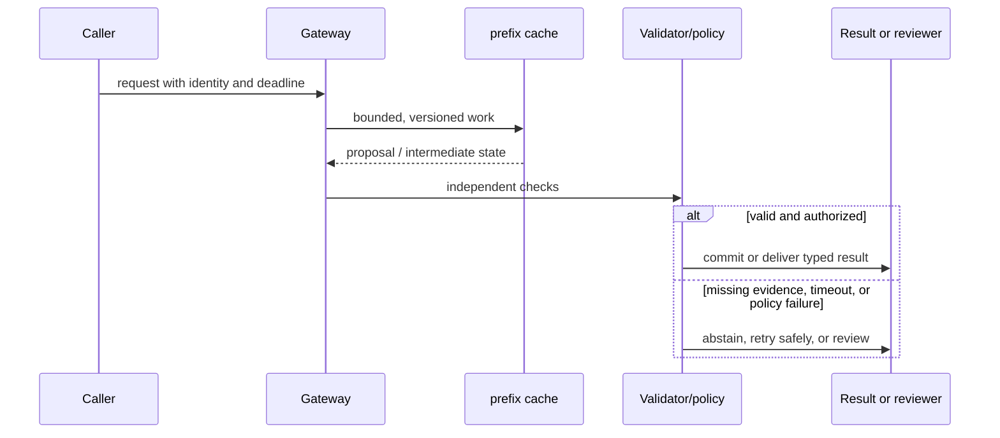

# Prompt caching
Status: watch
Sources: [OpenAI prompt caching](https://platform.openai.com/docs/guides/prompt-caching)

## In one sentence
Prompt caching reuses computation for identical stable prefixes, reducing repeated work and often latency.

## Background: what existed before
Every request recomputed shared system instructions and long documents.

## What changed and why now
Providers can cache a prefix when requests share exact tokenized content and compatible settings. This month's focus is prompt caching as an operable system boundary: its measurements and controls determine whether the capability survives contact with real traffic.

## Impact on current processing and architecture
Place stable content first, measure hit rates, and avoid putting tenant secrets in shared cache keys. A production path should carry version, tenant, latency, cost, and failure metadata beside the model result.

## Real-world applications and constraints
Cache long policies or schemas, with TTL and tenant isolation appropriate to the provider. Start with reversible, low-risk workloads; define SLOs, access controls, and an owner before expanding.

## Mental model
A cache key is derived from an exact prefix and model configuration; semantic similarity is insufficient. Model the concept as a state transition with explicit inputs, outputs, authority, and failure handling.

## Prerequisites: a foundational primer

Know canonical serialization, prefix identity, TTLs, tenant isolation, cache accounting, and invalidation. A cache hit reuses computation, not authorization or a response.

## What changed this month
The January 2026 learning map places prompt caching alongside low-latency inference, adoption, and scientific collaboration. The linked source is the primary technical or governance reference for the concept; this lesson labels system-design implications as inferences.

## Engineering consequence

Record cache namespace, canonical-prefix digest, model/version settings, hit/miss, cached and uncached tokens, TTL, and eviction reason. Keep volatile user data after stable policy/schema content and delete entries with their source.

## Topic-specific design notes
Caching requires canonicalization and an explicit privacy scope. Put stable policy, tool schemas, and long reference material before user-specific content; keep timestamps and request IDs out of the stable prefix. Measure hit rate, saved tokens, TTFT, and invalidation causes by model and tenant. A provider cache is not a durable application store: it may expire, be unavailable, or have provider-specific retention behavior. Never infer that a cache hit means semantic equivalence; exact token-prefix compatibility is the contract. Include cache policy in cost forecasts and incident runbooks.

## Topic-specific exercise and interview prompts
Create a prefix key from a stable policy and a dynamic question. Count hits for repeated policy and misses after a one-character policy edit; discuss tenant scoping.

What invalidates a prefix? A: Any token-level change or incompatible request setting. Why avoid secrets in shared prefixes? A: Cache scope and retention may not match tenant confidentiality requirements.

## Limits and failure modes

Whitespace or schema order can cause misses; a global key can leak cross-tenant content; a stale prefix can preserve old policy. Version namespaces, restrict payload logging, and continue uncached when the cache is unavailable.

## Mini exercise (15–30 min)

Generate keys for two tenants and two prompt versions, measure front-loaded timestamps versus suffix timestamps, and test TTL expiry after policy deletion.

## Stable prefixes and cache economics

Prompt caching reuses computation for an identical prompt prefix across requests. The economic intuition is straightforward: a stable system instruction, policy text, or long document need not be processed from scratch for every call. The operational detail is exact identity. Providers may define a minimum prefix length, expiration, and cache accounting; an application must treat those as release-specific behavior and measure actual hit rates. A cache key should include canonical bytes, model snapshot, tokenizer or serialization version, tenant scope, and any setting that changes compatibility.

Put stable content first and volatile content later. Tool schemas, policy blocks, and a fixed assistant role may be cacheable; timestamps, request IDs, user text, and changing retrieved passages are not. Reordering a schema or adding whitespace can invalidate a prefix even when a human sees no semantic change. Canonical serialization reduces accidental misses, but it must not merge tenants or erase a policy distinction. A cache hit is a performance event, not permission to reuse a response: the model still processes the uncached suffix and the gateway still authorizes the request.

Cache locality interacts with privacy and eviction. A global cache can save work while creating cross-tenant timing or content risks. Namespace entries, set a TTL, bound memory, and delete entries when a source policy requires it. Estimate hit rate by prefix class and report cached-input tokens, uncached tokens, latency, and cost. A low hit rate may indicate volatile content is placed too early; a high hit rate on sensitive data may indicate an unsafe scope. Never log full keys if they contain customer text; log a keyed digest and component versions.

Streaming and failure semantics matter. If a provider reports usage only at completion, a cancelled stream can leave billing and cache metrics provisional. A deployment that changes the system prompt should use a new namespace or version rather than accidentally mixing old and new prefixes. If the cache service is unavailable, the request should continue uncached within its budget or return a typed overload state; correctness must not depend on a cache hit.

An enterprise policy assistant can cache a versioned 30-page policy prefix while appending employee question and retrieved case details. When the policy changes, the prefix version changes and old answers retain their source ID. The cache reduces repeated prefill work, but eligibility checks run per request. This is the useful separation: computation may be reused, while authorization and volatile evidence remain fresh.

## Impact on current data processing

The data path is `request → prefix cache → validator/policy → outcome`. The `cache key and hit record` is versioned and scoped to its owner; it is not treated as a durable memory or permission. Admission records the input shape and deadline, processing emits typed intermediate state, and the final result carries provenance and a reason code. This makes a change measurable at the boundary where cacheable prompt prefixes become an application decision.

Operationally, keep the concept-specific resource bounded. Measure the signal that matters for cacheable prompt prefixes alongside p95 latency, error class, cost, and downstream correction. Under overload or missing evidence, return a typed degraded state or queue for review. Retrying must preserve idempotency and correlation. Any cache, index, trace, or derived artifact inherits tenant isolation and retention rules. These are engineering inferences from the source, not guarantees supplied by it.

## Architecture and data flow

```mermaid
flowchart LR
  A[Caller / source data] --> B[Admission and identity]
  B --> C[prefix cache]
  C --> D[Independent validation]
  D --> E[Scoped result or review]
  E --> F[Outcome telemetry]
  classDef source fill:#fee2e2,stroke:#dc2626,color:#450a0a
  classDef gate fill:#dbeafe,stroke:#2563eb,color:#172554
  classDef work fill:#fef3c7,stroke:#d97706,color:#451a03
  classDef result fill:#dcfce7,stroke:#16a34a,color:#14532d
  class A source
  class B,D gate
  class C work
  class E,F result
```



The source or caller remains outside the worker's trust assumptions. Admission attaches tenant, purpose, deadline, and version; the worker transforms cacheable prompt prefixes; validation checks invariants that generated or approximate computation cannot establish. Only the final policy transition can produce a side effect. Telemetry records identifiers and measurements without copying sensitive payloads by default.

## Sequence and failure flow



Whitespace or schema order can cause misses; a global key can leak cross-tenant content; a stale prefix can preserve old policy. Version namespaces, restrict payload logging, and continue uncached when the cache is unavailable.

## Design walkthrough: operating cacheable prompt prefixes safely

Take one realistic request and follow it through the system. The caller supplies an identity, purpose, input, and deadline; admission validates those fields before allocating work. The prefix cache receives only the fields needed for its computation and emits a proposal, measurement, or transformed state. It does not get ambient credentials, an unbounded queue, or permission to redefine the contract. The gateway stores the cache key and hit record identifier and the versions that produced it, then invokes checks owned by code outside the probabilistic or approximate step.

A benefits assistant caches a versioned policy prefix and appends employee-specific questions. Eligibility is checked per request, while a policy update creates a new namespace and invalidates old entries.

Now follow a difficult request. An unusually large cacheable prompt prefixes value may exhaust memory or context; a rare language, malformed record, stale source, or cancelled client may invalidate assumptions. Admission should reject or split before expensive work, and the reason must be observable. If a dependency times out, preserve the deadline and return an unavailable state rather than retrying forever. If work may have reached an external system, query its receipt before replay. These transitions are different from model uncertainty and should have different metrics and runbooks.

Multi-tenant operation adds a second axis. Namespaces, ACL filters, quotas, and deletion jobs apply to the cache key and hit record as well as to the visible answer. A cache key, vector, trace, queue item, or temporary file must carry an owner or an explicit public scope. Test a request that has a valid shape but another tenant's identifier; the expected behavior is a denial, not an empty lookup that leaks timing. Test revocation between planning and execution. The worker should observe the new policy at the side-effect boundary.

Capacity planning should use production-shaped distributions. Measure short and long inputs, cold and warm workers, concurrent tenants, cancellations, and retries. Report p50 and p95 or p99 latency, memory, queue age, cost, and accepted outcome rate. For cacheable prompt prefixes, add a domain metric: page or token fit, cache-page pressure, batch wait, evidence recall, field validity, review agreement, or conversion. Averages hide the cases that drive support tickets. A canary is successful only when protected slices remain inside their thresholds.

Finally, make a change record. State what the source actually establishes, what this integration infers, which baseline was used, and what would trigger rollback. Pin the model or library, schema, policy, and data versions. Keep a small reproducible fixture and a separate protected case. At launch, sample outcomes and inspect corrections; after launch, add every incident to the regression set. The owner should be able to answer what the system saw, which decision it made, why it was allowed, and how to undo it without searching through raw customer payloads.

## Real-world application and trade-off analysis

The strongest use case is one in which cacheable prompt prefixes are expensive or difficult to manage manually and the consequence of a wrong result is bounded. Start with read-only or draft work, then add a reviewed transition. Estimate total cost, including retrieval, model work, retries, storage, reviewer time, and corrections. Latency targets should be stated separately for interactive and batch routes. A cheaper or faster implementation is not an improvement if it moves errors into a high-cost downstream queue.

Longer stable prefixes improve reuse but increase invalidation blast radius and privacy exposure. Short prefixes are safer and fresher but save less prefill work; cache economics must include misses and eviction overhead.

## Limits and failure modes specific to this concept

Watch for malformed inputs, version drift, resource exhaustion, cross-tenant state, stale artifacts, and silent degraded paths. Test the boundary conditions that are unique to cacheable prompt prefixes: unusually large or rare values, cancellations, duplicate requests, partial dependencies, and adversarial content. A passing happy-path demo says little about tail behavior. Define an escalation owner and rollback artifact before enabling the feature. If the source describes a capability, label it as a fact; claims about production quality, safety, or value are inferences requiring local evidence.

## Runnable low-cost example

```python
import hashlib

def key(prefix, model, tenant, version):
    raw = "|".join((model, tenant, version, prefix)).encode()
    return hashlib.sha256(raw).hexdigest()[:16]

assert key("policy-v1", "m", "a", "1") != key("policy-v1", "m", "b", "1")
print(key("policy-v1", "m", "a", "1"))
```

The hash example models namespacing and version identity. It does not reproduce provider minimum-prefix rules, billing, or actual cached inference.

## Mini exercise (15–30 min)

Generate keys for stable and volatile prefixes across two tenants and two prompt versions. Measure hit rate for a workload where timestamps are at the front versus the end. Add TTL expiry and prove a deleted policy cannot be returned.

## Build it locally

1. Save `prefix_keys.py` and create stable/volatile prompt workloads.
2. Compare hit rates when timestamps are placed at the front or suffix.
3. Add tenant namespaces, TTL, and an explicit invalidation event.
4. Log digests and token classes, never full sensitive prefixes.
5. Compare cached cost and latency with an uncached baseline.

## Interview Q&A

**Q: What makes a prefix cacheable?** A: Exact compatible serialized content appears before changing request content.
**Q: Is a cache hit authorization?** A: No; current tenant, role, and source permissions are checked independently.
**Q: Why namespace keys?** A: To prevent cross-tenant reuse and make deletion scope explicit.
**Q: What should a cache fallback do?** A: Continue uncached within budget or fail clearly without changing semantics.

## Glossary

- **Prefix:** The initial serialized portion shared by multiple requests.
- **Cache hit:** A compatible stored computation was reused.
- **TTL:** Time-to-live before an entry expires.
- **Volatile suffix:** Per-request content that should not define shared prefix identity.

## References

[OpenAI prompt caching](https://platform.openai.com/docs/guides/prompt-caching)
- [January 2026 lesson map](README.md)

## Claim ledger

| Claim | Source | Fact or inference |
|---|---|---|
| OpenAI’s prompt-caching guidance describes reusing repeated prompt prefixes to reduce repeated processing. | [OpenAI prompt caching](https://platform.openai.com/docs/guides/prompt-caching) | Fact, scoped to source |
| The architecture, metrics, and failure handling in this lesson are suitable engineering consequences to test locally. | [OpenAI prompt caching](https://platform.openai.com/docs/guides/prompt-caching) | Inference |
| The Python example illustrates a boundary and does not establish provider-scale reliability or safety. | [OpenAI prompt caching](https://platform.openai.com/docs/guides/prompt-caching) | Inference |
