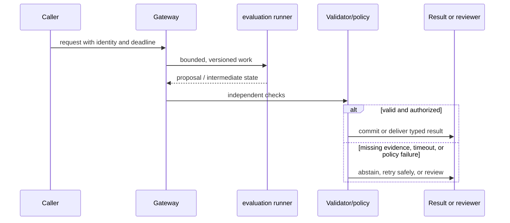

# Evaluation harnesses
Status: emerging
Sources: [OpenAI evals repository](https://github.com/openai/evals)

## In one sentence
A harness turns versioned fixtures, runners, scorers, and reports into repeatable evidence.

## Background: what existed before
Manual spot checks were hard to reproduce and easy to bias toward memorable examples.

## What changed and why now
Versioned cases and final-state assertions expose regressions across models and prompts. The January focus is the harness's role as a release instrument: its evidence must distinguish a changed model from a broken fixture, dependency, or grader.

## Impact on current processing and architecture
Pin datasets and configs, quarantine holdouts, and attach denominators to every score. A test result needs candidate, fixture, evaluator, runtime, and failure metadata before it can support a release decision.

## Real-world applications and constraints
Run invariant checks on every change and reserve expensive judge or human passes for evidence-rich slices. Begin with shadow or read-only comparisons, then name the release owner and rollback threshold.

## Mental model
A harness is an executable experiment: inputs, environment, policy, model, scorer, and artifact all have identities. Think of each case as moving from an admission contract to pass, fail, blocked, or inconclusive evidence.

## Prerequisites: a foundational primer

Know fixtures, deterministic fakes, holdouts, invariants, graders, denominators, slices, and regression testing. An eval score is evidence only when its versions and population are known.

## What changed this month
The January 2026 learning map places evaluation harnesses alongside low-latency inference, adoption, and scientific collaboration. The linked source is the primary technical or governance reference for the concept; this lesson labels system-design implications as inferences.

## Engineering consequence

Persist case ID, system/model/prompt/index versions, evaluator, seed, intermediate events, assertion result, and redacted failure evidence. Gate on final state and protected slices, not a single aggregate score.

## Topic-specific design notes
A useful harness separates fixtures, runner, scorer, and report. Fixtures include normal, boundary, adversarial, and regression cases; a holdout set protects against tuning to the metric. Scorers should assert final state—database mutation, citation presence, tool authorization—not merely string similarity. Pin model snapshot, prompt, tool versions, temperature, and dependency lockfile. Record confidence intervals or repeated seeds when sampling is stochastic. A failed run must distinguish infrastructure error, model refusal, scorer error, and policy violation, otherwise teams optimize the wrong component.

## Topic-specific exercise and interview prompts
Write two fixtures and a runner that returns `pass`, `error`, or `policy_violation`. Add a regression fixture and ensure a changed expected answer produces a visible report diff.

What makes an eval reproducible? A: Versioned inputs, environment, configuration, and scorer. Why test final state? A: Fluent text can hide an unsafe or ineffective side effect.

## Limits and failure modes

A flaky dependency can look like a model regression; a grader can reward fluent but unauthorized text; tuning on holdouts overfits. Stub dependencies, protect holdouts, and retain the smallest evidence needed to reproduce a failure.

## Mini exercise (15–30 min)

An evaluation harness should make failures actionable, not merely produce one score. Version the fixture set, model or application revision, tool stubs, evaluator, random seed, and environment. Partition by task, language, risk, and dependency state so a gain on easy cases cannot hide a regression in a protected slice. Store the input, expected invariant, observed output, final side effect, and disagreement reason under the retention policy. When a production incident is reduced to a safe fixture, add it to the regression set and record why it was representative.

Create ten cases with normal, negative, adversarial, and dependency-failure paths. Run two system versions and report per-slice deltas plus one grader disagreement.

## An evaluation harness as executable evidence

An evaluation harness is a repeatable program that turns examples into evidence about a system change. It should pin the model or adapter, prompt/schema version, retrieval index, tool stubs, and evaluator version. A benchmark score without those identifiers is not reproducible. The harness can run deterministic unit checks, model-based graders, human labels, or end-to-end scenarios, but each has a different error profile and must be named.

Start with a task contract and a protected fixture set. Cases should include ordinary requests, boundary lengths, ambiguous inputs, adversarial instructions, dependency failures, and final-state checks. For a tool-using agent, “the text looked helpful” is insufficient: assert that no unauthorized write occurred, the right resource changed, and retries did not duplicate it. Keep holdout cases out of prompt tuning and label their provenance. A failing case should show input ID, versions, intermediate events, expected invariant, and observed result without dumping secrets.

Metrics need denominators and slices. Exact match suits a normalized classification; semantic similarity may suit a paraphrase; a domain validator suits a date or financial total. Report pass rate, false acceptance, false rejection, latency, cost, and evaluator disagreement. A model grader can be useful for explanation but should not be the only gate for security or arithmetic. When a release improves the mean while harming a small protected slice, stop and investigate rather than averaging away the regression.

Harness architecture separates fixture loading, system execution, assertions, and result storage. External APIs are replaced by deterministic fakes that exercise success, timeout, malformed, and revoked-permission paths. Randomness is seeded where possible; otherwise record the seed and repeat count. A flaky test is a reliability signal, not an invitation to raise the threshold. Store artifacts with retention and access rules because prompts and outputs may be sensitive.

For a customer-support agent, the harness checks citation presence, ticket ownership, escalation on uncertainty, and no email send without confirmation. A new prompt is first run in shadow mode against the baseline, then canaried on live traffic with sampled review. The release record links changed files to score deltas and known failures. This makes evaluation an engineering control rather than a one-time demo rubric.

## Impact on current data processing

The test path is `fixture manifest → isolated system run → oracle and judge → result matrix → release decision`. A fixture includes input, permitted tools, expected invariants, protected slices, and source or policy versions; the result matrix records pass, fail, blocked, and inconclusive states separately. Test artifacts are scoped and versioned, but they are not application memory or permission. A release decision can then explain which contract changed and which evidence justified rollout.

Operationally, bound fixture count, parallel workers, external-call budgets, judge tokens, and artifact retention. Report pass rate by task and risk slice alongside flake rate, runtime, cost, evaluator disagreement, and post-release correction. If a dependency or oracle is unavailable, mark the case inconclusive rather than converting infrastructure failure into model failure. Retries preserve fixture digest and run ID, while logs and outputs inherit tenant access and deletion rules. These controls are engineering inferences, not guarantees supplied by an evaluation source.

## Architecture and data flow

```mermaid
flowchart LR
  A[Caller / source data] --> B[Admission and identity]
  B --> C[evaluation runner]
  C --> D[Independent validation]
  D --> E[Scoped result or review]
  E --> F[Outcome telemetry]
  classDef source fill:#fee2e2,stroke:#dc2626,color:#450a0a
  classDef gate fill:#dbeafe,stroke:#2563eb,color:#172554
  classDef work fill:#fef3c7,stroke:#d97706,color:#451a03
  classDef result fill:#dcfce7,stroke:#16a34a,color:#14532d
  class A source
  class B,D gate
  class C work
  class E,F result
```



The candidate system and evaluator remain separate trust domains. The harness attaches fixture digest, candidate version, tool permissions, deadline, and policy version; the candidate produces an output or tool proposal; deterministic assertions and independent reviewers check invariants that generated text cannot establish. The harness must not let the candidate edit its own expected answer or grading rule. Telemetry records run, evaluator, and artifact IDs without copying sensitive payloads by default.

## Sequence and failure flow



A flaky dependency can look like a model regression; a grader can reward fluent but unauthorized text; tuning on holdouts overfits. Stub dependencies, protect holdouts, and retain the smallest evidence needed to reproduce a failure.

## Design walkthrough: operating versioned test cases safely

For a support-agent harness, define a case with user role, ticket state, policy version, expected citation, permitted escalation, and forbidden side effect. The runner executes the baseline and candidate against the same stubbed tools. It checks citation identity and ticket ownership deterministically, then routes tone or completeness to a calibrated reviewer. The result records whether a prompt change improved the task without granting permission to send an email or alter the account.

Design cases around decisions rather than outputs. A response can use different words and still satisfy the contract, while a response with perfect wording can violate an authorization rule. Store expected invariants, allowed variation, and the evidence needed to judge each case. If the fixture includes a stale source, the expected behavior may be abstention; if a dependency is down, it may be an explicit unavailable state rather than a fabricated answer.

Protect the harness from the candidate. The candidate must not read answer keys, rewrite labels, change the evaluator, or retain access to another tenant’s fixtures. Give tool stubs controlled responses for success, malformed data, timeout, rate limit, and partial effect. A harness should exercise recovery and error paths, not only the normal answer path.

Report results by fixture, task, risk, language, dependency state, and policy. Include denominator, evaluator version, runtime, tokens, cost, retries, and human disagreement. A canary can be blocked by one critical safety regression even when the average score improves. Keep the exact baseline and candidate manifests so a reviewer can reproduce the comparison.

Close each evaluation change with a decision record: question, fixture digest, baseline, candidate, evaluator, failures, protected-slice result, reviewer, rollout scope, and rollback trigger. Turn every confirmed production incident into a redacted regression case. Retain the failure reason and original expected invariant; changing the expected result merely to make the suite green destroys its value.

### Harness maintenance

Review the harness whenever the application contract changes. A new tool schema, retrieval index, policy, model route, or output validator can invalidate old fixtures or require new failure cases. Keep fixture owners and review dates, and mark cases active, deprecated, or retired with a reason. Run a fast smoke tier on every change and a full protected suite before release. If a dependency is unavailable, report that the evaluation is inconclusive rather than silently treating unavailable output as a model failure.

### Interpreting disagreement

Disagreement between a rule, model judge, and human is a useful signal. Preserve each result and ask which question each evaluator was answering. A deterministic schema check may be right about shape while a clinician or domain reviewer identifies an unsafe meaning. Adjudicate only the cases that need a final decision, and add the disagreement pattern to calibration or the fixture set. Never hide evaluator disagreement by averaging incompatible labels.

### Release and incident loop

After deployment, compare live error categories with the offline suite. If production produces a new stale-source, permission, latency, or final-state failure, capture a safe reproduction and add it to the next regression run. When rolling back, run the suite against the rollback artifact too; a prior release may avoid the new bug while retaining an older limitation. This connects evaluation to operations and keeps the suite grounded in actual user consequences.

## Real-world application and trade-off analysis

Harnesses pay off when a release has many behavioral contracts and manual comparison would miss regressions. Begin with shadow runs, then add a reviewed gate. Budget fixture execution, judge calls, artifact storage, and triage time; report separate latency for smoke and full suites. Faster scoring is not progress if it drops protected cases or hides evaluator disagreement.

More cases improve coverage but raise runtime and fixture-maintenance cost. Exact assertions are trustworthy for invariants but brittle for wording; model graders cover nuance but require calibration and disagreement review.

## Limits and failure modes specific to this concept

Watch for fixture drift, denominator changes, flaky dependencies, grader leakage, and answer-key exposure. Exercise empty, duplicated, adversarial, timeout, and partial-effect cases; a green smoke tier cannot establish holdout performance. Assign a test owner and rollback artifact before release. Source descriptions are facts about the cited harness; claims about production quality or safety remain local inferences.

## Runnable low-cost example

```python
def evaluate(cases, system):
    rows = []
    for case in cases:
        got = system(case["input"])
        rows.append({"id": case["id"], "pass": got == case["expected"], "got": got})
    return rows

rows = evaluate([{"id":"ok", "input":"ping", "expected":"pong"}], lambda x: "pong")
assert rows[0]["pass"]
print(rows)
```

The runner compares expected values in a tiny deterministic function. It does not establish statistical significance, grader validity, or production traffic representativeness.

## Mini exercise (15–30 min)

Create ten cases for a small workflow, including two negative and one dependency-failure case. Add a validator for a final side effect, run two system versions, and report per-slice deltas plus one manually inspected disagreement.

## Build it locally

1. Save `eval_runner.py` with ten versioned cases and a fake dependency.
2. Add final-state assertions for ownership and side effects.
3. Run baseline and candidate systems with identical fixtures.
4. Protect one holdout slice and report denominators and grader disagreement.
5. Turn every discovered incident into a regression fixture.

## Interview Q&A

**Q: What makes an eval reproducible?** A: Pinned inputs, system versions, dependencies, evaluator, and recorded configuration.
**Q: Why include final-state checks?** A: A fluent response can hide an unauthorized or missing side effect.
**Q: Are model graders authoritative?** A: No; they are one noisy measurement and need calibration or domain checks.
**Q: What is a protected slice?** A: A high-risk or representative subset whose regression cannot be averaged away.

## Glossary

- **Fixture:** A versioned input with expected behavior or invariants.
- **Holdout:** A protected case not used for tuning.
- **Regression:** A previously acceptable behavior becoming unacceptable.
- **Denominator:** The population against which a reported rate is calculated.

## References

[OpenAI evals repository](https://github.com/openai/evals)
- [January 2026 lesson map](README.md)

## Claim ledger

| Claim | Source | Fact or inference |
|---|---|---|
| OpenAI Evals is a framework for evaluating LLMs and LLM systems and an open-source registry of benchmarks. | [OpenAI evals repository](https://github.com/openai/evals) | Fact, scoped to source |
| The architecture, metrics, and failure handling in this lesson are suitable engineering consequences to test locally. | [OpenAI evals repository](https://github.com/openai/evals) | Inference |
| The Python example illustrates a boundary and does not establish provider-scale reliability or safety. | [OpenAI evals repository](https://github.com/openai/evals) | Inference |
