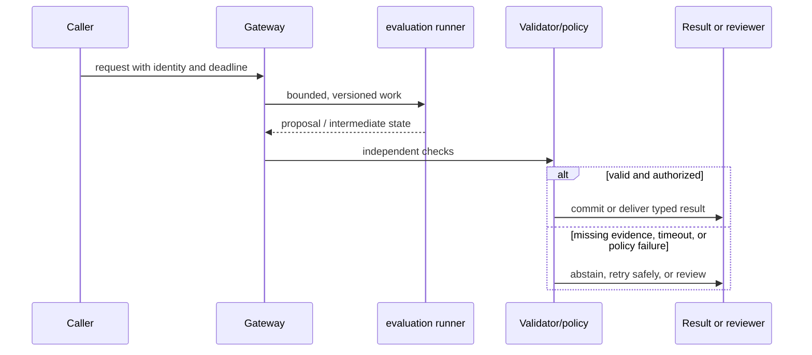

# Evaluation harnesses
Status: emerging
Sources: [OpenAI evals repository](https://github.com/openai/evals)

## In one sentence
A harness turns versioned fixtures, runners, scorers, and reports into repeatable evidence.

## Background: what existed before
Manual spot checks were hard to reproduce and easy to bias toward memorable examples.

## What changed and why now
Versioned test cases and final-state assertions expose regressions across models and prompts. This month's focus is evaluation harnesses as an operable system boundary: its measurements and controls determine whether the capability survives contact with real traffic.

## Impact on current processing and architecture
Pin datasets and configs, separate development from holdout tests, and report uncertainty and cost. A production path should carry version, tenant, latency, cost, and failure metadata beside the model result.

## Real-world applications and constraints
Run cheap deterministic checks on every change, then schedule larger representative suites. Start with reversible, low-risk workloads; define SLOs, access controls, and an owner before expanding.

## Mental model
A harness is an executable experiment: inputs, environment, policy, model, scorer, and artifact all have identities. Model the concept as a state transition with explicit inputs, outputs, authority, and failure handling.

## Prerequisites: a foundational primer

Know fixtures, deterministic fakes, holdouts, invariants, graders, denominators, slices, and regression testing. An eval score is evidence only when its versions and population are known.

## What changed this month
The January 2026 learning map places evaluation harnesses alongside low-latency inference, adoption, and scientific collaboration. The linked source is the primary technical or governance reference for the concept; this lesson labels system-design implications as inferences.

## Engineering consequence

Persist case ID, system/model/prompt/index versions, evaluator, seed, intermediate events, assertion result, and redacted failure evidence. Gate on final state and protected slices, not a single aggregate score.

## Topic-specific design notes
A useful harness separates fixtures, runner, scorer, and report. Fixtures include normal, boundary, adversarial, and regression cases; a holdout set protects against tuning to the metric. Scorers should assert final state—database mutation, citation presence, tool authorization—not merely string similarity. Pin model snapshot, prompt, tool versions, temperature, and dependency lockfile. Record confidence intervals or repeated seeds when sampling is stochastic. A failed run must distinguish infrastructure error, model refusal, scorer error, and policy violation, otherwise teams optimize the wrong component.

## Topic-specific exercise and interview prompts
Write two fixtures and a runner that returns `pass`, `error`, or `policy_violation`. Add a regression fixture and ensure a changed expected answer produces a visible report diff.

What makes an eval reproducible? A: Versioned inputs, environment, configuration, and scorer. Why test final state? A: Fluent text can hide an unsafe or ineffective side effect.

## Limits and failure modes

A flaky dependency can look like a model regression; a grader can reward fluent but unauthorized text; tuning on holdouts overfits. Stub dependencies, protect holdouts, and retain the smallest evidence needed to reproduce a failure.

## Mini exercise (15–30 min)

Create ten cases with normal, negative, adversarial, and dependency-failure paths. Run two system versions and report per-slice deltas plus one grader disagreement.

## An evaluation harness as executable evidence

An evaluation harness is a repeatable program that turns examples into evidence about a system change. It should pin the model or adapter, prompt/schema version, retrieval index, tool stubs, and evaluator version. A benchmark score without those identifiers is not reproducible. The harness can run deterministic unit checks, model-based graders, human labels, or end-to-end scenarios, but each has a different error profile and must be named.

Start with a task contract and a protected fixture set. Cases should include ordinary requests, boundary lengths, ambiguous inputs, adversarial instructions, dependency failures, and final-state checks. For a tool-using agent, “the text looked helpful” is insufficient: assert that no unauthorized write occurred, the right resource changed, and retries did not duplicate it. Keep holdout cases out of prompt tuning and label their provenance. A failing case should show input ID, versions, intermediate events, expected invariant, and observed result without dumping secrets.

Metrics need denominators and slices. Exact match suits a normalized classification; semantic similarity may suit a paraphrase; a domain validator suits a date or financial total. Report pass rate, false acceptance, false rejection, latency, cost, and evaluator disagreement. A model grader can be useful for explanation but should not be the only gate for security or arithmetic. When a release improves the mean while harming a small protected slice, stop and investigate rather than averaging away the regression.

Harness architecture separates fixture loading, system execution, assertions, and result storage. External APIs are replaced by deterministic fakes that exercise success, timeout, malformed, and revoked-permission paths. Randomness is seeded where possible; otherwise record the seed and repeat count. A flaky test is a reliability signal, not an invitation to raise the threshold. Store artifacts with retention and access rules because prompts and outputs may be sensitive.

For a customer-support agent, the harness checks citation presence, ticket ownership, escalation on uncertainty, and no email send without confirmation. A new prompt is first run in shadow mode against the baseline, then canaried on live traffic with sampled review. The release record links changed files to score deltas and known failures. This makes evaluation an engineering control rather than a one-time demo rubric.

## Impact on current data processing

The data path is `request → evaluation runner → validator/policy → outcome`. The `result matrix and regression record` is versioned and scoped to its owner; it is not treated as a durable memory or permission. Admission records the input shape and deadline, processing emits typed intermediate state, and the final result carries provenance and a reason code. This makes a change measurable at the boundary where versioned test cases become an application decision.

Operationally, keep the concept-specific resource bounded. Measure the signal that matters for versioned test cases alongside p95 latency, error class, cost, and downstream correction. Under overload or missing evidence, return a typed degraded state or queue for review. Retrying must preserve idempotency and correlation. Any cache, index, trace, or derived artifact inherits tenant isolation and retention rules. These are engineering inferences from the source, not guarantees supplied by it.

## Architecture and data flow

```mermaid
flowchart LR
  A[Caller / source data] --> B[Admission and identity]
  B --> C[evaluation runner]
  C --> D[Independent validation]
  D --> E[Scoped result or review]
  E --> F[Outcome telemetry]
  classDef source fill:#fee2e2,stroke:#dc2626,color:#450a0a
  classDef gate fill:#dbeafe,stroke:#2563eb,color:#172554
  classDef work fill:#fef3c7,stroke:#d97706,color:#451a03
  classDef result fill:#dcfce7,stroke:#16a34a,color:#14532d
  class A source
  class B,D gate
  class C work
  class E,F result
```



The source or caller remains outside the worker's trust assumptions. Admission attaches tenant, purpose, deadline, and version; the worker transforms versioned test cases; validation checks invariants that generated or approximate computation cannot establish. Only the final policy transition can produce a side effect. Telemetry records identifiers and measurements without copying sensitive payloads by default.

## Sequence and failure flow



A flaky dependency can look like a model regression; a grader can reward fluent but unauthorized text; tuning on holdouts overfits. Stub dependencies, protect holdouts, and retain the smallest evidence needed to reproduce a failure.

## Design walkthrough: operating versioned test cases safely

Take one realistic request and follow it through the system. The caller supplies an identity, purpose, input, and deadline; admission validates those fields before allocating work. The evaluation runner receives only the fields needed for its computation and emits a proposal, measurement, or transformed state. It does not get ambient credentials, an unbounded queue, or permission to redefine the contract. The gateway stores the result matrix and regression record identifier and the versions that produced it, then invokes checks owned by code outside the probabilistic or approximate step.

A support-agent harness checks citation IDs, ticket ownership, escalation, and no email send without confirmation. A prompt change first runs against the baseline before a canary.

Now follow a difficult request. An unusually large versioned test cases value may exhaust memory or context; a rare language, malformed record, stale source, or cancelled client may invalidate assumptions. Admission should reject or split before expensive work, and the reason must be observable. If a dependency times out, preserve the deadline and return an unavailable state rather than retrying forever. If work may have reached an external system, query its receipt before replay. These transitions are different from model uncertainty and should have different metrics and runbooks.

Multi-tenant operation adds a second axis. Namespaces, ACL filters, quotas, and deletion jobs apply to the result matrix and regression record as well as to the visible answer. A cache key, vector, trace, queue item, or temporary file must carry an owner or an explicit public scope. Test a request that has a valid shape but another tenant's identifier; the expected behavior is a denial, not an empty lookup that leaks timing. Test revocation between planning and execution. The worker should observe the new policy at the side-effect boundary.

Capacity planning should use production-shaped distributions. Measure short and long inputs, cold and warm workers, concurrent tenants, cancellations, and retries. Report p50 and p95 or p99 latency, memory, queue age, cost, and accepted outcome rate. For versioned test cases, add a domain metric: page or token fit, cache-page pressure, batch wait, evidence recall, field validity, review agreement, or conversion. Averages hide the cases that drive support tickets. A canary is successful only when protected slices remain inside their thresholds.

Finally, make a change record. State what the source actually establishes, what this integration infers, which baseline was used, and what would trigger rollback. Pin the model or library, schema, policy, and data versions. Keep a small reproducible fixture and a separate protected case. At launch, sample outcomes and inspect corrections; after launch, add every incident to the regression set. The owner should be able to answer what the system saw, which decision it made, why it was allowed, and how to undo it without searching through raw customer payloads.

## Real-world application and trade-off analysis

The strongest use case is one in which versioned test cases are expensive or difficult to manage manually and the consequence of a wrong result is bounded. Start with read-only or draft work, then add a reviewed transition. Estimate total cost, including retrieval, model work, retries, storage, reviewer time, and corrections. Latency targets should be stated separately for interactive and batch routes. A cheaper or faster implementation is not an improvement if it moves errors into a high-cost downstream queue.

More cases improve coverage but raise runtime and fixture-maintenance cost. Exact assertions are trustworthy for invariants but brittle for wording; model graders cover nuance but require calibration and disagreement review.

## Limits and failure modes specific to this concept

Watch for malformed inputs, version drift, resource exhaustion, cross-tenant state, stale artifacts, and silent degraded paths. Test the boundary conditions that are unique to versioned test cases: unusually large or rare values, cancellations, duplicate requests, partial dependencies, and adversarial content. A passing happy-path demo says little about tail behavior. Define an escalation owner and rollback artifact before enabling the feature. If the source describes a capability, label it as a fact; claims about production quality, safety, or value are inferences requiring local evidence.

## Runnable low-cost example

```python
def evaluate(cases, system):
    rows = []
    for case in cases:
        got = system(case["input"])
        rows.append({"id": case["id"], "pass": got == case["expected"], "got": got})
    return rows

rows = evaluate([{"id":"ok", "input":"ping", "expected":"pong"}], lambda x: "pong")
assert rows[0]["pass"]
print(rows)
```

The runner compares expected values in a tiny deterministic function. It does not establish statistical significance, grader validity, or production traffic representativeness.

## Mini exercise (15–30 min)

Create ten cases for a small workflow, including two negative and one dependency-failure case. Add a validator for a final side effect, run two system versions, and report per-slice deltas plus one manually inspected disagreement.

## Build it locally

1. Save `eval_runner.py` with ten versioned cases and a fake dependency.
2. Add final-state assertions for ownership and side effects.
3. Run baseline and candidate systems with identical fixtures.
4. Protect one holdout slice and report denominators and grader disagreement.
5. Turn every discovered incident into a regression fixture.

## Interview Q&A

**Q: What makes an eval reproducible?** A: Pinned inputs, system versions, dependencies, evaluator, and recorded configuration.
**Q: Why include final-state checks?** A: A fluent response can hide an unauthorized or missing side effect.
**Q: Are model graders authoritative?** A: No; they are one noisy measurement and need calibration or domain checks.
**Q: What is a protected slice?** A: A high-risk or representative subset whose regression cannot be averaged away.

## Glossary

- **Fixture:** A versioned input with expected behavior or invariants.
- **Holdout:** A protected case not used for tuning.
- **Regression:** A previously acceptable behavior becoming unacceptable.
- **Denominator:** The population against which a reported rate is calculated.

## References

[OpenAI evals repository](https://github.com/openai/evals)
- [January 2026 lesson map](README.md)

## Claim ledger

| Claim | Source | Fact or inference |
|---|---|---|
| OpenAI Evals is a framework for evaluating LLMs and LLM systems and an open-source registry of benchmarks. | [OpenAI evals repository](https://github.com/openai/evals) | Fact, scoped to source |
| The architecture, metrics, and failure handling in this lesson are suitable engineering consequences to test locally. | [OpenAI evals repository](https://github.com/openai/evals) | Inference |
| The Python example illustrates a boundary and does not establish provider-scale reliability or safety. | [OpenAI evals repository](https://github.com/openai/evals) | Inference |
