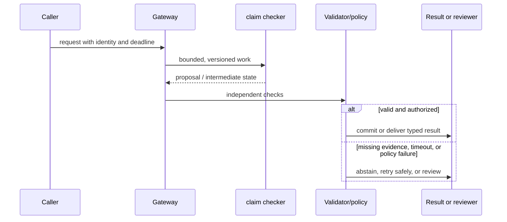

# Hallucination handling
Status: durable
Sources: [NIST AI RMF](https://www.nist.gov/itl/ai-risk-management-framework)

## In one sentence
Hallucination handling combines citation, validation, abstention, and uncertainty rather than one magic prompt.

## Background: what existed before
Systems often accepted fluent text as fact without checking claims or provenance.

## What changed and why now
Grounding and post-generation checks make unsupported statements observable and rejectable. This month's focus is hallucination handling as an operable system boundary: its measurements and controls determine whether the capability survives contact with real traffic.

## Impact on current processing and architecture
Require evidence IDs, validate structured claims, calibrate abstention, and expose uncertainty to users. A production path should carry version, tenant, latency, cost, and failure metadata beside the model result.

## Real-world applications and constraints
Use retrieval citations and deterministic validators in high-value workflows, with escalation for conflicts. Start with reversible, low-risk workloads; define SLOs, access controls, and an owner before expanding.

## Mental model
A hallucination is an unsupported or false output; confidence-like wording is not calibrated probability. Model the concept as a state transition with explicit inputs, outputs, authority, and failure handling.

## Prerequisites: a foundational primer

Know claims, citation IDs, entailment, abstention, numeric validation, source freshness, and confidence calibration. A citation format is not proof of support.

## What changed this month
The January 2026 learning map places hallucination handling alongside low-latency inference, adoption, and scientific collaboration. The linked source is the primary technical or governance reference for the concept; this lesson labels system-design implications as inferences.

## Engineering consequence

Represent each material claim with support status, source IDs, checker version, and abstention reason. Use deterministic checks for dates, arithmetic, identifiers, and citation existence before a fluent answer reaches the user.

## Topic-specific design notes
Use a claim-level pipeline: split an answer into checkable claims, map each to retrieved evidence, run deterministic validators, and choose answer, qualified answer, or abstention. Citations should identify the supporting passage, not merely list a source. For numerical outputs, recompute from structured fields; for code, run tests in a sandbox. Calibration requires a labeled set comparing confidence or abstention with correctness. If sources conflict or are missing, expose that state. A forced citation requirement can encourage fabricated references, so validate that cited IDs exist and entail the claim.

## Topic-specific exercise and interview prompts
Take two claims and an evidence dictionary. Accept only claims whose cited ID exists; make one claim abstain and print the reason. Add a numeric check that recomputes a total.

Can citations still hallucinate? A: Yes, unless IDs and entailment are checked. What is abstention? A: An explicit decision not to assert an unsupported answer.

## Limits and failure modes

A valid citation can support only part of a sentence; stale evidence can make a true old claim wrong now; a calculator can use the wrong unit. Split claims, preserve source dates, and escalate unresolved conflicts.

## Mini exercise (15–30 min)

Label ten claims as supported, conflicting, or unsupported. Implement citation-existence and numeric checks, then measure false reassurance versus false abstention.

## Uncertainty controls around generated claims

Hallucination handling starts by defining the claim contract. A generated sentence may be a fact to verify, a calculation to recompute, a recommendation, or a creative completion. These categories need different controls. NIST's AI RMF frames risk management as a lifecycle responsibility; it does not turn a detector into a proof of truth. The application should make uncertainty and evidence visible rather than relying on confident style as a quality signal.

For evidence-seeking answers, retrieve authorized sources, assign stable citation IDs, and require each material claim to point to one or more IDs. A checker can verify that the cited source exists and that a quoted span appears, while a stronger entailment review asks whether the span actually supports the claim. Dates and numeric values should be parsed and compared against authoritative systems. If no source supports a claim, return “not established” or ask for a narrower question. Do not fabricate a citation to satisfy a format rule.

Abstention is a product state with its own UX and metrics. Distinguish no evidence, conflicting evidence, unavailable dependency, and policy refusal. The user needs a next action: provide a document, ask an owner, or retry later. Measure unsupported-claim rate, citation coverage, correction rate, abstention precision, and cost. Over-abstaining can make a system unusable; under-abstaining can create harm. Evaluate both with a labeled set and domain reviewers.

Failure can enter through the corpus, retrieval, reasoning, or post-processing. A stale policy is not fixed by a better prompt. A correct citation can be attached to an overbroad conclusion. A calculator tool can return a wrong unit. The pipeline should preserve raw sources, intermediate claims, validation errors, and final status for review. Independent validators must not be generated by the same untrusted text they are checking when a deterministic rule is available.

In a clinical literature assistant, the model summarizes studies but does not diagnose. Each statement includes publication identifier and study date; conflicting results are shown as conflict, not merged into a single certainty. A clinician can correct the interpretation, and the correction becomes a protected evaluation case. The system's value is faster evidence navigation, while medical judgment remains outside the generated claim.

## Impact on current data processing

The data path is `request → claim checker → validator/policy → outcome`. The `answer with support status` is versioned and scoped to its owner; it is not treated as a durable memory or permission. Admission records the input shape and deadline, processing emits typed intermediate state, and the final result carries provenance and a reason code. This makes a change measurable at the boundary where claims and evidence links become an application decision.

Operationally, keep the concept-specific resource bounded. Measure the signal that matters for claims and evidence links alongside p95 latency, error class, cost, and downstream correction. Under overload or missing evidence, return a typed degraded state or queue for review. Retrying must preserve idempotency and correlation. Any cache, index, trace, or derived artifact inherits tenant isolation and retention rules. These are engineering inferences from the source, not guarantees supplied by it.

## Architecture and data flow

```mermaid
flowchart LR
  A[Caller / source data] --> B[Admission and identity]
  B --> C[claim checker]
  C --> D[Independent validation]
  D --> E[Scoped result or review]
  E --> F[Outcome telemetry]
  classDef source fill:#fee2e2,stroke:#dc2626,color:#450a0a
  classDef gate fill:#dbeafe,stroke:#2563eb,color:#172554
  classDef work fill:#fef3c7,stroke:#d97706,color:#451a03
  classDef result fill:#dcfce7,stroke:#16a34a,color:#14532d
  class A source
  class B,D gate
  class C work
  class E,F result
```



The source or caller remains outside the worker's trust assumptions. Admission attaches tenant, purpose, deadline, and version; the worker transforms claims and evidence links; validation checks invariants that generated or approximate computation cannot establish. Only the final policy transition can produce a side effect. Telemetry records identifiers and measurements without copying sensitive payloads by default.

## Sequence and failure flow



A valid citation can support only part of a sentence; stale evidence can make a true old claim wrong now; a calculator can use the wrong unit. Split claims, preserve source dates, and escalate unresolved conflicts.

## Design walkthrough: operating claims and evidence links safely

Take one realistic request and follow it through the system. The caller supplies an identity, purpose, input, and deadline; admission validates those fields before allocating work. The claim checker receives only the fields needed for its computation and emits a proposal, measurement, or transformed state. It does not get ambient credentials, an unbounded queue, or permission to redefine the contract. The gateway stores the answer with support status identifier and the versions that produced it, then invokes checks owned by code outside the probabilistic or approximate step.

A literature assistant cites publication IDs and dates, displays conflicting findings separately, and never turns a study summary into a clinical diagnosis. A clinician correction becomes a protected test case.

Now follow a difficult request. An unusually large claims and evidence links value may exhaust memory or context; a rare language, malformed record, stale source, or cancelled client may invalidate assumptions. Admission should reject or split before expensive work, and the reason must be observable. If a dependency times out, preserve the deadline and return an unavailable state rather than retrying forever. If work may have reached an external system, query its receipt before replay. These transitions are different from model uncertainty and should have different metrics and runbooks.

Multi-tenant operation adds a second axis. Namespaces, ACL filters, quotas, and deletion jobs apply to the answer with support status as well as to the visible answer. A cache key, vector, trace, queue item, or temporary file must carry an owner or an explicit public scope. Test a request that has a valid shape but another tenant's identifier; the expected behavior is a denial, not an empty lookup that leaks timing. Test revocation between planning and execution. The worker should observe the new policy at the side-effect boundary.

Capacity planning should use production-shaped distributions. Measure short and long inputs, cold and warm workers, concurrent tenants, cancellations, and retries. Report p50 and p95 or p99 latency, memory, queue age, cost, and accepted outcome rate. For claims and evidence links, add a domain metric: page or token fit, cache-page pressure, batch wait, evidence recall, field validity, review agreement, or conversion. Averages hide the cases that drive support tickets. A canary is successful only when protected slices remain inside their thresholds.

Finally, make a change record. State what the source actually establishes, what this integration infers, which baseline was used, and what would trigger rollback. Pin the model or library, schema, policy, and data versions. Keep a small reproducible fixture and a separate protected case. At launch, sample outcomes and inspect corrections; after launch, add every incident to the regression set. The owner should be able to answer what the system saw, which decision it made, why it was allowed, and how to undo it without searching through raw customer payloads.

## Real-world application and trade-off analysis

The strongest use case is one in which claims and evidence links are expensive or difficult to manage manually and the consequence of a wrong result is bounded. Start with read-only or draft work, then add a reviewed transition. Estimate total cost, including retrieval, model work, retries, storage, reviewer time, and corrections. Latency targets should be stated separately for interactive and batch routes. A cheaper or faster implementation is not an improvement if it moves errors into a high-cost downstream queue.

Aggressive abstention lowers unsupported claims but can hide useful partial evidence; permissive answering improves coverage while increasing correction and harm. Tune thresholds by consequence and domain.

## Limits and failure modes specific to this concept

Watch for malformed inputs, version drift, resource exhaustion, cross-tenant state, stale artifacts, and silent degraded paths. Test the boundary conditions that are unique to claims and evidence links: unusually large or rare values, cancellations, duplicate requests, partial dependencies, and adversarial content. A passing happy-path demo says little about tail behavior. Define an escalation owner and rollback artifact before enabling the feature. If the source describes a capability, label it as a fact; claims about production quality, safety, or value are inferences requiring local evidence.

## Runnable low-cost example

```python
def support_claim(claim, citations):
    cited = [c for c in citations if c["id"] in claim.get("sources", [])]
    if not cited: return {"status":"unsupported", "claim":claim["text"]}
    return {"status":"needs_review", "sources":[c["id"] for c in cited]}

print(support_claim({"text":"A", "sources":["paper-1"]}, [{"id":"paper-1"}]))
```

The support function checks citation presence only. It does not establish entailment, source quality, calibrated confidence, or medical correctness.

## Mini exercise (15–30 min)

Label ten claims as supported, conflicting, or unsupported. Implement citation-existence and numeric-range checks, then add an abstention response for unsupported claims. Compare false reassurance with false abstention using a small confusion matrix.

## Build it locally

1. Save `claim_checker.py` with supported, conflicting, and unsupported fixtures.
2. Parse dates and numbers into deterministic validation rules.
3. Return distinct no-evidence, conflict, outage, and refusal states.
4. Compare a permissive and conservative threshold on the same labels.
5. Have a domain reviewer inspect disagreements and add one holdout case.

## Interview Q&A

**Q: What is a hallucination control?** A: A process that detects, supports, constrains, or escalates an unverified generated claim.
**Q: Does citation presence prove truth?** A: No; the citation must exist and entail the claim, and the source can itself be wrong or stale.
**Q: Why distinguish abstention reasons?** A: The remedy differs for missing evidence, conflict, outage, and policy refusal.
**Q: What should be deterministic?** A: Arithmetic, identifier, authorization, and citation-existence checks where possible.

## Glossary

- **Claim:** A proposition in generated output that can be assessed.
- **Entailment:** Whether evidence supports the meaning of a claim.
- **Abstention:** An explicit decision not to assert an unsupported result.
- **Calibration:** How well a confidence signal corresponds to observed correctness.

## References

[NIST AI RMF](https://www.nist.gov/itl/ai-risk-management-framework)
- [January 2026 lesson map](README.md)

## Claim ledger

| Claim | Source | Fact or inference |
|---|---|---|
| NIST developed the AI RMF to help organizations manage risks to individuals, organizations, and society associated with AI. | [NIST AI RMF](https://www.nist.gov/itl/ai-risk-management-framework) | Fact, scoped to source |
| The architecture, metrics, and failure handling in this lesson are suitable engineering consequences to test locally. | [NIST AI RMF](https://www.nist.gov/itl/ai-risk-management-framework) | Inference |
| The Python example illustrates a boundary and does not establish provider-scale reliability or safety. | [NIST AI RMF](https://www.nist.gov/itl/ai-risk-management-framework) | Inference |
