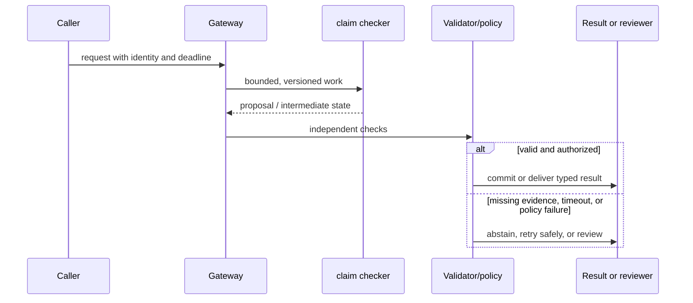

# Hallucination handling
Status: durable
Sources: [NIST AI RMF](https://www.nist.gov/itl/ai-risk-management-framework)

## In one sentence
Hallucination handling combines citation, validation, abstention, and uncertainty rather than one magic prompt.

## Background: what existed before
Systems often accepted fluent text as fact without checking claims or provenance.

## What changed and why now
Grounding and post-generation checks make unsupported statements observable and rejectable. The January focus is the claim boundary: generated language must remain visibly separate from evidence, uncertainty, and authorization.

## Impact on current processing and architecture
Require claim-level evidence IDs, validate dates and numbers, calibrate abstention, and expose conflict to users. Each answer should retain source snapshot, verifier, tenant, latency, cost, and failure metadata.

## Real-world applications and constraints
Use retrieval citations and deterministic validators where an unsupported sentence can change a decision. Start with drafts and evidence navigation; define freshness targets, escalation ownership, and a safe abstention response before widening access.

## Mental model
A hallucination is an unsupported or false output; confidence-like wording is not calibrated probability. Treat each claim as moving through evidence states: proposed, supported, partial, contradicted, unverified, or unavailable.

## Prerequisites: a foundational primer

Know claims, citation IDs, entailment, abstention, numeric validation, source freshness, and confidence calibration. A citation format is not proof of support.

## What changed this month
The January 2026 learning map places hallucination handling alongside low-latency inference, adoption, and scientific collaboration. The linked source is the primary technical or governance reference for the concept; this lesson labels system-design implications as inferences.

## Engineering consequence

Represent each material claim with support status, source IDs, checker version, and abstention reason. Use deterministic checks for dates, arithmetic, identifiers, and citation existence before a fluent answer reaches the user.

## Topic-specific design notes
Use a claim-level pipeline: split an answer into checkable claims, map each to retrieved evidence, run deterministic validators, and choose answer, qualified answer, or abstention. Citations should identify the supporting passage, not merely list a source. For numerical outputs, recompute from structured fields; for code, run tests in a sandbox. Calibration requires a labeled set comparing confidence or abstention with correctness. If sources conflict or are missing, expose that state. A forced citation requirement can encourage fabricated references, so validate that cited IDs exist and entail the claim.

## Topic-specific exercise and interview prompts
Take two claims and an evidence dictionary. Accept only claims whose cited ID exists; make one claim abstain and print the reason. Add a numeric check that recomputes a total.

Can citations still hallucinate? A: Yes, unless IDs and entailment are checked. What is abstention? A: An explicit decision not to assert an unsupported answer.

## Limits and failure modes

A valid citation can support only part of a sentence; stale evidence can make a true old claim wrong now; a calculator can use the wrong unit. Split claims, preserve source dates, and escalate unresolved conflicts.

## Mini exercise (15–30 min)

Claim handling works best as a pipeline. First split an answer into checkable claims; then retrieve evidence, compare the claim with that evidence, validate identifiers and numbers deterministically, and choose support, conflict, abstention, or escalation. Citation presence is only a routing signal. A citation can be stale, irrelevant, or unable to support the exact number stated. Record the evidence version and checker result so an operator can see why the system abstained and improve the right stage rather than lowering every threshold.

Label ten claims as supported, conflicting, or unsupported. Implement citation-existence and numeric checks, then measure false reassurance versus false abstention.

## Uncertainty controls around generated claims

Hallucination handling starts by defining the claim contract. A generated sentence may be a fact to verify, a calculation to recompute, a recommendation, or a creative completion. These categories need different controls. NIST's AI RMF frames risk management as a lifecycle responsibility; it does not turn a detector into a proof of truth. The application should make uncertainty and evidence visible rather than relying on confident style as a quality signal.

For evidence-seeking answers, retrieve authorized sources, assign stable citation IDs, and require each material claim to point to one or more IDs. A checker can verify that the cited source exists and that a quoted span appears, while a stronger entailment review asks whether the span actually supports the claim. Dates and numeric values should be parsed and compared against authoritative systems. If no source supports a claim, return “not established” or ask for a narrower question. Do not fabricate a citation to satisfy a format rule.

Abstention is a product state with its own UX and metrics. Distinguish no evidence, conflicting evidence, unavailable dependency, and policy refusal. The user needs a next action: provide a document, ask an owner, or retry later. Measure unsupported-claim rate, citation coverage, correction rate, abstention precision, and cost. Over-abstaining can make a system unusable; under-abstaining can create harm. Evaluate both with a labeled set and domain reviewers.

Failure can enter through the corpus, retrieval, reasoning, or post-processing. A stale policy is not fixed by a better prompt. A correct citation can be attached to an overbroad conclusion. A calculator tool can return a wrong unit. The pipeline should preserve raw sources, intermediate claims, validation errors, and final status for review. Independent validators must not be generated by the same untrusted text they are checking when a deterministic rule is available.

In a clinical literature assistant, the model summarizes studies but does not diagnose. Each statement includes publication identifier and study date; conflicting results are shown as conflict, not merged into a single certainty. A clinician can correct the interpretation, and the correction becomes a protected evaluation case. The system's value is faster evidence navigation, while medical judgment remains outside the generated claim.

## Impact on current data processing

The claim path is `question → source retrieval → claim extraction → evidence alignment → support state → presentation`. Each claim links to source IDs, evidence spans, retrieval time, and a verifier result; the answer is a view over those records rather than one undifferentiated string. Admission records tenant, purpose, and deadline, while the claim checker emits `supported`, `partial`, `contradicted`, `unverified`, or `unavailable`. Policy decides whether a state may be shown or acted upon.

Operationally, bound source fan-out, claim count, verifier work, citation payload, and review queue size. Measure citation precision, unsupported-claim rate, contradiction recall, abstention usefulness, source freshness, p95 latency, cost, and reviewer correction by domain and answer length. If evidence is missing or a verifier is unavailable, preserve that state instead of retrying until prose sounds confident. Retries carry claim and request IDs; caches, traces, and derived claim records inherit tenant access and deletion rules. These controls are engineering inferences, not guarantees supplied by the source.

## Architecture and data flow

```mermaid
flowchart LR
  A[Caller / source data] --> B[Admission and identity]
  B --> C[claim checker]
  C --> D[Independent validation]
  D --> E[Scoped result or review]
  E --> F[Outcome telemetry]
  classDef source fill:#fee2e2,stroke:#dc2626,color:#450a0a
  classDef gate fill:#dbeafe,stroke:#2563eb,color:#172554
  classDef work fill:#fef3c7,stroke:#d97706,color:#451a03
  classDef result fill:#dcfce7,stroke:#16a34a,color:#14532d
  class A source
  class B,D gate
  class C work
  class E,F result
```



The caller and retrieved sources remain outside the claim checker’s authority assumptions. Admission attaches tenant, purpose, deadline, and source policy; retrieval applies access and freshness filters; extraction proposes claims; independent alignment checks whether evidence entails them and detects contradictions. Only a separately authorized policy transition can produce a side effect. Telemetry records claim, source, and verifier identifiers without copying sensitive payloads by default.

## Sequence and failure flow



A valid citation can support only part of a sentence; stale evidence can make a true old claim wrong now; a calculator can use the wrong unit. Split claims, preserve source dates, and escalate unresolved conflicts.

## Design walkthrough: operating claims and evidence links safely

Treat an answer as a set of claims with different support states, not as one trustworthy string. A claim extractor can split “the service returned 503 because the database was overloaded” into an observed event, a causal explanation, and a confidence-bearing hypothesis. The first may be supported by a trace, the second may require a documented dependency signal, and the third may need a human or a later experiment. Rendering should preserve those distinctions instead of giving every sentence the same visual authority.

For a literature assistant, require a source locator before accepting a factual sentence: publication identifier, section or page, retrieval timestamp, and the quoted or normalized evidence span. If the retrieved source says that two studies disagree, the answer must retain the disagreement; a fluent synthesis is not permission to choose a winner. For a support assistant, “I could not find this in the runbook” is a valid outcome. It is more useful than inventing a command that a hurried operator may execute.

The pipeline should separate generation, grounding, verification, and presentation. Generation proposes a claim. Grounding retrieves candidate records and records why they matched. Verification checks entailment, dates, units, authorization, and contradictions using deterministic rules where possible and a reviewer where necessary. Presentation shows citations, uncertainty, and abstentions in a form the caller can act on. A verifier that only checks whether prose sounds plausible is not a hallucination control; it is another source of correlated error.

Hard cases deserve explicit states. A missing source is different from a source that contradicts the draft; a stale source is different from a parser failure; and a low-confidence paraphrase is different from a claim whose evidence is outside the permitted tenant. Return states such as `supported`, `partially_supported`, `contradicted`, `unverified`, and `unavailable`. Log the transition and reason code, while redacting sensitive text. Retry retrieval failures, not unsupported claims. Retrying a model until it sounds confident can increase exposure without adding evidence.

Test the defenses against realistic pressure. Include questions with no answer in the corpus, plausible but wrong entity names, conflicting versions of a policy, tables whose units differ, and prompts that ask the system to cite a source it never opened. Measure unsupported-claim rate, citation precision, contradiction recall, abstention usefulness, reviewer correction time, and p95 latency separately. Segment by language, domain, source age, and answer length: a good average can hide a dangerous long-answer tail.

Close a change with a provenance record: model and prompt versions, retrieval index, source snapshot, verifier configuration, protected cases, and rollout threshold. When a user corrects an answer, preserve the original claim and evidence decision before updating the index or prompt. A redacted incident case should reproduce the failure without retaining customer secrets. The rollback target must include the verifier and source snapshot, because reverting only the generator can leave the system asserting claims against a changed evidence base.

### Hallucination triage

When an answer is reported as wrong, first classify the failure. The model may have fabricated a claim, the retriever may have missed the right record, the parser may have lost a qualifier, the verifier may have accepted a contradiction, or the UI may have hidden an abstention label. These causes require different fixes and metrics. Store a compact case packet containing the question, permitted source IDs, retrieved IDs, claim spans, verifier results, and reviewer judgment. Do not label every bad answer a “model hallucination”; that diagnosis can conceal an indexing or product failure.

### Operational guardrails

Use bounded answer length and claim count when verification is expensive. Require stronger evidence for irreversible actions, regulated advice, or external publication than for a private brainstorming draft. A citation link alone is insufficient if the cited page does not entail the sentence. Protect source access with tenant-aware filters and test revocation during an in-flight request. If verification is delayed, expose the answer as pending or draft rather than silently promoting it to verified. Alert on sudden changes in abstention, unsupported claims, citation domains, and reviewer overrides.

### Human review without false certainty

Reviewers should see the claim, evidence span, competing evidence, and proposed action—not just a polished paragraph. Record accept, reject, edit, and “needs more evidence” separately. Agreement between two reviewers is useful but does not prove truth, especially when both see the same incomplete corpus. Periodically sample accepted claims and evaluate them against newly available evidence. This keeps the control loop focused on actual user risk rather than on a score that the system can improve by becoming less informative.

## Real-world application and trade-off analysis

Claim controls are most valuable when users need fast evidence navigation but cannot safely trust fluent synthesis. Start with cited drafts, then add reviewed actions. Budget retrieval, verification, citation storage, and correction work; separate interactive answer latency from batch corpus checks. Lower latency is not progress if it raises unsupported claims or conceals conflicting evidence.

Aggressive abstention lowers unsupported claims but can hide useful partial evidence; permissive answering improves coverage while increasing correction and harm. Tune thresholds by consequence and domain.

## Limits and failure modes specific to this concept

Watch for stale sources, citation fabrication, qualifier loss, unit errors, tenant leakage, and confident fallback during verifier outage. Test unanswered questions, conflicting policy versions, ambiguous entities, and adversarial citation requests. A fluent happy path says little about claim-level tail risk. Assign a verifier owner and rollback source snapshot; source claims are facts, while quality and safety conclusions require local evidence.

## Runnable low-cost example

```python
def support_claim(claim, citations):
    cited = [c for c in citations if c["id"] in claim.get("sources", [])]
    if not cited: return {"status":"unsupported", "claim":claim["text"]}
    return {"status":"needs_review", "sources":[c["id"] for c in cited]}

print(support_claim({"text":"A", "sources":["paper-1"]}, [{"id":"paper-1"}]))
```

The support function checks citation presence only. It does not establish entailment, source quality, calibrated confidence, or medical correctness.

## Mini exercise (15–30 min)

Label ten claims as supported, conflicting, or unsupported. Implement citation-existence and numeric-range checks, then add an abstention response for unsupported claims. Compare false reassurance with false abstention using a small confusion matrix.

## Build it locally

1. Save `claim_checker.py` with supported, conflicting, and unsupported fixtures.
2. Parse dates and numbers into deterministic validation rules.
3. Return distinct no-evidence, conflict, outage, and refusal states.
4. Compare a permissive and conservative threshold on the same labels.
5. Have a domain reviewer inspect disagreements and add one holdout case.

## Interview Q&A

**Q: What is a hallucination control?** A: A process that detects, supports, constrains, or escalates an unverified generated claim.
**Q: Does citation presence prove truth?** A: No; the citation must exist and entail the claim, and the source can itself be wrong or stale.
**Q: Why distinguish abstention reasons?** A: The remedy differs for missing evidence, conflict, outage, and policy refusal.
**Q: What should be deterministic?** A: Arithmetic, identifier, authorization, and citation-existence checks where possible.

## Glossary

- **Claim:** A proposition in generated output that can be assessed.
- **Entailment:** Whether evidence supports the meaning of a claim.
- **Abstention:** An explicit decision not to assert an unsupported result.
- **Calibration:** How well a confidence signal corresponds to observed correctness.

## References

[NIST AI RMF](https://www.nist.gov/itl/ai-risk-management-framework)
- [January 2026 lesson map](README.md)

## Claim ledger

| Claim | Source | Fact or inference |
|---|---|---|
| NIST developed the AI RMF to help organizations manage risks to individuals, organizations, and society associated with AI. | [NIST AI RMF](https://www.nist.gov/itl/ai-risk-management-framework) | Fact, scoped to source |
| The architecture, metrics, and failure handling in this lesson are suitable engineering consequences to test locally. | [NIST AI RMF](https://www.nist.gov/itl/ai-risk-management-framework) | Inference |
| The Python example illustrates a boundary and does not establish provider-scale reliability or safety. | [NIST AI RMF](https://www.nist.gov/itl/ai-risk-management-framework) | Inference |
