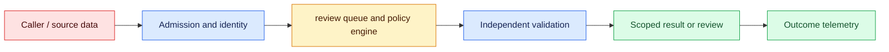
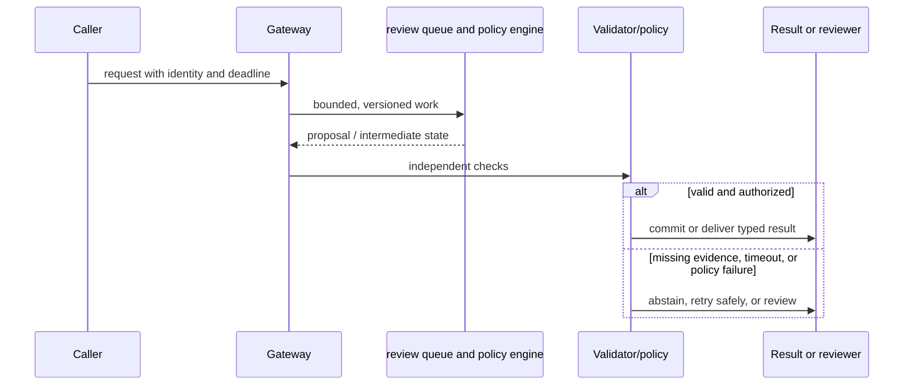

# Human review
Status: watch
Sources: [NIST AI RMF Govern](https://www.nist.gov/itl/ai-risk-management-framework)

## In one sentence
Human review reserves accountable judgment for high-impact, ambiguous, or irreversible transitions.

## Background: what existed before
Automation either stopped for every case or silently acted, producing queues or unreviewed harm.

## What changed and why now
Risk-based review routes only cases whose uncertainty, impact, or policy triggers exceed thresholds. This month's focus is human review as an operable system boundary: its measurements and controls determine whether the capability survives contact with real traffic.

## Impact on current processing and architecture
Design reviewer context, decision recording, appeal paths, workload limits, and override monitoring. A production path should carry version, tenant, latency, cost, and failure metadata beside the model result.

## Real-world applications and constraints
Use review for financial, medical, employment, deletion, and safety-sensitive actions; sample low-risk work. Start with reversible, low-risk workloads; define SLOs, access controls, and an owner before expanding.

## Mental model
A reviewer is a control with authority and evidence, not a rubber stamp added after deployment. Model the concept as a state transition with explicit inputs, outputs, authority, and failure handling.

## Prerequisites: a foundational primer

Know queueing, SLAs, reviewer roles, evidence packets, stale writes, appeals, fatigue, and automation bias. Review is an accountable state transition, not a ceremonial checkbox.

## What changed this month
The January 2026 learning map places human review alongside low-latency inference, adoption, and scientific collaboration. The linked source is the primary technical or governance reference for the concept; this lesson labels system-design implications as inferences.

## Engineering consequence

Store trigger, harm class, evidence IDs, proposed action, reviewer role, deadline, decision, rationale, and appeal link. Scope approval to one action and prevent stale reviewers from committing over newer policy.

## Topic-specific design notes
Design review as a queue with admission criteria, evidence packet, SLA, reviewer role, decision enum, and appeal path. Route by impact and uncertainty, not by model confidence alone. Show the original request, model output, evidence, policy trigger, and allowed actions; hide irrelevant personal data. Measure agreement, override rate, review time, backlog age, and downstream harm. Sample auto-approved low-risk cases for drift. A reviewer must be able to reject, edit, or escalate; otherwise the control is ceremonial. Rotate or cap workload where fatigue affects consistency.

## Topic-specific exercise and interview prompts
Implement `route(impact, uncertainty)` with high-impact cases always reviewed. Add a queue item containing evidence and a reason, then test that a reviewer decision is persisted.

How do you detect rubber-stamping? A: Track agreement, edit distance, time, and sampled audits. Why not review everything? A: It creates delay and fatigue while diluting attention from consequential cases.

## Limits and failure modes

A queue can clear through rubber-stamping; sensitive evidence can be overexposed; an approval can outlive a revocation; stale decisions can overwrite appeals. Sample auto-approvals, cap workload, and retain immutable decision history.

## Mini exercise (15–30 min)

Simulate ten cases with deadlines and harm priorities. Add a compare-and-swap state transition so two reviewers cannot approve conflicting decisions.

## Human review as a designed state transition

Human review is not a generic “add a person” fallback. It is a queue, interface, policy, and accountability design for cases where automation is uncertain or consequences are high. Define the transition that requires review: low confidence, conflicting evidence, irreversible side effect, protected population, or an appeal. The model's confidence alone is not enough; a high-confidence proposal can still violate authorization or a domain invariant.

The queue record should contain the minimum evidence needed to decide: task, source IDs, proposed action, validator errors, model/version, deadline, and prior decisions. It should not force a reviewer to copy sensitive data into a new system. Prioritize by harm and deadline, not merely arrival order. Separate queues by expertise and access role, and make assignment auditable. A reviewer can approve, reject, request information, or defer; each transition has a reason code and an owner.

Review quality depends on interface and workload. Show evidence beside the proposal, highlight uncertain fields, and allow correction rather than only accept/reject. Measure agreement, overturn rate, time in queue, rework, and downstream incidents. A queue that clears quickly because reviewers rubber-stamp is not healthy. Sample accepted auto-decisions for audit, protect reviewers from seeing unnecessary personal data, and monitor fatigue and automation bias.

The automation boundary must be explicit. A reviewer approval can authorize one named action under a time and resource scope; it should not become a blanket permission for later model calls. If an external side effect occurs while a reviewer is offline, the state remains pending and the deadline policy determines whether to expire. Appeals should create a new case linked to the original, preserving both decisions rather than overwriting history.

For an insurance claims triage tool, routine low-value claims can be routed to a straight-through path, while ambiguous coverage and high-value claims enter specialist review. The model highlights policy passages and missing documents; the adjuster owns the decision. Metrics include processing time and correction rate, but also disparate escalation and appeal outcomes. The design earns trust by making the human's authority and evidence visible.

## Impact on current data processing

The data path is `request → review queue and policy engine → validator/policy → outcome`. The `decision plus reviewer rationale` is versioned and scoped to its owner; it is not treated as a durable memory or permission. Admission records the input shape and deadline, processing emits typed intermediate state, and the final result carries provenance and a reason code. This makes a change measurable at the boundary where reviewable decisions become an application decision.

Operationally, keep the concept-specific resource bounded. Measure the signal that matters for reviewable decisions alongside p95 latency, error class, cost, and downstream correction. Under overload or missing evidence, return a typed degraded state or queue for review. Retrying must preserve idempotency and correlation. Any cache, index, trace, or derived artifact inherits tenant isolation and retention rules. These are engineering inferences from the source, not guarantees supplied by it.

## Architecture and data flow



The source or caller remains outside the worker's trust assumptions. Admission attaches tenant, purpose, deadline, and version; the worker transforms reviewable decisions; validation checks invariants that generated or approximate computation cannot establish. Only the final policy transition can produce a side effect. Telemetry records identifiers and measurements without copying sensitive payloads by default.

## Sequence and failure flow



A queue can clear through rubber-stamping; sensitive evidence can be overexposed; an approval can outlive a revocation; stale decisions can overwrite appeals. Sample auto-approvals, cap workload, and retain immutable decision history.

## Design walkthrough: operating reviewable decisions safely

Take one realistic request and follow it through the system. The caller supplies an identity, purpose, input, and deadline; admission validates those fields before allocating work. The review queue and policy engine receives only the fields needed for its computation and emits a proposal, measurement, or transformed state. It does not get ambient credentials, an unbounded queue, or permission to redefine the contract. The gateway stores the decision plus reviewer rationale identifier and the versions that produced it, then invokes checks owned by code outside the probabilistic or approximate step.

An insurance tool straight-through processes routine claims but sends ambiguous coverage and high-value claims to specialists. The adjuster sees highlighted evidence and owns the decision; appeal creates a linked case.

Now follow a difficult request. An unusually large reviewable decisions value may exhaust memory or context; a rare language, malformed record, stale source, or cancelled client may invalidate assumptions. Admission should reject or split before expensive work, and the reason must be observable. If a dependency times out, preserve the deadline and return an unavailable state rather than retrying forever. If work may have reached an external system, query its receipt before replay. These transitions are different from model uncertainty and should have different metrics and runbooks.

Multi-tenant operation adds a second axis. Namespaces, ACL filters, quotas, and deletion jobs apply to the decision plus reviewer rationale as well as to the visible answer. A cache key, vector, trace, queue item, or temporary file must carry an owner or an explicit public scope. Test a request that has a valid shape but another tenant's identifier; the expected behavior is a denial, not an empty lookup that leaks timing. Test revocation between planning and execution. The worker should observe the new policy at the side-effect boundary.

Capacity planning should use production-shaped distributions. Measure short and long inputs, cold and warm workers, concurrent tenants, cancellations, and retries. Report p50 and p95 or p99 latency, memory, queue age, cost, and accepted outcome rate. For reviewable decisions, add a domain metric: page or token fit, cache-page pressure, batch wait, evidence recall, field validity, review agreement, or conversion. Averages hide the cases that drive support tickets. A canary is successful only when protected slices remain inside their thresholds.

Finally, make a change record. State what the source actually establishes, what this integration infers, which baseline was used, and what would trigger rollback. Pin the model or library, schema, policy, and data versions. Keep a small reproducible fixture and a separate protected case. At launch, sample outcomes and inspect corrections; after launch, add every incident to the regression set. The owner should be able to answer what the system saw, which decision it made, why it was allowed, and how to undo it without searching through raw customer payloads.

## Real-world application and trade-off analysis

The strongest use case is one in which reviewable decisions are expensive or difficult to manage manually and the consequence of a wrong result is bounded. Start with read-only or draft work, then add a reviewed transition. Estimate total cost, including retrieval, model work, retries, storage, reviewer time, and corrections. Latency targets should be stated separately for interactive and batch routes. A cheaper or faster implementation is not an improvement if it moves errors into a high-cost downstream queue.

Reviewing more cases raises delay and fatigue while reviewing fewer cases risks missed harm. The threshold should optimize downstream correction and appeal outcomes, not queue size alone.

## Limits and failure modes specific to this concept

Watch for malformed inputs, version drift, resource exhaustion, cross-tenant state, stale artifacts, and silent degraded paths. Test the boundary conditions that are unique to reviewable decisions: unusually large or rare values, cancellations, duplicate requests, partial dependencies, and adversarial content. A passing happy-path demo says little about tail behavior. Define an escalation owner and rollback artifact before enabling the feature. If the source describes a capability, label it as a fact; claims about production quality, safety, or value are inferences requiring local evidence.

## Runnable low-cost example

```python
def next_state(case, decision, actor):
    if case["state"] != "pending": return {"error":"stale_case"}
    if decision not in {"approve", "reject", "request_info"}:
        return {"error":"invalid_decision"}
    return {"state": decision, "actor": actor, "reason_required": True}

print(next_state({"state":"pending"}, "request_info", "reviewer-7"))
```

The state-transition function demonstrates stale-case rejection. It does not model staffing, expertise, privacy controls, or the quality of a real review decision.

## Mini exercise (15–30 min)

Design a queue record with deadline, evidence IDs, role, and reason code. Simulate ten cases, prioritize high-harm items, and calculate time-to-review. Add a stale-case test so two reviewers cannot commit conflicting transitions.

## Build it locally

1. Save `review_queue.py` with harm, deadline, evidence, and role fields.
2. Prioritize by harm and deadline, then calculate queue age.
3. Implement stale-version rejection for competing reviewer decisions.
4. Add approval, reject, request-info, defer, and appeal states.
5. Sample accepted automation and compare reviewer overturn and fatigue signals.

## Interview Q&A

**Q: When should work enter review?** A: At a defined uncertainty, consequence, policy, or appeal boundary.
**Q: What should a reviewer see?** A: The minimum proposal, evidence, errors, provenance, and allowed choices needed for a decision.
**Q: Why measure overturn rate?** A: It reveals where automation is confidently wrong or reviewers are correcting systemic issues.
**Q: Does approval grant future authority?** A: No; it should authorize only the named, scoped transition.

## Glossary

- **Human-in-the-loop:** A workflow where a person makes or confirms a defined transition.
- **Automation bias:** Uncritical reliance on a system proposal because it appears authoritative.
- **Escalation:** Moving a case to a more qualified or accountable decision path.
- **Appeal:** A new review of a prior outcome by a user or authorized party.

## References

[NIST AI RMF Govern](https://www.nist.gov/itl/ai-risk-management-framework)
- [January 2026 lesson map](README.md)

## Claim ledger

| Claim | Source | Fact or inference |
|---|---|---|
| The AI RMF is intended to help organizations manage AI risks; this lesson’s approval workflow is an engineering application of that goal. | [NIST AI RMF Govern](https://www.nist.gov/itl/ai-risk-management-framework) | Fact plus inference |
| The architecture, metrics, and failure handling in this lesson are suitable engineering consequences to test locally. | [NIST AI RMF Govern](https://www.nist.gov/itl/ai-risk-management-framework) | Inference |
| The Python example illustrates a boundary and does not establish provider-scale reliability or safety. | [NIST AI RMF Govern](https://www.nist.gov/itl/ai-risk-management-framework) | Inference |
