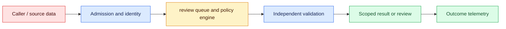
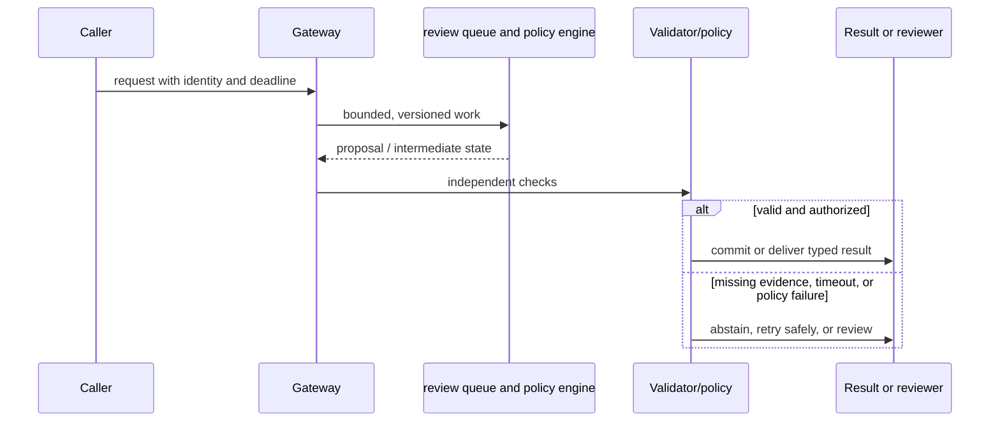

# Human review
Status: watch
Sources: [NIST AI RMF Govern](https://www.nist.gov/itl/ai-risk-management-framework)

## In one sentence
Human review reserves accountable judgment for high-impact, ambiguous, or irreversible transitions.

## Background: what existed before
Automation either stopped for every case or silently acted, producing queues or unreviewed harm.

## What changed and why now
Risk-based review routes only cases whose uncertainty, impact, or policy triggers exceed thresholds. The January focus is review as an accountable decision gate: a person receives enough evidence and authority to accept, correct, defer, or reject a proposed action.

## Impact on current processing and architecture
Design the packet, queue priority, decision record, appeal path, workload cap, and override monitor. Carry proposal, evidence, reviewer role, tenant, latency, cost, and final-action metadata together.

## Real-world applications and constraints
Use review for financial, medical, employment, deletion, and safety-sensitive actions; sample low-risk work. Start with drafts and reversible decisions, then define safe-deferral behavior, reviewer coverage, and escalation ownership.

## Mental model
A reviewer is a control with authority and evidence, not a rubber stamp added after deployment. Model a case as queued, assigned, evidenced, decided, appealed, or safely deferred, with each transition recorded.

## Prerequisites: a foundational primer

Know queueing, SLAs, reviewer roles, evidence packets, stale writes, appeals, fatigue, and automation bias. Review is an accountable state transition, not a ceremonial checkbox.

## What changed this month
The January 2026 learning map places human review alongside low-latency inference, adoption, and scientific collaboration. The linked source is the primary technical or governance reference for the concept; this lesson labels system-design implications as inferences.

## Engineering consequence

Store trigger, harm class, evidence IDs, proposed action, reviewer role, deadline, decision, rationale, and appeal link. Scope approval to one action and prevent stale reviewers from committing over newer policy.

## Topic-specific design notes
Design review as a queue with admission criteria, evidence packet, SLA, reviewer role, decision enum, and appeal path. Route by impact and uncertainty, not by model confidence alone. Show the original request, model output, evidence, policy trigger, and allowed actions; hide irrelevant personal data. Measure agreement, override rate, review time, backlog age, and downstream harm. Sample auto-approved low-risk cases for drift. A reviewer must be able to reject, edit, or escalate; otherwise the control is ceremonial. Rotate or cap workload where fatigue affects consistency.

## Topic-specific exercise and interview prompts
Implement `route(impact, uncertainty)` with high-impact cases always reviewed. Add a queue item containing evidence and a reason, then test that a reviewer decision is persisted.

How do you detect rubber-stamping? A: Track agreement, edit distance, time, and sampled audits. Why not review everything? A: It creates delay and fatigue while diluting attention from consequential cases.

## Limits and failure modes

A queue can clear through rubber-stamping; sensitive evidence can be overexposed; an approval can outlive a revocation; stale decisions can overwrite appeals. Sample auto-approvals, cap workload, and retain immutable decision history.

## Mini exercise (15–30 min)

Human review is a queueing and decision-design problem. Define entry conditions using consequence, uncertainty, policy, and appeal—not an opaque confidence score alone. Show the reviewer the smallest useful proposal, evidence, provenance, known errors, and exact choices available. Bind an approval to the case version and intended effect so it cannot authorize a later mutation. Measure queue age, abandonment, overturns, disagreement, and fatigue; a reviewer who clicks every item is not reliable evidence of safety.

Simulate ten cases with deadlines and harm priorities. Add a compare-and-swap state transition so two reviewers cannot approve conflicting decisions.

## Human review as a designed state transition

Human review is not a generic “add a person” fallback. It is a queue, interface, policy, and accountability design for cases where automation is uncertain or consequences are high. Define the transition that requires review: low confidence, conflicting evidence, irreversible side effect, protected population, or an appeal. The model's confidence alone is not enough; a high-confidence proposal can still violate authorization or a domain invariant.

The queue record should contain the minimum evidence needed to decide: task, source IDs, proposed action, validator errors, model/version, deadline, and prior decisions. It should not force a reviewer to copy sensitive data into a new system. Prioritize by harm and deadline, not merely arrival order. Separate queues by expertise and access role, and make assignment auditable. A reviewer can approve, reject, request information, or defer; each transition has a reason code and an owner.

Review quality depends on interface and workload. Show evidence beside the proposal, highlight uncertain fields, and allow correction rather than only accept/reject. Measure agreement, overturn rate, time in queue, rework, and downstream incidents. A queue that clears quickly because reviewers rubber-stamp is not healthy. Sample accepted auto-decisions for audit, protect reviewers from seeing unnecessary personal data, and monitor fatigue and automation bias.

The automation boundary must be explicit. A reviewer approval can authorize one named action under a time and resource scope; it should not become a blanket permission for later model calls. If an external side effect occurs while a reviewer is offline, the state remains pending and the deadline policy determines whether to expire. Appeals should create a new case linked to the original, preserving both decisions rather than overwriting history.

For an insurance claims triage tool, routine low-value claims can be routed to a straight-through path, while ambiguous coverage and high-value claims enter specialist review. The model highlights policy passages and missing documents; the adjuster owns the decision. Metrics include processing time and correction rate, but also disparate escalation and appeal outcomes. The design earns trust by making the human's authority and evidence visible.

## Impact on current data processing

The review path is `request → risk router → evidence packet → assigned reviewer → adjudication → authorized action`. The automated proposal, reviewer decision, rationale, and appeal are separate versioned records scoped to the case owner; none is a blanket permission for later work. Admission checks identity, jurisdiction, deadline, and required evidence. The final state records who decided, under which policy, and whether the action is accepted, rejected, deferred, or appealed.

Operationally, bound queue depth, packet size, assignment fan-out, reviewer concurrency, and escalation time. Measure queue age, abandonment, disagreement, overturn rate, correction, appeal outcome, reviewer workload, p95 decision latency, and cost by risk slice. If evidence or staffing is unavailable, defer safely or narrow automation; do not convert a missing review into approval. Retries preserve case and action IDs, while packets, comments, recordings, and exports inherit tenant access and retention rules. These controls are engineering inferences, not guarantees supplied by the source.

## Architecture and data flow



The requester, proposal generator, and reviewer are distinct roles. Admission attaches tenant, purpose, deadline, and policy version; the router selects a permitted queue; the packet presents evidence and uncertainty; the reviewer records a bounded decision; an action gate rechecks authorization before the side effect. Telemetry records case, role, policy, and outcome identifiers without copying sensitive payloads by default.

## Sequence and failure flow



A queue can clear through rubber-stamping; sensitive evidence can be overexposed; an approval can outlive a revocation; stale decisions can overwrite appeals. Sample auto-approvals, cap workload, and retain immutable decision history.

## Design walkthrough: operating reviewable decisions safely

Design review as a decision boundary, not as a decorative approval button. The automated stage should produce a bounded proposal, evidence bundle, uncertainty signal, and explicit requested action. The reviewer should be able to accept, reject, edit, or request more evidence without recreating the whole investigation. Store the proposal and final decision separately so later analysis can distinguish model error from reviewer judgment and from a policy change.

In an insurance workflow, routine claims may be paid automatically while ambiguous coverage, unusual loss patterns, and high-value claims enter a specialist queue. The adjuster needs the policy version, extracted facts, missing fields, and comparable cases—not an opaque confidence number. An appeal should create a linked case with a new reviewer and preserved prior reasoning. A reviewer who merely clicks “approve” on a preselected answer supplies little independent control.

Route work using consequence and uncertainty together. A low-confidence answer about a harmless formatting choice need not block a user; a moderately confident decision that changes benefits, access, or a medical record may require review. Admission checks identity, jurisdiction, deadline, and required evidence before consuming queue capacity. If the source system is unavailable, show “waiting for evidence” rather than converting absence into approval. If the request is revoked while waiting, remove it from the actionable queue and record the revocation.

Make the queue itself observable. Track age, priority, assignment, reassignment, abandonment, time in each state, reviewer workload, and outcome changes. Protect against starvation by giving old cases an escalation path, but do not let urgency bypass authorization. A surge can be handled with a second reviewer pool, narrower automation, or a safe deferral state; silently lowering review quality is not capacity planning. Keep customer and tenant boundaries on queue items, attachments, comments, and exported reports.

Measure reviewer performance without turning people into a single score. Sample accepted and rejected cases for second review, monitor disagreement by policy and case type, and measure correction quality and appeal outcomes. Speed can improve because the interface hides difficult cases, so pair handling time with error, reversal, and harm indicators. Protect reviewers from repetitive near-duplicates, adversarial content, and excessive context switching. A human in the loop is only a control when the person has authority, time, evidence, and a meaningful ability to change the outcome.

Record every transition with actor, role, reason code, timestamp, policy version, and evidence identifiers. Do not overwrite the automated proposal when the reviewer edits it. At release, pin routing thresholds, queue rules, model versions, and staffing assumptions. During an incident, freeze new automation or route all affected cases to review; after recovery, compare the held-out cases and add representative failures to the regression suite. The rollback artifact includes queue migrations and notification behavior, not only the model binary.

### Review packet design

A useful packet has a small “decision at a glance” region and expandable evidence. Put requested action, deadline, risk tier, missing information, and recommended disposition first. Show the exact source span for each material fact, including its timestamp and access scope. Hide unrelated personal data by default and make redaction deterministic enough for reviewers to trust it. If evidence conflicts, place the conflict beside the claim instead of burying it in a long transcript. The packet should survive a later policy update so an auditor can see what the reviewer actually saw.

### Calibration and escalation

Set review thresholds from labeled cases and downstream consequences, then recalibrate after distribution shift. Reviewers need a “cannot decide” path with a named escalation owner; forcing a binary choice turns uncertainty into arbitrary action. Escalation should carry the unresolved question and prior evidence, not merely forward the entire conversation. If a reviewer repeatedly encounters a new pattern, pause automation for that slice and create a policy or training change. Record whether the final resolution came from additional evidence, a rule exception, or a human override.

### Privacy and labor constraints

Minimize sensitive fields in the review surface and enforce retention for screenshots, comments, and exports. Access to a case does not imply permission to reuse it for model training. Account for reviewer availability, local law, language coverage, accommodations, and the emotional cost of harmful content. A queue that meets latency targets by exhausting reviewers is an operational failure. Service-level objectives should include safe deferral, appeal response, and reviewer well-being signals where appropriate.

## Real-world application and trade-off analysis

Human review is most valuable when an automated proposal is fast but the consequence of an uncorrected decision is material. Begin with draft recommendations, then gate narrowly defined actions. Budget packet assembly, queue delay, reviewer minutes, appeals, and correction cost; report decision latency separately from model latency. A shorter queue is not progress if reviewers lack evidence or rush critical cases.

Reviewing more cases raises delay and fatigue while reviewing fewer cases risks missed harm. The threshold should optimize downstream correction and appeal outcomes, not queue size alone.

## Limits and failure modes specific to this concept

Watch for stale packets, reviewer impersonation, queue starvation, rubber-stamping, privacy leakage, and action after revocation. Test reassignment, duplicate cases, missing evidence, reviewer disagreement, cancellation, and appeal paths. A fast approval path says little about rare harmful decisions. Assign an escalation owner and safe fallback; source claims remain facts while operational quality requires local evidence.

## Runnable low-cost example

```python
def next_state(case, decision, actor):
    if case["state"] != "pending": return {"error":"stale_case"}
    if decision not in {"approve", "reject", "request_info"}:
        return {"error":"invalid_decision"}
    return {"state": decision, "actor": actor, "reason_required": True}

print(next_state({"state":"pending"}, "request_info", "reviewer-7"))
```

The state-transition function demonstrates stale-case rejection. It does not model staffing, expertise, privacy controls, or the quality of a real review decision.

## Mini exercise (15–30 min)

Design a queue record with deadline, evidence IDs, role, and reason code. Simulate ten cases, prioritize high-harm items, and calculate time-to-review. Add a stale-case test so two reviewers cannot commit conflicting transitions.

## Build it locally

1. Save `review_queue.py` with harm, deadline, evidence, and role fields.
2. Prioritize by harm and deadline, then calculate queue age.
3. Implement stale-version rejection for competing reviewer decisions.
4. Add approval, reject, request-info, defer, and appeal states.
5. Sample accepted automation and compare reviewer overturn and fatigue signals.

## Interview Q&A

**Q: When should work enter review?** A: At a defined uncertainty, consequence, policy, or appeal boundary.
**Q: What should a reviewer see?** A: The minimum proposal, evidence, errors, provenance, and allowed choices needed for a decision.
**Q: Why measure overturn rate?** A: It reveals where automation is confidently wrong or reviewers are correcting systemic issues.
**Q: Does approval grant future authority?** A: No; it should authorize only the named, scoped transition.

## Glossary

- **Human-in-the-loop:** A workflow where a person makes or confirms a defined transition.
- **Automation bias:** Uncritical reliance on a system proposal because it appears authoritative.
- **Escalation:** Moving a case to a more qualified or accountable decision path.
- **Appeal:** A new review of a prior outcome by a user or authorized party.

## References

[NIST AI RMF Govern](https://www.nist.gov/itl/ai-risk-management-framework)
- [January 2026 lesson map](README.md)

## Claim ledger

| Claim | Source | Fact or inference |
|---|---|---|
| The AI RMF is intended to help organizations manage AI risks; this lesson’s approval workflow is an engineering application of that goal. | [NIST AI RMF Govern](https://www.nist.gov/itl/ai-risk-management-framework) | Fact plus inference |
| The architecture, metrics, and failure handling in this lesson are suitable engineering consequences to test locally. | [NIST AI RMF Govern](https://www.nist.gov/itl/ai-risk-management-framework) | Inference |
| The Python example illustrates a boundary and does not establish provider-scale reliability or safety. | [NIST AI RMF Govern](https://www.nist.gov/itl/ai-risk-management-framework) | Inference |
