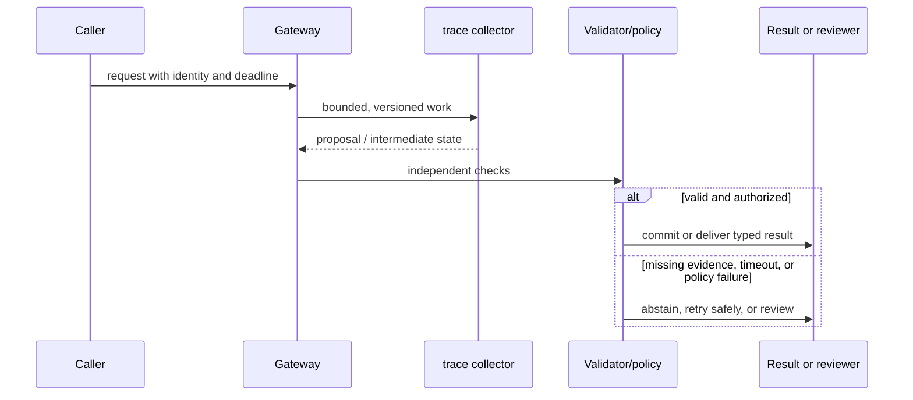

# Observability
Status: emerging
Sources: [OpenTelemetry traces](https://opentelemetry.io/docs/concepts/observability-primer/)

## In one sentence
Observability links traces, metrics, and logs to explain model, tool, cost, and outcome behavior.

## Background: what existed before
Traditional service logs rarely connected an LLM call to retrieval, tools, tokens, or user result.

## What changed and why now
Distributed traces can carry a request ID across orchestration and inference spans. The January focus is observability as causal evidence: telemetry should let an operator connect a user outcome to model, retrieval, tool, policy, and dependency events.

## Impact on current processing and architecture
Capture trace context, token counts, model version, tool outcomes, and redacted errors under an explicit retention policy. Keep route, tenant, latency, cost, sampling, and drop metadata beside the user outcome.

## Real-world applications and constraints
Use dashboards for time-to-first-token, span completeness, dependency latency, tool denials, and cost by route. Begin with a non-sensitive canary, then define alert ownership, payload redaction, and a runbook action before increasing sampling.

## Mental model
A trace is causal context across spans; correlation IDs connect events without storing raw secrets. Think of telemetry as a pipeline whose records move from emitted to exported, retained, queried, and eventually deleted.

## Prerequisites: a foundational primer

Know traces, spans, metrics, cardinality, redaction, event ordering, and correlation IDs. Payload logging is neither the only nor the safest form of evidence.

## What changed this month
The January 2026 learning map places observability alongside low-latency inference, adoption, and scientific collaboration. The linked source is the primary technical or governance reference for the concept; this lesson labels system-design implications as inferences.

## Engineering consequence

Define spans for admission, retrieval, inference, tool policy, execution, validation, and review. Record versions, IDs, lengths, cost, and state transitions while redacting payloads before export; retain security events under restricted access.

## Topic-specific design notes
Trace an AI request across gateway, retrieval, prompt assembly, model, tool, reviewer, and outcome spans. Use low-cardinality dimensions such as route and model version; hash or redact user identifiers and never put raw prompts in metric labels. Correlate token usage and cache status with latency and cost. Emit structured error types—timeout, policy rejection, provider error, parse failure—so retries can be bounded. The most valuable signal is downstream outcome, such as accepted extraction or corrected answer, not a dashboard of model calls alone. Define retention by data class.

## Topic-specific exercise and interview prompts
Create a trace list with span names and durations, calculate total and slowest span, and redact a fake prompt before logging. Add an error counter grouped by type.

What is an observability blind spot? A: A missing downstream outcome can make a successful API call look like success. Why avoid high-cardinality labels? A: They make metrics expensive and hard to aggregate.

## Limits and failure modes

A missing correlation ID fragments an incident; high-cardinality payload labels destroy metrics; an exporter can receive secrets before redaction. Test cancellation and exporter failure, sample ordinary traces, and retain policy violations.

## Mini exercise (15–30 min)

For agent systems, observability must connect model work to external state without making sensitive prompts the default log payload. Put trace and run IDs on retrieval, model, policy, tool, queue, and provider events. Record versions, latency, token estimates, decisions, and receipts; redact secrets before export and restrict raw evidence separately. A useful dashboard distinguishes model refusal, policy denial, provider error, timeout, and unknown external outcome. Each category leads to a different response and should not be collapsed into “request failed.”

Instrument a retrieval-to-validator stub with parent/child spans, error classes, counts, and a redaction test. Verify a dependency failure still yields a final state.

## Tracing one AI request across changing components

AI observability connects a request's input contract, model call, retrieval, tools, validation, and user outcome. OpenTelemetry's trace model is useful because a trace has spans with timing and attributes, while metrics aggregate behavior and logs carry events. For AI systems, the temptation is to record every prompt and output. That creates a sensitive shadow database and still may not explain an incident if versions and state are missing.

Define a trace schema before instrumenting. Carry a correlation ID, tenant-safe subject, route, model snapshot, prompt/schema/index versions, token counts, queue time, dependency status, and final state. Record hashes, IDs, lengths, and error classes by default; sample payloads only under restricted, time-limited access. Span boundaries should follow real stages: admission, retrieval, prefill/decode, tool proposal, authorization, execution, validation, review, and persistence. A single total timer cannot distinguish a provider queue from a slow reviewer.

Metrics need a relationship to outcomes. Track TTFT, completion latency, error and retry classes, cost, cache hits, retrieval recall proxies, validator failures, review time, corrections, and side-effect success. Correlate them by route and protected slice, but do not infer causation from a dashboard alone. Logs should be structured and immutable enough to reconstruct state transitions; event ordering matters when a timeout races with a completion.

Failure telemetry needs privacy and sampling policies. Always retain security violations, authorization denials, and data-loss alerts; sample ordinary successful payload-free traces. Redact secrets before exporters and test redaction with fixtures containing tokens, URLs, and personal data. A vendor collector may have its own retention, so include it in the data inventory. Trace IDs must not be guessable access tokens.

For a document assistant incident, a trace shows retrieval returned an old policy version, the context assembler omitted the effective-date field, and the validator accepted the generated answer. The fix spans index freshness, manifest tests, and a new protected fixture. Without linked spans, each team might blame the model. Observability is valuable when it shortens that path from symptom to owned corrective action.

## Impact on current data processing

The telemetry path is `request → context propagation → service spans/events → exporter → protected store → metrics and incident views`. A trace links model, retrieval, tool, queue, and policy spans while outcome events record completion, cancellation, denial, correction, or unknown state. Payloads are not the identity of a trace: store bounded attributes, source and deployment versions, timing, status, and references to separately protected evidence. This lets operators reconstruct a causal path without turning observability into a copy of customer data.

Operationally, bound span attributes, event rate, queue backlog, exporter memory, and retention. Measure trace completeness, dropped-span rate, first-token and end-to-end latency, dependency errors, retries, tool denials, token cost, and downstream corrections by route and protected slice. If telemetry is delayed, mark the view incomplete rather than treating missing evidence as healthy traffic. Propagate correlation and idempotency IDs through retries and queues. Traces, exemplars, and recordings inherit tenant access and deletion rules; these controls are engineering inferences, not guarantees supplied by the source.

## Architecture and data flow

```mermaid
flowchart LR
  A[Caller / source data] --> B[Admission and identity]
  B --> C[trace collector]
  C --> D[Independent validation]
  D --> E[Scoped result or review]
  E --> F[Outcome telemetry]
  classDef source fill:#fee2e2,stroke:#dc2626,color:#450a0a
  classDef gate fill:#dbeafe,stroke:#2563eb,color:#172554
  classDef work fill:#fef3c7,stroke:#d97706,color:#451a03
  classDef result fill:#dcfce7,stroke:#16a34a,color:#14532d
  class A source
  class B,D gate
  class C work
  class E,F result
```



The application path and telemetry path are separate trust domains. Admission creates a correlation context containing tenant scope, purpose, deadline, and deployment version; workers add child spans for retrieval, generation, validation, and side effects; exporters enforce redaction and access policy. Outcome events are emitted by the component that knows the final state, not inferred from a successful transport response. Only the application policy gate can authorize a side effect. Telemetry records identifiers and measurements without copying sensitive payloads by default.

## Sequence and failure flow



A missing correlation ID fragments an incident; high-cardinality payload labels destroy metrics; an exporter can receive secrets before redaction. Test cancellation and exporter failure, sample ordinary traces, and retain policy violations.

## Design walkthrough: operating spans and outcome events safely

Instrument an AI request as a causal story rather than a bag of timestamps. A trace should connect admission, prompt or feature assembly, retrieval, model calls, tool calls, validation, side effects, and the user-visible outcome. Each span records start and end time, status, bounded attributes, dependency versions, and a correlation ID. Metrics summarize fleet behavior; logs explain a selected event; traces explain one request’s path. Keeping these roles separate makes an alert actionable without storing every prompt.

For a document assistant, one trace might show that retrieval used an index from Monday, the source document became effective Tuesday, the model cited the older version, and a validator accepted the answer because it checked only schema. That is a freshness and validation gap, not simply “high latency.” The trace should make the boundary visible while redacting document contents. A useful outcome event records answer state, citation status, user correction, and downstream action, allowing owners to connect infrastructure signals to quality.

Propagate context across asynchronous boundaries. Put trace and tenant identifiers in queue metadata, carry them through retries, and create a new linked span when a worker resumes after a delay. Record attempt number and idempotency key so duplicate work is distinguishable from a long call. For streaming responses, capture first-token latency, inter-token gaps, cancellation, and final completion state. For batch jobs, record partition, checkpoint, replay count, and partial-output disposition. A single request ID without state transitions cannot explain why an agent acted twice.

Define cardinality before enabling telemetry. User IDs, raw prompts, URLs, and generated text can explode metric dimensions or create privacy exposure. Keep high-cardinality details in access-controlled event storage, hash or bucket where possible, and use stable reason codes for metrics. Apply tenant-aware retention and deletion to traces, exemplars, attachments, and derived dashboards. Test that a revoked user cannot retrieve a trace merely because they know its correlation ID.

Build alerts around symptoms and causes. Queue age, dependency failures, tool-denial rates, token spend, and p99 latency are useful symptoms; stale index versions, validator bypasses, and rising human overrides suggest causes. Break down metrics by model route, source age, language, tenant class, and task type only when those slices lead to an action. Compare current behavior with a pinned baseline and alert on both sudden shifts and slow drift. A low error rate can coexist with a severe failure in a small protected slice.

Close each instrumentation change with a privacy and debugging review. State what is collected, who can read it, retention, redaction, sampling, and the incident question it answers. Pin schema versions and maintain compatibility for consumers such as dashboards, replay tools, and billing. During an incident, preserve a small safe exemplar and the deployment manifest; after resolution, add a detector or test if the missing signal delayed diagnosis. Telemetry is part of the product’s control plane and must be operated with the same rigor as the model path.

### Outcome taxonomy

Choose final states that describe what happened: `completed`, `cancelled`, `timed_out`, `dependency_unavailable`, `policy_denied`, `validation_failed`, `partial`, and `unknown`. Do not infer success from an HTTP 200 or a nonempty string. Emit the state at the boundary that owns the decision, then let downstream systems attach their observations. This prevents dashboards from counting a generated answer as successful when its tool call failed or its side effect was never confirmed.

### Sampling and replay

Tail-based sampling can retain slow or failed traces while reducing routine storage, but the sampler needs enough context to recognize a failure. Always retain a small protected sample across tenants and task classes, and make sampling decisions auditable. Replay should use synthetic or redacted fixtures with mocked side effects. Never turn production traces into an unrestricted tool-execution harness. A replay result must identify which dependencies were simulated and which signals therefore cannot be compared with production.

### Runbook design

Every alert needs an owner, a query, a severity threshold, and a safe first action. If tool-denial spikes, the runbook should distinguish a policy rollout from credential expiry and suggest read-only degradation where possible. If traces disappear, check exporter backpressure and sampling configuration before assuming the application is healthy. Record operator actions in the incident timeline. A dashboard that cannot lead to a bounded decision is documentation, not observability.

## Real-world application and trade-off analysis

Observability earns its cost when distributed failures cannot be explained from application logs alone. Start with identifiers and aggregate measurements, then add carefully redacted payload detail for incident cohorts. Budget exporters, storage, query, and privacy-review work; separate instrumentation overhead from user-facing latency. Cheaper telemetry is not useful if sampling removes the evidence needed to connect a failure to its cause.

More span detail shortens diagnosis but increases storage and privacy cost. Payloads improve forensic context while expanding breach impact; IDs and hashes are safer but may require a controlled replay path.

## Limits and failure modes specific to this concept

Watch for cardinality explosions, missing parent spans, clock skew, exporter backpressure, secret capture, and misleading aggregate dashboards. Test dropped events, retries, cancellations, streaming disconnects, sampled-out errors, and cross-tenant queries. A healthy dashboard can coexist with blind spots. Assign an alert owner and retention rollback; source capabilities are facts, while diagnostic value is an inference to verify locally.

## Runnable low-cost example

```python
from contextlib import contextmanager
import time, uuid

@contextmanager
def span(name, trace=None):
    trace = trace or str(uuid.uuid4()); start = time.perf_counter()
    try: yield {"trace": trace, "span": name}
    finally: print({"trace": trace, "span": name, "ms": round((time.perf_counter()-start)*1000, 2)})

with span("gateway") as s:
    with span("validator", s["trace"]): pass
```

The context-manager example prints local span durations. It does not implement OpenTelemetry transport, sampling, exporters, retention, or secret redaction policy.

## Mini exercise (15–30 min)

Instrument a local retrieval→model-stub→validator flow with one trace ID and child spans. Add error classes, token counts, and redaction. Verify a failing dependency leaves a trace with a final state and no raw secret.

## Build it locally

1. Save `trace_demo.py` with parent and child spans.
2. Add route, model, source-version, token, and state attributes.
3. Redact a fixture containing a token and personal identifier before export.
4. Inject a dependency exception and assert the trace closes with an error state.
5. Compare payload-free sampling with restricted incident retention.

## Interview Q&A

**Q: What is a trace for?** A: Following one request across stages and dependencies with timing and state.
**Q: Why not log every prompt?** A: Payloads may contain sensitive data and are not required for every diagnostic question.
**Q: What should be retained always?** A: Security, authorization, data-loss, and operational failure evidence under access control.
**Q: Why separate metrics and logs?** A: Metrics show aggregate trends; events and spans explain an individual outcome.

## Glossary

- **Span:** A timed, named operation within a trace.
- **Trace:** A correlated set of spans and events for one request or workflow.
- **Cardinality:** The number of distinct values in a metric label.
- **Redaction:** Removing or masking sensitive fields before storage or export.

## References

[OpenTelemetry traces](https://opentelemetry.io/docs/concepts/observability-primer/)
- [January 2026 lesson map](README.md)

## Claim ledger

| Claim | Source | Fact or inference |
|---|---|---|
| OpenTelemetry describes observability as understanding a system’s internal state from the data it emits. | [OpenTelemetry traces](https://opentelemetry.io/docs/concepts/observability-primer/) | Fact, scoped to source |
| The architecture, metrics, and failure handling in this lesson are suitable engineering consequences to test locally. | [OpenTelemetry traces](https://opentelemetry.io/docs/concepts/observability-primer/) | Inference |
| The Python example illustrates a boundary and does not establish provider-scale reliability or safety. | [OpenTelemetry traces](https://opentelemetry.io/docs/concepts/observability-primer/) | Inference |
