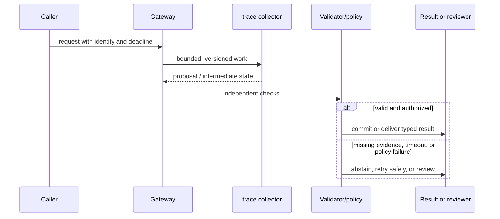

# Observability
Status: emerging
Sources: [OpenTelemetry traces](https://opentelemetry.io/docs/concepts/observability-primer/)

## In one sentence
Observability links traces, metrics, and logs to explain model, tool, cost, and outcome behavior.

## Background: what existed before
Traditional service logs rarely connected an LLM call to retrieval, tools, tokens, or user result.

## What changed and why now
Distributed traces can carry a request ID across orchestration and inference spans. This month's focus is observability as an operable system boundary: its measurements and controls determine whether the capability survives contact with real traffic.

## Impact on current processing and architecture
Capture latency, token counts, model version, tool outcomes, and redacted errors with retention controls. A production path should carry version, tenant, latency, cost, and failure metadata beside the model result.

## Real-world applications and constraints
Use dashboards for TTFT, error rate, cache hits, retrieval recall proxies, and cost by route. Start with reversible, low-risk workloads; define SLOs, access controls, and an owner before expanding.

## Mental model
A trace is causal context across spans; correlation IDs connect events without storing raw secrets. Model the concept as a state transition with explicit inputs, outputs, authority, and failure handling.

## Prerequisites: a foundational primer

Know traces, spans, metrics, cardinality, redaction, event ordering, and correlation IDs. Payload logging is neither the only nor the safest form of evidence.

## What changed this month
The January 2026 learning map places observability alongside low-latency inference, adoption, and scientific collaboration. The linked source is the primary technical or governance reference for the concept; this lesson labels system-design implications as inferences.

## Engineering consequence

Define spans for admission, retrieval, inference, tool policy, execution, validation, and review. Record versions, IDs, lengths, cost, and state transitions while redacting payloads before export; retain security events under restricted access.

## Topic-specific design notes
Trace an AI request across gateway, retrieval, prompt assembly, model, tool, reviewer, and outcome spans. Use low-cardinality dimensions such as route and model version; hash or redact user identifiers and never put raw prompts in metric labels. Correlate token usage and cache status with latency and cost. Emit structured error types—timeout, policy rejection, provider error, parse failure—so retries can be bounded. The most valuable signal is downstream outcome, such as accepted extraction or corrected answer, not a dashboard of model calls alone. Define retention by data class.

## Topic-specific exercise and interview prompts
Create a trace list with span names and durations, calculate total and slowest span, and redact a fake prompt before logging. Add an error counter grouped by type.

What is an observability blind spot? A: A missing downstream outcome can make a successful API call look like success. Why avoid high-cardinality labels? A: They make metrics expensive and hard to aggregate.

## Limits and failure modes

A missing correlation ID fragments an incident; high-cardinality payload labels destroy metrics; an exporter can receive secrets before redaction. Test cancellation and exporter failure, sample ordinary traces, and retain policy violations.

## Mini exercise (15–30 min)

Instrument a retrieval-to-validator stub with parent/child spans, error classes, counts, and a redaction test. Verify a dependency failure still yields a final state.

## Tracing one AI request across changing components

AI observability connects a request's input contract, model call, retrieval, tools, validation, and user outcome. OpenTelemetry's trace model is useful because a trace has spans with timing and attributes, while metrics aggregate behavior and logs carry events. For AI systems, the temptation is to record every prompt and output. That creates a sensitive shadow database and still may not explain an incident if versions and state are missing.

Define a trace schema before instrumenting. Carry a correlation ID, tenant-safe subject, route, model snapshot, prompt/schema/index versions, token counts, queue time, dependency status, and final state. Record hashes, IDs, lengths, and error classes by default; sample payloads only under restricted, time-limited access. Span boundaries should follow real stages: admission, retrieval, prefill/decode, tool proposal, authorization, execution, validation, review, and persistence. A single total timer cannot distinguish a provider queue from a slow reviewer.

Metrics need a relationship to outcomes. Track TTFT, completion latency, error and retry classes, cost, cache hits, retrieval recall proxies, validator failures, review time, corrections, and side-effect success. Correlate them by route and protected slice, but do not infer causation from a dashboard alone. Logs should be structured and immutable enough to reconstruct state transitions; event ordering matters when a timeout races with a completion.

Failure telemetry needs privacy and sampling policies. Always retain security violations, authorization denials, and data-loss alerts; sample ordinary successful payload-free traces. Redact secrets before exporters and test redaction with fixtures containing tokens, URLs, and personal data. A vendor collector may have its own retention, so include it in the data inventory. Trace IDs must not be guessable access tokens.

For a document assistant incident, a trace shows retrieval returned an old policy version, the context assembler omitted the effective-date field, and the validator accepted the generated answer. The fix spans index freshness, manifest tests, and a new protected fixture. Without linked spans, each team might blame the model. Observability is valuable when it shortens that path from symptom to owned corrective action.

## Impact on current data processing

The data path is `request → trace collector → validator/policy → outcome`. The `redacted request trace` is versioned and scoped to its owner; it is not treated as a durable memory or permission. Admission records the input shape and deadline, processing emits typed intermediate state, and the final result carries provenance and a reason code. This makes a change measurable at the boundary where spans and outcome events become an application decision.

Operationally, keep the concept-specific resource bounded. Measure the signal that matters for spans and outcome events alongside p95 latency, error class, cost, and downstream correction. Under overload or missing evidence, return a typed degraded state or queue for review. Retrying must preserve idempotency and correlation. Any cache, index, trace, or derived artifact inherits tenant isolation and retention rules. These are engineering inferences from the source, not guarantees supplied by it.

## Architecture and data flow

```mermaid
flowchart LR
  A[Caller / source data] --> B[Admission and identity]
  B --> C[trace collector]
  C --> D[Independent validation]
  D --> E[Scoped result or review]
  E --> F[Outcome telemetry]
  classDef source fill:#fee2e2,stroke:#dc2626,color:#450a0a
  classDef gate fill:#dbeafe,stroke:#2563eb,color:#172554
  classDef work fill:#fef3c7,stroke:#d97706,color:#451a03
  classDef result fill:#dcfce7,stroke:#16a34a,color:#14532d
  class A source
  class B,D gate
  class C work
  class E,F result
```



The source or caller remains outside the worker's trust assumptions. Admission attaches tenant, purpose, deadline, and version; the worker transforms spans and outcome events; validation checks invariants that generated or approximate computation cannot establish. Only the final policy transition can produce a side effect. Telemetry records identifiers and measurements without copying sensitive payloads by default.

## Sequence and failure flow



A missing correlation ID fragments an incident; high-cardinality payload labels destroy metrics; an exporter can receive secrets before redaction. Test cancellation and exporter failure, sample ordinary traces, and retain policy violations.

## Design walkthrough: operating spans and outcome events safely

Take one realistic request and follow it through the system. The caller supplies an identity, purpose, input, and deadline; admission validates those fields before allocating work. The trace collector receives only the fields needed for its computation and emits a proposal, measurement, or transformed state. It does not get ambient credentials, an unbounded queue, or permission to redefine the contract. The gateway stores the redacted request trace identifier and the versions that produced it, then invokes checks owned by code outside the probabilistic or approximate step.

A document-assistant trace can show an old index version, omitted effective date, and accepted validator state in one timeline. The owner can then fix freshness and regression tests without searching raw prompts.

Now follow a difficult request. An unusually large spans and outcome events value may exhaust memory or context; a rare language, malformed record, stale source, or cancelled client may invalidate assumptions. Admission should reject or split before expensive work, and the reason must be observable. If a dependency times out, preserve the deadline and return an unavailable state rather than retrying forever. If work may have reached an external system, query its receipt before replay. These transitions are different from model uncertainty and should have different metrics and runbooks.

Multi-tenant operation adds a second axis. Namespaces, ACL filters, quotas, and deletion jobs apply to the redacted request trace as well as to the visible answer. A cache key, vector, trace, queue item, or temporary file must carry an owner or an explicit public scope. Test a request that has a valid shape but another tenant's identifier; the expected behavior is a denial, not an empty lookup that leaks timing. Test revocation between planning and execution. The worker should observe the new policy at the side-effect boundary.

Capacity planning should use production-shaped distributions. Measure short and long inputs, cold and warm workers, concurrent tenants, cancellations, and retries. Report p50 and p95 or p99 latency, memory, queue age, cost, and accepted outcome rate. For spans and outcome events, add a domain metric: page or token fit, cache-page pressure, batch wait, evidence recall, field validity, review agreement, or conversion. Averages hide the cases that drive support tickets. A canary is successful only when protected slices remain inside their thresholds.

Finally, make a change record. State what the source actually establishes, what this integration infers, which baseline was used, and what would trigger rollback. Pin the model or library, schema, policy, and data versions. Keep a small reproducible fixture and a separate protected case. At launch, sample outcomes and inspect corrections; after launch, add every incident to the regression set. The owner should be able to answer what the system saw, which decision it made, why it was allowed, and how to undo it without searching through raw customer payloads.

## Real-world application and trade-off analysis

The strongest use case is one in which spans and outcome events are expensive or difficult to manage manually and the consequence of a wrong result is bounded. Start with read-only or draft work, then add a reviewed transition. Estimate total cost, including retrieval, model work, retries, storage, reviewer time, and corrections. Latency targets should be stated separately for interactive and batch routes. A cheaper or faster implementation is not an improvement if it moves errors into a high-cost downstream queue.

More span detail shortens diagnosis but increases storage and privacy cost. Payloads improve forensic context while expanding breach impact; IDs and hashes are safer but may require a controlled replay path.

## Limits and failure modes specific to this concept

Watch for malformed inputs, version drift, resource exhaustion, cross-tenant state, stale artifacts, and silent degraded paths. Test the boundary conditions that are unique to spans and outcome events: unusually large or rare values, cancellations, duplicate requests, partial dependencies, and adversarial content. A passing happy-path demo says little about tail behavior. Define an escalation owner and rollback artifact before enabling the feature. If the source describes a capability, label it as a fact; claims about production quality, safety, or value are inferences requiring local evidence.

## Runnable low-cost example

```python
from contextlib import contextmanager
import time, uuid

@contextmanager
def span(name, trace=None):
    trace = trace or str(uuid.uuid4()); start = time.perf_counter()
    try: yield {"trace": trace, "span": name}
    finally: print({"trace": trace, "span": name, "ms": round((time.perf_counter()-start)*1000, 2)})

with span("gateway") as s:
    with span("validator", s["trace"]): pass
```

The context-manager example prints local span durations. It does not implement OpenTelemetry transport, sampling, exporters, retention, or secret redaction policy.

## Mini exercise (15–30 min)

Instrument a local retrieval→model-stub→validator flow with one trace ID and child spans. Add error classes, token counts, and redaction. Verify a failing dependency leaves a trace with a final state and no raw secret.

## Build it locally

1. Save `trace_demo.py` with parent and child spans.
2. Add route, model, source-version, token, and state attributes.
3. Redact a fixture containing a token and personal identifier before export.
4. Inject a dependency exception and assert the trace closes with an error state.
5. Compare payload-free sampling with restricted incident retention.

## Interview Q&A

**Q: What is a trace for?** A: Following one request across stages and dependencies with timing and state.
**Q: Why not log every prompt?** A: Payloads may contain sensitive data and are not required for every diagnostic question.
**Q: What should be retained always?** A: Security, authorization, data-loss, and operational failure evidence under access control.
**Q: Why separate metrics and logs?** A: Metrics show aggregate trends; events and spans explain an individual outcome.

## Glossary

- **Span:** A timed, named operation within a trace.
- **Trace:** A correlated set of spans and events for one request or workflow.
- **Cardinality:** The number of distinct values in a metric label.
- **Redaction:** Removing or masking sensitive fields before storage or export.

## References

[OpenTelemetry traces](https://opentelemetry.io/docs/concepts/observability-primer/)
- [January 2026 lesson map](README.md)

## Claim ledger

| Claim | Source | Fact or inference |
|---|---|---|
| OpenTelemetry describes observability as understanding a system’s internal state from the data it emits. | [OpenTelemetry traces](https://opentelemetry.io/docs/concepts/observability-primer/) | Fact, scoped to source |
| The architecture, metrics, and failure handling in this lesson are suitable engineering consequences to test locally. | [OpenTelemetry traces](https://opentelemetry.io/docs/concepts/observability-primer/) | Inference |
| The Python example illustrates a boundary and does not establish provider-scale reliability or safety. | [OpenTelemetry traces](https://opentelemetry.io/docs/concepts/observability-primer/) | Inference |
