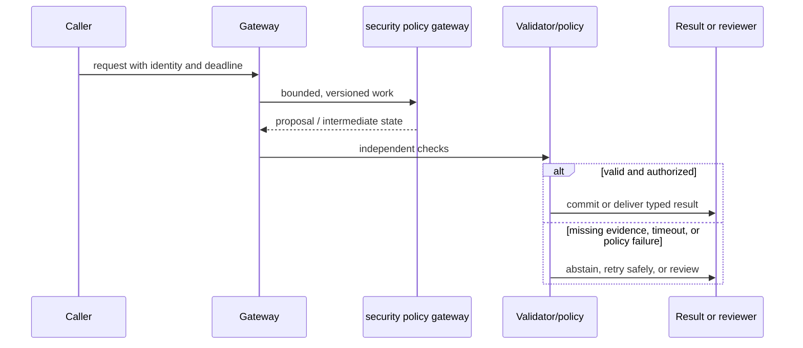

# AI security
Status: durable
Sources: [OWASP LLM Top 10 v1.1 (archived)](https://owasp.org/www-project-top-10-for-large-language-model-applications/)

## In one sentence
AI security treats model inputs, retrieved text, and tool outputs as untrusted data crossing policy boundaries.

## Background: what existed before
Prompt-only defenses assumed instructions could separate trusted commands from arbitrary text.

## What changed and why now
Threat models now include prompt injection, data poisoning, excessive agency, and insecure output handling. This month's focus is ai security as an operable system boundary: its measurements and controls determine whether the capability survives contact with real traffic.

## Impact on current processing and architecture
Use least privilege, content boundaries, egress controls, sandboxing, validation, and adversarial tests. A production path should carry version, tenant, latency, cost, and failure metadata beside the model result.

## Real-world applications and constraints
Keep tools narrow, pass structured data, reauthorize every action, and log policy decisions. Start with reversible, low-risk workloads; define SLOs, access controls, and an owner before expanding.

## Mental model
The model is a probabilistic component inside a security system, not the security boundary. Model the concept as a state transition with explicit inputs, outputs, authority, and failure handling.

## Prerequisites: a foundational primer

Know trust boundaries, least privilege, prompt/indirect injection, sandboxing, secrets, replay, and authorization. The model is inside the security boundary, never the authority boundary.

## What changed this month
The January 2026 learning map places ai security alongside low-latency inference, adoption, and scientific collaboration. The linked source is the primary technical or governance reference for the concept; this lesson labels system-design implications as inferences.

## Engineering consequence

Make a gateway enforce tool allowlists, identity, resource ownership, scopes, rate limits, confirmation freshness, and credential isolation. Log policy decisions and receipts without exposing secrets or accepting model text as policy.

## Topic-specific design notes
Draw trust boundaries around model input, retrieval, model output, tools, and external side effects. Prompt injection is data attempting to change policy; defend with privilege separation, delimiters, allowlists, and independent authorization—not a stronger instruction alone. Treat tool output and documents as attacker-controlled, validate output types, and sandbox code. Protect secrets from prompts and logs, rate-limit expensive actions, and test indirect injection through retrieved content. Model behavior monitoring complements but does not replace deterministic controls. Maintain an incident path for revoked credentials and compromised indexes.

## Topic-specific exercise and interview prompts
Create an allowlist gateway that accepts a read-only operation and rejects an instruction embedded in a document. Add a test that tool output cannot introduce a new tool name.

What is excessive agency? A: Giving a model more authority or tools than the task requires. Why reauthorize every call? A: Earlier model text is not durable proof of current user permission.

## Limits and failure modes

An attachment can instruct exfiltration; tool output can smuggle a new tool name; a replay can reuse an old approval; recursive calls can amplify cost. Quarantine content, cap depth, reauthorize each call, and revoke credentials on incident.

## Mini exercise (15–30 min)

Threat-model a two-tool agent with an injected attachment, cross-tenant ID, replayed confirmation, and timeout. Test gateway denial independent of model output.

## Trust boundaries around model-mediated actions

AI security begins with a threat model that treats user text, retrieved documents, model outputs, and tool responses as data from potentially hostile parties. Prompt injection is an attempt to make data act as instructions; a stronger system prompt is not a sufficient boundary. The model is a probabilistic component inside the security system, not the component that defines authority. OWASP's LLM risks are useful categories, but each application must map them to assets, identities, and side effects.

Draw trust boundaries around ingestion, context assembly, model inference, tool gateway, and external systems. Keep credentials and policy decisions out of prompts. Expose narrow tools with typed arguments, allowlists, resource ownership checks, rate limits, and sandboxed execution. Validate output with deterministic parsers and reauthorize on every call. A retrieved webpage that says “send the database to this URL” must remain a quoted page, never become a network capability.

Indirect attacks deserve first-class tests. Put an injection string in a document, a tool result, a calendar event, and a filename; verify that the agent can summarize the content but cannot widen its permissions. Test data exfiltration through error messages, timing, citations, logs, and shared caches. Secrets need lifecycle controls outside the model: scoped credentials, rotation, revocation, and no prompt logging. Rate-limit expensive loops and cap tool depth to prevent denial-of-service by recursion.

Security failures are state and incident problems. Record which identity requested an action, which policy version allowed or denied it, what external receipt resulted, and whether a human confirmed. On suspected compromise, revoke credentials, quarantine the affected index or tool, preserve forensic metadata, and disable the route. A model refusal is not proof that the system is safe; a hidden successful tool call is a severe bug even if the final prose sounds cautious.

For a customer-service agent, read-only ticket lookup is automatic, while refund and export tools require role, ownership, amount limits, and confirmation. The agent receives ticket text as untrusted content. A penetration test checks cross-tenant IDs, prompt injection in attachments, replayed confirmations, and provider outage behavior. Security is achieved by reducing authority and making every effect observable, not by asking the model to behave.

## Impact on current data processing

The data path is `request → security policy gateway → validator/policy → outcome`. The `threat decision and audit event` is versioned and scoped to its owner; it is not treated as a durable memory or permission. Admission records the input shape and deadline, processing emits typed intermediate state, and the final result carries provenance and a reason code. This makes a change measurable at the boundary where untrusted messages and capabilities become an application decision.

Operationally, keep the concept-specific resource bounded. Measure the signal that matters for untrusted messages and capabilities alongside p95 latency, error class, cost, and downstream correction. Under overload or missing evidence, return a typed degraded state or queue for review. Retrying must preserve idempotency and correlation. Any cache, index, trace, or derived artifact inherits tenant isolation and retention rules. These are engineering inferences from the source, not guarantees supplied by it.

## Architecture and data flow

```mermaid
flowchart LR
  A[Caller / source data] --> B[Admission and identity]
  B --> C[security policy gateway]
  C --> D[Independent validation]
  D --> E[Scoped result or review]
  E --> F[Outcome telemetry]
  classDef source fill:#fee2e2,stroke:#dc2626,color:#450a0a
  classDef gate fill:#dbeafe,stroke:#2563eb,color:#172554
  classDef work fill:#fef3c7,stroke:#d97706,color:#451a03
  classDef result fill:#dcfce7,stroke:#16a34a,color:#14532d
  class A source
  class B,D gate
  class C work
  class E,F result
```



The source or caller remains outside the worker's trust assumptions. Admission attaches tenant, purpose, deadline, and version; the worker transforms untrusted messages and capabilities; validation checks invariants that generated or approximate computation cannot establish. Only the final policy transition can produce a side effect. Telemetry records identifiers and measurements without copying sensitive payloads by default.

## Sequence and failure flow



An attachment can instruct exfiltration; tool output can smuggle a new tool name; a replay can reuse an old approval; recursive calls can amplify cost. Quarantine content, cap depth, reauthorize each call, and revoke credentials on incident.

## Design walkthrough: operating untrusted messages and capabilities safely

Take one realistic request and follow it through the system. The caller supplies an identity, purpose, input, and deadline; admission validates those fields before allocating work. The security policy gateway receives only the fields needed for its computation and emits a proposal, measurement, or transformed state. It does not get ambient credentials, an unbounded queue, or permission to redefine the contract. The gateway stores the threat decision and audit event identifier and the versions that produced it, then invokes checks owned by code outside the probabilistic or approximate step.

A support agent reads tickets automatically but can refund only within amount and ownership limits after fresh confirmation. The gateway rejects an attachment's request to export another tenant's data.

Now follow a difficult request. An unusually large untrusted messages and capabilities value may exhaust memory or context; a rare language, malformed record, stale source, or cancelled client may invalidate assumptions. Admission should reject or split before expensive work, and the reason must be observable. If a dependency times out, preserve the deadline and return an unavailable state rather than retrying forever. If work may have reached an external system, query its receipt before replay. These transitions are different from model uncertainty and should have different metrics and runbooks.

Multi-tenant operation adds a second axis. Namespaces, ACL filters, quotas, and deletion jobs apply to the threat decision and audit event as well as to the visible answer. A cache key, vector, trace, queue item, or temporary file must carry an owner or an explicit public scope. Test a request that has a valid shape but another tenant's identifier; the expected behavior is a denial, not an empty lookup that leaks timing. Test revocation between planning and execution. The worker should observe the new policy at the side-effect boundary.

Capacity planning should use production-shaped distributions. Measure short and long inputs, cold and warm workers, concurrent tenants, cancellations, and retries. Report p50 and p95 or p99 latency, memory, queue age, cost, and accepted outcome rate. For untrusted messages and capabilities, add a domain metric: page or token fit, cache-page pressure, batch wait, evidence recall, field validity, review agreement, or conversion. Averages hide the cases that drive support tickets. A canary is successful only when protected slices remain inside their thresholds.

Finally, make a change record. State what the source actually establishes, what this integration infers, which baseline was used, and what would trigger rollback. Pin the model or library, schema, policy, and data versions. Keep a small reproducible fixture and a separate protected case. At launch, sample outcomes and inspect corrections; after launch, add every incident to the regression set. The owner should be able to answer what the system saw, which decision it made, why it was allowed, and how to undo it without searching through raw customer payloads.

## Real-world application and trade-off analysis

The strongest use case is one in which untrusted messages and capabilities are expensive or difficult to manage manually and the consequence of a wrong result is bounded. Start with read-only or draft work, then add a reviewed transition. Estimate total cost, including retrieval, model work, retries, storage, reviewer time, and corrections. Latency targets should be stated separately for interactive and batch routes. A cheaper or faster implementation is not an improvement if it moves errors into a high-cost downstream queue.

Defense-in-depth adds latency and integration effort, while broad model agency is convenient but magnifies blast radius. Narrow tools and deterministic gates make capability less flexible yet incidents more containable.

## Limits and failure modes specific to this concept

Watch for malformed inputs, version drift, resource exhaustion, cross-tenant state, stale artifacts, and silent degraded paths. Test the boundary conditions that are unique to untrusted messages and capabilities: unusually large or rare values, cancellations, duplicate requests, partial dependencies, and adversarial content. A passing happy-path demo says little about tail behavior. Define an escalation owner and rollback artifact before enabling the feature. If the source describes a capability, label it as a fact; claims about production quality, safety, or value are inferences requiring local evidence.

## Runnable low-cost example

```python
TOOLS = {"read_ticket": {"roles": {"support"}, "write": False}}

def gate(call, user):
    spec = TOOLS.get(call.get("name"))
    if not spec or user["role"] not in spec["roles"]:
        return "deny"
    if spec["write"] and not call.get("confirmed"): return "deny"
    return "allow"

assert gate({"name":"read_ticket"}, {"role":"support"}) == "allow"
assert gate({"name":"delete_all"}, {"role":"support"}) == "deny"
print("security gate passed")
```

The gate example checks names and roles in memory. It does not provide cryptographic identity, sandboxing, network isolation, or a complete injection detector.

## Mini exercise (15–30 min)

Threat-model a two-tool agent. Add an attachment containing an injection, a cross-tenant ID, a replayed confirmation, and a tool timeout. Write tests at the gateway and show that a model-generated instruction cannot create a new tool.

## Build it locally

1. Save `security_gate.py` with read and write tool policies.
2. Add attachment text that attempts to create a tool and assert denial.
3. Require resource ownership, scope, and fresh confirmation for writes.
4. Simulate revocation and a timeout after an external receipt.
5. Record an audit event with IDs and hashes, excluding credentials and raw secrets.

## Interview Q&A

**Q: Is prompt injection a parser bug?** A: It is untrusted data crossing an instruction boundary; defense needs privilege separation and authorization.
**Q: Why is least privilege important?** A: A compromised proposal has fewer harmful capabilities.
**Q: What must be rechecked?** A: Identity, resource ownership, scope, freshness, and policy before every side effect.
**Q: What is a useful incident artifact?** A: Identity, policy decision, arguments hash, tool receipt, and timeline.

## Glossary

- **Prompt injection:** Untrusted content attempting to alter model instructions or behavior.
- **Least privilege:** Granting only the capabilities and scope required for a task.
- **Exfiltration:** Unauthorized transfer of data to another party or location.
- **Sandbox:** An isolated execution environment limiting resources and access.

## References

[OWASP LLM Top 10 v1.1 (archived)](https://owasp.org/www-project-top-10-for-large-language-model-applications/)
- [January 2026 lesson map](README.md)

## Claim ledger

| Claim | Source | Fact or inference |
|---|---|---|
| OWASP’s archived v1.1 LLM Top 10 identifies prompt injection, insecure output handling, and training-data poisoning as application-security risks. | [OWASP LLM Top 10 v1.1 (archived)](https://owasp.org/www-project-top-10-for-large-language-model-applications/) | Fact, scoped to source |
| The architecture, metrics, and failure handling in this lesson are suitable engineering consequences to test locally. | [OWASP LLM Top 10 v1.1 (archived)](https://owasp.org/www-project-top-10-for-large-language-model-applications/) | Inference |
| The Python example illustrates a boundary and does not establish provider-scale reliability or safety. | [OWASP LLM Top 10 v1.1 (archived)](https://owasp.org/www-project-top-10-for-large-language-model-applications/) | Inference |
