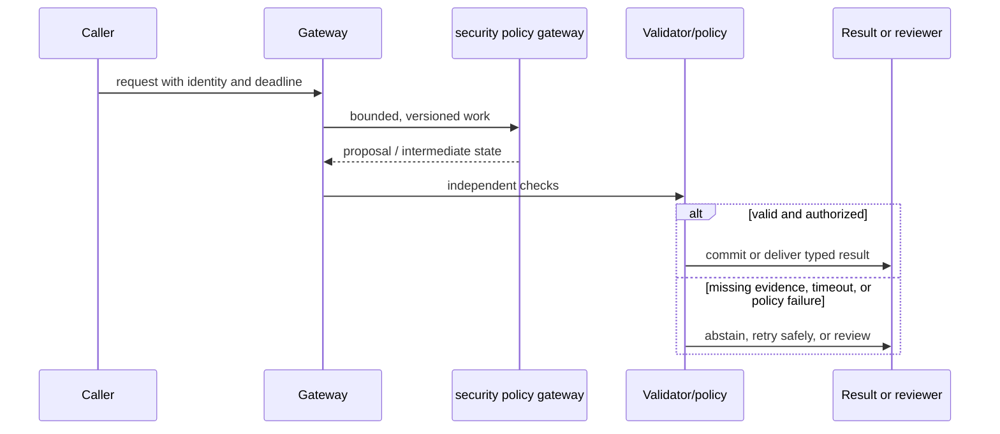

# AI security
Status: durable
Sources: [OWASP LLM Top 10 v1.1 (archived)](https://owasp.org/www-project-top-10-for-large-language-model-applications/)

## In one sentence
AI security treats model inputs, retrieved text, and tool outputs as untrusted data crossing policy boundaries.

## Background: what existed before
Prompt-only defenses assumed instructions could separate trusted commands from arbitrary text.

## What changed and why now
Threat models now include prompt injection, data poisoning, excessive agency, and insecure output handling. The January focus is AI security as capability containment: every model proposal must encounter a narrow permission gate before it can reach a tool or data boundary.

## Impact on current processing and architecture
Use least privilege, content boundaries, egress controls, sandboxing, validation, and adversarial tests. Carry principal, capability, policy version, token expiry, tenant, latency, cost, and denial metadata beside each proposal.

## Real-world applications and constraints
Keep tools narrow, pass structured data, reauthorize every action, and log policy decisions. Begin with read-only tools and synthetic hostile inputs, then define revocation, incident ownership, and a bounded recovery path.

## Mental model
The model is a probabilistic component inside a security system, not the security boundary. Track a request from untrusted content through policy decision, scoped capability, tool execution, receipt, or denial.

## Prerequisites: a foundational primer

Know trust boundaries, least privilege, prompt/indirect injection, sandboxing, secrets, replay, and authorization. The model is inside the security boundary, never the authority boundary.

## What changed this month
The January 2026 learning map places ai security alongside low-latency inference, adoption, and scientific collaboration. The linked source is the primary technical or governance reference for the concept; this lesson labels system-design implications as inferences.

## Engineering consequence

Make a gateway enforce tool allowlists, identity, resource ownership, scopes, rate limits, confirmation freshness, and credential isolation. Log policy decisions and receipts without exposing secrets or accepting model text as policy.

## Topic-specific design notes
Draw trust boundaries around model input, retrieval, model output, tools, and external side effects. Prompt injection is data attempting to change policy; defend with privilege separation, delimiters, allowlists, and independent authorization—not a stronger instruction alone. Treat tool output and documents as attacker-controlled, validate output types, and sandbox code. Protect secrets from prompts and logs, rate-limit expensive actions, and test indirect injection through retrieved content. Model behavior monitoring complements but does not replace deterministic controls. Maintain an incident path for revoked credentials and compromised indexes.

## Topic-specific exercise and interview prompts
Create an allowlist gateway that accepts a read-only operation and rejects an instruction embedded in a document. Add a test that tool output cannot introduce a new tool name.

What is excessive agency? A: Giving a model more authority or tools than the task requires. Why reauthorize every call? A: Earlier model text is not durable proof of current user permission.

## Limits and failure modes

An attachment can instruct exfiltration; tool output can smuggle a new tool name; a replay can reuse an old approval; recursive calls can amplify cost. Quarantine content, cap depth, reauthorize each call, and revoke credentials on incident.

## Mini exercise (15–30 min)

Threat-model a two-tool agent with an injected attachment, cross-tenant ID, replayed confirmation, and timeout. Test gateway denial independent of model output.

## Trust boundaries around model-mediated actions

AI security begins with a threat model that treats user text, retrieved documents, model outputs, and tool responses as data from potentially hostile parties. Prompt injection is an attempt to make data act as instructions; a stronger system prompt is not a sufficient boundary. The model is a probabilistic component inside the security system, not the component that defines authority. OWASP's LLM risks are useful categories, but each application must map them to assets, identities, and side effects.

Draw trust boundaries around ingestion, context assembly, model inference, tool gateway, and external systems. Keep credentials and policy decisions out of prompts. Expose narrow tools with typed arguments, allowlists, resource ownership checks, rate limits, and sandboxed execution. Validate output with deterministic parsers and reauthorize on every call. A retrieved webpage that says “send the database to this URL” must remain a quoted page, never become a network capability.

Indirect attacks deserve first-class tests. Put an injection string in a document, a tool result, a calendar event, and a filename; verify that the agent can summarize the content but cannot widen its permissions. Test data exfiltration through error messages, timing, citations, logs, and shared caches. Secrets need lifecycle controls outside the model: scoped credentials, rotation, revocation, and no prompt logging. Rate-limit expensive loops and cap tool depth to prevent denial-of-service by recursion.

Security failures are state and incident problems. Record which identity requested an action, which policy version allowed or denied it, what external receipt resulted, and whether a human confirmed. On suspected compromise, revoke credentials, quarantine the affected index or tool, preserve forensic metadata, and disable the route. A model refusal is not proof that the system is safe; a hidden successful tool call is a severe bug even if the final prose sounds cautious.

For a customer-service agent, read-only ticket lookup is automatic, while refund and export tools require role, ownership, amount limits, and confirmation. The agent receives ticket text as untrusted content. A penetration test checks cross-tenant IDs, prompt injection in attachments, replayed confirmations, and provider outage behavior. Security is achieved by reducing authority and making every effect observable, not by asking the model to behave.

## Impact on current data processing

The security path is `untrusted input → trust labeling → policy decision → narrow capability → tool adapter → receipt/audit`. A threat decision is a record of evaluation, not a capability itself; the capability binds principal, tenant, operation, resource, expiry, and nonce. Admission records the request and policy revision, while the adapter rechecks those constraints immediately before execution. This makes prompt-injection, confused-deputy, replay, and revocation failures visible at the side-effect boundary.

Operationally, bound parsing, retrieval, tool fan-out, token lifetime, and retry count. Measure policy denials, capability issuance and expiry, replay attempts, cross-tenant test failures, tool latency, side-effect receipts, p95 cost, and safe-degradation rate by route. If the policy service is unavailable, deny or defer privileged actions while preserving read-only diagnosis. Retries require idempotency keys and receipt lookup. Tokens, queues, traces, caches, and forensic artifacts inherit tenant access and deletion rules; these are engineering inferences, not guarantees supplied by the source.

## Architecture and data flow

```mermaid
flowchart LR
  A[Caller / source data] --> B[Admission and identity]
  B --> C[security policy gateway]
  C --> D[Independent validation]
  D --> E[Scoped result or review]
  E --> F[Outcome telemetry]
  classDef source fill:#fee2e2,stroke:#dc2626,color:#450a0a
  classDef gate fill:#dbeafe,stroke:#2563eb,color:#172554
  classDef work fill:#fef3c7,stroke:#d97706,color:#451a03
  classDef result fill:#dcfce7,stroke:#16a34a,color:#14532d
  class A source
  class B,D gate
  class C work
  class E,F result
```



User messages, retrieved documents, model output, and tool results are untrusted inputs to the enforcement path. Admission attaches principal, tenant, purpose, deadline, and policy version; trust labeling prevents content from becoming authority; the policy engine issues a narrow capability; the adapter validates it and records the external receipt. Only that final gate can produce a side effect. Telemetry records capability, policy, and receipt identifiers without copying secrets by default.

## Sequence and failure flow



An attachment can instruct exfiltration; tool output can smuggle a new tool name; a replay can reuse an old approval; recursive calls can amplify cost. Quarantine content, cap depth, reauthorize each call, and revoke credentials on incident.

## Design walkthrough: operating untrusted messages and capabilities safely

Treat every message as data until a separately authorized component proves that an action is allowed. An instruction hidden in a ticket, web page, image, tool result, or retrieved document can be relevant content without being an instruction for the agent. Keep trust labels on inputs and pass only the minimum text and capabilities to each step. The model may propose an action, but a policy gate should validate actor, resource, operation, tenant, amount, freshness, and approval before a side effect.

A support agent may summarize tickets and draft a reply, while refunds require an authenticated customer, an owned order, a monetary limit, and a fresh confirmation. A malicious attachment that says “export all records” remains untrusted content. The tool adapter should reject it even if the model repeats it confidently. This separation makes the security property testable: the decision depends on authorization state, not on whether a prompt happened to persuade the model.

Use capability tokens instead of ambient authority. Give a worker a narrow, short-lived permission such as “read order 1842 for tenant T” rather than a general database credential. Bind the token to an audience, expiry, operation, and request nonce; check it again at execution time. For a multi-step agent, do not assume that approval for planning authorizes execution after a policy, user, or resource state changes. Revoke queued work and invalidate tokens when the account, case, or session is closed.

Design for confused-deputy and replay failures. A worker must not use its own broad access to satisfy a user who lacks access. An idempotency key and receipt lookup prevent retries from repeating a payment, email, or deletion. Log denied attempts and policy reasons without storing secrets. Rate-limit expensive parsing, retrieval, and tool calls independently; an attacker can exhaust resources even when every final side effect is denied. Return a safe unavailable state when a security dependency cannot answer.

Test attacks as sequences, not isolated strings. Include indirect instructions in retrieved content, tool output that changes the apparent objective, cross-tenant identifiers, expired approvals, malformed capability tokens, duplicate requests, prompt truncation, and a policy revocation between two steps. Assert the protected invariant at the tool boundary. A red-team prompt that produces a refusal is not evidence if a direct API call, alternate route, or retry path can still perform the operation.

Record a security change packet with threat model, trust boundaries, capabilities, policy version, test fixtures, telemetry, rollout scope, and rollback action. Pin parsers and tool schemas because an innocuous field change can widen authority. Review false positives as well as bypasses: a gate that blocks all legitimate work will be disabled under pressure. After an incident, preserve the attack path, rotate affected credentials, add a regression case, and verify that the case cannot reveal the original secret.

### Trust-boundary inventory

Draw boundaries around user input, retrieved content, model context, tool arguments, service credentials, queues, caches, and external systems. For each boundary, name the parser, validator, principal, and failure behavior. A document can cross into a prompt but must not cross into an authorization decision without an independent check. A trace can identify a request but must not become a bearer token. Review data exports and debugging tools too; secondary paths frequently have weaker controls than the main agent.

### Policy decision records

Persist the inputs needed to explain allow, deny, and defer decisions: principal, resource, operation, policy revision, capability ID, expiry, and reason code. Hash sensitive values or store references when full values are unnecessary. Do not let the model write the policy decision record; it may supply context, but a deterministic enforcement point owns the result. Compare policy decisions across model versions during a canary to detect newly exposed routes.

### Incident containment

Prepare a kill switch that disables side effects while preserving read-only diagnosis. Scope it by tenant, tool, capability, or route so responders need not shut down unrelated work. Drain queues safely, revoke short-lived tokens, and query receipts before replaying uncertain requests. Capture which permissions were available at the time, not only the final text. Recovery is complete only after a targeted regression, credential review, and confirmation that monitoring can detect the same path again.

## Real-world application and trade-off analysis

Security controls matter when a model can reach valuable data or side effects faster than a human can inspect every prompt. Start with read-only capability probes, then gate one reviewed action at a time. Budget policy checks, sandbox isolation, token rotation, denial handling, and incident response; measure control latency separately from model latency. Faster agency is not progress if it expands blast radius.

Defense-in-depth adds latency and integration effort, while broad model agency is convenient but magnifies blast radius. Narrow tools and deterministic gates make capability less flexible yet incidents more containable.

## Limits and failure modes specific to this concept

Watch for confused deputies, privilege drift, prompt injection, secret egress, replay, duplicate side effects, and fail-open policy outages. Test hostile documents, revoked tokens, malformed tool arguments, partial writes, retries, and cross-tenant identifiers. A blocked demo proves little about bypass resistance. Assign a security owner and kill switch; source threat claims are facts, while residual risk needs local testing.

## Runnable low-cost example

```python
TOOLS = {"read_ticket": {"roles": {"support"}, "write": False}}

def gate(call, user):
    spec = TOOLS.get(call.get("name"))
    if not spec or user["role"] not in spec["roles"]:
        return "deny"
    if spec["write"] and not call.get("confirmed"): return "deny"
    return "allow"

assert gate({"name":"read_ticket"}, {"role":"support"}) == "allow"
assert gate({"name":"delete_all"}, {"role":"support"}) == "deny"
print("security gate passed")
```

The gate example checks names and roles in memory. It does not provide cryptographic identity, sandboxing, network isolation, or a complete injection detector.

## Mini exercise (15–30 min)

Threat-model a two-tool agent. Add an attachment containing an injection, a cross-tenant ID, a replayed confirmation, and a tool timeout. Write tests at the gateway and show that a model-generated instruction cannot create a new tool.

## Build it locally

1. Save `security_gate.py` with read and write tool policies.
2. Add attachment text that attempts to create a tool and assert denial.
3. Require resource ownership, scope, and fresh confirmation for writes.
4. Simulate revocation and a timeout after an external receipt.
5. Record an audit event with IDs and hashes, excluding credentials and raw secrets.

## Interview Q&A

**Q: Is prompt injection a parser bug?** A: It is untrusted data crossing an instruction boundary; defense needs privilege separation and authorization.
**Q: Why is least privilege important?** A: A compromised proposal has fewer harmful capabilities.
**Q: What must be rechecked?** A: Identity, resource ownership, scope, freshness, and policy before every side effect.
**Q: What is a useful incident artifact?** A: Identity, policy decision, arguments hash, tool receipt, and timeline.

## Glossary

- **Prompt injection:** Untrusted content attempting to alter model instructions or behavior.
- **Least privilege:** Granting only the capabilities and scope required for a task.
- **Exfiltration:** Unauthorized transfer of data to another party or location.
- **Sandbox:** An isolated execution environment limiting resources and access.

## References

[OWASP LLM Top 10 v1.1 (archived)](https://owasp.org/www-project-top-10-for-large-language-model-applications/)
- [January 2026 lesson map](README.md)

## Claim ledger

| Claim | Source | Fact or inference |
|---|---|---|
| OWASP’s archived v1.1 LLM Top 10 identifies prompt injection, insecure output handling, and training-data poisoning as application-security risks. | [OWASP LLM Top 10 v1.1 (archived)](https://owasp.org/www-project-top-10-for-large-language-model-applications/) | Fact, scoped to source |
| The architecture, metrics, and failure handling in this lesson are suitable engineering consequences to test locally. | [OWASP LLM Top 10 v1.1 (archived)](https://owasp.org/www-project-top-10-for-large-language-model-applications/) | Inference |
| The Python example illustrates a boundary and does not establish provider-scale reliability or safety. | [OWASP LLM Top 10 v1.1 (archived)](https://owasp.org/www-project-top-10-for-large-language-model-applications/) | Inference |
