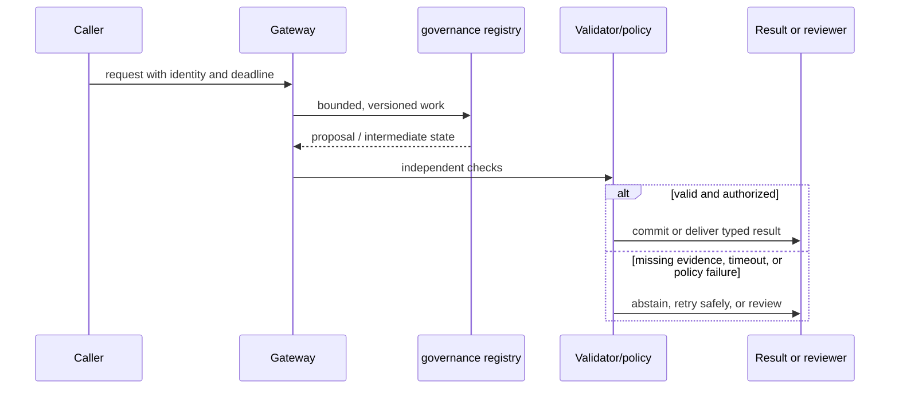

# Data governance
Status: watch
Sources: [NIST Privacy Framework](https://www.nist.gov/privacy-framework)

## In one sentence
Data governance specifies retention, access, deletion, provenance, and purpose for AI inputs and outputs.

## Background: what existed before
Teams often copied prompts and outputs into logs and training stores without lifecycle ownership.

## What changed and why now
Governance makes data state explicit across collection, inference, storage, sharing, and deletion. The January focus is lineage as an operational control: teams must know which derived records inherit a source's purpose, access rules, and deletion request.

## Impact on current processing and architecture
Classify fields, minimize collection, enforce TTLs, audit access, and propagate deletion to indexes and caches. Carry asset ID, lineage version, tenant, purpose, retention deadline, processing latency, cost, and deletion status.

## Real-world applications and constraints
Use separate stores and keys for tenants, redact telemetry, and test deletion end to end. Begin with synthetic or low-sensitivity records, then assign data owners, jurisdiction rules, and an exception process before production ingestion.

## Mental model
Provenance records where data came from and what transformations occurred; retention is a policy, not a default. Follow an asset through classified, approved, transformed, served, restricted, and deleted states.

## Prerequisites: a foundational primer

Know data inventories, purpose limitation, ACLs, provenance, TTLs, derived data, legal holds, and deletion verification. Encryption does not answer who may use a derived vector or for how long.

## What changed this month
The January 2026 learning map places data governance alongside low-latency inference, adoption, and scientific collaboration. The linked source is the primary technical or governance reference for the concept; this lesson labels system-design implications as inferences.

## Engineering consequence

Register source, chunk, vector, cache, trace, output, evaluation, and backup assets with owner, purpose, tenant, access role, retention, lineage, and deletion target. Treat deletion as a graph job with verification.

## Topic-specific design notes
Create a data inventory covering raw prompts, attachments, outputs, traces, embeddings, caches, backups, and vendor copies. For each class define purpose, owner, retention, access role, deletion mechanism, and provenance fields. Data minimization means omitting fields that do not support the task, not merely encrypting everything. Deletion tests must follow derived artifacts: remove source, vector, cache, search result, and backup reference according to policy. Separate training consent from inference logging consent. Audit joins because a harmless-looking identifier can become sensitive when combined with another store.

## Topic-specific exercise and interview prompts
Define a record policy with `purpose`, `tenant`, `retention`, and `delete_at`; reject records lacking an owner and print the deletion targets for a tenant.

Why are embeddings governed data? A: They can preserve information about source content and remain queryable. Why record purpose? A: Retention and access need a reason that can be audited.

## Limits and failure modes

A deleted row can survive in a vector segment, backup, cache, or vendor copy; a legal hold can suspend expiry; a join can reveal sensitive identity. Track worker status, exceptions, and the exact scope that remains.

## Mini exercise (15–30 min)

Governance follows the data through transformations. A source document can create chunks, embeddings, caches, prompts, traces, evaluation fixtures, and backups, each with an owner and retention rule. Maintain lineage and tenant boundaries so an access request or deletion request can find derived copies. Purpose limitation also applies to diagnostics: retaining raw prompts “for debugging” may create a new use that was never approved. Verify deletion with a discoverability test and document vendor, archive, and legal-hold exceptions rather than claiming certainty from one database query.

Inventory five assets for one tenant, assign expiry, and execute a deletion plan that checks source, vector, cache, and evaluation discoverability afterward.

## Lifecycle controls for AI-derived data

Data governance makes every AI data asset accountable from collection to deletion. The inventory is larger than raw prompts: attachments, normalized text, embeddings, prompt caches, model outputs, traces, evaluation fixtures, backups, vendor copies, and reviewer annotations can all preserve information. NIST's Privacy Framework supplies a risk-management vocabulary; the engineering task is to attach purpose, owner, access, retention, provenance, and deletion behavior to concrete stores and jobs.

Minimization starts before inference. Collect only fields required for the stated task, separate identity from content where possible, and redact secrets before logs or evaluation. Consent or contractual purpose for inference is not automatically permission to train on the data. Tenant and role checks should be enforced at each store, including vector and cache layers. A harmless identifier can become sensitive when joined with billing or HR data, so review joins and derived features rather than classifying columns in isolation.

Deletion is a graph operation. Removing a source record may require deleting chunks, vectors, cache entries, summaries, eval copies, search snapshots, and backup references according to legal hold. Record a deletion request, target set, worker status, and verification result. If a vendor copy cannot be deleted immediately, document the retention contract and isolate it from new inference. Export and correction paths need the same lineage so a user can understand where a generated answer came from.

Governance also covers change. When an index, prompt, policy, or model changes, preserve source and transformation versions for reproducibility without retaining unnecessary content forever. Access logs should identify actor, purpose, fields, and outcome; alerts should flag unusual bulk reads or cross-tenant queries. Retention is a policy with an owner and expiry job, not a default “keep forever” setting.

For a recruiting assistant, candidate documents are parsed into a restricted store, embeddings inherit candidate and purpose metadata, and reviewer notes have a separate retention class. A deletion request triggers source, vector, cache, and evaluation cleanup; a test query verifies the candidate cannot be retrieved afterward. The assistant's output is a proposal, and the hiring decision remains governed by the organization's process. This is the difference between encryption at rest and usable governance.

## Impact on current data processing

The governed asset path is `source → classified asset → transformation job → derived asset → serving index → deletion/audit workflow`. Each node has an owner, purpose, sensitivity, retention state, and location; each edge records input digests, code or model version, timestamp, and actor. A deletion receipt describes graph coverage rather than claiming that one table row disappeared. Retrieval and export must consult the asset’s current access and retention state before using it.

Operationally, bound lineage fan-out, graph-query depth, deletion backlog, export size, and metadata retention. Measure orphan assets, broken edges, stale classifications, overdue retention jobs, cross-tenant joins, deletion coverage, and audit-query latency by asset class. If a dependency or vendor copy is unavailable, mark the request pending or exception and isolate the asset from new inference; never report verified deletion from a partial scan. Workers need idempotent task IDs and receipts. These controls are engineering inferences, not guarantees supplied by the source.

## Architecture and data flow

```mermaid
flowchart LR
  A[Caller / source data] --> B[Admission and identity]
  B --> C[governance registry]
  C --> D[Independent validation]
  D --> E[Scoped result or review]
  E --> F[Outcome telemetry]
  classDef source fill:#fee2e2,stroke:#dc2626,color:#450a0a
  classDef gate fill:#dbeafe,stroke:#2563eb,color:#172554
  classDef work fill:#fef3c7,stroke:#d97706,color:#451a03
  classDef result fill:#dcfce7,stroke:#16a34a,color:#14532d
  class A source
  class B,D gate
  class C work
  class E,F result
```



The source system, derived stores, and governance registry are separate trust boundaries. Admission attaches tenant, purpose, legal or policy basis, deadline, and source snapshot; the registry resolves permitted lineage; workers materialize or delete named assets; validators check scope, retention, and completeness. Only an authorized policy transition can expose or act on the result. Telemetry records asset, edge, job, and receipt IDs without copying sensitive values by default.

## Sequence and failure flow



A deleted row can survive in a vector segment, backup, cache, or vendor copy; a legal hold can suspend expiry; a join can reveal sensitive identity. Track worker status, exceptions, and the exact scope that remains.

## Design walkthrough: operating data assets and lineage edges safely

Govern an AI data asset as a living graph, not as one database table. Register raw inputs, cleaned records, chunks, embeddings, prompts, evaluations, outputs, and human corrections as separate asset classes. Each node needs an owner, purpose, sensitivity, location, retention rule, and quality state. Edges explain derivation, joins, model or index versions, and access scope. Without those edges, a deletion request or a surprising answer cannot be followed to the artifacts that reproduced it.

In a recruiting assistant, candidate documents, extracted fields, vectors, reviewer notes, and aggregate reports may have different purposes and retention periods. A candidate deletion request must find the original file, queue payloads, caches, vector records, backups, and derived evaluation examples. The system should return a verification receipt naming the checked asset classes and any legal or technical exception. “Deleted from the primary table” is not a complete deletion claim.

Make lineage write-once enough to be trusted while allowing corrections to metadata. A processing job records input digests, output IDs, code and model versions, schema, policy, timestamp, and actor. If a transformation samples or filters records, record the rule and count. If a vector index is rebuilt, link the new index to the source snapshot and mark the old index’s serving state. Keep lineage queries permission-aware: an auditor may need to prove derivation without seeing the underlying sensitive value.

Separate quality, access, and retention state. A stale record can remain legally retained but unsuitable for a current answer; a restricted record can be high quality but unavailable to one tenant; a quarantined artifact can be useful for incident analysis but forbidden from training. Enforce these states at ingestion, retrieval, export, and deletion boundaries. Test joins where one input is public and the other confidential, and test revocation after a derived artifact has already entered a queue.

Plan for propagation lag. Deleting a source may require asynchronous removal from caches, replicas, feature stores, vector indexes, training manifests, and backups. Expose pending, verified, and exception states, with an owner and deadline for each exception. A model already trained on a record may not be removable by deleting a row; the governance record must distinguish artifact deletion from model retraining or documented risk treatment. Never claim stronger erasure than the architecture can demonstrate.

Review a change packet before adding a new source or derived asset. Include purpose limitation, schema, sensitivity, owner, consumers, lineage edges, retention, access policy, deletion behavior, and quality checks. Monitor orphan assets, broken edges, unexpected cross-tenant joins, retention overdue counts, and lineage gaps. After an incident, preserve only the minimum redacted evidence needed to reproduce it and update the graph so the same dependency can be found next time.

### Asset contracts

An asset contract should state what a producer guarantees and what consumers must not assume. Define field meanings, units, null behavior, freshness, acceptable quality, permitted uses, and change notification. A dataset may be valid for aggregate trend analysis but prohibited for identity decisions. Contract tests should fail when a producer silently changes a field or drops a lineage edge. Keep sample records synthetic where possible, with controlled access to production exemplars.

### Deletion workflow

A deletion job first resolves the graph, then creates idempotent tasks for each materialized copy. Workers report found, removed, unavailable, or exception, with receipts linked to the request. Re-running the job must not recreate the asset from a stale queue message. Search indexes need tombstones or rebuild plans; caches need invalidation; exports need revocation. A reviewer should be able to inspect coverage without downloading the deleted content.

### Responsible reuse

Reuse requires checking purpose, consent or legal basis, jurisdiction, and access—not merely checking that a file is available. Derived labels and embeddings can preserve sensitive information even after obvious identifiers are stripped. Treat them as governed assets. If a source is used for evaluation, document whether it may enter training or prompt examples. Governance earns trust when it makes legitimate use easier to explain and unsafe reuse harder to perform.

## Real-world application and trade-off analysis

Governance is most valuable when one source feeds prompts, embeddings, evaluations, and reports whose ownership is otherwise hard to track. Start with an inventory and read-only access, then automate deletion and review gates. Budget cataloging, lineage capture, access reviews, storage, and deletion verification; separate ingest latency from compliance workflow time. Faster pipelines are not progress if they create untraceable copies.

Collecting less data reduces utility and debugging context but reduces exposure and deletion cost. Keeping rich lineage improves reproducibility while increasing governance surface and access-review work.

## Limits and failure modes specific to this concept

Watch for orphaned embeddings, unclassified fields, retention exceptions, deletion gaps, jurisdiction mismatch, access-log loss, and derived data that outlives its source. Test partial lineage, duplicate assets, backfills, revocation during transformation, and failed deletion propagation. A clean catalog view cannot prove every copy is governed. Assign an owner and deletion receipt; legal or safety conclusions require local evidence.

## Runnable low-cost example

```python
from datetime import date, timedelta

def register(asset):
    required = {"owner", "purpose", "tenant", "retention_days"}
    missing = required - asset.keys()
    if missing: raise ValueError("missing " + ",".join(sorted(missing)))
    return {**asset, "delete_at": date.today() + timedelta(days=asset["retention_days"])}

print(register({"owner":"search", "purpose":"support", "tenant":"acme", "retention_days":30}))
```

The registry function validates required metadata and computes a date. It does not delete a store, enforce legal holds, or prove a vendor or backup has forgotten data.

## Mini exercise (15–30 min)

Inventory a prompt, vector, cache, trace, and backup record. Assign purpose, owner, retention, access role, and deletion target. Implement a deletion plan and a post-delete query test that fails if any derived asset remains discoverable.

## Build it locally

1. Save `asset_registry.py` with source, vector, cache, trace, and backup records.
2. Assign owner, purpose, tenant, role, TTL, and lineage to each record.
3. Generate deletion targets and mark hold exceptions explicitly.
4. Simulate derived-store cleanup and query for residual discoverability.
5. Review access logs and document which copies require vendor confirmation.

## Interview Q&A

**Q: Why govern embeddings?** A: They remain queryable representations that can carry information about source data.
**Q: Why is deletion a graph?** A: Derived stores and copies can preserve the source after one row is removed.
**Q: What is purpose limitation?** A: Using collected data only for a defined, authorized purpose.
**Q: What makes a retention rule real?** A: An owner, expiry process, access control, and a verification test.

## Glossary

- **Provenance:** Where data came from and which transformations produced it.
- **Derived data:** A representation or result computed from another asset.
- **Retention:** How long a data asset may be kept for a stated purpose.
- **Legal hold:** A requirement to preserve specified data despite normal expiry.

## References

[NIST Privacy Framework](https://www.nist.gov/privacy-framework)
- [January 2026 lesson map](README.md)

## Claim ledger

| Claim | Source | Fact or inference |
|---|---|---|
| NIST’s Privacy Framework is a voluntary tool for identifying and managing privacy risk while protecting individuals’ privacy. | [NIST Privacy Framework](https://www.nist.gov/privacy-framework) | Fact, scoped to source |
| The architecture, metrics, and failure handling in this lesson are suitable engineering consequences to test locally. | [NIST Privacy Framework](https://www.nist.gov/privacy-framework) | Inference |
| The Python example illustrates a boundary and does not establish provider-scale reliability or safety. | [NIST Privacy Framework](https://www.nist.gov/privacy-framework) | Inference |
