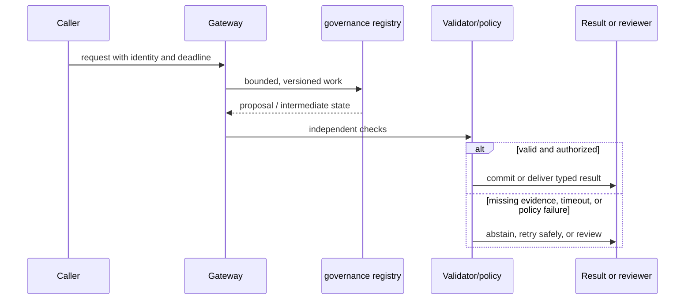

# Data governance
Status: watch
Sources: [NIST Privacy Framework](https://www.nist.gov/privacy-framework)

## In one sentence
Data governance specifies retention, access, deletion, provenance, and purpose for AI inputs and outputs.

## Background: what existed before
Teams often copied prompts and outputs into logs and training stores without lifecycle ownership.

## What changed and why now
Governance makes data state explicit across collection, inference, storage, sharing, and deletion. This month's focus is data governance as an operable system boundary: its measurements and controls determine whether the capability survives contact with real traffic.

## Impact on current processing and architecture
Classify fields, minimize collection, enforce TTLs, audit access, and propagate deletion to indexes and caches. A production path should carry version, tenant, latency, cost, and failure metadata beside the model result.

## Real-world applications and constraints
Use separate stores and keys for tenants, redact telemetry, and test deletion end to end. Start with reversible, low-risk workloads; define SLOs, access controls, and an owner before expanding.

## Mental model
Provenance records where data came from and what transformations occurred; retention is a policy, not a default. Model the concept as a state transition with explicit inputs, outputs, authority, and failure handling.

## Prerequisites: a foundational primer

Know data inventories, purpose limitation, ACLs, provenance, TTLs, derived data, legal holds, and deletion verification. Encryption does not answer who may use a derived vector or for how long.

## What changed this month
The January 2026 learning map places data governance alongside low-latency inference, adoption, and scientific collaboration. The linked source is the primary technical or governance reference for the concept; this lesson labels system-design implications as inferences.

## Engineering consequence

Register source, chunk, vector, cache, trace, output, evaluation, and backup assets with owner, purpose, tenant, access role, retention, lineage, and deletion target. Treat deletion as a graph job with verification.

## Topic-specific design notes
Create a data inventory covering raw prompts, attachments, outputs, traces, embeddings, caches, backups, and vendor copies. For each class define purpose, owner, retention, access role, deletion mechanism, and provenance fields. Data minimization means omitting fields that do not support the task, not merely encrypting everything. Deletion tests must follow derived artifacts: remove source, vector, cache, search result, and backup reference according to policy. Separate training consent from inference logging consent. Audit joins because a harmless-looking identifier can become sensitive when combined with another store.

## Topic-specific exercise and interview prompts
Define a record policy with `purpose`, `tenant`, `retention`, and `delete_at`; reject records lacking an owner and print the deletion targets for a tenant.

Why are embeddings governed data? A: They can preserve information about source content and remain queryable. Why record purpose? A: Retention and access need a reason that can be audited.

## Limits and failure modes

A deleted row can survive in a vector segment, backup, cache, or vendor copy; a legal hold can suspend expiry; a join can reveal sensitive identity. Track worker status, exceptions, and the exact scope that remains.

## Mini exercise (15–30 min)

Inventory five assets for one tenant, assign expiry, and execute a deletion plan that checks source, vector, cache, and evaluation discoverability afterward.

## Lifecycle controls for AI-derived data

Data governance makes every AI data asset accountable from collection to deletion. The inventory is larger than raw prompts: attachments, normalized text, embeddings, prompt caches, model outputs, traces, evaluation fixtures, backups, vendor copies, and reviewer annotations can all preserve information. NIST's Privacy Framework supplies a risk-management vocabulary; the engineering task is to attach purpose, owner, access, retention, provenance, and deletion behavior to concrete stores and jobs.

Minimization starts before inference. Collect only fields required for the stated task, separate identity from content where possible, and redact secrets before logs or evaluation. Consent or contractual purpose for inference is not automatically permission to train on the data. Tenant and role checks should be enforced at each store, including vector and cache layers. A harmless identifier can become sensitive when joined with billing or HR data, so review joins and derived features rather than classifying columns in isolation.

Deletion is a graph operation. Removing a source record may require deleting chunks, vectors, cache entries, summaries, eval copies, search snapshots, and backup references according to legal hold. Record a deletion request, target set, worker status, and verification result. If a vendor copy cannot be deleted immediately, document the retention contract and isolate it from new inference. Export and correction paths need the same lineage so a user can understand where a generated answer came from.

Governance also covers change. When an index, prompt, policy, or model changes, preserve source and transformation versions for reproducibility without retaining unnecessary content forever. Access logs should identify actor, purpose, fields, and outcome; alerts should flag unusual bulk reads or cross-tenant queries. Retention is a policy with an owner and expiry job, not a default “keep forever” setting.

For a recruiting assistant, candidate documents are parsed into a restricted store, embeddings inherit candidate and purpose metadata, and reviewer notes have a separate retention class. A deletion request triggers source, vector, cache, and evaluation cleanup; a test query verifies the candidate cannot be retrieved afterward. The assistant's output is a proposal, and the hiring decision remains governed by the organization's process. This is the difference between encryption at rest and usable governance.

## Impact on current data processing

The data path is `request → governance registry → validator/policy → outcome`. The `retention and deletion receipt` is versioned and scoped to its owner; it is not treated as a durable memory or permission. Admission records the input shape and deadline, processing emits typed intermediate state, and the final result carries provenance and a reason code. This makes a change measurable at the boundary where data assets and lineage edges become an application decision.

Operationally, keep the concept-specific resource bounded. Measure the signal that matters for data assets and lineage edges alongside p95 latency, error class, cost, and downstream correction. Under overload or missing evidence, return a typed degraded state or queue for review. Retrying must preserve idempotency and correlation. Any cache, index, trace, or derived artifact inherits tenant isolation and retention rules. These are engineering inferences from the source, not guarantees supplied by it.

## Architecture and data flow

```mermaid
flowchart LR
  A[Caller / source data] --> B[Admission and identity]
  B --> C[governance registry]
  C --> D[Independent validation]
  D --> E[Scoped result or review]
  E --> F[Outcome telemetry]
  classDef source fill:#fee2e2,stroke:#dc2626,color:#450a0a
  classDef gate fill:#dbeafe,stroke:#2563eb,color:#172554
  classDef work fill:#fef3c7,stroke:#d97706,color:#451a03
  classDef result fill:#dcfce7,stroke:#16a34a,color:#14532d
  class A source
  class B,D gate
  class C work
  class E,F result
```



The source or caller remains outside the worker's trust assumptions. Admission attaches tenant, purpose, deadline, and version; the worker transforms data assets and lineage edges; validation checks invariants that generated or approximate computation cannot establish. Only the final policy transition can produce a side effect. Telemetry records identifiers and measurements without copying sensitive payloads by default.

## Sequence and failure flow



A deleted row can survive in a vector segment, backup, cache, or vendor copy; a legal hold can suspend expiry; a join can reveal sensitive identity. Track worker status, exceptions, and the exact scope that remains.

## Design walkthrough: operating data assets and lineage edges safely

Take one realistic request and follow it through the system. The caller supplies an identity, purpose, input, and deadline; admission validates those fields before allocating work. The governance registry receives only the fields needed for its computation and emits a proposal, measurement, or transformed state. It does not get ambient credentials, an unbounded queue, or permission to redefine the contract. The gateway stores the retention and deletion receipt identifier and the versions that produced it, then invokes checks owned by code outside the probabilistic or approximate step.

A recruiting assistant keeps candidate documents, vectors, and reviewer notes in separate retention classes. A candidate deletion request removes derived search artifacts and records a verification receipt.

Now follow a difficult request. An unusually large data assets and lineage edges value may exhaust memory or context; a rare language, malformed record, stale source, or cancelled client may invalidate assumptions. Admission should reject or split before expensive work, and the reason must be observable. If a dependency times out, preserve the deadline and return an unavailable state rather than retrying forever. If work may have reached an external system, query its receipt before replay. These transitions are different from model uncertainty and should have different metrics and runbooks.

Multi-tenant operation adds a second axis. Namespaces, ACL filters, quotas, and deletion jobs apply to the retention and deletion receipt as well as to the visible answer. A cache key, vector, trace, queue item, or temporary file must carry an owner or an explicit public scope. Test a request that has a valid shape but another tenant's identifier; the expected behavior is a denial, not an empty lookup that leaks timing. Test revocation between planning and execution. The worker should observe the new policy at the side-effect boundary.

Capacity planning should use production-shaped distributions. Measure short and long inputs, cold and warm workers, concurrent tenants, cancellations, and retries. Report p50 and p95 or p99 latency, memory, queue age, cost, and accepted outcome rate. For data assets and lineage edges, add a domain metric: page or token fit, cache-page pressure, batch wait, evidence recall, field validity, review agreement, or conversion. Averages hide the cases that drive support tickets. A canary is successful only when protected slices remain inside their thresholds.

Finally, make a change record. State what the source actually establishes, what this integration infers, which baseline was used, and what would trigger rollback. Pin the model or library, schema, policy, and data versions. Keep a small reproducible fixture and a separate protected case. At launch, sample outcomes and inspect corrections; after launch, add every incident to the regression set. The owner should be able to answer what the system saw, which decision it made, why it was allowed, and how to undo it without searching through raw customer payloads.

## Real-world application and trade-off analysis

The strongest use case is one in which data assets and lineage edges are expensive or difficult to manage manually and the consequence of a wrong result is bounded. Start with read-only or draft work, then add a reviewed transition. Estimate total cost, including retrieval, model work, retries, storage, reviewer time, and corrections. Latency targets should be stated separately for interactive and batch routes. A cheaper or faster implementation is not an improvement if it moves errors into a high-cost downstream queue.

Collecting less data reduces utility and debugging context but reduces exposure and deletion cost. Keeping rich lineage improves reproducibility while increasing governance surface and access-review work.

## Limits and failure modes specific to this concept

Watch for malformed inputs, version drift, resource exhaustion, cross-tenant state, stale artifacts, and silent degraded paths. Test the boundary conditions that are unique to data assets and lineage edges: unusually large or rare values, cancellations, duplicate requests, partial dependencies, and adversarial content. A passing happy-path demo says little about tail behavior. Define an escalation owner and rollback artifact before enabling the feature. If the source describes a capability, label it as a fact; claims about production quality, safety, or value are inferences requiring local evidence.

## Runnable low-cost example

```python
from datetime import date, timedelta

def register(asset):
    required = {"owner", "purpose", "tenant", "retention_days"}
    missing = required - asset.keys()
    if missing: raise ValueError("missing " + ",".join(sorted(missing)))
    return {**asset, "delete_at": date.today() + timedelta(days=asset["retention_days"])}

print(register({"owner":"search", "purpose":"support", "tenant":"acme", "retention_days":30}))
```

The registry function validates required metadata and computes a date. It does not delete a store, enforce legal holds, or prove a vendor or backup has forgotten data.

## Mini exercise (15–30 min)

Inventory a prompt, vector, cache, trace, and backup record. Assign purpose, owner, retention, access role, and deletion target. Implement a deletion plan and a post-delete query test that fails if any derived asset remains discoverable.

## Build it locally

1. Save `asset_registry.py` with source, vector, cache, trace, and backup records.
2. Assign owner, purpose, tenant, role, TTL, and lineage to each record.
3. Generate deletion targets and mark hold exceptions explicitly.
4. Simulate derived-store cleanup and query for residual discoverability.
5. Review access logs and document which copies require vendor confirmation.

## Interview Q&A

**Q: Why govern embeddings?** A: They remain queryable representations that can carry information about source data.
**Q: Why is deletion a graph?** A: Derived stores and copies can preserve the source after one row is removed.
**Q: What is purpose limitation?** A: Using collected data only for a defined, authorized purpose.
**Q: What makes a retention rule real?** A: An owner, expiry process, access control, and a verification test.

## Glossary

- **Provenance:** Where data came from and which transformations produced it.
- **Derived data:** A representation or result computed from another asset.
- **Retention:** How long a data asset may be kept for a stated purpose.
- **Legal hold:** A requirement to preserve specified data despite normal expiry.

## References

[NIST Privacy Framework](https://www.nist.gov/privacy-framework)
- [January 2026 lesson map](README.md)

## Claim ledger

| Claim | Source | Fact or inference |
|---|---|---|
| NIST’s Privacy Framework is a voluntary tool for identifying and managing privacy risk while protecting individuals’ privacy. | [NIST Privacy Framework](https://www.nist.gov/privacy-framework) | Fact, scoped to source |
| The architecture, metrics, and failure handling in this lesson are suitable engineering consequences to test locally. | [NIST Privacy Framework](https://www.nist.gov/privacy-framework) | Inference |
| The Python example illustrates a boundary and does not establish provider-scale reliability or safety. | [NIST Privacy Framework](https://www.nist.gov/privacy-framework) | Inference |
