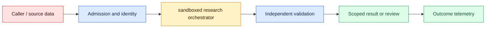
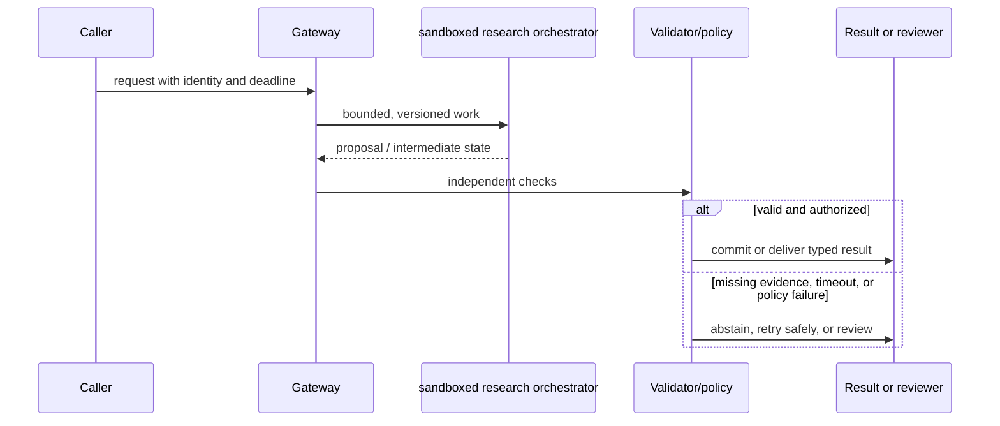

# Scientific agents
Status: emerging
Sources: [OpenAI scientific collaborator report](https://cdn.openai.com/pdf/f4b4a5da-b2de-418d-9fcd-6b293e9dc157/oai_ai-as-a-scientific-collaborator_jan-2026.pdf)

## In one sentence
Scientific agents can propose hypotheses and plans, but experiments and measurements remain the oracle.

## Background: what existed before
Scientific software automated narrow calculations while literature review and hypothesis generation stayed manual.

## What changed and why now
Agents connect literature, code, instruments, and analysis in an iterative loop with explicit provenance. The January focus is the experiment boundary: an agent may expand hypotheses and protocols, but observations and conclusions must remain reproducible and researcher-controlled.

## Impact on current processing and architecture
Sandbox code, validate units and controls, preserve raw data, and require researcher approval for experiments. Carry protocol version, sample identity, instrument state, tenant, runtime, cost, and provenance beside each observation.

## Real-world applications and constraints
Use agents for search, protocol drafting, simulation, and analysis triage while researchers own conclusions. Begin with literature and synthetic simulations, then define lab-access permissions, stopping rules, and review ownership before connecting instruments.

## Mental model
A hypothesis is a testable proposal; an agent's rationale is not experimental evidence. Separate proposed, protocol-approved, executed, observed, analyzed, and researcher-accepted states.

## Prerequisites: a foundational primer

Know hypotheses, controls, units, protocols, seeds, instrument metadata, sandboxing, statistics, and reproducibility. A generated rationale is a plan, not an observation.

## What changed this month
The January 2026 learning map places scientific agents alongside low-latency inference, adoption, and scientific collaboration. The linked source is the primary technical or governance reference for the concept; this lesson labels system-design implications as inferences.

## Engineering consequence

Separate literature, hypothesis, protocol, simulation, instrument execution, raw measurement, analysis, and conclusion states. Pin environments and preserve run IDs, controls, raw data, calibration, and human approvals.

## Topic-specific design notes
A scientific agent loop should separate literature retrieval, hypothesis generation, experimental planning, execution, analysis, and conclusion. Every run needs an immutable protocol, environment, random seed, instrument identity, raw data, and analysis code. Simulations are evidence about a model, not the physical world; wet-lab or field measurements remain the oracle. Require unit checks, controls, preregistered outcomes where appropriate, and researcher approval before external actions. Agents can parallelize search and propose alternatives, but a human scientist decides whether a result is reproducible and causally meaningful.

## Topic-specific exercise and interview prompts
Represent a hypothesis as `{claim, measurement, control}` and reject one missing a control. Generate a plan only; do not call instruments. Add a run ID and provenance record.

Why is the experiment the oracle? A: It observes the target system rather than only model-generated assumptions. Why preserve raw data? A: Reanalysis and reproducibility require separating measurements from interpretations.

## Limits and failure modes

A tool failure can look like a null result; an uncalibrated instrument can create convincing noise; a planner can cherry-pick a favorable analysis; unsafe commands can damage equipment. Require controls, dry runs, stop authority, and immutable protocols.

## Mini exercise (15–30 min)

Validate three hypotheses, block one without a control, and run only a local simulation. Link raw output to analysis while labeling every conclusion simulated or measured.

## A hypothesis-to-measurement scientific loop

A scientific agent connects literature search, hypothesis formation, protocol planning, computation, and analysis into a loop. Its generated explanation is a proposal; the experiment or validated measurement is the oracle for claims about the target world. The January scientific-collaborator report motivates this workflow, but a capability demonstration is not evidence that an agent is safe for every laboratory or field setting. The architecture must preserve the distinction between model assumptions, simulation outputs, and observations.

Represent a hypothesis as a falsifiable claim with measurement, control, expected direction, and stopping rule. Retrieve papers with identifiers and dates, and distinguish primary results from summaries. A planner can propose variables and sample sizes, but a domain scientist checks units, feasibility, ethics, and power. Protocols should be immutable once execution begins; amendments create a new version. A model's rationale is useful for review, not a substitute for a preregistered outcome or instrument calibration.

Execution requires a sandbox and explicit authority. Code runs with pinned dependencies, no ambient credentials, bounded CPU/memory, and synthetic data first. Instruments and laboratory systems use allowlisted commands, interlocks, dry runs, and human approval. Capture raw measurements, instrument identity, environment, random seed, timestamps, and failures. Simulations are labeled simulations; generated plots are not raw data. Analysis code reads immutable inputs and emits a provenance graph so another researcher can re-run or challenge a conclusion.

Agents can parallelize literature retrieval and propose alternative experiments, but search breadth can amplify confirmation bias or duplicate known work. Require competing hypotheses and negative controls, inspect outliers, and report null results. A statistical test does not repair biased sampling or a broken instrument. Reviewers should be able to stop a run, inspect the exact command, and revoke credentials. Cost and queue time matter in shared facilities, so plan resources before launching a batch.

For a materials-screening project, the agent proposes compositions, simulates stability, and ranks candidates. A researcher approves a small batch, a lab system executes with controls, and measured spectra are stored alongside calibration metadata. The agent updates its proposal only after the raw data passes quality checks. The outcome is a reproducible experiment record, not an autonomous discovery claim. This loop keeps acceleration while preserving scientific accountability.

## Impact on current data processing

The experiment path is `question → hypothesis set → protocol compiler → sandbox or instrument → observation store → analysis → review`. A run bundle links every proposal to its source snapshot, code, parameters, random seed, environment, calibration, and raw observation IDs. It is reproducibility evidence, not an authorization token. Admission checks project, facility, budget, hazard, and deadline; validators distinguish measured values from simulated or inferred values before a conclusion is published.

Operationally, bound literature calls, simulation branches, instrument time, material inventory, analysis runs, and reviewer queue. Measure protocol validity, replication rate, prediction-to-observation agreement, null-result retention, compute and lab cost, queue age, and p95 run time by project. If an instrument or source is unavailable, record a censored or unavailable observation rather than filling it with a generated value. Retries preserve run IDs and receipts; datasets, embeddings, traces, and run bundles inherit project access and retention rules. These controls are engineering inferences, not guarantees supplied by the source.

## Architecture and data flow



The researcher, model planner, sandbox, instrument controller, and observation store are separate trust domains. Admission attaches project, purpose, deadline, protocol version, and facility policy; the agent proposes typed parameters; the sandbox enforces resource and network limits; the instrument adapter checks safety ranges; and review validates provenance and analysis. Only authorized operators can approve physical or publication side effects. Telemetry records run, sample, calibration, and receipt IDs without copying sensitive data by default.

## Sequence and failure flow



A tool failure can look like a null result; an uncalibrated instrument can create convincing noise; a planner can cherry-pick a favorable analysis; unsafe commands can damage equipment. Require controls, dry runs, stop authority, and immutable protocols.

## Design walkthrough: operating hypotheses, protocols, and measurements safely

Treat a scientific agent as a hypothesis-management system with a language model at its planning edge. The agent can propose a question, search literature, compare candidate protocols, or prioritize experiments, but it cannot turn a plausible explanation into a result. Separate hypothesis, protocol, observation, analysis, and conclusion records. Each record carries provenance and uncertainty so a later researcher can tell what was predicted, what was measured, and what was inferred.

In a materials workflow, an agent may rank simulated compositions and recommend a small batch. A researcher approves the protocol, instruments record calibration and environmental conditions, and raw spectra are retained before the agent updates its belief. The experiment runner should expose typed parameters and safe ranges rather than accepting arbitrary generated shell commands. A failed run is evidence about the protocol or apparatus, not automatically evidence against the scientific hypothesis.

Give the agent a bounded search budget and an explicit stopping rule. Define the allowed sources, date range, simulation packages, laboratory instruments, and number of trials before the run starts. Record negative results and abandoned branches; retaining only successful candidates creates survivorship bias. If a source is inaccessible, a simulator fails, or a measurement is below detection, record an unavailable or censored observation instead of filling the gap with a model-generated value.

Use preregistration or a locked analysis plan when confirmation risk is high. The plan can specify primary outcome, exclusion rules, comparison baseline, statistical test, and stopping condition. Exploratory analyses remain valuable, but label them as exploratory and avoid presenting a post-hoc pattern as a preplanned confirmation. A reviewer should be able to inspect the code, data snapshot, random seeds, instrument metadata, and exact model prompts that influenced the proposal.

Protect the physical and organizational boundary. A research agent may write a draft protocol but should not independently order hazardous materials, change a live instrument, or publish a claim. Require approval for irreversible actions and enforce identity, facility, budget, and safety constraints at the tool boundary. Queue receipts and idempotency keys prevent a retry from ordering twice. Tenant isolation matters for proprietary datasets and unpublished results; shared embeddings or caches can leak more than the visible report.

Evaluate the complete loop rather than only the prose. Measure novelty, protocol validity, reproducibility, prediction-to-measurement agreement, resource cost, time to result, reviewer correction, and the fraction of proposals that survive safety and feasibility checks. A more novel list is not better if it consumes scarce instrument time or cannot be reproduced. Keep a baseline workflow and compare protected scientific tasks, including negative and contradictory evidence.

### Evidence graph

Represent a run as a graph: question leads to hypotheses; hypotheses lead to protocols; protocols produce observations; analyses consume observations; conclusions cite analyses. Use immutable IDs and content digests for nodes, with append-only links for revisions. A conclusion that changes after a corrected measurement should point to both the old and new analysis. This graph supports audit and collaboration without pretending that provenance alone proves causal validity.

### Experiment scheduler

The scheduler should choose work using expected information, feasibility, cost, and safety—not model excitement alone. Reserve capacity for controls and replication. Avoid letting the agent continually refine simulations while starving the experiment that could falsify its preferred theory. Enforce quotas per project and instrument, expose queue age, and make cancellation explicit. If a run starts, persist its receipt and environmental snapshot before allowing a retry.

### Reproducibility review

Before sharing a result, another researcher should be able to regenerate the analysis from the pinned snapshot or understand precisely why regeneration is impossible. Review dependency versions, random seeds, unit conversions, missing-data handling, and selection criteria. For proprietary or hazardous work, provide a redacted reproduction with a controlled access path. The agent’s summary is an index into this evidence, not the evidence itself.

## Real-world application and trade-off analysis

Scientific agents are useful when literature triage, parameter sweeps, or routine analysis consume scarce researcher time. Begin with proposals and sandbox runs, then require approval for physical experiments. Budget model calls, simulation compute, instrument time, sample handling, storage, and review; distinguish interactive planning latency from experiment duration. Faster hypothesis generation is not progress if it increases unregistered multiple testing.

Automation expands search and planning but consumes compute, lab capacity, and reviewer attention. More hypotheses increase multiple-testing and confirmation-bias risk; controls and preregistration trade speed for credible evidence.

## Limits and failure modes specific to this concept

Watch for unit mismatch, contaminated literature, unpinned dependencies, instrument drift, sample mix-ups, unsafe protocols, and conclusions that outrun measurements. Test missing observations, censored results, retries, duplicate experiments, conflicting papers, and sandbox escape. A plausible rationale is not a replicated result. Assign a researcher owner and stop control; source capabilities are facts, while scientific value requires replication.

## Runnable low-cost example

```python
def validate_hypothesis(h):
    required = ("claim", "measurement", "control", "stopping_rule")
    missing = [k for k in required if not h.get(k)]
    return {"status": "ready" if not missing else "blocked", "missing": missing}

print(validate_hypothesis({"claim":"x changes y", "measurement":"y", "control":"baseline", "stopping_rule":"10 runs"}))
```

The validator checks hypothesis fields only. It does not run an instrument, assess ethics, establish statistical power, or make a scientific discovery.

## Mini exercise (15–30 min)

Create three hypotheses, one missing a control. Validate them, generate a protocol record with seed and environment, and run only a local simulation. Add a provenance link from raw output to analysis and mark every conclusion as simulated or measured.

## Build it locally

1. Save `hypothesis_loop.py` with claim, measurement, control, and stopping rule.
2. Block missing controls and assign a reproducible run ID.
3. Run a sandboxed local simulation with a fixed seed.
4. Store raw output, environment, and analysis provenance separately.
5. Require human approval before any external or instrument action.

## Interview Q&A

**Q: Why is measurement the oracle?** A: It observes the target system, while generated plans and simulations depend on assumptions.
**Q: What belongs in a run bundle?** A: Protocol/version, environment, seed, instrument, raw data, code, and failures.
**Q: Why require controls?** A: They help separate the proposed effect from baseline, drift, or confounding.
**Q: What authority should an agent have?** A: Only the narrow, approved execution scope with human stop and review controls.

## Glossary

- **Hypothesis:** A testable proposition with a defined measurement and conditions.
- **Control:** A baseline or comparison used to interpret an experiment.
- **Provenance graph:** Links connecting sources, transformations, runs, and results.
- **Reproducibility:** The ability to regenerate or independently verify a result from recorded materials.

## References

[OpenAI scientific collaborator report](https://cdn.openai.com/pdf/f4b4a5da-b2de-418d-9fcd-6b293e9dc157/oai_ai-as-a-scientific-collaborator_jan-2026.pdf)
- [January 2026 lesson map](README.md)

## Claim ledger

| Claim | Source | Fact or inference |
|---|---|---|
| OpenAI reports AI use for research tasks such as analyses, simulations, calculation checks, and selecting promising experiments. | [OpenAI scientific collaborator report](https://cdn.openai.com/pdf/f4b4a5da-b2de-418d-9fcd-6b293e9dc157/oai_ai-as-a-scientific-collaborator_jan-2026.pdf) | Source claim |
| The architecture, metrics, and failure handling in this lesson are suitable engineering consequences to test locally. | [OpenAI scientific collaborator report](https://cdn.openai.com/pdf/f4b4a5da-b2de-418d-9fcd-6b293e9dc157/oai_ai-as-a-scientific-collaborator_jan-2026.pdf) | Inference |
| The Python example illustrates a boundary and does not establish provider-scale reliability or safety. | [OpenAI scientific collaborator report](https://cdn.openai.com/pdf/f4b4a5da-b2de-418d-9fcd-6b293e9dc157/oai_ai-as-a-scientific-collaborator_jan-2026.pdf) | Inference |
