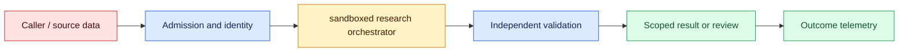
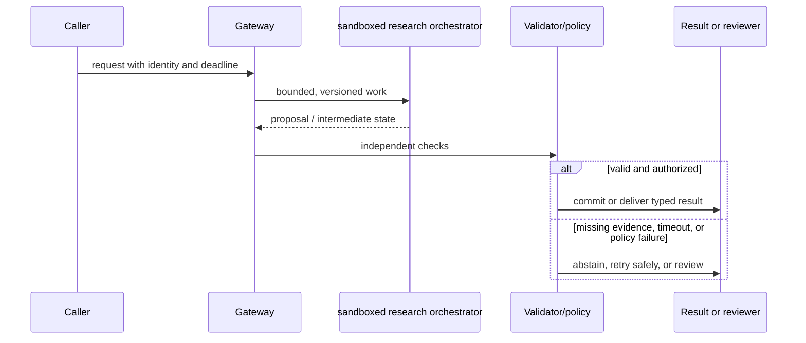

# Scientific agents
Status: emerging
Sources: [OpenAI scientific collaborator report](https://cdn.openai.com/pdf/f4b4a5da-b2de-418d-9fcd-6b293e9dc157/oai_ai-as-a-scientific-collaborator_jan-2026.pdf)

## In one sentence
Scientific agents can propose hypotheses and plans, but experiments and measurements remain the oracle.

## Background: what existed before
Scientific software automated narrow calculations while literature review and hypothesis generation stayed manual.

## What changed and why now
Agents connect literature, code, instruments, and analysis in an iterative loop with explicit provenance. This month's focus is scientific agents as an operable system boundary: its measurements and controls determine whether the capability survives contact with real traffic.

## Impact on current processing and architecture
Sandbox code, validate units and controls, preserve raw data, and require researcher approval for experiments. A production path should carry version, tenant, latency, cost, and failure metadata beside the model result.

## Real-world applications and constraints
Use agents for search, protocol drafting, simulation, and analysis triage while researchers own conclusions. Start with reversible, low-risk workloads; define SLOs, access controls, and an owner before expanding.

## Mental model
A hypothesis is a testable proposal; an agent's rationale is not experimental evidence. Model the concept as a state transition with explicit inputs, outputs, authority, and failure handling.

## Prerequisites: a foundational primer

Know hypotheses, controls, units, protocols, seeds, instrument metadata, sandboxing, statistics, and reproducibility. A generated rationale is a plan, not an observation.

## What changed this month
The January 2026 learning map places scientific agents alongside low-latency inference, adoption, and scientific collaboration. The linked source is the primary technical or governance reference for the concept; this lesson labels system-design implications as inferences.

## Engineering consequence

Separate literature, hypothesis, protocol, simulation, instrument execution, raw measurement, analysis, and conclusion states. Pin environments and preserve run IDs, controls, raw data, calibration, and human approvals.

## Topic-specific design notes
A scientific agent loop should separate literature retrieval, hypothesis generation, experimental planning, execution, analysis, and conclusion. Every run needs an immutable protocol, environment, random seed, instrument identity, raw data, and analysis code. Simulations are evidence about a model, not the physical world; wet-lab or field measurements remain the oracle. Require unit checks, controls, preregistered outcomes where appropriate, and researcher approval before external actions. Agents can parallelize search and propose alternatives, but a human scientist decides whether a result is reproducible and causally meaningful.

## Topic-specific exercise and interview prompts
Represent a hypothesis as `{claim, measurement, control}` and reject one missing a control. Generate a plan only; do not call instruments. Add a run ID and provenance record.

Why is the experiment the oracle? A: It observes the target system rather than only model-generated assumptions. Why preserve raw data? A: Reanalysis and reproducibility require separating measurements from interpretations.

## Limits and failure modes

A tool failure can look like a null result; an uncalibrated instrument can create convincing noise; a planner can cherry-pick a favorable analysis; unsafe commands can damage equipment. Require controls, dry runs, stop authority, and immutable protocols.

## Mini exercise (15–30 min)

Validate three hypotheses, block one without a control, and run only a local simulation. Link raw output to analysis while labeling every conclusion simulated or measured.

## A hypothesis-to-measurement scientific loop

A scientific agent connects literature search, hypothesis formation, protocol planning, computation, and analysis into a loop. Its generated explanation is a proposal; the experiment or validated measurement is the oracle for claims about the target world. The January scientific-collaborator report motivates this workflow, but a capability demonstration is not evidence that an agent is safe for every laboratory or field setting. The architecture must preserve the distinction between model assumptions, simulation outputs, and observations.

Represent a hypothesis as a falsifiable claim with measurement, control, expected direction, and stopping rule. Retrieve papers with identifiers and dates, and distinguish primary results from summaries. A planner can propose variables and sample sizes, but a domain scientist checks units, feasibility, ethics, and power. Protocols should be immutable once execution begins; amendments create a new version. A model's rationale is useful for review, not a substitute for a preregistered outcome or instrument calibration.

Execution requires a sandbox and explicit authority. Code runs with pinned dependencies, no ambient credentials, bounded CPU/memory, and synthetic data first. Instruments and laboratory systems use allowlisted commands, interlocks, dry runs, and human approval. Capture raw measurements, instrument identity, environment, random seed, timestamps, and failures. Simulations are labeled simulations; generated plots are not raw data. Analysis code reads immutable inputs and emits a provenance graph so another researcher can re-run or challenge a conclusion.

Agents can parallelize literature retrieval and propose alternative experiments, but search breadth can amplify confirmation bias or duplicate known work. Require competing hypotheses and negative controls, inspect outliers, and report null results. A statistical test does not repair biased sampling or a broken instrument. Reviewers should be able to stop a run, inspect the exact command, and revoke credentials. Cost and queue time matter in shared facilities, so plan resources before launching a batch.

For a materials-screening project, the agent proposes compositions, simulates stability, and ranks candidates. A researcher approves a small batch, a lab system executes with controls, and measured spectra are stored alongside calibration metadata. The agent updates its proposal only after the raw data passes quality checks. The outcome is a reproducible experiment record, not an autonomous discovery claim. This loop keeps acceleration while preserving scientific accountability.

## Impact on current data processing

The data path is `request → sandboxed research orchestrator → validator/policy → outcome`. The `reproducible run bundle` is versioned and scoped to its owner; it is not treated as a durable memory or permission. Admission records the input shape and deadline, processing emits typed intermediate state, and the final result carries provenance and a reason code. This makes a change measurable at the boundary where hypotheses, protocols, and measurements become an application decision.

Operationally, keep the concept-specific resource bounded. Measure the signal that matters for hypotheses, protocols, and measurements alongside p95 latency, error class, cost, and downstream correction. Under overload or missing evidence, return a typed degraded state or queue for review. Retrying must preserve idempotency and correlation. Any cache, index, trace, or derived artifact inherits tenant isolation and retention rules. These are engineering inferences from the source, not guarantees supplied by it.

## Architecture and data flow



The source or caller remains outside the worker's trust assumptions. Admission attaches tenant, purpose, deadline, and version; the worker transforms hypotheses, protocols, and measurements; validation checks invariants that generated or approximate computation cannot establish. Only the final policy transition can produce a side effect. Telemetry records identifiers and measurements without copying sensitive payloads by default.

## Sequence and failure flow



A tool failure can look like a null result; an uncalibrated instrument can create convincing noise; a planner can cherry-pick a favorable analysis; unsafe commands can damage equipment. Require controls, dry runs, stop authority, and immutable protocols.

## Design walkthrough: operating hypotheses, protocols, and measurements safely

Take one realistic request and follow it through the system. The caller supplies an identity, purpose, input, and deadline; admission validates those fields before allocating work. The sandboxed research orchestrator receives only the fields needed for its computation and emits a proposal, measurement, or transformed state. It does not get ambient credentials, an unbounded queue, or permission to redefine the contract. The gateway stores the reproducible run bundle identifier and the versions that produced it, then invokes checks owned by code outside the probabilistic or approximate step.

A materials agent ranks simulated compositions, then a researcher approves a small controlled lab batch. Spectra and calibration metadata are stored before the agent updates its proposal.

Now follow a difficult request. An unusually large hypotheses, protocols, and measurements value may exhaust memory or context; a rare language, malformed record, stale source, or cancelled client may invalidate assumptions. Admission should reject or split before expensive work, and the reason must be observable. If a dependency times out, preserve the deadline and return an unavailable state rather than retrying forever. If work may have reached an external system, query its receipt before replay. These transitions are different from model uncertainty and should have different metrics and runbooks.

Multi-tenant operation adds a second axis. Namespaces, ACL filters, quotas, and deletion jobs apply to the reproducible run bundle as well as to the visible answer. A cache key, vector, trace, queue item, or temporary file must carry an owner or an explicit public scope. Test a request that has a valid shape but another tenant's identifier; the expected behavior is a denial, not an empty lookup that leaks timing. Test revocation between planning and execution. The worker should observe the new policy at the side-effect boundary.

Capacity planning should use production-shaped distributions. Measure short and long inputs, cold and warm workers, concurrent tenants, cancellations, and retries. Report p50 and p95 or p99 latency, memory, queue age, cost, and accepted outcome rate. For hypotheses, protocols, and measurements, add a domain metric: page or token fit, cache-page pressure, batch wait, evidence recall, field validity, review agreement, or conversion. Averages hide the cases that drive support tickets. A canary is successful only when protected slices remain inside their thresholds.

Finally, make a change record. State what the source actually establishes, what this integration infers, which baseline was used, and what would trigger rollback. Pin the model or library, schema, policy, and data versions. Keep a small reproducible fixture and a separate protected case. At launch, sample outcomes and inspect corrections; after launch, add every incident to the regression set. The owner should be able to answer what the system saw, which decision it made, why it was allowed, and how to undo it without searching through raw customer payloads.

## Real-world application and trade-off analysis

The strongest use case is one in which hypotheses, protocols, and measurements are expensive or difficult to manage manually and the consequence of a wrong result is bounded. Start with read-only or draft work, then add a reviewed transition. Estimate total cost, including retrieval, model work, retries, storage, reviewer time, and corrections. Latency targets should be stated separately for interactive and batch routes. A cheaper or faster implementation is not an improvement if it moves errors into a high-cost downstream queue.

Automation expands search and planning but consumes compute, lab capacity, and reviewer attention. More hypotheses increase multiple-testing and confirmation-bias risk; controls and preregistration trade speed for credible evidence.

## Limits and failure modes specific to this concept

Watch for malformed inputs, version drift, resource exhaustion, cross-tenant state, stale artifacts, and silent degraded paths. Test the boundary conditions that are unique to hypotheses, protocols, and measurements: unusually large or rare values, cancellations, duplicate requests, partial dependencies, and adversarial content. A passing happy-path demo says little about tail behavior. Define an escalation owner and rollback artifact before enabling the feature. If the source describes a capability, label it as a fact; claims about production quality, safety, or value are inferences requiring local evidence.

## Runnable low-cost example

```python
def validate_hypothesis(h):
    required = ("claim", "measurement", "control", "stopping_rule")
    missing = [k for k in required if not h.get(k)]
    return {"status": "ready" if not missing else "blocked", "missing": missing}

print(validate_hypothesis({"claim":"x changes y", "measurement":"y", "control":"baseline", "stopping_rule":"10 runs"}))
```

The validator checks hypothesis fields only. It does not run an instrument, assess ethics, establish statistical power, or make a scientific discovery.

## Mini exercise (15–30 min)

Create three hypotheses, one missing a control. Validate them, generate a protocol record with seed and environment, and run only a local simulation. Add a provenance link from raw output to analysis and mark every conclusion as simulated or measured.

## Build it locally

1. Save `hypothesis_loop.py` with claim, measurement, control, and stopping rule.
2. Block missing controls and assign a reproducible run ID.
3. Run a sandboxed local simulation with a fixed seed.
4. Store raw output, environment, and analysis provenance separately.
5. Require human approval before any external or instrument action.

## Interview Q&A

**Q: Why is measurement the oracle?** A: It observes the target system, while generated plans and simulations depend on assumptions.
**Q: What belongs in a run bundle?** A: Protocol/version, environment, seed, instrument, raw data, code, and failures.
**Q: Why require controls?** A: They help separate the proposed effect from baseline, drift, or confounding.
**Q: What authority should an agent have?** A: Only the narrow, approved execution scope with human stop and review controls.

## Glossary

- **Hypothesis:** A testable proposition with a defined measurement and conditions.
- **Control:** A baseline or comparison used to interpret an experiment.
- **Provenance graph:** Links connecting sources, transformations, runs, and results.
- **Reproducibility:** The ability to regenerate or independently verify a result from recorded materials.

## References

[OpenAI scientific collaborator report](https://cdn.openai.com/pdf/f4b4a5da-b2de-418d-9fcd-6b293e9dc157/oai_ai-as-a-scientific-collaborator_jan-2026.pdf)
- [January 2026 lesson map](README.md)

## Claim ledger

| Claim | Source | Fact or inference |
|---|---|---|
| OpenAI reports AI use for research tasks such as analyses, simulations, calculation checks, and selecting promising experiments. | [OpenAI scientific collaborator report](https://cdn.openai.com/pdf/f4b4a5da-b2de-418d-9fcd-6b293e9dc157/oai_ai-as-a-scientific-collaborator_jan-2026.pdf) | Source claim |
| The architecture, metrics, and failure handling in this lesson are suitable engineering consequences to test locally. | [OpenAI scientific collaborator report](https://cdn.openai.com/pdf/f4b4a5da-b2de-418d-9fcd-6b293e9dc157/oai_ai-as-a-scientific-collaborator_jan-2026.pdf) | Inference |
| The Python example illustrates a boundary and does not establish provider-scale reliability or safety. | [OpenAI scientific collaborator report](https://cdn.openai.com/pdf/f4b4a5da-b2de-418d-9fcd-6b293e9dc157/oai_ai-as-a-scientific-collaborator_jan-2026.pdf) | Inference |
