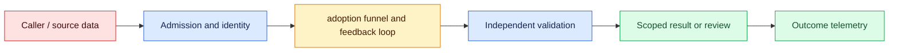
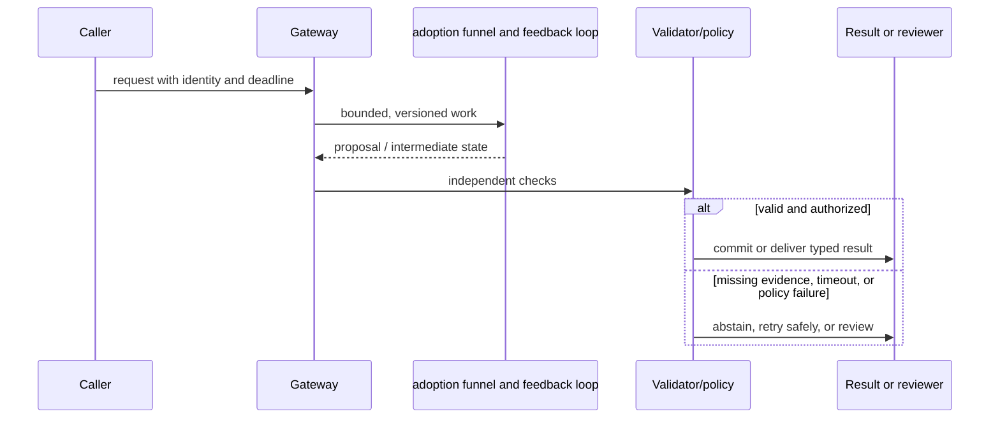

# Capability overhang
Status: durable
Sources: [OpenAI AI for self-empowerment](https://openai.com/index/ai-for-self-empowerment/)

## In one sentence
Capability overhang is useful technical ability that adoption, interfaces, skills, or institutions have not yet absorbed.

## Background: what existed before
Deployment often lagged research demonstrations because workflows, trust, and training were missing.

## What changed and why now
Better scaffolding, education, and task design can convert latent capability into practical outcomes. This month's focus is capability overhang as an operable system boundary: its measurements and controls determine whether the capability survives contact with real traffic.

## Impact on current processing and architecture
Measure realized task success, not benchmark scores alone; invest in onboarding, permissions, and feedback. A production path should carry version, tenant, latency, cost, and failure metadata beside the model result.

## Real-world applications and constraints
Use small workflow pilots, reusable templates, and outcome metrics to find bottlenecks. Start with reversible, low-risk workloads; define SLOs, access controls, and an owner before expanding.

## Mental model
The gap is between what a system can do under suitable conditions and what users reliably accomplish. Model the concept as a state transition with explicit inputs, outputs, authority, and failure handling.

## Prerequisites: a foundational primer

Know funnel metrics, cohorts, task eligibility, conversion, opportunity cost, interviews, and outcome measurement. A benchmark measures capability under conditions, not realized workflow value.

## What changed this month
The January 2026 learning map places capability overhang alongside low-latency inference, adoption, and scientific collaboration. The linked source is the primary technical or governance reference for the concept; this lesson labels system-design implications as inferences.

## Engineering consequence

Instrument eligible, attempted, completed, accepted, retained, and beneficial stages with drop-off reasons. Pair usage with correction cost, appeals, safety blocks, and saved time; preserve cohort and baseline definitions.

## Topic-specific design notes
Analyze overhang as a socio-technical funnel: capability under benchmark conditions, task fit, user access, workflow integration, trust, and realized outcome. A demo may fail in deployment because data is unavailable, permissions are unclear, latency is high, or users cannot evaluate outputs. Measure conversion at each stage: eligible tasks, attempted tasks, accepted outputs, saved time, and error cost. Improve interfaces, templates, training, and review policies before concluding that a model lacks capability. Also test whether adoption is blocked by legitimate safety or economic constraints; increased usage is not automatically progress.

## Topic-specific exercise and interview prompts
Create a funnel with counts for eligible, attempted, accepted, and retained tasks. Calculate each conversion rate and identify the largest drop; propose one reversible workflow change.

How do you distinguish overhang from poor capability? A: Compare controlled task success with real workflow conversion and inspect each bottleneck. Why measure rejected use? A: Non-adoption may reflect appropriate risk controls, not missing demand.

## Limits and failure modes

Low adoption can reflect missing connectors, permissions, latency, skills, or legitimate risk; high adoption can reflect forced use or easier tasks. Compare cohorts, interview non-users, and inspect rejected outcomes before changing the model.

## Mini exercise (15–30 min)

Create a workflow funnel, calculate each conversion rate, identify its largest measured bottleneck, and design a reversible two-week intervention with a quality guardrail.

## From demonstrated capability to realized workflow value

Capability overhang describes a gap between what a system can do under suitable conditions and what people reliably accomplish with it. A benchmark or demo measures one stage of that gap. Realized value also depends on task eligibility, access to data, interface fit, latency, trust, skills, policy, review capacity, and economics. Treating low adoption as proof of low capability can lead to the wrong fix; treating high usage as proof of value can hide errors and inappropriate automation.

Model adoption as a funnel with explicit denominators: eligible tasks, attempted tasks, technically completed tasks, accepted outputs, retained use, and beneficial outcomes. Instrument drop-off reasons such as unavailable data, unclear permission, poor quality, excessive review, cost, or user preference. Slice by role, task complexity, and consequence. A team may discover that a model is strong at drafting but the workflow lacks a safe publish button, or that users correctly reject it for cases where evidence is missing.

The intervention follows the bottleneck. Improve onboarding when users cannot formulate tasks; build connectors when data is inaccessible; add citations and review when trust is low; reduce latency or cost when economics fail; narrow the feature when safety constraints are legitimate. A template that makes a workflow easier can increase use without changing model weights. Conversely, forcing adoption by removing review can increase activity while worsening outcomes. Measure saved time, correction cost, quality, and appeals alongside usage.

Experiments should be reversible and compare a baseline. Shadow the assistant, run a small pilot, and collect qualitative interviews plus event data. Protect non-adopters and rejected cases from being interpreted as noise. When the model or interface changes, preserve cohort definitions so conversion changes are attributable. Report uncertainty: an increase in accepted drafts may reflect easier tasks rather than better capability.

For a municipal permitting office, an assistant can summarize submitted documents and identify missing fields, but staff own the permit decision. A pilot measures eligible applications, attempted summaries, accepted corrections, review time, and appeal outcomes. Staff feedback reveals that the largest bottleneck is a legacy upload system, not model quality. Adding a document connector and clear evidence links creates more value than purchasing a larger model. The overhang analysis turns “AI adoption” into an engineering and institutional diagnosis.

## Impact on current data processing

The data path is `request → adoption funnel and feedback loop → validator/policy → outcome`. The `outcome and bottleneck record` is versioned and scoped to its owner; it is not treated as a durable memory or permission. Admission records the input shape and deadline, processing emits typed intermediate state, and the final result carries provenance and a reason code. This makes a change measurable at the boundary where workflow conversion stages become an application decision.

Operationally, keep the concept-specific resource bounded. Measure the signal that matters for workflow conversion stages alongside p95 latency, error class, cost, and downstream correction. Under overload or missing evidence, return a typed degraded state or queue for review. Retrying must preserve idempotency and correlation. Any cache, index, trace, or derived artifact inherits tenant isolation and retention rules. These are engineering inferences from the source, not guarantees supplied by it.

## Architecture and data flow



The source or caller remains outside the worker's trust assumptions. Admission attaches tenant, purpose, deadline, and version; the worker transforms workflow conversion stages; validation checks invariants that generated or approximate computation cannot establish. Only the final policy transition can produce a side effect. Telemetry records identifiers and measurements without copying sensitive payloads by default.

## Sequence and failure flow



Low adoption can reflect missing connectors, permissions, latency, skills, or legitimate risk; high adoption can reflect forced use or easier tasks. Compare cohorts, interview non-users, and inspect rejected outcomes before changing the model.

## Design walkthrough: operating workflow conversion stages safely

Take one realistic request and follow it through the system. The caller supplies an identity, purpose, input, and deadline; admission validates those fields before allocating work. The adoption funnel and feedback loop receives only the fields needed for its computation and emits a proposal, measurement, or transformed state. It does not get ambient credentials, an unbounded queue, or permission to redefine the contract. The gateway stores the outcome and bottleneck record identifier and the versions that produced it, then invokes checks owned by code outside the probabilistic or approximate step.

A permitting office uses an assistant for document summaries and missing-field detection while staff retain permit authority. Pilot data shows the upload connector, not model quality, is the largest conversion loss.

Now follow a difficult request. An unusually large workflow conversion stages value may exhaust memory or context; a rare language, malformed record, stale source, or cancelled client may invalidate assumptions. Admission should reject or split before expensive work, and the reason must be observable. If a dependency times out, preserve the deadline and return an unavailable state rather than retrying forever. If work may have reached an external system, query its receipt before replay. These transitions are different from model uncertainty and should have different metrics and runbooks.

Multi-tenant operation adds a second axis. Namespaces, ACL filters, quotas, and deletion jobs apply to the outcome and bottleneck record as well as to the visible answer. A cache key, vector, trace, queue item, or temporary file must carry an owner or an explicit public scope. Test a request that has a valid shape but another tenant's identifier; the expected behavior is a denial, not an empty lookup that leaks timing. Test revocation between planning and execution. The worker should observe the new policy at the side-effect boundary.

Capacity planning should use production-shaped distributions. Measure short and long inputs, cold and warm workers, concurrent tenants, cancellations, and retries. Report p50 and p95 or p99 latency, memory, queue age, cost, and accepted outcome rate. For workflow conversion stages, add a domain metric: page or token fit, cache-page pressure, batch wait, evidence recall, field validity, review agreement, or conversion. Averages hide the cases that drive support tickets. A canary is successful only when protected slices remain inside their thresholds.

Finally, make a change record. State what the source actually establishes, what this integration infers, which baseline was used, and what would trigger rollback. Pin the model or library, schema, policy, and data versions. Keep a small reproducible fixture and a separate protected case. At launch, sample outcomes and inspect corrections; after launch, add every incident to the regression set. The owner should be able to answer what the system saw, which decision it made, why it was allowed, and how to undo it without searching through raw customer payloads.

## Real-world application and trade-off analysis

The strongest use case is one in which workflow conversion stages are expensive or difficult to manage manually and the consequence of a wrong result is bounded. Start with read-only or draft work, then add a reviewed transition. Estimate total cost, including retrieval, model work, retries, storage, reviewer time, and corrections. Latency targets should be stated separately for interactive and batch routes. A cheaper or faster implementation is not an improvement if it moves errors into a high-cost downstream queue.

Training and interface work can unlock value without changing model weights, but it costs staff time and may expose new operational risk. Optimizing attempts alone can worsen corrections; optimize beneficial outcomes per unit cost.

## Limits and failure modes specific to this concept

Watch for malformed inputs, version drift, resource exhaustion, cross-tenant state, stale artifacts, and silent degraded paths. Test the boundary conditions that are unique to workflow conversion stages: unusually large or rare values, cancellations, duplicate requests, partial dependencies, and adversarial content. A passing happy-path demo says little about tail behavior. Define an escalation owner and rollback artifact before enabling the feature. If the source describes a capability, label it as a fact; claims about production quality, safety, or value are inferences requiring local evidence.

## Runnable low-cost example

```python
def funnel(counts):
    stages = list(counts.items()); rates = {}
    for (a, av), (b, bv) in zip(stages, stages[1:]):
        rates[f"{a}->{b}"] = round(bv / av, 3) if av else 0
    return rates

print(funnel({"eligible":100, "attempted":60, "accepted":42, "retained":30}))
```

The funnel function calculates stage ratios only. It does not prove causality, representativeness, user satisfaction, or that an intervention created the observed gain.

## Mini exercise (15–30 min)

Create a funnel for a workflow you know, with counts and drop-off reasons. Calculate conversion rates, choose the largest bottleneck, and design a two-week reversible intervention with one quality guardrail and one human interview question.

## Build it locally

1. Save `adoption_funnel.py` with eligible, attempted, accepted, and retained counts.
2. Add drop-off reason fields and slice rates by role and task complexity.
3. Compare a baseline cohort with a small reversible interface change.
4. Interview one adopter and one non-adopter about the largest bottleneck.
5. Gate expansion on quality, correction cost, and safety outcomes, not usage alone.

## Interview Q&A

**Q: How distinguish overhang from poor capability?** A: Compare controlled task performance with each real-workflow conversion stage.
**Q: Is more adoption always better?** A: No; usage can rise while quality, safety, or economic value falls.
**Q: Why record rejected use?** A: Non-use may be an appropriate policy or a legitimate signal of missing fit.
**Q: What is a good first intervention?** A: A small reversible change targeted at the measured bottleneck with outcome guardrails.

## Glossary

- **Capability:** What a system can accomplish under stated conditions.
- **Adoption:** Use of a capability within a real workflow.
- **Conversion:** The fraction moving from one funnel stage to the next.
- **Realized value:** Observed beneficial outcome after cost, correction, and risk.

## References

[OpenAI AI for self-empowerment](https://openai.com/index/ai-for-self-empowerment/)
- [January 2026 lesson map](README.md)

## Claim ledger

| Claim | Source | Fact or inference |
|---|---|---|
| OpenAI argues that managing the capability overhang can broaden people’s ability to create economic opportunities with AI. | [OpenAI AI for self-empowerment](https://openai.com/index/ai-for-self-empowerment/) | Source claim |
| The architecture, metrics, and failure handling in this lesson are suitable engineering consequences to test locally. | [OpenAI AI for self-empowerment](https://openai.com/index/ai-for-self-empowerment/) | Inference |
| The Python example illustrates a boundary and does not establish provider-scale reliability or safety. | [OpenAI AI for self-empowerment](https://openai.com/index/ai-for-self-empowerment/) | Inference |
