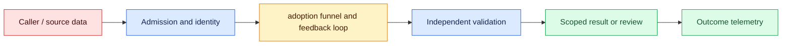
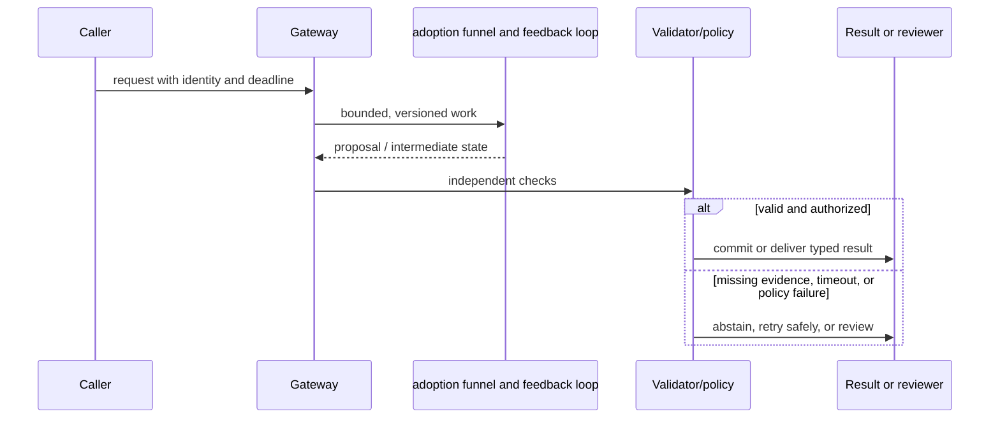

# Capability overhang
Status: durable
Sources: [OpenAI AI for self-empowerment](https://openai.com/index/ai-for-self-empowerment/)

## In one sentence
Capability overhang is useful technical ability that adoption, interfaces, skills, or institutions have not yet absorbed.

## Background: what existed before
Deployment often lagged research demonstrations because workflows, trust, and training were missing.

## What changed and why now
Better scaffolding, education, and task design can convert latent capability into practical outcomes. The January focus is the conversion gap: measure where a capable model fails to become a reliable workflow, then remove the bottleneck without pretending capability equals readiness.

## Impact on current processing and architecture
Measure completed, corrected, and abandoned tasks rather than benchmark scores alone; invest in onboarding, permissions, and feedback. Carry workflow stage, model route, tenant, latency, cost, dependency state, and human-correction metadata.

## Real-world applications and constraints
Use small workflow pilots, reusable templates, and outcome metrics to find bottlenecks. Begin with drafting or retrieval, then expand only when training, permissions, support load, and downstream quality are measured.

## Mental model
The gap is between what a system can do under suitable conditions and what users reliably accomplish. Map an opportunity from discovered to enabled, piloted, adopted, measured, or blocked by a named dependency.

## Prerequisites: a foundational primer

Know funnel metrics, cohorts, task eligibility, conversion, opportunity cost, interviews, and outcome measurement. A benchmark measures capability under conditions, not realized workflow value.

## What changed this month
The January 2026 learning map places capability overhang alongside low-latency inference, adoption, and scientific collaboration. The linked source is the primary technical or governance reference for the concept; this lesson labels system-design implications as inferences.

## Engineering consequence

Instrument eligible, attempted, completed, accepted, retained, and beneficial stages with drop-off reasons. Pair usage with correction cost, appeals, safety blocks, and saved time; preserve cohort and baseline definitions.

## Topic-specific design notes
Analyze overhang as a socio-technical funnel: capability under benchmark conditions, task fit, user access, workflow integration, trust, and realized outcome. A demo may fail in deployment because data is unavailable, permissions are unclear, latency is high, or users cannot evaluate outputs. Measure conversion at each stage: eligible tasks, attempted tasks, accepted outputs, saved time, and error cost. Improve interfaces, templates, training, and review policies before concluding that a model lacks capability. Also test whether adoption is blocked by legitimate safety or economic constraints; increased usage is not automatically progress.

## Topic-specific exercise and interview prompts
Create a funnel with counts for eligible, attempted, accepted, and retained tasks. Calculate each conversion rate and identify the largest drop; propose one reversible workflow change.

How do you distinguish overhang from poor capability? A: Compare controlled task success with real workflow conversion and inspect each bottleneck. Why measure rejected use? A: Non-adoption may reflect appropriate risk controls, not missing demand.

## Limits and failure modes

Low adoption can reflect missing connectors, permissions, latency, skills, or legitimate risk; high adoption can reflect forced use or easier tasks. Compare cohorts, interview non-users, and inspect rejected outcomes before changing the model.

## Mini exercise (15–30 min)

Create a workflow funnel, calculate each conversion rate, identify its largest measured bottleneck, and design a reversible two-week intervention with a quality guardrail.

## From demonstrated capability to realized workflow value

Capability overhang describes a gap between what a system can do under suitable conditions and what people reliably accomplish with it. A benchmark or demo measures one stage of that gap. Realized value also depends on task eligibility, access to data, interface fit, latency, trust, skills, policy, review capacity, and economics. Treating low adoption as proof of low capability can lead to the wrong fix; treating high usage as proof of value can hide errors and inappropriate automation.

Model adoption as a funnel with explicit denominators: eligible tasks, attempted tasks, technically completed tasks, accepted outputs, retained use, and beneficial outcomes. Instrument drop-off reasons such as unavailable data, unclear permission, poor quality, excessive review, cost, or user preference. Slice by role, task complexity, and consequence. A team may discover that a model is strong at drafting but the workflow lacks a safe publish button, or that users correctly reject it for cases where evidence is missing.

The intervention follows the bottleneck. Improve onboarding when users cannot formulate tasks; build connectors when data is inaccessible; add citations and review when trust is low; reduce latency or cost when economics fail; narrow the feature when safety constraints are legitimate. A template that makes a workflow easier can increase use without changing model weights. Conversely, forcing adoption by removing review can increase activity while worsening outcomes. Measure saved time, correction cost, quality, and appeals alongside usage.

Experiments should be reversible and compare a baseline. Shadow the assistant, run a small pilot, and collect qualitative interviews plus event data. Protect non-adopters and rejected cases from being interpreted as noise. When the model or interface changes, preserve cohort definitions so conversion changes are attributable. Report uncertainty: an increase in accepted drafts may reflect easier tasks rather than better capability.

For a municipal permitting office, an assistant can summarize submitted documents and identify missing fields, but staff own the permit decision. A pilot measures eligible applications, attempted summaries, accepted corrections, review time, and appeal outcomes. Staff feedback reveals that the largest bottleneck is a legacy upload system, not model quality. Adding a document connector and clear evidence links creates more value than purchasing a larger model. The overhang analysis turns “AI adoption” into an engineering and institutional diagnosis.

## Impact on current data processing

The readiness path is `capability probe → workflow map → bottleneck evidence → control assessment → staged adoption decision`. An outcome record links the task, cohort, interface, model route, dependency state, user correction, and downstream result. It is evidence for a rollout decision, not durable memory or authority. Admission checks user and tenant scope; the system reports proposal, accepted, corrected, deferred, and abandoned states separately so capability is not confused with beneficial completion.

Operationally, bound pilot traffic, evaluation cohorts, feedback retention, review capacity, and rollout scope. Measure stage conversion, time to benefit, correction and reversal, dependency failure, p95 latency, cost per accepted outcome, accessibility, and protected-cohort impact. If a connector or reviewer pool is unavailable, report a blocked stage rather than blaming model capability. Retries preserve cohort and event IDs; caches, traces, drafts, and feedback inherit tenant access and deletion rules. These controls are engineering inferences, not guarantees supplied by the source.

## Architecture and data flow



Users, model outputs, organizational policy, and external dependencies are distinct parts of the adoption system. Admission attaches tenant, purpose, cohort, deadline, and model or interface version; the capability proposes a bounded draft; workflow validators check evidence, accessibility, and authorization; a human or policy gate owns the consequential transition. Telemetry records stage, cohort, dependency, and outcome IDs without copying sensitive payloads by default.

## Sequence and failure flow



Low adoption can reflect missing connectors, permissions, latency, skills, or legitimate risk; high adoption can reflect forced use or easier tasks. Compare cohorts, interview non-users, and inspect rejected outcomes before changing the model.

## Design walkthrough: operating workflow conversion stages safely

Measure AI adoption as a chain of user outcomes, not as a count of generated responses. A capability can be impressive in a demo yet fail because people cannot upload inputs, understand the result, trust the next step, or recover from an error. Map the workflow from entry to beneficial completion: discovery, setup, input, processing, review, action, correction, and repeat use. At each stage record abandonment, latency, assistance cost, and the reason for leaving when it is safe to collect.

A permitting office might use an assistant to summarize applications and identify missing fields while staff retain permit authority. If applicants abandon the workflow because the upload connector rejects common formats, improving the model will not increase completion. Instrument the handoff, show the extracted field beside its source, and provide a correction path. A successful pilot should report completed permits and correction burden, not only response quality or weekly active users.

Separate capability from readiness. Capability asks whether the model can perform a task under stated conditions; readiness asks whether the organization can support it with identity, training, integration, policy, accessibility, and incident response. A rollout may begin with draft output, read-only records, and a human-confirmed transition. Do not let a high-quality draft silently become an external commitment. Require explicit confirmation when an action is costly, irreversible, or visible to a third party.

Find bottlenecks with controlled changes. Improve one stage at a time, keep a comparison cohort, and measure downstream completion and reversals. Faster generation may increase queue pressure or review fatigue. More automation may reduce setup time while increasing exception handling. Segment by customer size, language, device, input quality, and task complexity; aggregate adoption can rise while a protected group loses access. Document which outcome the experiment was designed to improve and the harm threshold that stops it.

Treat feedback as a governed signal. A thumbs-up can mean politeness, speed, or correctness; a retry can mean dissatisfaction or a changed request. Combine explicit feedback with corrections, abandonment, support contacts, and independently checked outcomes. Avoid training directly on unreviewed feedback when it may contain private data or strategic behavior. Route recurring failure categories to product, integration, model, and policy owners so “low adoption” becomes an actionable diagnosis.

Close a launch with an operating contract: supported tasks, excluded tasks, service levels, cost owner, access model, review boundary, telemetry, rollback, and user communication. Maintain a safe fallback for outages and a migration plan when the interface changes. After launch, compare promised benefit with actual completion, time saved, error correction, and distribution of workload. Retire a feature when it consumes attention without improving a protected outcome, even if usage metrics look healthy.

### Funnel instrumentation

Give each workflow stage a stable event and state transition. A session that uploads a file, receives a parse error, retries, and succeeds should not look like two unrelated users. Include version, tenant scope, device or route where appropriate, and a reason code for failure. Keep raw content out of aggregate metrics. Join events only through access-controlled identifiers, and define retention for abandoned drafts and diagnostic payloads.

### Adoption experiments

Use a hypothesis such as “showing source spans reduces reviewer correction time” rather than “add an AI feature.” Choose a primary metric, guardrails, sample window, and stop condition before rollout. Randomization may be unsafe for high-consequence decisions; use staged deployment or matched comparison instead. Account for novelty effects, training, seasonality, and users switching between routes. A positive result is an inference from the measured cohort, not proof that the capability works everywhere.

### Capability overhang response

When a model can do more than the organization can safely deploy, preserve the gap explicitly. List blocked capabilities, required controls, missing data, staffing limits, and evidence needed for expansion. Offer lower-risk adjacent work such as drafting, classification, simulation, or retrieval with citations. Revisit the list after dependencies, policies, and training change. This turns overhang into a portfolio and governance problem instead of pressuring operators to activate an unsupported power.

## Real-world application and trade-off analysis

Capability-overhang analysis is useful when benchmark strength is not translating into completed work and teams need to identify the missing workflow support. Start with a measured pilot, then fund the bottleneck—training, integration, permissions, or review. Budget model calls, enablement time, support, corrections, and opportunity cost; report adoption latency separately from inference latency. More attempts are not progress if downstream rework rises.

Training and interface work can unlock value without changing model weights, but it costs staff time and may expose new operational risk. Optimizing attempts alone can worsen corrections; optimize beneficial outcomes per unit cost.

## Limits and failure modes specific to this concept

Watch for selection bias, novelty effects, abandoned pilots, permission workarounds, support overload, and benchmark-to-workflow confusion. Test new-user paths, rare tasks, handoffs, dependency outages, reversals, and harmful incentives. A successful demo may only show expert prompting. Assign an adoption owner and stop criteria; capability evidence does not establish readiness or safety.

## Runnable low-cost example

```python
def funnel(counts):
    stages = list(counts.items()); rates = {}
    for (a, av), (b, bv) in zip(stages, stages[1:]):
        rates[f"{a}->{b}"] = round(bv / av, 3) if av else 0
    return rates

print(funnel({"eligible":100, "attempted":60, "accepted":42, "retained":30}))
```

The funnel function calculates stage ratios only. It does not prove causality, representativeness, user satisfaction, or that an intervention created the observed gain.

## Mini exercise (15–30 min)

Create a funnel for a workflow you know, with counts and drop-off reasons. Calculate conversion rates, choose the largest bottleneck, and design a two-week reversible intervention with one quality guardrail and one human interview question.

## Build it locally

1. Save `adoption_funnel.py` with eligible, attempted, accepted, and retained counts.
2. Add drop-off reason fields and slice rates by role and task complexity.
3. Compare a baseline cohort with a small reversible interface change.
4. Interview one adopter and one non-adopter about the largest bottleneck.
5. Gate expansion on quality, correction cost, and safety outcomes, not usage alone.

## Interview Q&A

**Q: How distinguish overhang from poor capability?** A: Compare controlled task performance with each real-workflow conversion stage.
**Q: Is more adoption always better?** A: No; usage can rise while quality, safety, or economic value falls.
**Q: Why record rejected use?** A: Non-use may be an appropriate policy or a legitimate signal of missing fit.
**Q: What is a good first intervention?** A: A small reversible change targeted at the measured bottleneck with outcome guardrails.

## Glossary

- **Capability:** What a system can accomplish under stated conditions.
- **Adoption:** Use of a capability within a real workflow.
- **Conversion:** The fraction moving from one funnel stage to the next.
- **Realized value:** Observed beneficial outcome after cost, correction, and risk.

## References

[OpenAI AI for self-empowerment](https://openai.com/index/ai-for-self-empowerment/)
- [January 2026 lesson map](README.md)

## Claim ledger

| Claim | Source | Fact or inference |
|---|---|---|
| OpenAI argues that managing the capability overhang can broaden people’s ability to create economic opportunities with AI. | [OpenAI AI for self-empowerment](https://openai.com/index/ai-for-self-empowerment/) | Source claim |
| The architecture, metrics, and failure handling in this lesson are suitable engineering consequences to test locally. | [OpenAI AI for self-empowerment](https://openai.com/index/ai-for-self-empowerment/) | Inference |
| The Python example illustrates a boundary and does not establish provider-scale reliability or safety. | [OpenAI AI for self-empowerment](https://openai.com/index/ai-for-self-empowerment/) | Inference |
