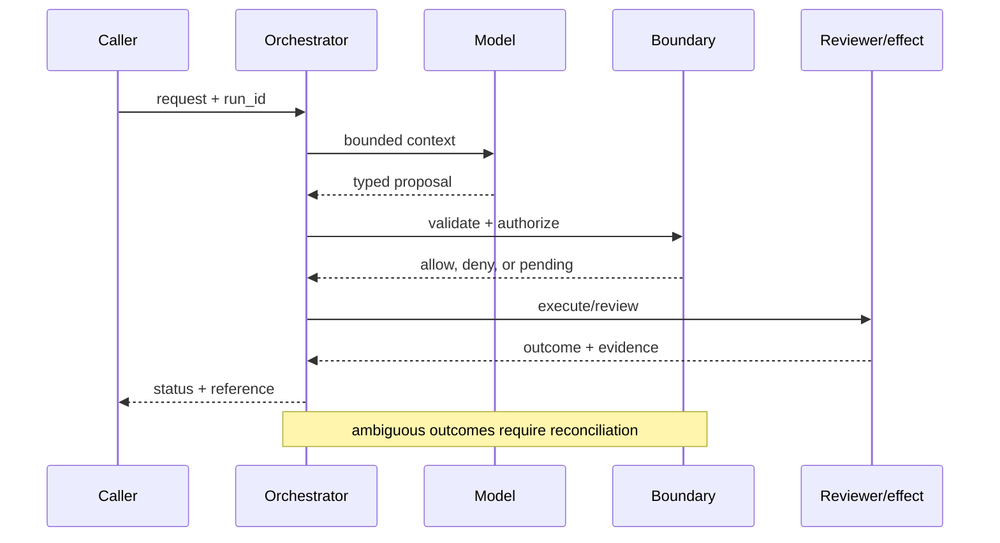

# Enterprise agent platforms
Status: emerging
Sources: [OpenAI — 2026-02-05](https://openai.com/index/introducing-openai-frontier/); [NIST AI RMF — 2023-01-26](https://www.nist.gov/itl/ai-risk-management-framework)

## In one sentence
An enterprise agent platform supplies shared context, tools, permissions, feedback, and management around otherwise stateless model calls.
## Background: what existed before
Teams hand-wired chat prompts, API keys, queues, and audit logs; each agent had a different control plane.
## What changed and why now
Frontier describes a shared system for deploying and governing agents; the change is operational integration, not a claim that models became autonomous.
## Impact on current processing and architecture
Requests now pass through identity, policy, context retrieval, model, tool gateway, and telemetry layers.
## Real-world applications and constraints
Useful for support triage and finance research. Tenant isolation, latency budgets, data residency, and per-tool cost remain constraints.
## Mental model
```mermaid
flowchart LR
 U[User]-->P[Policy]-->C[Context]-->M[Model]-->G[Tool gateway]-->S[Systems]
 classDef io fill:#dbeafe,stroke:#2563eb,color:#111827; classDef ctl fill:#dcfce7,stroke:#16a34a,color:#111827; class U,S io; class P,C,M,G ctl
```
```mermaid
sequenceDiagram
 participant A as Agent
 participant X as Control plane
 participant T as Tool
 A->>X: plan + identity
 X-->>A: allowed context
 A->>T: typed request
 T-->>X: result + audit event
 classDef note fill:#fef3c7,stroke:#d97706,color:#111827
```
## What changed this month
The February map treats agent platforms as a first-class architectural boundary, prompted by Frontier's enterprise-agent framing.
## Engineering consequence
Design one policy and observability plane; keep model adapters replaceable.
## Limits and failure modes
Centralization can create an outage or privilege concentration; shared context can leak tenants; model output is not authorization.

## SDE2 primer and prerequisites

This lesson treats **enterprise agent platforms** as a concrete engineering discipline, not a synonym for model intelligence. Its key artifact is the agent registry and tenant control plane: the service must preserve it across onboarding and expose enough evidence for an operator to decide what happened. A model may suggest a next step, but deterministic interfaces, ownership, and versioned records decide whether that suggestion is usable. The useful prerequisite is familiarity with HTTP, JSON, persistence, queues, retries, authentication, and service-level objectives; this topic adds its own state and failure vocabulary.

The useful boundary for enterprise agent platforms is **agent registry, semantic context layer, adapter, tenant control plane, and audit stream**. These are not magic model capabilities. They are interfaces, records, checks, and operating procedures that can be unit-tested. Start with a low-blast-radius workflow and make every external effect attributable to a run ID, actor, policy version, and evidence reference.

## February source reading: fact before inference

For enterprise agent platforms, read the February source through its own claim boundary. The cited February event is **OpenAI Frontier, published February 5, 2026**. OpenAI says Frontier is a platform to build, deploy, and manage agents; it describes shared context, onboarding, feedback, and explicit identity and permissions. The post reports, as customer examples, production optimization falling from six weeks to one day, more than 90% additional salesperson time, and output increasing by up to 5% at an energy producer. These are reported examples, not independently audited benchmarks. The report or announcement is evidence about what its publisher described. It is not independent validation of the publisher's claims, and it does not specify your data, threat model, latency budget, or regulatory obligations. That distinction matters because a source can motivate a concept without proving that the concept is solved.

For enterprise agent platforms, the engineering inference is narrower: turn the cited capability into an operational contract with topic-specific inputs, states, evidence, and failure ownership. Test that contract against ordinary, adversarial, stale, and interrupted work. A source can motivate this design; it cannot guarantee the resulting reliability or safety.

## Historical baseline and problem boundary

Before a shared enterprise control plane, teams commonly assembled each assistant from a synchronous API call, a prompt, and a service-specific credential. That approach can work for a read-only prototype, but ownership fragments as soon as dozens of agents share customer records, tools, and queues. One team may log prompts while another logs only tool outcomes; one may rotate permissions while another leaves them embedded in configuration. The platform problem is therefore coordination: define a common run identity, registry, policy decision, context reference, and outcome record without forcing every workload onto one model or one deployment region.

For **enterprise agent platforms**, the enterprise agent platforms boundary names enterprise agent platforms evidence, the actor, the mutable state, and the rejecting component. Treat read evidence, model proposals, and committed effects as different data classes. A request can influence a proposal but cannot grant authority. Test this boundary with stale, malformed, replayed, and partially completed cases.

## Architecture and data flow

The enterprise agent platforms path starts with its own enterprise agent platforms evidence admission check, then records topic state, invokes only the needed processor, and finishes at a enterprise agent platforms outcome gate for **enterprise agent platforms**. Keep policy and configuration revisions beside the work, while generated text remains separate from authorization. Measure the bottleneck that belongs to enterprise agent platforms, not a generic agent score.

```mermaid
flowchart LR
  A[Caller] --> I[Identity and tenant]
  I --> C[Context/evidence]
  C --> M[Model proposal]
  M --> B[Agent Registry boundary]
  B --> X[Effect or review]
  X --> L[(Evidence log)]
  classDef data fill:#dbeafe,stroke:#2563eb,color:#172554; classDef control fill:#dcfce7,stroke:#15803d,color:#14532d; classDef risk fill:#fee2e2,stroke:#dc2626,color:#450a0a
  class A,C,X,L data; class I,B control; class M risk
```

Keep user intent, retrieved business facts, platform policy, tool results, and generated proposals in separate typed fields. In a platform, this separation is also an ownership map: the context service owns source authorization, the model adapter owns generation metadata, the tool gateway owns capability checks, and the audit stream owns the decision record. An instruction hidden in a ticket or tool response may influence a proposal but cannot become a platform policy. Bind tenant, region, data class, and registry version to cache and event keys. Retain references and hashes where possible; a central audit plane should explain a decision without becoming a second unrestricted copy of every transcript.

For enterprise agent platforms, record a run identifier, actor, purpose, agent registry, semantic context layer, adapter, tenant control plane, and audit stream, policy and model versions, evidence references, decision, attempts, timestamps, and final state. Add the topic's durable artifact—such as a checkpoint, capability, proof status, privacy budget, or provenance chain—rather than assuming a generic transcript can explain the outcome. Keep raw content behind controlled references and retention rules.

## Processing walkthrough and state

An enterprise platform must make control-plane failures visible as states, not hide them behind a generic model error. A run can be `registered`, `admitted`, `context_denied`, `proposed`, `policy_blocked`, `awaiting_owner`, `executing`, `completed`, or `reconciliating`. Store the registry and policy versions at each transition. If a policy service is unavailable, the safe default for a write is usually blocked or read-only; if a regional control plane is partitioned, a short-lived cached decision needs an explicit expiry and scope. Compare-and-swap on the run record prevents two workers or two regions from both claiming the same platform action.



On retry, reuse the enterprise agent platforms idempotency key or durable artifact; never ask the model to invent a second action when the first attempt has an unknown outcome.

## Platform mechanics: registry, context, execution, and evidence

An enterprise platform should publish an agent registry, not merely a prompt catalog. A registry entry names the owner, supported tasks, tenant scope, data classes, model adapter, tool set, escalation policy, SLO, cost center, evaluation set, and kill switch. This record lets an operator answer basic questions before a run starts: which agent is this, who owns it, what may it read, what may it change, and how is it disabled? Registration is not authorization; the runtime still binds the current actor and resource scope to each request.

Frontier describes shared business context as a semantic layer across systems such as data warehouses, CRM, ticketing, and internal applications. The practical design is a context API that returns typed entities, source identifiers, freshness, and access decisions rather than a large unlabelled text dump. A context request should inherit the caller’s tenant and purpose. If the service cannot establish that a record is permitted or current, it should return `context_unavailable` or `context_denied`; the model should not fill the gap from memory.

The model adapter translates that authorized context into a provider-specific request and returns a platform-neutral proposal. This decoupling makes model replacement possible without silently changing the tool or audit contract. A proposal might contain `operation: investigate_failure`, `asset_id: A-17`, `evidence_ids: [...]`, and `next_step: request_log_bundle`. It is not yet a command. The tool gateway validates the schema, binds the authenticated actor, checks ownership and policy, applies rate and budget limits, and returns a typed result. Credentials remain in the gateway or adapter, never in the model context.

Run state must be durable. Use states such as `registered`, `admitted`, `context_ready`, `proposed`, `awaiting_approval`, `executing`, `completed`, `failed`, and `unknown`. Persist the registry, policy, model, context, and evaluator versions at each meaningful transition. If a request times out after a tool may have committed, record `unknown` and reconcile with the tool’s receipt before retrying. A platform that collapses this into “the model failed” cannot safely recover or explain duplicate effects.

The platform also needs a shared feedback path. Frontier describes onboarding, learning through feedback, and evaluation/optimization as parts of moving agents from demos toward real work. An enterprise implementation should capture approved outcomes, corrections, and failure reasons as governed data. Do not train directly on every transcript: raw interactions may contain secrets, biased labels, or an operator correcting the model for a one-off exception. A feedback record should identify the task, policy version, evaluator, reviewer role, and whether the correction is approved for reuse.

Centralization has a failure mode. One policy or context outage can block many agents, and one incorrect shared schema can spread a defect. Use regional replicas, explicit dependency health, cached read-only metadata with short expiry, and a break-glass procedure that is narrow, audited, and time-limited. Do not make a stale cache silently authorize a write. A degraded platform may offer search, drafting, or queued work while refusing external effects.

## Applications and operational constraints

OpenAI’s Frontier announcement gives a useful motivating example: a hardware manufacturer used agents to investigate failures by combining simulation logs, internal documents, workflows, and code; the company reports reducing root-cause identification from about four hours to a few minutes. This is a publisher-reported customer example, not an independent benchmark. A safe first implementation would run read-only investigations, cite the logs and code it inspected, and let an engineer approve any configuration or deployment change. Measure time to a verified diagnosis, false leads, engineer correction, and evidence completeness—not simply the number of agents registered.

The same platform pattern can support customer support, finance operations, sales research, and maintenance. Each workload needs its own data contract and risk boundary. A support agent may draft a response; a finance agent may prepare a reconciliation; a maintenance agent may recommend a work order. Sending an email, moving money, or changing equipment requires a separate capability, fresh authorization, idempotency, and often human confirmation. Shared platform controls should standardize these gates without pretending that one risk threshold fits every domain.

Capacity planning covers more than model tokens. Context lookups, policy checks, tool concurrency, reviewer queues, audit storage, and downstream API quotas can each limit throughput. Set per-tenant quotas and a total run budget. Track queue age, context latency, model latency, tool latency, cost per accepted outcome, and time spent in review. When an external dependency is slow, return a bounded pending or read-only state instead of allowing agents to accumulate unbounded retries.

## Failure modes, security, and limits

The most important failure is authority confusion: a generated proposal is mistaken for a permitted action. Enforce policy at the tool boundary and test stale approvals, cross-tenant identifiers, hidden instructions in documents, malformed tool arguments, duplicate requests, and revoked access during a run. Keep the model’s evidence and the platform’s decision separate in storage and in the user interface.

Another risk is platform monoculture. A central registry can become a bottleneck or a high-value target. Limit blast radius with tenant-aware namespaces, regional failover, least-privilege service accounts, independent audit storage, and a kill switch that disables effects while preserving diagnosis. A platform metric can also mislead: high adoption may reflect forced use, and high completion may reflect auto-closing difficult cases. Pair usage with correction, appeal, safety, and downstream business outcomes.

## Evaluation and change management

Evaluate the platform at three levels. Registry tests check ownership, supported tools, and scope. Workflow tests use deterministic tool fakes to exercise successful, malformed, slow, revoked, and partially completed operations. Outcome tests check whether the intended business state changed and whether evidence supports the result. Keep protected fixtures for cross-tenant access, policy conflicts, stale context, prompt injection, and tool timeout. A release must retain its baseline, evaluator version, policy version, and rollback path.

Shadow runs are appropriate for a new agent: generate proposals without executing effects and compare them with an existing workflow. A canary can then allow read-only or reversible work for a small tenant cohort. Expand only when quality, latency, cost, privacy, and safety thresholds hold on protected slices. If a policy or context schema changes, version it explicitly and preserve old run records under the old contract. Never rewrite history to make a new platform version appear compatible.

## February primary-source evidence

The source fact is bounded: OpenAI says Frontier is a platform to build, deploy, and manage agents; it describes shared context, onboarding, feedback, and explicit identity and permissions. The post reports customer examples including production optimization falling from six weeks to one day, more than 90% additional salesperson time, and output increasing by up to 5% at an energy producer. These are reported examples, not independently audited benchmarks. The recommendation to implement an agent registry, context service, model adapter, tenant-aware policy gate, and audit stream is an engineering inference from the announcement and established systems practice.

## Mini exercise extension

Create six fixtures: missing context, stale context, an adversarial document, a cross-tenant identifier, a dependency timeout, and a verified read-only completion. Give each fixture a run ID, policy version, evidence IDs, expected state, and recovery owner. Then change the policy version and prove that historical records remain interpretable under the version that governed them.

## Build it locally: numbered implementation

1. Construct an agent registry record with owner, tenant scope, tools, model adapter, policy version, SLO, and kill-switch reference.
2. Implement a context stub that returns source IDs, freshness, and an authorization result; reject missing or expired evidence.
3. Create a typed proposal for one read-only operation and validate its tool name, arguments, tenant, and deadline at a gateway boundary.
4. Persist run states and use an idempotency key for a simulated tool call; represent a timeout as `unknown` until a receipt is reconciled.
5. Add deterministic fixtures for prompt injection, cross-tenant access, revoked permission, malformed output, and dependency failure.
6. Record a redacted feedback event with reviewer, policy version, correction, and reuse decision; do not train on raw interaction logs by default.
7. Run a shadow comparison against a baseline and report quality, latency, cost, review, and protected-slice results before enabling any side effect.

## Runnable low-cost example

```python
from dataclasses import dataclass
@dataclass
class Agent:
    name: str
    tenant: str
    tools: frozenset

registry = {"support-acme": Agent("support-acme", "acme", frozenset({"search", "draft"}))}
request = ("support-acme", "acme", "delete")
a = registry.get(request[0])
print("allow" if a and a.tenant == request[1] and request[2] in a.tools else "deny")
```

This example is intentionally small and deterministic. It demonstrates the lesson's boundary and its invariant; it does not claim production-grade authentication, durability, isolation, or domain correctness. Extend it with the numbered build steps and failure fixtures before drawing operational conclusions.

## Interview Q&A

**Q: What is the difference between a source fact and an engineering inference?** A: The announcement’s description of Frontier is a source fact. A registry, gateway, and audit schema are design recommendations inferred from the problem and must be tested locally.

**Q: Why separate model output from the platform boundary?** A: The model can propose an operation, but only the gateway has current identity, policy, resource ownership, and credentials.

**Q: Which metric would you put on the dashboard first?** A: For the hardware-investigation example, start with time to a verified diagnosis and evidence completeness, then split false leads, correction, latency, and cost by task and tenant.

**Q: When should the system abstain?** A: When required context is stale or unauthorized, a policy check is unavailable, a tool result is ambiguous, or the evidence cannot support the proposed transition.

**Q: What should happen during rollout?** A: Use shadow runs first, then a small read-only or reversible canary with protected fixtures and an explicit kill switch.

## Glossary

- **Agent registry**: a versioned record of an agent’s owner, scope, tools, policy, model adapter, and operating controls.
- **Semantic context**: a typed view of business entities and relationships assembled from authorized enterprise systems.
- **Run ID**: a durable correlation key joining one request to its proposals, decisions, tool attempts, and outcome.
- **Idempotency**: behavior in which retrying one logical command does not duplicate its external effect.
- **Provenance**: origin, version, and transformation evidence attached to context, output, or feedback.
- **SLO**: a measurable service target such as freshness, latency, availability, or queue age.
- **Abstention**: an explicit state used when evidence, authority, or dependency health is insufficient.
- **Break-glass access**: narrowly scoped, time-limited emergency authority with mandatory audit.

## References

- [OpenAI Frontier — February 5, 2026](https://openai.com/index/introducing-openai-frontier/)
- [NIST AI Risk Management Framework](https://www.nist.gov/itl/ai-risk-management-framework)

## Claim ledger

| Claim | Source | Fact or inference |
|---|---|---|
| The cited publisher published the February event on the stated date. | [OpenAI Frontier, published February 5, 2026](https://openai.com/index/introducing-openai-frontier/) | Fact |
| OpenAI says Frontier is a platform to build, deploy, and manage agents; it describes shared context, onboarding, feedback, and explicit identity and permissions. | [OpenAI Frontier, published February 5, 2026](https://openai.com/index/introducing-openai-frontier/) | Fact |
| Turning a collection of clever pilots into a governed internal platform. | Engineering design synthesis | Inference |
| A separately enforced boundary is safer and easier to operate than treating model text as authority. | Topic standards and systems reasoning | Inference |
| The local example demonstrates the concept but does not prove production security, reliability, or generalization. | This lesson | Fact about the example |
