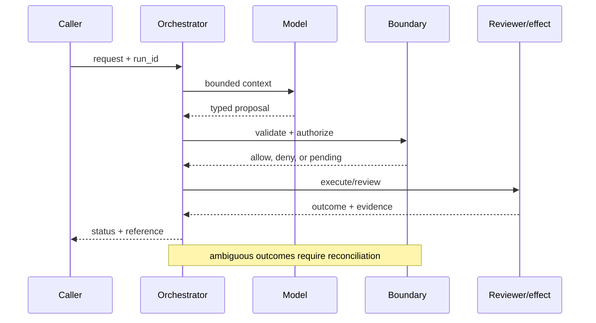

# Enterprise agent platforms
Status: emerging
Sources: [OpenAI — 2026-02-05](https://openai.com/index/introducing-openai-frontier/); [NIST AI RMF — 2023-01-26](https://www.nist.gov/itl/ai-risk-management-framework)

## In one sentence
An enterprise agent platform supplies shared context, tools, permissions, feedback, and management around otherwise stateless model calls.
## Background: what existed before
Teams hand-wired chat prompts, API keys, queues, and audit logs; each agent had a different control plane.
## What changed and why now
Frontier describes a shared system for deploying and governing agents; the change is operational integration, not a claim that models became autonomous.
## Impact on current processing and architecture
Requests now pass through identity, policy, context retrieval, model, tool gateway, and telemetry layers.
## Real-world applications and constraints
Useful for support triage and finance research. Tenant isolation, latency budgets, data residency, and per-tool cost remain constraints.
## Mental model
```mermaid
flowchart LR
 U[User]-->P[Policy]-->C[Context]-->M[Model]-->G[Tool gateway]-->S[Systems]
 classDef io fill:#dbeafe,stroke:#2563eb,color:#111827; classDef ctl fill:#dcfce7,stroke:#16a34a,color:#111827; class U,S io; class P,C,M,G ctl
```
```mermaid
sequenceDiagram
 participant A as Agent
 participant X as Control plane
 participant T as Tool
 A->>X: plan + identity
 X-->>A: allowed context
 A->>T: typed request
 T-->>X: result + audit event
 classDef note fill:#fef3c7,stroke:#d97706,color:#111827
```
## What changed this month
The February map treats agent platforms as a first-class architectural boundary, prompted by Frontier's enterprise-agent framing.
## Engineering consequence
Design one policy and observability plane; keep model adapters replaceable.
## Limits and failure modes
Centralization can create an outage or privilege concentration; shared context can leak tenants; model output is not authorization.

## SDE2 primer and prerequisites

This lesson treats **enterprise agent platforms** as a concrete engineering discipline, not a synonym for model intelligence. Its key artifact is the agent registry and tenant control plane: the service must preserve it across onboarding and expose enough evidence for an operator to decide what happened. A model may suggest a next step, but deterministic interfaces, ownership, and versioned records decide whether that suggestion is usable. The useful prerequisite is familiarity with HTTP, JSON, persistence, queues, retries, authentication, and service-level objectives; this topic adds its own state and failure vocabulary.

The useful boundary for enterprise agent platforms is **agent registry, semantic context layer, adapter, tenant control plane, and audit stream**. These are not magic model capabilities. They are interfaces, records, checks, and operating procedures that can be unit-tested. Start with a low-blast-radius workflow and make every external effect attributable to a run ID, actor, policy version, and evidence reference.

## February source reading: fact before inference

For enterprise agent platforms, read the February source through its own claim boundary. The cited February event is **OpenAI Frontier, published February 5, 2026**. OpenAI says Frontier is a platform to build, deploy, and manage agents; it describes shared context, onboarding, feedback, and explicit identity and permissions. The post reports, as customer examples, production optimization falling from six weeks to one day, more than 90% additional salesperson time, and output increasing by up to 5% at an energy producer. These are reported examples, not independently audited benchmarks. The report or announcement is evidence about what its publisher described. It is not independent validation of the publisher's claims, and it does not specify your data, threat model, latency budget, or regulatory obligations. That distinction matters because a source can motivate a concept without proving that the concept is solved.

For enterprise agent platforms, the engineering inference is narrower: turn the cited capability into an operational contract with topic-specific inputs, states, evidence, and failure ownership. Test that contract against ordinary, adversarial, stale, and interrupted work. A source can motivate this design; it cannot guarantee the resulting reliability or safety.

## Historical baseline and problem boundary

Before a shared enterprise control plane, teams commonly assembled each assistant from a synchronous API call, a prompt, and a service-specific credential. That approach can work for a read-only prototype, but ownership fragments as soon as dozens of agents share customer records, tools, and queues. One team may log prompts while another logs only tool outcomes; one may rotate permissions while another leaves them embedded in configuration. The platform problem is therefore coordination: define a common run identity, registry, policy decision, context reference, and outcome record without forcing every workload onto one model or one deployment region.

For **enterprise agent platforms**, the enterprise agent platforms boundary names enterprise agent platforms evidence, the actor, the mutable state, and the rejecting component. Treat read evidence, model proposals, and committed effects as different data classes. A request can influence a proposal but cannot grant authority. Test this boundary with stale, malformed, replayed, and partially completed cases.

## Architecture and data flow

The enterprise agent platforms path starts with its own enterprise agent platforms evidence admission check, then records topic state, invokes only the needed processor, and finishes at a enterprise agent platforms outcome gate for **enterprise agent platforms**. Keep policy and configuration revisions beside the work, while generated text remains separate from authorization. Measure the bottleneck that belongs to enterprise agent platforms, not a generic agent score.

```mermaid
flowchart LR
  A[Caller] --> I[Identity and tenant]
  I --> C[Context/evidence]
  C --> M[Model proposal]
  M --> B[Agent Registry boundary]
  B --> X[Effect or review]
  X --> L[(Evidence log)]
  classDef data fill:#dbeafe,stroke:#2563eb,color:#172554; classDef control fill:#dcfce7,stroke:#15803d,color:#14532d; classDef risk fill:#fee2e2,stroke:#dc2626,color:#450a0a
  class A,C,X,L data; class I,B control; class M risk
```

Keep user intent, retrieved business facts, platform policy, tool results, and generated proposals in separate typed fields. In a platform, this separation is also an ownership map: the context service owns source authorization, the model adapter owns generation metadata, the tool gateway owns capability checks, and the audit stream owns the decision record. An instruction hidden in a ticket or tool response may influence a proposal but cannot become a platform policy. Bind tenant, region, data class, and registry version to cache and event keys. Retain references and hashes where possible; a central audit plane should explain a decision without becoming a second unrestricted copy of every transcript.

For enterprise agent platforms, record a run identifier, actor, purpose, agent registry, semantic context layer, adapter, tenant control plane, and audit stream, policy and model versions, evidence references, decision, attempts, timestamps, and final state. Add the topic's durable artifact—such as a checkpoint, capability, proof status, privacy budget, or provenance chain—rather than assuming a generic transcript can explain the outcome. Keep raw content behind controlled references and retention rules.

## Processing walkthrough and state

An enterprise platform must make control-plane failures visible as states, not hide them behind a generic model error. A run can be `registered`, `admitted`, `context_denied`, `proposed`, `policy_blocked`, `awaiting_owner`, `executing`, `completed`, or `reconciliating`. Store the registry and policy versions at each transition. If a policy service is unavailable, the safe default for a write is usually blocked or read-only; if a regional control plane is partitioned, a short-lived cached decision needs an explicit expiry and scope. Compare-and-swap on the run record prevents two workers or two regions from both claiming the same platform action.



On retry, reuse the enterprise agent platforms idempotency key or durable artifact; never ask the model to invent a second action when the first attempt has an unknown outcome.

## Topic mechanics: Enterprise agent platforms

### Decision model and topic-specific data contract

A platform team should publish an agent registry, not merely a prompt catalog. A registry entry names the owner, tenant scope, data classes, model adapter, tool set, escalation policy, SLO, cost center, evaluation set, and kill switch. The semantic context layer should expose business entities and relationships through a stable contract while preserving the source system's authorization. A context answer therefore includes source IDs and freshness, not just embedded text. The adapter turns that context into a model-specific request and returns a platform-neutral proposal. This lets a team replace a model without granting a new tool or changing the audit schema. The tool gateway is where schemas, policy, rate limits, and idempotency meet. Its events should be consumable by security, finance, and service owners without exposing every prompt. The trade-off is centralization: common controls reduce drift, but a broken control plane can block every tenant. Use regional replicas, cached read-only metadata, and a break-glass path with a short expiry. For the manufacturer example reported by OpenAI, measure investigation time and accepted root-cause actions, not simply how many agents were registered.

Ask what **enterprise agent platforms** can establish at each transition. The request establishes intent only; the agent registry, semantic context layer, adapter, tenant control plane, and audit stream stage establishes a bounded representation; the next checker, owner, or reconciliation step establishes whether the proposed result is acceptable. A timeout, missing dependency, or ambiguous response therefore becomes an explicit status for **root-cause investigation for a hardware manufacturer**, not an implicit success. Persist the relevant versions and evidence references, and retain unknown, deferred, or needs-review states when the system cannot prove the stronger claim.

The second question is what must be versioned. Version the schema, policy, model adapter, context query, evaluator, and relevant data snapshot. Include the version in the run record and in emitted events. A deployment that changes a prompt but cannot identify which runs saw it cannot explain a regression. A policy change must not rewrite history: old runs retain the decision and policy that actually governed them.

The third question is where to put backpressure. Limit model calls, tool calls, context size, queue age, reviewer workload, and cumulative cost. Admission control should happen before expensive retrieval or inference when the request cannot meet its deadline or safety requirements. A bounded budget also makes failure legible: `budget_exhausted` is different from `model_error`, `policy_denied`, or `unknown_commit`.

Break enterprise agent platforms metrics down by task slice, actor or tenant, version, dependency, and outcome class so a healthy average cannot hide a dangerous subgroup.


## Enterprise agent platforms: focused design workshop

In enterprise agent platforms, keep request prose, retrieved evidence, generated proposals, and the lesson artifact in separate typed fields. enterprise agent platforms code owns completeness, freshness, authorization, and promotion of a result; prose only explains intent.

For enterprise agent platforms, the event trail must let an operator distinguish bad input, missing topic evidence, stale state, dependency failure, and a confirmed outcome. Record the enterprise agent platforms artifact and the decision that moved it between states.

There are two subtle cases worth testing. First, a valid record can become invalid between proposal and commit: an approval can expire, a memory can be deleted, a benchmark can be rerun with a different evaluator, or a capacity pool can fill. Recheck the relevant version at the boundary. Second, an invalid record can look plausible because a model or a dashboard smooths away uncertainty. Preserve `unknown`, `abstain`, and `needs_review` as first-class outcomes. Never convert them to success to simplify reporting.

For enterprise agent platforms, slice enterprise agent platforms evidence metrics by task class, actor or tenant, governing revision, dependency, and final state. Report the topic invariant, useful completion, latency, cost, and recovery burden together; averages are insufficient when a rare enterprise agent platforms failure carries the largest consequence.

Save a failing enterprise agent platforms input as a regression fixture only after redaction, classification, and capture of the governing version.


## Applications and operational constraints

Use **root-cause investigation for a hardware manufacturer** as the first controlled rollout for enterprise agent platforms. Start with observation or draft output, compare it with a deterministic or human baseline, and then admit only a small cohort and a narrow class of effects. The release gate should combine topic-specific quality with latency, cost, privacy, and reliability limits. Keep a kill switch and a recovery owner. A faster or more agreeable model is not an improvement if it drops agent registry, semantic context layer, adapter, tenant control plane, and audit stream, increases hidden work, or makes an incorrect transition harder to reverse.

Beyond **enterprise agent platforms**, enterprise agent platforms applies to workflows where enterprise agent platforms evidence matters. Choose an application with a named owner and bounded effects, then document its data residency, access, quota, staffing, latency, and rollback constraints. The right metric differs by deployment; do not import a support or research target without checking the actual user outcome.

Capacity for enterprise agent platforms includes more than model tokens: enterprise agent platforms evidence storage, validators, queues, reviewers, and downstream quotas can each become the limiter. Budget the critical path and define a labeled degraded mode such as draft-only, read-only, cached, or deferred work.

## Failure modes, security, and limits

A primary enterprise agent platforms failure is confusing a generated suggestion with a trusted enterprise agent platforms evidence result. Enforce the topic invariant at the owning boundary, preserve evidence and version data, and exercise adversarial, stale, partial, and dependency-failure fixtures.

A enterprise agent platforms dashboard can be gamed by refusing hard cases, weakening checks, or hiding recovery work. Set floors for enterprise agent platforms evidence quality and safety before optimizing throughput, and inspect overrides, abstentions, and high-impact slices.

For enterprise agent platforms, the February source has a bounded claim. The February source also has scope limits. OpenAI says Frontier is a platform to build, deploy, and manage agents; it describes shared context, onboarding, feedback, and explicit identity and permissions. The post reports, as customer examples, production optimization falling from six weeks to one day, more than 90% additional salesperson time, and output increasing by up to 5% at an energy producer. These are reported examples, not independently audited benchmarks. Nothing in that observation proves robustness against your adversaries, correctness on your domain, or a particular service-level target. Treat vendor examples as source facts and label recommendations as inference. When evidence is weak, abstention and escalation are valid outcomes.

## Evaluation and change management

Build enterprise agent platforms fixtures around ordinary, ambiguous, malformed, adversarial, slow, stale, and interrupted enterprise agent platforms evidence cases. Store expected topic states and invariants, compare with a pinned baseline, classify failures, and remove secrets before using production traces.

A enterprise agent platforms release gate should require a enterprise agent platforms evidence quality floor, a safety ceiling, a reliability budget, a cost limit, and complete evidence. Use shadow or a small canary, retain the prior contract, and ensure rollback names any enterprise agent platforms effects needing reconciliation.

## February primary-source evidence

The source fact is bounded: **OpenAI says Frontier is a platform to build, deploy, and manage agents; it describes shared context, onboarding, feedback, and explicit identity and permissions. The post reports, as customer examples, production optimization falling from six weeks to one day, more than 90% additional salesperson time, and output increasing by up to 5% at an energy producer. These are reported examples, not independently audited benchmarks.** The February publication date and the publisher's wording should be cited when teaching the event. The recommendation that teams implement agent registry, semantic context layer, adapter, tenant control plane, and audit stream is an inference from the event plus established systems practice. It should be validated with local fixtures, security review, operational metrics, and domain experts. The source does not independently verify the examples, and this article does not present them as guarantees.

## Mini exercise extension

Create six fixtures for **enterprise agent platforms** using the enterprise agent platforms vocabulary: a enterprise agent platforms evidence omission, a stale or contradictory enterprise agent platforms evidence record, an adversarial input, a boundary rejection, a dependency interruption, and a verified completion. Assert different states for each case; do not use one generic success label. Store the evidence reference and recovery owner beside every assertion, then alter the governing version and prove that prior enterprise agent platforms records remain historical.

## Build it locally: numbered implementation

1. Construct a enterprise agent platforms test record with actor, request, enterprise agent platforms evidence, decision, and outcome fields; reject a run that cannot identify the governing version.
2. Implement the enterprise agent platforms boundary as a pure function. It must inspect enterprise agent platforms evidence, return a typed state, and refuse an unrecognized or incomplete transition.
3. Create a deterministic enterprise agent platforms generator with a valid proposal, a malformed proposal, and an input that attempts to redirect the topic-specific decision.
4. Simulate the enterprise agent platforms dependency failing after admission. Use its own correlation or artifact key to detect duplicate delivery and reconcile uncertainty.
5. Write an event stream containing enterprise agent platforms states, redacting sensitive payloads while retaining the evidence pointers needed for an offline replay.
6. Measure enterprise agent platforms correctness alongside rejection rate, time in each state, recovery work, and resource cost; report slices relevant to the lesson.
7. Change the enterprise agent platforms schema or policy revision and verify that old events still resolve under their original contract rather than being reinterpreted.

## Runnable low-cost example

```python
from dataclasses import dataclass
@dataclass
class Agent:
    name: str
    tenant: str
    tools: frozenset

registry = {"support-acme": Agent("support-acme", "acme", frozenset({"search", "draft"}))}
request = ("support-acme", "acme", "delete")
a = registry.get(request[0])
print("allow" if a and a.tenant == request[1] and request[2] in a.tools else "deny")
```

This example is intentionally small and deterministic. It demonstrates the lesson's boundary and its invariant; it does not claim production-grade authentication, durability, isolation, or domain correctness. Extend it with the numbered build steps and failure fixtures before drawing operational conclusions.

## Interview Q&A

**Q: What is the difference between a source fact and an engineering inference?** A: Enforce the enterprise agent platforms rule in deterministic code at the resource or artifact boundary; model output may propose, but it cannot authorize or prove the result.

**Q: Why separate model output from the boundary?** A: Enforce the enterprise agent platforms rule in deterministic code at the resource or artifact boundary; model output may propose, but it cannot authorize or prove the result.

**Q: Which metric would you put on the dashboard first?** A: Track enterprise agent platforms evidence, plus false acceptance or rejection, time spent, resource cost, and recovery; slice results by the enterprise agent platforms risk classes.

**Q: When should the system abstain?** A: Enforce the enterprise agent platforms rule in deterministic code at the resource or artifact boundary; model output may propose, but it cannot authorize or prove the result.

**Q: What should happen during rollout?** A: Pin enterprise agent platforms evidence and the governing versions, begin with shadow or reversible work, and require the enterprise agent platforms invariant before widening effects.

## Glossary

- **Agent Registry**: the topic-specific control boundary that mediates a model proposal and an outcome.
- **Run ID**: the correlation key that joins one enterprise agent platforms attempt to its actor, enterprise agent platforms evidence, decisions, and recovery evidence.
- **Idempotency**: the enterprise agent platforms guarantee that a retry does not create a second logical result or duplicate effect.
- **Provenance**: origin, version, and transformation evidence attached to a enterprise agent platforms input or artifact.
- **SLO**: an explicit enterprise agent platforms service target, such as freshness, verification latency, queue age, or availability.
- **Abstention**: the enterprise agent platforms state used when evidence, authority, or dependency health is insufficient for a stronger claim.
- **Inference**: an engineering recommendation about enterprise agent platforms derived from source facts rather than presented as a source guarantee.

## References

- [OpenAI Frontier — February 5, 2026](https://openai.com/index/introducing-openai-frontier/)
- [NIST AI Risk Management Framework](https://www.nist.gov/itl/ai-risk-management-framework)

## Claim ledger

| Claim | Source | Fact or inference |
|---|---|---|
| The cited publisher published the February event on the stated date. | [OpenAI Frontier, published February 5, 2026](https://openai.com/index/introducing-openai-frontier/) | Fact |
| OpenAI says Frontier is a platform to build, deploy, and manage agents; it describes shared context, onboarding, feedback, and explicit identity and permissions. | [OpenAI Frontier, published February 5, 2026](https://openai.com/index/introducing-openai-frontier/) | Fact |
| Turning a collection of clever pilots into a governed internal platform. | Engineering design synthesis | Inference |
| A separately enforced boundary is safer and easier to operate than treating model text as authority. | Topic standards and systems reasoning | Inference |
| The local example demonstrates the concept but does not prove production security, reliability, or generalization. | This lesson | Fact about the example |
