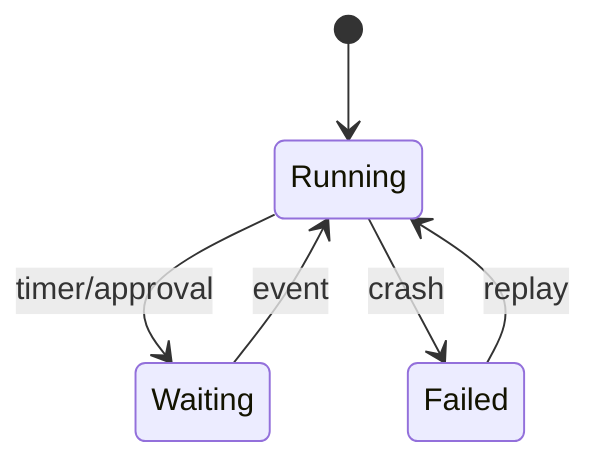
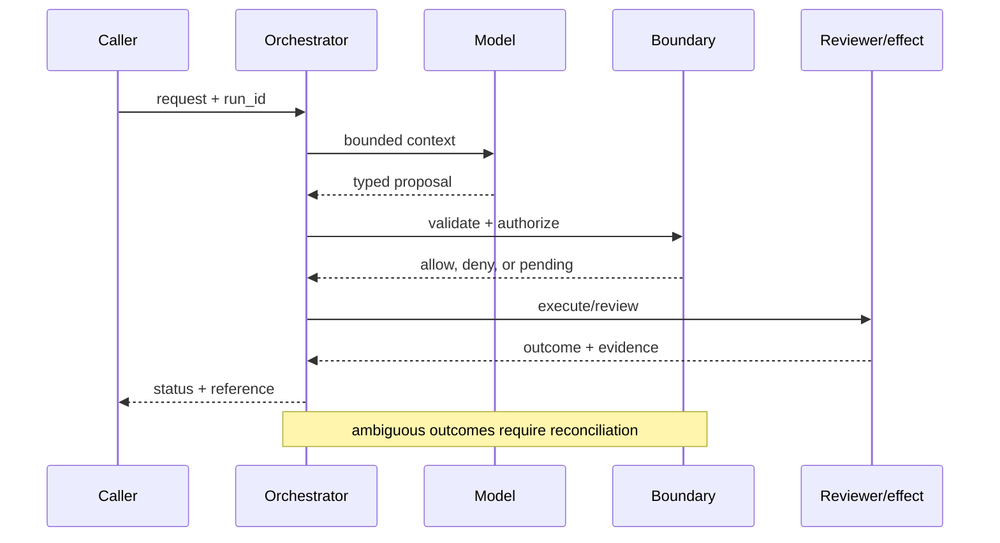
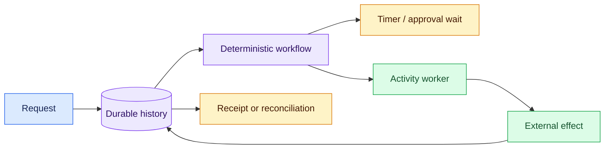

# Stateful runtimes
Status: durable
Sources: [Temporal — durable execution](https://docs.temporal.io/evaluate/use-cases); [OpenAI — 2026-02-05](https://openai.com/index/introducing-openai-frontier/)
## In one sentence
A stateful runtime persists workflow progress so a model-driven process can resume after crashes, waits, or human decisions.
## Background: what existed before
Chat endpoints stored little beyond a transcript; retrying a failed multi-step job could duplicate side effects.
## What changed and why now
Durable-execution systems make history, timers, retries, and activities explicit; Frontier makes this operational need visible for agents.
## Impact on current processing and architecture
Separate workflow state from prompt context; checkpoint before effects and replay deterministic orchestration.
## Real-world applications and constraints
Good for claims processing and provisioning. Storage growth, replay compatibility, and workflow versioning constrain design.
## Mental model
```mermaid
flowchart LR
 W[Workflow]-->H[(History)]-->R[Resume]-->E[Effect]
 classDef a fill:#dbeafe,stroke:#2563eb,color:#111827; classDef b fill:#dcfce7,stroke:#16a34a,color:#111827; class W,E a; class H,R b
```

## What changed this month
The concept map elevates durable state as the boundary between a chat loop and an operable workflow.
## Engineering consequence
Persist state transitions and use idempotency keys for every external effect.
## Limits and failure modes
Replay can diverge when code or model behavior changes; non-deterministic prompts need recorded inputs and explicit versioning.

## SDE2 primer and prerequisites

This lesson treats **stateful runtimes** as a production systems problem. The model is an activity inside a durable workflow: event history records decisions, workers execute bounded steps, timers wake waiting state, and effect owners return receipts. Students should know HTTP, JSON, functions, and basic databases. For SDE2 work, add queues, leases, retries, structured logs, metrics, and service-level objectives (SLOs). The central habit is to distinguish what the February source reports from runtime guarantees that must be designed and tested locally.

The useful boundary for stateful runtimes is **event history, checkpoint, durable timer, replay, workflow version, and compensation**. These are not magic model capabilities. They are interfaces, records, checks, and operating procedures that can be unit-tested. Start with a low-blast-radius workflow and make every external effect attributable to a run ID, actor, policy version, and evidence reference.

## February source reading: fact before inference

For stateful runtimes, read the February source through its own claim boundary. The cited February event is **OpenAI Frontier, published February 5, 2026**. Frontier's February 5 description says agents can operate across local environments, enterprise clouds, and hosted runtimes, use tools, and build memories from interactions. The factual implication for this lesson is only that multi-step execution is part of the announced product framing; durable replay and exactly-once effects are engineering designs, not promises in the post. The report or announcement is evidence about what its publisher described. It is not independent validation of the publisher's claims, and it does not specify your data, threat model, latency budget, or regulatory obligations. That distinction matters because a source can motivate a concept without proving that the concept is solved.

For stateful runtimes, the engineering inference is narrower: turn the cited capability into an operational contract with topic-specific inputs, states, evidence, and failure ownership. Test that contract against ordinary, adversarial, stale, and interrupted work. A source can motivate this design; it cannot guarantee the resulting reliability or safety.

## Historical baseline and problem boundary

The useful baseline for a stateful runtime is a synchronous request that ends with one response. That model breaks when work waits on a human, timer, or provider and the process can disappear between steps. Durable history, checkpoints, leases, and reconciliation turn a transient model call into resumable workflow state.

The runtime boundary separates transient model context from durable workflow state, external effects, and recovery evidence. Treat read evidence, model proposals, and committed effects as different data classes. A request can influence a proposal but cannot grant authority. Test this boundary with stale, malformed, replayed, and partially completed cases.

## Architecture and data flow

The workflow path starts with identity and admission, records a durable state transition, invokes only the needed activity, and finishes at a receipt or explicit recovery state. Keep policy and configuration revisions beside the work, while generated text remains separate from authorization. Measure history growth, replay, queue age, and recovery—not a generic agent score.

```mermaid
flowchart LR
  A[Caller] --> I[Identity and tenant]
  I --> C[Context/evidence]
  C --> M[Model proposal]
  M --> B[Event History boundary]
  B --> X[Effect or review]
  X --> L[(Evidence log)]
  classDef data fill:#dbeafe,stroke:#2563eb,color:#172554; classDef control fill:#dcfce7,stroke:#15803d,color:#14532d; classDef risk fill:#fee2e2,stroke:#dc2626,color:#450a0a
  class A,C,X,L data; class I,B control; class M risk
```

Keep event payloads, activity results, model proposals, and policy decisions in separate records. A replay engine should know which values are authoritative history and which are recomputable hints. Bind workflow ID, tenant, sequence, and schema version to each event; retain redacted payload pointers rather than unbounded transcripts.

For stateful runtimes, record a run identifier, actor, purpose, event history, checkpoint, durable timer, replay, workflow version, and compensation, policy and model versions, evidence references, decision, attempts, timestamps, and final state. Add the topic's durable artifact—such as a checkpoint, capability, proof status, privacy budget, or provenance chain—rather than assuming a generic transcript can explain the outcome. Keep raw content behind controlled references and retention rules.

## Processing walkthrough and state

The runtime must model timer expiry, worker loss, cancellation, replay mismatch, and post-commit uncertainty as first-class transitions. Guard each event append with sequence and workflow version, and let a reconciler decide whether an ambiguous activity can resume. A missing worker heartbeat is not a failed business operation.



On retry, reuse the stateful runtimes idempotency key or durable artifact; never ask the model to invent a second action when the first attempt has an unknown outcome.

## Topic mechanics: durable workflow state

A stateful runtime needs a history that is more authoritative than the current prompt. Store commands, accepted events, timers, activity results, and workflow-code version. The orchestrator can replay deterministic decisions from that history; model calls should be isolated as activities whose inputs and outputs are recorded. This makes a language model replaceable without making the workflow history unknowable.

Consider a procurement workflow with states `quote_requested`, `quote_received`, `approval_pending`, `order_submitted`, and `delivery_confirmed`. Each state has an owner, timeout, allowed transition, and evidence requirement. A durable timer wakes the workflow after an approval window without keeping a process alive. A worker lease prevents two workers from executing the same step, while a heartbeat distinguishes a slow worker from a lost one. These are runtime facts and contracts, not properties that a model can infer.

Exactly-once execution is usually unavailable across an external API. The practical goal is one logical effect: persist an execution record before the call, send an idempotency key, save the provider receipt, and reconcile an `unknown` outcome before retrying. A crash between provider commit and local event append is normal distributed-systems behavior. It must become a recoverable state, not a blind retry.

Replay compatibility is a release concern. Version the workflow definition, event schema, activity contract, and migration policy. Persist the workflow version with events and use a compatibility gate when old history encounters new code. If a branch must change, use an explicit version marker or migration; do not silently replay old commands through a new interpretation. Test crash points between every event append, checkpoint, and external call.



## Runtime state, failure, and recovery

Represent state transitions explicitly: `created`, `running`, `waiting`, `cancelled`, `activity_pending`, `succeeded`, `failed`, `unknown`, and `compensation_required`. A missing heartbeat is not proof that an external operation failed. A timer firing after cancellation is a race that the state store must reject using a version or compare-and-swap operation. A worker retry must claim a specific activity attempt, not simply rerun the latest model plan.

The state record should include workflow ID, run ID, tenant, actor, workflow version, event sequence, current state, deadline, activity attempt, idempotency key, and receipt reference. Keep generated rationale separate from the event that authorized a transition. If a reviewer approves an order, the approval should bind to the exact order, amount, tenant, policy version, and expiry. A later model response cannot widen that approval.

Durable state is not unlimited transcript storage. Keep structured events and references to protected evidence, apply retention to histories and payloads, and redact secrets before export. Large model outputs should be summarized or stored behind access-controlled references with a digest. Deletion and tenant isolation apply to event history, replay fixtures, caches, and provider-side activity logs.

Use bounded queues and budgets. Cap event growth, replay depth, activity concurrency, timer count, checkpoint size, model calls, and total cost. If a workflow cannot meet its deadline, return `deferred` or `needs_review` rather than accumulating retries. Measure history size, replay latency, activity timeout, queue age, recovery time, duplicate-prevention hits, and unknown outcomes by workflow version and tenant. A healthy average can hide a broken migration or one tenant’s starvation.

## Applications and operational constraints

Claims processing, provisioning, procurement, and long-running support cases all benefit from durable state because they wait on people and external systems. A claims workflow can pause for a missing document, wake when the document arrives, call a fraud-review service, and resume after a human decision. The model may summarize evidence or propose the next step; the runtime owns the waiting state, deadlines, permissions, and receipt.

For an AI agent, Frontier’s announcement describes execution across local environments, enterprise cloud infrastructure, and hosted runtimes, plus tools and memory. That is a product-framing fact, not a guarantee of replay safety or exactly-once effects. The engineering consequence is to put the agent inside a durable workflow: record its context snapshot, model and prompt versions, tool proposal, policy decision, activity attempt, and final evidence. A run can then resume without asking the model to reconstruct an unknown prior action from conversation text.

Durability has costs. Event histories consume storage, replay consumes CPU, version migrations add release work, and reconciliation adds latency after ambiguous failures. A short chat response may not need a workflow engine. Use a stateful runtime when work crosses process lifetimes, waits on events, has material side effects, or needs audit and recovery. For a low-risk draft, a database row and queue may suffice; for a payment or deployment, durable history and receipt reconciliation are worth the overhead.

## Failure modes and evaluation

Test worker crashes before and after an external call, duplicate timer delivery, delayed cancellation, out-of-order signals, malformed activity results, provider timeouts, history corruption, and incompatible workflow code. The expected result is a typed state and a safe recovery path. Do not convert every failure to a new model call: replay the known history, reconcile external state, and ask for human help when the effect cannot be established.

Evaluate both runtime correctness and business outcome. Runtime tests verify event ordering, state transitions, lease behavior, retry limits, and replay compatibility. End-to-end tests verify that the intended record or deployment changed once and that a failed or cancelled workflow did not change it. Keep a deterministic fake for each dependency and a protected fixture for a partial commit. Record workflow, model, tool, policy, and evaluator versions in the result.

## Mini exercise extension

Create six fixtures: worker crash before activity, timeout after possible commit, timer after cancellation, incompatible workflow version, duplicate signal, and successful resume. Assert the expected state and receipt behavior for each. Then add one model-generated proposal and prove that replay uses the persisted proposal and versioned activity result rather than silently requesting a new plan.

## Evaluation and change management

Build replay fixtures for normal histories, timer races, worker crashes, duplicate activities, incompatible workflow versions, and unknown provider effects. Store expected event sequences and non-duplication invariants. Replay against pinned workflow code and recorded activity results; keep a hidden crash-point set to catch accidental nondeterminism.

Promote a runtime only when replay compatibility, recovery latency, duplicate-effect rate, and history integrity meet their floors. Canary old and new workflow versions against recorded histories, retain a pause switch, and reconcile in-flight activities before rollback. Record which histories need migration or compensation.

## February primary-source evidence

Frontier’s February 5 description says agents can operate across local environments, enterprise clouds, and hosted runtimes, use tools, and build memories from interactions. Temporal’s documentation describes durable execution as resuming applications after crashes, network failures, or infrastructure outages. These source claims motivate the lesson; durable replay, exactly-once effects, and a particular service level are engineering designs that require local validation.

## Mini exercise extension

Create six fixtures: worker crash before activity, timeout after possible commit, timer after cancellation, incompatible workflow version, duplicate signal, and successful resume. Assert the expected state and receipt behavior for each. Then add one model-generated proposal and prove that replay uses the persisted proposal and versioned activity result rather than silently requesting a new plan.

## Build it locally: numbered implementation

1. Construct a workflow record with actor, event sequence, deadline, version, state, and receipt fields.
2. Implement a deterministic transition function that rejects stale sequence numbers and incompatible workflow versions.
3. Simulate a timer and an activity worker with a unique attempt and idempotency key.
4. Inject a crash before and after the simulated external call; represent the latter as `unknown` until reconciliation.
5. Add fixtures for cancellation, duplicate signals, malformed activity results, and a missing dependency.
6. Replay the same history twice and assert the orchestration decisions are identical.
7. Measure history size, queue age, recovery time, duplicate-prevention hits, and unknown outcomes before enabling a side effect.

## Runnable low-cost example

```python
events = [("quote", "wf-7", 1), ("approval", "wf-7", 2), ("order", "wf-7", 3)]
state = {"step": 0}
for kind, workflow, seq in events:
    assert seq == state["step"] + 1
    state.update(step=seq, last=kind, workflow=workflow)
print(state)
```

This event-list example demonstrates sequence checking only. It does not provide durable storage, crash recovery, worker leases, or exactly-once effects; add the failure fixtures and receipt reconciliation before making runtime claims.

## Interview Q&A

**Q: What must be deterministic in a stateful runtime?** A: Workflow orchestration, state transitions, timer handling, and effect admission. Model calls should be recorded or isolated as versioned activities.

**Q: What belongs in durable history?** A: Accepted commands, events, activity results, workflow version, approvals, timer signals, receipts, and references needed to reconstruct the decision.

**Q: Which metric would you put on the dashboard first?** A: Unknown outcomes and recovery age, because they reveal whether the system can reconcile effects after failure.

**Q: What does replay prove?** A: That compatible history and workflow code produce the same orchestration path; it does not prove an external effect occurred.

**Q: How should stateful runtimes be released?** A: Version workflow code and event schemas, replay protected histories, canary reversible work, and retain rollback and reconciliation procedures.

## Glossary

- **Event history**: the ordered durable record of commands, events, timers, and activity results used to resume a workflow.
- **Run ID**: the correlation key joining one workflow attempt to its actor, state, effects, and recovery evidence.
- **Activity**: a bounded side operation performed by a worker outside deterministic workflow orchestration.
- **Idempotency**: behavior in which retrying one logical command does not duplicate its external effect.
- **Replay**: reconstructing workflow decisions from recorded history under compatible code.
- **Compensation**: a corrective action used when a completed effect cannot be rolled back directly.
- **Unknown**: a state in which transport evidence is insufficient to establish whether an external effect occurred.

## References

- [OpenAI Frontier — February 5, 2026](https://openai.com/index/introducing-openai-frontier/)
- [Temporal durable execution concepts](https://docs.temporal.io/evaluate/use-cases)

## Claim ledger

| Claim | Source | Fact or inference |
|---|---|---|
| The cited publisher published the February event on the stated date. | [OpenAI Frontier, published February 5, 2026](https://openai.com/index/introducing-openai-frontier/) | Fact |
| Frontier's February 5 description says agents can operate across local environments, enterprise clouds, and hosted runtimes, use tools, and build memories from interactions. | [OpenAI Frontier, published February 5, 2026](https://openai.com/index/introducing-openai-frontier/) | Fact |
| Separating durable workflow state from transient model context. | Engineering design synthesis | Inference |
| A separately enforced boundary is safer and easier to operate than treating model text as authority. | Topic standards and systems reasoning | Inference |
| The local example demonstrates the concept but does not prove production security, reliability, or generalization. | This lesson | Fact about the example |
