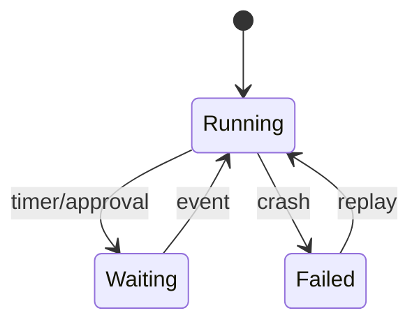
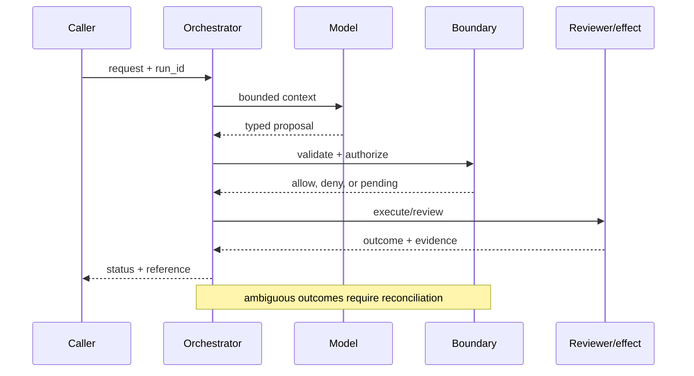

# Stateful runtimes
Status: durable
Sources: [Temporal — durable execution](https://docs.temporal.io/evaluate/use-cases); [OpenAI — 2026-02-05](https://openai.com/index/introducing-openai-frontier/)
## In one sentence
A stateful runtime persists workflow progress so a model-driven process can resume after crashes, waits, or human decisions.
## Background: what existed before
Chat endpoints stored little beyond a transcript; retrying a failed multi-step job could duplicate side effects.
## What changed and why now
Durable-execution systems make history, timers, retries, and activities explicit; Frontier makes this operational need visible for agents.
## Impact on current processing and architecture
Separate workflow state from prompt context; checkpoint before effects and replay deterministic orchestration.
## Real-world applications and constraints
Good for claims processing and provisioning. Storage growth, replay compatibility, and workflow versioning constrain design.
## Mental model
```mermaid
flowchart LR
 W[Workflow]-->H[(History)]-->R[Resume]-->E[Effect]
 classDef a fill:#dbeafe,stroke:#2563eb,color:#111827; classDef b fill:#dcfce7,stroke:#16a34a,color:#111827; class W,E a; class H,R b
```

## What changed this month
The concept map elevates durable state as the boundary between a chat loop and an operable workflow.
## Engineering consequence
Persist state transitions and use idempotency keys for every external effect.
## Limits and failure modes
Replay can diverge when code or model behavior changes; non-deterministic prompts need recorded inputs and explicit versioning.

## SDE2 primer and prerequisites

This lesson treats **stateful runtimes** as a production systems problem. The model is an activity inside a durable workflow: event history records decisions, workers execute bounded steps, timers wake waiting state, and effect owners return receipts. Students should know HTTP, JSON, functions, and basic databases. For SDE2 work, add queues, leases, retries, structured logs, metrics, and service-level objectives (SLOs). The central habit is to distinguish what the February source reports from runtime guarantees that must be designed and tested locally.

The useful boundary for stateful runtimes is **event history, checkpoint, durable timer, replay, workflow version, and compensation**. These are not magic model capabilities. They are interfaces, records, checks, and operating procedures that can be unit-tested. Start with a low-blast-radius workflow and make every external effect attributable to a run ID, actor, policy version, and evidence reference.

## February source reading: fact before inference

For stateful runtimes, read the February source through its own claim boundary. The cited February event is **OpenAI Frontier, published February 5, 2026**. Frontier's February 5 description says agents can operate across local environments, enterprise clouds, and hosted runtimes, use tools, and build memories from interactions. The factual implication for this lesson is only that multi-step execution is part of the announced product framing; durable replay and exactly-once effects are engineering designs, not promises in the post. The report or announcement is evidence about what its publisher described. It is not independent validation of the publisher's claims, and it does not specify your data, threat model, latency budget, or regulatory obligations. That distinction matters because a source can motivate a concept without proving that the concept is solved.

For stateful runtimes, the engineering inference is narrower: turn the cited capability into an operational contract with topic-specific inputs, states, evidence, and failure ownership. Test that contract against ordinary, adversarial, stale, and interrupted work. A source can motivate this design; it cannot guarantee the resulting reliability or safety.

## Historical baseline and problem boundary

The useful baseline for a stateful runtime is a synchronous request that ends with one response. That model breaks when work waits on a human, timer, or provider and the process can disappear between steps. Durable history, checkpoints, leases, and reconciliation turn a transient model call into resumable workflow state.

For **stateful runtimes**, the stateful runtimes boundary names stateful runtimes evidence, the actor, the mutable state, and the rejecting component. Treat read evidence, model proposals, and committed effects as different data classes. A request can influence a proposal but cannot grant authority. Test this boundary with stale, malformed, replayed, and partially completed cases.

## Architecture and data flow

The stateful runtimes path starts with its own stateful runtimes evidence admission check, then records topic state, invokes only the needed processor, and finishes at a stateful runtimes outcome gate for **stateful runtimes**. Keep policy and configuration revisions beside the work, while generated text remains separate from authorization. Measure the bottleneck that belongs to stateful runtimes, not a generic agent score.

```mermaid
flowchart LR
  A[Caller] --> I[Identity and tenant]
  I --> C[Context/evidence]
  C --> M[Model proposal]
  M --> B[Event History boundary]
  B --> X[Effect or review]
  X --> L[(Evidence log)]
  classDef data fill:#dbeafe,stroke:#2563eb,color:#172554; classDef control fill:#dcfce7,stroke:#15803d,color:#14532d; classDef risk fill:#fee2e2,stroke:#dc2626,color:#450a0a
  class A,C,X,L data; class I,B control; class M risk
```

Keep event payloads, activity results, model proposals, and policy decisions in separate records. A replay engine should know which values are authoritative history and which are recomputable hints. Bind workflow ID, tenant, sequence, and schema version to each event; retain redacted payload pointers rather than unbounded transcripts.

For stateful runtimes, record a run identifier, actor, purpose, event history, checkpoint, durable timer, replay, workflow version, and compensation, policy and model versions, evidence references, decision, attempts, timestamps, and final state. Add the topic's durable artifact—such as a checkpoint, capability, proof status, privacy budget, or provenance chain—rather than assuming a generic transcript can explain the outcome. Keep raw content behind controlled references and retention rules.

## Processing walkthrough and state

The runtime must model timer expiry, worker loss, cancellation, replay mismatch, and post-commit uncertainty as first-class transitions. Guard each event append with sequence and workflow version, and let a reconciler decide whether an ambiguous activity can resume. A missing worker heartbeat is not a failed business operation.



On retry, reuse the stateful runtimes idempotency key or durable artifact; never ask the model to invent a second action when the first attempt has an unknown outcome.

## Topic mechanics: Stateful runtimes

### Decision model and topic-specific data contract

A durable runtime needs a history that is more authoritative than the current prompt. Store commands, accepted events, timers, activity results, and workflow code version. A worker can replay deterministic orchestration from that history; model calls should be treated as activities whose inputs and outputs are recorded, or whose nondeterminism is isolated behind a versioned decision. Checkpoint after validation and before each side effect. For procurement, the state might be `quote_requested`, `quote_received`, `approval_pending`, `order_submitted`, and `delivery_confirmed`; each state has a timeout and an owner. A durable timer wakes the workflow without keeping a process alive. A lease prevents two workers from claiming the same step, while a heartbeat makes a stuck worker visible. Exactly-once execution is usually unavailable across an external API, so the design goal is one logical effect through an idempotency key plus reconciliation. When workflow code changes, use a version gate so old histories do not replay through incompatible branches. Test crash points between every write and event append. A replay that reaches a different branch is a compatibility failure, not a reason to ask the model for a fresh plan.

Ask what **stateful runtimes** can establish at each transition. The request establishes intent only; the stateful runtimes evidence and state stage establishes a bounded representation; the next checker, owner, or reconciliation step establishes whether the proposed result is acceptable. A timeout, missing dependency, or ambiguous response therefore becomes an explicit status for **stateful runtimes**, not an implicit success. Persist the relevant versions and evidence references, and retain unknown, deferred, or needs-review states when the system cannot prove the stronger claim.

For a stateful runtime, version the workflow definition, event schema, activity contract, and migration policy. Persist the workflow version with every event so replay uses the rules that created the history; never rewrite an old event merely because a new deployment prefers a different branch.

Use queue admission for stateful work: cap event growth, replay depth, activity concurrency, timer count, and checkpoint size. Reject or defer a run before it consumes a worker when its deadline or recovery budget is already impossible, and distinguish `history_corrupt`, `activity_timeout`, and `replay_budget_exhausted`.

Break stateful runtimes metrics down by task slice, actor or tenant, version, dependency, and outcome class so a healthy average cannot hide a dangerous subgroup.


## Stateful runtimes: focused design workshop

In stateful runtimes, keep request prose, retrieved evidence, generated proposals, and the lesson artifact in separate typed fields. stateful runtimes code owns completeness, freshness, authorization, and promotion of a result; prose only explains intent.

For stateful runtimes, the event trail must let an operator distinguish bad input, missing topic evidence, stale state, dependency failure, and a confirmed outcome. Record the stateful runtimes artifact and the decision that moved it between states.

Test two runtime-specific races. A timer may fire after a cancellation, or a worker may crash after an external effect but before appending its event. Reconcile the receipt before retrying, and use the workflow version to reject an incompatible replay. Preserve `unknown` and `compensation_required` as durable states; never infer completion from a missing heartbeat.

For stateful runtimes, slice stateful runtimes evidence metrics by task class, actor or tenant, governing revision, dependency, and final state. Report the topic invariant, useful completion, latency, cost, and recovery burden together; averages are insufficient when a rare stateful runtimes failure carries the largest consequence.

Save a failing stateful runtimes input as a regression fixture only after redaction, classification, and capture of the governing version.


## Applications and operational constraints

Start stateful runtimes in observation or draft mode, compare against a deterministic or human baseline, then expand only a narrow cohort and reversible effect class.

Beyond **stateful runtimes**, stateful runtimes applies to workflows where stateful runtimes evidence matters. Choose an application with a named owner and bounded effects, then document its data residency, access, quota, staffing, latency, and rollback constraints. The right metric differs by deployment; do not import a support or research target without checking the actual user outcome.

Plan runtime capacity around history writes, replay workers, timers, checkpoint storage, and activity leases. A database outage can stall every workflow even when model capacity is healthy. Provide a pause or read-only status mode, and label it so operators do not interpret an unadvanced workflow as completed.

## Failure modes, security, and limits

Runtime failures center on nondeterministic orchestration, duplicate activity, and history corruption. Keep model calls outside deterministic replay or record their results, use idempotency at every effect boundary, and reconcile an interrupted activity before retrying. Alert on stuck timers, replay divergence, checkpoint growth, and unknown commits; a healthy worker count does not prove workflows are advancing.

Runtime metrics can be gamed by completing trivial workflows, abandoning hard histories, or counting replayed activity as new success. Set floors for recovery, duplicate effects, and replay compatibility. Inspect stuck and compensated runs, not only completed counts, and retain enough event evidence to explain why a workflow was considered successful.

For stateful runtimes, the February source has a bounded claim. The February source also has scope limits. Frontier's February 5 description says agents can operate across local environments, enterprise clouds, and hosted runtimes, use tools, and build memories from interactions. The factual implication for this lesson is only that multi-step execution is part of the announced product framing; durable replay and exactly-once effects are engineering designs, not promises in the post. Nothing in that observation proves robustness against your adversaries, correctness on your domain, or a particular service-level target. Treat vendor examples as source facts and label recommendations as inference. When evidence is weak, abstention and escalation are valid outcomes.

## Evaluation and change management

Build replay fixtures for normal histories, timer races, worker crashes, duplicate activities, incompatible workflow versions, and unknown provider effects. Store expected event sequences and non-duplication invariants. Replay against pinned workflow code and recorded activity results; keep a hidden crash-point set to catch accidental nondeterminism.

Promote a runtime only when replay compatibility, recovery latency, duplicate-effect rate, and history integrity meet their floors. Canary old and new workflow versions against recorded histories, retain a pause switch, and reconcile in-flight activities before rollback. Record which histories need migration or compensation.

## February primary-source evidence

The source fact is bounded: **Frontier's February 5 description says agents can operate across local environments, enterprise clouds, and hosted runtimes, use tools, and build memories from interactions. The factual implication for this lesson is only that multi-step execution is part of the announced product framing; durable replay and exactly-once effects are engineering designs, not promises in the post.** The February publication date and the publisher's wording should be cited when teaching the event. The recommendation that teams implement event history, checkpoint, durable timer, replay, workflow version, and compensation is an inference from the event plus established systems practice. It should be validated with local fixtures, security review, operational metrics, and domain experts. The source does not independently verify the examples, and this article does not present them as guarantees.

## Mini exercise extension

Create six fixtures for **stateful runtimes** using the stateful runtimes vocabulary: a stateful runtimes evidence omission, a stale or contradictory stateful runtimes evidence record, an adversarial input, a boundary rejection, a dependency interruption, and a verified completion. Assert different states for each case; do not use one generic success label. Store the evidence reference and recovery owner beside every assertion, then alter the governing version and prove that prior stateful runtimes records remain historical.

## Build it locally: numbered implementation

1. Construct a stateful runtimes test record with actor, request, stateful runtimes evidence, decision, and outcome fields; reject a run that cannot identify the governing version.
2. Implement the stateful runtimes boundary as a pure function. It must inspect stateful runtimes evidence, return a typed state, and refuse an unrecognized or incomplete transition.
3. Create a deterministic stateful runtimes generator with a valid proposal, a malformed proposal, and an input that attempts to redirect the topic-specific decision.
4. Simulate the stateful runtimes dependency failing after admission. Use its own correlation or artifact key to detect duplicate delivery and reconcile uncertainty.
5. Write an event stream containing stateful runtimes states, redacting sensitive payloads while retaining the evidence pointers needed for an offline replay.
6. Measure stateful runtimes correctness alongside rejection rate, time in each state, recovery work, and resource cost; report slices relevant to the lesson.
7. Change the stateful runtimes schema or policy revision and verify that old events still resolve under their original contract rather than being reinterpreted.

## Runnable low-cost example

```python
events = [("quote", "wf-7", 1), ("approval", "wf-7", 2), ("order", "wf-7", 3)]
state = {"step": 0}
for kind, workflow, seq in events:
    assert seq == state["step"] + 1
    state.update(step=seq, last=kind, workflow=workflow)
print(state)
```

This event-list example demonstrates sequence checking only. It does not provide durable storage, crash recovery, worker leases, or exactly-once effects; add the failure fixtures and receipt reconciliation before making runtime claims.

## Interview Q&A

**Q: What must be deterministic in a stateful runtime?** A: Enforce the stateful runtimes rule in deterministic code at the resource or artifact boundary; model output may propose, but it cannot authorize or prove the result.

**Q: What belongs in durable history?** A: Enforce the stateful runtimes rule in deterministic code at the resource or artifact boundary; model output may propose, but it cannot authorize or prove the result.

**Q: Which metric would you put on the dashboard first?** A: Track stateful runtimes evidence, plus false acceptance or rejection, time spent, resource cost, and recovery; slice results by the stateful runtimes risk classes.

**Q: What does replay prove?** A: Enforce the stateful runtimes rule in deterministic code at the resource or artifact boundary; model output may propose, but it cannot authorize or prove the result.

**Q: How should stateful runtimes be released?** A: Pin stateful runtimes evidence and the governing versions, begin with shadow or reversible work, and require the stateful runtimes invariant before widening effects.

## Glossary

- **Event History**: the topic-specific control boundary that mediates a model proposal and an outcome.
- **Run ID**: the correlation key that joins one stateful runtimes attempt to its actor, stateful runtimes evidence, decisions, and recovery evidence.
- **Idempotency**: the stateful runtimes guarantee that a retry does not create a second logical result or duplicate effect.
- **Provenance**: origin, version, and transformation evidence attached to a stateful runtimes input or artifact.
- **SLO**: an explicit stateful runtimes service target, such as freshness, verification latency, queue age, or availability.
- **Abstention**: the stateful runtimes state used when evidence, authority, or dependency health is insufficient for a stronger claim.
- **Inference**: an engineering recommendation about stateful runtimes derived from source facts rather than presented as a source guarantee.

## References

- [OpenAI Frontier — February 5, 2026](https://openai.com/index/introducing-openai-frontier/)
- [Temporal durable execution concepts](https://docs.temporal.io/evaluate/use-cases)

## Claim ledger

| Claim | Source | Fact or inference |
|---|---|---|
| The cited publisher published the February event on the stated date. | [OpenAI Frontier, published February 5, 2026](https://openai.com/index/introducing-openai-frontier/) | Fact |
| Frontier's February 5 description says agents can operate across local environments, enterprise clouds, and hosted runtimes, use tools, and build memories from interactions. | [OpenAI Frontier, published February 5, 2026](https://openai.com/index/introducing-openai-frontier/) | Fact |
| Separating durable workflow state from transient model context. | Engineering design synthesis | Inference |
| A separately enforced boundary is safer and easier to operate than treating model text as authority. | Topic standards and systems reasoning | Inference |
| The local example demonstrates the concept but does not prove production security, reliability, or generalization. | This lesson | Fact about the example |
