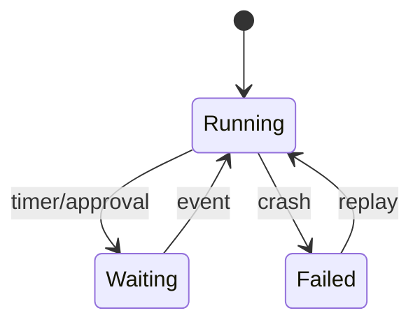
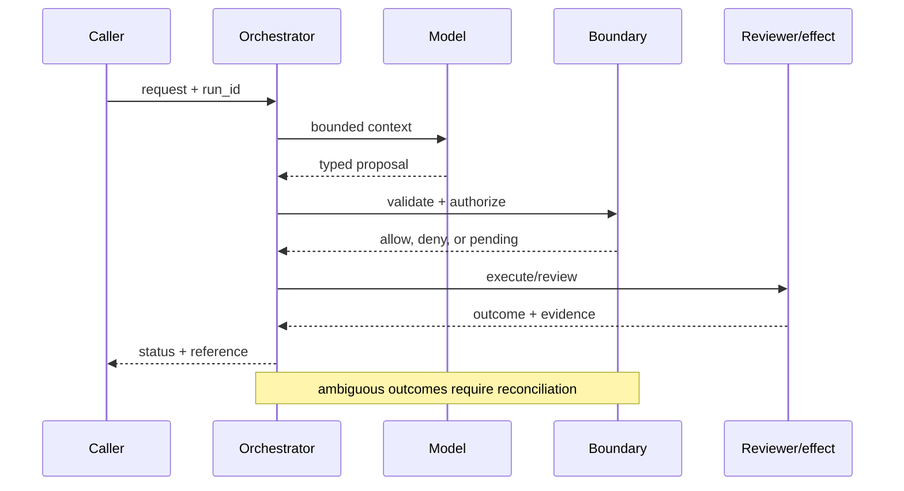

# Stateful runtimes
Status: durable
Sources: [Temporal — durable execution](https://docs.temporal.io/evaluate/use-cases); [OpenAI — 2026-02-05](https://openai.com/index/introducing-openai-frontier/)
## In one sentence
A stateful runtime persists workflow progress so a model-driven process can resume after crashes, waits, or human decisions.
## Background: what existed before
Chat endpoints stored little beyond a transcript; retrying a failed multi-step job could duplicate side effects.
## What changed and why now
Durable-execution systems make history, timers, retries, and activities explicit; Frontier makes this operational need visible for agents.
## Impact on current processing and architecture
Separate workflow state from prompt context; checkpoint before effects and replay deterministic orchestration.
## Real-world applications and constraints
Good for claims processing and provisioning. Storage growth, replay compatibility, and workflow versioning constrain design.
## Mental model
```mermaid
flowchart LR
 W[Workflow]-->H[(History)]-->R[Resume]-->E[Effect]
 classDef a fill:#dbeafe,stroke:#2563eb,color:#111827; classDef b fill:#dcfce7,stroke:#16a34a,color:#111827; class W,E a; class H,R b
```

## What changed this month
The concept map elevates durable state as the boundary between a chat loop and an operable workflow.
## Engineering consequence
Persist state transitions and use idempotency keys for every external effect.
## Limits and failure modes
Replay can diverge when code or model behavior changes; non-deterministic prompts need recorded inputs and explicit versioning.

## SDE2 primer and prerequisites

This lesson is about **stateful runtimes** as a production systems problem. A language model is only one stage: an ingress service accepts work, a data layer supplies evidence, an orchestrator keeps state, a policy layer decides what may happen, and an operator or downstream system observes the result. Students should know HTTP, JSON, functions, and basic databases. SDE2 readers should also know queues, authentication, structured logs, metrics, retries, and service-level objectives (SLOs). The central habit is to label what the February source actually reports separately from a recommendation derived from it.

The useful boundary for stateful runtimes is **event history, checkpoint, durable timer, replay, workflow version, and compensation**. These are not magic model capabilities. They are interfaces, records, checks, and operating procedures that can be unit-tested. Start with a low-blast-radius workflow and make every external effect attributable to a run ID, actor, policy version, and evidence reference.

## February source reading: fact before inference

The primary February event is **OpenAI Frontier, published February 5, 2026**. Frontier's February 5 description says agents can operate across local environments, enterprise clouds, and hosted runtimes, use tools, and build memories from interactions. The factual implication for this lesson is only that multi-step execution is part of the announced product framing; durable replay and exactly-once effects are engineering designs, not promises in the post. The report or announcement is evidence about what its publisher described. It is not independent validation of the publisher's claims, and it does not specify your data, threat model, latency budget, or regulatory obligations. That distinction matters because a source can motivate a concept without proving that the concept is solved.

The engineering inference in this lesson is that separating durable workflow state from transient model context. Write that inference as a testable contract: state the accepted inputs, expected transitions, forbidden outcomes, and evidence needed to review a decision. If a test fails, improve the system or narrow the intended use; do not silently reinterpret a source claim as a guarantee.

## Historical baseline and problem boundary

Before this month's event, a team could make a convincing prototype with a synchronous request, a prompt, one model call, and a small script around an API. That baseline remains appropriate for drafting or a read-only experiment. It becomes unsafe or unreliable when a request crosses systems, waits, changes durable data, or must be explained later. The failure is not merely that the model can be wrong. It is that the surrounding software may have no place to record authority, version, evidence, retries, or recourse.

For **a procurement agent that waits for a quote, approval, and delivery confirmation**, draw the boundary before choosing a model. Identify the human or service principal, the records allowed into context, the actions proposed by the model, the component that validates them, and the owner who handles an ambiguous result. Decide which operations are reads, reversible writes, irreversible writes, or merely recommendations. A useful rule is that an untrusted string may influence a proposal but may never create a permission, erase an audit event, or bypass a state transition.

## Architecture and data flow

A deployable design has a control path and a data path. The control path versions configuration, policy, model adapters, schemas, evaluation sets, and rollout cohorts. The data path receives a request, authenticates it, retrieves bounded evidence, invokes the model, validates a typed proposal, executes an allowed action, and records an outcome. The stateful runtimes boundary sits between the proposal and the observable outcome; it should be visible in traces and owned by a team.

```mermaid
flowchart LR
  A[Caller] --> I[Identity and tenant]
  I --> C[Context/evidence]
  C --> M[Model proposal]
  M --> B[Event History boundary]
  B --> X[Effect or review]
  X --> L[(Evidence log)]
  classDef data fill:#dbeafe,stroke:#2563eb,color:#172554; classDef control fill:#dcfce7,stroke:#15803d,color:#14532d; classDef risk fill:#fee2e2,stroke:#dc2626,color:#450a0a
  class A,C,X,L data; class I,B control; class M risk
```

Use separate fields for user text, retrieved facts, policy instructions, tool output, and generated proposal. This prevents an instruction hidden in a document or tool result from acquiring the authority of a system rule. Every record should carry a tenant or project key where relevant. Cache keys must include authorization scope and source version. Logs should retain enough structured evidence to explain a decision while redacting secrets and unnecessary free text.

A minimal run record is: `run_id`, `request_id`, actor, tenant, purpose, model/version, policy/version, context references, proposal hash, action, decision, timestamps, attempts, effect IDs, and final status. For this topic add event history, checkpoint, durable timer, replay, workflow version, and compensation. Do not put an unbounded transcript in the primary operational table; store a redacted pointer with a retention policy.

## Processing walkthrough and state

The happy path is only one transition. A request may be malformed, missing evidence, denied, awaiting a reviewer, interrupted after a remote commit, or invalidated by a policy change. Model states explicitly: `received`, `validated`, `proposed`, `blocked`, `pending`, `running`, `succeeded`, `failed`, and `cancelled`. Guard transitions with a run version or compare-and-swap so two workers cannot both advance the same work.



Persist the proposal before a side effect. On retry, reuse the same idempotency key or proof artifact rather than asking the model to invent a new action. A timeout is a state of knowledge, not proof that nothing happened. For a reversible operation, record the compensating action; for an irreversible operation, stop and escalate. For this lesson, the most important transition is the one that prevents **a procurement agent that waits for a quote, approval, and delivery confirmation** from becoming an unreviewed or untraceable effect.

## Topic mechanics: Stateful runtimes

### Decision model and topic-specific data contract

A durable runtime needs a history that is more authoritative than the current prompt. Store commands, accepted events, timers, activity results, and workflow code version. A worker can replay deterministic orchestration from that history; model calls should be treated as activities whose inputs and outputs are recorded, or whose nondeterminism is isolated behind a versioned decision. Checkpoint after validation and before each side effect. For procurement, the state might be `quote_requested`, `quote_received`, `approval_pending`, `order_submitted`, and `delivery_confirmed`; each state has a timeout and an owner. A durable timer wakes the workflow without keeping a process alive. A lease prevents two workers from claiming the same step, while a heartbeat makes a stuck worker visible. Exactly-once execution is usually unavailable across an external API, so the design goal is one logical effect through an idempotency key plus reconciliation. When workflow code changes, use a version gate so old histories do not replay through incompatible branches. Test crash points between every write and event append. A replay that reaches a different branch is a compatibility failure, not a reason to ask the model for a fresh plan.

The first implementation question is what the system can know at each stage. At ingress, it knows an authenticated actor and a request, but not whether the request is well-formed or authorized. During retrieval, it can establish source IDs, freshness, and access filters, but similarity is not truth. During model generation, it can ask for a schema and bounded plan, but the output is still untrusted. At the boundary, deterministic code can enforce limits. After execution, only a receipt, read-after-write check, or independent artifact establishes what happened. This epistemic separation keeps **event history, checkpoint, durable timer, replay, workflow version, and compensation** from collapsing into one prompt.

For a stateful runtime, version the workflow definition, event schema, activity contract, and migration policy. Persist the workflow version with every event so replay uses the rules that created the history; never rewrite an old event merely because a new deployment prefers a different branch.

Use queue admission for stateful work: cap event growth, replay depth, activity concurrency, timer count, and checkpoint size. Reject or defer a run before it consumes a worker when its deadline or recovery budget is already impossible, and distinguish `history_corrupt`, `activity_timeout`, and `replay_budget_exhausted`.

For **stateful runtimes**, instrument recovery time, duplicate-effect rate, replay divergence, stuck-workflow age, and state-store growth. Break down every metric by task slice, tenant, model version, policy version, and outcome class. An aggregate success number can improve while a small high-risk slice becomes worse. Pair capability metrics with reliability metrics and safety metrics; never use one as a proxy for the others.


## Stateful runtimes: focused design workshop

The distinctive design choice for this lesson is **event histories and replay**. Model the core record as a typed object with `event_type, sequence, workflow_version, effect_id`. Keep user prose outside that object; prose can explain intent, but code must decide whether the object is complete, authorized, fresh, and safe to execute. The invariant is: **each external effect has one logical event and a replay-safe version**. Emit an event whenever the invariant is checked, including the result, version, actor, and evidence reference. This makes a failure diagnosable without replaying an unconstrained model call.

Consider a concrete **stateful runtimes** run. The ingress validator rejects missing identifiers and normalizes timestamps. The context builder retrieves only records permitted by tenant and purpose. The model receives a bounded view and returns a proposal, never a bearer credential or an opaque instruction. The topic-specific boundary then checks `event_type, sequence, workflow_version, effect_id`. If the check passes, the effect owner commits or queues work and returns a receipt. If it fails, the system returns a structured denial or asks for evidence. A reviewer can inspect the event sequence and distinguish bad input, missing authority, stale state, and a remote failure.

Test two runtime-specific races. A timer may fire after a cancellation, or a worker may crash after an external effect but before appending its event. Reconcile the receipt before retrying, and use the workflow version to reject an incompatible replay. Preserve `unknown` and `compensation_required` as durable states; never infer completion from a missing heartbeat.

For operations, partition metrics by `event histories and replay` and by model, policy, tenant, and outcome. Track the invariant violation directly, plus useful completion, latency, cost, and human override. A single aggregate can hide a catastrophic slice: one customer, one high-risk action, one rare theorem class, or one overloaded region. Set a release floor for the topic-specific safety metric before optimizing throughput.

The mini design exercise is **crash after a commit and prove replay does not duplicate it**. Implement it with an in-memory store first, then add a failure injection at every boundary. Expected behavior should be deterministic even if the proposal generator is not. Save the failing input as a regression fixture only after removing secrets and identifying the policy version that governed it.


## Applications and operational constraints

The strongest first application is **a procurement agent that waits for a quote, approval, and delivery confirmation** because it has a bounded workflow and a domain owner. A team might begin in shadow mode, where the system produces a proposal but performs no effect. Next, allow a canary cohort and only low-risk actions. Require an explicit launch review before expanding scope. The useful outcome is not “the model answered”; it is a completed task that meets quality, latency, cost, privacy, and policy constraints.

Other plausible applications include procurement, claims processing, provisioning, and scheduled compliance reviews. Each has a different bottleneck. A support system values queue age and consistent escalation; an operations system values correctness and rollback; research values evidence and uncertainty; security values time to detect and false-positive capacity. Data residency, tenant isolation, secrets, rate limits, procurement, and human availability can dominate model latency. Document those constraints in the service contract rather than in an informal prompt.

Plan runtime capacity around history writes, replay workers, timers, checkpoint storage, and activity leases. A database outage can stall every workflow even when model capacity is healthy. Provide a pause or read-only status mode, and label it so operators do not interpret an unadvanced workflow as completed.

## Failure modes, security, and limits

Runtime failures center on nondeterministic orchestration, duplicate activity, and history corruption. Keep model calls outside deterministic replay or record their results, use idempotency at every effect boundary, and reconcile an interrupted activity before retrying. Alert on stuck timers, replay divergence, checkpoint growth, and unknown commits; a healthy worker count does not prove workflows are advancing.

Runtime metrics can be gamed by completing trivial workflows, abandoning hard histories, or counting replayed activity as new success. Set floors for recovery, duplicate effects, and replay compatibility. Inspect stuck and compensated runs, not only completed counts, and retain enough event evidence to explain why a workflow was considered successful.

The February source also has scope limits. Frontier's February 5 description says agents can operate across local environments, enterprise clouds, and hosted runtimes, use tools, and build memories from interactions. The factual implication for this lesson is only that multi-step execution is part of the announced product framing; durable replay and exactly-once effects are engineering designs, not promises in the post. Nothing in that observation proves robustness against your adversaries, correctness on your domain, or a particular service-level target. Treat vendor examples as source facts and label recommendations as inference. When evidence is weak, abstention and escalation are valid outcomes.

## Evaluation and change management

Build a fixture set from ordinary, ambiguous, malformed, adversarial, slow, stale, and partially completed cases. Include a golden expected state and the invariants that must never break. Run the set against a pinned model and a deterministic baseline. Review failures by category, not just a total score. Keep hidden cases to detect overfitting, and sample production traces only after removing secrets.

Release gates should include a quality floor, a policy-violation ceiling, a reliability budget, a cost budget, and an evidence-completeness check. Roll out to a small cohort, compare with shadow results, and retain a kill switch that disables risky effects without destroying diagnostic reads. On rollback, record which version was disabled and whether external effects require remediation.

## February primary-source evidence

The source fact is bounded: **Frontier's February 5 description says agents can operate across local environments, enterprise clouds, and hosted runtimes, use tools, and build memories from interactions. The factual implication for this lesson is only that multi-step execution is part of the announced product framing; durable replay and exactly-once effects are engineering designs, not promises in the post.** The February publication date and the publisher's wording should be cited when teaching the event. The recommendation that teams implement event history, checkpoint, durable timer, replay, workflow version, and compensation is an inference from the event plus established systems practice. It should be validated with local fixtures, security review, operational metrics, and domain experts. The source does not independently verify the examples, and this article does not present them as guarantees.

## Mini exercise extension

Create six fixtures for **a procurement agent that waits for a quote, approval, and delivery confirmation**: a normal request, missing evidence, an adversarial instruction, a policy denial, a timeout or interrupted run, and a successful outcome. For each fixture record the expected state, the allowed effect, and the evidence a reviewer should see. Add one version change and prove that the old event retains its original version. Your acceptance criterion is not a polished answer; it is a correct boundary, an explainable decision, and a safe recovery path.

## Build it locally: numbered implementation

1. Define dataclasses for `Request`, `Context`, `Proposal`, `Decision`, `Event`, and `Outcome`; require a run ID and version fields.
2. Write a deterministic boundary function for **event history, checkpoint, durable timer, replay, workflow version, and compensation**; deny unknown actions and malformed arguments.
3. Add a fake model that returns one valid and two invalid proposals, including an instruction hidden in retrieved text.
4. Add a fake downstream service with a timeout, an idempotency map, and a read-after-write reconciliation method.
5. Persist redacted JSON Lines events and implement replay without invoking a live model.
6. Run the six fixtures, assert the security invariant, and calculate recovery time, duplicate-effect rate, replay divergence, stuck-workflow age, and state-store growth.
7. Change one policy or schema version, rerun the fixtures, and inspect the diff in evidence and state transitions.

## Runnable low-cost example

```python
events = [("quote", "wf-7", 1), ("approval", "wf-7", 2), ("order", "wf-7", 3)]
state = {"step": 0}
for kind, workflow, seq in events:
    assert seq == state["step"] + 1
    state.update(step=seq, last=kind, workflow=workflow)
print(state)
```

This example is intentionally small and deterministic. It demonstrates the lesson's boundary and its invariant; it does not claim production-grade authentication, durability, isolation, or domain correctness. Extend it with the numbered build steps and failure fixtures before drawing operational conclusions.

## Interview Q&A

**Q: What is the difference between a source fact and an engineering inference?** A: The fact is what a dated publisher says it released, measured, or observed. The inference is a design recommendation derived from that fact and other knowledge; it needs local validation.

**Q: Why separate model output from the boundary?** A: Model output is probabilistic and can be manipulated by input. The boundary is deterministic, attributable code that can enforce authorization, schemas, budgets, and state transitions.

**Q: Which metric would you put on the dashboard first?** A: A useful outcome metric plus a failure metric specific to the topic—recovery time, duplicate-effect rate, replay divergence, stuck-workflow age, and state-store growth. Pair it with slices so an aggregate cannot hide a critical regression.

**Q: When should the system abstain?** A: When evidence is missing or stale, the policy is ambiguous, the budget is exhausted, or an external effect has an unknown status. Escalate with evidence instead of fabricating confidence.

**Q: What should happen during rollout?** A: Pin versions, start in shadow or canary mode, limit high-risk effects, monitor quality/reliability/safety separately, and keep an audited rollback path.

## Glossary

- **Event History**: the topic-specific control boundary that mediates a model proposal and an outcome.
- **Run ID**: a stable identifier joining request, context, decisions, attempts, and effects.
- **Idempotency**: repeating a request produces one logical effect rather than duplicates.
- **Provenance**: evidence describing origin, version, and transformations.
- **SLO**: a measurable service target such as latency or successful completion.
- **Abstention**: an explicit refusal or escalation when evidence or authority is insufficient.
- **Inference**: an engineering conclusion drawn from facts, not a quotation or guarantee from a source.

## References

- [OpenAI Frontier — February 5, 2026](https://openai.com/index/introducing-openai-frontier/)
- [Temporal durable execution concepts](https://docs.temporal.io/evaluate/use-cases)

## Claim ledger

| Claim | Source | Fact or inference |
|---|---|---|
| The cited publisher published the February event on the stated date. | [OpenAI Frontier, published February 5, 2026](https://openai.com/index/introducing-openai-frontier/) | Fact |
| Frontier's February 5 description says agents can operate across local environments, enterprise clouds, and hosted runtimes, use tools, and build memories from interactions. | [OpenAI Frontier, published February 5, 2026](https://openai.com/index/introducing-openai-frontier/) | Fact |
| Separating durable workflow state from transient model context. | Engineering design synthesis | Inference |
| A separately enforced boundary is safer and easier to operate than treating model text as authority. | Topic standards and systems reasoning | Inference |
| The local example demonstrates the concept but does not prove production security, reliability, or generalization. | This lesson | Fact about the example |
