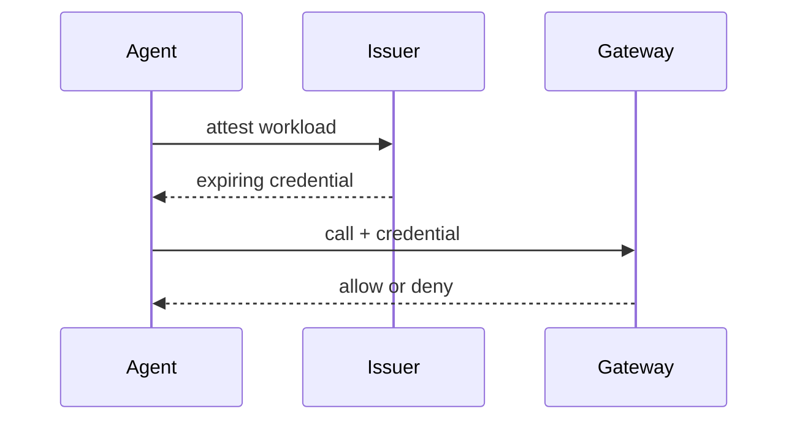
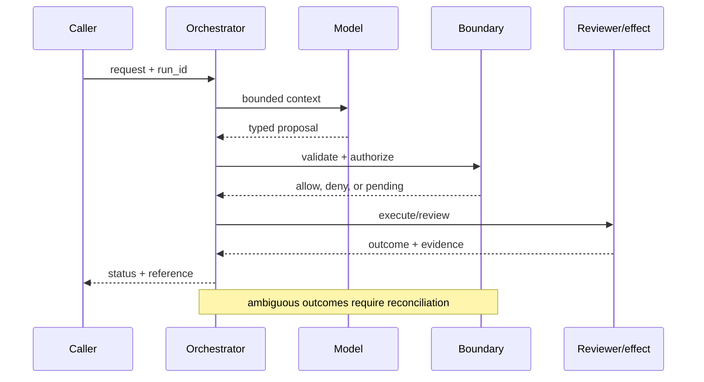

# Agent identity
Status: emerging
Sources: [SPIFFE — workload identity](https://spiffe.io/docs/latest/spiffe-about/overview/); [NIST SP 800-207 — 2020-08](https://www.nist.gov/publications/zero-trust-architecture); [OpenAI Frontier, published February 5, 2026](https://openai.com/index/introducing-openai-frontier/)
## In one sentence
Agent identity is a short-lived, scoped workload credential used by policy—not a secret embedded in a prompt.
## Background: what existed before
Services commonly shared static API keys, making attribution and rotation difficult.
## What changed and why now
Workload identity and zero trust shift authorization to verified workload and resource attributes; agents add dynamic execution paths.
## Impact on current processing and architecture
Identity is minted at runtime, exchanged at a gateway, and bound to tenant, purpose, and expiry.
## Real-world applications and constraints
Use for ticket or database agents. Federation, clock skew, revocation, and legacy systems complicate rollout.
## Mental model
```mermaid
flowchart LR
 A[Agent]-->I[Identity issuer]-->T[Short token]-->P[Policy]-->R[Resource]
 classDef x fill:#dbeafe,stroke:#2563eb,color:#111827; classDef y fill:#dcfce7,stroke:#16a34a,color:#111827; class A,R x; class I,T,P y
```

## What changed this month
Agent identity is framed as a workload-security primitive aligned with Frontier's permissions focus.
## Engineering consequence
Authorize each tool call independently and record subject, audience, scope, and expiry.
## Limits and failure modes
Compromised runtime can still misuse valid scope; overly broad scopes recreate key risk; identity does not validate model intent.

## SDE2 primer and prerequisites

This lesson treats **agent identity** as a production identity problem. The model can request an operation, but an issuer establishes claims, a policy service maps claims to scope, and the protected resource enforces the decision. Students should know HTTP, JSON, authentication, and basic databases. For SDE2 work, add delegated credentials, key rotation, revocation, audit events, and latency budgets. Distinguish source facts from identity guarantees that require local testing.

The useful boundary for agent identity is **workload principal, audience, delegation token, attestation, scope, and expiry**. These are not magic model capabilities. They are interfaces, records, checks, and operating procedures that can be unit-tested. Start with a low-blast-radius workflow and make every external effect attributable to a run ID, actor, policy version, and evidence reference.

## February source reading: fact before inference

For agent identity, read the February source through its own claim boundary. The cited February event is **OpenAI Frontier, published February 5, 2026**. Frontier explicitly says each AI coworker has its own identity, permissions, and guardrails. That is a release-specific product statement. SPIFFE and zero-trust guidance supply the independent security vocabulary for workload identity; choosing short-lived tokens, audiences, and per-call authorization is an engineering inference. The report or announcement is evidence about what its publisher described. It is not independent validation of the publisher's claims, and it does not specify your data, threat model, latency budget, or regulatory obligations. That distinction matters because a source can motivate a concept without proving that the concept is solved.

For agent identity, the engineering inference is narrower: turn the cited capability into an operational contract with topic-specific inputs, states, evidence, and failure ownership. Test that contract against ordinary, adversarial, stale, and interrupted work. A source can motivate this design; it cannot guarantee the resulting reliability or safety.

## Historical baseline and problem boundary

The useful identity baseline is a request carrying a user ID and a bearer token. That can support a simple read, but it becomes insufficient when agents delegate, cross tenants, or act after a delay. The identity system must bind issuer, subject, audience, scope, resource, and revocation state to the action.

The identity boundary separates user intent, verified workload claims, policy decisions, and protected-resource effects. Treat read evidence, model proposals, and committed effects as different data classes. A request can influence a proposal but cannot grant authority. Test this boundary with stale, malformed, replayed, and partially completed cases.

## Architecture and data flow

The identity path starts with authenticated admission, verifies a short-lived credential, checks current policy at the protected resource, and records an allow, deny, or unavailable outcome. Keep policy and configuration revisions beside the work, while generated text remains separate from authorization. Measure issuer latency, revocation freshness, and legitimate completion—not a generic agent score.

```mermaid
flowchart LR
  A[Caller] --> I[Identity and tenant]
  I --> C[Context/evidence]
  C --> M[Model proposal]
  M --> B[Workload Principal boundary]
  B --> X[Effect or review]
  X --> L[(Evidence log)]
  classDef data fill:#dbeafe,stroke:#2563eb,color:#172554; classDef control fill:#dcfce7,stroke:#15803d,color:#14532d; classDef risk fill:#fee2e2,stroke:#dc2626,color:#450a0a
  class A,C,X,L data; class I,B control; class M risk
```

Keep user assertions, verified identity claims, directory attributes, delegated scope, and policy decisions in separate fields. Text may request an identity but cannot establish one. Bind issuer, audience, subject, tenant, resource, and expiry to the decision key; retain claim references and decision reasons without copying secrets into logs.

For agent identity, record a run identifier, actor, purpose, workload principal, audience, delegation token, attestation, scope, and expiry, policy and model versions, evidence references, decision, attempts, timestamps, and final state. Add the topic's durable artifact—such as a checkpoint, capability, proof status, privacy budget, or provenance chain—rather than assuming a generic transcript can explain the outcome. Keep raw content behind controlled references and retention rules.

## Processing walkthrough and state

Identity state includes issued, verified, delegated, expired, revoked, and unavailable—not merely authenticated or rejected. Recheck claims at the protected resource, especially after delegation or queue delay. A temporary issuer outage should produce an explicit unavailable state rather than silently extending an old allow.



On retry, reuse the agent identity idempotency key or durable artifact; never ask the model to invent a second action when the first attempt has an unknown outcome.

## Topic mechanics: Agent identity

### Decision model and topic-specific data contract

Treat the agent as a workload principal with a lifecycle. At startup, an attestor proves which workload is running; an issuer returns a short-lived credential whose subject, audience, tenant, and scopes are explicit. The gateway checks signature, expiry, audience, and policy on every call. Delegation is narrower than impersonation: a human may authorize a ticket-read task for an agent, but the resulting token should not inherit every human permission. Bind a token to a run purpose and tool class where possible. For a ticket agent, `incident.read` and `comment.draft` can be separate capabilities; `incident.close` requires another policy and perhaps approval. Record the credential ID, not a secret, in the audit event. Revocation is difficult for already-issued bearer tokens, so keep lifetimes short and put high-risk operations behind an online decision. Clock skew, legacy APIs, and cross-cloud federation require explicit error handling. Test confused-deputy cases in which an agent is asked to use its ticket authority to fetch a payroll record, and test a stolen token after expiry. Identity answers who is calling; it does not prove that the model's intent is benign or that the requested record is correct.

Identity establishes who presents a request and what claims are attached to that request; it does not establish that the requested operation is correct or safe. A timeout, missing dependency, or ambiguous delegation therefore becomes an explicit unavailable or review state, not an implicit allow. Persist issuer, subject, audience, scope, and policy versions with the decision.

Identity systems need versioned issuer keys, subject mappings, role definitions, audience claims, and revocation policy. Record the identity snapshot used for each decision; changing a role definition should affect future checks without rewriting the principal and evidence attached to an earlier action.

Identity checks need bounded lookup and token budgets. Limit group expansion, directory fan-out, nested delegation, and cache age before a request reaches a protected resource. Report `identity_unavailable`, `claim_expired`, and `scope_too_broad` separately; collapsing them into a generic denial hides an outage from a real authorization failure.

Break identity metrics down by task, tenant, audience, issuer version, dependency, and outcome so a healthy average cannot hide a cross-tenant or revocation failure.


## Agent identity: focused design workshop

Keep request prose, verified claims, generated proposals, and policy decisions in separate typed fields. Identity code owns claim validation and credential lifecycle; prose can explain intent but cannot mint or widen authority.

The event trail should distinguish malformed credentials, expired claims, unavailable issuer, denied scope, and successful resource access. Record credential and policy references, never bearer secrets.

Test identity-specific races. A token may be valid when queued but expired when a tool call begins, or a user may lose group membership while a delegated request is in flight. Recheck audience, issuer, subject, and scope at the protected boundary. Preserve `identity_unavailable` and `needs_reauthentication` as explicit outcomes; never treat a cache miss as proof of authorization.

Slice grants and denials by task, tenant, resource class, policy revision, dependency, and final state. Pair authorization success with legitimate completion and revocation freshness; a high denial rate or low incident rate alone is not evidence of good security.

Save failures as redacted regression fixtures with the issuer, audience, policy version, expected scope, and protected-resource outcome.


## Applications and operational constraints

Start with a read-only resource and a small tenant cohort. Compare grants with an existing identity baseline, then expand to reversible writes only after expiry, revocation, and cross-tenant tests pass.

Identity is useful for support agents, deployment workers, data pipelines, and scheduled workflows. Each needs a named owner, resource scope, data-residency decision, key-rotation plan, latency budget, and rollback or kill switch. Do not reuse a human token simply because an agent is acting on that human’s request.

Plan identity capacity around directory lookups, group expansion, key verification, revocation checks, and audit writes. A slow identity provider must not cause callers to receive an allow decision by timeout. Offer a clearly labeled reauthentication or unavailable state instead of treating degraded identity as normal access.

## Failure modes, security, and limits

Identity failures include confused deputy behavior, stale group membership, issuer compromise, and audience confusion. Bind decisions to authenticated subjects and intended resources, verify tokens at the protected boundary, and make delegation explicit. Audit both successful grants and denials; a valid signature alone does not establish that this service should honor the claim.

Identity metrics can improve by denying difficult users, shortening sessions, or measuring token validity without resource authorization. Set floors for legitimate completion and revocation freshness alongside denial rates. Sample successful grants by tenant and resource; a low incident count can mean weak detection rather than safe identity decisions.

The source claim is bounded: Frontier says each AI coworker has its own identity, permissions, and guardrails. SPIFFE and zero-trust guidance provide independent workload-identity vocabulary. Short-lived credentials, audience checks, and per-call authorization are engineering inferences that require local security testing; neither source proves resistance to a particular attacker or deployment failure.

## Evaluation and change management

Build identity fixtures for valid and expired tokens, wrong audiences, nested delegation, revoked groups, cross-tenant identifiers, and unavailable issuers. Record expected principal and scope outcomes. Replay them against pinned key and policy versions; keep adversarial cases hidden so integrations cannot optimize around known claims.

Promote identity changes only when token validation, revocation freshness, tenant isolation, and legitimate-task completion meet defined floors. Shadow new claims or mappings, retain a rapid key or grant rollback, and audit affected resources after change. Preserve the old decision context for investigation.

## February primary-source evidence

The source fact is bounded: **Frontier explicitly says each AI coworker has its own identity, permissions, and guardrails. That is a release-specific product statement. SPIFFE and zero-trust guidance supply the independent security vocabulary for workload identity; choosing short-lived tokens, audiences, and per-call authorization is an engineering inference.** The February publication date and the publisher's wording should be cited when teaching the event. The recommendation that teams implement workload principal, audience, delegation token, attestation, scope, and expiry is an inference from the event plus established systems practice. It should be validated with local fixtures, security review, operational metrics, and domain experts. The source does not independently verify the examples, and this article does not present them as guarantees.

## Mini exercise extension

Create six fixtures: valid token, expired token, wrong audience, revoked group, cross-tenant resource, and unavailable issuer. Assert a distinct result for each and preserve the governing key and policy versions.

## Build it locally: numbered implementation

1. Define a credential record with issuer, subject, audience, tenant, scopes, expiry, key version, and run ID.
2. Implement signature, expiry, audience, scope, and resource-owner checks as separate functions.
3. Simulate a delegated read and ensure delegated scope is narrower than the human’s full role.
4. Inject clock skew, issuer outage, revoked membership, and a cross-tenant identifier; return typed denials or unavailable states.
5. Log credential and decision IDs while redacting token values and personal data.
6. Add an idempotency key and reconcile a timeout before retrying any write.
7. Run the fixtures against a new policy revision and preserve the old decision context for audit.

## Runnable low-cost example

```python
import time
def authorize(token, audience, action):
    now = int(time.time())
    return token["aud"] == audience and token["exp"] > now and action in token["scope"]
token = {"sub":"agent-7", "aud":"tickets", "scope":{"read"}, "exp":int(time.time())+60}
print(authorize(token, "tickets", "read"), authorize(token, "payroll", "read"))
```

This identity example shows claim parsing and scope comparison only. It does not verify real keys, issuer trust, revocation, or directory state; use the local steps and adversarial fixtures before relying on it for access control.

## Interview Q&A

**Q: Is a valid token sufficient for access?** A: No. The resource still checks audience, scope, tenant, current policy, and resource ownership.

**Q: Why separate identity from model context?** A: Context describes a task; verified identity claims determine which principal and scopes the policy engine may consider.

**Q: Which metric would you put on the dashboard first?** A: Track unauthorized-allow tests and revocation freshness alongside legitimate completion and issuer latency.

**Q: What should happen when the issuer is unavailable?** A: Deny or defer privileged actions; use cached claims only within an explicit short expiry and scope.

**Q: How should agent identity be released?** A: Shadow new mappings, test expiry and revocation, canary read-only access, and retain key-rotation and rollback procedures.

## Glossary

- **Workload principal**: a machine identity representing a running service or agent.
- **Audience**: the service or resource for which a credential is valid.
- **Delegation**: granting a narrower authority to a workload on behalf of another principal.
- **Attestation**: evidence used by an issuer to identify the running workload.
- **Idempotency**: behavior in which retrying one command does not duplicate its effect.
- **Revocation**: invalidation of a previously issued identity or permission.
- **Abstention**: a decision to deny or defer when identity evidence or issuer health is insufficient.

## References

- [OpenAI Frontier — February 5, 2026](https://openai.com/index/introducing-openai-frontier/)
- [SPIFFE workload identity](https://spiffe.io/docs/latest/spiffe-about/overview/)
- [NIST SP 800-207 Zero Trust Architecture](https://www.nist.gov/publications/zero-trust-architecture)

## Claim ledger

| Claim | Source | Fact or inference |
|---|---|---|
| The cited publisher published the February event on the stated date. | [OpenAI Frontier, published February 5, 2026](https://openai.com/index/introducing-openai-frontier/) | Fact |
| Frontier explicitly says each AI coworker has its own identity, permissions, and guardrails. | [OpenAI Frontier, published February 5, 2026](https://openai.com/index/introducing-openai-frontier/) | Fact |
| Making an agent a separately attributable machine principal rather than an api key hidden behind a human. | Engineering design synthesis | Inference |
| A separately enforced boundary is safer and easier to operate than treating model text as authority. | Topic standards and systems reasoning | Inference |
| The local example demonstrates the concept but does not prove production security, reliability, or generalization. | This lesson | Fact about the example |
