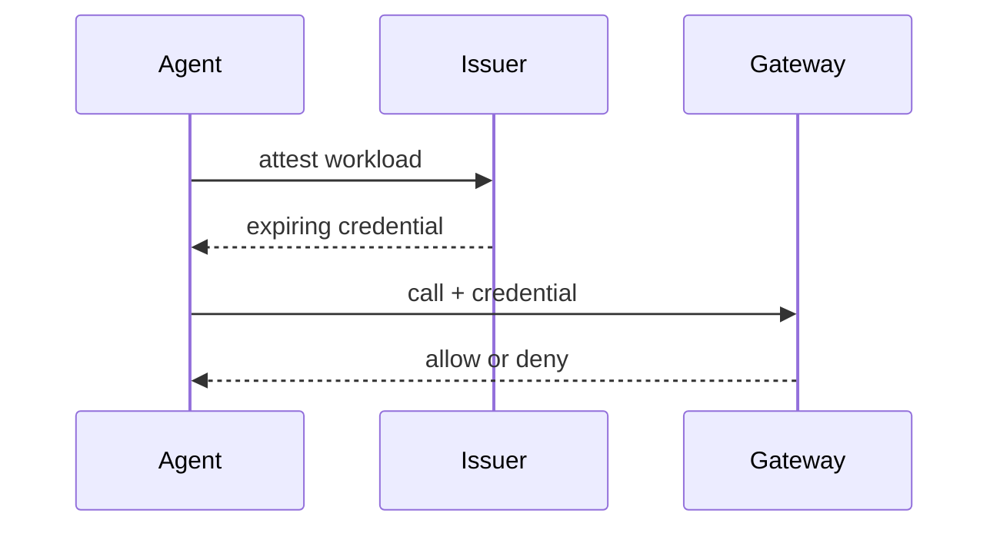
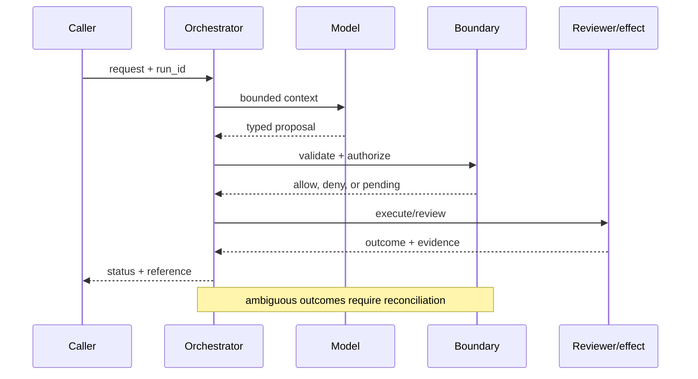

# Agent identity
Status: emerging
Sources: [SPIFFE — workload identity](https://spiffe.io/docs/latest/spiffe-about/overview/); [NIST SP 800-207 — 2020-08](https://www.nist.gov/publications/zero-trust-architecture); [OpenAI Frontier, published February 5, 2026](https://openai.com/index/introducing-openai-frontier/)
## In one sentence
Agent identity is a short-lived, scoped workload credential used by policy—not a secret embedded in a prompt.
## Background: what existed before
Services commonly shared static API keys, making attribution and rotation difficult.
## What changed and why now
Workload identity and zero trust shift authorization to verified workload and resource attributes; agents add dynamic execution paths.
## Impact on current processing and architecture
Identity is minted at runtime, exchanged at a gateway, and bound to tenant, purpose, and expiry.
## Real-world applications and constraints
Use for ticket or database agents. Federation, clock skew, revocation, and legacy systems complicate rollout.
## Mental model
```mermaid
flowchart LR
 A[Agent]-->I[Identity issuer]-->T[Short token]-->P[Policy]-->R[Resource]
 classDef x fill:#dbeafe,stroke:#2563eb,color:#111827; classDef y fill:#dcfce7,stroke:#16a34a,color:#111827; class A,R x; class I,T,P y
```

## What changed this month
Agent identity is framed as a workload-security primitive aligned with Frontier's permissions focus.
## Engineering consequence
Authorize each tool call independently and record subject, audience, scope, and expiry.
## Limits and failure modes
Compromised runtime can still misuse valid scope; overly broad scopes recreate key risk; identity does not validate model intent.

## SDE2 primer and prerequisites

This lesson treats **agent identity** as a production identity problem. The model can request an operation, but an issuer establishes claims, a policy service maps claims to scope, and the protected resource enforces the decision. Students should know HTTP, JSON, authentication, and basic databases. For SDE2 work, add delegated credentials, key rotation, revocation, audit events, and latency budgets. Distinguish source facts from identity guarantees that require local testing.

The useful boundary for agent identity is **workload principal, audience, delegation token, attestation, scope, and expiry**. These are not magic model capabilities. They are interfaces, records, checks, and operating procedures that can be unit-tested. Start with a low-blast-radius workflow and make every external effect attributable to a run ID, actor, policy version, and evidence reference.

## February source reading: fact before inference

For agent identity, read the February source through its own claim boundary. The cited February event is **OpenAI Frontier, published February 5, 2026**. Frontier explicitly says each AI coworker has its own identity, permissions, and guardrails. That is a release-specific product statement. SPIFFE and zero-trust guidance supply the independent security vocabulary for workload identity; choosing short-lived tokens, audiences, and per-call authorization is an engineering inference. The report or announcement is evidence about what its publisher described. It is not independent validation of the publisher's claims, and it does not specify your data, threat model, latency budget, or regulatory obligations. That distinction matters because a source can motivate a concept without proving that the concept is solved.

For agent identity, the engineering inference is narrower: turn the cited capability into an operational contract with topic-specific inputs, states, evidence, and failure ownership. Test that contract against ordinary, adversarial, stale, and interrupted work. A source can motivate this design; it cannot guarantee the resulting reliability or safety.

## Historical baseline and problem boundary

The useful identity baseline is a request carrying a user ID and a bearer token. That can support a simple read, but it becomes insufficient when agents delegate, cross tenants, or act after a delay. The identity system must bind issuer, subject, audience, scope, resource, and revocation state to the action.

For **agent identity**, the agent identity boundary names agent identity evidence, the actor, the mutable state, and the rejecting component. Treat read evidence, model proposals, and committed effects as different data classes. A request can influence a proposal but cannot grant authority. Test this boundary with stale, malformed, replayed, and partially completed cases.

## Architecture and data flow

The agent identity path starts with its own agent identity evidence admission check, then records topic state, invokes only the needed processor, and finishes at a agent identity outcome gate for **agent identity**. Keep policy and configuration revisions beside the work, while generated text remains separate from authorization. Measure the bottleneck that belongs to agent identity, not a generic agent score.

```mermaid
flowchart LR
  A[Caller] --> I[Identity and tenant]
  I --> C[Context/evidence]
  C --> M[Model proposal]
  M --> B[Workload Principal boundary]
  B --> X[Effect or review]
  X --> L[(Evidence log)]
  classDef data fill:#dbeafe,stroke:#2563eb,color:#172554; classDef control fill:#dcfce7,stroke:#15803d,color:#14532d; classDef risk fill:#fee2e2,stroke:#dc2626,color:#450a0a
  class A,C,X,L data; class I,B control; class M risk
```

Keep user assertions, verified identity claims, directory attributes, delegated scope, and policy decisions in separate fields. Text may request an identity but cannot establish one. Bind issuer, audience, subject, tenant, resource, and expiry to the decision key; retain claim references and decision reasons without copying secrets into logs.

For agent identity, record a run identifier, actor, purpose, workload principal, audience, delegation token, attestation, scope, and expiry, policy and model versions, evidence references, decision, attempts, timestamps, and final state. Add the topic's durable artifact—such as a checkpoint, capability, proof status, privacy budget, or provenance chain—rather than assuming a generic transcript can explain the outcome. Keep raw content behind controlled references and retention rules.

## Processing walkthrough and state

Identity state includes issued, verified, delegated, expired, revoked, and unavailable—not merely authenticated or rejected. Recheck claims at the protected resource, especially after delegation or queue delay. A temporary issuer outage should produce an explicit unavailable state rather than silently extending an old allow.



On retry, reuse the agent identity idempotency key or durable artifact; never ask the model to invent a second action when the first attempt has an unknown outcome.

## Topic mechanics: Agent identity

### Decision model and topic-specific data contract

Treat the agent as a workload principal with a lifecycle. At startup, an attestor proves which workload is running; an issuer returns a short-lived credential whose subject, audience, tenant, and scopes are explicit. The gateway checks signature, expiry, audience, and policy on every call. Delegation is narrower than impersonation: a human may authorize a ticket-read task for an agent, but the resulting token should not inherit every human permission. Bind a token to a run purpose and tool class where possible. For a ticket agent, `incident.read` and `comment.draft` can be separate capabilities; `incident.close` requires another policy and perhaps approval. Record the credential ID, not a secret, in the audit event. Revocation is difficult for already-issued bearer tokens, so keep lifetimes short and put high-risk operations behind an online decision. Clock skew, legacy APIs, and cross-cloud federation require explicit error handling. Test confused-deputy cases in which an agent is asked to use its ticket authority to fetch a payroll record, and test a stolen token after expiry. Identity answers who is calling; it does not prove that the model's intent is benign or that the requested record is correct.

Ask what **agent identity** can establish at each transition. The request establishes intent only; the agent identity evidence and state stage establishes a bounded representation; the next checker, owner, or reconciliation step establishes whether the proposed result is acceptable. A timeout, missing dependency, or ambiguous response therefore becomes an explicit status for **agent identity**, not an implicit success. Persist the relevant versions and evidence references, and retain unknown, deferred, or needs-review states when the system cannot prove the stronger claim.

Identity systems need versioned issuer keys, subject mappings, role definitions, audience claims, and revocation policy. Record the identity snapshot used for each decision; changing a role definition should affect future checks without rewriting the principal and evidence attached to an earlier action.

Identity checks need bounded lookup and token budgets. Limit group expansion, directory fan-out, nested delegation, and cache age before a request reaches a protected resource. Report `identity_unavailable`, `claim_expired`, and `scope_too_broad` separately; collapsing them into a generic denial hides an outage from a real authorization failure.

Break agent identity metrics down by task slice, actor or tenant, version, dependency, and outcome class so a healthy average cannot hide a dangerous subgroup.


## Agent identity: focused design workshop

In agent identity, keep request prose, retrieved evidence, generated proposals, and the lesson artifact in separate typed fields. agent identity code owns completeness, freshness, authorization, and promotion of a result; prose only explains intent.

For agent identity, the event trail must let an operator distinguish bad input, missing topic evidence, stale state, dependency failure, and a confirmed outcome. Record the agent identity artifact and the decision that moved it between states.

Test identity-specific races. A token may be valid when queued but expired when a tool call begins, or a user may lose group membership while a delegated request is in flight. Recheck audience, issuer, subject, and scope at the protected boundary. Preserve `identity_unavailable` and `needs_reauthentication` as explicit outcomes; never treat a cache miss as proof of authorization.

For agent identity, slice agent identity evidence metrics by task class, actor or tenant, governing revision, dependency, and final state. Report the topic invariant, useful completion, latency, cost, and recovery burden together; averages are insufficient when a rare agent identity failure carries the largest consequence.

Save a failing agent identity input as a regression fixture only after redaction, classification, and capture of the governing version.


## Applications and operational constraints

Start agent identity in observation or draft mode, compare against a deterministic or human baseline, then expand only a narrow cohort and reversible effect class.

Beyond **agent identity**, agent identity applies to workflows where agent identity evidence matters. Choose an application with a named owner and bounded effects, then document its data residency, access, quota, staffing, latency, and rollback constraints. The right metric differs by deployment; do not import a support or research target without checking the actual user outcome.

Plan identity capacity around directory lookups, group expansion, key verification, revocation checks, and audit writes. A slow identity provider must not cause callers to receive an allow decision by timeout. Offer a clearly labeled reauthentication or unavailable state instead of treating degraded identity as normal access.

## Failure modes, security, and limits

Identity failures include confused deputy behavior, stale group membership, issuer compromise, and audience confusion. Bind decisions to authenticated subjects and intended resources, verify tokens at the protected boundary, and make delegation explicit. Audit both successful grants and denials; a valid signature alone does not establish that this service should honor the claim.

Identity metrics can improve by denying difficult users, shortening sessions, or measuring token validity without resource authorization. Set floors for legitimate completion and revocation freshness alongside denial rates. Sample successful grants by tenant and resource; a low incident count can mean weak detection rather than safe identity decisions.

For agent identity, the February source has a bounded claim. The February source also has scope limits. Frontier explicitly says each AI coworker has its own identity, permissions, and guardrails. That is a release-specific product statement. SPIFFE and zero-trust guidance supply the independent security vocabulary for workload identity; choosing short-lived tokens, audiences, and per-call authorization is an engineering inference. Nothing in that observation proves robustness against your adversaries, correctness on your domain, or a particular service-level target. Treat vendor examples as source facts and label recommendations as inference. When evidence is weak, abstention and escalation are valid outcomes.

## Evaluation and change management

Build identity fixtures for valid and expired tokens, wrong audiences, nested delegation, revoked groups, cross-tenant identifiers, and unavailable issuers. Record expected principal and scope outcomes. Replay them against pinned key and policy versions; keep adversarial cases hidden so integrations cannot optimize around known claims.

Promote identity changes only when token validation, revocation freshness, tenant isolation, and legitimate-task completion meet defined floors. Shadow new claims or mappings, retain a rapid key or grant rollback, and audit affected resources after change. Preserve the old decision context for investigation.

## February primary-source evidence

The source fact is bounded: **Frontier explicitly says each AI coworker has its own identity, permissions, and guardrails. That is a release-specific product statement. SPIFFE and zero-trust guidance supply the independent security vocabulary for workload identity; choosing short-lived tokens, audiences, and per-call authorization is an engineering inference.** The February publication date and the publisher's wording should be cited when teaching the event. The recommendation that teams implement workload principal, audience, delegation token, attestation, scope, and expiry is an inference from the event plus established systems practice. It should be validated with local fixtures, security review, operational metrics, and domain experts. The source does not independently verify the examples, and this article does not present them as guarantees.

## Mini exercise extension

Create six fixtures for **agent identity** using the agent identity vocabulary: a agent identity evidence omission, a stale or contradictory agent identity evidence record, an adversarial input, a boundary rejection, a dependency interruption, and a verified completion. Assert different states for each case; do not use one generic success label. Store the evidence reference and recovery owner beside every assertion, then alter the governing version and prove that prior agent identity records remain historical.

## Build it locally: numbered implementation

1. Construct a agent identity test record with actor, request, agent identity evidence, decision, and outcome fields; reject a run that cannot identify the governing version.
2. Implement the agent identity boundary as a pure function. It must inspect agent identity evidence, return a typed state, and refuse an unrecognized or incomplete transition.
3. Create a deterministic agent identity generator with a valid proposal, a malformed proposal, and an input that attempts to redirect the topic-specific decision.
4. Simulate the agent identity dependency failing after admission. Use its own correlation or artifact key to detect duplicate delivery and reconcile uncertainty.
5. Write an event stream containing agent identity states, redacting sensitive payloads while retaining the evidence pointers needed for an offline replay.
6. Measure agent identity correctness alongside rejection rate, time in each state, recovery work, and resource cost; report slices relevant to the lesson.
7. Change the agent identity schema or policy revision and verify that old events still resolve under their original contract rather than being reinterpreted.

## Runnable low-cost example

```python
import time
def authorize(token, audience, action):
    now = int(time.time())
    return token["aud"] == audience and token["exp"] > now and action in token["scope"]
token = {"sub":"agent-7", "aud":"tickets", "scope":{"read"}, "exp":int(time.time())+60}
print(authorize(token, "tickets", "read"), authorize(token, "payroll", "read"))
```

This identity example shows claim parsing and scope comparison only. It does not verify real keys, issuer trust, revocation, or directory state; use the local steps and adversarial fixtures before relying on it for access control.

## Interview Q&A

**Q: Is a valid token sufficient for access?** A: Enforce the agent identity rule in deterministic code at the resource or artifact boundary; model output may propose, but it cannot authorize or prove the result.

**Q: Why separate identity from model context?** A: Enforce the agent identity rule in deterministic code at the resource or artifact boundary; model output may propose, but it cannot authorize or prove the result.

**Q: Which metric would you put on the dashboard first?** A: Track agent identity evidence, plus false acceptance or rejection, time spent, resource cost, and recovery; slice results by the agent identity risk classes.

**Q: What should happen when the issuer is unavailable?** A: Enforce the agent identity rule in deterministic code at the resource or artifact boundary; model output may propose, but it cannot authorize or prove the result.

**Q: How should agent identity be released?** A: Pin agent identity evidence and the governing versions, begin with shadow or reversible work, and require the agent identity invariant before widening effects.

## Glossary

- **Workload Principal**: the topic-specific control boundary that mediates a model proposal and an outcome.
- **Run ID**: the correlation key that joins one agent identity attempt to its actor, agent identity evidence, decisions, and recovery evidence.
- **Idempotency**: the agent identity guarantee that a retry does not create a second logical result or duplicate effect.
- **Provenance**: origin, version, and transformation evidence attached to a agent identity input or artifact.
- **SLO**: an explicit agent identity service target, such as freshness, verification latency, queue age, or availability.
- **Abstention**: the agent identity state used when evidence, authority, or dependency health is insufficient for a stronger claim.
- **Inference**: an engineering recommendation about agent identity derived from source facts rather than presented as a source guarantee.

## References

- [OpenAI Frontier — February 5, 2026](https://openai.com/index/introducing-openai-frontier/)
- [SPIFFE workload identity](https://spiffe.io/docs/latest/spiffe-about/overview/)
- [NIST SP 800-207 Zero Trust Architecture](https://www.nist.gov/publications/zero-trust-architecture)

## Claim ledger

| Claim | Source | Fact or inference |
|---|---|---|
| The cited publisher published the February event on the stated date. | [OpenAI Frontier, published February 5, 2026](https://openai.com/index/introducing-openai-frontier/) | Fact |
| Frontier explicitly says each AI coworker has its own identity, permissions, and guardrails. | [OpenAI Frontier, published February 5, 2026](https://openai.com/index/introducing-openai-frontier/) | Fact |
| Making an agent a separately attributable machine principal rather than an api key hidden behind a human. | Engineering design synthesis | Inference |
| A separately enforced boundary is safer and easier to operate than treating model text as authority. | Topic standards and systems reasoning | Inference |
| The local example demonstrates the concept but does not prove production security, reliability, or generalization. | This lesson | Fact about the example |
