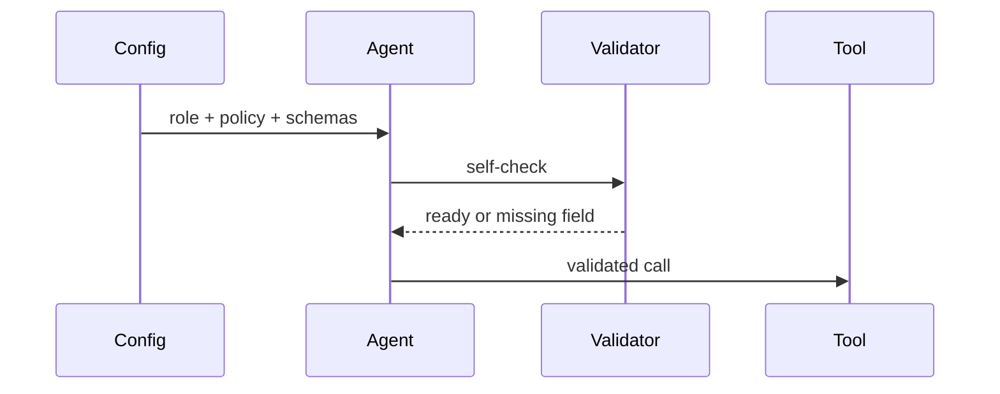
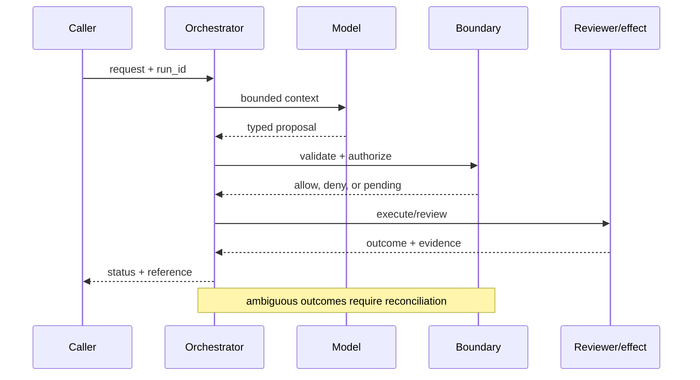

# Onboarding agents
Status: emerging
Sources: [OpenAI — 2026-02-05](https://openai.com/index/introducing-openai-frontier/); [Anthropic — tool use](https://docs.anthropic.com/en/docs/agents-and-tools/tool-use/overview)
## In one sentence
Onboarding an agent means explicitly supplying role, tools, constraints, examples, and an observable success contract.
## Background: what existed before
Prompt authors often assumed the model would infer process rules from prose or a few demonstrations.
## What changed and why now
Tool schemas and platform onboarding make capabilities and constraints deployable artifacts, not tribal knowledge.
## Impact on current processing and architecture
Initialization becomes a tested configuration phase before the task loop.
## Real-world applications and constraints
Useful when teams hand off agents across environments. Context size, stale examples, and conflicting instructions are risks.
## Mental model
```mermaid
flowchart LR
 R[Role]-->K[Constraints]-->T[Typed tools]-->E[Examples]-->L[Loop]
 classDef c fill:#dbeafe,stroke:#2563eb,color:#111827; classDef g fill:#dcfce7,stroke:#16a34a,color:#111827; class R,E c; class K,T,L g
```

## What changed this month
The February framing treats onboarding as lifecycle engineering around the model.
## Engineering consequence
Version onboarding bundles and test them with adversarial and ordinary tasks.
## Limits and failure modes
Examples can overfit; instructions can conflict; schemas constrain syntax but not truthfulness.

## SDE2 primer and prerequisites

This lesson treats **onboarding agents** as a controlled activation problem. An applicant declares a capability, reviewers inspect risk, a sandbox exercises tools, and an owner accepts responsibility for the live scope. Students should know HTTP, JSON, authentication, and basic databases. For SDE2 work, add queues, structured logs, metrics, rollback, and service-level objectives (SLOs). Separate the source’s product claims from readiness evidence that a local team must collect.

The useful boundary for onboarding agents is **role contract, tool manifest, readiness probe, examples, escalation rule, and configuration version**. These are not magic model capabilities. They are interfaces, records, checks, and operating procedures that can be unit-tested. Start with a low-blast-radius workflow and make every external effect attributable to a run ID, actor, policy version, and evidence reference.

## February source reading: fact before inference

For onboarding agents, read the February source through its own claim boundary. The cited February event is **OpenAI Frontier, published February 5, 2026**. Frontier's authors compare agent deployment with employee onboarding: understanding how work is done, having tools, learning what good looks like, and receiving identity and boundaries. The post also says the platform can use existing data and applications through open standards. It does not prove that any particular prompt or schema will work for a new organization. The report or announcement is evidence about what its publisher described. It is not independent validation of the publisher's claims, and it does not specify your data, threat model, latency budget, or regulatory obligations. That distinction matters because a source can motivate a concept without proving that the concept is solved.

For onboarding agents, the engineering inference is narrower: turn the cited capability into an operational contract with topic-specific inputs, states, evidence, and failure ownership. Test that contract against ordinary, adversarial, stale, and interrupted work. A source can motivate this design; it cannot guarantee the resulting reliability or safety.

## Historical baseline and problem boundary

The useful onboarding baseline is a prompt and a team-owned API key deployed for a pilot. That is fast for exploration, but it hides who owns the agent, which data it can see, and how it will be disabled. Onboarding turns that informal experiment into a reviewed capability with explicit scope and accountability.

For **onboarding agents**, the onboarding agents boundary names onboarding agents evidence, the actor, the mutable state, and the rejecting component. Treat read evidence, model proposals, and committed effects as different data classes. A request can influence a proposal but cannot grant authority. Test this boundary with stale, malformed, replayed, and partially completed cases.

## Architecture and data flow

The onboarding agents path starts with its own onboarding agents evidence admission check, then records topic state, invokes only the needed processor, and finishes at a onboarding agents outcome gate for **onboarding agents**. Keep policy and configuration revisions beside the work, while generated text remains separate from authorization. Measure the bottleneck that belongs to onboarding agents, not a generic agent score.

```mermaid
flowchart LR
  A[Caller] --> I[Identity and tenant]
  I --> C[Context/evidence]
  C --> M[Model proposal]
  M --> B[Role Contract boundary]
  B --> X[Effect or review]
  X --> L[(Evidence log)]
  classDef data fill:#dbeafe,stroke:#2563eb,color:#172554; classDef control fill:#dcfce7,stroke:#15803d,color:#14532d; classDef risk fill:#fee2e2,stroke:#dc2626,color:#450a0a
  class A,C,X,L data; class I,B control; class M risk
```

Keep the application request, agent manifest, review evidence, sandbox result, and activation decision separate. This lets an operator see whether a capability was requested, tested, approved, or actually enabled. Bind owner, tenant, data class, tool set, manifest revision, and expiry to the activation record while minimizing transcript retention.

For onboarding agents, record a run identifier, actor, purpose, role contract, tool manifest, readiness probe, examples, escalation rule, and configuration version, policy and model versions, evidence references, decision, attempts, timestamps, and final state. Add the topic's durable artifact—such as a checkpoint, capability, proof status, privacy budget, or provenance chain—rather than assuming a generic transcript can explain the outcome. Keep raw content behind controlled references and retention rules.

## Processing walkthrough and state

Onboarding state should distinguish submitted, evidence_pending, security_review, sandbox_failed, approved, activated, suspended, and withdrawn. Recheck owner and manifest at activation, and make withdrawal idempotent. A completed form is not proof that tools are safe or that the agent is still owned.



On retry, reuse the onboarding agents idempotency key or durable artifact; never ask the model to invent a second action when the first attempt has an unknown outcome.

## Topic mechanics: Onboarding agents

### Decision model and topic-specific data contract

An onboarding bundle should be compiled like an API client. Start with a role contract that states the task, non-goals, escalation conditions, and evidence standard. Add a tool manifest with JSON schemas, examples, read/write labels, quotas, and error meanings. Separate policy instructions from domain reference material, because reference text may be stale or adversarial. A readiness probe can ask the agent to summarize its allowed actions, refuse a forbidden action, and produce a valid tool call for a fixture. For the support handoff case, include examples of billing ambiguity, angry customers, missing account data, and an outage; the desired behavior is often to ask a question or escalate rather than improvise. Version the bundle and test it in CI against a held-out fixture set. Configuration drift is a production bug: a tool added to development but absent in production should fail readiness, while a production-only tool should not silently appear in the prompt. Track first-run success and invalid-call rate by bundle version. OpenAI's open-standards framing supports portability as a product goal, but portability does not mean every model interprets descriptions identically; adapter tests remain necessary.

Ask what **onboarding agents** can establish at each transition. The request establishes intent only; the onboarding agents evidence and state stage establishes a bounded representation; the next checker, owner, or reconciliation step establishes whether the proposed result is acceptable. A timeout, missing dependency, or ambiguous response therefore becomes an explicit status for **onboarding agents**, not an implicit success. Persist the relevant versions and evidence references, and retain unknown, deferred, or needs-review states when the system cannot prove the stronger claim.

Onboarding needs a versioned agent manifest, tool inventory, training checklist, owner assignment, and approval record. A manifest change should create a new reviewable revision; an audit trail must still show which capabilities were enabled when an earlier run occurred.

Onboarding needs gates on the number of pending reviews, requested tools, data classes, and unresolved training tasks. Do not provision an agent whose owner or rollback plan cannot be verified. Return `review_queue_full`, `owner_missing`, or `capability_not_ready` distinctly so applicants know what must change.

Break onboarding agents metrics down by task slice, actor or tenant, version, dependency, and outcome class so a healthy average cannot hide a dangerous subgroup.


## Onboarding agents: focused design workshop

In onboarding agents, keep request prose, retrieved evidence, generated proposals, and the lesson artifact in separate typed fields. onboarding agents code owns completeness, freshness, authorization, and promotion of a result; prose only explains intent.

For onboarding agents, the event trail must let an operator distinguish bad input, missing topic evidence, stale state, dependency failure, and a confirmed outcome. Record the onboarding agents artifact and the decision that moved it between states.

Test onboarding races. An agent can pass review while its owner leaves, a tool contract changes, or a data classification is tightened before activation. Recheck manifest revision and owner status at provisioning time. Preserve `activation_pending` and `review_expired` as explicit states; never treat a submitted checklist as evidence that a capability is ready.

For onboarding agents, slice onboarding agents evidence metrics by task class, actor or tenant, governing revision, dependency, and final state. Report the topic invariant, useful completion, latency, cost, and recovery burden together; averages are insufficient when a rare onboarding agents failure carries the largest consequence.

Save a failing onboarding agents input as a regression fixture only after redaction, classification, and capture of the governing version.


## Applications and operational constraints

Start onboarding agents in observation or draft mode, compare against a deterministic or human baseline, then expand only a narrow cohort and reversible effect class.

Beyond **onboarding agents**, onboarding agents applies to workflows where onboarding agents evidence matters. Choose an application with a named owner and bounded effects, then document its data residency, access, quota, staffing, latency, and rollback constraints. The right metric differs by deployment; do not import a support or research target without checking the actual user outcome.

Plan onboarding capacity around reviewers, security assessments, sandbox slots, and support ownership rather than model throughput alone. A full review queue should stop new activation, not hide the backlog with automatic approvals. Show applicants whether the agent is pending, rejected, or activated with a bounded capability set.

## Failure modes, security, and limits

Onboarding fails when a checklist is mistaken for readiness. Watch for unowned agents, excessive initial scope, untested tools, missing data classification, and reviewers approving copied risk assessments. Require a capability inventory, sandbox trial, rollback owner, and post-activation check; activation evidence should remain available for later withdrawal.

Onboarding metrics can be gamed by closing applications quickly, narrowing declared scope, or approving agents before their tools are tested. Pair activation time with post-launch incidents, rollback use, owner response, and capability coverage. A high approval rate is not evidence of readiness when reviewers rarely inspect adverse cases.

For onboarding agents, the February source has a bounded claim. The February source also has scope limits. Frontier's authors compare agent deployment with employee onboarding: understanding how work is done, having tools, learning what good looks like, and receiving identity and boundaries. The post also says the platform can use existing data and applications through open standards. It does not prove that any particular prompt or schema will work for a new organization. Nothing in that observation proves robustness against your adversaries, correctness on your domain, or a particular service-level target. Treat vendor examples as source facts and label recommendations as inference. When evidence is weak, abstention and escalation are valid outcomes.

## Evaluation and change management

Build onboarding fixtures for missing owners, excessive tools, sensitive data, failed sandbox tests, reviewer disagreement, expired approvals, and rollback. Define the activation invariant and expected capability scope. Run them through the same provisioning gate used in production, with hidden adverse cases and redacted application traces.

Activate an agent only when owner, data classes, tool tests, escalation, and rollback evidence are complete. Start with a small capability cohort, retain a disable switch that preserves audit reads, and record which tools and users were affected if activation is withdrawn.

## February primary-source evidence

The source fact is bounded: **Frontier's authors compare agent deployment with employee onboarding: understanding how work is done, having tools, learning what good looks like, and receiving identity and boundaries. The post also says the platform can use existing data and applications through open standards. It does not prove that any particular prompt or schema will work for a new organization.** The February publication date and the publisher's wording should be cited when teaching the event. The recommendation that teams implement role contract, tool manifest, readiness probe, examples, escalation rule, and configuration version is an inference from the event plus established systems practice. It should be validated with local fixtures, security review, operational metrics, and domain experts. The source does not independently verify the examples, and this article does not present them as guarantees.

## Mini exercise extension

Create six fixtures for **onboarding agents** using the onboarding agents vocabulary: a onboarding agents evidence omission, a stale or contradictory onboarding agents evidence record, an adversarial input, a boundary rejection, a dependency interruption, and a verified completion. Assert different states for each case; do not use one generic success label. Store the evidence reference and recovery owner beside every assertion, then alter the governing version and prove that prior onboarding agents records remain historical.

## Build it locally: numbered implementation

1. Construct a onboarding agents test record with actor, request, onboarding agents evidence, decision, and outcome fields; reject a run that cannot identify the governing version.
2. Implement the onboarding agents boundary as a pure function. It must inspect onboarding agents evidence, return a typed state, and refuse an unrecognized or incomplete transition.
3. Create a deterministic onboarding agents generator with a valid proposal, a malformed proposal, and an input that attempts to redirect the topic-specific decision.
4. Simulate the onboarding agents dependency failing after admission. Use its own correlation or artifact key to detect duplicate delivery and reconcile uncertainty.
5. Write an event stream containing onboarding agents states, redacting sensitive payloads while retaining the evidence pointers needed for an offline replay.
6. Measure onboarding agents correctness alongside rejection rate, time in each state, recovery work, and resource cost; report slices relevant to the lesson.
7. Change the onboarding agents schema or policy revision and verify that old events still resolve under their original contract rather than being reinterpreted.

## Runnable low-cost example

```python
bundle = {"role":"support triage", "tools":{"search":{"required":["query"]}}, "excludes":{"delete"}, "version":"b4"}
def ready(b):
    return "search" in b["tools"] and "delete" in b["excludes"] and b["version"]
print(ready(bundle))
```

This provisioning sketch checks a manifest invariant in memory. It does not perform security review, sandboxing, owner verification, or rollback; extend it with denied and incomplete applications before treating activation as safe.

## Interview Q&A

**Q: What proves an agent is ready?** A: Enforce the onboarding agents rule in deterministic code at the resource or artifact boundary; model output may propose, but it cannot authorize or prove the result.

**Q: Why separate activation from application?** A: Enforce the onboarding agents rule in deterministic code at the resource or artifact boundary; model output may propose, but it cannot authorize or prove the result.

**Q: Which metric would you put on the dashboard first?** A: Track onboarding agents evidence, plus false acceptance or rejection, time spent, resource cost, and recovery; slice results by the onboarding agents risk classes.

**Q: When should onboarding stop?** A: Enforce the onboarding agents rule in deterministic code at the resource or artifact boundary; model output may propose, but it cannot authorize or prove the result.

**Q: How should onboarding agents be released?** A: Pin onboarding agents evidence and the governing versions, begin with shadow or reversible work, and require the onboarding agents invariant before widening effects.

## Glossary

- **Role Contract**: the topic-specific control boundary that mediates a model proposal and an outcome.
- **Run ID**: the correlation key that joins one onboarding agents attempt to its actor, onboarding agents evidence, decisions, and recovery evidence.
- **Idempotency**: the onboarding agents guarantee that a retry does not create a second logical result or duplicate effect.
- **Provenance**: origin, version, and transformation evidence attached to a onboarding agents input or artifact.
- **SLO**: an explicit onboarding agents service target, such as freshness, verification latency, queue age, or availability.
- **Abstention**: the onboarding agents state used when evidence, authority, or dependency health is insufficient for a stronger claim.
- **Inference**: an engineering recommendation about onboarding agents derived from source facts rather than presented as a source guarantee.

## References

- [OpenAI Frontier — February 5, 2026](https://openai.com/index/introducing-openai-frontier/)
- [Anthropic tool use overview](https://docs.anthropic.com/en/docs/agents-and-tools/tool-use/overview)

## Claim ledger

| Claim | Source | Fact or inference |
|---|---|---|
| The cited publisher published the February event on the stated date. | [OpenAI Frontier, published February 5, 2026](https://openai.com/index/introducing-openai-frontier/) | Fact |
| Frontier's authors compare agent deployment with employee onboarding: understanding how work is done, having tools, learning what good looks like, and receiving identity and boundaries. | [OpenAI Frontier, published February 5, 2026](https://openai.com/index/introducing-openai-frontier/) | Fact |
| Treating setup as a versioned release artifact with tests, owners, and a readiness gate. | Engineering design synthesis | Inference |
| A separately enforced boundary is safer and easier to operate than treating model text as authority. | Topic standards and systems reasoning | Inference |
| The local example demonstrates the concept but does not prove production security, reliability, or generalization. | This lesson | Fact about the example |
