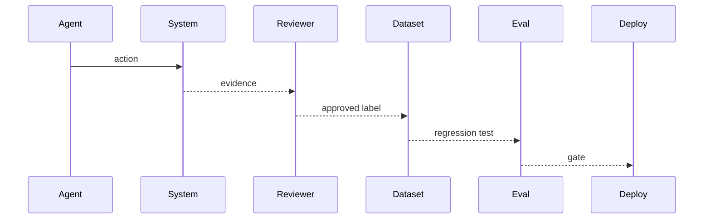
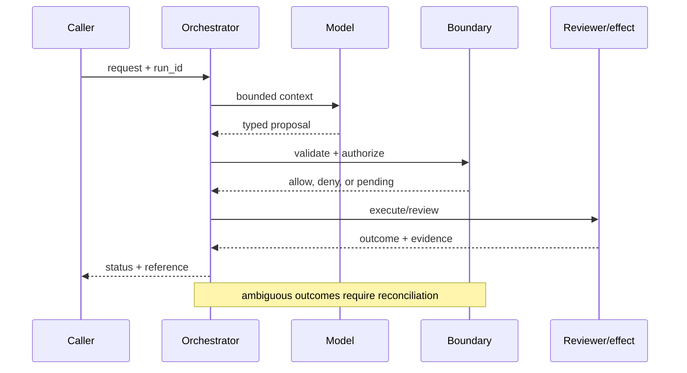

# Feedback learning
Status: emerging
Sources: [OpenAI — 2026-02-05](https://openai.com/index/introducing-openai-frontier/); [NIST AI RMF — 2023-01-26](https://www.nist.gov/itl/ai-risk-management-framework)
## In one sentence
Feedback learning improves a workflow from labeled, approved outcomes rather than treating every interaction log as truth.
## Background: what existed before
Teams collected thumbs-up signals and raw transcripts but rarely connected them to a tested change.
## What changed and why now
Agent operations emphasize feedback loops with ownership and evaluation gates.
## Impact on current processing and architecture
Capture outcome, reviewer, policy version, and task slice; train or tune only after validation.
## Real-world applications and constraints
Support routing can learn from resolved tickets. Reviewer bias, delayed labels, privacy, and reward hacking limit conclusions.
## Mental model
```mermaid
flowchart LR
 O[Outcome]-->H[Human label]-->E[Eval set]-->C[Change]-->M[Monitor]
 classDef a fill:#dbeafe,stroke:#2563eb,color:#111827; classDef b fill:#dcfce7,stroke:#16a34a,color:#111827; class O,H,C a; class E,M b
```

## What changed this month
February distinguishes approved feedback from uncurated logs as an engineering input.
## Engineering consequence
Treat labels as versioned data with retention, sampling, and rollback.
## Limits and failure modes
Labels may encode policy mistakes; optimizing one metric can degrade safety or equity.

## SDE2 primer and prerequisites

This lesson treats **feedback learning** as a governed data loop. Users expose failures, annotators create labels, adjudicators resolve disagreement, and an evaluation gate decides whether a correction can influence a model. Students should know HTTP, JSON, functions, and basic databases. For SDE2 work, add sampling, metrics, privacy, versioned datasets, and service-level objectives (SLOs). Keep source observations separate from improvements that need controlled experiments.

The useful boundary for feedback learning is **outcome label, reviewer agreement, counterfactual, replay set, drift slice, and rollback**. These are not magic model capabilities. They are interfaces, records, checks, and operating procedures that can be unit-tested. Start with a low-blast-radius workflow and make every external effect attributable to a run ID, actor, policy version, and evidence reference.

## February source reading: fact before inference

For feedback learning, read the February source through its own claim boundary. The cited February event is **OpenAI Frontier, published February 5, 2026**. Frontier says built-in evaluation and optimization should show human managers and agents what works, and that feedback helps improve work over time. That is the February product framing. A production team still has to define labels, sampling, privacy, and release gates; the source does not establish that raw interaction logs are training truth. The report or announcement is evidence about what its publisher described. It is not independent validation of the publisher's claims, and it does not specify your data, threat model, latency budget, or regulatory obligations. That distinction matters because a source can motivate a concept without proving that the concept is solved.

For feedback learning, the engineering inference is narrower: turn the cited capability into an operational contract with topic-specific inputs, states, evidence, and failure ownership. Test that contract against ordinary, adversarial, stale, and interrupted work. A source can motivate this design; it cannot guarantee the resulting reliability or safety.

## Historical baseline and problem boundary

The useful feedback baseline is a manual bug report or a small hand-labeled dataset. That supports local fixes, but it loses the distribution of user corrections and makes learning changes hard to attribute. A feedback loop adds provenance, sampling, adjudication, and protected evaluation before labels influence a model.

The feedback boundary separates an observed outcome, a human or rule-based label, a training decision, and a released behavior. Treat raw interaction, reviewer judgment, and model proposals as different data classes. A request can influence a proposal but cannot grant authority. Test this boundary with stale, malformed, replayed, and partially completed cases.

## Architecture and data flow

The feedback path starts with consent and scope admission, records an outcome and label provenance, runs adjudication and evaluation, and finishes at a versioned release or quarantine state. Keep policy and configuration revisions beside the work, while generated text remains separate from training authority. Measure label quality, protected-slice impact, and real corrections—not a generic agent score.

```mermaid
flowchart LR
  A[Caller] --> I[Identity and tenant]
  I --> C[Context/evidence]
  C --> M[Model proposal]
  M --> B[Outcome Label boundary]
  B --> X[Effect or review]
  X --> L[(Evidence log)]
  classDef data fill:#dbeafe,stroke:#2563eb,color:#172554; classDef control fill:#dcfce7,stroke:#15803d,color:#14532d; classDef risk fill:#fee2e2,stroke:#dc2626,color:#450a0a
  class A,C,X,L data; class I,B control; class M risk
```

Keep user correction, annotator label, adjudication, sampling metadata, and training inclusion as separate records. A complaint is evidence about a failure, not automatically a target label. Bind example ID, rubric revision, annotator role, cohort, and snapshot to each transition; redact content before it enters shared analytics.

For feedback learning, record a run identifier, actor, purpose, outcome label, reviewer agreement, counterfactual, replay set, drift slice, and rollback, policy and model versions, evidence references, decision, attempts, timestamps, and final state. Add the topic's durable artifact—such as a checkpoint, capability, proof status, privacy budget, or provenance chain—rather than assuming a generic transcript can explain the outcome. Keep raw content behind controlled references and retention rules.

## Processing walkthrough and state

Feedback state should distinguish collected, label_conflict, adjudicated, accepted, quarantined, included, and superseded. A late correction must not mutate a model snapshot already used for evaluation without a new manifest. Preserve disagreement so the learner cannot turn uncertainty into a clean target.



On retry, reuse the feedback learning idempotency key or durable artifact; never ask the model to invent a second action when the first attempt has an unknown outcome.

## Topic mechanics: Feedback learning

### Decision model and topic-specific data contract

Feedback becomes useful only after an outcome is defined. For support routing, distinguish “the agent suggested the right queue,” “the issue was resolved,” “the customer reopened it,” and “a reviewer approved the explanation.” Store the label source, reviewer role, policy version, task slice, and timestamp. A thumbs-up is a noisy preference; a resolved ticket after seven days is a delayed operational label. Sample hard and easy cases, and measure reviewer agreement before using labels for tuning. Keep a frozen replay set so a change that improves billing tickets cannot silently degrade safety escalations. Counterfactual evaluation asks what would have happened under the old router, but it cannot recover unobserved outcomes without assumptions. Separate prompt/configuration fixes from model-training changes and release them behind the same gate. Watch for reward hacking: an agent can reduce escalations by closing difficult tickets or improve apparent satisfaction by making promises. Require a quality floor, a safety floor, and an abstention metric. Frontier's statement that agents learn what good looks like motivates this loop; it does not make raw logs ground truth. A feedback service should make it possible to delete a label, correct a policy mistake, and roll back a learned behavior.

Feedback establishes that a particular example received a particular label under a particular rubric; it does not prove that the label is globally correct or safe to train on. Preserve conflict, abstention, and unavailable states. A late correction should create a new dataset revision rather than silently mutating a locked evaluation or training snapshot.

Feedback loops must version the label rubric, sampling rule, annotator guidance, model or prompt candidate, and training snapshot. Store those identifiers beside each correction so an apparent improvement can be separated from a changed population or an easier labeling policy.

Feedback systems need limits on annotation load, replay volume, label frequency, and training-data intake. Route ambiguous or sensitive corrections to review instead of allowing an automated learner to amplify them. Keep `label_pending`, `sample_rejected`, and `training_snapshot_locked` distinct in the pipeline.

Break feedback metrics down by task, language, tenant, reviewer cohort, model version, and outcome class so a healthy average cannot hide a biased or unsafe slice.


## Feedback learning: focused design workshop

Keep request content, observed outcome, label, rubric, adjudication, and training inclusion in separate typed fields. Feedback code owns provenance and promotion; prose explains a judgment but does not make it ground truth.

The event trail should distinguish missing label, reviewer disagreement, sampling exclusion, privacy restriction, snapshot lock, and approved inclusion. Record the dataset digest and decision actor, not an unrestricted transcript.

Test feedback-specific races. A label may be corrected after it enters a training snapshot, or a sampling rule may change while an experiment is running. Record the rubric and snapshot at ingestion, and quarantine late corrections for the next revision. Preserve `label_conflict` and `snapshot_locked` instead of silently choosing the newest annotation.

Slice label agreement, correction reduction, and downstream outcomes by task, cohort, policy revision, and final state. A lower training loss or higher agreement score is not enough if real users receive worse or less equitable outcomes.

Save failures as redacted regression fixtures with the original outcome, label source, rubric version, model version, and adjudicated result.


## Applications and operational constraints

Start with observation and evaluation-only changes. Compare a candidate against a frozen baseline and protected holdout, then release a narrow prompt or routing change before attempting a model update.

Feedback loops support support routing, ranking, extraction, and agent tool selection. Each needs a named owner, data purpose, retention rule, reviewer coverage, and rollback path. User feedback may be private, strategic, or ambiguous, so it should not automatically become a training label.

Plan feedback capacity around labelers, adjudicators, storage, and retraining windows. When annotation falls behind, preserve unreviewed examples and lower learner scope rather than silently training on partial labels. A delayed feedback loop should be visible in model-release status and not masquerade as fresh learning.

## Failure modes, security, and limits

Feedback loops fail through biased sampling, label leakage, rubric drift, and reward for easy cases. Separate user correction from ground truth, quarantine low-confidence labels, and keep a frozen evaluation slice. Monitor whether the learner reduces real corrections rather than merely improving agreement with its own previous outputs.

Feedback metrics can be gamed by collecting easy labels, discarding disagreement, or optimizing agreement with a biased annotator. Require protected slices, correction impact, and label-audit coverage alongside loss or preference scores. A smoother training curve is not evidence that users receive better outcomes.

The source claim is bounded: Frontier describes evaluation, optimization, and feedback as ways to improve agent work over time. It does not say that raw logs are ground truth or that every feedback signal should train a model. Label rubrics, sampling, privacy controls, holdouts, and release gates are engineering requirements inferred from the problem.

## Evaluation and change management

Build feedback fixtures for disagreement, ambiguous intent, label correction, subgroup undercoverage, poisoned examples, and delayed feedback. Freeze a protected slice and label provenance. Compare candidate learning changes against a fixed baseline, then inspect whether corrections improve real task outcomes rather than only annotator agreement.

Promote a feedback or learner change only when protected-slice quality, label audit coverage, privacy handling, and correction impact meet floors. Run shadow labeling against the prior policy, retain the previous snapshot for rollback, and identify which model outputs were influenced by the new labels.

## February primary-source evidence

The source fact is bounded: **Frontier says built-in evaluation and optimization should show human managers and agents what works, and that feedback helps improve work over time. That is the February product framing. A production team still has to define labels, sampling, privacy, and release gates; the source does not establish that raw interaction logs are training truth.** The February publication date and the publisher's wording should be cited when teaching the event. The recommendation that teams implement outcome label, reviewer agreement, counterfactual, replay set, drift slice, and rollback is an inference from the event plus established systems practice. It should be validated with local fixtures, security review, operational metrics, and domain experts. The source does not independently verify the examples, and this article does not present them as guarantees.

## Mini exercise extension

Create six fixtures: approved label, reviewer conflict, stale policy, poisoned example, protected-slice failure, and corrected label after snapshot lock. Assert distinct outcomes and preserve the rubric, dataset, and model versions.

## Build it locally: numbered implementation

1. Define an outcome record with task, model version, result, reviewer, rubric, slice, purpose, and retention fields.
2. Separate user preference, operational outcome, expert label, and adjudicated truth in the data model.
3. Sample ordinary, hard, adversarial, and protected-slice cases with a frozen holdout.
4. Quarantine disagreement, privacy-restricted examples, and labels created under an old rubric.
5. Compare a candidate change with the baseline using deterministic outcome assertions and human review.
6. Record dataset, evaluator, prompt/model, policy, and release versions in every report.
7. Roll back when correction, safety, privacy, or protected-slice thresholds regress, even if aggregate preference improves.

## Runnable low-cost example

```python
rows = [{"id":1,"outcome":"resolved","reviewer":"r1","approved":True},{"id":2,"outcome":"unknown","reviewer":None,"approved":False}]
trainable = [r for r in rows if r["approved"] and r["outcome"] == "resolved" and r["reviewer"]]
print([r["id"] for r in trainable])
```

This label-comparison example demonstrates disagreement handling only. It does not establish ground truth, representativeness, privacy, or learning improvement; add protected slices and adjudication fixtures before changing a model.

## Interview Q&A

**Q: Why protect a holdout slice?** A: To estimate behavior on examples not used to tune the learner and expose overfitting or distribution-specific gains.

**Q: Why separate feedback from ground truth?** A: A click, correction, or complaint can be noisy, strategic, incomplete, or based on a changed policy.

**Q: Which metric would you put on the dashboard first?** A: Downstream correction and harmful-error rates by protected slice, paired with label agreement and coverage.

**Q: When should learning pause?** A: When labels conflict, provenance is missing, privacy scope is unclear, a dependency is unavailable, or a protected outcome regresses.

**Q: How should feedback learning be released?** A: Use a frozen baseline, protected holdout, shadow comparison, narrow canary, rollback artifact, and explicit quality and safety thresholds.

## Glossary

- **Outcome label**: a recorded judgment about what happened or what should have happened.
- **Rubric**: the versioned instructions and criteria used to assign a label.
- **Adjudication**: resolving disagreement between labels or reviewers.
- **Holdout**: protected examples withheld from tuning and used for evaluation.
- **Data slice**: a defined subgroup or task category analyzed separately.
- **Snapshot lock**: the point after which a dataset revision cannot change silently.
- **Rollback**: returning to a prior model, prompt, policy, or dataset artifact after a regression.

## References

- [OpenAI Frontier — February 5, 2026](https://openai.com/index/introducing-openai-frontier/)
- [NIST AI Risk Management Framework](https://www.nist.gov/itl/ai-risk-management-framework)

## Claim ledger

| Claim | Source | Fact or inference |
|---|---|---|
| The cited publisher published the February event on the stated date. | [OpenAI Frontier, published February 5, 2026](https://openai.com/index/introducing-openai-frontier/) | Fact |
| Frontier says built-in evaluation and optimization should show human managers and agents what works, and that feedback helps improve work over time. | [OpenAI Frontier, published February 5, 2026](https://openai.com/index/introducing-openai-frontier/) | Fact |
| Building a closed loop from an observed business outcome to a controlled change. | Engineering design synthesis | Inference |
| A separately enforced boundary is safer and easier to operate than treating model text as authority. | Topic standards and systems reasoning | Inference |
| The local example demonstrates the concept but does not prove production security, reliability, or generalization. | This lesson | Fact about the example |
