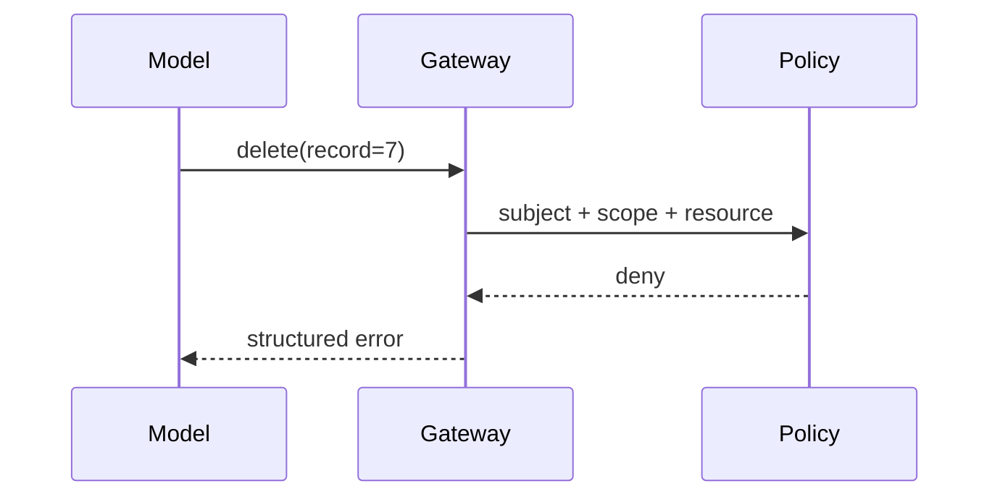
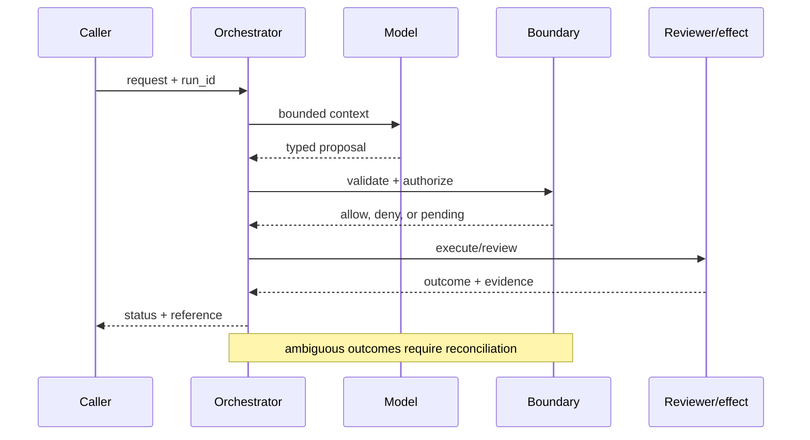

# Permission boundaries
Status: durable
Sources: [OWASP — LLM Top 10](https://owasp.org/www-project-top-10-for-large-language-model-applications/); [NIST zero trust](https://www.nist.gov/publications/zero-trust-architecture); [OpenAI Frontier, published February 5, 2026](https://openai.com/index/introducing-openai-frontier/)
## In one sentence
Model output proposes actions; a separately enforced policy decides whether those actions are permitted.
## Background: what existed before
Many prototypes passed generated SQL or URLs directly to privileged services.
## What changed and why now
Prompt injection and tool use exposed the need for defense in depth and explicit authorization.
## Impact on current processing and architecture
Put policy between model and side effect; validate arguments, tenant, actor, and approval state.
## Real-world applications and constraints
Email, payments, and database agents need deny-by-default controls. Policy latency and false denials affect UX.
## Mental model
```mermaid
flowchart LR
 M[Model proposal]-->V[Validator]-->P[Policy]-->A[Approval]-->E[Effect]
 classDef c fill:#dbeafe,stroke:#2563eb,color:#111827; classDef s fill:#fee2e2,stroke:#dc2626,color:#111827; class M,V,P,A c; class E s
```

## What changed this month
February makes authorization an explicit boundary in agent architecture.
## Engineering consequence
Never infer access from text; use server-side allow-lists and immutable audit events.
## Limits and failure modes
Policy bugs, confused-deputy paths, and overly broad service accounts remain possible.

## SDE2 primer and prerequisites

This lesson treats **permission boundaries** as a resource-enforcement problem. The model can propose intent, but identity, policy, resource state, and the effect owner determine whether that intent becomes an action. Students should know HTTP, JSON, authentication, and basic databases. For SDE2 work, add capabilities, delegation, revocation, audit events, retries, and SLOs. Separate source facts from authorization guarantees that require local tests.

The useful boundary for permission boundaries is **policy decision point, capability token, resource predicate, row filter, deny default, and confused deputy**. These are not magic model capabilities. They are interfaces, records, checks, and operating procedures that can be unit-tested. Start with a low-blast-radius workflow and make every external effect attributable to a run ID, actor, policy version, and evidence reference.

## February source reading: fact before inference

For permission boundaries, read the February source through its own claim boundary. The cited February event is **OpenAI Frontier, published February 5, 2026**. Frontier says AI coworkers have explicit permissions and guardrails. The February fact is the product's stated boundary model; OWASP and zero-trust principles explain why a model proposal must still be checked by the service that owns the side effect. A prompt is not an authorization mechanism. The report or announcement is evidence about what its publisher described. It is not independent validation of the publisher's claims, and it does not specify your data, threat model, latency budget, or regulatory obligations. That distinction matters because a source can motivate a concept without proving that the concept is solved.

For permission boundaries, the engineering inference is narrower: turn the cited capability into an operational contract with topic-specific inputs, states, evidence, and failure ownership. Test that contract against ordinary, adversarial, stale, and interrupted work. A source can motivate this design; it cannot guarantee the resulting reliability or safety.

## Historical baseline and problem boundary

The useful permission baseline is an authenticated request checked once by an application gateway. That is inadequate when a model can choose tools, requests wait in queues, or resources change ownership. A permission boundary must be enforced again at the resource and effect owner with current scope.

For a permission boundary, name the evidence, actor, mutable state, and rejecting component. Treat read evidence, model proposals, and committed effects as different data classes. A request can influence a proposal but cannot grant authority. Test this boundary with stale, malformed, replayed, and partially completed cases.

## Architecture and data flow

The path starts with identity and tenant admission, records the requested action, invokes the model only to produce a typed proposal, and finishes at an authorization gate owned by the target service. Keep policy and configuration revisions beside the work, while generated text remains separate from authorization. Measure authorization latency, denial quality, revocation lag, and protected-effect violations rather than relying on a generic agent score.

```mermaid
flowchart LR
  A[Caller] --> I[Identity and tenant]
  I --> C[Context/evidence]
  C --> M[Model proposal]
  M --> B[Policy Decision Point boundary]
  B --> X[Effect or review]
  X --> L[(Evidence log)]
  classDef data fill:#dbeafe,stroke:#2563eb,color:#172554; classDef control fill:#dcfce7,stroke:#15803d,color:#14532d; classDef risk fill:#fee2e2,stroke:#dc2626,color:#450a0a
  class A,C,X,L data; class I,B control; class M risk
```

Keep requested intent, authenticated principal, capability, resource state, policy decision, and effect receipt separate. A model or document can propose a resource but cannot set the caller’s tenant or role. Bind policy revision, resource version, expiry, and decision reason to the authorization record; log references rather than sensitive payloads.

Record a run identifier, actor, purpose, policy decision point, capability token, resource predicate, row filter, policy and model versions, evidence references, decision, attempts, timestamps, and final state. Add the durable authorization artifact: the normalized action, resource version, token expiry, approval receipt, or commit receipt. A generic transcript cannot explain why a write was accepted. Keep raw content behind controlled references and retention rules.

## Processing walkthrough and state

Permission state includes requested, scoped, allowed, denied, revoked, expired, and policy_unavailable. Recheck the resource and capability immediately before an effect. A cached decision may support a narrow read for a bounded period, but it must never silently authorize a new write.



On retry, reuse the authorization idempotency key or durable artifact; never ask the model to invent a second action when the first attempt has an unknown outcome.

## Topic mechanics: Permission boundaries

### Decision model and topic-specific data contract

Authorization starts with a capability inventory: resource, verb, actor, tenant, purpose, and risk class. The model may propose `create_payment_draft`, but the payment service—not the prompt—checks amount limits, vendor ownership, currency, separation of duties, and approval state. Use deny-by-default policy and return a typed denial that contains a safe reason. Resource predicates matter: a user allowed to read one customer row is not allowed to issue an unrestricted SQL query. Normalize arguments before policy evaluation so alternate encodings cannot bypass a rule. Keep policy decision and effect commit close enough to prevent a time-of-check/time-of-use race; otherwise recheck a version or authorization at commit. Tool descriptions should omit dangerous generic primitives such as unrestricted shell or arbitrary URL fetch. Test indirect prompt injection, confused deputies, cross-tenant IDs, race conditions, and policy outages. A fail-open policy may preserve availability while violating authority; a fail-closed policy may block legitimate work, so define a read-only degraded mode. Frontier's explicit-permission statement is a factual motivation for this boundary; the allow-list, row filter, approval, and race tests are engineering design.

Ask what the boundary can establish at each transition. The request establishes intent only; normalization establishes a bounded representation; the policy service establishes an allow or deny decision; and the effect owner establishes whether the action was committed. A timeout, missing dependency, or ambiguous response therefore becomes an explicit status, not an implicit success. Persist the relevant versions and evidence references, and retain unknown, deferred, or needs-review states when the system cannot prove the stronger claim.

Permission boundaries require versioned policy rules, resource labels, capability grants, and decision reasons. Include the policy revision in every allow or deny record; revoking a capability must change new decisions while preserving the evidence for actions already authorized. A capability should identify its audience and scope, expire quickly, and be unusable outside the intended service. Delegation must preserve the original actor and record the delegating principal, otherwise a worker can become a confused deputy that spends someone else's authority.

Permission enforcement should cap resource fan-out, delegation depth, policy-evaluation time, and the lifetime of a capability token. Fail closed when the policy store is unavailable unless a narrowly scoped cached read is explicitly permitted. Expose `policy_unavailable`, `scope_denied`, and `token_expired` as different outcomes.

Break metrics down by task slice, actor or tenant, policy version, dependency, and outcome class so a healthy average cannot hide a dangerous subgroup. Security review should ask whether every accepted effect can be reconstructed from these fields without trusting model-generated prose.


## Permission boundaries: focused design workshop

Keep request prose, retrieved evidence, generated proposals, and the authorization record in separate typed fields. Boundary code owns completeness, freshness, authorization, and promotion of a result; prose only explains intent. A useful proposal schema contains an action enum, resource identifier, normalized arguments, requested scope, and reason reference. The policy layer should reject unknown actions and extra fields before it evaluates business rules.

The event trail must let an operator distinguish bad input, missing identity, stale resource state, dependency failure, and a confirmed outcome. Record the authorization artifact and the decision that moved it between states. Do not log bearer tokens or full customer records merely to make an audit trail convenient; store hashes, IDs, reason codes, and protected references where possible.

Test authorization races. A capability can be revoked after planning but before execution, or a resource can move tenants while a cached decision remains warm. Bind the decision to resource version and expiry, then recheck at the effect owner. Preserve `policy_unavailable` and `revoked` as distinct outcomes; do not convert uncertainty into allow. For a payment, the final ledger service should verify amount, beneficiary, currency, approval, and idempotency—not just accept a gateway's earlier decision.

Slice boundary metrics by task class, actor or tenant, governing revision, dependency, and final state. Report the invariant, useful completion, latency, cost, and recovery burden together; averages are insufficient when a rare cross-tenant acceptance carries the largest consequence.

Save a failing authorization input as a regression fixture only after redaction, classification, and capture of the governing version. Include fixtures for a legitimate narrow read, a cross-tenant identifier, an extra action field, a revoked capability, an expired token, and a policy-store timeout.


## Applications and operational constraints

Start permission boundaries in observation or draft mode, compare against a deterministic or human baseline, then expand only a narrow cohort and reversible effect class.

This pattern applies to email, payments, ticket updates, deployment controls, and database agents. Choose an application with a named owner and bounded effects, then document data residency, access, quota, staffing, latency, and rollback constraints. For an email assistant, draft mode may be safe while send mode requires recipient restrictions and human approval. For a database assistant, read-only queries can use a narrow replica while writes require parameterized commands, row-level authorization, and a transaction receipt. The right metric differs by deployment; do not import a support or research target without checking the actual user outcome.

Plan permission capacity around policy evaluation, key rotation, entitlement propagation, and decision logging. If the policy service is overloaded, queue or deny protected effects; do not let a timeout become an implicit allow. Mark cached-read behavior and its expiry so users understand the degraded boundary.

## Failure modes, security, and limits

Permission failures include overbroad roles, confused delegation, stale grants, and fail-open behavior during policy outages. Test resource ownership and revocation at the effect owner, not only in a model gateway. Log the exact capability, policy revision, resource, and reason code so a denial can be investigated without exposing secrets.

Permission metrics can improve by making roles unusably narrow or by excluding denied requests from the denominator. Report legitimate task completion, denied high-risk actions, revocation lag, and policy outages together. A low allow rate is not automatically safe, and a low denial rate is not automatically usable.

The February source has a bounded claim and scope limits. Frontier says AI coworkers have explicit permissions and guardrails. That is a product statement, not proof of robustness against your adversaries, correctness on your domain, or a particular service-level target. OWASP's prompt-injection framing and NIST's zero-trust architecture support the principle that each request should be authenticated, authorized, and checked near the protected resource. Treat vendor examples as source facts and label recommendations as inference. When evidence is weak, abstention and escalation are valid outcomes.

## Evaluation and change management

Build permission fixtures for least-privilege reads, cross-tenant IDs, delegated calls, revocation during execution, policy outage, and duplicate writes. Define the invariant that every effect has a current principal, resource, capability, and policy decision. Keep hostile proposals hidden and test the effect owner independently of the model.

Promote a permission policy only when protected effects, denial explanations, revocation lag, and legitimate completion meet their floors. Shadow decisions where safe, retain an emergency deny or narrow-read mode, and enumerate grants that must be revoked or rechecked after rollback.

## February primary-source evidence

The source fact is bounded: **Frontier says AI coworkers have explicit permissions and guardrails. The February fact is the product's stated boundary model; OWASP and zero-trust principles explain why a model proposal must still be checked by the service that owns the side effect. A prompt is not an authorization mechanism.** The February publication date and the publisher's wording should be cited when teaching the event. The recommendation that teams implement policy decision point, capability token, resource predicate, row filter, deny default, and confused deputy is an inference from the event plus established systems practice. It should be validated with local fixtures, security review, operational metrics, and domain experts. The source does not independently verify the examples, and this article does not present them as guarantees.

## Mini exercise extension

Create six fixtures: a missing identity, a stale resource version, a cross-tenant identifier, a revoked capability, a policy dependency interruption, and a verified completion. Assert different states for each case; do not use one generic success label. Store the policy revision and recovery owner beside every assertion, then alter the governing version and prove that prior authorization records remain historical.

## Build it locally: numbered implementation

1. Construct an authorization test record with actor, tenant, action, normalized arguments, resource version, policy revision, decision, and outcome fields.
2. Implement the boundary as a pure function. It must reject unknown actions, missing scope, wrong tenant, expired capability, and incomplete approval.
3. Create deterministic proposals for a valid narrow read, a malformed request, a cross-tenant ID, and a request that adds an unlisted action.
4. Simulate policy storage failing after admission. Use an idempotency key to detect duplicate delivery and reconcile uncertainty.
5. Write an event stream containing authorization states, redacting sensitive payloads while retaining references needed for offline replay.
6. Measure legitimate completion, protected-effect rejection, revocation lag, policy latency, recovery work, and resource cost by slice.
7. Change the policy revision and verify that old events still resolve under their original contract rather than being reinterpreted.

## Runnable low-cost example

```python
def authorize(subject, tenant, action, amount, approved):
    if tenant != "acme" or action not in {"draft_payment", "read_invoice"}: return False
    return action == "read_invoice" or (amount <= 1000 and approved)
print(authorize("agent", "acme", "draft_payment", 900, True))
print(authorize("agent", "other", "read_invoice", 0, False))
```

This sketch demonstrates a deny-by-default branch only. It does not implement authenticated identity, policy distribution, resource ownership, revocation, or audit durability; exercise the effect-owning service before using it as a control.

## Interview Q&A

**Q: Where should permission be enforced?** A: Enforce the permission boundaries rule in deterministic code at the resource or artifact boundary; model output may propose, but it cannot authorize or prove the result.

**Q: Why is a model not a permission boundary?** A: A model can select or explain an action, but its output is influenced by untrusted text and has no independent authority. Deterministic policy and the effect-owning service must authorize it.

**Q: Which metric would you put on the dashboard first?** A: Track whether every protected effect had a current principal, scope, resource version, and policy decision. Pair that invariant with legitimate completion, false denial, revocation lag, latency, and recovery.

**Q: What is the safe response to policy outage?** A: Expose a typed `policy_unavailable` state, stop unsafe transitions, and reconcile the external dependency before retrying. A narrowly scoped cached read may be allowed only if that behavior is explicit and bounded.

**Q: How should permission boundaries be released?** A: Pin the policy revision and resource rules, begin with shadow or reversible work, exercise adversarial fixtures, and require the authorization invariant before widening effects.

## Glossary

- **Policy Decision Point**: the topic-specific control boundary that mediates a model proposal and an outcome.
- **Run ID**: the correlation key that joins one permission boundaries attempt to its actor, permission boundaries evidence, decisions, and recovery evidence.
- **Idempotency**: the permission boundaries guarantee that a retry does not create a second logical result or duplicate effect.
- **Provenance**: origin, version, and transformation evidence attached to a permission boundaries input or artifact.
- **SLO**: an explicit permission boundaries service target, such as freshness, verification latency, queue age, or availability.
- **Abstention**: the permission boundaries state used when evidence, authority, or dependency health is insufficient for a stronger claim.
- **Inference**: an engineering recommendation about permission boundaries derived from source facts rather than presented as a source guarantee.

## References

- [OpenAI Frontier — February 5, 2026](https://openai.com/index/introducing-openai-frontier/)
- [OWASP LLM Top 10](https://owasp.org/www-project-top-10-for-large-language-model-applications/)
- [NIST SP 800-207](https://www.nist.gov/publications/zero-trust-architecture)

## Claim ledger

| Claim | Source | Fact or inference |
|---|---|---|
| The cited publisher published the February event on the stated date. | [OpenAI Frontier, published February 5, 2026](https://openai.com/index/introducing-openai-frontier/) | Fact |
| Frontier says AI coworkers have explicit permissions and guardrails. | [OpenAI Frontier, published February 5, 2026](https://openai.com/index/introducing-openai-frontier/) | Fact |
| Placing an enforceable authorization boundary between probabilistic proposals and effects. | Engineering design synthesis | Inference |
| A separately enforced boundary is safer and easier to operate than treating model text as authority. | Topic standards and systems reasoning | Inference |
| The local example demonstrates the concept but does not prove production security, reliability, or generalization. | This lesson | Fact about the example |
