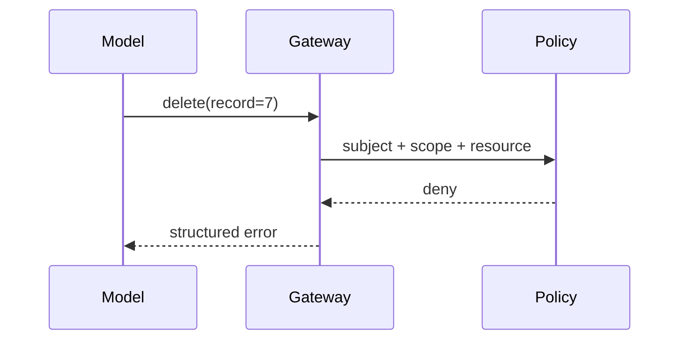
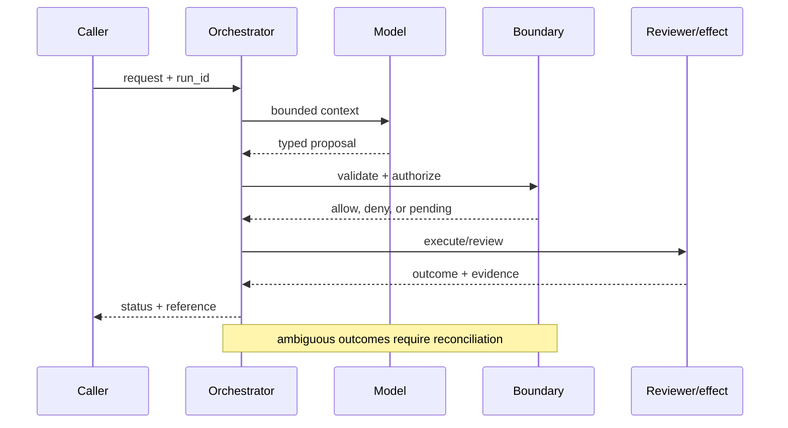

# Permission boundaries
Status: durable
Sources: [OWASP — LLM Top 10](https://owasp.org/www-project-top-10-for-large-language-model-applications/); [NIST zero trust](https://www.nist.gov/publications/zero-trust-architecture); [OpenAI Frontier, published February 5, 2026](https://openai.com/index/introducing-openai-frontier/)
## In one sentence
Model output proposes actions; a separately enforced policy decides whether those actions are permitted.
## Background: what existed before
Many prototypes passed generated SQL or URLs directly to privileged services.
## What changed and why now
Prompt injection and tool use exposed the need for defense in depth and explicit authorization.
## Impact on current processing and architecture
Put policy between model and side effect; validate arguments, tenant, actor, and approval state.
## Real-world applications and constraints
Email, payments, and database agents need deny-by-default controls. Policy latency and false denials affect UX.
## Mental model
```mermaid
flowchart LR
 M[Model proposal]-->V[Validator]-->P[Policy]-->A[Approval]-->E[Effect]
 classDef c fill:#dbeafe,stroke:#2563eb,color:#111827; classDef s fill:#fee2e2,stroke:#dc2626,color:#111827; class M,V,P,A c; class E s
```

## What changed this month
February makes authorization an explicit boundary in agent architecture.
## Engineering consequence
Never infer access from text; use server-side allow-lists and immutable audit events.
## Limits and failure modes
Policy bugs, confused-deputy paths, and overly broad service accounts remain possible.

## SDE2 primer and prerequisites

This lesson is about **permission boundaries** as a production systems problem. A language model is only one stage: an ingress service accepts work, a data layer supplies evidence, an orchestrator keeps state, a policy layer decides what may happen, and an operator or downstream system observes the result. Students should know HTTP, JSON, functions, and basic databases. SDE2 readers should also know queues, authentication, structured logs, metrics, retries, and service-level objectives (SLOs). The central habit is to label what the February source actually reports separately from a recommendation derived from it.

The useful boundary for permission boundaries is **policy decision point, capability token, resource predicate, row filter, deny default, and confused deputy**. These are not magic model capabilities. They are interfaces, records, checks, and operating procedures that can be unit-tested. Start with a low-blast-radius workflow and make every external effect attributable to a run ID, actor, policy version, and evidence reference.

## February source reading: fact before inference

The primary February event is **OpenAI Frontier, published February 5, 2026**. Frontier says AI coworkers have explicit permissions and guardrails. The February fact is the product's stated boundary model; OWASP and zero-trust principles explain why a model proposal must still be checked by the service that owns the side effect. A prompt is not an authorization mechanism. The report or announcement is evidence about what its publisher described. It is not independent validation of the publisher's claims, and it does not specify your data, threat model, latency budget, or regulatory obligations. That distinction matters because a source can motivate a concept without proving that the concept is solved.

The engineering inference in this lesson is that placing an enforceable authorization boundary between probabilistic proposals and effects. Write that inference as a testable contract: state the accepted inputs, expected transitions, forbidden outcomes, and evidence needed to review a decision. If a test fails, improve the system or narrow the intended use; do not silently reinterpret a source claim as a guarantee.

## Historical baseline and problem boundary

Before this month's event, a team could make a convincing prototype with a synchronous request, a prompt, one model call, and a small script around an API. That baseline remains appropriate for drafting or a read-only experiment. It becomes unsafe or unreliable when a request crosses systems, waits, changes durable data, or must be explained later. The failure is not merely that the model can be wrong. It is that the surrounding software may have no place to record authority, version, evidence, retries, or recourse.

For **an accounts-payable agent that may draft a payment but cannot release funds**, draw the boundary before choosing a model. Identify the human or service principal, the records allowed into context, the actions proposed by the model, the component that validates them, and the owner who handles an ambiguous result. Decide which operations are reads, reversible writes, irreversible writes, or merely recommendations. A useful rule is that an untrusted string may influence a proposal but may never create a permission, erase an audit event, or bypass a state transition.

## Architecture and data flow

A deployable design has a control path and a data path. The control path versions configuration, policy, model adapters, schemas, evaluation sets, and rollout cohorts. The data path receives a request, authenticates it, retrieves bounded evidence, invokes the model, validates a typed proposal, executes an allowed action, and records an outcome. The permission boundaries boundary sits between the proposal and the observable outcome; it should be visible in traces and owned by a team.

```mermaid
flowchart LR
  A[Caller] --> I[Identity and tenant]
  I --> C[Context/evidence]
  C --> M[Model proposal]
  M --> B[Policy Decision Point boundary]
  B --> X[Effect or review]
  X --> L[(Evidence log)]
  classDef data fill:#dbeafe,stroke:#2563eb,color:#172554; classDef control fill:#dcfce7,stroke:#15803d,color:#14532d; classDef risk fill:#fee2e2,stroke:#dc2626,color:#450a0a
  class A,C,X,L data; class I,B control; class M risk
```

Use separate fields for user text, retrieved facts, policy instructions, tool output, and generated proposal. This prevents an instruction hidden in a document or tool result from acquiring the authority of a system rule. Every record should carry a tenant or project key where relevant. Cache keys must include authorization scope and source version. Logs should retain enough structured evidence to explain a decision while redacting secrets and unnecessary free text.

A minimal run record is: `run_id`, `request_id`, actor, tenant, purpose, model/version, policy/version, context references, proposal hash, action, decision, timestamps, attempts, effect IDs, and final status. For this topic add policy decision point, capability token, resource predicate, row filter, deny default, and confused deputy. Do not put an unbounded transcript in the primary operational table; store a redacted pointer with a retention policy.

## Processing walkthrough and state

The happy path is only one transition. A request may be malformed, missing evidence, denied, awaiting a reviewer, interrupted after a remote commit, or invalidated by a policy change. Model states explicitly: `received`, `validated`, `proposed`, `blocked`, `pending`, `running`, `succeeded`, `failed`, and `cancelled`. Guard transitions with a run version or compare-and-swap so two workers cannot both advance the same work.



Persist the proposal before a side effect. On retry, reuse the same idempotency key or proof artifact rather than asking the model to invent a new action. A timeout is a state of knowledge, not proof that nothing happened. For a reversible operation, record the compensating action; for an irreversible operation, stop and escalate. For this lesson, the most important transition is the one that prevents **an accounts-payable agent that may draft a payment but cannot release funds** from becoming an unreviewed or untraceable effect.

## Topic mechanics: Permission boundaries

### Decision model and topic-specific data contract

Authorization starts with a capability inventory: resource, verb, actor, tenant, purpose, and risk class. The model may propose `create_payment_draft`, but the payment service—not the prompt—checks amount limits, vendor ownership, currency, separation of duties, and approval state. Use deny-by-default policy and return a typed denial that contains a safe reason. Resource predicates matter: a user allowed to read one customer row is not allowed to issue an unrestricted SQL query. Normalize arguments before policy evaluation so alternate encodings cannot bypass a rule. Keep policy decision and effect commit close enough to prevent a time-of-check/time-of-use race; otherwise recheck a version or authorization at commit. Tool descriptions should omit dangerous generic primitives such as unrestricted shell or arbitrary URL fetch. Test indirect prompt injection, confused deputies, cross-tenant IDs, race conditions, and policy outages. A fail-open policy may preserve availability while violating authority; a fail-closed policy may block legitimate work, so define a read-only degraded mode. Frontier's explicit-permission statement is a factual motivation for this boundary; the allow-list, row filter, approval, and race tests are engineering design.

The first implementation question is what the system can know at each stage. At ingress, it knows an authenticated actor and a request, but not whether the request is well-formed or authorized. During retrieval, it can establish source IDs, freshness, and access filters, but similarity is not truth. During model generation, it can ask for a schema and bounded plan, but the output is still untrusted. At the boundary, deterministic code can enforce limits. After execution, only a receipt, read-after-write check, or independent artifact establishes what happened. This epistemic separation keeps **policy decision point, capability token, resource predicate, row filter, deny default, and confused deputy** from collapsing into one prompt.

Permission boundaries require versioned policy rules, resource labels, capability grants, and decision reasons. Include the policy revision in every allow or deny record; revoking a capability must change new decisions while preserving the evidence for actions already authorized.

Permission enforcement should cap resource fan-out, delegation depth, policy-evaluation time, and the lifetime of a capability token. Fail closed when the policy store is unavailable unless a narrowly scoped cached read is explicitly permitted. Expose `policy_unavailable`, `scope_denied`, and `token_expired` as different outcomes.

For **permission boundaries**, instrument unauthorized-call attempts, false denials, policy latency, approval bypass tests, and blast radius of a compromised token. Break down every metric by task slice, tenant, model version, policy version, and outcome class. An aggregate success number can improve while a small high-risk slice becomes worse. Pair capability metrics with reliability metrics and safety metrics; never use one as a proxy for the others.


## Permission boundaries: focused design workshop

The distinctive design choice for this lesson is **capability checks at the effect owner**. Model the core record as a typed object with `subject, action, resource, amount, approval_id`. Keep user prose outside that object; prose can explain intent, but code must decide whether the object is complete, authorized, fresh, and safe to execute. The invariant is: **model text can propose an action but cannot grant a resource capability**. Emit an event whenever the invariant is checked, including the result, version, actor, and evidence reference. This makes a failure diagnosable without replaying an unconstrained model call.

Consider a concrete **permission boundaries** run. The ingress validator rejects missing identifiers and normalizes timestamps. The context builder retrieves only records permitted by tenant and purpose. The model receives a bounded view and returns a proposal, never a bearer credential or an opaque instruction. The topic-specific boundary then checks `subject, action, resource, amount, approval_id`. If the check passes, the effect owner commits or queues work and returns a receipt. If it fails, the system returns a structured denial or asks for evidence. A reviewer can inspect the event sequence and distinguish bad input, missing authority, stale state, and a remote failure.

Test authorization races. A capability can be revoked after planning but before execution, or a resource can move tenants while a cached decision remains warm. Bind the decision to resource version and expiry, then recheck at the effect owner. Preserve `policy_unavailable` and `revoked` as distinct outcomes; do not convert uncertainty into allow.

For operations, partition metrics by `capability checks at the effect owner` and by model, policy, tenant, and outcome. Track the invariant violation directly, plus useful completion, latency, cost, and human override. A single aggregate can hide a catastrophic slice: one customer, one high-risk action, one rare theorem class, or one overloaded region. Set a release floor for the topic-specific safety metric before optimizing throughput.

The mini design exercise is **deny a payment over the limit and a cross-tenant record ID**. Implement it with an in-memory store first, then add a failure injection at every boundary. Expected behavior should be deterministic even if the proposal generator is not. Save the failing input as a regression fixture only after removing secrets and identifying the policy version that governed it.


## Applications and operational constraints

The strongest first application is **an accounts-payable agent that may draft a payment but cannot release funds** because it has a bounded workflow and a domain owner. A team might begin in shadow mode, where the system produces a proposal but performs no effect. Next, allow a canary cohort and only low-risk actions. Require an explicit launch review before expanding scope. The useful outcome is not “the model answered”; it is a completed task that meets quality, latency, cost, privacy, and policy constraints.

Other plausible applications include payments, email, CRM updates, database writes, and cloud administration. Each has a different bottleneck. A support system values queue age and consistent escalation; an operations system values correctness and rollback; research values evidence and uncertainty; security values time to detect and false-positive capacity. Data residency, tenant isolation, secrets, rate limits, procurement, and human availability can dominate model latency. Document those constraints in the service contract rather than in an informal prompt.

Plan permission capacity around policy evaluation, key rotation, entitlement propagation, and decision logging. If the policy service is overloaded, queue or deny protected effects; do not let a timeout become an implicit allow. Mark cached-read behavior and its expiry so users understand the degraded boundary.

## Failure modes, security, and limits

Permission failures include overbroad roles, confused delegation, stale grants, and fail-open behavior during policy outages. Test resource ownership and revocation at the effect owner, not only in a model gateway. Log the exact capability, policy revision, resource, and reason code so a denial can be investigated without exposing secrets.

Permission metrics can improve by making roles unusably narrow or by excluding denied requests from the denominator. Report legitimate task completion, denied high-risk actions, revocation lag, and policy outages together. A low allow rate is not automatically safe, and a low denial rate is not automatically usable.

The February source also has scope limits. Frontier says AI coworkers have explicit permissions and guardrails. The February fact is the product's stated boundary model; OWASP and zero-trust principles explain why a model proposal must still be checked by the service that owns the side effect. A prompt is not an authorization mechanism. Nothing in that observation proves robustness against your adversaries, correctness on your domain, or a particular service-level target. Treat vendor examples as source facts and label recommendations as inference. When evidence is weak, abstention and escalation are valid outcomes.

## Evaluation and change management

Build a fixture set from ordinary, ambiguous, malformed, adversarial, slow, stale, and partially completed cases. Include a golden expected state and the invariants that must never break. Run the set against a pinned model and a deterministic baseline. Review failures by category, not just a total score. Keep hidden cases to detect overfitting, and sample production traces only after removing secrets.

Release gates should include a quality floor, a policy-violation ceiling, a reliability budget, a cost budget, and an evidence-completeness check. Roll out to a small cohort, compare with shadow results, and retain a kill switch that disables risky effects without destroying diagnostic reads. On rollback, record which version was disabled and whether external effects require remediation.

## February primary-source evidence

The source fact is bounded: **Frontier says AI coworkers have explicit permissions and guardrails. The February fact is the product's stated boundary model; OWASP and zero-trust principles explain why a model proposal must still be checked by the service that owns the side effect. A prompt is not an authorization mechanism.** The February publication date and the publisher's wording should be cited when teaching the event. The recommendation that teams implement policy decision point, capability token, resource predicate, row filter, deny default, and confused deputy is an inference from the event plus established systems practice. It should be validated with local fixtures, security review, operational metrics, and domain experts. The source does not independently verify the examples, and this article does not present them as guarantees.

## Mini exercise extension

Create six fixtures for **an accounts-payable agent that may draft a payment but cannot release funds**: a normal request, missing evidence, an adversarial instruction, a policy denial, a timeout or interrupted run, and a successful outcome. For each fixture record the expected state, the allowed effect, and the evidence a reviewer should see. Add one version change and prove that the old event retains its original version. Your acceptance criterion is not a polished answer; it is a correct boundary, an explainable decision, and a safe recovery path.

## Build it locally: numbered implementation

1. Define dataclasses for `Request`, `Context`, `Proposal`, `Decision`, `Event`, and `Outcome`; require a run ID and version fields.
2. Write a deterministic boundary function for **policy decision point, capability token, resource predicate, row filter, deny default, and confused deputy**; deny unknown actions and malformed arguments.
3. Add a fake model that returns one valid and two invalid proposals, including an instruction hidden in retrieved text.
4. Add a fake downstream service with a timeout, an idempotency map, and a read-after-write reconciliation method.
5. Persist redacted JSON Lines events and implement replay without invoking a live model.
6. Run the six fixtures, assert the security invariant, and calculate unauthorized-call attempts, false denials, policy latency, approval bypass tests, and blast radius of a compromised token.
7. Change one policy or schema version, rerun the fixtures, and inspect the diff in evidence and state transitions.

## Runnable low-cost example

```python
def authorize(subject, tenant, action, amount, approved):
    if tenant != "acme" or action not in {"draft_payment", "read_invoice"}: return False
    return action == "read_invoice" or (amount <= 1000 and approved)
print(authorize("agent", "acme", "draft_payment", 900, True))
print(authorize("agent", "other", "read_invoice", 0, False))
```

This example is intentionally small and deterministic. It demonstrates the lesson's boundary and its invariant; it does not claim production-grade authentication, durability, isolation, or domain correctness. Extend it with the numbered build steps and failure fixtures before drawing operational conclusions.

## Interview Q&A

**Q: What is the difference between a source fact and an engineering inference?** A: The fact is what a dated publisher says it released, measured, or observed. The inference is a design recommendation derived from that fact and other knowledge; it needs local validation.

**Q: Why separate model output from the boundary?** A: Model output is probabilistic and can be manipulated by input. The boundary is deterministic, attributable code that can enforce authorization, schemas, budgets, and state transitions.

**Q: Which metric would you put on the dashboard first?** A: A useful outcome metric plus a failure metric specific to the topic—unauthorized-call attempts, false denials, policy latency, approval bypass tests, and blast radius of a compromised token. Pair it with slices so an aggregate cannot hide a critical regression.

**Q: When should the system abstain?** A: When evidence is missing or stale, the policy is ambiguous, the budget is exhausted, or an external effect has an unknown status. Escalate with evidence instead of fabricating confidence.

**Q: What should happen during rollout?** A: Pin versions, start in shadow or canary mode, limit high-risk effects, monitor quality/reliability/safety separately, and keep an audited rollback path.

## Glossary

- **Policy Decision Point**: the topic-specific control boundary that mediates a model proposal and an outcome.
- **Run ID**: a stable identifier joining request, context, decisions, attempts, and effects.
- **Idempotency**: repeating a request produces one logical effect rather than duplicates.
- **Provenance**: evidence describing origin, version, and transformations.
- **SLO**: a measurable service target such as latency or successful completion.
- **Abstention**: an explicit refusal or escalation when evidence or authority is insufficient.
- **Inference**: an engineering conclusion drawn from facts, not a quotation or guarantee from a source.

## References

- [OpenAI Frontier — February 5, 2026](https://openai.com/index/introducing-openai-frontier/)
- [OWASP LLM Top 10](https://owasp.org/www-project-top-10-for-large-language-model-applications/)
- [NIST SP 800-207](https://www.nist.gov/publications/zero-trust-architecture)

## Claim ledger

| Claim | Source | Fact or inference |
|---|---|---|
| The cited publisher published the February event on the stated date. | [OpenAI Frontier, published February 5, 2026](https://openai.com/index/introducing-openai-frontier/) | Fact |
| Frontier says AI coworkers have explicit permissions and guardrails. | [OpenAI Frontier, published February 5, 2026](https://openai.com/index/introducing-openai-frontier/) | Fact |
| Placing an enforceable authorization boundary between probabilistic proposals and effects. | Engineering design synthesis | Inference |
| A separately enforced boundary is safer and easier to operate than treating model text as authority. | Topic standards and systems reasoning | Inference |
| The local example demonstrates the concept but does not prove production security, reliability, or generalization. | This lesson | Fact about the example |
