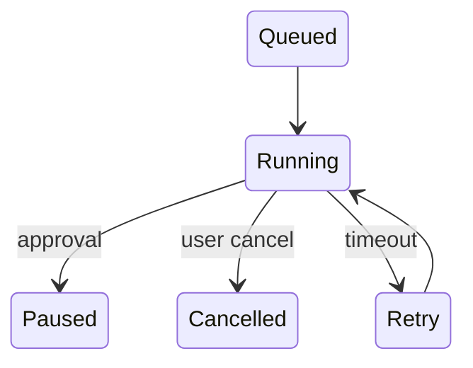
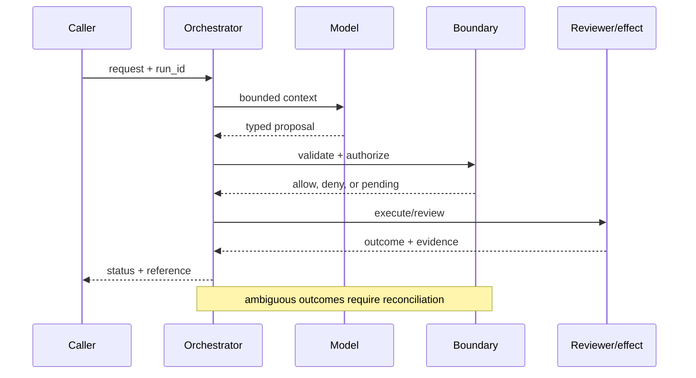

# Long-horizon tasks
Status: emerging
Sources: [Google SRE — 2016](https://sre.google/sre-book/handling-overload/); [Temporal — durable execution](https://docs.temporal.io/evaluate/use-cases); [OpenAI Frontier, published February 5, 2026](https://openai.com/index/introducing-openai-frontier/)
## In one sentence
Long-horizon work needs checkpoints, leases, retries, and cancellation because a single model call cannot own hours of progress.
## Background: what existed before
Request/response handlers assumed seconds-long, mostly synchronous work.
## What changed and why now
Agents chain tools and approvals, making queueing and recovery first-class concerns.
## Impact on current processing and architecture
Use a durable queue, heartbeat/lease, checkpoint store, and cancellation token.
## Real-world applications and constraints
Useful for procurement and migration jobs. Stale leases, partial effects, and user abandonment require cleanup.
## Mental model
```mermaid
flowchart LR
 Q[Queue]-->W[Worker]-->C[Checkpoint]-->Q
 W-->L[Lease]
 classDef a fill:#dbeafe,stroke:#2563eb,color:#111827; classDef b fill:#dcfce7,stroke:#16a34a,color:#111827; class Q,W a; class C,L b
```

## What changed this month
The February map connects agent autonomy to established SRE workload controls.
## Engineering consequence
Make every step resumable and every retry bounded; expose progress and cancel APIs.
## Limits and failure modes
Retries amplify outages; checkpoints can be stale; cancellation may not undo an already committed effect.

## SDE2 primer and prerequisites

This lesson treats **long-horizon tasks** as resumable workflow execution. The model proposes steps, while durable state, timers, budgets, cancellation, and effect reconciliation keep work safe across delays and crashes. Students should know HTTP, JSON, functions, and basic databases. For SDE2 work, add queues, checkpoints, leases, retries, metrics, and SLOs. Separate source facts from durability guarantees that require local tests.

The useful boundary for long-horizon tasks is **lease, heartbeat, checkpoint, saga, cancellation token, compensation, and budget**. These are not magic model capabilities. They are interfaces, records, checks, and operating procedures that can be unit-tested. Start with a low-blast-radius workflow and make every external effect attributable to a run ID, actor, policy version, and evidence reference.

## February source reading: fact before inference

For long horizon tasks, read the February source through its own claim boundary. The cited February event is **OpenAI Frontier, published February 5, 2026**. Frontier says agents can plan, act, solve problems with tools, and run across several runtime locations. That product framing makes long-running work a relevant February lesson, but it does not guarantee completion or recovery. SRE overload guidance and durable-execution practice provide the operational baseline. The report or announcement is evidence about what its publisher described. It is not independent validation of the publisher's claims, and it does not specify your data, threat model, latency budget, or regulatory obligations. That distinction matters because a source can motivate a concept without proving that the concept is solved.

For long horizon tasks, the engineering inference is narrower: turn the cited capability into an operational contract with topic-specific inputs, states, evidence, and failure ownership. Test that contract against ordinary, adversarial, stale, and interrupted work. A source can motivate this design; it cannot guarantee the resulting reliability or safety.

## Historical baseline and problem boundary

The useful long-task baseline is a single model call that returns a plan immediately. It cannot preserve progress through hours of waiting, dependency failure, or operator interruption. Long-horizon execution therefore needs explicit checkpoints, budgets, cancellation, and effect reconciliation.

For long-horizon work, name the goal, actor, mutable state, checkpoint, and rejecting component. Treat observations, model plans, and committed effects as different data classes. A plan can influence the next proposal but cannot prove that an external effect occurred. Test this boundary with stale, malformed, replayed, and partially completed cases.

## Architecture and data flow

The path starts by admitting a goal and budget, records durable workflow state, invokes only the activity needed for the current step, and finishes at a checkpoint or effect-reconciliation gate. Keep policy and configuration revisions beside the work, while generated text remains separate from durable state. Measure queue age, checkpoint freshness, useful completion, recovery time, and budget burn rather than relying on a generic agent score.

```mermaid
flowchart LR
  A[Caller] --> I[Identity and tenant]
  I --> C[Context/evidence]
  C --> M[Model proposal]
  M --> B[Lease boundary]
  B --> X[Effect or review]
  X --> L[(Evidence log)]
  classDef data fill:#dbeafe,stroke:#2563eb,color:#172554; classDef control fill:#dcfce7,stroke:#15803d,color:#14532d; classDef risk fill:#fee2e2,stroke:#dc2626,color:#450a0a
  class A,C,X,L data; class I,B control; class M risk
```

Keep the goal, plan, observation, checkpoint, budget, and effect receipt in distinct records. A plan is a proposal; an observation or receipt is evidence about the world. Bind run, step, dependency version, tenant, and budget to checkpoints, and retain only the context needed to resume safely.

Record a run identifier, actor, purpose, lease, heartbeat, checkpoint, saga, cancellation token, compensation, budget, policy and model versions, evidence references, decision, attempts, timestamps, and final state. Add the durable artifact that permits safe resumption: source cursor, dependency version, activity receipt, and next eligible transition. A generic transcript cannot prove where a workflow stopped. Keep raw content behind controlled references and retention rules.

## Processing walkthrough and state

Long-task state should distinguish planned, waiting, running, paused, cancelled, effect_unknown, completed, and abandoned. Persist a checkpoint before resuming after interruption and compare dependency versions. Never let a stale plan advance merely because its text still looks coherent.



On retry, reuse the workflow idempotency key or durable artifact; never ask the model to invent a second action when the first attempt has an unknown outcome.

## Topic mechanics: Long-horizon tasks

### Decision model and topic-specific data contract

Long-horizon orchestration is a resource-management problem. Turn a goal into a DAG of bounded activities with an owner, input contract, timeout, retry class, and compensation. A lease says which worker may advance a step; a heartbeat renews it only while progress is real. A queue separates user latency from work duration, and a progress event gives the user a truthful estimate without exposing internal reasoning. For a catalog migration, validate a batch, write it with an idempotency key, reconcile the destination count, checkpoint the source cursor, then schedule the next batch. If approval is revoked, cancel future batches and leave a repair task for committed data. Exponential backoff must have a maximum and a jitter; otherwise a dependency outage creates a synchronized retry storm. Budget tokens and tool calls per step and for the whole workflow. A stale checkpoint can cause omission or duplication, so include a source version and compare it before commit. The February Frontier framing makes tools and execution part of agent work; SRE and durable-runtime practice provide the recovery vocabulary. No model can turn an irreversible external effect into an automatically cancellable one.

Ask what each transition can establish. The request establishes intent only; the checkpoint establishes what was durably observed; the activity receipt establishes whether an effect was acknowledged; and reconciliation establishes whether the remote state matches expectation. A timeout, missing dependency, or ambiguous response therefore becomes an explicit status, not an implicit success. Persist relevant versions and evidence references, and retain unknown, deferred, or needs-review states when the system cannot prove the stronger claim.

Long-horizon work needs versioned plans, checkpoint schemas, dependency snapshots, budgets, and cancellation rules. Pin them to each run so a resumed task cannot silently combine a new planner with assumptions recorded by an older checkpoint. A migration worker should compare the source version before committing a batch; if it changed, pause and re-plan rather than silently applying an old cursor.

Long tasks need a declared step budget, wall-clock deadline, checkpoint quota, and tool-call ceiling. Pause work when the next step cannot fit those limits and expose whether the run is waiting, cancelled, or genuinely failed. `budget_exhausted` should never be reported as a successful partial completion.

Break metrics down by task slice, actor or tenant, workflow version, dependency, and outcome class so a healthy average cannot hide a dangerous subgroup. Include abandoned runs and operator takeover, since delayed cleanup is part of the system's cost.


## Long-horizon tasks: focused design workshop

Keep request prose, retrieved evidence, generated plans, checkpoints, receipts, and final outcomes in separate typed fields. Workflow code owns completeness, freshness, cancellation, and promotion of a result; prose only explains intent. A step record should identify its input snapshot, attempt number, timeout, retry class, and compensation path.

The event trail must let an operator distinguish bad input, missing evidence, stale checkpoint, dependency failure, cancellation, and a confirmed outcome. Record the checkpoint or receipt and the decision that moved the workflow between states. Keep state transitions append-only so a later retry does not erase the fact that a commit was once unknown.

Test long-task races. A checkpoint may resume after its dependency version changes, or cancellation may arrive while the next tool call is being prepared. Validate checkpoint compatibility and cancellation ownership before continuing. Preserve `paused`, `cancel_requested`, and `unknown_commit`; a partial plan is not a completed task.

Slice workflow metrics by task class, actor or tenant, governing revision, dependency, and final state. Report the invariant, useful completion, latency, cost, and recovery burden together; averages are insufficient when a rare duplicate effect or abandoned run carries the largest consequence.

Save a failing workflow input as a regression fixture only after redaction, classification, and capture of the governing version. Include interruptions at lease expiry, after remote commit, before checkpoint, and during cancellation.


## Applications and operational constraints

Start long horizon tasks in observation or draft mode, compare against a deterministic or human baseline, then expand only a narrow cohort and reversible effect class.

This pattern applies to procurement, data migration, incident remediation, report generation, and multi-step research. Choose an application with a named owner and bounded effects, then document data residency, access, quota, staffing, latency, and rollback constraints. A procurement workflow can pause for approval, while a migration can compensate or quarantine a partially copied batch. The right metric differs by deployment; do not import a support or research target without checking the actual user outcome.

Plan long-task capacity around active leases, checkpoint writes, timers, tool quotas, and human recovery queues. If workers are scarce, pause new runs while preserving durable state. A status such as `paused_for_capacity` must remain distinct from success so a user does not mistake an unfinished plan for a completed outcome.

## Failure modes, security, and limits

Long tasks fail through budget drift, stale plans, duplicate effects after recovery, and cancellation that reaches only one worker. Persist budgets with checkpoints, validate dependencies before resumption, and reconcile remote receipts. Measure abandoned work and recovery age, not only final success, because a task that consumes its budget silently is an operational failure.

Long-task metrics can improve by terminating difficult runs early or counting plans as outcomes before their effects are verified. Pair completion with useful completion, budget consumed, recovery time, and abandoned-work rate. A shorter average task is not progress if it shifts unfinished work to operators.

The February source has a bounded claim and scope limits. Frontier says agents can plan, act, solve problems with tools, and run across several runtime locations. That product framing makes long-running work relevant, but it does not guarantee completion or recovery. SRE overload guidance and durable-execution practice provide the operational baseline. Nothing in that observation proves robustness against your adversaries, correctness on your domain, or a particular service-level target. Treat vendor examples as source facts and label recommendations as inference. When evidence is weak, pause, hand off, or reconcile rather than claiming success.

## Evaluation and change management

Build long-task fixtures for normal completion, budget exhaustion, cancellation, stale checkpoints, dependency outage, duplicate effects, and human takeover. Assert checkpoint compatibility and effect idempotency. Replay with recorded observations and preserve hidden interruption points so the planner cannot be tested only on happy paths.

Promote a planner only when useful completion, budget adherence, recovery, cancellation, and duplicate-effect floors hold across long runs. Canary with simulated interruptions, retain a pause and takeover path, and reconcile active checkpoints before reverting planner code. Record abandoned work that needs operator recovery.

## February primary-source evidence

The source fact is bounded: **Frontier says agents can plan, act, solve problems with tools, and run across several runtime locations. That product framing makes long-running work a relevant February lesson, but it does not guarantee completion or recovery. SRE overload guidance and durable-execution practice provide the operational baseline.** The February publication date and the publisher's wording should be cited when teaching the event. The recommendation that teams implement lease, heartbeat, checkpoint, saga, cancellation token, compensation, and budget is an inference from the event plus established systems practice. It should be validated with local fixtures, security review, operational metrics, and domain experts. The source does not independently verify the examples, and this article does not present them as guarantees.

## Mini exercise extension

Create six fixtures: a missing checkpoint, a stale dependency version, an adversarial plan, a lease expiry, a dependency interruption after remote commit, and a verified completion. Assert different states for each case; do not use one generic success label. Store the evidence reference and recovery owner beside every assertion, then alter the governing version and prove that prior workflow records remain historical.

## Build it locally: numbered implementation

1. Construct a workflow test record with actor, goal, checkpoint, dependency version, budget, decision, and outcome fields.
2. Implement a transition function that rejects an incompatible checkpoint, expired lease, over-budget step, or unknown state.
3. Create deterministic plans for a valid batch, a malformed step, and a plan that exceeds its tool-call budget.
4. Simulate a dependency failing after a remote commit. Use an idempotency key and reconciliation status to prevent duplicate delivery.
5. Write an event stream containing workflow states, redacting sensitive payloads while retaining references needed for offline replay.
6. Measure useful completion, time in each state, recovery work, abandoned runs, and resource cost by task slice.
7. Change the workflow schema or planner revision and verify that old checkpoints still resolve under their original contract.

## Runnable low-cost example

```python
jobs = {"batch-3": {"lease":"worker-a", "status":"running", "checkpoint":40}}
def claim(job, worker):
    return jobs[job]["lease"] == worker and jobs[job]["status"] == "running"
print(claim("batch-3", "worker-a"), claim("batch-3", "worker-b"))
```

This checkpoint sketch demonstrates lease ownership only. It does not persist state, cancel workers, reconcile effects, or survive a crash; add interruption and stale-checkpoint fixtures before drawing conclusions about long tasks.

## Interview Q&A

**Q: What does a checkpoint guarantee?** A: It proves only that the recorded local state was durably written. It does not prove that a remote side effect committed, so the workflow needs a receipt or reconciliation step.

**Q: Why are plans not durable state?** A: A plan is an intention that can become stale. Durable state must record observed inputs, completed activities, versions, and the next legal transition.

**Q: Which metric would you put on the dashboard first?** A: Track useful completion and abandoned-work age, then pair them with budget burn, duplicate-effect rate, recovery time, and checkpoint freshness.

**Q: When should a long task pause?** A: Pause on missing approval, stale dependencies, exhausted budget, expired lease, or an unknown external outcome. Preserve state for a worker or human to resume safely.

**Q: How should long-horizon workflows be released?** A: Pin workflow and checkpoint versions, start with reversible work, inject interruptions, and require useful-completion, cancellation, and reconciliation floors before widening effects.

## Glossary

- **Lease**: the topic-specific control boundary that mediates a model proposal and an outcome.
- **Run ID**: the correlation key that joins one long horizon tasks attempt to its actor, long horizon tasks evidence, decisions, and recovery evidence.
- **Idempotency**: the long horizon tasks guarantee that a retry does not create a second logical result or duplicate effect.
- **Provenance**: origin, version, and transformation evidence attached to a long horizon tasks input or artifact.
- **SLO**: an explicit long horizon tasks service target, such as freshness, verification latency, queue age, or availability.
- **Abstention**: the long horizon tasks state used when evidence, authority, or dependency health is insufficient for a stronger claim.
- **Inference**: an engineering recommendation about long horizon tasks derived from source facts rather than presented as a source guarantee.

## References

- [OpenAI Frontier — February 5, 2026](https://openai.com/index/introducing-openai-frontier/)
- [Google SRE: handling overload](https://sre.google/sre-book/handling-overload/)
- [Temporal durable execution concepts](https://docs.temporal.io/evaluate/use-cases)

## Claim ledger

| Claim | Source | Fact or inference |
|---|---|---|
| The cited publisher published the February event on the stated date. | [OpenAI Frontier, published February 5, 2026](https://openai.com/index/introducing-openai-frontier/) | Fact |
| Frontier says agents can plan, act, solve problems with tools, and run across several runtime locations. | [OpenAI Frontier, published February 5, 2026](https://openai.com/index/introducing-openai-frontier/) | Fact |
| Breaking an open-ended goal into bounded, observable, cancellable work units. | Engineering design synthesis | Inference |
| A separately enforced boundary is safer and easier to operate than treating model text as authority. | Topic standards and systems reasoning | Inference |
| The local example demonstrates the concept but does not prove production security, reliability, or generalization. | This lesson | Fact about the example |
