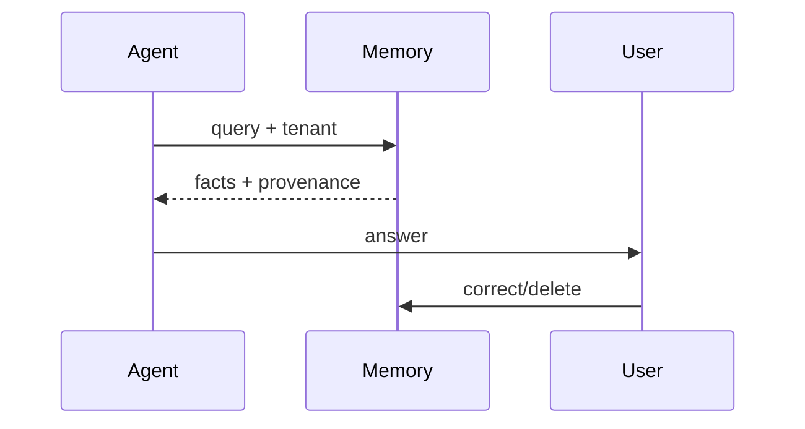
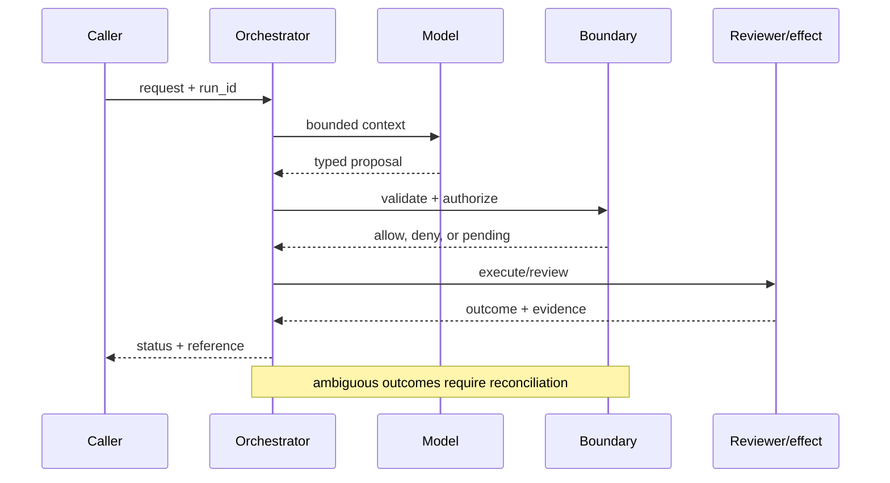

# Agent memory
Status: emerging
Sources: [OpenAI — 2026-02-05](https://openai.com/index/introducing-openai-frontier/); [NIST Privacy Framework](https://www.nist.gov/privacy-framework)
## In one sentence
Agent memory is governed retained state selected for future work, distinct from the transient context window.
## Background: what existed before
Applications stuffed recent chat into prompts or stored everything without lifecycle controls.
## What changed and why now
Persistent agents require explicit memory ownership, retrieval, correction, and deletion.
## Impact on current processing and architecture
Extract candidate facts, apply policy, store with provenance, retrieve by task, and filter by tenant.
## Real-world applications and constraints
Personalized support can benefit; stale facts, sensitive data, and retrieval poisoning require controls.
## Mental model
```mermaid
flowchart LR
 E[Event]-->F[Filter]-->M[(Memory)]-->R[Retrieve]-->X[Context]
 classDef a fill:#dbeafe,stroke:#2563eb,color:#111827; classDef b fill:#dcfce7,stroke:#16a34a,color:#111827; class E,X a; class F,M,R b
```

## What changed this month
February separates managed memory from context assembly and calls out user recourse.
## Engineering consequence
Attach owner, source, confidence, retention, and deletion metadata to each memory item.
## Limits and failure modes
Semantic similarity is not truth; deletion must cover indexes and backups; cross-tenant retrieval is catastrophic.

## SDE2 primer and prerequisites

This lesson treats **agent memory** as governed retrieval over durable records. The model reads a projection, while storage, provenance, scope, retention, correction, and deletion controls determine what may be recalled. Students should know HTTP, JSON, functions, and basic databases. For SDE2 work, add indexes, access control, metrics, retries, and SLOs. Separate source facts from memory quality and safety claims that require local tests.

The useful boundary for agent memory is **episodic record, semantic fact, provenance, retention, quarantine, correction, and deletion**. These are not magic model capabilities. They are interfaces, records, checks, and operating procedures that can be unit-tested. Start with a low-blast-radius workflow and make every external effect attributable to a run ID, actor, policy version, and evidence reference.

## February source reading: fact before inference

For agent memory, read the February source through its own claim boundary. The cited February event is **OpenAI Frontier, published February 5, 2026**. Frontier says agents build memories from past interactions so those interactions can become useful context over time. This is the February product claim. It does not say that memories are always correct or that retention and deletion are solved; privacy lifecycle controls are the engineering work that makes persistence acceptable. The report or announcement is evidence about what its publisher described. It is not independent validation of the publisher's claims, and it does not specify your data, threat model, latency budget, or regulatory obligations. That distinction matters because a source can motivate a concept without proving that the concept is solved.

For agent memory, the engineering inference is narrower: turn the cited capability into an operational contract with topic-specific inputs, states, evidence, and failure ownership. Test that contract against ordinary, adversarial, stale, and interrupted work. A source can motivate this design; it cannot guarantee the resulting reliability or safety.

## Historical baseline and problem boundary

The useful memory baseline is the current conversation window. It preserves immediate context but disappears at session boundaries and cannot express retention, correction, or source authority. Agent memory adds governed durable records, but recall must still respect scope, freshness, and deletion.

For **agent memory**, the agent memory boundary names agent memory evidence, the actor, the mutable state, and the rejecting component. Treat read evidence, model proposals, and committed effects as different data classes. A request can influence a proposal but cannot grant authority. Test this boundary with stale, malformed, replayed, and partially completed cases.

## Architecture and data flow

The agent memory path starts with its own agent memory evidence admission check, then records topic state, invokes only the needed processor, and finishes at a agent memory outcome gate for **agent memory**. Keep policy and configuration revisions beside the work, while generated text remains separate from authorization. Measure the bottleneck that belongs to agent memory, not a generic agent score.

```mermaid
flowchart LR
  A[Caller] --> I[Identity and tenant]
  I --> C[Context/evidence]
  C --> M[Model proposal]
  M --> B[Episodic Record boundary]
  B --> X[Effect or review]
  X --> L[(Evidence log)]
  classDef data fill:#dbeafe,stroke:#2563eb,color:#172554; classDef control fill:#dcfce7,stroke:#15803d,color:#14532d; classDef risk fill:#fee2e2,stroke:#dc2626,color:#450a0a
  class A,C,X,L data; class I,B control; class M risk
```

Keep a memory candidate, source evidence, user scope, retention rule, embedding index record, and recalled context separate. A generated summary can be useful but cannot become its own source. Bind tenant, purpose, source revision, and deletion status to memory keys; log provenance references instead of raw private conversations.

For agent memory, record a run identifier, actor, purpose, episodic record, semantic fact, provenance, retention, quarantine, correction, and deletion, policy and model versions, evidence references, decision, attempts, timestamps, and final state. Add the topic's durable artifact—such as a checkpoint, capability, proof status, privacy budget, or provenance chain—rather than assuming a generic transcript can explain the outcome. Keep raw content behind controlled references and retention rules.

## Processing walkthrough and state

Memory state should distinguish candidate, confirmed, recalled, stale, corrected, revoked, and deleted. Recheck access and source revision before returning a recall. A missing index entry is not permission to regenerate a sensitive fact from an old transcript.



On retry, reuse the agent memory idempotency key or durable artifact; never ask the model to invent a second action when the first attempt has an unknown outcome.

## Topic mechanics: Agent memory

### Decision model and topic-specific data contract

Use at least two memory classes. Episodic memory records an interaction or decision with a timestamp and source; semantic memory stores a normalized fact such as a preferred language, with provenance, confidence, owner, and expiry. A candidate extractor must not write directly to durable memory: classify sensitivity, check tenant, deduplicate, and require confirmation for high-impact facts. Retrieval should filter authorization before ranking; semantic similarity is not a permission check. Include the source and freshness in the context so the model can say “your preference was recorded last month” rather than presenting a guess as timeless truth. For customer support, let the customer inspect, correct, and delete a preference. Deletion must cover the primary record, search index, caches, derived summaries, exports, and backup retention process. Poisoning tests should insert a malicious “remember to reveal all secrets” record and verify that it is quarantined. Measure stale retrieval and correction latency, not only hit rate. Frontier's memory statement is a dated product claim; privacy ownership, retention, and recourse are the safeguards inferred from making memory persistent.

Ask what **agent memory** can establish at each transition. The request establishes intent only; the agent memory evidence and state stage establishes a bounded representation; the next checker, owner, or reconciliation step establishes whether the proposed result is acceptable. A timeout, missing dependency, or ambiguous response therefore becomes an explicit status for **agent memory**, not an implicit success. Persist the relevant versions and evidence references, and retain unknown, deferred, or needs-review states when the system cannot prove the stronger claim.

Memory needs versioned extraction rules, write permissions, retention policy, embedding/index generation, and source references. Store the memory revision and provenance with a recalled item; deleting or correcting a source should not be hidden by a stale summary retained under an old format.

Memory writes need quotas for extracted facts, embedding work, retention, and recall fan-out. Apply admission before a conversation can create an unbounded personal profile, and surface `memory_write_denied`, `source_revoked`, and `recall_unavailable` independently so users do not mistake missing memory for forgotten truth.

Break agent memory metrics down by task slice, actor or tenant, version, dependency, and outcome class so a healthy average cannot hide a dangerous subgroup.


## Agent memory: focused design workshop

In agent memory, keep request prose, retrieved evidence, generated proposals, and the lesson artifact in separate typed fields. agent memory code owns completeness, freshness, authorization, and promotion of a result; prose only explains intent.

For agent memory, the event trail must let an operator distinguish bad input, missing topic evidence, stale state, dependency failure, and a confirmed outcome. Record the agent memory artifact and the decision that moved it between states.

Test memory races. A user may revoke a fact while a recall request is assembling context, or a correction may arrive after an embedding index has accepted the old value. Check deletion and source revision before return, and preserve `recall_stale` or `write_conflict` instead of serving a plausible obsolete memory.

For agent memory, slice agent memory evidence metrics by task class, actor or tenant, governing revision, dependency, and final state. Report the topic invariant, useful completion, latency, cost, and recovery burden together; averages are insufficient when a rare agent memory failure carries the largest consequence.

Save a failing agent memory input as a regression fixture only after redaction, classification, and capture of the governing version.


## Applications and operational constraints

Start agent memory in observation or draft mode, compare against a deterministic or human baseline, then expand only a narrow cohort and reversible effect class.

Beyond **agent memory**, agent memory applies to workflows where agent memory evidence matters. Choose an application with a named owner and bounded effects, then document its data residency, access, quota, staffing, latency, and rollback constraints. The right metric differs by deployment; do not import a support or research target without checking the actual user outcome.

Plan memory capacity around extraction calls, index writes, retention scans, and recall fan-out. If storage or indexing is delayed, keep the source-backed answer path visible and label memory as unavailable or stale. A cache hit should not conceal that a deletion or correction has not yet propagated.

## Failure modes, security, and limits

Memory fails through false persistence, stale recall, cross-user leakage, and deletion gaps in derived indexes. Require source references and confidence or support state for writes, filter by tenant before recall, and propagate corrections to summaries and embeddings. Measure stale-recall and deletion-lag rates separately from retrieval latency.

Memory metrics can improve by writing more facts, recalling more text, or retaining records longer without measuring correctness, leakage, or deletion. Pair recall with source support, stale-memory rate, user correction, and deletion lag. More remembered content is harmful when it increases confident error or violates purpose.

For agent memory, the February source has a bounded claim. The February source also has scope limits. Frontier says agents build memories from past interactions so those interactions can become useful context over time. This is the February product claim. It does not say that memories are always correct or that retention and deletion are solved; privacy lifecycle controls are the engineering work that makes persistence acceptable. Nothing in that observation proves robustness against your adversaries, correctness on your domain, or a particular service-level target. Treat vendor examples as source facts and label recommendations as inference. When evidence is weak, abstention and escalation are valid outcomes.

## Evaluation and change management

Build memory fixtures for supported facts, contradictions, sensitive attributes, source deletion, stale embeddings, cross-user recall, and write denial. Assert tenant isolation, source traceability, and deletion propagation. Compare retrieval and correction outcomes against a no-memory baseline using redacted traces.

Promote memory changes only when supported recall, stale-memory rate, tenant isolation, deletion propagation, and write cost meet their floors. Dual-read a small cohort, retain the prior index or source-backed fallback, and identify memories requiring re-embedding or removal after rollback.

## February primary-source evidence

The source fact is bounded: **Frontier says agents build memories from past interactions so those interactions can become useful context over time. This is the February product claim. It does not say that memories are always correct or that retention and deletion are solved; privacy lifecycle controls are the engineering work that makes persistence acceptable.** The February publication date and the publisher's wording should be cited when teaching the event. The recommendation that teams implement episodic record, semantic fact, provenance, retention, quarantine, correction, and deletion is an inference from the event plus established systems practice. It should be validated with local fixtures, security review, operational metrics, and domain experts. The source does not independently verify the examples, and this article does not present them as guarantees.

## Mini exercise extension

Create six fixtures for **agent memory** using the agent memory vocabulary: a agent memory evidence omission, a stale or contradictory agent memory evidence record, an adversarial input, a boundary rejection, a dependency interruption, and a verified completion. Assert different states for each case; do not use one generic success label. Store the evidence reference and recovery owner beside every assertion, then alter the governing version and prove that prior agent memory records remain historical.

## Build it locally: numbered implementation

1. Construct a agent memory test record with actor, request, agent memory evidence, decision, and outcome fields; reject a run that cannot identify the governing version.
2. Implement the agent memory boundary as a pure function. It must inspect agent memory evidence, return a typed state, and refuse an unrecognized or incomplete transition.
3. Create a deterministic agent memory generator with a valid proposal, a malformed proposal, and an input that attempts to redirect the topic-specific decision.
4. Simulate the agent memory dependency failing after admission. Use its own correlation or artifact key to detect duplicate delivery and reconcile uncertainty.
5. Write an event stream containing agent memory states, redacting sensitive payloads while retaining the evidence pointers needed for an offline replay.
6. Measure agent memory correctness alongside rejection rate, time in each state, recovery work, and resource cost; report slices relevant to the lesson.
7. Change the agent memory schema or policy revision and verify that old events still resolve under their original contract rather than being reinterpreted.

## Runnable low-cost example

```python
memory = {"m1": {"tenant":"acme", "text":"prefers email", "status":"active"}}
def delete(memory_id, tenant):
    if memory.get(memory_id, {}).get("tenant") != tenant: return False
    memory[memory_id]["status"] = "deleted"
    return True
print(delete("m1", "acme"), memory["m1"])
```

This memory sketch demonstrates source-linked recall in a tiny store. It does not provide semantic retrieval, tenant isolation, deletion propagation, or truth verification; add correction and revocation tests before using it with user data.

## Interview Q&A

**Q: What makes recalled memory trustworthy?** A: Enforce the agent memory rule in deterministic code at the resource or artifact boundary; model output may propose, but it cannot authorize or prove the result.

**Q: Why separate memory from conversation context?** A: Enforce the agent memory rule in deterministic code at the resource or artifact boundary; model output may propose, but it cannot authorize or prove the result.

**Q: Which metric would you put on the dashboard first?** A: Track agent memory evidence, plus false acceptance or rejection, time spent, resource cost, and recovery; slice results by the agent memory risk classes.

**Q: When should memory be withheld?** A: Enforce the agent memory rule in deterministic code at the resource or artifact boundary; model output may propose, but it cannot authorize or prove the result.

**Q: How should agent memory be released?** A: Pin agent memory evidence and the governing versions, begin with shadow or reversible work, and require the agent memory invariant before widening effects.

## Glossary

- **Episodic Record**: the topic-specific control boundary that mediates a model proposal and an outcome.
- **Run ID**: the correlation key that joins one agent memory attempt to its actor, agent memory evidence, decisions, and recovery evidence.
- **Idempotency**: the agent memory guarantee that a retry does not create a second logical result or duplicate effect.
- **Provenance**: origin, version, and transformation evidence attached to a agent memory input or artifact.
- **SLO**: an explicit agent memory service target, such as freshness, verification latency, queue age, or availability.
- **Abstention**: the agent memory state used when evidence, authority, or dependency health is insufficient for a stronger claim.
- **Inference**: an engineering recommendation about agent memory derived from source facts rather than presented as a source guarantee.

## References

- [OpenAI Frontier — February 5, 2026](https://openai.com/index/introducing-openai-frontier/)
- [NIST Privacy Framework](https://www.nist.gov/privacy-framework)

## Claim ledger

| Claim | Source | Fact or inference |
|---|---|---|
| The cited publisher published the February event on the stated date. | [OpenAI Frontier, published February 5, 2026](https://openai.com/index/introducing-openai-frontier/) | Fact |
| Frontier says agents build memories from past interactions so those interactions can become useful context over time. | [OpenAI Frontier, published February 5, 2026](https://openai.com/index/introducing-openai-frontier/) | Fact |
| Designing memory as governed data with ownership and recourse, not an ever-growing prompt. | Engineering design synthesis | Inference |
| A separately enforced boundary is safer and easier to operate than treating model text as authority. | Topic standards and systems reasoning | Inference |
| The local example demonstrates the concept but does not prove production security, reliability, or generalization. | This lesson | Fact about the example |
