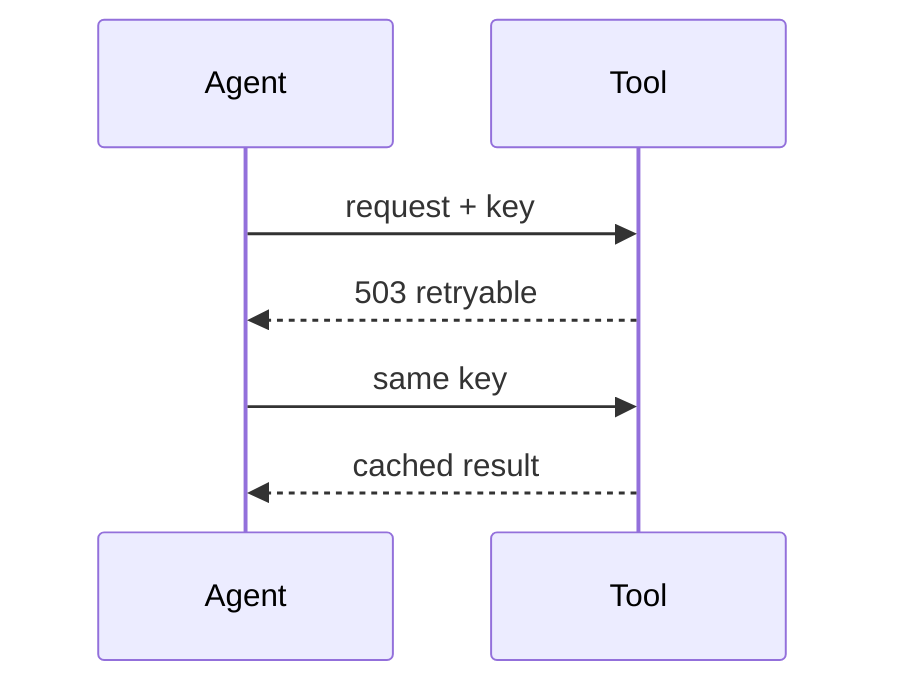
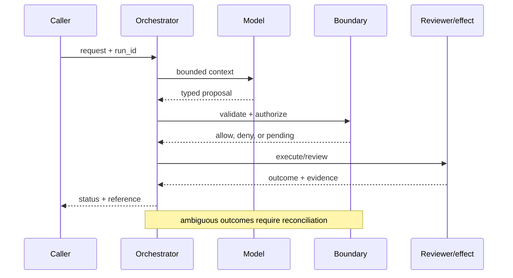

# Tool reliability
Status: durable
Sources: [Google SRE — 2016](https://sre.google/sre-book/handling-overload/); [IETF RFC 9110 — HTTP semantics](https://www.rfc-editor.org/rfc/rfc9110); [OpenAI Frontier, published February 5, 2026](https://openai.com/index/introducing-openai-frontier/)
## In one sentence
Reliable tools expose typed errors, timeouts, idempotency, and bounded retries so an agent can recover predictably.
## Background: what existed before
Prototype tools returned free-form errors and retried requests indiscriminately.
## What changed and why now
Production agents amplify ordinary API failure; contracts must tell the runtime what is safe to retry.
## Impact on current processing and architecture
Normalize error classes, carry idempotency keys, enforce deadlines, and observe latency/error budgets.
## Real-world applications and constraints
Search and ticket APIs tolerate retries; payment capture may not. Vendor-specific semantics need adapters.
## Mental model
```mermaid
flowchart LR
 C[Call]-->D[Deadline]-->T[Typed result]-->I[Idempotency]-->R[Retry policy]
 classDef a fill:#dbeafe,stroke:#2563eb,color:#111827; classDef b fill:#dcfce7,stroke:#16a34a,color:#111827; class C,D a; class T,I,R b
```

## What changed this month
Tool reliability is treated as a model-processing dependency, not a prompt concern.
## Engineering consequence
Document retry safety per operation and return machine-readable errors.
## Limits and failure modes
Timeouts do not guarantee remote cancellation; duplicate effects can occur; retries worsen overload.

## SDE2 primer and prerequisites

This lesson treats **tool reliability** as a concrete engineering discipline, not a synonym for model intelligence. Its key artifact is tool reliability evidence and state: the service must preserve it across tool reliability and expose enough evidence for an operator to decide what happened. A model may suggest a next step, but deterministic interfaces, ownership, and versioned records decide whether that suggestion is usable. The useful prerequisite is familiarity with HTTP, JSON, persistence, queues, retries, authentication, and service-level objectives; the topic adds its own state and failure vocabulary.

The useful boundary for tool reliability is **deadline, typed error, idempotency key, retry class, circuit breaker, reconciliation, and unknown commit**. These are not magic model capabilities. They are interfaces, records, checks, and operating procedures that can be unit-tested. Start with a low-blast-radius workflow and make every external effect attributable to a run ID, actor, policy version, and evidence reference.

## February source reading: fact before inference

For tool reliability, read the February source through its own claim boundary. The cited February event is **OpenAI Frontier, published February 5, 2026**. Frontier says agents need a dependable execution environment for files, code, and tools. That is the February source fact. HTTP semantics and SRE practices explain how to construct dependable tool contracts; they are not evidence that a particular agent platform has exactly-once execution. The report or announcement is evidence about what its publisher described. It is not independent validation of the publisher's claims, and it does not specify your data, threat model, latency budget, or regulatory obligations. That distinction matters because a source can motivate a concept without proving that the concept is solved.

For tool reliability, the engineering inference is narrower: turn the cited capability into an operational contract with topic-specific inputs, states, evidence, and failure ownership. Test that contract against ordinary, adversarial, stale, and interrupted work. A source can motivate this design; it cannot guarantee the resulting reliability or safety.

## Historical baseline and problem boundary

The useful tool baseline is a direct API call with a success response. That path hides malformed payloads, provider-specific limits, ambiguous timeouts, and duplicate effects. A reliability layer normalizes contracts, records receipts, budgets retries, and reconciles the cases where transport status differs from business state.

For **tool reliability**, the tool reliability boundary names tool reliability evidence, the actor, the mutable state, and the rejecting component. Treat read evidence, model proposals, and committed effects as different data classes. A request can influence a proposal but cannot grant authority. Test this boundary with stale, malformed, replayed, and partially completed cases.

## Architecture and data flow

The tool reliability path starts with its own tool reliability evidence admission check, then records topic state, invokes only the needed processor, and finishes at a tool reliability outcome gate for **tool reliability**. Keep policy and configuration revisions beside the work, while generated text remains separate from authorization. Measure the bottleneck that belongs to tool reliability, not a generic agent score.

```mermaid
flowchart LR
  A[Caller] --> I[Identity and tenant]
  I --> C[Context/evidence]
  C --> M[Model proposal]
  M --> B[Deadline boundary]
  B --> X[Effect or review]
  X --> L[(Evidence log)]
  classDef data fill:#dbeafe,stroke:#2563eb,color:#172554; classDef control fill:#dcfce7,stroke:#15803d,color:#14532d; classDef risk fill:#fee2e2,stroke:#dc2626,color:#450a0a
  class A,C,X,L data; class I,B control; class M risk
```

Keep model intent, validated arguments, provider request, transport result, normalized result, and receipt separate. Tool output is external data, not a new instruction or permission. Bind execution ID, idempotency key, provider contract, tenant, and deadline to the call while redacting credentials and unnecessary payloads.

For tool reliability, record a run identifier, actor, purpose, deadline, typed error, idempotency key, retry class, circuit breaker, reconciliation, and unknown commit, policy and model versions, evidence references, decision, attempts, timestamps, and final state. Add the topic's durable artifact—such as a checkpoint, capability, proof status, privacy budget, or provenance chain—rather than assuming a generic transcript can explain the outcome. Keep raw content behind controlled references and retention rules.

## Processing walkthrough and state

Tool state should distinguish proposed, validated, sent, acknowledged, unknown, reconciled, failed, and compensated. Persist the execution record before the provider call and query the receipt after timeout. A missing response is transport uncertainty, not proof of no effect.



On retry, reuse the tool reliability idempotency key or durable artifact; never ask the model to invent a second action when the first attempt has an unknown outcome.

## Topic mechanics: Tool reliability

### Decision model and topic-specific data contract

Define tool reliability per operation, not per vendor. A ticket search can usually retry a timed-out GET, while payment capture needs an idempotency key and reconciliation after an unknown result. Normalize HTTP and domain errors into classes such as validation, authentication, not-found, conflict, rate-limit, transient, and unknown-commit. Carry a deadline across model, gateway, and downstream calls; a client timeout alone does not stop the remote work. Use exponential backoff with jitter and a circuit breaker when repeated failures indicate overload. On recovery, query the source of truth by request key before issuing a write again. Record attempt number, server receipt, and response classification. For a service agent, distinguish “ticket update rejected because version is stale” from “gateway timed out after the server may have committed.” The model should receive a compact structured error and a safe next action, not a raw stack trace that can leak credentials. Load-test retry amplification and prove that two workers with the same key produce one effect. Frontier's dependable-execution language motivates this contract; RFC 9110 and SRE explain transport semantics, not agent correctness.

Ask what **tool reliability** can establish at each transition. The request establishes intent only; the tool reliability evidence and state stage establishes a bounded representation; the next checker, owner, or reconciliation step establishes whether the proposed result is acceptable. A timeout, missing dependency, or ambiguous response therefore becomes an explicit status for **tool reliability**, not an implicit success. Persist the relevant versions and evidence references, and retain unknown, deferred, or needs-review states when the system cannot prove the stronger claim.

Tool reliability depends on versioned request schemas, adapter behavior, provider contract, timeout policy, and receipt format. Put those identifiers on each execution record so a timeout or malformed response can be replayed against the same contract rather than guessed at after an upgrade.

Tool adapters need per-provider concurrency, retry, payload, and deadline budgets. Stop retries when a receipt is ambiguous or the provider's quota is exhausted, and return `provider_rejected`, `transport_unknown`, and `adapter_invalid` separately. Those states drive different recovery playbooks.

Break tool reliability metrics down by task slice, actor or tenant, version, dependency, and outcome class so a healthy average cannot hide a dangerous subgroup.


## Tool reliability: focused design workshop

In tool reliability, keep request prose, retrieved evidence, generated proposals, and the lesson artifact in separate typed fields. tool reliability code owns completeness, freshness, authorization, and promotion of a result; prose only explains intent.

For tool reliability, the event trail must let an operator distinguish bad input, missing topic evidence, stale state, dependency failure, and a confirmed outcome. Record the tool reliability artifact and the decision that moved it between states.

Test adapter races. A provider contract may change between request creation and retry, or a timeout may hide a committed side effect. Pin the request schema and reconcile the provider receipt before repeating work. Preserve `transport_unknown` and `provider_partial` rather than returning a fabricated success to the model.

For tool reliability, slice tool reliability evidence metrics by task class, actor or tenant, governing revision, dependency, and final state. Report the topic invariant, useful completion, latency, cost, and recovery burden together; averages are insufficient when a rare tool reliability failure carries the largest consequence.

Save a failing tool reliability input as a regression fixture only after redaction, classification, and capture of the governing version.


## Applications and operational constraints

Start tool reliability in observation or draft mode, compare against a deterministic or human baseline, then expand only a narrow cohort and reversible effect class.

Beyond **tool reliability**, tool reliability applies to workflows where tool reliability evidence matters. Choose an application with a named owner and bounded effects, then document its data residency, access, quota, staffing, latency, and rollback constraints. The right metric differs by deployment; do not import a support or research target without checking the actual user outcome.

Plan tool capacity around provider quotas, connection pools, retry workers, receipt reconciliation, and result normalization. If a provider is slow, disable optional calls or return a pending status; do not stack retries until the queue becomes an outage. Label cached or partial results as such.

## Failure modes, security, and limits

Tool reliability fails at the transport/effect boundary: a timeout can hide a commit, a provider can return malformed data, or a retry can duplicate an operation. Normalize responses, persist an execution ID before calling out, and reconcile receipts. Track unknown outcomes and provider-specific errors rather than counting every retry as model failure.

Tool metrics can improve by retrying less, returning cached errors, or counting provider acceptance as business success. Report receipt-confirmed completion, unknown outcomes, duplicate suppression, and downstream correction separately. A low error rate is meaningless if the adapter stops surfacing ambiguous effects.

For tool reliability, the February source has a bounded claim. The February source also has scope limits. Frontier says agents need a dependable execution environment for files, code, and tools. That is the February source fact. HTTP semantics and SRE practices explain how to construct dependable tool contracts; they are not evidence that a particular agent platform has exactly-once execution. Nothing in that observation proves robustness against your adversaries, correctness on your domain, or a particular service-level target. Treat vendor examples as source facts and label recommendations as inference. When evidence is weak, abstention and escalation are valid outcomes.

## Evaluation and change management

Build tool fixtures for valid input, schema drift, rate limit, malformed response, timeout after commit, provider outage, and duplicate retry. Assert bounded output, receipt reconciliation, and no duplicate effect. Run adapters against a deterministic fake and retain redacted provider evidence for diagnosis.

Promote an adapter only when receipt-confirmed completion, timeout reconciliation, duplicate suppression, latency, and provider-error floors hold. Canary read-only operations first, retain a disable or queue mode, and reconcile unknown executions before changing retry behavior. Keep provider-contract versions with every affected call.

## February primary-source evidence

The source fact is bounded: **Frontier says agents need a dependable execution environment for files, code, and tools. That is the February source fact. HTTP semantics and SRE practices explain how to construct dependable tool contracts; they are not evidence that a particular agent platform has exactly-once execution.** The February publication date and the publisher's wording should be cited when teaching the event. The recommendation that teams implement deadline, typed error, idempotency key, retry class, circuit breaker, reconciliation, and unknown commit is an inference from the event plus established systems practice. It should be validated with local fixtures, security review, operational metrics, and domain experts. The source does not independently verify the examples, and this article does not present them as guarantees.

## Mini exercise extension

Create six fixtures for **tool reliability** using the tool reliability vocabulary: a tool reliability evidence omission, a stale or contradictory tool reliability evidence record, an adversarial input, a boundary rejection, a dependency interruption, and a verified completion. Assert different states for each case; do not use one generic success label. Store the evidence reference and recovery owner beside every assertion, then alter the governing version and prove that prior tool reliability records remain historical.

## Build it locally: numbered implementation

1. Construct a tool reliability test record with actor, request, tool reliability evidence, decision, and outcome fields; reject a run that cannot identify the governing version.
2. Implement the tool reliability boundary as a pure function. It must inspect tool reliability evidence, return a typed state, and refuse an unrecognized or incomplete transition.
3. Create a deterministic tool reliability generator with a valid proposal, a malformed proposal, and an input that attempts to redirect the topic-specific decision.
4. Simulate the tool reliability dependency failing after admission. Use its own correlation or artifact key to detect duplicate delivery and reconcile uncertainty.
5. Write an event stream containing tool reliability states, redacting sensitive payloads while retaining the evidence pointers needed for an offline replay.
6. Measure tool reliability correctness alongside rejection rate, time in each state, recovery work, and resource cost; report slices relevant to the lesson.
7. Change the tool reliability schema or policy revision and verify that old events still resolve under their original contract rather than being reinterpreted.

## Runnable low-cost example

```python
def classify(status, committed=False):
    if status == 503: return "retryable"
    if status == "timeout" and committed: return "unknown_commit"
    if status == "timeout": return "retryable"
    return "permanent"
print(classify("timeout", True), classify(503))
```

This adapter sketch demonstrates normalized success and failure states only. It does not call a provider, make an external receipt durable, or resolve timeout ambiguity; add a fake provider and reconciliation tests before relying on it.

## Interview Q&A

**Q: Why is timeout a distinct result?** A: Expose a typed tool reliability unavailable state, stop unsafe transitions, and reconcile the external dependency before retrying.

**Q: Why separate an adapter from a provider?** A: Enforce the tool reliability rule in deterministic code at the resource or artifact boundary; model output may propose, but it cannot authorize or prove the result.

**Q: Which metric would you put on the dashboard first?** A: Track tool reliability evidence, plus false acceptance or rejection, time spent, resource cost, and recovery; slice results by the tool reliability risk classes.

**Q: When should a retry stop?** A: Enforce the tool reliability rule in deterministic code at the resource or artifact boundary; model output may propose, but it cannot authorize or prove the result.

**Q: How should tool reliability be released?** A: Pin tool reliability evidence and the governing versions, begin with shadow or reversible work, and require the tool reliability invariant before widening effects.

## Glossary

- **Deadline**: the topic-specific control boundary that mediates a model proposal and an outcome.
- **Run ID**: the correlation key that joins one tool reliability attempt to its actor, tool reliability evidence, decisions, and recovery evidence.
- **Idempotency**: the tool reliability guarantee that a retry does not create a second logical result or duplicate effect.
- **Provenance**: origin, version, and transformation evidence attached to a tool reliability input or artifact.
- **SLO**: an explicit tool reliability service target, such as freshness, verification latency, queue age, or availability.
- **Abstention**: the tool reliability state used when evidence, authority, or dependency health is insufficient for a stronger claim.
- **Inference**: an engineering recommendation about tool reliability derived from source facts rather than presented as a source guarantee.

## References

- [OpenAI Frontier — February 5, 2026](https://openai.com/index/introducing-openai-frontier/)
- [IETF RFC 9110](https://www.rfc-editor.org/rfc/rfc9110)
- [Google SRE: handling overload](https://sre.google/sre-book/handling-overload/)

## Claim ledger

| Claim | Source | Fact or inference |
|---|---|---|
| The cited publisher published the February event on the stated date. | [OpenAI Frontier, published February 5, 2026](https://openai.com/index/introducing-openai-frontier/) | Fact |
| Frontier says agents need a dependable execution environment for files, code, and tools. | [OpenAI Frontier, published February 5, 2026](https://openai.com/index/introducing-openai-frontier/) | Fact |
| Turning unreliable network calls into explicit contracts that an orchestrator can recover from. | Engineering design synthesis | Inference |
| A separately enforced boundary is safer and easier to operate than treating model text as authority. | Topic standards and systems reasoning | Inference |
| The local example demonstrates the concept but does not prove production security, reliability, or generalization. | This lesson | Fact about the example |
