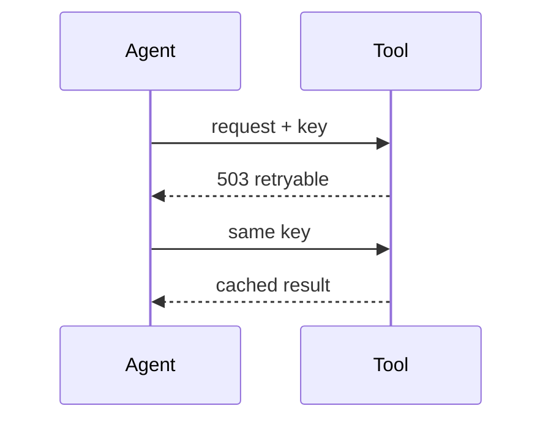
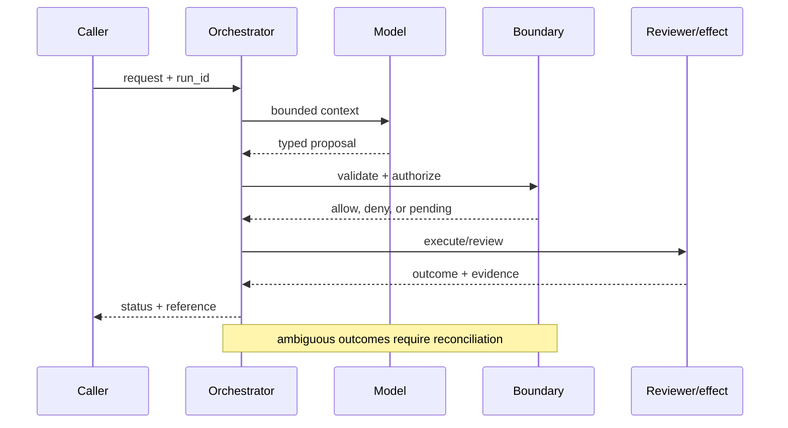

# Tool reliability
Status: durable
Sources: [Google SRE — 2016](https://sre.google/sre-book/handling-overload/); [IETF RFC 9110 — HTTP semantics](https://www.rfc-editor.org/rfc/rfc9110); [OpenAI Frontier, published February 5, 2026](https://openai.com/index/introducing-openai-frontier/)
## In one sentence
Reliable tools expose typed errors, timeouts, idempotency, and bounded retries so an agent can recover predictably.
## Background: what existed before
Prototype tools returned free-form errors and retried requests indiscriminately.
## What changed and why now
Production agents amplify ordinary API failure; contracts must tell the runtime what is safe to retry.
## Impact on current processing and architecture
Normalize error classes, carry idempotency keys, enforce deadlines, and observe latency/error budgets.
## Real-world applications and constraints
Search and ticket APIs tolerate retries; payment capture may not. Vendor-specific semantics need adapters.
## Mental model
```mermaid
flowchart LR
 C[Call]-->D[Deadline]-->T[Typed result]-->I[Idempotency]-->R[Retry policy]
 classDef a fill:#dbeafe,stroke:#2563eb,color:#111827; classDef b fill:#dcfce7,stroke:#16a34a,color:#111827; class C,D a; class T,I,R b
```

## What changed this month
Tool reliability is treated as a model-processing dependency, not a prompt concern.
## Engineering consequence
Document retry safety per operation and return machine-readable errors.
## Limits and failure modes
Timeouts do not guarantee remote cancellation; duplicate effects can occur; retries worsen overload.

## SDE2 primer and prerequisites

This lesson treats **tool reliability** as a concrete engineering discipline, not a synonym for model intelligence. Its key artifact is a typed execution record: the service must preserve request, deadline, attempt, receipt, and uncertainty across retries. A model may suggest a next step, but deterministic interfaces, ownership, and versioned records decide whether that suggestion is usable. The useful prerequisite is familiarity with HTTP, JSON, persistence, queues, retries, authentication, and service-level objectives; the topic adds its own state and failure vocabulary.

The useful boundary for tool reliability is **deadline, typed error, idempotency key, retry class, circuit breaker, reconciliation, and unknown commit**. These are not magic model capabilities. They are interfaces, records, checks, and operating procedures that can be unit-tested. Start with a low-blast-radius workflow and make every external effect attributable to a run ID, actor, policy version, and evidence reference.

## February source reading: fact before inference

For tool reliability, read the February source through its own claim boundary. The cited February event is **OpenAI Frontier, published February 5, 2026**. Frontier says agents need a dependable execution environment for files, code, and tools. That is the February source fact. HTTP semantics and SRE practices explain how to construct dependable tool contracts; they are not evidence that a particular agent platform has exactly-once execution. The report or announcement is evidence about what its publisher described. It is not independent validation of the publisher's claims, and it does not specify your data, threat model, latency budget, or regulatory obligations. That distinction matters because a source can motivate a concept without proving that the concept is solved.

For tool reliability, the engineering inference is narrower: turn the cited capability into an operational contract with topic-specific inputs, states, evidence, and failure ownership. Test that contract against ordinary, adversarial, stale, and interrupted work. A source can motivate this design; it cannot guarantee the resulting reliability or safety.

## Historical baseline and problem boundary

The useful tool baseline is a direct API call with a success response. That path hides malformed payloads, provider-specific limits, ambiguous timeouts, and duplicate effects. A reliability layer normalizes contracts, records receipts, budgets retries, and reconciles the cases where transport status differs from business state.

For tool reliability, name the request, provider contract, actor, mutable state, receipt, and rejecting component. Treat provider output, model interpretation, and committed effects as different data classes. A response can influence a proposal but cannot prove an external effect unless the effect owner provides evidence. Test this boundary with stale, malformed, replayed, and partially completed cases.

## Architecture and data flow

The path starts with schema and authorization admission, persists an execution ID and deadline, invokes the provider through a versioned adapter, and finishes at a normalized result or reconciliation state. Keep policy and configuration revisions beside the work, while generated text remains separate from provider evidence. Measure receipt-confirmed completion, unknown outcomes, retry amplification, and adapter latency rather than relying on a generic agent score.

```mermaid
flowchart LR
  A[Caller] --> I[Identity and tenant]
  I --> C[Context/evidence]
  C --> M[Model proposal]
  M --> B[Deadline boundary]
  B --> X[Effect or review]
  X --> L[(Evidence log)]
  classDef data fill:#dbeafe,stroke:#2563eb,color:#172554; classDef control fill:#dcfce7,stroke:#15803d,color:#14532d; classDef risk fill:#fee2e2,stroke:#dc2626,color:#450a0a
  class A,C,X,L data; class I,B control; class M risk
```

Keep model intent, validated arguments, provider request, transport result, normalized result, and receipt separate. Tool output is external data, not a new instruction or permission. Bind execution ID, idempotency key, provider contract, tenant, and deadline to the call while redacting credentials and unnecessary payloads.

Record a run identifier, actor, purpose, deadline, typed error, idempotency key, retry class, circuit-breaker state, reconciliation status, unknown-commit flag, policy and model versions, evidence references, attempts, timestamps, and final state. Add the durable artifact that permits recovery: provider request ID, receipt, normalized response, and adapter version. A generic transcript cannot explain whether a timeout happened before or after a remote write. Keep raw content behind controlled references and retention rules.

## Processing walkthrough and state

Tool state should distinguish proposed, validated, sent, acknowledged, unknown, reconciled, failed, and compensated. Persist the execution record before the provider call and query the receipt after timeout. A missing response is transport uncertainty, not proof of no effect.



On retry, reuse the provider idempotency key or durable artifact; never ask the model to invent a second action when the first attempt has an unknown outcome.

## Topic mechanics: Tool reliability

### Decision model and topic-specific data contract

Define tool reliability per operation, not per vendor. A ticket search can usually retry a timed-out GET, while payment capture needs an idempotency key and reconciliation after an unknown result. Normalize HTTP and domain errors into classes such as validation, authentication, not-found, conflict, rate-limit, transient, and unknown-commit. Carry a deadline across model, gateway, and downstream calls; a client timeout alone does not stop the remote work. Use exponential backoff with jitter and a circuit breaker when repeated failures indicate overload. On recovery, query the source of truth by request key before issuing a write again. Record attempt number, server receipt, and response classification. For a service agent, distinguish “ticket update rejected because version is stale” from “gateway timed out after the server may have committed.” The model should receive a compact structured error and a safe next action, not a raw stack trace that can leak credentials. Load-test retry amplification and prove that two workers with the same key produce one effect. Frontier's dependable-execution language motivates this contract; RFC 9110 and SRE explain transport semantics, not agent correctness.

Ask what each transition can establish. The request establishes intent; validation establishes a safe provider request; transport establishes only delivery information; and the effect owner or receipt query establishes business outcome. A timeout, missing dependency, or ambiguous response therefore becomes an explicit status, not an implicit success. Persist relevant versions and evidence references, and retain unknown, deferred, or needs-review states when the system cannot prove the stronger claim.

Tool reliability depends on versioned request schemas, adapter behavior, provider contract, timeout policy, and receipt format. Put those identifiers on each execution record so a timeout or malformed response can be replayed against the same contract rather than guessed at after an upgrade. Separate retryability from business success: HTTP 503 may be retryable, while HTTP 200 can still contain a rejected domain operation.

Tool adapters need per-provider concurrency, retry, payload, and deadline budgets. Stop retries when a receipt is ambiguous or the provider's quota is exhausted, and return `provider_rejected`, `transport_unknown`, and `adapter_invalid` separately. Those states drive different recovery playbooks.

Break tool metrics down by task slice, actor or tenant, adapter version, dependency, and outcome class so a healthy average cannot hide a dangerous subgroup. Include unknown commits and duplicate-suppression results in the main reliability view.


## Tool reliability: focused design workshop

Keep request prose, validated arguments, provider requests, transport results, normalized results, receipts, and final outcomes in separate typed fields. Adapter code owns schema validation and error classification; reconciliation owns ambiguous effects; prose only explains intent.

The event trail must let an operator distinguish bad input, provider rejection, rate limiting, transport timeout, adapter failure, and confirmed outcome. Record the execution artifact and the decision that moved it between states. Do not log credentials or full payloads simply because a provider returned an error.

Test adapter races. A provider contract may change between request creation and retry, or a timeout may hide a committed side effect. Pin the request schema and reconcile the provider receipt before repeating work. Preserve `transport_unknown` and `provider_partial` rather than returning a fabricated success to the model.

Slice tool metrics by task class, actor or tenant, governing revision, dependency, and final state. Report receipt-confirmed completion, unknown outcomes, latency, cost, retry work, and recovery burden together; averages are insufficient when a rare duplicate effect carries the largest consequence.

Save a failing tool input as a regression fixture only after redaction, classification, and capture of the governing version. Include schema drift, rate limit, malformed response, timeout after commit, provider outage, and duplicate retry.


## Applications and operational constraints

Start tool reliability in observation or draft mode, compare against a deterministic or human baseline, then expand only a narrow cohort and reversible effect class.

This pattern applies to search, ticket updates, inventory reads, deployments, and payments. Choose an application with a named owner and bounded effects, then document data residency, access, quota, staffing, latency, and rollback constraints. A search read may safely retry; payment capture needs an idempotency key and a receipt lookup after timeout. A ticket update may require an expected version to avoid overwriting a human edit. The right metric differs by deployment; do not import a support or research target without checking the actual user outcome.

Plan tool capacity around provider quotas, connection pools, retry workers, receipt reconciliation, and result normalization. If a provider is slow, disable optional calls or return a pending status; do not stack retries until the queue becomes an outage. Label cached or partial results as such.

## Failure modes, security, and limits

Tool reliability fails at the transport/effect boundary: a timeout can hide a commit, a provider can return malformed data, or a retry can duplicate an operation. Normalize responses, persist an execution ID before calling out, and reconcile receipts. Track unknown outcomes and provider-specific errors rather than counting every retry as model failure.

Tool metrics can improve by retrying less, returning cached errors, or counting provider acceptance as business success. Report receipt-confirmed completion, unknown outcomes, duplicate suppression, and downstream correction separately. A low error rate is meaningless if the adapter stops surfacing ambiguous effects.

The February source has a bounded claim and scope limits. Frontier says agents need a dependable execution environment for files, code, and tools. That is a product statement, not evidence that any platform provides exactly-once execution. HTTP semantics and SRE practices explain transport and overload behavior; adapters, receipts, and reconciliation are engineering recommendations. Nothing in the source proves robustness against your adversaries, correctness on your domain, or a particular service-level target. Treat vendor examples as source facts and label recommendations as inference. When evidence is weak, expose an unknown result and escalate.

## Evaluation and change management

Build tool fixtures for valid input, schema drift, rate limit, malformed response, timeout after commit, provider outage, and duplicate retry. Assert bounded output, receipt reconciliation, and no duplicate effect. Run adapters against a deterministic fake and retain redacted provider evidence for diagnosis.

Promote an adapter only when receipt-confirmed completion, timeout reconciliation, duplicate suppression, latency, and provider-error floors hold. Canary read-only operations first, retain a disable or queue mode, and reconcile unknown executions before changing retry behavior. Keep provider-contract versions with every affected call.

## February primary-source evidence

The source fact is bounded: **Frontier says agents need a dependable execution environment for files, code, and tools. That is the February source fact. HTTP semantics and SRE practices explain how to construct dependable tool contracts; they are not evidence that a particular agent platform has exactly-once execution.** The February publication date and the publisher's wording should be cited when teaching the event. The recommendation that teams implement deadline, typed error, idempotency key, retry class, circuit breaker, reconciliation, and unknown commit is an inference from the event plus established systems practice. It should be validated with local fixtures, security review, operational metrics, and domain experts. The source does not independently verify the examples, and this article does not present them as guarantees.

## Mini exercise extension

Create six fixtures: malformed arguments, stale provider schema, rate limiting, malformed response, timeout after commit, and verified completion. Assert different states for each case; do not use one generic success label. Store the receipt reference and recovery owner beside every assertion, then alter the governing version and prove that prior execution records remain historical.

## Build it locally: numbered implementation

1. Construct an execution record with actor, request, adapter version, idempotency key, decision, and outcome fields.
2. Implement a classifier that rejects unknown statuses and distinguishes validation, retryable, permanent, and unknown-commit results.
3. Create deterministic provider responses for success, rate limit, malformed JSON, timeout, and domain rejection.
4. Simulate a timeout after a remote commit. Query a fake receipt store before allowing another write.
5. Write an event stream containing execution states, redacting credentials while retaining references needed for replay.
6. Measure receipt-confirmed completion, duplicate suppression, unknown outcomes, recovery work, and resource cost by operation.
7. Change the adapter schema and verify that old execution records still resolve under their original contract.

## Runnable low-cost example

```python
def classify(status, committed=False):
    if status == 503: return "retryable"
    if status == "timeout" and committed: return "unknown_commit"
    if status == "timeout": return "retryable"
    return "permanent"
print(classify("timeout", True), classify(503))
```

This adapter sketch demonstrates normalized success and failure states only. It does not call a provider, make an external receipt durable, or resolve timeout ambiguity; add a fake provider and reconciliation tests before relying on it.

## Interview Q&A

**Q: Why is timeout a distinct result?** A: The client may stop waiting while the provider continues or commits. Mark the outcome unknown and reconcile with a provider receipt before retrying a non-idempotent operation.

**Q: Why separate an adapter from a provider?** A: The adapter gives the orchestrator one stable schema for provider-specific status codes, deadlines, and receipts. It also localizes contract drift and redaction rules.

**Q: Which metric would you put on the dashboard first?** A: Track receipt-confirmed useful completion and unknown-commit age, paired with duplicate effects, provider errors, latency, and recovery work.

**Q: When should a retry stop?** A: Stop on a permanent error, exhausted deadline or budget, ambiguous non-idempotent effect, provider overload, or a circuit breaker. Reconcile before retrying a write.

**Q: How should tool reliability be released?** A: Pin adapter and provider-contract versions, canary read-only operations, inject malformed and timeout responses, and require receipt reconciliation and bounded-retry floors before widening effects.

## Glossary

- **Deadline**: the topic-specific control boundary that mediates a model proposal and an outcome.
- **Run ID**: the correlation key that joins one tool reliability attempt to its actor, tool reliability evidence, decisions, and recovery evidence.
- **Idempotency**: the tool reliability guarantee that a retry does not create a second logical result or duplicate effect.
- **Provenance**: origin, version, and transformation evidence attached to a tool reliability input or artifact.
- **SLO**: an explicit tool reliability service target, such as freshness, verification latency, queue age, or availability.
- **Abstention**: the tool reliability state used when evidence, authority, or dependency health is insufficient for a stronger claim.
- **Inference**: an engineering recommendation about tool reliability derived from source facts rather than presented as a source guarantee.

## References

- [OpenAI Frontier — February 5, 2026](https://openai.com/index/introducing-openai-frontier/)
- [IETF RFC 9110](https://www.rfc-editor.org/rfc/rfc9110)
- [Google SRE: handling overload](https://sre.google/sre-book/handling-overload/)

## Claim ledger

| Claim | Source | Fact or inference |
|---|---|---|
| The cited publisher published the February event on the stated date. | [OpenAI Frontier, published February 5, 2026](https://openai.com/index/introducing-openai-frontier/) | Fact |
| Frontier says agents need a dependable execution environment for files, code, and tools. | [OpenAI Frontier, published February 5, 2026](https://openai.com/index/introducing-openai-frontier/) | Fact |
| Turning unreliable network calls into explicit contracts that an orchestrator can recover from. | Engineering design synthesis | Inference |
| A separately enforced boundary is safer and easier to operate than treating model text as authority. | Topic standards and systems reasoning | Inference |
| The local example demonstrates the concept but does not prove production security, reliability, or generalization. | This lesson | Fact about the example |
