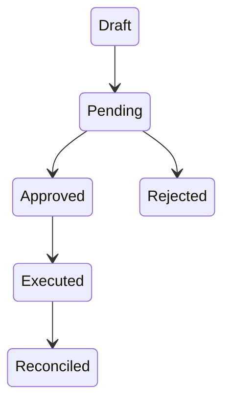
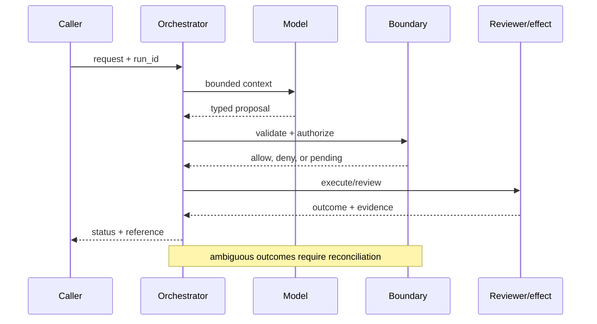

# Approval workflows
Status: durable
Sources: [NIST AI RMF](https://www.nist.gov/itl/ai-risk-management-framework); [OpenAI — 2026-02-05](https://openai.com/index/introducing-openai-frontier/)
## In one sentence
Approval workflows pause consequential actions until an accountable human reviews evidence and scope.
## Background: what existed before
Automation often optimized completion and treated review as an informal afterthought.
## What changed and why now
Agent plans can cross irreversible boundaries, so review becomes a state transition with auditability.
## Impact on current processing and architecture
Separate propose, review, approve, execute, and reconcile states; show diffs rather than raw prompts.
## Real-world applications and constraints
Use for refunds and production changes. Reviewer fatigue, latency, and rubber-stamping limit effectiveness.
## Mental model
```mermaid
flowchart LR
 P[Propose]-->H[Human review]-->A[Approve]-->E[Execute]-->R[Reconcile]
 classDef a fill:#dbeafe,stroke:#2563eb,color:#111827; classDef b fill:#fef3c7,stroke:#d97706,color:#111827; class P,E,R a; class H,A b
```

## What changed this month
February positions approval as a control-plane primitive for agents.
## Engineering consequence
Make approvals scoped, expiring, attributable, and bound to an immutable action hash.
## Limits and failure modes
A reviewer can approve incomplete evidence; stale approvals and UI spoofing remain risks.

## SDE2 primer and prerequisites

This lesson treats **approval workflows** as a concrete engineering discipline, not a synonym for model intelligence. Its key artifact is an attributable decision packet: the service must preserve the exact proposal, evidence, reviewer, scope, expiry, and execution result. A model may suggest a next step, but deterministic interfaces, ownership, and versioned records decide whether that suggestion is usable. The useful prerequisite is familiarity with HTTP, JSON, persistence, queues, retries, authentication, and service-level objectives; the topic adds its own state and failure vocabulary.

The useful boundary for approval workflows is **approval intent, reviewer assignment, separation of duties, expiry, evidence packet, and escalation**. These are not magic model capabilities. They are interfaces, records, checks, and operating procedures that can be unit-tested. Start with a low-blast-radius workflow and make every external effect attributable to a run ID, actor, policy version, and evidence reference.

## February source reading: fact before inference

For approval workflows, read the February source through its own claim boundary. The cited February event is **OpenAI Frontier, published February 5, 2026**. Frontier says AI coworkers should have clear permissions and boundaries and should improve quality through feedback. Those statements support an approval boundary as an engineering interpretation. NIST risk-management practice supplies the governance vocabulary; neither source says that a human click automatically makes an action safe. The report or announcement is evidence about what its publisher described. It is not independent validation of the publisher's claims, and it does not specify your data, threat model, latency budget, or regulatory obligations. That distinction matters because a source can motivate a concept without proving that the concept is solved.

For approval workflows, the engineering inference is narrower: turn the cited capability into an operational contract with topic-specific inputs, states, evidence, and failure ownership. Test that contract against ordinary, adversarial, stale, and interrupted work. A source can motivate this design; it cannot guarantee the resulting reliability or safety.

## Historical baseline and problem boundary

The useful approval baseline is a person clicking approve on a summarized request. That is unsafe when the evidence is stale, the proposal changes, or the click is detached from the exact effect. A workflow binds actor, evidence, proposal digest, expiry, and execution gate into one accountable decision.

For approval workflows, name the proposal, evidence snapshot, approver, mutable state, expiry, and rejecting component. Treat evidence, model proposals, reviewer decisions, and committed effects as different data classes. A request can influence a proposal but cannot grant authority. Test this boundary with stale, malformed, replayed, and partially completed cases.

## Architecture and data flow

The path starts with evidence and risk admission, persists an immutable proposal digest, assigns an eligible reviewer, and finishes at an execution gate that rechecks scope and expiry. Keep policy and configuration revisions beside the work, while generated text remains separate from authorization. Measure evidence completeness, safe deferral, reviewer latency, overturns, and post-action incidents rather than relying on a generic agent score.

```mermaid
flowchart LR
  A[Caller] --> I[Identity and tenant]
  I --> C[Context/evidence]
  C --> M[Model proposal]
  M --> B[Approval Intent boundary]
  B --> X[Effect or review]
  X --> L[(Evidence log)]
  classDef data fill:#dbeafe,stroke:#2563eb,color:#172554; classDef control fill:#dcfce7,stroke:#15803d,color:#14532d; classDef risk fill:#fee2e2,stroke:#dc2626,color:#450a0a
  class A,C,X,L data; class I,B control; class M risk
```

Keep proposal, evidence packet, approver identity, approval token, policy decision, and executed effect separate. A summary can guide a reviewer but cannot replace the exact fields being approved. Bind proposal digest, resource, actor, expiry, and policy revision to the approval record and minimize sensitive comments in logs.

Record a run identifier, actor, purpose, approval intent, reviewer assignment, separation of duties, expiry, evidence packet, escalation, policy and model versions, proposal digest, decision, attempts, timestamps, and final state. Add the durable artifact that permits reconstruction: reviewed resource version, approval token, reviewer reason, and execution receipt. A generic transcript cannot explain what a person actually approved. Keep raw content behind controlled references and retention rules.

## Processing walkthrough and state

Approval state should distinguish drafted, evidence_pending, assigned, approved, rejected, expired, appealed, and executed. Recheck the digest and authority at execution. A reviewer click for an old proposal must not authorize a changed amount, resource, or tool call.



On retry, reuse the approval decision's idempotency key or durable artifact; never ask the model to invent a second action when the first attempt has an unknown outcome.

## Topic mechanics: Approval workflows

### Decision model and topic-specific data contract

An approval is a state transition with identity and evidence. Create an approval intent containing the proposed action, exact arguments, affected resources, risk classification, evidence links, policy version, expiry, and required reviewer role. The reviewer should see a stable snapshot or a version conflict, not a live amount that can change after clicking. Separation of duties prevents the proposer or an automated worker from approving its own high-risk action. Expire approvals when context, price, permission, or risk changes. If two reviewers are required, store both decisions and the quorum rule. Execute only after a final authorization check and bind the effect ID to the approval ID. For vendor payments, display amount, currency, vendor, invoice evidence, and rollback options; an opaque “approve agent plan” button is not meaningful consent. Test replayed approvals, approval phishing, stale evidence, reviewer unavailability, and a race where a user revokes access while a job is queued. Measure disagreement and overturns, not just time-to-click. Frontier's boundaries and feedback framing support the idea of governed work; NIST provides risk-management language, while the workflow mechanics are this lesson's inference.

Ask what each approval transition can establish. The request establishes intent; the evidence packet establishes what was shown; the reviewer establishes a decision within a role; and the execution gate establishes whether the exact reviewed effect was committed. A timeout, missing dependency, or ambiguous response therefore becomes an explicit status, not an implicit success. Persist relevant versions and evidence references, and retain unknown, deferred, or needs-review states when the system cannot prove the stronger claim.

Approval workflows should version the proposal schema, approver matrix, evidence requirements, expiry interval, and escalation route. Bind those versions to the approval token; a policy update must invalidate or re-review affected proposals without erasing the original decision context. A reviewer who proposed an action should not approve a high-risk action when separation of duties requires independence.

Approval queues need limits on case age, evidence size, reassignment count, and approver workload. If a case cannot meet its expiry window, defer it before collecting more model output. Distinguish `awaiting_approver`, `evidence_incomplete`, and `approval_expired`; each needs a different human action.

Break approval metrics down by task slice, actor or tenant, version, dependency, risk class, and outcome so a healthy average cannot hide rubber-stamping or delayed high-risk cases.


## Approval workflows: focused design workshop

Keep request prose, evidence snapshots, generated proposals, reviewer decisions, and execution receipts in separate typed fields. Workflow code owns completeness, freshness, authorization, and promotion of a result; prose only explains intent. The reviewer UI should show the normalized action and diff, not require a person to infer the effect from a long model transcript.

The event trail must let an operator distinguish bad input, incomplete evidence, stale proposal, reviewer conflict, dependency failure, and confirmed outcome. Record the approval packet and the decision that moved it between states. Preserve the original digest even if a later revision is submitted.

Test approval races. An approver can lose authority after clicking approve, or the underlying amount and evidence can change before execution. Bind approval to proposal digest, actor, scope, and expiry, then recheck all four at the action gate. Preserve `approval_expired` and `proposal_changed`; neither means approved.

Slice approval metrics by task class, actor or tenant, governing revision, dependency, risk class, and final state. Report evidence completeness, useful completion, latency, cost, deferral, overturns, and recovery burden together; averages are insufficient when a rare unauthorized execution carries the largest consequence.

Save a failing approval input as a regression fixture only after redaction, classification, and capture of the governing version. Include missing evidence, conflicted reviewers, expiry, changed proposal, unavailable approver, and replayed approval.


## Applications and operational constraints

Start approval workflows in observation or draft mode, compare against a deterministic or human baseline, then expand only a narrow cohort and reversible effect class.

This pattern applies to refunds, production changes, vendor payments, access grants, and data deletion. Choose an application with a named owner and bounded effects, then document data residency, access, quota, staffing, latency, and rollback constraints. A production change should display the diff, tests, rollback, and blast radius; a refund should display amount, account, evidence, and duplicate-risk checks. The right metric differs by deployment; do not import a support or research target without checking the actual user outcome.

Plan approval capacity around approver coverage, evidence assembly, escalations, and appeal handling. A full queue should trigger safe deferral, not lower the review threshold. Tell the requester whether a proposal is awaiting a person, missing evidence, or expired rather than presenting a delayed case as approved.

## Failure modes, security, and limits

Approval failures include rubber-stamping, missing evidence, stale approvals, and queue starvation for high-risk cases. Show approvers the exact proposed effect and its evidence, bind approval to a digest and expiry, and reauthorize immediately before execution. Measure overturns and safe deferrals, not just approval percentage.

Approval metrics can improve by routing difficult cases away, shortening review, or treating every click as informed consent. Pair approval time with evidence completeness, overturns, appeals, and post-action incidents. A near-perfect approval rate may reveal rubber-stamping rather than excellent proposals.

The February source has a bounded claim and scope limits. Frontier says AI coworkers should have clear permissions and boundaries and should improve quality through feedback. That supports approval as an engineering interpretation, not proof that a human click makes an action safe. NIST risk-management practice supplies governance vocabulary; evidence quality, reviewer independence, stale-proposal checks, and execution reauthorization are local controls. Nothing in the source proves robustness against your adversaries, correctness on your domain, or a particular service-level target. Treat vendor examples as source facts and label recommendations as inference. When evidence is weak, defer or escalate.

## Evaluation and change management

Build approval fixtures for complete evidence, missing evidence, conflicted reviewers, expired tokens, changed proposals, unavailable approvers, and appeal. Assert that only the exact reviewed effect can execute. Run hidden adverse cases through the real queue and preserve a redacted decision packet for each failure.

Promote an approval policy only when evidence completeness, reviewer agreement, safe deferral, appeal handling, and post-action incident floors hold. Start with drafts, retain a hold switch that preserves queue evidence, and invalidate or re-review approvals affected by rollback.

## February primary-source evidence

The source fact is bounded: **Frontier says AI coworkers should have clear permissions and boundaries and should improve quality through feedback. Those statements support an approval boundary as an engineering interpretation. NIST risk-management practice supplies the governance vocabulary; neither source says that a human click automatically makes an action safe.** The February publication date and the publisher's wording should be cited when teaching the event. The recommendation that teams implement approval intent, reviewer assignment, separation of duties, expiry, evidence packet, and escalation is an inference from the event plus established systems practice. It should be validated with local fixtures, security review, operational metrics, and domain experts. The source does not independently verify the examples, and this article does not present them as guarantees.

## Mini exercise extension

Create six fixtures: incomplete evidence, reviewer conflict, expired approval, changed proposal digest, unavailable approver, and verified execution. Assert different states for each case; do not use one generic success label. Store the evidence reference and recovery owner beside every assertion, then alter the governing version and prove that prior approval records remain historical.

## Build it locally: numbered implementation

1. Construct an approval record with actor, proposal digest, evidence references, reviewer role, expiry, decision, and outcome fields.
2. Implement a pure transition function that rejects incomplete evidence, conflicted roles, expired approvals, and changed digests.
3. Create deterministic proposals for a valid refund, a missing invoice, and a changed amount after review.
4. Simulate the execution dependency failing after approval. Use an effect ID to reconcile before replaying.
5. Write an event stream containing approval states, redacting sensitive payloads while retaining references needed for audit.
6. Measure evidence completeness, safe deferral, reviewer latency, overturns, recovery work, and resource cost by risk class.
7. Change the policy revision and verify that old decisions remain historical while affected pending approvals are re-reviewed.

## Runnable low-cost example

```python
import hashlib
def approval(payload, reviewer, expected):
    digest = hashlib.sha256(payload.encode()).hexdigest()
    return reviewer == "finance-manager" and digest == expected
payload = "invoice:42:900"
h = hashlib.sha256(payload.encode()).hexdigest()
print(approval(payload, "finance-manager", h), approval("invoice:42:1200", "finance-manager", h))
```

This approval sketch checks an expiry and proposal digest in memory. It does not authenticate approvers, preserve evidence, or execute a transaction; add reassignment, appeal, and changed-proposal tests before production use.

## Interview Q&A

**Q: What should an approval bind?** A: The exact normalized action, resource version, evidence packet, reviewer identity and role, policy revision, expiry, and execution scope.

**Q: Why is an approval not a general consent flag?** A: Consent is meaningful only for the exact effect the person saw and had authority to approve. A changed proposal or stale resource needs a new decision.

**Q: Which metric would you put on the dashboard first?** A: Track evidence completeness and post-approval overturns, paired with safe deferral, reviewer latency, and incidents. Approval percentage alone can reward rubber-stamping.

**Q: When should a case defer?** A: Defer when evidence is incomplete, the approver is unavailable or conflicted, the proposal changed, the approval expired, or execution outcome is unknown.

**Q: How should approval workflows be released?** A: Pin proposal and policy versions, start with reversible effects, test stale and replayed approvals, and require exact-effect binding and safe-deferral floors before widening.

## Glossary

- **Approval Intent**: the topic-specific control boundary that mediates a model proposal and an outcome.
- **Run ID**: the correlation key that joins one approval workflows attempt to its actor, approval workflows evidence, decisions, and recovery evidence.
- **Idempotency**: the approval workflows guarantee that a retry does not create a second logical result or duplicate effect.
- **Provenance**: origin, version, and transformation evidence attached to a approval workflows input or artifact.
- **SLO**: an explicit approval workflows service target, such as freshness, verification latency, queue age, or availability.
- **Abstention**: the approval workflows state used when evidence, authority, or dependency health is insufficient for a stronger claim.
- **Inference**: an engineering recommendation about approval workflows derived from source facts rather than presented as a source guarantee.

## References

- [OpenAI Frontier — February 5, 2026](https://openai.com/index/introducing-openai-frontier/)
- [NIST AI Risk Management Framework](https://www.nist.gov/itl/ai-risk-management-framework)

## Claim ledger

| Claim | Source | Fact or inference |
|---|---|---|
| The cited publisher published the February event on the stated date. | [OpenAI Frontier, published February 5, 2026](https://openai.com/index/introducing-openai-frontier/) | Fact |
| Frontier says AI coworkers should have clear permissions and boundaries and should improve quality through feedback. | [OpenAI Frontier, published February 5, 2026](https://openai.com/index/introducing-openai-frontier/) | Fact |
| Making a human decision a durable, attributable state transition rather than a button in a chat ui. | Engineering design synthesis | Inference |
| A separately enforced boundary is safer and easier to operate than treating model text as authority. | Topic standards and systems reasoning | Inference |
| The local example demonstrates the concept but does not prove production security, reliability, or generalization. | This lesson | Fact about the example |
