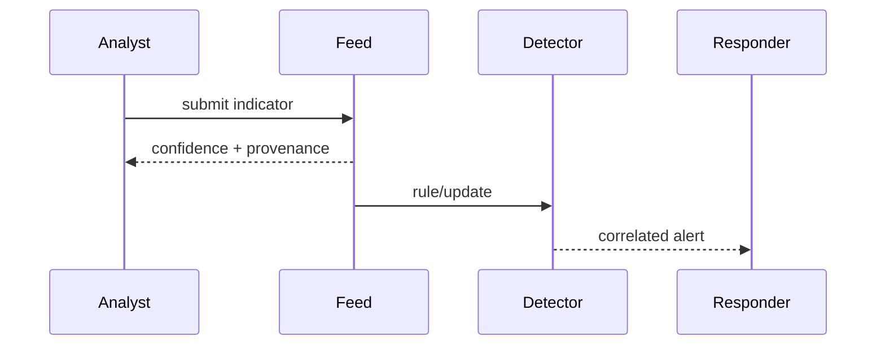
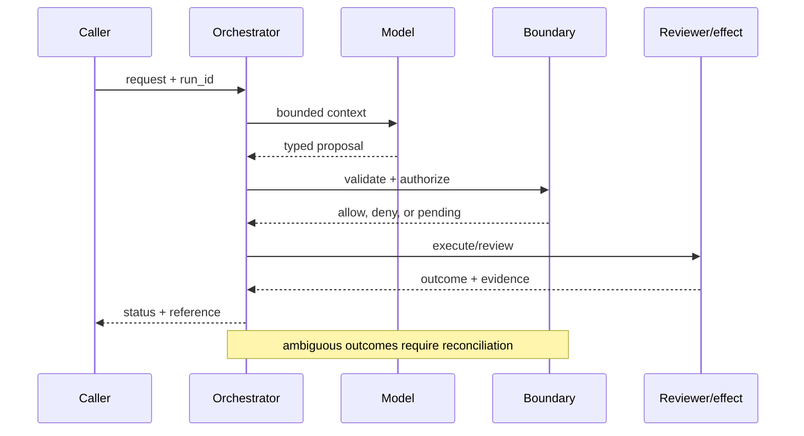

# Threat intelligence
Status: emerging
Sources: [OpenAI — 2026-02-25 malicious AI use](https://openai.com/index/disrupting-malicious-ai-uses/); [MITRE ATT&CK](https://attack.mitre.org/)
## In one sentence
Threat intelligence connects observed tactics, infrastructure, and indicators so defenders can prioritize agent-era abuse.
## Background: what existed before
Defenders investigated isolated alerts while attackers combined social engineering, scripts, and commodity services.
## What changed and why now
OpenAI reports disruption of malicious AI use; the key shift is hybrid campaigns, not magic autonomous attacks.
## Impact on current processing and architecture
Normalize events, enrich indicators, map techniques, and feed detections without exposing sensitive victim data.
## Real-world applications and constraints
Useful for account takeover and phishing defense. False attribution, stale indicators, and privacy constrain sharing.
## Mental model
```mermaid
flowchart LR
 E[Events]-->N[Normalize]-->M[Map tactics]-->D[Detect]-->R[Respond]
 classDef a fill:#dbeafe,stroke:#2563eb,color:#111827; classDef b fill:#fee2e2,stroke:#dc2626,color:#111827; class E,N a; class M,D,R b
```

## What changed this month
The February source set foregrounds disruption reporting and hybrid threat analysis.
## Engineering consequence
Store confidence, source, timestamps, and chain of custody with every indicator.
## Limits and failure modes
Indicators can be poisoned or over-shared; attribution is probabilistic; automated blocking can harm legitimate users.

## SDE2 primer and prerequisites

This lesson treats **threat intelligence** as a concrete engineering discipline, not a synonym for model intelligence. Its key artifact is an evidence-backed case: the service must preserve indicator source, observation time, confidence, relationships, and analyst disposition. A model may suggest enrichment or correlation, but deterministic interfaces, ownership, and versioned records decide whether that suggestion is usable. The useful prerequisite is familiarity with HTTP, JSON, persistence, queues, retries, authentication, and service-level objectives; the topic adds its own state and failure vocabulary.

The useful boundary for threat intelligence is **indicator, campaign, infrastructure graph, confidence, enrichment, attribution, and intelligence cycle**. These are not magic model capabilities. They are interfaces, records, checks, and operating procedures that can be unit-tested. Start with a low-blast-radius workflow and make every external effect attributable to a run ID, actor, policy version, and evidence reference.

## February source reading: fact before inference

For threat intelligence, read the February source through its own claim boundary. The cited February event is **OpenAI's February 25, 2026 report, Disrupting malicious uses of AI**. OpenAI's February 25 report says threat actors typically combine AI with traditional tools such as websites and social-media accounts. It also says activity is seldom limited to one platform or one model, and offers a Chinese influence-operator report as an example. These are observations reported by OpenAI, not a prevalence estimate for all threat actors. The report or announcement is evidence about what its publisher described. It is not independent validation of the publisher's claims, and it does not specify your data, threat model, latency budget, or regulatory obligations. That distinction matters because a source can motivate a concept without proving that the concept is solved.

For threat intelligence, the engineering inference is narrower: turn the cited capability into an operational contract with topic-specific inputs, states, evidence, and failure ownership. Test that contract against ordinary, adversarial, stale, and interrupted work. A source can motivate this design; it cannot guarantee the resulting reliability or safety.

## Historical baseline and problem boundary

The useful threat-intelligence baseline is a feed of indicators matched against logs. That misses source quality, expiry, enrichment uncertainty, and collisions between feeds. A stronger pipeline preserves observation time and confidence so an indicator informs investigation without becoming an automatic verdict.

For threat intelligence, name the raw observation, normalized indicator, source, confidence, mutable case state, and rejecting component. Treat feed data, model hypotheses, analyst judgments, and response actions as different data classes. A request can influence a proposal but cannot grant attribution. Test this boundary with stale, malformed, replayed, and partially completed cases.

## Architecture and data flow

The path starts with feed validation and privacy admission, normalizes observations into indicators and relationships, enriches them through controlled lookups, and finishes at an analyst or response gate. Keep detector and feed revisions beside the work, while generated explanations remain separate from evidence. Measure corroboration quality, feed freshness, analyst workload, and missed detections rather than relying on a generic agent score.

```mermaid
flowchart LR
  A[Caller] --> I[Identity and tenant]
  I --> C[Context/evidence]
  C --> M[Model proposal]
  M --> B[Indicator boundary]
  B --> X[Effect or review]
  X --> L[(Evidence log)]
  classDef data fill:#dbeafe,stroke:#2563eb,color:#172554; classDef control fill:#dcfce7,stroke:#15803d,color:#14532d; classDef risk fill:#fee2e2,stroke:#dc2626,color:#450a0a
  class A,C,X,L data; class I,B control; class M risk
```

Keep raw indicator, normalized indicator, feed provenance, enrichment result, analyst assessment, and response action separate. A feed entry is evidence, not an instruction to block. Bind source, observation time, confidence, expiry, tenant, and handling policy to matches while protecting sensitive investigative content.

Record a run identifier, actor, purpose, indicator, campaign, infrastructure graph, confidence, enrichment, attribution, intelligence cycle, policy and model versions, evidence references, decision, attempts, timestamps, and final state. Add the durable artifact that permits investigation: feed ID, observation timestamp, expiry, relationship provenance, analyst disposition, and response receipt. A generic transcript cannot explain why an indicator was escalated. Keep raw content behind controlled references and retention rules.

## Processing walkthrough and state

Threat state should distinguish observed, enriched, corroborated, expired, disputed, escalated, contained, and false_positive. Recheck indicator freshness before action and preserve the evidence used by the analyst. An absent feed is a coverage gap, not a clean verdict.



On retry, reuse the feed-event or case idempotency key; never create a duplicate case when the first enrichment attempt has an unknown outcome.

## Topic mechanics: Threat intelligence

### Decision model and topic-specific data contract

Threat intelligence needs a graph rather than a single alert. Normalize an AI-service event, website, domain, account, payment instrument, model, and timestamp into entities and relationships. Preserve confidence and source provenance so an analyst can distinguish an observed indicator from an inferred campaign link. The February report's cross-platform observation means a detector should correlate, for example, a repeated request pattern with a newly registered domain and synchronized social accounts, without claiming that any one signal proves malicious intent. Enrich indicators through controlled lookups; do not let an untrusted artifact trigger arbitrary network access. Map behavior to ATT&CK techniques where useful, but preserve the uncertainty and the defensive purpose. A case queue needs deduplication, severity, owner, evidence retention, and a closure reason. Test evasion by changing models, accounts, wording, and infrastructure; test false positives with legitimate research and security testing. Measure analyst time and quality, not the number of indicators. OpenAI reports a Chinese influence-operator example and says campaigns may use multiple models; that is a source-reported observation, not an attribution method or prevalence statistic.

Ask what each intelligence transition can establish. A feed establishes an observation; normalization establishes a comparable indicator; enrichment adds context; correlation proposes a campaign link; and an analyst or response owner establishes disposition. A timeout, missing feed, or ambiguous relationship therefore becomes an explicit status, not an implicit clean result. Persist relevant versions and evidence references, and retain unknown, deferred, or needs-review states when the system cannot prove the stronger claim.

Threat intelligence needs versioned indicator feeds, normalization rules, confidence rubric, enrichment sources, and expiry semantics. Keep feed revision with every match so an analyst can distinguish a changed indicator from a changed detector and preserve historical incident reasoning. Never let a model-generated relationship silently acquire the status of an observed fact.

Threat pipelines should cap feed fan-out, enrichment calls, indicator cardinality, and analyst queue age. Quarantine an unbounded or malformed feed before it changes detections. Report `feed_stale`, `enrichment_timeout`, and `indicator_conflict` independently so responders do not treat absent intelligence as a clean signal.

Break intelligence metrics down by task slice, source, tenant, detector version, dependency, and outcome class so a healthy average cannot hide a dangerous subgroup. Include feed staleness, false attribution, and missed-detection review.


## Threat intelligence: focused design workshop

Keep request prose, raw observations, normalized indicators, generated hypotheses, analyst assessments, and response actions in separate typed fields. Intelligence code owns completeness, freshness, provenance, and case promotion; prose only explains intent.

The event trail must let an operator distinguish malformed feed data, missing source, expired indicator, enrichment failure, disputed attribution, and confirmed response. Record the case artifact and the decision that moved it between states. Preserve chain of custody for sensitive evidence and avoid placing victim data in broad-sharing feeds.

Test intelligence races. An indicator can expire after enrichment begins, or two feeds can assign incompatible meanings to the same artifact. Preserve feed revision, observation time, and confidence through correlation; emit `indicator_expired` or `feed_conflict` rather than silently escalating or dismissing the signal.

Slice intelligence metrics by task class, source, tenant, governing revision, dependency, and final state. Report corroborated detection, false-positive burden, latency, cost, analyst effort, and recovery burden together; averages are insufficient when a rare false attribution causes the largest consequence.

Save a failing intelligence input as a regression fixture only after redaction, classification, and capture of the governing version. Include a stale indicator, feed conflict, poisoned enrichment, benign lookalike, unavailable feed, and confirmed malicious artifact.


## Applications and operational constraints

Start threat intelligence in observation or draft mode, compare against a deterministic or human baseline, then expand only a narrow cohort and reversible effect class.

This pattern applies to account takeover defense, phishing investigation, abuse operations, and supply-chain monitoring. Choose an application with a named owner and bounded effects, then document data residency, access, quota, staffing, latency, and rollback constraints. Automated blocking should require stronger corroboration than analyst triage; a mistaken block can lock out a legitimate user or expose an organization to attribution and privacy risk. The right metric differs by deployment; do not import a support or research target without checking the actual user outcome.

Plan threat-intelligence capacity around feed ingestion, enrichment APIs, deduplication, storage, and analyst attention. When a feed or enrichment source is unavailable, preserve the gap and confidence impact in the alert. A cached indicator set is a bounded fallback, not evidence that current coverage is healthy.

## Failure modes, security, and limits

Threat-intelligence failures include feed poisoning, indicator collisions, stale enrichment, and analyst overload. Preserve source, observation time, confidence, and expiry; require corroboration before high-impact action and quarantine malformed feeds. Measure missed detections and investigation quality alongside alert volume.

Threat metrics can improve by suppressing noisy alerts, narrowing feed coverage, or labeling unresolved indicators benign. Pair precision with missed-detection tests, feed freshness, analyst review, and time to contain. A quiet queue is not evidence of a quiet threat environment.

The February source has a bounded claim and scope limits. OpenAI's February 25 report says threat actors typically combine AI with traditional tools such as websites and social-media accounts, and says activity is seldom limited to one platform or model. These are observations reported by OpenAI, not a prevalence estimate, independent attribution method, or guarantee for every campaign. MITRE ATT&CK supplies a behavior vocabulary, while confidence scoring, source handling, corroboration, and privacy controls are local engineering recommendations. Treat vendor examples as source facts and label recommendations as inference. When evidence is weak, preserve uncertainty and escalate.

## Evaluation and change management

Build threat fixtures for stale indicators, feed conflict, poisoned enrichment, benign lookalikes, unavailable feeds, and high-confidence malicious artifacts. Assert source and expiry preservation through correlation. Compare detector changes on protected attack cases and review redacted production traces by missed detection and false positive.

Promote an intelligence feed or detector only when protected attack recall, feed freshness, false-positive burden, and analyst response meet floors. Shadow correlations where possible, quarantine the new feed on rollback, and record which alerts used its indicators so investigations remain interpretable.

## February primary-source evidence

The source fact is bounded: **OpenAI's February 25 report says threat actors typically combine AI with traditional tools such as websites and social-media accounts. It also says activity is seldom limited to one platform or one model, and offers a Chinese influence-operator report as an example. These are observations reported by OpenAI, not a prevalence estimate for all threat actors.** The February publication date and the publisher's wording should be cited when teaching the event. The recommendation that teams implement indicator, campaign, infrastructure graph, confidence, enrichment, attribution, and intelligence cycle is an inference from the event plus established systems practice. It should be validated with local fixtures, security review, operational metrics, and domain experts. The source does not independently verify the examples, and this article does not present them as guarantees.

## Mini exercise extension

Create six fixtures: malformed feed data, stale indicator, conflicting feed entries, poisoned enrichment, unavailable dependency, and corroborated completion. Assert different states for each case; do not use one generic success label. Store source, confidence, and recovery owner beside every assertion, then alter the governing version and prove that prior intelligence records remain historical.

## Build it locally: numbered implementation

1. Construct an intelligence record with source, indicator, observation time, confidence, expiry, decision, and outcome fields.
2. Implement a pure normalizer that rejects malformed indicators and preserves source and timestamp fields.
3. Create deterministic observations for a domain, account, URL, and benign lookalike, then connect them only with typed relationship evidence.
4. Simulate enrichment failing after admission. Preserve `enrichment_timeout` and prevent the missing result from becoming a clean signal.
5. Write an event stream containing case states, redacting victim data while retaining references needed for offline replay.
6. Measure corroborated detection, false positives, feed freshness, analyst time, recovery work, and resource cost by source.
7. Change the detector revision and verify that old cases still resolve under their original evidence contract.

## Runnable low-cost example

```python
from collections import defaultdict
graph = defaultdict(set)
graph["ai-service:acct-4"].update({"domain:example.test", "social:acct-9"})
confidence = {("ai-service:acct-4", "domain:example.test"): 0.7}
print(sorted(graph["ai-service:acct-4"]), confidence[("ai-service:acct-4", "domain:example.test")])
```

This indicator example demonstrates expiry-aware matching only. It does not validate feeds, enrich artifacts, calibrate confidence, or detect real threats; add poisoned-feed and benign-lookalike fixtures before operational use.

## Interview Q&A

**Q: How should an indicator be interpreted?** A: As evidence with source, time, confidence, and scope—not as an automatic verdict. Correlate it with independent observations and preserve the uncertainty.

**Q: Is an indicator an incident?** A: No. It is an observable artifact or signal. An incident requires a case assessment, impact, ownership, and response decision.

**Q: Which metric would you put on the dashboard first?** A: Track corroborated detection quality and false-positive burden, paired with feed freshness, analyst effort, and missed-detection review.

**Q: What should a stale feed cause?** A: Mark coverage and confidence as degraded, stop treating new matches as current without qualification, and route the gap to the feed owner.

**Q: How should threat intelligence be released?** A: Pin feed and detector versions, begin with analyst-visible correlations, test benign lookalikes and poisoned feeds, and require provenance and uncertainty floors before automated response.

## Glossary

- **Indicator**: the topic-specific control boundary that mediates a model proposal and an outcome.
- **Run ID**: the correlation key that joins one threat intelligence attempt to its actor, threat intelligence evidence, decisions, and recovery evidence.
- **Idempotency**: the threat intelligence guarantee that a retry does not create a second logical result or duplicate effect.
- **Provenance**: origin, version, and transformation evidence attached to a threat intelligence input or artifact.
- **SLO**: an explicit threat intelligence service target, such as freshness, verification latency, queue age, or availability.
- **Abstention**: the threat intelligence state used when evidence, authority, or dependency health is insufficient for a stronger claim.
- **Inference**: an engineering recommendation about threat intelligence derived from source facts rather than presented as a source guarantee.

## References

- [OpenAI: Disrupting malicious uses of AI — February 25, 2026](https://openai.com/index/disrupting-malicious-ai-uses/)
- [MITRE ATT&CK](https://attack.mitre.org/)

## Claim ledger

| Claim | Source | Fact or inference |
|---|---|---|
| The cited publisher published the February event on the stated date. | [OpenAI's February 25, 2026 report, Disrupting malicious uses of AI](https://openai.com/index/disrupting-malicious-ai-uses/) | Fact |
| OpenAI's February 25 report says threat actors typically combine AI with traditional tools such as websites and social-media accounts. | [OpenAI's February 25, 2026 report, Disrupting malicious uses of AI](https://openai.com/index/disrupting-malicious-ai-uses/) | Fact |
| Moving from isolated prompt moderation to campaign-level, cross-platform evidence. | Engineering design synthesis | Inference |
| A separately enforced boundary is safer and easier to operate than treating model text as authority. | Topic standards and systems reasoning | Inference |
| The local example demonstrates the concept but does not prove production security, reliability, or generalization. | This lesson | Fact about the example |
