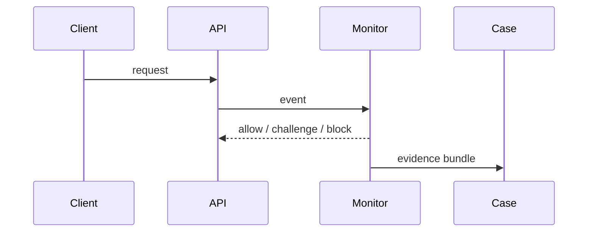
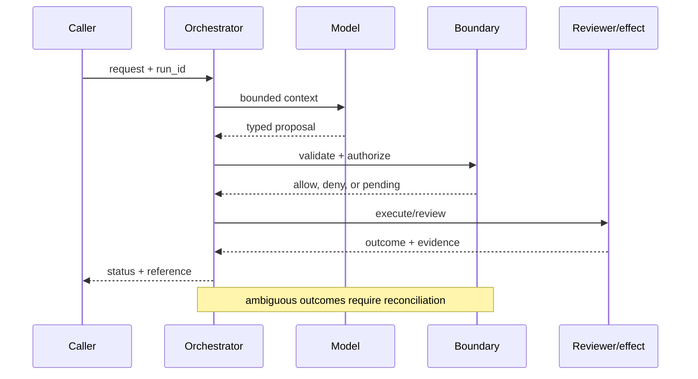

# Abuse monitoring
Status: emerging
Sources: [OpenAI — 2026-02-25 malicious AI use](https://openai.com/index/disrupting-malicious-ai-uses/); [NIST AI RMF](https://www.nist.gov/itl/ai-risk-management-framework)
## In one sentence
Abuse monitoring detects suspicious patterns, preserves evidence, and routes cases to safe response.
## Background: what existed before
Teams relied on keyword filters and one-request moderation.
## What changed and why now
Multi-step agent use requires behavioral signals, rate limits, and case management.
## Impact on current processing and architecture
Collect privacy-minimized events, score risk, throttle, and retain reviewable evidence.
## Real-world applications and constraints
Protect messaging and code tools. Detection evasion, false positives, and retention obligations matter.
## Mental model
```mermaid
flowchart LR
 X[Events]-->S[Signals]-->Q[Risk score]-->T[Throttle]-->H[Human case]
 classDef a fill:#dbeafe,stroke:#2563eb,color:#111827; classDef b fill:#fef3c7,stroke:#d97706,color:#111827; class X,S a; class Q,T,H b
```

## What changed this month
February links disruption reporting to operational monitoring and response.
## Engineering consequence
Use layered controls and preserve enough evidence to explain a decision.
## Limits and failure modes
Scores are not proof; sensitive logs can become a breach; automated blocks need appeal paths.

## SDE2 primer and prerequisites

This lesson treats **abuse monitoring** as a concrete engineering discipline, not a synonym for model intelligence. Its key artifact is a privacy-minimized case record: the service must preserve the signals, detector version, evidence window, action, and appeal outcome needed to explain enforcement. A model may suggest a next step, but deterministic interfaces, ownership, and versioned records decide whether that suggestion is usable. The useful prerequisite is familiarity with HTTP, JSON, persistence, queues, retries, authentication, and service-level objectives; the topic adds its own state and failure vocabulary.

The useful boundary for abuse monitoring is **behavioral signal, rate feature, case queue, evidence preservation, triage, and response playbook**. These are not magic model capabilities. They are interfaces, records, checks, and operating procedures that can be unit-tested. Start with a low-blast-radius workflow and make every external effect attributable to a run ID, actor, policy version, and evidence reference.

## February source reading: fact before inference

For abuse monitoring, read the February source through its own claim boundary. The cited February event is **OpenAI's February 25, 2026 report, Disrupting malicious uses of AI**. The February report says its case studies show AI used in combination with traditional tools, and that activity may span multiple AI models and platforms. The factual lesson is to look for behavior across boundaries. Thresholds, classifiers, analyst queues, and retention are proposed controls, not claims made by the report. The report or announcement is evidence about what its publisher described. It is not independent validation of the publisher's claims, and it does not specify your data, threat model, latency budget, or regulatory obligations. That distinction matters because a source can motivate a concept without proving that the concept is solved.

For abuse monitoring, the engineering inference is narrower: turn the cited capability into an operational contract with topic-specific inputs, states, evidence, and failure ownership. Test that contract against ordinary, adversarial, stale, and interrupted work. A source can motivate this design; it cannot guarantee the resulting reliability or safety.

## Historical baseline and problem boundary

The useful abuse-monitoring baseline is a threshold over a few account or traffic features. It struggles with coordinated evasion, missing telemetry, and the cost of false enforcement. Modern monitoring needs protected coverage, reviewable evidence, proportionate actions, and an appeal path.

For abuse monitoring, name the raw event, derived behavioral signal, actor scope, mutable case state, privacy policy, and rejecting component. Treat telemetry, detector hypotheses, analyst judgments, and enforcement effects as different data classes. A score can prioritize review but cannot establish wrongdoing. Test this boundary with stale, malformed, replayed, and partially completed cases.

## Architecture and data flow

The path starts with telemetry integrity and privacy admission, derives bounded signals over an evidence window, applies a tiered response policy, and finishes at an analyst, appeal, or reversal gate. Keep detector and policy revisions beside the work, while generated explanations remain separate from evidence. Measure coverage, false-positive harm, appeal reversal, and queue age rather than relying on a generic agent score.

```mermaid
flowchart LR
  A[Caller] --> I[Identity and tenant]
  I --> C[Context/evidence]
  C --> M[Model proposal]
  M --> B[Behavioral Signal boundary]
  B --> X[Effect or review]
  X --> L[(Evidence log)]
  classDef data fill:#dbeafe,stroke:#2563eb,color:#172554; classDef control fill:#dcfce7,stroke:#15803d,color:#14532d; classDef risk fill:#fee2e2,stroke:#dc2626,color:#450a0a
  class A,C,X,L data; class I,B control; class M risk
```

Keep raw events, derived features, detector score, reviewer evidence, enforcement decision, and appeal outcome separate. A score can prioritize a case but cannot itself establish wrongdoing. Bind tenant, detector revision, cohort, evidence window, and action policy to alerts while minimizing retained personal data.

Record a run identifier, actor scope, purpose, behavioral signal, rate feature, case queue, evidence preservation, triage, response playbook, policy and model versions, evidence window, decision, attempts, timestamps, and final state. Add the durable artifact that permits appeal: feature snapshot, detector revision, action reason, retention deadline, and reversal receipt. A generic transcript cannot explain a suspension. Keep raw content behind controlled references and retention rules.

## Processing walkthrough and state

Abuse state should distinguish observed, scored, queued, reviewed, actioned, appealed, reversed, and telemetry_gap. Recheck evidence before enforcement and preserve a safe correction path. A missing event stream must not be counted as reduced abuse.



On retry, reuse the alert or enforcement idempotency key; never create duplicate cases or repeated restrictions when the first action has an unknown outcome.

## Topic mechanics: Abuse monitoring

### Decision model and topic-specific data contract

Abuse monitoring is a temporal and relational classifier. Represent events as a stream with actor, tenant, tool, risk category, rate features, target, and model/provider where available. Keep raw evidence in a restricted store and publish minimized features to the detection path. A single request should rarely decide a severe action; combine repeated behavior, account age, payment signals, destination changes, and human review. Use a tiered response: friction or rate limit, temporary hold, analyst case, and emergency disablement. Preserve the events that justify a decision, including detector and policy versions, so an appeal can be investigated. The February report's point that activity can span traditional tools, platforms, and models argues for controlled joins and a clear data-sharing boundary. It does not justify blanket surveillance or a universal risk score. Calibrate thresholds against analyst capacity, measure appeal overturns, and audit disparate error rates. Red-team coordinated low-and-slow activity and benign automation. Design retention so evidence survives an investigation but ordinary content is not kept forever. A monitoring service must also monitor itself: detector drift, queue backlog, missing telemetry, and an overloaded analyst team are safety failures.

Ask what each monitoring transition can establish. Telemetry establishes an observation; feature extraction establishes a bounded signal; scoring prioritizes attention; and review or policy establishes an action within scope. A timeout, missing event stream, or ambiguous enforcement response therefore becomes an explicit status, not an implicit clean result. Persist relevant versions and evidence references, and retain unknown, deferred, or needs-review states when the system cannot prove the stronger claim.

Abuse monitoring should version feature extraction, threshold bands, cohort definitions, response playbooks, retention, and appeal policy. Attach them to each alert and enforcement action; later tuning may change future alerts but must not make a past suspension impossible to explain. Preserve protected attack cohorts during sampling and make telemetry gaps visible.

Abuse monitoring needs caps on event volume, feature computation, alert fan-out, and enforcement retries. Sample only after preserving high-risk cohorts and known attack signatures. Return `telemetry_gap`, `score_low`, and `review_backlog` distinctly; quiet dashboards can otherwise look like reduced abuse.

Break monitoring metrics down by task slice, actor or tenant, detector version, dependency, risk band, and outcome class so a healthy average cannot hide a dangerous subgroup. Include appeal outcomes and telemetry gaps.


## Abuse monitoring: focused design workshop

Keep request prose, raw telemetry, derived signals, detector proposals, analyst decisions, enforcement actions, and appeal outcomes in separate typed fields. Monitoring code owns completeness, freshness, privacy, and case promotion; prose only explains intent.

The event trail must let an operator distinguish malformed telemetry, missing coverage, stale features, detector failure, appeal, reversal, and confirmed action. Record the case artifact and the decision that moved it between states. Keep raw content restricted and retain only what the response and appeal process requires.

Test monitoring races. A user may appeal while an enforcement job is queued, or a detector revision may change the score before a reviewer sees the case. Freeze the evidence and detector version for that decision. Preserve `appeal_pending` and `telemetry_gap`; neither should be counted as harmless behavior.

Slice monitoring metrics by task class, actor or tenant, governing revision, dependency, risk band, and final state. Report coverage, useful detection, false-positive harm, latency, cost, appeal effort, and recovery burden together; averages are insufficient when a rare wrongful block carries the largest consequence.

Save a failing monitoring input as a regression fixture only after redaction, classification, and capture of the governing version. Include coordinated evasion, benign automation, missing telemetry, appeal during enforcement, and detector drift.


## Applications and operational constraints

Start abuse monitoring in observation or draft mode, compare against a deterministic or human baseline, then expand only a narrow cohort and reversible effect class.

This pattern applies to messaging, code-generation services, account protection, and tool-use platforms. Choose an application with a named owner and bounded effects, then document data residency, access, quota, staffing, latency, and rollback constraints. A temporary rate limit may be safer than a permanent ban while an analyst reviews; an appeal must be able to restore access and record who changed the decision. The right metric differs by deployment; do not import a support or research target without checking the actual user outcome.

Plan abuse-monitoring capacity around event ingestion, feature computation, alert review, and appeal queues. Under load, protect high-risk cohorts and preserve raw counters before sampling lower-risk traffic. A reduced detector or delayed enforcement decision must carry an explicit coverage state.

## Failure modes, security, and limits

Abuse-monitoring failures include evasion, false positives, missing telemetry, and enforcement that cannot be appealed. Maintain adversarial holdouts, preserve high-risk event coverage during sampling, and separate detection from punishment. Review reversal rates and user harm, not only the number of alerts closed.

Abuse metrics can improve by over-blocking benign users, sampling away coordinated attacks, or closing alerts without appeal outcomes. Pair detection recall with false-positive harm, reversal rate, coverage gaps, and reviewer capacity. Fewer alerts are useful only when hostile behavior remains observable.

The February source has a bounded claim and scope limits. The February report says its case studies show AI used in combination with traditional tools and that activity may span multiple models and platforms. The factual lesson is to look for behavior across boundaries, not to assume every unusual user is abusive. Thresholds, classifiers, analyst queues, retention, and appeals are proposed controls, not claims made by the report. Nothing in the source proves robustness against your adversaries, fairness on your domain, or a particular service-level target. Treat source examples as facts and recommendations as inference. When evidence is weak, preserve uncertainty and escalate.

## Evaluation and change management

Build abuse fixtures for evasion, coordinated behavior, benign edge cases, missing telemetry, appeals, and enforcement outage. Assert coverage of high-risk cohorts and reversible action. Compare detector versions on hidden adversarial cases, then inspect false-positive harm and reversal outcomes in redacted traces.

Promote abuse detection only when attack coverage, false-positive harm, appeal reversal, telemetry completeness, and enforcement latency meet floors. Canary the detector without automatic punishment, retain a reversible action path, and preserve alert version for users whose decisions were affected.

## February primary-source evidence

The source fact is bounded: **The February report says its case studies show AI used in combination with traditional tools, and that activity may span multiple AI models and platforms. The factual lesson is to look for behavior across boundaries. Thresholds, classifiers, analyst queues, and retention are proposed controls, not claims made by the report.** The February publication date and the publisher's wording should be cited when teaching the event. The recommendation that teams implement behavioral signal, rate feature, case queue, evidence preservation, triage, and response playbook is an inference from the event plus established systems practice. It should be validated with local fixtures, security review, operational metrics, and domain experts. The source does not independently verify the examples, and this article does not present them as guarantees.

## Mini exercise extension

Create six fixtures: missing telemetry, coordinated low-and-slow behavior, benign automation, poisoned features, appeal during enforcement, and verified reversal. Assert different states for each case; do not use one generic success label. Store the detector revision and recovery owner beside every assertion, then alter the governing version and prove that prior cases remain historical.

## Build it locally: numbered implementation

1. Construct a monitoring record with actor scope, event window, features, detector revision, decision, and outcome fields.
2. Implement a pure scoring function that rejects missing telemetry and returns `score_low`, `review`, or `telemetry_gap`.
3. Create deterministic windows for repeated risky behavior, benign automation, and coordinated low-rate activity.
4. Simulate an appeal arriving after an enforcement job is queued. Require the action gate to recheck the current case state.
5. Write an event stream containing case states, redacting sensitive payloads while retaining references needed for appeal.
6. Measure coverage, useful detection, false-positive harm, appeal reversal, queue age, and resource cost by cohort.
7. Change the detector revision and verify that old cases remain explainable under their original feature contract.

## Runnable low-cost example

```python
from collections import Counter
window = [("actor-a", "high-risk"), ("actor-a", "high-risk"), ("actor-b", "normal")]
counts = Counter(a for a, _ in window)
for actor, count in counts.items():
    print(actor, "review" if count >= 2 else "allow")
```

This monitoring sketch demonstrates a small alert rule only. It does not establish attack coverage, fairness, telemetry integrity, or an appeal path; add adversarial and false-positive fixtures before enforcement.

## Interview Q&A

**Q: Why measure appeals?** A: Appeals reveal wrongful enforcement and whether users can obtain a timely correction. A low appeal rate may mean the process is inaccessible, not that decisions are accurate.

**Q: Why separate detection from enforcement?** A: Detection produces evidence and priority; enforcement applies a proportionate policy with ownership and recourse. Separating them limits the damage of a noisy score.

**Q: Which metric would you put on the dashboard first?** A: Track protected attack coverage and false-positive harm, paired with appeal reversal, telemetry completeness, and reviewer capacity.

**Q: What does a telemetry gap mean?** A: The detector cannot make its normal coverage claim. Mark the gap, protect known high-risk paths, and avoid treating missing events as evidence of safe behavior.

**Q: How should abuse monitoring be released?** A: Pin detector and policy versions, begin in shadow mode, test evasion and benign edge cases, retain an appeal and reversal path, and require coverage and harm floors before automated action.

## Glossary

- **Behavioral Signal**: the topic-specific control boundary that mediates a model proposal and an outcome.
- **Run ID**: the correlation key that joins one abuse monitoring attempt to its actor, abuse monitoring evidence, decisions, and recovery evidence.
- **Idempotency**: the abuse monitoring guarantee that a retry does not create a second logical result or duplicate effect.
- **Provenance**: origin, version, and transformation evidence attached to a abuse monitoring input or artifact.
- **SLO**: an explicit abuse monitoring service target, such as freshness, verification latency, queue age, or availability.
- **Abstention**: the abuse monitoring state used when evidence, authority, or dependency health is insufficient for a stronger claim.
- **Inference**: an engineering recommendation about abuse monitoring derived from source facts rather than presented as a source guarantee.

## References

- [OpenAI: Disrupting malicious uses of AI — February 25, 2026](https://openai.com/index/disrupting-malicious-ai-uses/)
- [NIST AI Risk Management Framework](https://www.nist.gov/itl/ai-risk-management-framework)

## Claim ledger

| Claim | Source | Fact or inference |
|---|---|---|
| The cited publisher published the February event on the stated date. | [OpenAI's February 25, 2026 report, Disrupting malicious uses of AI](https://openai.com/index/disrupting-malicious-ai-uses/) | Fact |
| The February report says its case studies show AI used in combination with traditional tools, and that activity may span multiple AI models and platforms. | [OpenAI's February 25, 2026 report, Disrupting malicious uses of AI](https://openai.com/index/disrupting-malicious-ai-uses/) | Fact |
| Monitoring sequences and relationships while preserving enough evidence for a safe decision. | Engineering design synthesis | Inference |
| A separately enforced boundary is safer and easier to operate than treating model text as authority. | Topic standards and systems reasoning | Inference |
| The local example demonstrates the concept but does not prove production security, reliability, or generalization. | This lesson | Fact about the example |
