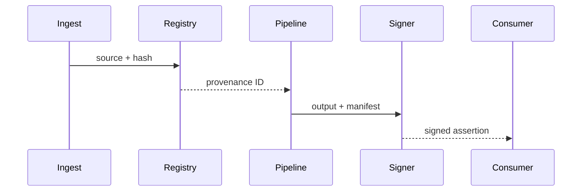
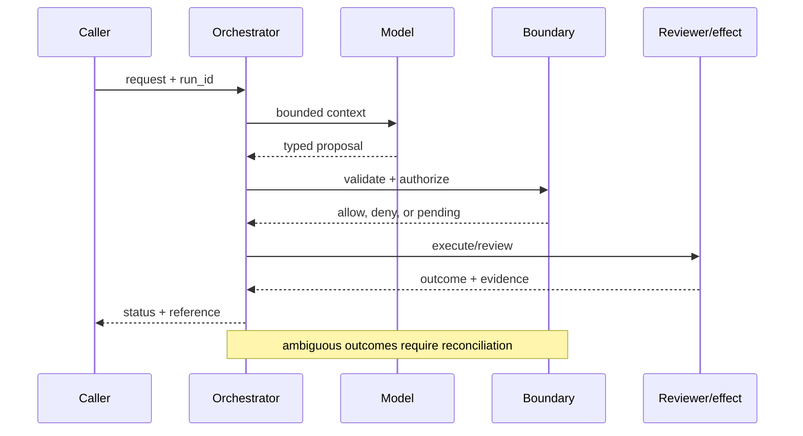

# Content provenance
Status: durable
Sources: [W3C PROV — recommendation](https://www.w3.org/TR/prov-overview/); [C2PA — specification](https://c2pa.org/specifications/); [OpenAI's February 25, 2026 report, Disrupting malicious uses of AI](https://openai.com/index/disrupting-malicious-ai-uses/)
## In one sentence
Provenance records where content came from, which version transformed it, and who controls relevant rights.
## Background: what existed before
Files circulated detached from source, model, prompt, or edit history.
## What changed and why now
Generated and transformed content makes metadata and verifiable assertions operationally important.
## Impact on current processing and architecture
Carry source IDs, hashes, transforms, timestamps, and signatures through ingestion and export.
## Real-world applications and constraints
Useful in journalism and training-data review. Metadata stripping, key management, and partial adoption limit coverage.
## Mental model
```mermaid
flowchart LR
 S[Source]-->H[Hash]-->T[Transform]-->Sig[Signature]-->O[Output]
 classDef a fill:#dbeafe,stroke:#2563eb,color:#111827; classDef b fill:#dcfce7,stroke:#16a34a,color:#111827; class S,O a; class H,T,Sig b
```

## What changed this month
February treats provenance as a processing field, not a UI badge.
## Engineering consequence
Make provenance append-only where possible and verify signatures before trust decisions.
## Limits and failure modes
Valid provenance does not prove factual correctness; unsigned legacy content remains ambiguous.

## SDE2 primer and prerequisites

This lesson treats **content provenance** as a concrete engineering discipline, not a synonym for model intelligence. Its key artifact is a lineage manifest: the service must preserve source, transformation, parent-child links, attribution, and verification state for an artifact and its derivatives. A model may suggest a next step, but deterministic interfaces, ownership, and versioned records decide whether that suggestion is usable. The useful prerequisite is familiarity with HTTP, JSON, persistence, queues, retries, authentication, and service-level objectives; the topic adds its own state and failure vocabulary.

The useful boundary for content provenance is **lineage, content hash, transformation manifest, signer, assertion, chain of custody, and verification**. These are not magic model capabilities. They are interfaces, records, checks, and operating procedures that can be unit-tested. Start with a low-blast-radius workflow and make every external effect attributable to a run ID, actor, policy version, and evidence reference.

## February source reading: fact before inference

For content provenance, read the February source through its own claim boundary. The cited February event is **OpenAI's February 25, 2026 report, Disrupting malicious uses of AI**. OpenAI's February report emphasizes that malicious activity can cross AI models, platforms, websites, and social accounts. That makes evidence continuity a timely operational problem, but the report does not endorse C2PA or W3C PROV. Those standards provide a vocabulary for implementing the inference that investigators need a machine-readable history. The report or announcement is evidence about what its publisher described. It is not independent validation of the publisher's claims, and it does not specify your data, threat model, latency budget, or regulatory obligations. That distinction matters because a source can motivate a concept without proving that the concept is solved.

For content provenance, the engineering inference is narrower: turn the cited capability into an operational contract with topic-specific inputs, states, evidence, and failure ownership. Test that contract against ordinary, adversarial, stale, and interrupted work. A source can motivate this design; it cannot guarantee the resulting reliability or safety.

## Historical baseline and problem boundary

The useful provenance baseline is a filename, author field, or upload timestamp. Those hints are easy to copy and rarely survive editing or remixing. Content provenance makes source, transformation, attribution, and withdrawal evidence explicit for each artifact and its derivatives.

For content provenance, name the source artifact, transformation, actor, mutable lineage state, and rejecting component. Treat source bytes, generated claims, manifests, and publication decisions as different data classes. A filename or model explanation can influence a proposal but cannot prove origin. Test this boundary with stale, malformed, replayed, and partially completed cases.

## Architecture and data flow

The path starts by hashing and registering source bytes, records each transformation as a new graph node, verifies parent links and signatures, and finishes at a publication or withdrawal gate. Keep manifest and verification revisions beside the work, while generated descriptions remain separate from lineage evidence. Measure chain completeness, verification latency, withdrawal propagation, and missing-link rate rather than relying on a generic agent score.

```mermaid
flowchart LR
  A[Caller] --> I[Identity and tenant]
  I --> C[Context/evidence]
  C --> M[Model proposal]
  M --> B[Lineage boundary]
  B --> X[Effect or review]
  X --> L[(Evidence log)]
  classDef data fill:#dbeafe,stroke:#2563eb,color:#172554; classDef control fill:#dcfce7,stroke:#15803d,color:#14532d; classDef risk fill:#fee2e2,stroke:#dc2626,color:#450a0a
  class A,C,X,L data; class I,B control; class M risk
```

Keep source artifact, transformation record, attribution claim, rights decision, derivative, and publication status separate. A filename or generated description cannot stand in for lineage. Bind artifact ID, parent hash, transformation version, owner, and withdrawal state to the manifest while limiting private content in audit storage.

Record a run identifier, actor, purpose, lineage, content hash, transformation manifest, signer, assertion, chain of custody, verification, policy and model versions, evidence references, decision, attempts, timestamps, and final state. Add the durable artifact that permits reconstruction: asset ID, parent hashes, transformation version, signature status, rights status, and withdrawal receipt. A generic transcript cannot prove that an export came from a particular source. Keep raw content behind controlled references and retention rules.

## Processing walkthrough and state

Provenance state should distinguish ingested, transformed, attributed, disputed, published, withdrawn, and lineage_incomplete. Gate publication on complete parent links and preserve correction records for distributed copies. A hash mismatch needs investigation, not silent replacement.



On retry, reuse the asset or manifest idempotency key; never create a second lineage branch when the first registration has an unknown outcome.

## Topic mechanics: Content provenance

### Decision model and topic-specific data contract

A provenance record is a graph of entities and transformations, not a decorative badge. On ingest, hash the bytes, record source URI and acquisition time, and assign an asset ID. Each model or human transform consumes one or more assets and emits a new asset with tool version, parameters, operator or service identity, and output hash. A signed assertion authenticates who made a statement about the graph; it does not prove that the content is true. C2PA can carry creator and edit assertions, while W3C PROV supplies a general entity/activity/agent vocabulary. For an incident image, preserve the original, a normalized copy, an OCR result, a model summary, and every export as separate nodes. Verify signatures and hashes before using provenance in a trust or ranking decision. Metadata stripping and screenshots create gaps; represent “unknown” rather than inventing lineage. Key rotation, offline verification, and legacy unsigned content need explicit policy. The February malicious-use report makes this relevant because evidence can cross platforms and models; it does not itself prescribe a provenance standard. Measure reconstruction time and missing-link rate, not the number of badges displayed.

Ask what each lineage transition can establish. Hashing establishes byte identity; a manifest establishes a transformation claim; a signature establishes an assertion's signer; and verification establishes whether the chain is internally consistent. A timeout, missing parent, or ambiguous signature therefore becomes an explicit status, not an implicit trusted result. Persist relevant versions and evidence references, and retain unknown, deferred, or needs-review states when the system cannot prove the stronger claim.

Content provenance needs versioned source identifiers, transformation steps, model or editor attribution, hashes, signatures, rights state, and disclosure policy. Preserve the chain for each published artifact; correcting a source should create a traceable revision rather than silently changing the provenance of an already distributed copy. A valid signature authenticates a statement about an artifact; it does not establish that the artifact is factually correct.

Provenance capture should cap transformation depth, artifact fan-out, hash work, and publication queue age. Block release when a derivative loses its parent reference rather than emitting an apparently complete record. Distinguish `source_missing`, `chain_incomplete`, and `publication_blocked` in the audit stream.

Break provenance metrics down by task slice, actor or tenant, manifest version, dependency, and outcome class so a healthy average cannot hide a dangerous subgroup. Include unsigned inputs, missing parents, and withdrawal lag.


## Content provenance: focused design workshop

Keep request prose, source assets, transformation records, generated assertions, manifests, and publication decisions in separate typed fields. Provenance code owns completeness, parent linkage, verification, and promotion of a result; prose only explains intent.

The event trail must let an operator distinguish malformed asset, missing parent, signature failure, stale manifest, withdrawal request, and confirmed publication. Record the lineage artifact and the decision that moved it between states. Preserve immutable IDs and do not overwrite an old manifest when a source is corrected.

Test provenance races. A derivative may publish while its parent is being withdrawn, or a transformation may finish without recording one intermediate artifact. Require parent availability and chain completeness at publication. Preserve `source_revoked` and `lineage_incomplete`; a hash alone cannot prove provenance.

Slice provenance metrics by task class, actor or tenant, governing revision, dependency, and final state. Report chain completeness, useful publication, verification latency, cost, withdrawal lag, and recovery burden together; averages are insufficient when a rare false attribution carries the largest consequence.

Save a failing provenance input as a regression fixture only after redaction, classification, and capture of the governing version. Include a missing parent, stripped metadata, changed bytes, invalid signature, withdrawn source, and disputed attribution.


## Applications and operational constraints

Start content provenance in observation or draft mode, compare against a deterministic or human baseline, then expand only a narrow cohort and reversible effect class.

This pattern applies to journalism, training-data review, evidence handling, digital publishing, and media asset management. Choose an application with a named owner and bounded effects, then document data residency, access, quota, staffing, latency, and rollback constraints. A newsroom may publish a visible source chain while withholding private originals; a training pipeline may reject an asset with incomplete rights or lineage rather than silently treating it as clean. The right metric differs by deployment; do not import a support or research target without checking the actual user outcome.

Plan provenance capacity around hashing, transformation tracking, artifact storage, and withdrawal propagation. If the lineage service is delayed, block publication or label the artifact pending provenance; do not emit a clean attribution record from partial data. A pointer to an unfinished chain is not a completed disclosure.

## Failure modes, security, and limits

Provenance fails when a derivative loses its parent, a transformation is omitted, or attribution is copied without evidence. Use immutable artifact IDs, content hashes, signed or access-controlled manifests, and publication gates for incomplete chains. Test edits, remixing, withdrawal, and distributed copies rather than only a clean upload.

Provenance metrics can improve by recording hashes without usable lineage, labeling only cooperative sources, or counting an upload as attributed before review. Pair coverage with chain completeness, withdrawal success, attribution correction, and downstream propagation. More manifests do not establish trustworthy provenance when parent links are missing.

The February source has a bounded claim and scope limits. OpenAI's February report emphasizes that malicious activity can cross AI models, platforms, websites, and social accounts. That makes evidence continuity a timely operational problem, but the report does not endorse C2PA or W3C PROV. Those standards provide vocabularies for a machine-readable history; they do not make unsigned legacy content trustworthy or prove factual correctness. Nothing in the source proves robustness against your adversaries, correctness on your domain, or a particular service-level target. Treat source examples as facts and recommendations as inference. When evidence is weak, mark lineage incomplete and escalate.

## Evaluation and change management

Build provenance fixtures for original uploads, edits, remixing, missing parents, withdrawn sources, copied artifacts, and disputed attribution. Assert immutable IDs, complete parent chains, and publication blocking when evidence is absent. Keep adversarial transformations hidden and inspect redacted lineage traces.

Publish a provenance change only when parent-chain completeness, attribution evidence, withdrawal propagation, and artifact integrity meet floors. Canary manifests, block release for missing links, and retain a prior manifest format for rollback. Enumerate distributed derivatives that need correction.

## February primary-source evidence

The source fact is bounded: **OpenAI's February report emphasizes that malicious activity can cross AI models, platforms, websites, and social accounts. That makes evidence continuity a timely operational problem, but the report does not endorse C2PA or W3C PROV. Those standards provide a vocabulary for implementing the inference that investigators need a machine-readable history.** The February publication date and the publisher's wording should be cited when teaching the event. The recommendation that teams implement lineage, content hash, transformation manifest, signer, assertion, chain of custody, and verification is an inference from the event plus established systems practice. It should be validated with local fixtures, security review, operational metrics, and domain experts. The source does not independently verify the examples, and this article does not present them as guarantees.

## Mini exercise extension

Create six fixtures: missing parent, stripped metadata, changed bytes, invalid signature, withdrawn source, and verified completion. Assert different states for each case; do not use one generic success label. Store the source reference and recovery owner beside every assertion, then alter the governing version and prove that prior lineage records remain historical.

## Build it locally: numbered implementation

1. Construct a lineage record with asset ID, source, parent hash, transform version, signer, decision, and outcome fields.
2. Implement a pure verifier that rejects missing parents, changed bytes, invalid signatures, and incomplete manifests.
3. Create deterministic assets for an original, crop, OCR result, and model summary, with each parent link explicit.
4. Simulate the source being withdrawn after publication. Require downstream derivatives to become flagged or blocked.
5. Write an event stream containing lineage states, redacting sensitive payloads while retaining references needed for audit.
6. Measure chain completeness, unsigned coverage, verification latency, withdrawal lag, recovery work, and storage cost.
7. Change the manifest schema and verify that old records still resolve under their original contract.

## Runnable low-cost example

```python
import hashlib
def digest(data): return hashlib.sha256(data.encode()).hexdigest()
source = digest("original image")
output = digest("cropped image")
manifest = {"asset":"out-1", "parent":source, "output":output, "transform":"crop-v2"}
print(manifest["parent"] == digest("original image"))
```

This provenance sketch checks a parent hash in memory. It does not prove authorship, preserve a distributed chain, or propagate withdrawal; add edit, remix, and missing-parent fixtures before publication.

## Interview Q&A

**Q: Does a content hash prove authorship?** A: No. It proves that bytes match a digest. Authorship requires a separate trusted assertion, key, or chain-of-custody record, and neither proves factual truth.

**Q: What does provenance establish?** A: It establishes a traceable claim about origin, transformations, actors, and verification state. It does not automatically establish correctness, rights, or intent.

**Q: Which metric would you put on the dashboard first?** A: Track complete parent-chain coverage and missing-link rate, paired with verification latency and withdrawal propagation.

**Q: When should publication stop?** A: Stop when a required parent, signature, rights decision, or transformation record is missing or invalid. Publish with an explicit incomplete status only if policy permits it.

**Q: How should content provenance be released?** A: Pin manifest and verification versions, canary on non-public assets, test metadata stripping and withdrawal, and require chain-completeness and correction floors before public release.

## Glossary

- **Lineage**: the topic-specific control boundary that mediates a model proposal and an outcome.
- **Run ID**: the correlation key that joins one content provenance attempt to its actor, content provenance evidence, decisions, and recovery evidence.
- **Idempotency**: the content provenance guarantee that a retry does not create a second logical result or duplicate effect.
- **Provenance**: origin, version, and transformation evidence attached to a content provenance input or artifact.
- **SLO**: an explicit content provenance service target, such as freshness, verification latency, queue age, or availability.
- **Abstention**: the content provenance state used when evidence, authority, or dependency health is insufficient for a stronger claim.
- **Inference**: an engineering recommendation about content provenance derived from source facts rather than presented as a source guarantee.

## References

- [OpenAI: Disrupting malicious uses of AI — February 25, 2026](https://openai.com/index/disrupting-malicious-ai-uses/)
- [W3C PROV overview](https://www.w3.org/TR/prov-overview/)
- [C2PA specifications](https://c2pa.org/specifications/)

## Claim ledger

| Claim | Source | Fact or inference |
|---|---|---|
| The cited publisher published the February event on the stated date. | [OpenAI's February 25, 2026 report, Disrupting malicious uses of AI](https://openai.com/index/disrupting-malicious-ai-uses/) | Fact |
| OpenAI's February report emphasizes that malicious activity can cross AI models, platforms, websites, and social accounts. | [OpenAI's February 25, 2026 report, Disrupting malicious uses of AI](https://openai.com/index/disrupting-malicious-ai-uses/) | Fact |
| Carrying verifiable history through ingestion, model transformation, export, and investigation. | Engineering design synthesis | Inference |
| A separately enforced boundary is safer and easier to operate than treating model text as authority. | Topic standards and systems reasoning | Inference |
| The local example demonstrates the concept but does not prove production security, reliability, or generalization. | This lesson | Fact about the example |
