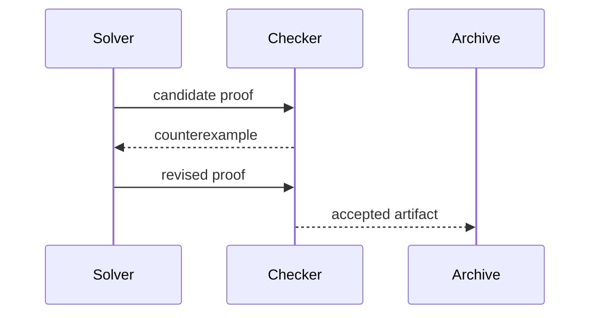
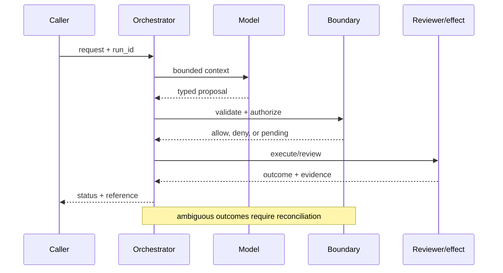

# Mathematical reasoning
Status: emerging
Sources: [DeepMind — 2026-02-11 Deep Think](https://deepmind.google/blog/accelerating-mathematical-and-scientific-discovery-with-gemini-deep-think/); [Lean theorem prover](https://lean-lang.org/)
## In one sentence
Reliable mathematical reasoning combines candidate search with verification and formal constraints.
## Background: what existed before
Language models produced plausible derivations whose arithmetic or premises were unchecked.
## What changed and why now
Deep Think describes parallel reasoning for scientific problems; formal systems provide an independent check.
## Impact on current processing and architecture
Generate candidates, run symbolic/numeric checks, reject failures, and retain proof/evidence artifacts.
## Real-world applications and constraints
Use for tutoring and theorem formalization. Search cost, formalization effort, and hidden assumptions constrain scale.
## Mental model
```mermaid
flowchart LR
 Q[Question]-->S[Search candidates]-->V[Verifier]-->P[Proof/evidence]
 V--fail-->S
 classDef a fill:#dbeafe,stroke:#2563eb,color:#111827; classDef b fill:#dcfce7,stroke:#16a34a,color:#111827; class Q,P a; class S,V b
```

## What changed this month
Deep Think's February source motivates search-plus-verification as the learning concept.
## Engineering consequence
Treat a fluent answer as a hypothesis until an independent checker accepts it.
## Limits and failure modes
A checker can encode the wrong specification; numeric tests do not prove generality; compute costs rise with search.

## SDE2 primer and prerequisites

This lesson treats **mathematical reasoning** as a concrete engineering discipline, not a synonym for model intelligence. Its key artifact is mathematical reasoning evidence and state: the service must preserve it across mathematical reasoning and expose enough evidence for an operator to decide what happened. A model may suggest a next step, but deterministic interfaces, ownership, and versioned records decide whether that suggestion is usable. The useful prerequisite is familiarity with HTTP, JSON, persistence, queues, retries, authentication, and service-level objectives; the topic adds its own state and failure vocabulary.

The useful boundary for mathematical reasoning is **candidate generation, verifier, counterexample, proof obligation, formalization, and inference-time budget**. These are not magic model capabilities. They are interfaces, records, checks, and operating procedures that can be unit-tested. Start with a low-blast-radius workflow and make every external effect attributable to a run ID, actor, policy version, and evidence reference.

## February source reading: fact before inference

For mathematical reasoning, read the February source through its own claim boundary. The cited February event is **Google DeepMind's February 11, 2026 Deep Think report**. DeepMind reports that its Aletheia math research agent uses a natural-language verifier to find flaws, iteratively generate and revise solutions, and can admit failure. The post reports up to 90% on IMO-ProofBench Advanced and says it does not claim Level 3 or Level 4 mathematical advances. These are source-reported results, not a guarantee for arbitrary mathematics. The report or announcement is evidence about what its publisher described. It is not independent validation of the publisher's claims, and it does not specify your data, threat model, latency budget, or regulatory obligations. That distinction matters because a source can motivate a concept without proving that the concept is solved.

For mathematical reasoning, the engineering inference is narrower: turn the cited capability into an operational contract with topic-specific inputs, states, evidence, and failure ownership. Test that contract against ordinary, adversarial, stale, and interrupted work. A source can motivate this design; it cannot guarantee the resulting reliability or safety.

## Historical baseline and problem boundary

The useful reasoning baseline is a final answer judged by examples or a human. It does not expose which transformation failed or whether a proof step is valid. Mathematical reasoning systems add formal representations and checkers so plausible text can be separated from verified derivation.

For **mathematical reasoning**, the mathematical reasoning boundary names mathematical reasoning evidence, the actor, the mutable state, and the rejecting component. Treat read evidence, model proposals, and committed effects as different data classes. A request can influence a proposal but cannot grant authority. Test this boundary with stale, malformed, replayed, and partially completed cases.

## Architecture and data flow

The mathematical reasoning path starts with its own mathematical reasoning evidence admission check, then records topic state, invokes only the needed processor, and finishes at a mathematical reasoning outcome gate for **mathematical reasoning**. Keep policy and configuration revisions beside the work, while generated text remains separate from authorization. Measure the bottleneck that belongs to mathematical reasoning, not a generic agent score.

```mermaid
flowchart LR
  A[Caller] --> I[Identity and tenant]
  I --> C[Context/evidence]
  C --> M[Model proposal]
  M --> B[Candidate Generation boundary]
  B --> X[Effect or review]
  X --> L[(Evidence log)]
  classDef data fill:#dbeafe,stroke:#2563eb,color:#172554; classDef control fill:#dcfce7,stroke:#15803d,color:#14532d; classDef risk fill:#fee2e2,stroke:#dc2626,color:#450a0a
  class A,C,X,L data; class I,B control; class M risk
```

Keep problem statement, normalized expression, candidate derivation, checker result, theory version, and final answer separate. A generated explanation is not a proof artifact. Bind theorem, parser, solver, checker, and search-budget versions to each result so an apparent improvement can be reproduced.

For mathematical reasoning, record a run identifier, actor, purpose, candidate generation, verifier, counterexample, proof obligation, formalization, and inference-time budget, policy and model versions, evidence references, decision, attempts, timestamps, and final state. Add the topic's durable artifact—such as a checkpoint, capability, proof status, privacy budget, or provenance chain—rather than assuming a generic transcript can explain the outcome. Keep raw content behind controlled references and retention rules.

## Processing walkthrough and state

Reasoning state should distinguish parsed, conjectured, searching, proved, disproved, unproved, checker_unavailable, and parser_error. Require the checker state for a verified result. A polished derivation that timed out remains unproved, even when its conclusion sounds likely.



On retry, reuse the mathematical reasoning idempotency key or durable artifact; never ask the model to invent a second action when the first attempt has an unknown outcome.

## Topic mechanics: Mathematical reasoning

### Decision model and topic-specific data contract

A mathematical reasoning service should have a candidate channel and a proof channel. The generator proposes lemmas, definitions, and a derivation; a verifier checks syntax, arithmetic, consistency with assumptions, and—when possible—formal proof. A counterexample generator attacks universal claims. Minor defects return to a reviser with a precise diagnosis; a critical flaw restarts search; an exhausted budget produces abstention. Keep the proof state separate from natural-language explanation so a persuasive paragraph cannot overwrite a failed check. Lean or another prover can validate a formal subset, while symbolic algebra and executable tests cover other parts; none validates an incorrect formalization. For research-level tasks, retrieve literature with citations and record which sources were actually inspected. Allocate inference-time compute by expected value: more search for high-impact claims, less for routine arithmetic. DeepMind says Aletheia uses a natural-language verifier, iterative revision, and failure admission, and reports up to 90% on IMO-ProofBench Advanced while claiming no Level 3 or 4 advances. Those facts motivate the architecture but do not establish general theorem-solving reliability. Evaluate verifier false acceptance as a first-class catastrophic metric.

Ask what **mathematical reasoning** can establish at each transition. The request establishes intent only; the mathematical reasoning evidence and state stage establishes a bounded representation; the next checker, owner, or reconciliation step establishes whether the proposed result is acceptable. A timeout, missing dependency, or ambiguous response therefore becomes an explicit status for **mathematical reasoning**, not an implicit success. Persist the relevant versions and evidence references, and retain unknown, deferred, or needs-review states when the system cannot prove the stronger claim.

Mathematical reasoning experiments should version the problem corpus, normalization rules, proof checker, solver configuration, and evaluator. Record them with each derivation so a higher pass rate can be attributed to better reasoning rather than a weaker parser or changed theorem set.

Proof search needs limits on branch count, solver time, proof length, and external lemma lookups. Stop with `search_exhausted` when the budget is spent; do not relabel an unproved conjecture as false. Keep parser failure, checker rejection, and timeout as separately inspectable results.

Break mathematical reasoning metrics down by task slice, actor or tenant, version, dependency, and outcome class so a healthy average cannot hide a dangerous subgroup.


## Mathematical reasoning: focused design workshop

In mathematical reasoning, keep request prose, retrieved evidence, generated proposals, and the lesson artifact in separate typed fields. mathematical reasoning code owns completeness, freshness, authorization, and promotion of a result; prose only explains intent.

For mathematical reasoning, the event trail must let an operator distinguish bad input, missing topic evidence, stale state, dependency failure, and a confirmed outcome. Record the mathematical reasoning artifact and the decision that moved it between states.

Test proof races. A solver may emit a candidate while the checker uses a different theory version, or a timeout may leave an incomplete derivation that looks polished. Pin the checker and theory manifest, and preserve `unproved` and `checker_unavailable` instead of accepting syntax as proof.

For mathematical reasoning, slice mathematical reasoning evidence metrics by task class, actor or tenant, governing revision, dependency, and final state. Report the topic invariant, useful completion, latency, cost, and recovery burden together; averages are insufficient when a rare mathematical reasoning failure carries the largest consequence.

Save a failing mathematical reasoning input as a regression fixture only after redaction, classification, and capture of the governing version.


## Applications and operational constraints

Start mathematical reasoning in observation or draft mode, compare against a deterministic or human baseline, then expand only a narrow cohort and reversible effect class.

Beyond **mathematical reasoning**, mathematical reasoning applies to workflows where mathematical reasoning evidence matters. Choose an application with a named owner and bounded effects, then document its data residency, access, quota, staffing, latency, and rollback constraints. The right metric differs by deployment; do not import a support or research target without checking the actual user outcome.

Plan proof-search capacity around branch exploration, solver calls, checker time, and reviewer inspection. When the budget is exhausted, return the best candidate as unproved with its search limit. A partial derivation can be useful evidence, but it must not enter a verified-results channel.

## Failure modes, security, and limits

Mathematical reasoning fails when plausible notation hides an invalid step, a parser changes the problem, or a checker accepts an underspecified theory. Normalize inputs visibly, require proof or counterexample status, and use independent checkers where possible. Track checker coverage and unproved outputs rather than reporting only answer accuracy.

Reasoning metrics can improve by testing familiar forms, weakening the checker, or counting plausible final answers despite invalid steps. Pair answer accuracy with proof validation, adversarial variants, parser coverage, and abstention quality. A longer derivation is not evidence unless its critical transitions are checked.

For mathematical reasoning, the February source has a bounded claim. The February source also has scope limits. DeepMind reports that its Aletheia math research agent uses a natural-language verifier to find flaws, iteratively generate and revise solutions, and can admit failure. The post reports up to 90% on IMO-ProofBench Advanced and says it does not claim Level 3 or Level 4 mathematical advances. These are source-reported results, not a guarantee for arbitrary mathematics. Nothing in that observation proves robustness against your adversaries, correctness on your domain, or a particular service-level target. Treat vendor examples as source facts and label recommendations as inference. When evidence is weak, abstention and escalation are valid outcomes.

## Evaluation and change management

Build reasoning fixtures for valid proofs, false lemmas, notation ambiguity, parser failures, checker outage, and resource exhaustion. Assert proof validity separately from answer plausibility. Keep theorem variants hidden and record checker version, search budget, and rejected-step evidence.

Promote a reasoning system only when checked-proof rate, adversarial robustness, parser coverage, and abstention behavior meet floors. Run new solvers against a protected theorem set, retain the prior checker, and mark results produced under a changed theory rather than silently comparing them.

## February primary-source evidence

The source fact is bounded: **DeepMind reports that its Aletheia math research agent uses a natural-language verifier to find flaws, iteratively generate and revise solutions, and can admit failure. The post reports up to 90% on IMO-ProofBench Advanced and says it does not claim Level 3 or Level 4 mathematical advances. These are source-reported results, not a guarantee for arbitrary mathematics.** The February publication date and the publisher's wording should be cited when teaching the event. The recommendation that teams implement candidate generation, verifier, counterexample, proof obligation, formalization, and inference-time budget is an inference from the event plus established systems practice. It should be validated with local fixtures, security review, operational metrics, and domain experts. The source does not independently verify the examples, and this article does not present them as guarantees.

## Mini exercise extension

Create six fixtures for **mathematical reasoning** using the mathematical reasoning vocabulary: a mathematical reasoning evidence omission, a stale or contradictory mathematical reasoning evidence record, an adversarial input, a boundary rejection, a dependency interruption, and a verified completion. Assert different states for each case; do not use one generic success label. Store the evidence reference and recovery owner beside every assertion, then alter the governing version and prove that prior mathematical reasoning records remain historical.

## Build it locally: numbered implementation

1. Construct a mathematical reasoning test record with actor, request, mathematical reasoning evidence, decision, and outcome fields; reject a run that cannot identify the governing version.
2. Implement the mathematical reasoning boundary as a pure function. It must inspect mathematical reasoning evidence, return a typed state, and refuse an unrecognized or incomplete transition.
3. Create a deterministic mathematical reasoning generator with a valid proposal, a malformed proposal, and an input that attempts to redirect the topic-specific decision.
4. Simulate the mathematical reasoning dependency failing after admission. Use its own correlation or artifact key to detect duplicate delivery and reconcile uncertainty.
5. Write an event stream containing mathematical reasoning states, redacting sensitive payloads while retaining the evidence pointers needed for an offline replay.
6. Measure mathematical reasoning correctness alongside rejection rate, time in each state, recovery work, and resource cost; report slices relevant to the lesson.
7. Change the mathematical reasoning schema or policy revision and verify that old events still resolve under their original contract rather than being reinterpreted.

## Runnable low-cost example

```python
def verify(claim, n):
    # counterexample search for the claim "all n in 1..5 pass"
    return all(n * (n + 1) // 2 == sum(range(1, n + 1)) for n in range(1, 6))
print("accepted" if verify("sum", 5) else "revise")
```

This proof sketch demonstrates a simple checker boundary only. It does not establish theorem validity for arbitrary notation, solver completeness, or parser correctness; add false-lemma and theory-version fixtures before accepting results.

## Interview Q&A

**Q: Does a plausible derivation count as a proof?** A: Enforce the mathematical reasoning rule in deterministic code at the resource or artifact boundary; model output may propose, but it cannot authorize or prove the result.

**Q: What separates an answer from a proof?** A: Enforce the mathematical reasoning rule in deterministic code at the resource or artifact boundary; model output may propose, but it cannot authorize or prove the result.

**Q: Which metric would you put on the dashboard first?** A: Track mathematical reasoning evidence, plus false acceptance or rejection, time spent, resource cost, and recovery; slice results by the mathematical reasoning risk classes.

**Q: What should happen when checking times out?** A: Enforce the mathematical reasoning rule in deterministic code at the resource or artifact boundary; model output may propose, but it cannot authorize or prove the result.

**Q: How should mathematical reasoning be released?** A: Pin mathematical reasoning evidence and the governing versions, begin with shadow or reversible work, and require the mathematical reasoning invariant before widening effects.

## Glossary

- **Candidate Generation**: the topic-specific control boundary that mediates a model proposal and an outcome.
- **Run ID**: the correlation key that joins one mathematical reasoning attempt to its actor, mathematical reasoning evidence, decisions, and recovery evidence.
- **Idempotency**: the mathematical reasoning guarantee that a retry does not create a second logical result or duplicate effect.
- **Provenance**: origin, version, and transformation evidence attached to a mathematical reasoning input or artifact.
- **SLO**: an explicit mathematical reasoning service target, such as freshness, verification latency, queue age, or availability.
- **Abstention**: the mathematical reasoning state used when evidence, authority, or dependency health is insufficient for a stronger claim.
- **Inference**: an engineering recommendation about mathematical reasoning derived from source facts rather than presented as a source guarantee.

## References

- [Google DeepMind: Gemini Deep Think — February 11, 2026](https://deepmind.google/blog/accelerating-mathematical-and-scientific-discovery-with-gemini-deep-think/)
- [Lean theorem prover](https://lean-lang.org/)

## Claim ledger

| Claim | Source | Fact or inference |
|---|---|---|
| The cited publisher published the February event on the stated date. | [Google DeepMind's February 11, 2026 Deep Think report](https://deepmind.google/blog/accelerating-mathematical-and-scientific-discovery-with-gemini-deep-think/) | Fact |
| DeepMind reports that its Aletheia math research agent uses a natural-language verifier to find flaws, iteratively generate and revise solutions, and can admit failure. | [Google DeepMind's February 11, 2026 Deep Think report](https://deepmind.google/blog/accelerating-mathematical-and-scientific-discovery-with-gemini-deep-think/) | Fact |
| Treating a fluent derivation as a candidate that must survive independent checks. | Engineering design synthesis | Inference |
| A separately enforced boundary is safer and easier to operate than treating model text as authority. | Topic standards and systems reasoning | Inference |
| The local example demonstrates the concept but does not prove production security, reliability, or generalization. | This lesson | Fact about the example |
